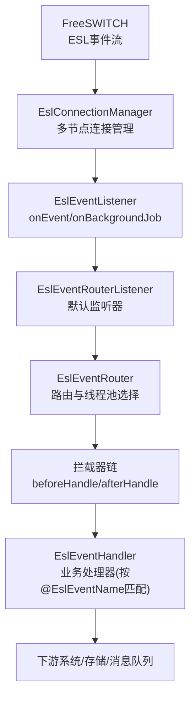
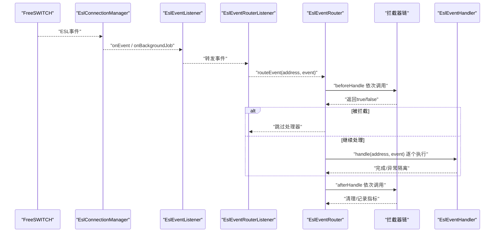
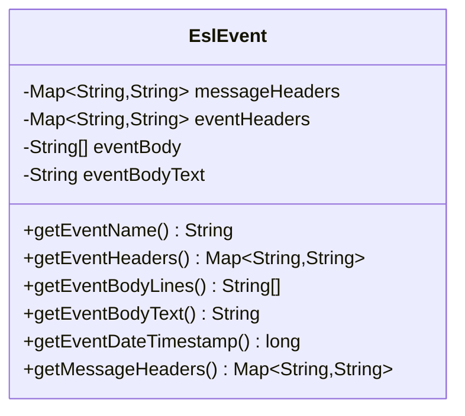
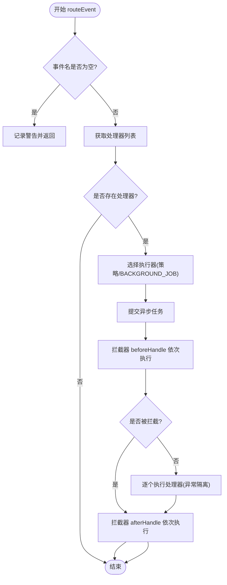
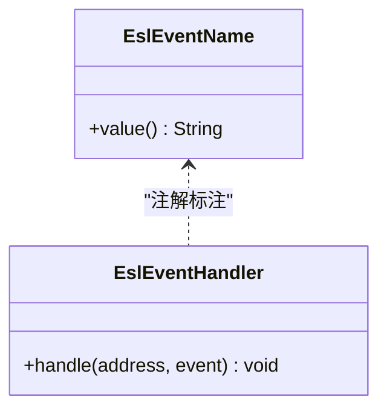
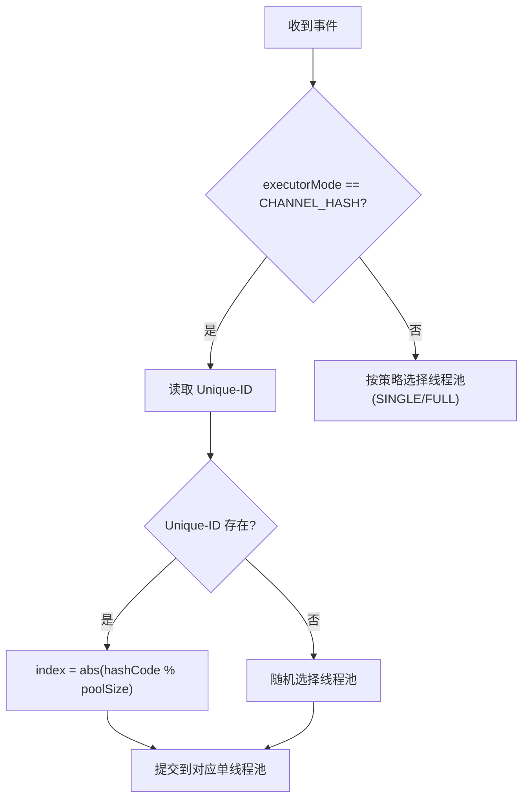
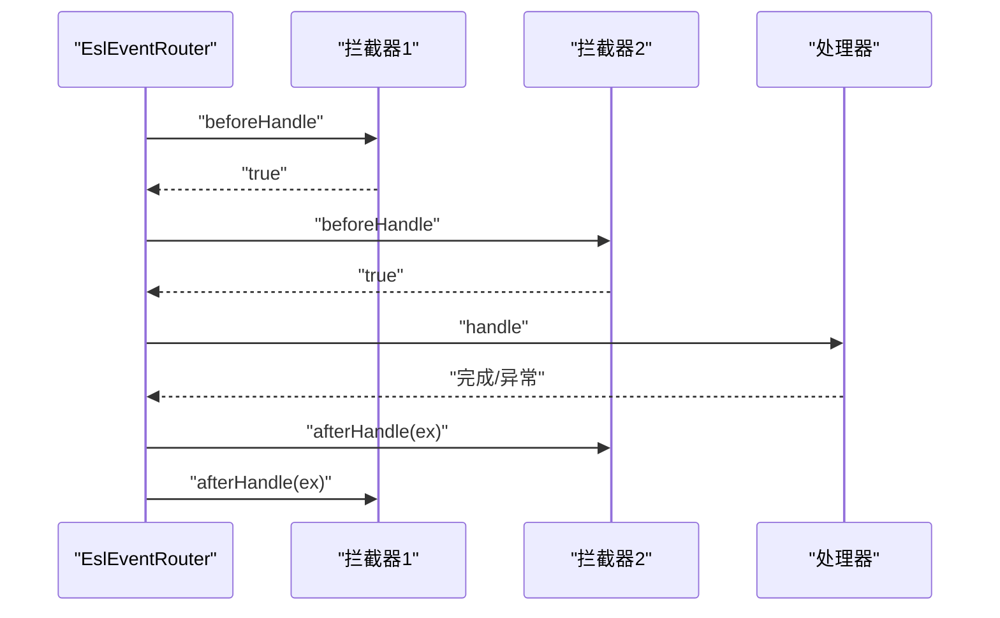
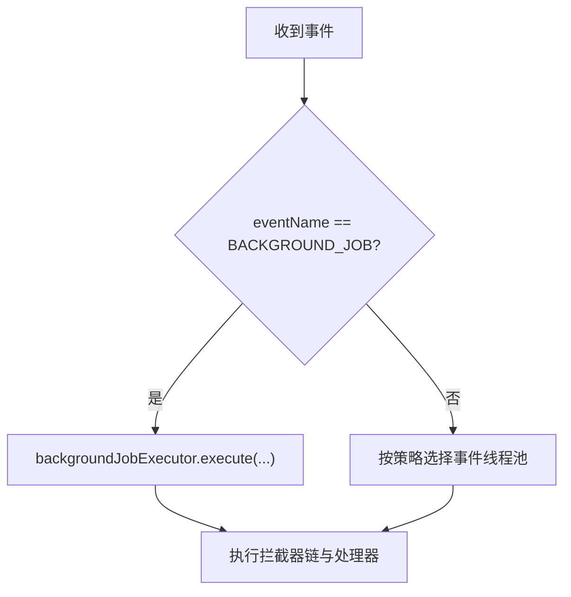
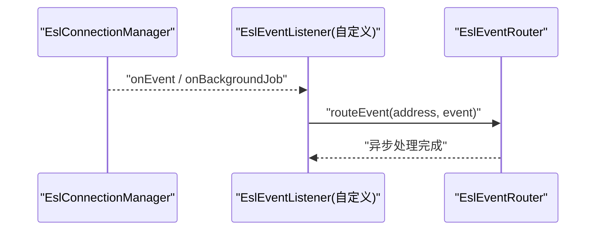
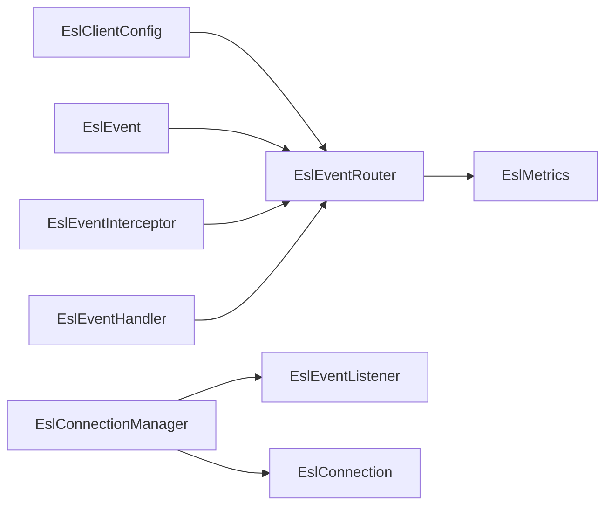

# 事件处理

<cite>
**本文引用的文件**
- [EslEventName.java](file://yudao-cloud/yudao-module-cc/ipcc-fs-esl/src/main/java/cn/ipcc/fs/esl/annotation/EslEventName.java)
- [EslEventRouter.java](file://yudao-cloud/yudao-module-cc/ipcc-fs-esl/src/main/java/cn/ipcc/fs/esl/router/EslEventRouter.java)
- [EslEventHandler.java](file://yudao-cloud/yudao-module-cc/ipcc-fs-esl/src/main/java/cn/ipcc/fs/esl/router/EslEventHandler.java)
- [EslEvent.java](file://yudao-cloud/yudao-module-cc/ipcc-fs-esl/src/main/java/cn/ipcc/fs/esl/transport/EslEvent.java)
- [EslEventInterceptor.java](file://yudao-cloud/yudao-module-cc/ipcc-fs-esl/src/main/java/cn/ipcc/fs/esl/interceptor/EslEventInterceptor.java)
- [EslMetricsInterceptor.java](file://yudao-cloud/yudao-module-cc/ipcc-fs-esl/src/main/java/cn/ipcc/fs/esl/interceptor/EslMetricsInterceptor.java)
- [EslEventListener.java](file://yudao-cloud/yudao-module-cc/ipcc-fs-esl/src/main/java/cn/ipcc/fs/esl/listener/EslEventListener.java)
- [EslEventRouterListener.java](file://yudao-cloud/yudao-module-cc/ipcc-fs-esl/src/main/java/cn/ipcc/fs/esl/spring/EslEventRouterListener.java)
- [EslConnectionManager.java](file://yudao-cloud/yudao-module-cc/ipcc-fs-esl/src/main/java/cn/ipcc/fs/esl/EslConnectionManager.java)
</cite>

## 目录
1. [简介](#简介)
2. [项目结构](#项目结构)
3. [核心组件](#核心组件)
4. [架构总览](#架构总览)
5. [详细组件分析](#详细组件分析)
6. [依赖关系分析](#依赖关系分析)
7. [性能考虑](#性能考虑)
8. [故障排查指南](#故障排查指南)
9. [结论](#结论)
10. [附录](#附录)

## 简介
本文件面向IPCC呼叫中心系统的FreeSWITCH ESL事件处理子系统，系统化说明ESL事件的分类、解析流程、路由机制与执行模型；解释基于@EslEventName注解的事件处理器框架、通道一致性哈希保证事件顺序、事件拦截器链机制；文档化BACKGROUND_JOB分离处理、事件监听器开发、事件数据模型（EslEvent）；并提供事件处理性能优化、异常处理、调试技巧以及自定义事件处理器开发示例与最佳实践。

## 项目结构
ESL事件处理位于模块 ipcc-fs-esl 中，围绕“连接管理—事件监听—路由器—处理器—拦截器”分层组织：
- 连接层：EslConnectionManager 负责多FS节点连接管理与事件分发入口
- 监听层：EslEventListener 定义事件回调接口，EslEventRouterListener 将事件转发到路由器
- 路由层：EslEventRouter 实现事件名到处理器列表的映射、线程池选择、拦截器链执行
- 处理器层：EslEventHandler 为业务事件处理器接口，配合 @EslEventName 完成自动注册与按序执行
- 数据层：EslEvent 封装事件头、事件体、时间戳等
- 拦截器层：EslEventInterceptor 提供通用横切逻辑（指标、过滤、追踪），内置 EslMetricsInterceptor

图表来源
- [EslConnectionManager.java:141-195](file://yudao-cloud/yudao-module-cc/ipcc-fs-esl/src/main/java/cn/ipcc/fs/esl/EslConnectionManager.java#L141-L195)
- [EslEventListener.java:12-27](file://yudao-cloud/yudao-module-cc/ipcc-fs-esl/src/main/java/cn/ipcc/fs/esl/listener/EslEventListener.java#L12-L27)
- [EslEventRouterListener.java:31-45](file://yudao-cloud/yudao-module-cc/ipcc-fs-esl/src/main/java/cn/ipcc/fs/esl/spring/EslEventRouterListener.java#L31-L45)
- [EslEventRouter.java:106-174](file://yudao-cloud/yudao-module-cc/ipcc-fs-esl/src/main/java/cn/ipcc/fs/esl/router/EslEventRouter.java#L106-L174)

章节来源
- [EslConnectionManager.java:19-28](file://yudao-cloud/yudao-module-cc/ipcc-fs-esl/src/main/java/cn/ipcc/fs/esl/EslConnectionManager.java#L19-L28)
- [EslEventRouter.java:14-31](file://yudao-cloud/yudao-module-cc/ipcc-fs-esl/src/main/java/cn/ipcc/fs/esl/router/EslEventRouter.java#L14-L31)

## 核心组件
- EslEventRouter：事件路由中心，维护事件名→处理器列表映射，支持三种执行策略（CHANNEL_HASH、SINGLE_THREAD、FULL_CONCURRENT），并隔离 BACKGROUND_JOB 独立线程池。
- EslEventHandler：业务事件处理器接口，通过 @EslEventName 指定事件名，同一事件可注册多个处理器并按 @Order 排序执行。
- EslEvent：事件数据模型，封装事件头、事件体、原始消息头及时间戳，支持 plain 格式解析与URL解码。
- EslEventInterceptor：拦截器接口，提供 beforeHandle/afterHandle 扩展点，用于日志、追踪、过滤、指标统计等。
- EslEventListener：事件监听接口，接收普通事件与 BACKGROUND_JOB 事件；默认实现 EslEventRouterListener 将事件转发至路由器。
- EslConnectionManager：多FS节点连接管理器，提供事件监听器注册、bgapi批量发送、节点同步等能力。

章节来源
- [EslEventRouter.java:33-74](file://yudao-cloud/yudao-module-cc/ipcc-fs-esl/src/main/java/cn/ipcc/fs/esl/router/EslEventRouter.java#L33-L74)
- [EslEventHandler.java:5-18](file://yudao-cloud/yudao-module-cc/ipcc-fs-esl/src/main/java/cn/ipcc/fs/esl/router/EslEventHandler.java#L5-L18)
- [EslEvent.java:10-16](file://yudao-cloud/yudao-module-cc/ipcc-fs-esl/src/main/java/cn/ipcc/fs/esl/transport/EslEvent.java#L10-L16)
- [EslEventInterceptor.java:5-14](file://yudao-cloud/yudao-module-cc/ipcc-fs-esl/src/main/java/cn/ipcc/fs/esl/interceptor/EslEventInterceptor.java#L5-L14)
- [EslEventListener.java:5-27](file://yudao-cloud/yudao-module-cc/ipcc-fs-esl/src/main/java/cn/ipcc/fs/esl/listener/EslEventListener.java#L5-L27)
- [EslConnectionManager.java:19-28](file://yudao-cloud/yudao-module-cc/ipcc-fs-esl/src/main/java/cn/ipcc/fs/esl/EslConnectionManager.java#L19-L28)

## 架构总览
ESL事件从FreeSWITCH进入后，经连接管理器广播给所有已注册的监听器；默认监听器将事件统一交给路由器；路由器根据事件名查找处理器列表，依次执行拦截器前置逻辑、处理器、拦截器后置逻辑；BACKGROUND_JOB 走独立线程池避免与普通事件互相阻塞；执行策略决定线程分配方式，确保通道内事件顺序或全局并发。

图表来源
- [EslConnectionManager.java:207-217](file://yudao-cloud/yudao-module-cc/ipcc-fs-esl/src/main/java/cn/ipcc/fs/esl/EslConnectionManager.java#L207-L217)
- [EslEventRouterListener.java:31-45](file://yudao-cloud/yudao-module-cc/ipcc-fs-esl/src/main/java/cn/ipcc/fs/esl/spring/EslEventRouterListener.java#L31-L45)
- [EslEventRouter.java:106-153](file://yudao-cloud/yudao-module-cc/ipcc-fs-esl/src/main/java/cn/ipcc/fs/esl/router/EslEventRouter.java#L106-L153)
- [EslEventInterceptor.java:17-29](file://yudao-cloud/yudao-module-cc/ipcc-fs-esl/src/main/java/cn/ipcc/fs/esl/interceptor/EslEventInterceptor.java#L17-L29)

## 详细组件分析

### 事件数据模型：EslEvent
- 组成：事件头（eventHeaders）、事件体行列表（eventBody）、完整事件体文本（eventBodyText）、原始消息头（messageHeaders）。
- 解析：plain 格式下，遇到 Content-Length 之前的行作为事件头（值做URL解码），之后的行作为事件体；兼容 JSON 格式但走相同逻辑。
- 时间戳：Event-Date-Timestamp 以微秒为单位，缺失或非数字时返回0，避免NPE影响主流程。
- 访问API：getEventName()、getEventHeaders()、getEventBodyLines()、getEventBodyText()、getEventDateTimestamp()、getMessageHeaders()。

图表来源
- [EslEvent.java:20-27](file://yudao-cloud/yudao-module-cc/ipcc-fs-esl/src/main/java/cn/ipcc/fs/esl/transport/EslEvent.java#L20-L27)
- [EslEvent.java:42-100](file://yudao-cloud/yudao-module-cc/ipcc-fs-esl/src/main/java/cn/ipcc/fs/esl/transport/EslEvent.java#L42-L100)
- [EslEvent.java:102-133](file://yudao-cloud/yudao-module-cc/ipcc-fs-esl/src/main/java/cn/ipcc/fs/esl/transport/EslEvent.java#L102-L133)

章节来源
- [EslEvent.java:10-16](file://yudao-cloud/yudao-module-cc/ipcc-fs-esl/src/main/java/cn/ipcc/fs/esl/transport/EslEvent.java#L10-L16)
- [EslEvent.java:35-40](file://yudao-cloud/yudao-module-cc/ipcc-fs-esl/src/main/java/cn/ipcc/fs/esl/transport/EslEvent.java#L35-L40)
- [EslEvent.java:74-92](file://yudao-cloud/yudao-module-cc/ipcc-fs-esl/src/main/java/cn/ipcc/fs/esl/transport/EslEvent.java#L74-L92)
- [EslEvent.java:102-133](file://yudao-cloud/yudao-module-cc/ipcc-fs-esl/src/main/java/cn/ipcc/fs/esl/transport/EslEvent.java#L102-L133)

### 事件路由与执行模型：EslEventRouter
- 处理器注册：启动时扫描 @EslEventName 标注的处理器，建立 eventName → List<EslEventHandler> 映射。
- 路由流程：校验事件名与处理器存在性，统计路由次数；根据执行策略选择线程池；在异步任务中执行拦截器链与处理器；异常隔离每个处理器。
- 执行策略：
  - CHANNEL_HASH（推荐）：按 Unique-ID hash 分配到固定单线程池，保证同一通道事件顺序。
  - SINGLE_THREAD：所有事件一个线程，适用于低并发场景。
  - FULL_CONCURRENT：线程池并发执行，适用于事件无关联场景。
- BACKGROUND_JOB 分离：始终使用独立线程池，避免与普通事件互相阻塞。
- 拒绝策略：ABORT/DISCARD/CALLER_RUNS 可配置。

图表来源
- [EslEventRouter.java:106-153](file://yudao-cloud/yudao-module-cc/ipcc-fs-esl/src/main/java/cn/ipcc/fs/esl/router/EslEventRouter.java#L106-L153)
- [EslEventRouter.java:155-174](file://yudao-cloud/yudao-module-cc/ipcc-fs-esl/src/main/java/cn/ipcc/fs/esl/router/EslEventRouter.java#L155-L174)
- [EslEventRouter.java:176-185](file://yudao-cloud/yudao-module-cc/ipcc-fs-esl/src/main/java/cn/ipcc/fs/esl/router/EslEventRouter.java#L176-L185)

章节来源
- [EslEventRouter.java:14-31](file://yudao-cloud/yudao-module-cc/ipcc-fs-esl/src/main/java/cn/ipcc/fs/esl/router/EslEventRouter.java#L14-L31)
- [EslEventRouter.java:43-74](file://yudao-cloud/yudao-module-cc/ipcc-fs-esl/src/main/java/cn/ipcc/fs/esl/router/EslEventRouter.java#L43-L74)
- [EslEventRouter.java:81-88](file://yudao-cloud/yudao-module-cc/ipcc-fs-esl/src/main/java/cn/ipcc/fs/esl/router/EslEventRouter.java#L81-L88)
- [EslEventRouter.java:106-174](file://yudao-cloud/yudao-module-cc/ipcc-fs-esl/src/main/java/cn/ipcc/fs/esl/router/EslEventRouter.java#L106-L174)

### 事件处理器框架：@EslEventName 驱动
- 注解作用：标注在 EslEventHandler 实现类上，声明处理的事件名；同一事件名可注册多个处理器，按 Spring @Order 排序执行。
- 自动装配：由路由器在启动时扫描并注册，无需手动维护映射。
- 异常隔离：每个处理器异常不影响其他处理器执行。

图表来源
- [EslEventName.java:5-16](file://yudao-cloud/yudao-module-cc/ipcc-fs-esl/src/main/java/cn/ipcc/fs/esl/annotation/EslEventName.java#L5-L16)
- [EslEventHandler.java:5-18](file://yudao-cloud/yudao-module-cc/ipcc-fs-esl/src/main/java/cn/ipcc/fs/esl/router/EslEventHandler.java#L5-L18)

章节来源
- [EslEventName.java:5-16](file://yudao-cloud/yudao-module-cc/ipcc-fs-esl/src/main/java/cn/ipcc/fs/esl/annotation/EslEventName.java#L5-L16)
- [EslEventHandler.java:5-18](file://yudao-cloud/yudao-module-cc/ipcc-fs-esl/src/main/java/cn/ipcc/fs/esl/router/EslEventHandler.java#L5-L18)

### 通道一致性哈希保证事件顺序
- 原理：当 executorMode=CHANNEL_HASH 时，路由器根据事件头中的 Unique-ID 计算哈希，分配到固定的单线程池实例，从而保证同一通道的事件顺序。
- 降级：若 Unique-ID 缺失，则随机选择一个线程池实例。

图表来源
- [EslEventRouter.java:155-174](file://yudao-cloud/yudao-module-cc/ipcc-fs-esl/src/main/java/cn/ipcc/fs/esl/router/EslEventRouter.java#L155-L174)

章节来源
- [EslEventRouter.java:155-174](file://yudao-cloud/yudao-module-cc/ipcc-fs-esl/src/main/java/cn/ipcc/fs/esl/router/EslEventRouter.java#L155-L174)

### 事件拦截器链机制
- 设计：拦截器链在异步任务内执行，确保 beforeHandle/handler/afterHandle 在同一线程，使 ThreadLocal（如 traceId）可透传。
- 行为：beforeHandle 返回 false 则终止后续处理器；afterHandle 无论是否发生异常都会执行，用于资源清理与指标记录。
- 内置实现：EslMetricsInterceptor 统计事件接收量、处理延迟、异常率，并使用 ThreadLocal 记录开始时间，finally 清理防止线程复用串数据。

图表来源
- [EslEventRouter.java:119-153](file://yudao-cloud/yudao-module-cc/ipcc-fs-esl/src/main/java/cn/ipcc/fs/esl/router/EslEventRouter.java#L119-L153)
- [EslEventInterceptor.java:17-29](file://yudao-cloud/yudao-module-cc/ipcc-fs-esl/src/main/java/cn/ipcc/fs/esl/interceptor/EslEventInterceptor.java#L17-L29)
- [EslMetricsInterceptor.java:27-61](file://yudao-cloud/yudao-module-cc/ipcc-fs-esl/src/main/java/cn/ipcc/fs/esl/interceptor/EslMetricsInterceptor.java#L27-L61)

章节来源
- [EslEventInterceptor.java:5-14](file://yudao-cloud/yudao-module-cc/ipcc-fs-esl/src/main/java/cn/ipcc/fs/esl/interceptor/EslEventInterceptor.java#L5-L14)
- [EslMetricsInterceptor.java:6-15](file://yudao-cloud/yudao-module-cc/ipcc-fs-esl/src/main/java/cn/ipcc/fs/esl/interceptor/EslMetricsInterceptor.java#L6-L15)
- [EslMetricsInterceptor.java:27-61](file://yudao-cloud/yudao-module-cc/ipcc-fs-esl/src/main/java/cn/ipcc/fs/esl/interceptor/EslMetricsInterceptor.java#L27-L61)

### BACKGROUND_JOB 分离处理
- 背景：BACKGROUND_JOB 事件来自 bgapi 异步命令结果，可能耗时较长且与常规事件不同步。
- 机制：路由器检测到 eventName=BACKGROUND_JOB 时，直接委派到独立的 backgroundJobExecutor（固定大小线程池），避免与普通事件互相阻塞。
- 监听：EslEventRouterListener.onBackgroundJob 同样调用 router.routeEvent，由路由器内部识别并分流。

图表来源
- [EslEventRouter.java:70-73](file://yudao-cloud/yudao-module-cc/ipcc-fs-esl/src/main/java/cn/ipcc/fs/esl/router/EslEventRouter.java#L70-L73)
- [EslEventRouter.java:155-160](file://yudao-cloud/yudao-module-cc/ipcc-fs-esl/src/main/java/cn/ipcc/fs/esl/router/EslEventRouter.java#L155-L160)
- [EslEventRouterListener.java:36-45](file://yudao-cloud/yudao-module-cc/ipcc-fs-esl/src/main/java/cn/ipcc/fs/esl/spring/EslEventRouterListener.java#L36-L45)

章节来源
- [EslEventRouter.java:155-160](file://yudao-cloud/yudao-module-cc/ipcc-fs-esl/src/main/java/cn/ipcc/fs/esl/router/EslEventRouter.java#L155-L160)
- [EslEventRouterListener.java:36-45](file://yudao-cloud/yudao-module-cc/ipcc-fs-esl/src/main/java/cn/ipcc/fs/esl/spring/EslEventRouterListener.java#L36-L45)

### 事件监听器开发
- 接口：EslEventListener 提供 onEvent 与 onBackgroundJob 两个回调；默认实现将两者合并处理。
- 默认监听器：EslEventRouterListener 将事件转发到路由器；若容器中存在自定义 EslEventListener Bean，则不会注册默认监听器，需自行调用 router.routeEvent。
- 注册：EslConnectionManager.addEventListener 会将监听器添加到所有现有节点，并对后续新增节点自动生效。

图表来源
- [EslEventListener.java:12-27](file://yudao-cloud/yudao-module-cc/ipcc-fs-esl/src/main/java/cn/ipcc/fs/esl/listener/EslEventListener.java#L12-L27)
- [EslEventRouterListener.java:31-45](file://yudao-cloud/yudao-module-cc/ipcc-fs-esl/src/main/java/cn/ipcc/fs/esl/spring/EslEventRouterListener.java#L31-L45)
- [EslConnectionManager.java:207-217](file://yudao-cloud/yudao-module-cc/ipcc-fs-esl/src/main/java/cn/ipcc/fs/esl/EslConnectionManager.java#L207-L217)

章节来源
- [EslEventListener.java:5-27](file://yudao-cloud/yudao-module-cc/ipcc-fs-esl/src/main/java/cn/ipcc/fs/esl/listener/EslEventListener.java#L5-L27)
- [EslEventRouterListener.java:7-15](file://yudao-cloud/yudao-module-cc/ipcc-fs-esl/src/main/java/cn/ipcc/fs/esl/spring/EslEventRouterListener.java#L7-L15)
- [EslConnectionManager.java:207-217](file://yudao-cloud/yudao-module-cc/ipcc-fs-esl/src/main/java/cn/ipcc/fs/esl/EslConnectionManager.java#L207-L217)

### 自定义事件处理器开发示例与最佳实践
- 步骤：
  1) 实现 EslEventHandler 接口，重写 handle 方法。
  2) 使用 @EslEventName(value="EVENT_NAME") 标注处理器类，声明要处理的事件名。
  3) 注册为 Spring Bean，由路由器自动发现并加入处理器列表。
  4) 如需顺序控制，使用 @Order 指定执行顺序。
- 最佳实践：
  - 处理器内保持轻量快速，避免阻塞；复杂逻辑应异步化或入队。
  - 对异常进行捕获与记录，避免影响同事件其他处理器。
  - 合理使用拦截器进行日志、追踪、过滤与指标统计。
  - 对于需要顺序性的业务（如通话状态机），确保 CHANNEL_HASH 模式启用，并保证事件头包含 Unique-ID。

章节来源
- [EslEventHandler.java:5-18](file://yudao-cloud/yudao-module-cc/ipcc-fs-esl/src/main/java/cn/ipcc/fs/esl/router/EslEventHandler.java#L5-L18)
- [EslEventName.java:5-16](file://yudao-cloud/yudao-module-cc/ipcc-fs-esl/src/main/java/cn/ipcc/fs/esl/annotation/EslEventName.java#L5-L16)
- [EslEventRouter.java:131-139](file://yudao-cloud/yudao-module-cc/ipcc-fs-esl/src/main/java/cn/ipcc/fs/esl/router/EslEventRouter.java#L131-L139)

## 依赖关系分析
- EslEventRouter 依赖：
  - EslClientConfig：获取执行模式、线程池大小、队列容量、拒绝策略。
  - EslEvent：获取事件名与事件头（如 Unique-ID）。
  - EslEventInterceptor：拦截器链。
  - EslEventHandler：业务处理器集合。
- EslConnectionManager 依赖：
  - EslEventListener：事件回调。
  - EslConnection：具体节点连接与命令发送。
- 外部集成：
  - FreeSWITCH：通过 ESL 协议推送事件与响应。
  - 指标系统：通过 EslMetrics 上报事件计数与延迟。

图表来源
- [EslEventRouter.java:33-41](file://yudao-cloud/yudao-module-cc/ipcc-fs-esl/src/main/java/cn/ipcc/fs/esl/router/EslEventRouter.java#L33-L41)
- [EslEventRouter.java:106-174](file://yudao-cloud/yudao-module-cc/ipcc-fs-esl/src/main/java/cn/ipcc/fs/esl/router/EslEventRouter.java#L106-L174)
- [EslConnectionManager.java:33-36](file://yudao-cloud/yudao-module-cc/ipcc-fs-esl/src/main/java/cn/ipcc/fs/esl/EslConnectionManager.java#L33-L36)
- [EslMetricsInterceptor.java:18-24](file://yudao-cloud/yudao-module-cc/ipcc-fs-esl/src/main/java/cn/ipcc/fs/esl/interceptor/EslMetricsInterceptor.java#L18-L24)

章节来源
- [EslEventRouter.java:33-41](file://yudao-cloud/yudao-module-cc/ipcc-fs-esl/src/main/java/cn/ipcc/fs/esl/router/EslEventRouter.java#L33-L41)
- [EslConnectionManager.java:33-36](file://yudao-cloud/yudao-module-cc/ipcc-fs-esl/src/main/java/cn/ipcc/fs/esl/EslConnectionManager.java#L33-L36)

## 性能考虑
- 执行策略选择：
  - CHANNEL_HASH：推荐，保证同一通道事件顺序，适合呼叫状态机等强有序场景。
  - SINGLE_THREAD：简单但吞吐受限，仅适用于低并发。
  - FULL_CONCURRENT：高吞吐但无序，适合无关联事件。
- 线程池与队列：
  - 合理设置 eventThreadPoolSize、queueCapacity 与 rejectedPolicy，避免背压导致丢事件或阻塞。
  - BACKGROUND_JOB 独立线程池避免长耗时任务拖垮普通事件。
- 拦截器开销：
  - 指标统计使用 ThreadLocal 记录开始时间，finally 清理，避免线程池复用串数据。
  - 避免在 beforeHandle/afterHandle 中进行重IO或阻塞操作。
- 事件解析：
  - EslEvent 对事件头值进行URL解码，异常时降级使用原始值，保证事件不丢失。
- 监控与调优：
  - 关注 totalRouted、事件延迟分布、异常率；结合 EslMetrics 进行观测。
  - 在高负载下优先采用 CHANNEL_HASH 并评估 Unique-ID 分布均匀性。

[本节为通用指导，不直接分析具体文件]

## 故障排查指南
- 事件未到达处理器：
  - 检查事件名是否正确，确认 @EslEventName 值与事件头 Event-Name 一致。
  - 确认处理器已注册为 Spring Bean 并被路由器扫描。
- 事件顺序错乱：
  - 确认 executorMode=CHANNEL_HASH，且事件头包含 Unique-ID。
- 事件被拦截：
  - 检查自定义拦截器 beforeHandle 返回值；必要时添加日志定位。
- 长时间运行事件阻塞：
  - 确认 BACKGROUND_JOB 是否走独立线程池；避免在处理器内进行阻塞IO。
- 指标异常：
  - 检查 EslMetricsInterceptor 的 ThreadLocal 是否在 finally 清理；确认 beforeHandle/afterHandle 在同一线程执行。
- 连接问题：
  - 使用 EslConnectionManager.getAvailableAddresses 查看可用节点；sendBgapiCommand 失败时检查节点状态与超时配置。

章节来源
- [EslEventRouter.java:106-153](file://yudao-cloud/yudao-module-cc/ipcc-fs-esl/src/main/java/cn/ipcc/fs/esl/router/EslEventRouter.java#L106-L153)
- [EslEventRouter.java:155-174](file://yudao-cloud/yudao-module-cc/ipcc-fs-esl/src/main/java/cn/ipcc/fs/esl/router/EslEventRouter.java#L155-L174)
- [EslMetricsInterceptor.java:27-61](file://yudao-cloud/yudao-module-cc/ipcc-fs-esl/src/main/java/cn/ipcc/fs/esl/interceptor/EslMetricsInterceptor.java#L27-L61)
- [EslConnectionManager.java:121-139](file://yudao-cloud/yudao-module-cc/ipcc-fs-esl/src/main/java/cn/ipcc/fs/esl/EslConnectionManager.java#L121-L139)
- [EslConnectionManager.java:187-195](file://yudao-cloud/yudao-module-cc/ipcc-fs-esl/src/main/java/cn/ipcc/fs/esl/EslConnectionManager.java#L187-L195)

## 结论
该ESL事件处理子系统通过注解驱动的处理器框架、灵活的执行策略与拦截器链机制，提供了高可靠、可扩展、易观测的事件处理能力。CHANNEL_HASH 保证通道内事件顺序，BACKGROUND_JOB 分离避免阻塞，EslEvent 数据模型简化了解析与访问。结合合理的线程池配置与指标监控，可在高并发呼叫中心场景中稳定运行。

[本节为总结，不直接分析具体文件]

## 附录
- 关键路径参考：
  - 事件路由与执行：[EslEventRouter.java:106-174](file://yudao-cloud/yudao-module-cc/ipcc-fs-esl/src/main/java/cn/ipcc/fs/esl/router/EslEventRouter.java#L106-L174)
  - 事件数据模型解析：[EslEvent.java:102-133](file://yudao-cloud/yudao-module-cc/ipcc-fs-esl/src/main/java/cn/ipcc/fs/esl/transport/EslEvent.java#L102-L133)
  - 拦截器链与指标：[EslMetricsInterceptor.java:27-61](file://yudao-cloud/yudao-module-cc/ipcc-fs-esl/src/main/java/cn/ipcc/fs/esl/interceptor/EslMetricsInterceptor.java#L27-L61)
  - 监听器与默认转发：[EslEventRouterListener.java:31-45](file://yudao-cloud/yudao-module-cc/ipcc-fs-esl/src/main/java/cn/ipcc/fs/esl/spring/EslEventRouterListener.java#L31-L45)
  - 多节点连接管理：[EslConnectionManager.java:141-195](file://yudao-cloud/yudao-module-cc/ipcc-fs-esl/src/main/java/cn/ipcc/fs/esl/EslConnectionManager.java#L141-L195)

[本节为索引，不直接分析具体文件]