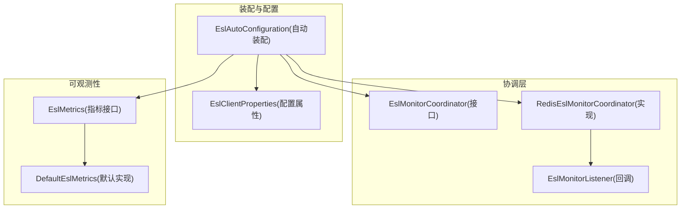
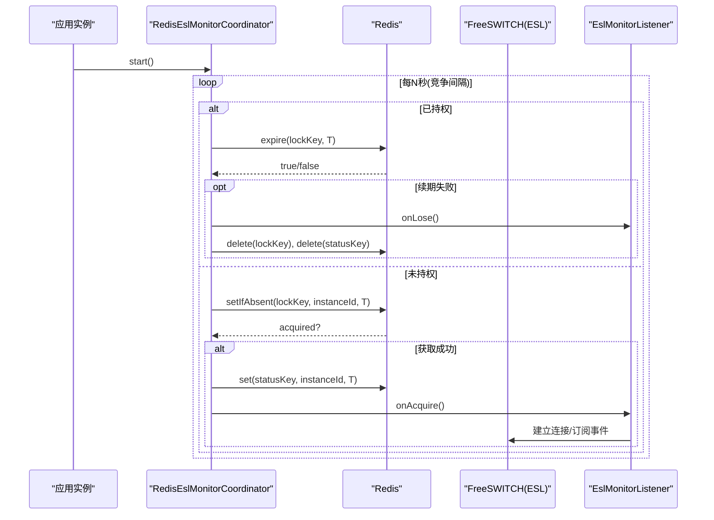
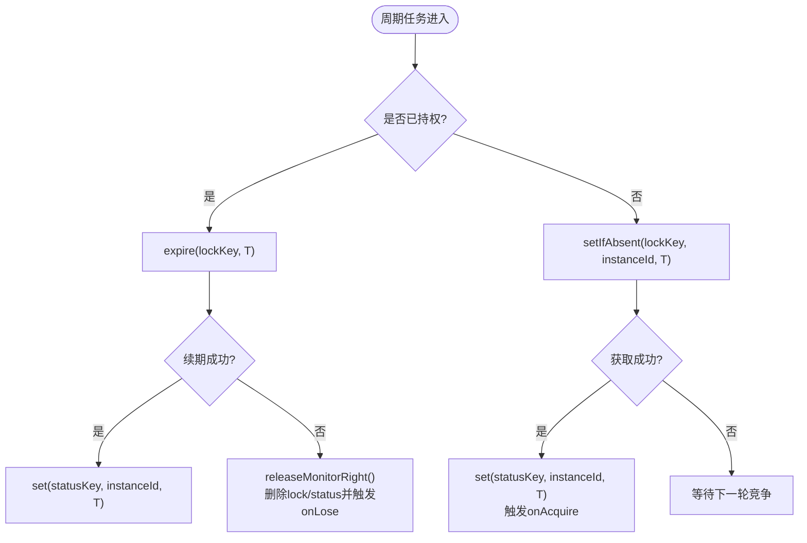
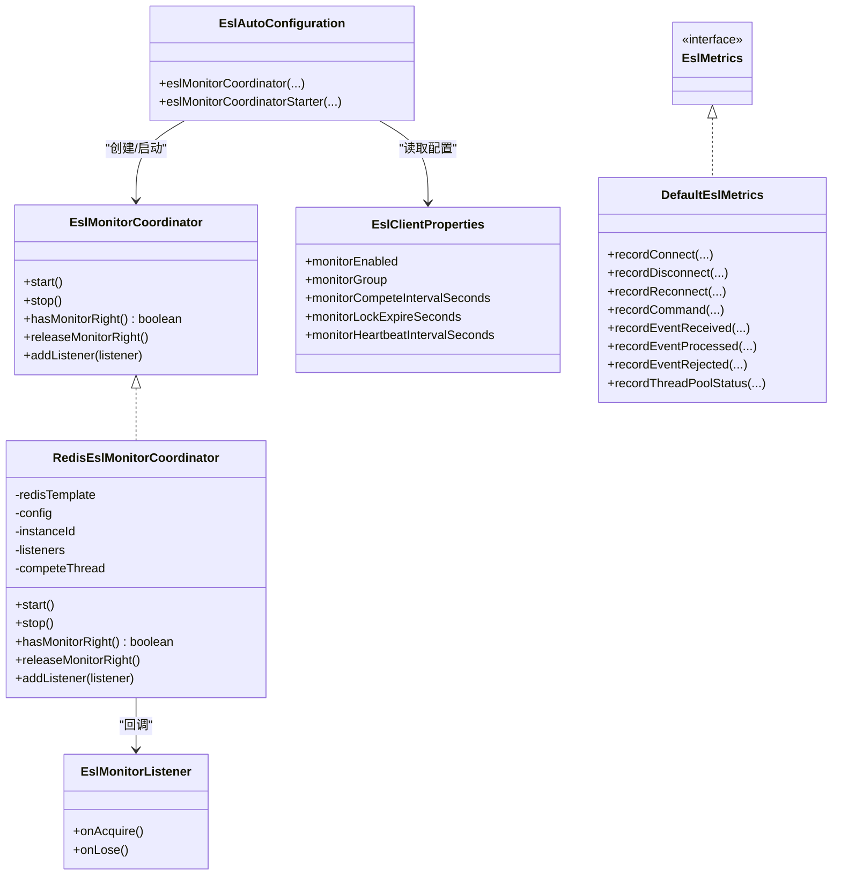

# 分布式协调

<cite>
**本文引用的文件**
- [RedisEslMonitorCoordinator.java](file://yudao-cloud/yudao-module-cc/ipcc-fs-esl/src/main/java/cn/ipcc/fs/esl/coordinator/redis/RedisEslMonitorCoordinator.java)
- [EslMonitorCoordinator.java](file://yudao-cloud/yudao-module-cc/ipcc-fs-esl/src/main/java/cn/ipcc/fs/esl/coordinator/EslMonitorCoordinator.java)
- [EslMonitorListener.java](file://yudao-cloud/yudao-module-cc/ipcc-fs-esl/src/main/java/cn/ipcc/fs/esl/coordinator/EslMonitorListener.java)
- [EslAutoConfiguration.java](file://yudao-cloud/yudao-module-cc/ipcc-fs-esl/src/main/java/cn/ipcc/fs/esl/spring/EslAutoConfiguration.java)
- [EslClientProperties.java](file://yudao-cloud/yudao-module-cc/ipcc-fs-esl/src/main/java/cn/ipcc/fs/esl/spring/EslClientProperties.java)
- [DefaultEslMetrics.java](file://yudao-cloud/yudao-module-cc/ipcc-fs-esl/src/main/java/cn/ipcc/fs/esl/metrics/DefaultEslMetrics.java)
- [EslMetrics.java](file://yudao-cloud/yudao-module-cc/ipcc-fs-esl/src/main/java/cn/ipcc/fs/esl/metrics/EslMetrics.java)
</cite>

## 目录
1. [简介](#简介)
2. [项目结构](#项目结构)
3. [核心组件](#核心组件)
4. [架构总览](#架构总览)
5. [详细组件分析](#详细组件分析)
6. [依赖关系分析](#依赖关系分析)
7. [性能与扩展性](#性能与扩展性)
8. [监控指标与可观测性](#监控指标与可观测性)
9. [部署与配置示例](#部署与配置示例)
10. [故障排查指南](#故障排查指南)
11. [结论](#结论)

## 简介
本文件面向IPCC呼叫中心系统中FreeSWITCH ESL的分布式协调方案，重点说明基于Redis的多实例监听权竞争机制，确保同一组内仅有一个实例持有ESL监听权，避免重复处理事件。文档覆盖监听权获取、心跳续期、监听权切换回调、分布式锁实现、故障转移、集群扩展性、协调器配置、监控指标、性能调优以及多实例部署与问题排查要点。

## 项目结构
围绕ESL分布式协调的关键代码位于ipcc-fs-esl模块中：
- 协调器接口与监听回调：coordinator包
- Redis实现：coordinator/redis包
- Spring自动装配与配置绑定：spring包
- 监控指标：metrics包

图表来源
- [EslAutoConfiguration.java:135-169](file://yudao-cloud/yudao-module-cc/ipcc-fs-esl/src/main/java/cn/ipcc/fs/esl/spring/EslAutoConfiguration.java#L135-L169)
- [EslMonitorCoordinator.java:1-33](file://yudao-cloud/yudao-module-cc/ipcc-fs-esl/src/main/java/cn/ipcc/fs/esl/coordinator/EslMonitorCoordinator.java#L1-L33)
- [RedisEslMonitorCoordinator.java:16-158](file://yudao-cloud/yudao-module-cc/ipcc-fs-esl/src/main/java/cn/ipcc/fs/esl/coordinator/redis/RedisEslMonitorCoordinator.java#L16-L158)
- [EslClientProperties.java:58-68](file://yudao-cloud/yudao-module-cc/ipcc-fs-esl/src/main/java/cn/ipcc/fs/esl/spring/EslClientProperties.java#L58-L68)
- [EslMetrics.java:1-26](file://yudao-cloud/yudao-module-cc/ipcc-fs-esl/src/main/java/cn/ipcc/fs/esl/metrics/EslMetrics.java#L1-L26)
- [DefaultEslMetrics.java:1-79](file://yudao-cloud/yudao-module-cc/ipcc-fs-esl/src/main/java/cn/ipcc/fs/esl/metrics/DefaultEslMetrics.java#L1-L79)

章节来源
- [EslAutoConfiguration.java:135-169](file://yudao-cloud/yudao-module-cc/ipcc-fs-esl/src/main/java/cn/ipcc/fs/esl/spring/EslAutoConfiguration.java#L135-L169)
- [EslClientProperties.java:58-68](file://yudao-cloud/yudao-module-cc/ipcc-fs-esl/src/main/java/cn/ipcc/fs/esl/spring/EslClientProperties.java#L58-L68)

## 核心组件
- EslMonitorCoordinator：定义监听权生命周期管理（启动、停止、是否持权、主动释放、变更回调注册）。
- RedisEslMonitorCoordinator：基于Redis SET NX EX + 定时任务实现监听权竞争与心跳续期；维护状态键记录当前持权实例；提供监听权丢失时的回调通知。
- EslMonitorListener：监听权变化回调（onAcquire/onLose），上层在此连接FS节点或断开资源。
- EslAutoConfiguration：条件化创建协调器Bean，并在应用就绪后启动竞争任务；自动收集并注册监听器。
- EslClientProperties：集中暴露分布式协调相关配置项（开关、组名、竞争间隔、锁过期时间、心跳间隔等）。
- EslMetrics/DefaultEslMetrics：基础指标埋点，便于观察连接、命令、事件与线程池状态。

章节来源
- [EslMonitorCoordinator.java:1-33](file://yudao-cloud/yudao-module-cc/ipcc-fs-esl/src/main/java/cn/ipcc/fs/esl/coordinator/EslMonitorCoordinator.java#L1-L33)
- [RedisEslMonitorCoordinator.java:16-158](file://yudao-cloud/yudao-module-cc/ipcc-fs-esl/src/main/java/cn/ipcc/fs/esl/coordinator/redis/RedisEslMonitorCoordinator.java#L16-L158)
- [EslMonitorListener.java:1-21](file://yudao-cloud/yudao-module-cc/ipcc-fs-esl/src/main/java/cn/ipcc/fs/esl/coordinator/EslMonitorListener.java#L1-L21)
- [EslAutoConfiguration.java:135-169](file://yudao-cloud/yudao-module-cc/ipcc-fs-esl/src/main/java/cn/ipcc/fs/esl/spring/EslAutoConfiguration.java#L135-L169)
- [EslClientProperties.java:58-68](file://yudao-cloud/yudao-module-cc/ipcc-fs-esl/src/main/java/cn/ipcc/fs/esl/spring/EslClientProperties.java#L58-L68)
- [EslMetrics.java:1-26](file://yudao-cloud/yudao-module-cc/ipcc-fs-esl/src/main/java/cn/ipcc/fs/esl/metrics/EslMetrics.java#L1-L26)
- [DefaultEslMetrics.java:1-79](file://yudao-cloud/yudao-module-cc/ipcc-fs-esl/src/main/java/cn/ipcc/fs/esl/metrics/DefaultEslMetrics.java#L1-L79)

## 架构总览
下图展示多实例通过Redis竞争ESL监听权的整体流程，包括竞争、续期、状态同步与回调触发。

图表来源
- [RedisEslMonitorCoordinator.java:61-115](file://yudao-cloud/yudao-module-cc/ipcc-fs-esl/src/main/java/cn/ipcc/fs/esl/coordinator/redis/RedisEslMonitorCoordinator.java#L61-L115)
- [EslMonitorListener.java:7-20](file://yudao-cloud/yudao-module-cc/ipcc-fs-esl/src/main/java/cn/ipcc/fs/esl/coordinator/EslMonitorListener.java#L7-L20)
- [EslAutoConfiguration.java:135-169](file://yudao-cloud/yudao-module-cc/ipcc-fs-esl/src/main/java/cn/ipcc/fs/esl/spring/EslAutoConfiguration.java#L135-L169)

## 详细组件分析

### 分布式监听权协调器（接口）
- 职责：在多实例环境下保证同一组仅一个实例持有ESL监听权；支持启动/停止、查询是否持权、主动释放、监听权变化回调。
- 设计要点：将“是否需要同步ESL连接池”的判断委托给上层，通过hasMonitorRight()暴露状态。

章节来源
- [EslMonitorCoordinator.java:1-33](file://yudao-cloud/yudao-module-cc/ipcc-fs-esl/src/main/java/cn/ipcc/fs/esl/coordinator/EslMonitorCoordinator.java#L1-L33)

### Redis监听权协调器（实现）
- 竞争机制：使用SET NX EX获取分布式锁；持权后定时续期；同时维护statusKey记录当前持权实例。
- 故障转移：持权实例宕机导致锁过期，其他实例竞争获取；续期失败时主动释放并触发onLose。
- Key设计：lockKey用于互斥，statusKey用于外部可观测当前持权者。
- 线程模型：单线程调度器周期性执行竞争/续期，避免并发竞争风暴。

图表来源
- [RedisEslMonitorCoordinator.java:77-147](file://yudao-cloud/yudao-module-cc/ipcc-fs-esl/src/main/java/cn/ipcc/fs/esl/coordinator/redis/RedisEslMonitorCoordinator.java#L77-L147)

章节来源
- [RedisEslMonitorCoordinator.java:16-158](file://yudao-cloud/yudao-module-cc/ipcc-fs-esl/src/main/java/cn/ipcc/fs/esl/coordinator/redis/RedisEslMonitorCoordinator.java#L16-L158)

### 监听权变化回调
- onAcquire：上层在此建立到FreeSWITCH的ESL连接、订阅事件等。
- onLose：上层在此断开连接、清理资源，避免重复处理。

章节来源
- [EslMonitorListener.java:1-21](file://yudao-cloud/yudao-module-cc/ipcc-fs-esl/src/main/java/cn/ipcc/fs/esl/coordinator/EslMonitorListener.java#L1-L21)

### Spring自动装配与启动时机
- 条件化创建协调器Bean：当存在StringRedisTemplate且monitor-enabled为true时启用。
- 启动时机：在ApplicationReadyEvent后调用start()，避免与Spring容器初始化并发导致的竞态。
- 自动收集监听器：容器中的EslMonitorListener实现会被自动注册到协调器。

章节来源
- [EslAutoConfiguration.java:135-169](file://yudao-cloud/yudao-module-cc/ipcc-fs-esl/src/main/java/cn/ipcc/fs/esl/spring/EslAutoConfiguration.java#L135-L169)

## 依赖关系分析
- 协调器对Redis的依赖：通过StringRedisTemplate进行原子操作（setIfAbsent、expire、get、delete）。
- 配置驱动：EslClientProperties提供所有可调参数，由EslAutoConfiguration转换为EslClientConfig注入协调器。
- 可观测性：EslMetrics接口及默认实现提供连接、命令、事件、线程池指标，便于接入Prometheus/Micrometer。

图表来源
- [EslMonitorCoordinator.java:1-33](file://yudao-cloud/yudao-module-cc/ipcc-fs-esl/src/main/java/cn/ipcc/fs/esl/coordinator/EslMonitorCoordinator.java#L1-L33)
- [RedisEslMonitorCoordinator.java:36-158](file://yudao-cloud/yudao-module-cc/ipcc-fs-esl/src/main/java/cn/ipcc/fs/esl/coordinator/redis/RedisEslMonitorCoordinator.java#L36-L158)
- [EslMonitorListener.java:1-21](file://yudao-cloud/yudao-module-cc/ipcc-fs-esl/src/main/java/cn/ipcc/fs/esl/coordinator/EslMonitorListener.java#L1-L21)
- [EslAutoConfiguration.java:135-169](file://yudao-cloud/yudao-module-cc/ipcc-fs-esl/src/main/java/cn/ipcc/fs/esl/spring/EslAutoConfiguration.java#L135-L169)
- [EslClientProperties.java:58-68](file://yudao-cloud/yudao-module-cc/ipcc-fs-esl/src/main/java/cn/ipcc/fs/esl/spring/EslClientProperties.java#L58-L68)
- [EslMetrics.java:1-26](file://yudao-cloud/yudao-module-cc/ipcc-fs-esl/src/main/java/cn/ipcc/fs/esl/metrics/EslMetrics.java#L1-L26)
- [DefaultEslMetrics.java:1-79](file://yudao-cloud/yudao-module-cc/ipcc-fs-esl/src/main/java/cn/ipcc/fs/esl/metrics/DefaultEslMetrics.java#L1-L79)

## 性能与扩展性
- 竞争频率与锁过期：monitorCompeteIntervalSeconds与monitorLockExpireSeconds需合理设置，避免频繁竞争与误判失效。建议锁过期时间为竞争间隔的2~3倍。
- 单线程调度：协调器内部使用单线程调度器，降低Redis压力与上下文切换开销。
- 组隔离：通过monitorGroup区分不同业务组，实现水平扩展与隔离。
- 可扩展性：可通过自定义EslMonitorListener扩展连接策略；通过替换EslMetrics对接统一监控体系。

[本节为通用指导，不直接分析具体文件]

## 监控指标与可观测性
- 指标维度：连接、断开、重连、命令成功率与延迟、事件接收/处理/拒绝计数、线程池状态。
- 默认实现：DefaultEslMetrics基于LongAdder计数器，适合快速落地；可被Micrometer/Prometheus实现替换。
- 关键日志：连接失败、命令失败、慢事件、事件拒绝、续期失败等均有日志输出，便于定位问题。

章节来源
- [EslMetrics.java:1-26](file://yudao-cloud/yudao-module-cc/ipcc-fs-esl/src/main/java/cn/ipcc/fs/esl/metrics/EslMetrics.java#L1-L26)
- [DefaultEslMetrics.java:1-79](file://yudao-cloud/yudao-module-cc/ipcc-fs-esl/src/main/java/cn/ipcc/fs/esl/metrics/DefaultEslMetrics.java#L1-L79)

## 部署与配置示例
- 启用协调器：设置monitor-enabled=true（默认启用）。
- 分组与竞争：设置monitor-group标识组名；monitor-compet-interval-seconds控制竞争频率；monitor-lock-expire-seconds控制锁过期；monitor-heartbeat-interval-seconds用于心跳更新间隔。
- 静态节点（可选）：若不使用数据库驱动，可在nodes中配置FS节点地址、端口与密码，自动注册并连接。

章节来源
- [EslClientProperties.java:58-84](file://yudao-cloud/yudao-module-cc/ipcc-fs-esl/src/main/java/cn/ipcc/fs/esl/spring/EslClientProperties.java#L58-L84)

## 故障排查指南
- 无法获取监听权
  - 检查Redis连通性与权限；确认lockKey未被其他实例持有；核对monitor-group一致。
  - 关注日志“续期失败，释放监听权”，可能因网络抖动或Redis不可用。
- 频繁切换
  - 调整monitor-compet-interval-seconds与monitor-lock-expire-seconds比例，避免过短导致抖动。
  - 检查是否存在多个实例共享相同group但配置不一致。
- 事件重复处理
  - 确认上层仅在onAcquire中建立ESL连接与订阅；在onLose中正确断开连接与清理资源。
  - 通过statusKey查看当前持权实例，验证是否唯一。
- 性能瓶颈
  - 评估事件线程池与队列容量；结合EslMetrics观察事件拒绝与慢处理情况。
  - 适当增大event-thread-pool-size与event-queue-capacity，或更换更高效的拦截器/处理器。

章节来源
- [RedisEslMonitorCoordinator.java:77-147](file://yudao-cloud/yudao-module-cc/ipcc-fs-esl/src/main/java/cn/ipcc/fs/esl/coordinator/redis/RedisEslMonitorCoordinator.java#L77-L147)
- [DefaultEslMetrics.java:22-79](file://yudao-cloud/yudao-module-cc/ipcc-fs-esl/src/main/java/cn/ipcc/fs/esl/metrics/DefaultEslMetrics.java#L22-L79)

## 结论
本方案通过Redis的原子操作与定时任务实现了轻量、可靠的ESL监听权分布式协调，具备明确的故障转移与可观测能力。配合合理的配置与监控，可在多实例环境下有效避免重复处理事件，保障呼叫中心系统的稳定性与可扩展性。