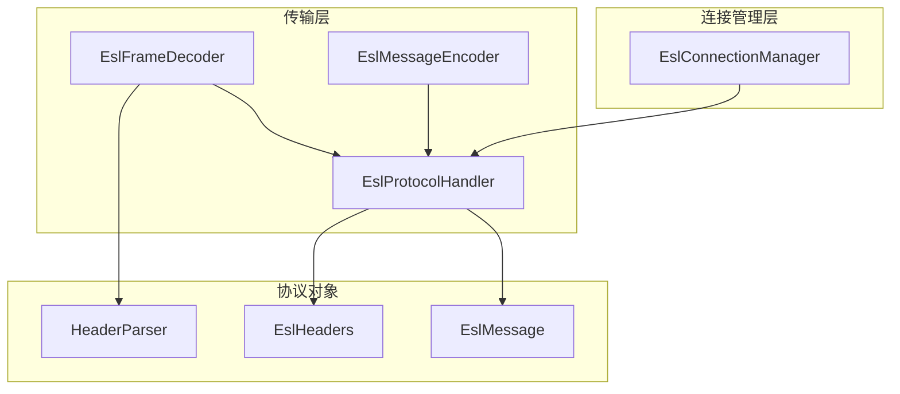
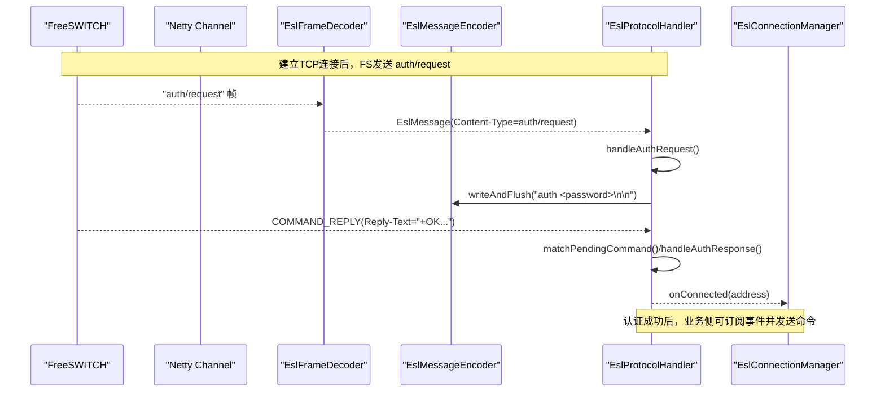
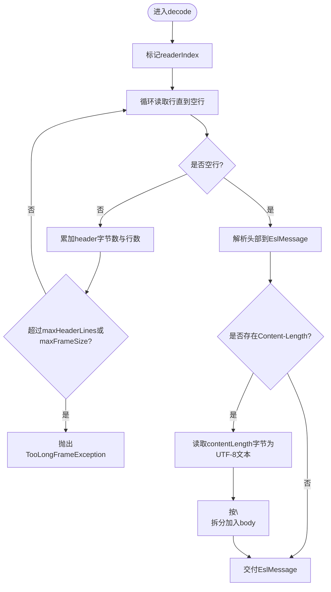
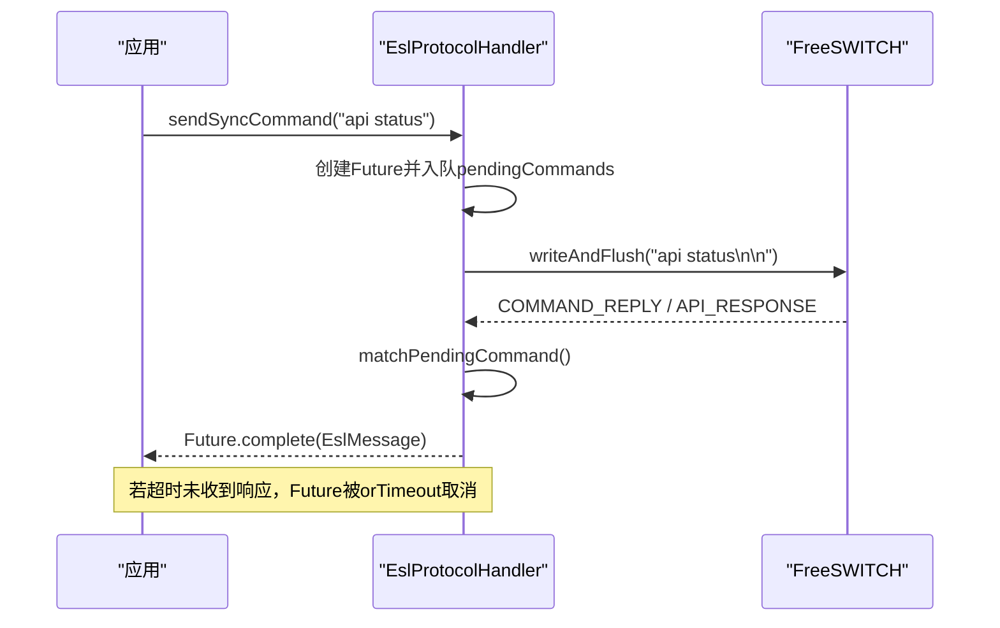
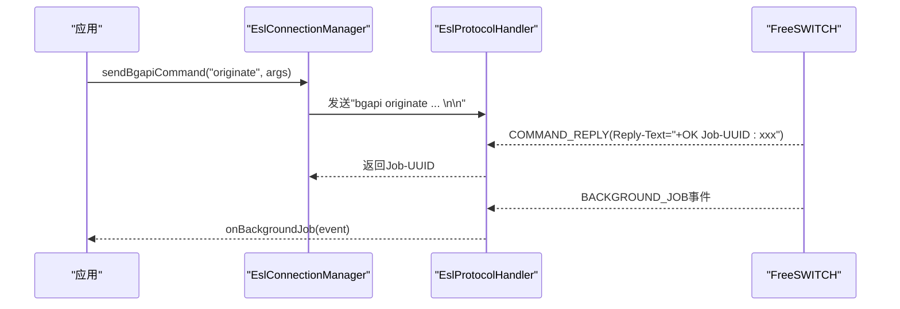
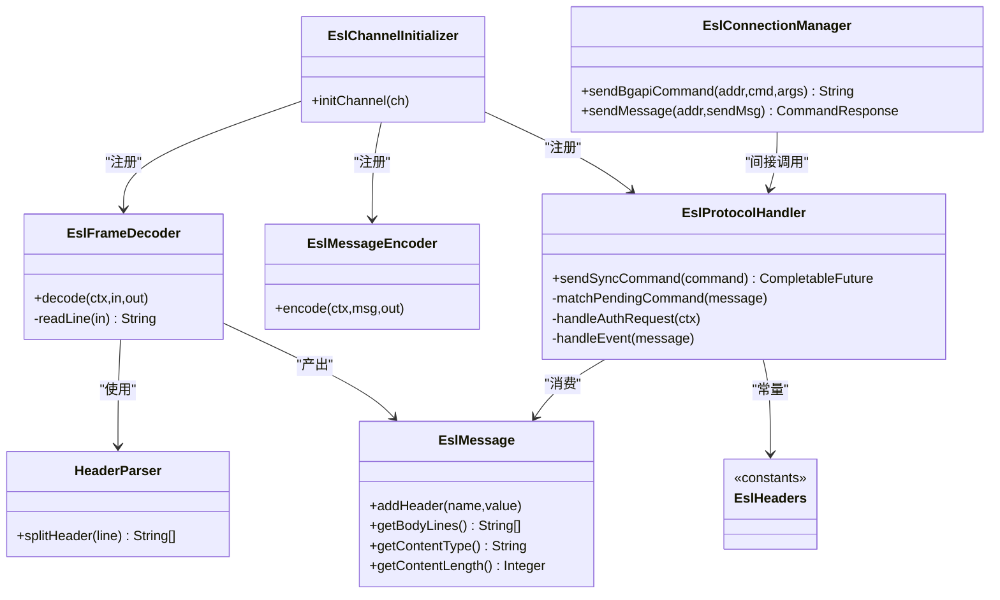

# 协议处理

<cite>
**本文引用的文件**
- [EslFrameDecoder.java](file://yudao-cloud/yudao-module-cc/ipcc-fs-esl/src/main/java/cn/ipcc/fs/esl/netty/EslFrameDecoder.java)
- [EslMessageEncoder.java](file://yudao-cloud/yudao-module-cc/ipcc-fs-esl/src/main/java/cn/ipcc/fs/esl/netty/EslMessageEncoder.java)
- [EslProtocolHandler.java](file://yudao-cloud/yudao-module-cc/ipcc-fs-esl/src/main/java/cn/ipcc/fs/esl/netty/EslProtocolHandler.java)
- [EslChannelInitializer.java](file://yudao-cloud/yudao-module-cc/ipcc-fs-esl/src/main/java/cn/ipcc/fs/esl/netty/EslChannelInitializer.java)
- [EslMessage.java](file://yudao-cloud/yudao-module-cc/ipcc-fs-esl/src/main/java/cn/ipcc/fs/esl/transport/EslMessage.java)
- [HeaderParser.java](file://yudao-cloud/yudao-module-cc/ipcc-fs-esl/src/main/java/cn/ipcc/fs/esl/transport/HeaderParser.java)
- [EslHeaders.java](file://yudao-cloud/yudao-module-cc/ipcc-fs-esl/src/main/java/cn/ipcc/fs/esl/transport/EslHeaders.java)
- [EslConnectionManager.java](file://yudao-cloud/yudao-module-cc/ipcc-fs-esl/src/main/java/cn/ipcc/fs/esl/EslConnectionManager.java)
- [README.md](file://yudao-cloud/yudao-module-cc/ipcc-fs-esl/README.md)
- [fs-esl-client组件架构设计.md](file://yudao-cloud/yudao-module-cc/ipcc-fs-esl/fs-esl-client组件架构设计.md)
</cite>

## 目录
1. [简介](#简介)
2. [项目结构](#项目结构)
3. [核心组件](#核心组件)
4. [架构总览](#架构总览)
5. [详细组件分析](#详细组件分析)
6. [依赖关系分析](#依赖关系分析)
7. [性能与内存保护](#性能与内存保护)
8. [安全校验](#安全校验)
9. [调试工具与排错指南](#调试工具与排错指南)
10. [结论](#结论)

## 简介
本文件面向IPCC呼叫中心系统的FreeSWITCH ESL（Event Socket Layer）协议处理，聚焦基于Netty 4.x的ESL编解码实现与消息分发机制。文档围绕以下关键点展开：
- EslFrameDecoder帧解码器：按行读取、CRLF兼容、UTF-8支持、Content-Length体解析与安全阈值控制
- EslMessageEncoder消息编码器：将字符串命令编码为UTF-8字节流
- EslMessage消息对象：头与体的抽象，提供常用访问方法
- 同步命令响应匹配：CompletableFuture + orTimeout + FIFO队列
- 异步bgapi命令处理：立即返回Job-UUID，结果通过BACKGROUND_JOB事件回调
- sendmsg消息发送：通道操作命令封装与响应匹配
- 协议安全校验、内存保护与性能优化策略
- 调试工具与常见问题解决方案

## 项目结构
该模块采用分层架构，传输层由Netty Pipeline构成，包含帧解码、消息编码与协议处理器；连接管理层负责单连接与多节点管理；传输层之上是事件路由与协调层（不在本文重点）。

图表来源
- [EslChannelInitializer.java:40-46](file://yudao-cloud/yudao-module-cc/ipcc-fs-esl/src/main/java/cn/ipcc/fs/esl/netty/EslChannelInitializer.java#L40-L46)
- [EslProtocolHandler.java:116-144](file://yudao-cloud/yudao-module-cc/ipcc-fs-esl/src/main/java/cn/ipcc/fs/esl/netty/EslProtocolHandler.java#L116-L144)
- [EslConnectionManager.java:141-205](file://yudao-cloud/yudao-module-cc/ipcc-fs-esl/src/main/java/cn/ipcc/fs/esl/EslConnectionManager.java#L141-L205)

章节来源
- [EslChannelInitializer.java:40-46](file://yudao-cloud/yudao-module-cc/ipcc-fs-esl/src/main/java/cn/ipcc/fs/esl/netty/EslChannelInitializer.java#L40-L46)
- [README.md:50-98](file://yudao-cloud/yudao-module-cc/ipcc-fs-esl/README.md#L50-L98)

## 核心组件
- EslFrameDecoder：基于ByteToMessageDecoder实现，逐行读取消息头，空行结束；根据Content-Length读取消息体；支持CRLF换行符与UTF-8字符；具备maxFrameSize与maxHeaderLines防护。
- EslMessageEncoder：@Sharable编码器，将String命令以UTF-8写入ByteBuf。
- EslMessage：消息对象，维护保序headers与body行列表，提供getContentType/getContentLength/hasContentLength等便捷方法。
- EslProtocolHandler：协议处理核心，负责认证握手、同步命令响应匹配、事件分发、disconnect-notice处理与连接生命周期通知。
- EslHeaders/HeaderParser：常量与头分割工具，统一协议字段与分隔符。
- EslConnectionManager：多节点连接管理，提供随机选择、批量bgapi、sendmsg与同步命令发送能力。

章节来源
- [EslFrameDecoder.java:13-90](file://yudao-cloud/yudao-module-cc/ipcc-fs-esl/src/main/java/cn/ipcc/fs/esl/netty/EslFrameDecoder.java#L13-L90)
- [EslMessageEncoder.java:8-20](file://yudao-cloud/yudao-module-cc/ipcc-fs-esl/src/main/java/cn/ipcc/fs/esl/netty/EslMessageEncoder.java#L8-L20)
- [EslMessage.java:8-108](file://yudao-cloud/yudao-module-cc/ipcc-fs-esl/src/main/java/cn/ipcc/fs/esl/transport/EslMessage.java#L8-L108)
- [EslProtocolHandler.java:23-107](file://yudao-cloud/yudao-module-cc/ipcc-fs-esl/src/main/java/cn/ipcc/fs/esl/netty/EslProtocolHandler.java#L23-L107)
- [EslHeaders.java:1-64](file://yudao-cloud/yudao-module-cc/ipcc-fs-esl/src/main/java/cn/ipcc/fs/esl/transport/EslHeaders.java#L1-L64)
- [HeaderParser.java:1-29](file://yudao-cloud/yudao-module-cc/ipcc-fs-esl/src/main/java/cn/ipcc/fs/esl/transport/HeaderParser.java#L1-L29)
- [EslConnectionManager.java:19-205](file://yudao-cloud/yudao-module-cc/ipcc-fs-esl/src/main/java/cn/ipcc/fs/esl/EslConnectionManager.java#L19-L205)

## 架构总览
ESL Inbound模式下的Netty Pipeline组装顺序为：EslFrameDecoder → EslMessageEncoder → EslProtocolHandler。数据从Socket流入，经解码器拆帧后交由协议处理器分类处理：auth/request触发认证流程；command/reply与api/response匹配待处理命令；text/event-plain/text/event-json作为事件分发给监听器；text/disconnect-notice触发优雅断开。

图表来源
- [EslChannelInitializer.java:40-46](file://yudao-cloud/yudao-module-cc/ipcc-fs-esl/src/main/java/cn/ipcc/fs/esl/netty/EslChannelInitializer.java#L40-L46)
- [EslProtocolHandler.java:116-158](file://yudao-cloud/yudao-module-cc/ipcc-fs-esl/src/main/java/cn/ipcc/fs/esl/netty/EslProtocolHandler.java#L116-L158)
- [EslHeaders.java:19-64](file://yudao-cloud/yudao-module-cc/ipcc-fs-esl/src/main/java/cn/ipcc/fs/esl/transport/EslHeaders.java#L19-L64)

## 详细组件分析

### EslFrameDecoder 帧解码器
- 功能要点
  - 按行读取消息头，遇到空行结束；支持“\r\n”和“\n”两种换行符
  - 解析消息头到EslMessage；若存在Content-Length则继续读取指定字节数作为消息体
  - 使用StandardCharsets.UTF_8解码，避免中文等多字节字符乱码
  - 安全防护：累计header字节数与行数超过阈值抛出TooLongFrameException；Content-Length超限拒绝
- 复杂度与性能
  - 逐行扫描O(N)，N为当前可读字节数；readLine中通过readerIndex定位避免重复拷贝
  - 使用mark/reset保障不完整数据时回退，减少无效分配
- 关键路径
  - decode(): 阶段一读头、阶段二读体
  - readLine(): 兼容CRLF，正确跳过换行符

图表来源
- [EslFrameDecoder.java:42-90](file://yudao-cloud/yudao-module-cc/ipcc-fs-esl/src/main/java/cn/ipcc/fs/esl/netty/EslFrameDecoder.java#L42-L90)
- [EslFrameDecoder.java:97-113](file://yudao-cloud/yudao-module-cc/ipcc-fs-esl/src/main/java/cn/ipcc/fs/esl/netty/EslFrameDecoder.java#L97-L113)

章节来源
- [EslFrameDecoder.java:13-113](file://yudao-cloud/yudao-module-cc/ipcc-fs-esl/src/main/java/cn/ipcc/fs/esl/netty/EslFrameDecoder.java#L13-L113)

### EslMessageEncoder 消息编码器
- 功能要点
  - @Sharable，可在多Channel共享
  - 将已包含“\n\n”终结符的命令字符串以UTF-8写入ByteBuf
- 适用场景
  - 上层构造完整ESL命令字符串后直接writeAndFlush，由编码器完成字节化

章节来源
- [EslMessageEncoder.java:8-20](file://yudao-cloud/yudao-module-cc/ipcc-fs-esl/src/main/java/cn/ipcc/fs/esl/netty/EslMessageEncoder.java#L8-L20)

### EslMessage 消息对象
- 数据结构
  - headers: LinkedHashMap<String,String>，保序便于调试与按序读取
  - body: List<String>，存储消息体各行
- 常用API
  - addHeader/addBodyLine
  - getHeaderValue/hasHeader/getContentType/getContentLength/hasContentLength
  - getBodyLines/getFirstBodyLine
- 设计考量
  - 兼容老库API，保持get先于set语义稳定
  - 对缺失头或空体提供安全返回值

章节来源
- [EslMessage.java:8-108](file://yudao-cloud/yudao-module-cc/ipcc-fs-esl/src/main/java/cn/ipcc/fs/esl/transport/EslMessage.java#L8-L108)

### EslProtocolHandler 协议处理器
- 职责
  - 认证握手：收到auth/request后发送auth命令，处理COMMAND_REPLY中的Reply-Text判断成功与否
  - 同步命令响应匹配：sendSyncCommand创建CompletableFuture入队，onRead时从队首poll匹配，支持超时orTimeout
  - 事件分发：text/event-plain/json转为EslEvent，BACKGROUND_JOB单独回调
  - 断开处理：收到disconnect-notice记录原因并关闭；channelInactive区分用户主动断开与异常断开
- 关键状态与标志
  - authPending：标记认证响应待处理，避免误匹配普通命令响应
  - userInitiatedDisconnect：防止channelInactive重复触发重连
  - pendingDisconnectReason：记录FS主动断开的具体原因
- 线程模型
  - 所有IO相关操作在eventLoop线程串行执行，保证FIFO顺序与一致性

图表来源
- [EslProtocolHandler.java:92-107](file://yudao-cloud/yudao-module-cc/ipcc-fs-esl/src/main/java/cn/ipcc/fs/esl/netty/EslProtocolHandler.java#L92-L107)
- [EslProtocolHandler.java:168-182](file://yudao-cloud/yudao-module-cc/ipcc-fs-esl/src/main/java/cn/ipcc/fs/esl/netty/EslProtocolHandler.java#L168-L182)

章节来源
- [EslProtocolHandler.java:23-267](file://yudao-cloud/yudao-module-cc/ipcc-fs-esl/src/main/java/cn/ipcc/fs/esl/netty/EslProtocolHandler.java#L23-L267)

### EslChannelInitializer Pipeline 组装
- 组装顺序
  - frameDecoder: EslFrameDecoder
  - encoder: EslMessageEncoder
  - handler: EslProtocolHandler
- 配置项
  - maxFrameSize/maxHeaderLines来自EslClientConfig，用于解码器安全阈值

章节来源
- [EslChannelInitializer.java:40-46](file://yudao-cloud/yudao-module-cc/ipcc-fs-esl/src/main/java/cn/ipcc/fs/esl/netty/EslChannelInitializer.java#L40-L46)

### 同步命令、异步bgapi与sendmsg
- 同步命令
  - sendSyncCommand：创建Future入队，writeAndFlush命令，orTimeout控制超时；响应到达时从队首匹配并complete
- 异步bgapi
  - bgapi命令独立于api，发送后立即返回COMMAND_REPLY，Job-UUID位于Reply-Text头；实际执行结果通过BACKGROUND_JOB事件回调
  - EslConnectionManager.sendBgapiCommand/sendBgapiToAll提供便捷接口
- sendmsg
  - 通过SendMsg封装通道参数，调用sendMessage发送；响应走command/reply匹配机制

图表来源
- [EslConnectionManager.java:141-195](file://yudao-cloud/yudao-module-cc/ipcc-fs-esl/src/main/java/cn/ipcc/fs/esl/EslConnectionManager.java#L141-L195)
- [EslProtocolHandler.java:215-224](file://yudao-cloud/yudao-module-cc/ipcc-fs-esl/src/main/java/cn/ipcc/fs/esl/netty/EslProtocolHandler.java#L215-L224)

章节来源
- [EslConnectionManager.java:141-205](file://yudao-cloud/yudao-module-cc/ipcc-fs-esl/src/main/java/cn/ipcc/fs/esl/EslConnectionManager.java#L141-L205)
- [EslProtocolHandler.java:215-224](file://yudao-cloud/yudao-module-cc/ipcc-fs-esl/src/main/java/cn/ipcc/fs/esl/netty/EslProtocolHandler.java#L215-L224)

## 依赖关系分析
- 组件耦合
  - EslFrameDecoder依赖HeaderParser进行头分割，输出EslMessage
  - EslProtocolHandler依赖EslHeaders常量与EslMessage对象，驱动认证、响应匹配与事件分发
  - EslChannelInitializer组合三者形成完整Pipeline
  - EslConnectionManager聚合多个EslConnection，对外暴露批量与路由能力
- 外部依赖
  - Netty 4.x（ByteToMessageDecoder、MessageToByteEncoder、ChannelInboundHandlerAdapter）
  - SLF4J日志
  - Spring Boot自动配置（可选）

图表来源
- [EslFrameDecoder.java:42-90](file://yudao-cloud/yudao-module-cc/ipcc-fs-esl/src/main/java/cn/ipcc/fs/esl/netty/EslFrameDecoder.java#L42-L90)
- [EslProtocolHandler.java:92-182](file://yudao-cloud/yudao-module-cc/ipcc-fs-esl/src/main/java/cn/ipcc/fs/esl/netty/EslProtocolHandler.java#L92-L182)
- [EslChannelInitializer.java:40-46](file://yudao-cloud/yudao-module-cc/ipcc-fs-esl/src/main/java/cn/ipcc/fs/esl/netty/EslChannelInitializer.java#L40-L46)
- [EslConnectionManager.java:141-205](file://yudao-cloud/yudao-module-cc/ipcc-fs-esl/src/main/java/cn/ipcc/fs/esl/EslConnectionManager.java#L141-L205)

章节来源
- [EslChannelInitializer.java:40-46](file://yudao-cloud/yudao-module-cc/ipcc-fs-esl/src/main/java/cn/ipcc/fs/esl/netty/EslChannelInitializer.java#L40-L46)
- [EslConnectionManager.java:141-205](file://yudao-cloud/yudao-module-cc/ipcc-fs-esl/src/main/java/cn/ipcc/fs/esl/EslConnectionManager.java#L141-L205)

## 性能与内存保护
- 解码性能
  - 使用ByteBuf原生索引与mark/reset，避免多余拷贝
  - UTF-8一次性解码body，减少多次转换开销
- 内存保护
  - maxFrameSize限制最大帧大小，防止OOM
  - maxHeaderLines限制消息头行数，抵御header放大攻击
  - Content-Length合法性校验，负值或超界直接拒绝
- 超时与背压
  - 同步命令使用CompletableFuture.orTimeout，避免永久阻塞
  - 认证失败次数上限MAX_AUTH_FAILURES，防止无限重试
- 线程与并发
  - eventLoop串行化命令入队与发送，保证FIFO顺序
  - 事件分发与拦截器链可扩展线程池策略（见配置项）

章节来源
- [EslFrameDecoder.java:34-90](file://yudao-cloud/yudao-module-cc/ipcc-fs-esl/src/main/java/cn/ipcc/fs/esl/netty/EslFrameDecoder.java#L34-L90)
- [EslProtocolHandler.java:42-107](file://yudao-cloud/yudao-module-cc/ipcc-fs-esl/src/main/java/cn/ipcc/fs/esl/netty/EslProtocolHandler.java#L42-L107)
- [README.md:157-178](file://yudao-cloud/yudao-module-cc/ipcc-fs-esl/README.md#L157-L178)

## 安全校验
- 输入校验
  - 消息头长度与行数阈值检查
  - Content-Length范围校验
- 认证安全
  - 认证失败次数限制，达到阈值关闭连接
  - 认证响应仅接受Reply-Text前缀判断，避免伪造
- 连接安全
  - disconnect-notice处理后记录原因并关闭，避免半开连接
  - 用户主动断开标记，防止channelInactive误判为网络丢失

章节来源
- [EslFrameDecoder.java:60-87](file://yudao-cloud/yudao-module-cc/ipcc-fs-esl/src/main/java/cn/ipcc/fs/esl/netty/EslFrameDecoder.java#L60-L87)
- [EslProtocolHandler.java:146-213](file://yudao-cloud/yudao-module-cc/ipcc-fs-esl/src/main/java/cn/ipcc/fs/esl/netty/EslProtocolHandler.java#L146-L213)
- [EslProtocolHandler.java:226-259](file://yudao-cloud/yudao-module-cc/ipcc-fs-esl/src/main/java/cn/ipcc/fs/esl/netty/EslProtocolHandler.java#L226-L259)

## 调试工具与排错指南
- 常见现象与定位
  - 无Content-Type消息：协议处理器会记录警告并丢弃，检查上游是否构造了完整消息
  - 认证失败：查看Reply-Text内容，确认密码与FS配置；超过最大失败次数将关闭连接
  - 命令无响应：检查commandTimeoutSeconds配置与FS是否在线；观察pendingCommands队列是否堆积
  - 事件未到达：确认已订阅事件（event plain all），并检查BACKGROUND_JOB事件是否被正确处理
- 建议排查步骤
  - 启用事件拦截器链路，记录before/after处理耗时
  - 调整maxFrameSize/maxHeaderLines，观察是否频繁触发TooLongFrameException
  - 使用示例工程验证端到端连通性（参考README示例）
- 参考资源
  - 示例工程与运行说明见README
  - 架构设计与约束见组件架构设计文档

章节来源
- [EslProtocolHandler.java:116-144](file://yudao-cloud/yudao-module-cc/ipcc-fs-esl/src/main/java/cn/ipcc/fs/esl/netty/EslProtocolHandler.java#L116-L144)
- [EslProtocolHandler.java:146-213](file://yudao-cloud/yudao-module-cc/ipcc-fs-esl/src/main/java/cn/ipcc/fs/esl/netty/EslProtocolHandler.java#L146-L213)
- [README.md:264-287](file://yudao-cloud/yudao-module-cc/ipcc-fs-esl/README.md#L264-L287)
- [fs-esl-client组件架构设计.md:195-315](file://yudao-cloud/yudao-module-cc/ipcc-fs-esl/fs-esl-client组件架构设计.md#L195-L315)

## 结论
本实现以Netty 4.x为核心，提供了健壮、高性能且安全的FreeSWITCH ESL协议处理能力。通过EslFrameDecoder的严格帧解析、EslProtocolHandler的可靠响应匹配与事件分发、以及EslConnectionManager的多节点管理能力，系统能够稳定支撑呼叫中心的高并发场景。结合安全阈值、超时控制与可观测性扩展点，既保证了稳定性，又具备良好的可维护性与可演进性。