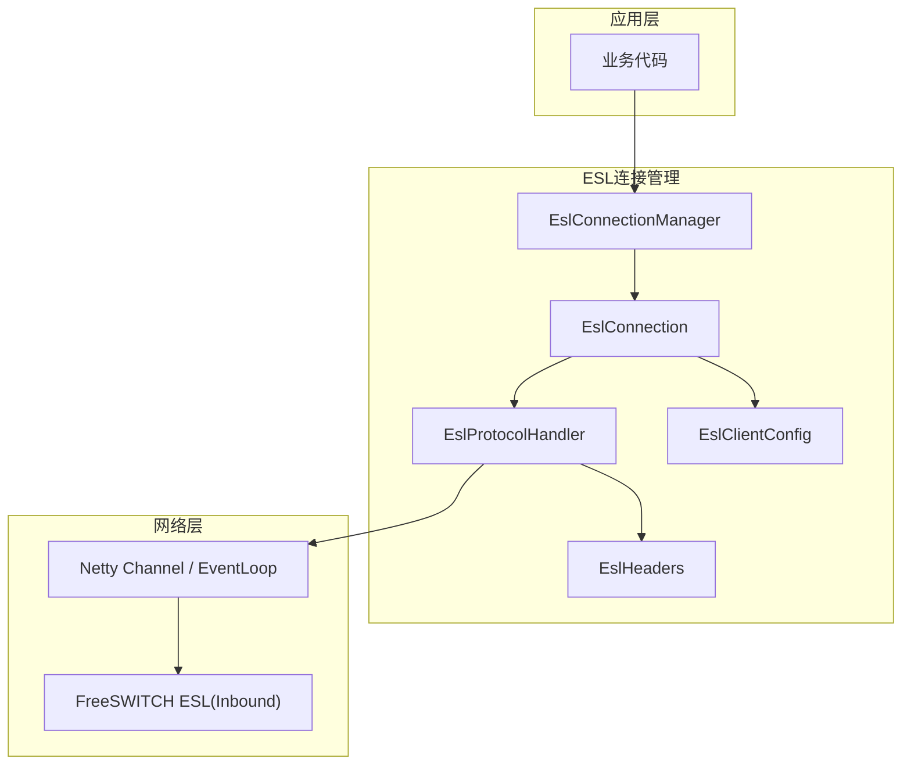
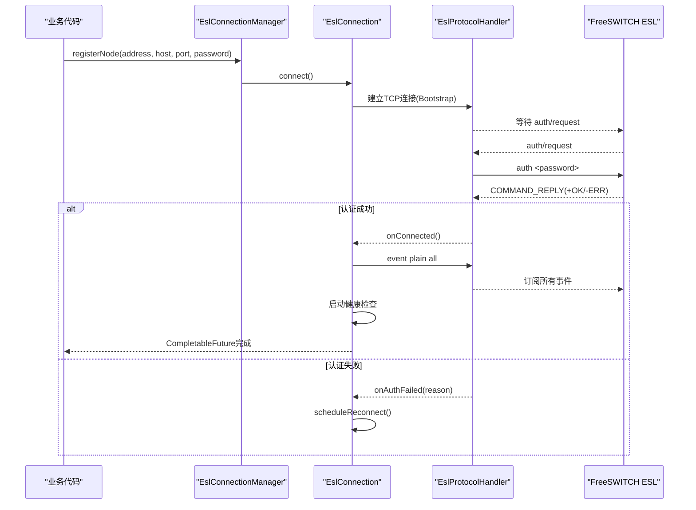
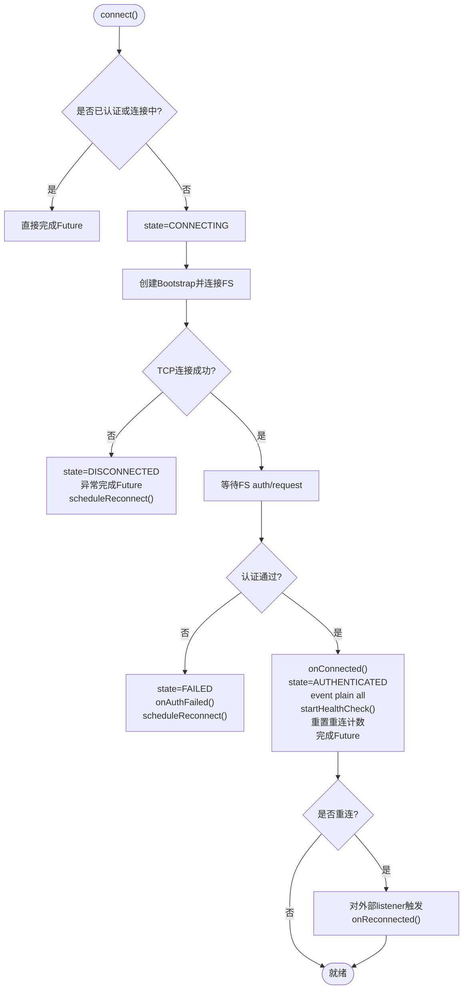
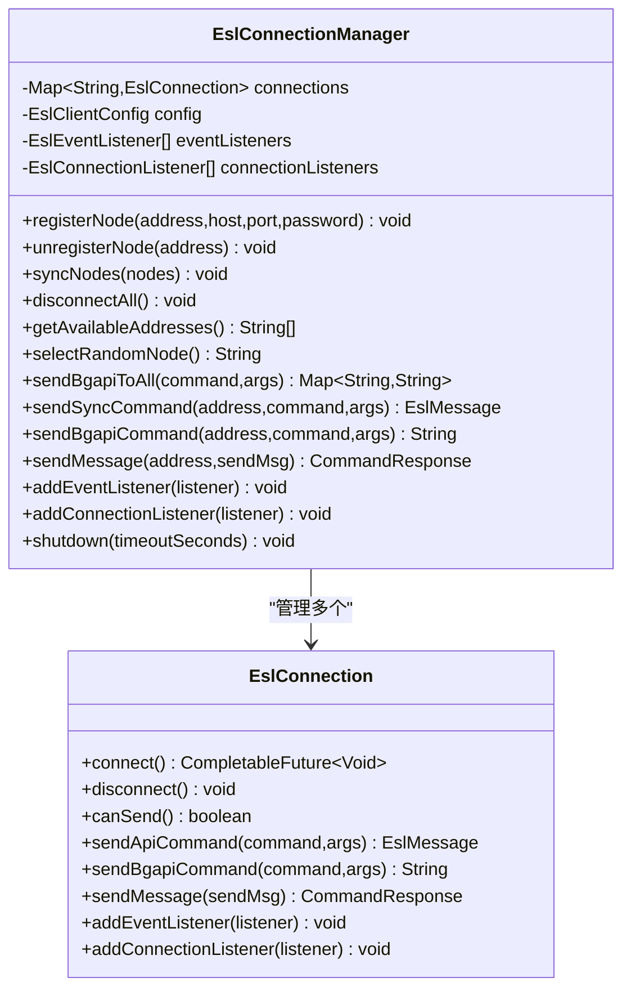
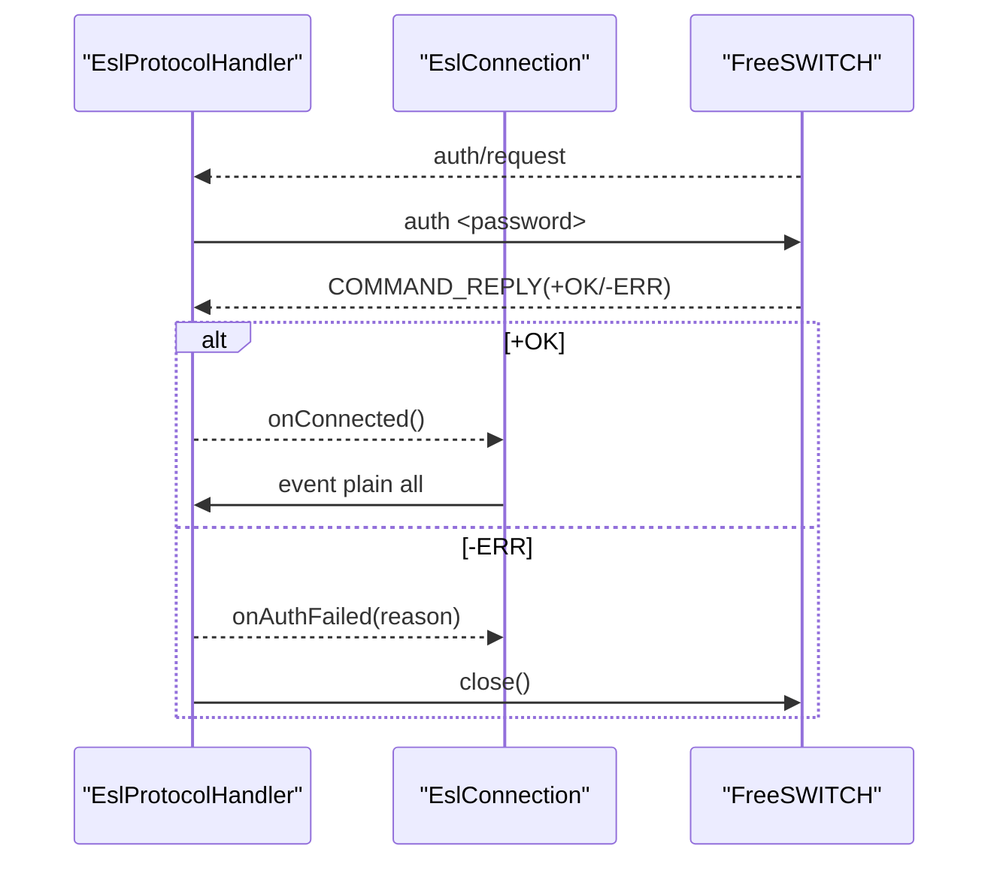

# 连接管理

<cite>
**本文引用的文件**
- [EslConnection.java](file://yudao-cloud/yudao-module-cc/ipcc-fs-esl/src/main/java/cn/ipcc/fs/esl/EslConnection.java)
- [EslConnectionManager.java](file://yudao-cloud/yudao-module-cc/ipcc-fs-esl/src/main/java/cn/ipcc/fs/esl/EslConnectionManager.java)
- [EslClientConfig.java](file://yudao-cloud/yudao-module-cc/ipcc-fs-esl/src/main/java/cn/ipcc/fs/esl/EslClientConfig.java)
- [EslProtocolHandler.java](file://yudao-cloud/yudao-module-cc/ipcc-fs-esl/src/main/java/cn/ipcc/fs/esl/netty/EslProtocolHandler.java)
- [EslHeaders.java](file://yudao-cloud/yudao-module-cc/ipcc-fs-esl/src/main/java/cn/ipcc/fs/esl/transport/EslHeaders.java)
- [EslAutoConfiguration.java](file://yudao-cloud/yudao-module-cc/ipcc-fs-esl/src/main/java/cn/ipcc/fs/esl/spring/EslAutoConfiguration.java)
- [application.yml](file://yudao-cloud/yudao-module-cc/ipcc-fs-esl/example/example-java/src/main/resources/application.yml)
- [ExampleConnectionListener.java](file://yudao-cloud/yudao-module-cc/ipcc-fs-esl/example/example-java/src/main/java/cn/ipcc/fs/esl/example/listener/ExampleConnectionListener.java)
</cite>

## 目录
1. [简介](#简介)
2. [项目结构](#项目结构)
3. [核心组件](#核心组件)
4. [架构总览](#架构总览)
5. [详细组件分析](#详细组件分析)
6. [依赖关系分析](#依赖关系分析)
7. [性能考量](#性能考量)
8. [故障排查指南](#故障排查指南)
9. [结论](#结论)
10. [附录：配置示例与最佳实践](#附录配置示例与最佳实践)

## 简介
本文件面向IPCC呼叫中心系统的FreeSWITCH ESL连接管理，聚焦于单连接客户端 EslConnection 与多节点管理器 EslConnectionManager 的实现机制。文档覆盖连接状态机、自动重连策略（指数退避+随机抖动）、健康检查、连接池管理、节点注册/移除、批量操作、对账式同步、连接生命周期回调、故障恢复与优雅关闭等关键特性，并提供配置示例与常见问题排查指南。

## 项目结构
ESL连接管理位于模块 ipcc-fs-esl 中，核心类包括：
- EslConnection：单FS节点的ESL Inbound连接封装，负责认证、命令发送、事件订阅、健康检查与重连。
- EslConnectionManager：多节点连接管理器，提供节点注册/移除、选择策略、批量操作与对账式同步。
- EslClientConfig：纯POJO配置，包含连接、重连、健康检查、事件执行器与分布式协调参数。
- EslProtocolHandler：Netty协议处理器，处理auth、命令响应、事件、断开通知等。
- EslHeaders：ESL协议常量定义（命令前缀、Content-Type值、消息终止符等）。
- EslAutoConfiguration：Spring Boot自动装配，创建并启动连接管理器，注入监听器与路由。

图表来源
- [EslConnectionManager.java:19-36](file://yudao-cloud/yudao-module-cc/ipcc-fs-esl/src/main/java/cn/ipcc/fs/esl/EslConnectionManager.java#L19-L36)
- [EslConnection.java:32-48](file://yudao-cloud/yudao-module-cc/ipcc-fs-esl/src/main/java/cn/ipcc/fs/esl/EslConnection.java#L32-L48)
- [EslProtocolHandler.java:23-40](file://yudao-cloud/yudao-module-cc/ipcc-fs-esl/src/main/java/cn/ipcc/fs/esl/netty/EslProtocolHandler.java#L23-L40)
- [EslHeaders.java:19-60](file://yudao-cloud/yudao-module-cc/ipcc-fs-esl/src/main/java/cn/ipcc/fs/esl/transport/EslHeaders.java#L19-L60)
- [EslClientConfig.java:10-60](file://yudao-cloud/yudao-module-cc/ipcc-fs-esl/src/main/java/cn/ipcc/fs/esl/EslClientConfig.java#L10-L60)

章节来源
- [EslConnectionManager.java:19-36](file://yudao-cloud/yudao-module-cc/ipcc-fs-esl/src/main/java/cn/ipcc/fs/esl/EslConnectionManager.java#L19-L36)
- [EslConnection.java:32-48](file://yudao-cloud/yudao-module-cc/ipcc-fs-esl/src/main/java/cn/ipcc/fs/esl/EslConnection.java#L32-L48)
- [EslProtocolHandler.java:23-40](file://yudao-cloud/yudao-module-cc/ipcc-fs-esl/src/main/java/cn/ipcc/fs/esl/netty/EslProtocolHandler.java#L23-L40)
- [EslHeaders.java:19-60](file://yudao-cloud/yudao-module-cc/ipcc-fs-esl/src/main/java/cn/ipcc/fs/esl/transport/EslHeaders.java#L19-L60)
- [EslClientConfig.java:10-60](file://yudao-cloud/yudao-module-cc/ipcc-fs-esl/src/main/java/cn/ipcc/fs/esl/EslClientConfig.java#L10-L60)

## 核心组件
- EslConnection：单连接客户端，实现连接生命周期、命令发送（api/bgapi/sendmsg）、事件订阅与健康检查。
- EslConnectionManager：多节点管理器，提供节点注册/移除、可用节点选择、批量bgapi发送、对账式同步(syncNodes)、优雅关闭。
- EslClientConfig：集中配置项，涵盖连接超时、命令超时、帧大小、重连策略、健康检查、事件线程池与分布式协调开关。
- EslProtocolHandler：Netty入站处理器，处理auth/request、命令响应匹配、事件分发、disconnect-notice与异常关闭。
- EslHeaders：ESL协议常量，统一命令前缀、响应标识与消息分隔符。
- EslAutoConfiguration：Spring自动装配，创建EslConnectionManager并注入监听器、静态节点与事件路由。

章节来源
- [EslConnection.java:32-48](file://yudao-cloud/yudao-module-cc/ipcc-fs-esl/src/main/java/cn/ipcc/fs/esl/EslConnection.java#L32-L48)
- [EslConnectionManager.java:19-36](file://yudao-cloud/yudao-module-cc/ipcc-fs-esl/src/main/java/cn/ipcc/fs/esl/EslConnectionManager.java#L19-L36)
- [EslClientConfig.java:10-60](file://yudao-cloud/yudao-module-cc/ipcc-fs-esl/src/main/java/cn/ipcc/fs/esl/EslClientConfig.java#L10-L60)
- [EslProtocolHandler.java:23-40](file://yudao-cloud/yudao-module-cc/ipcc-fs-esl/src/main/java/cn/ipcc/fs/esl/netty/EslProtocolHandler.java#L23-L40)
- [EslHeaders.java:19-60](file://yudao-cloud/yudao-module-cc/ipcc-fs-esl/src/main/java/cn/ipcc/fs/esl/transport/EslHeaders.java#L19-L60)
- [EslAutoConfiguration.java:50-127](file://yudao-cloud/yudao-module-cc/ipcc-fs-esl/src/main/java/cn/ipcc/fs/esl/spring/EslAutoConfiguration.java#L50-L127)

## 架构总览
下图展示了从应用调用到FreeSWITCH的完整链路，以及连接管理与协议处理的交互关系。

图表来源
- [EslConnectionManager.java:54-68](file://yudao-cloud/yudao-module-cc/ipcc-fs-esl/src/main/java/cn/ipcc/fs/esl/EslConnectionManager.java#L54-L68)
- [EslConnection.java:102-140](file://yudao-cloud/yudao-module-cc/ipcc-fs-esl/src/main/java/cn/ipcc/fs/esl/EslConnection.java#L102-L140)
- [EslProtocolHandler.java:146-213](file://yudao-cloud/yudao-module-cc/ipcc-fs-esl/src/main/java/cn/ipcc/fs/esl/netty/EslProtocolHandler.java#L146-L213)
- [EslHeaders.java:19-37](file://yudao-cloud/yudao-module-cc/ipcc-fs-esl/src/main/java/cn/ipcc/fs/esl/transport/EslHeaders.java#L19-L37)

## 详细组件分析

### EslConnection：单连接客户端
- 职责
  - 管理单个FS节点的ESL Inbound连接（认证、断开、自动重连、健康检查）
  - 发送ESL命令（同步API、异步bgapi、sendmsg）
  - 管理事件订阅（event plain all）
  - 连接生命周期回调通知
- 连接状态机
  - DISCONNECTED → CONNECTING → CONNECTED → AUTHENTICATED
  - 异常时进入 RECONNECTING；达到最大重试次数后为 FAILED
- 自动重连策略
  - 指数退避 + 随机抖动：delay = min(baseDelay * 2^(attempt-1) + baseDelay*0.2*random, maxDelay)
  - 支持最大重试次数限制，超过则触发 onReconnectFailed
- 健康检查
  - 定时发送 api status，连续失败阈值触发重连
- 命令发送
  - sendApiCommand：以“api ”前缀发送，带超时控制
  - sendBgapiCommand：以“bgapi ”前缀发送，解析Job-UUID（优先Reply-Text，兼容body格式）
  - sendMessage：sendmsg操作指定通道
- 生命周期回调
  - InternalConnectionListener在onConnected中切换状态、订阅事件、启动健康检查、完成Future，并在重连成功时转发onReconnected给外部监听器
  - onDisconnected根据原因决定是否重连；onAuthFailed记录失败并触发重连

图表来源
- [EslConnection.java:102-140](file://yudao-cloud/yudao-module-cc/ipcc-fs-esl/src/main/java/cn/ipcc/fs/esl/EslConnection.java#L102-L140)
- [EslConnection.java:296-334](file://yudao-cloud/yudao-module-cc/ipcc-fs-esl/src/main/java/cn/ipcc/fs/esl/EslConnection.java#L296-L334)
- [EslConnection.java:336-374](file://yudao-cloud/yudao-module-cc/ipcc-fs-esl/src/main/java/cn/ipcc/fs/esl/EslConnection.java#L336-L374)
- [EslConnection.java:394-446](file://yudao-cloud/yudao-module-cc/ipcc-fs-esl/src/main/java/cn/ipcc/fs/esl/EslConnection.java#L394-L446)

章节来源
- [EslConnection.java:32-48](file://yudao-cloud/yudao-module-cc/ipcc-fs-esl/src/main/java/cn/ipcc/fs/esl/EslConnection.java#L32-L48)
- [EslConnection.java:102-140](file://yudao-cloud/yudao-module-cc/ipcc-fs-esl/src/main/java/cn/ipcc/fs/esl/EslConnection.java#L102-L140)
- [EslConnection.java:179-269](file://yudao-cloud/yudao-module-cc/ipcc-fs-esl/src/main/java/cn/ipcc/fs/esl/EslConnection.java#L179-L269)
- [EslConnection.java:296-334](file://yudao-cloud/yudao-module-cc/ipcc-fs-esl/src/main/java/cn/ipcc/fs/esl/EslConnection.java#L296-L334)
- [EslConnection.java:336-374](file://yudao-cloud/yudao-module-cc/ipcc-fs-esl/src/main/java/cn/ipcc/fs/esl/EslConnection.java#L336-L374)
- [EslConnection.java:394-446](file://yudao-cloud/yudao-module-cc/ipcc-fs-esl/src/main/java/cn/ipcc/fs/esl/EslConnection.java#L394-L446)

### EslConnectionManager：多节点管理器
- 职责
  - 管理多个EslConnection（注册/移除）
  - 节点选择策略（随机）
  - 批量操作（向所有节点发送bgapi）
  - 连接状态聚合回调
  - 对账式同步（syncNodes）
- 节点注册/移除
  - registerNode：创建EslConnection并connect，自动注入事件与连接监听器
  - unregisterNode：断开并移除节点
- 批量操作
  - sendBgapiToAll：遍历所有节点发送bgapi，返回address→Job-UUID映射
  - sendSyncCommand/sendBgapiCommand/sendMessage：按地址定向操作
- 对账式同步
  - syncNodes：计算目标节点列表与现有连接的差集，移除多余节点，新增缺失节点，保持已存在连接复用
- 优雅关闭
  - shutdown：断开所有连接并等待资源释放

图表来源
- [EslConnectionManager.java:19-36](file://yudao-cloud/yudao-module-cc/ipcc-fs-esl/src/main/java/cn/ipcc/fs/esl/EslConnectionManager.java#L19-L36)
- [EslConnectionManager.java:54-113](file://yudao-cloud/yudao-module-cc/ipcc-fs-esl/src/main/java/cn/ipcc/fs/esl/EslConnectionManager.java#L54-L113)
- [EslConnectionManager.java:141-205](file://yudao-cloud/yudao-module-cc/ipcc-fs-esl/src/main/java/cn/ipcc/fs/esl/EslConnectionManager.java#L141-L205)
- [EslConnection.java:32-48](file://yudao-cloud/yudao-module-cc/ipcc-fs-esl/src/main/java/cn/ipcc/fs/esl/EslConnection.java#L32-L48)

章节来源
- [EslConnectionManager.java:19-36](file://yudao-cloud/yudao-module-cc/ipcc-fs-esl/src/main/java/cn/ipcc/fs/esl/EslConnectionManager.java#L19-L36)
- [EslConnectionManager.java:54-113](file://yudao-cloud/yudao-module-cc/ipcc-fs-esl/src/main/java/cn/ipcc/fs/esl/EslConnectionManager.java#L54-L113)
- [EslConnectionManager.java:141-205](file://yudao-cloud/yudao-module-cc/ipcc-fs-esl/src/main/java/cn/ipcc/fs/esl/EslConnectionManager.java#L141-L205)

### EslProtocolHandler：协议处理与命令匹配
- 同步命令/响应机制
  - 使用CompletableFuture + orTimeout实现超时控制
  - 命令发送和入队通过channel.eventLoop().execute()串行化，保证FIFO顺序
  - 响应匹配时跳过已超时/已取消的future，确保不错位
- 认证流程
  - 收到auth/request时发送auth命令，标记authPending
  - 认证响应优先消费，成功后触发onConnected，否则触发onAuthFailed并关闭连接
- 事件分发
  - BACKGROUND_JOB事件单独回调，其他事件调用onEvent
- 断开处理
  - 收到disconnect-notice记录原因并关闭连接，由channelInactive统一触发onDisconnected
  - 用户主动断开通过markUserInitiatedDisconnect避免重复通知

图表来源
- [EslProtocolHandler.java:146-213](file://yudao-cloud/yudao-module-cc/ipcc-fs-esl/src/main/java/cn/ipcc/fs/esl/netty/EslProtocolHandler.java#L146-L213)
- [EslHeaders.java:19-37](file://yudao-cloud/yudao-module-cc/ipcc-fs-esl/src/main/java/cn/ipcc/fs/esl/transport/EslHeaders.java#L19-L37)

章节来源
- [EslProtocolHandler.java:92-107](file://yudao-cloud/yudao-module-cc/ipcc-fs-esl/src/main/java/cn/ipcc/fs/esl/netty/EslProtocolHandler.java#L92-L107)
- [EslProtocolHandler.java:146-213](file://yudao-cloud/yudao-module-cc/ipcc-fs-esl/src/main/java/cn/ipcc/fs/esl/netty/EslProtocolHandler.java#L146-L213)
- [EslProtocolHandler.java:226-259](file://yudao-cloud/yudao-module-cc/ipcc-fs-esl/src/main/java/cn/ipcc/fs/esl/netty/EslProtocolHandler.java#L226-L259)

### 连接生命周期回调与故障恢复
- 回调接口
  - onConnected/onDisconnected/onAuthFailed/onReconnecting/onReconnected/onReconnectFailed
- 故障恢复
  - 连接丢失或认证失败触发自动重连
  - 健康检查连续失败触发重连
  - 达到最大重连次数后停止并重试失败回调
- 优雅关闭
  - disconnect()标记用户主动断开，避免误触发重连
  - shutdown()断开所有连接并等待资源释放

章节来源
- [EslConnection.java:142-167](file://yudao-cloud/yudao-module-cc/ipcc-fs-esl/src/main/java/cn/ipcc/fs/esl/EslConnection.java#L142-L167)
- [EslConnection.java:296-334](file://yudao-cloud/yudao-module-cc/ipcc-fs-esl/src/main/java/cn/ipcc/fs/esl/EslConnection.java#L296-L334)
- [EslConnection.java:336-374](file://yudao-cloud/yudao-module-cc/ipcc-fs-esl/src/main/java/cn/ipcc/fs/esl/EslConnection.java#L336-L374)
- [EslConnectionManager.java:115-119](file://yudao-cloud/yudao-module-cc/ipcc-fs-esl/src/main/java/cn/ipcc/fs/esl/EslConnectionManager.java#L115-L119)
- [EslConnectionManager.java:219-232](file://yudao-cloud/yudao-module-cc/ipcc-fs-esl/src/main/java/cn/ipcc/fs/esl/EslConnectionManager.java#L219-L232)

## 依赖关系分析
- EslConnection依赖EslClientConfig（连接/重连/健康检查参数）与EslProtocolHandler（命令发送与事件处理）
- EslConnectionManager依赖EslConnection（多实例管理）与EslClientConfig（全局配置）
- EslProtocolHandler依赖EslHeaders（协议常量）与EslClientConfig（超时等）
- Spring自动装配将监听器、路由器与协调器注入到管理器与路由器

图表来源
- [EslClientConfig.java:10-60](file://yudao-cloud/yudao-module-cc/ipcc-fs-esl/src/main/java/cn/ipcc/fs/esl/EslClientConfig.java#L10-L60)
- [EslConnection.java:50-77](file://yudao-cloud/yudao-module-cc/ipcc-fs-esl/src/main/java/cn/ipcc/fs/esl/EslConnection.java#L50-L77)
- [EslConnectionManager.java:33-40](file://yudao-cloud/yudao-module-cc/ipcc-fs-esl/src/main/java/cn/ipcc/fs/esl/EslConnectionManager.java#L33-L40)
- [EslProtocolHandler.java:47-53](file://yudao-cloud/yudao-module-cc/ipcc-fs-esl/src/main/java/cn/ipcc/fs/esl/netty/EslProtocolHandler.java#L47-L53)
- [EslHeaders.java:19-60](file://yudao-cloud/yudao-module-cc/ipcc-fs-esl/src/main/java/cn/ipcc/fs/esl/transport/EslHeaders.java#L19-L60)

章节来源
- [EslClientConfig.java:10-60](file://yudao-cloud/yudao-module-cc/ipcc-fs-esl/src/main/java/cn/ipcc/fs/esl/EslClientConfig.java#L10-L60)
- [EslConnection.java:50-77](file://yudao-cloud/yudao-module-cc/ipcc-fs-esl/src/main/java/cn/ipcc/fs/esl/EslConnection.java#L50-L77)
- [EslConnectionManager.java:33-40](file://yudao-cloud/yudao-module-cc/ipcc-fs-esl/src/main/java/cn/ipcc/fs/esl/EslConnectionManager.java#L33-L40)
- [EslProtocolHandler.java:47-53](file://yudao-cloud/yudao-module-cc/ipcc-fs-esl/src/main/java/cn/ipcc/fs/esl/netty/EslProtocolHandler.java#L47-L53)
- [EslHeaders.java:19-60](file://yudao-cloud/yudao-module-cc/ipcc-fs-esl/src/main/java/cn/ipcc/fs/esl/transport/EslHeaders.java#L19-L60)

## 性能考量
- 命令发送串行化：通过IO线程串行化入队与发送，避免并发竞争导致响应错位
- 超时控制：命令响应使用orTimeout，防止阻塞与资源泄漏
- 事件处理：BACKGROUND_JOB事件单独回调，减少主事件流压力
- 健康检查：可配置间隔与阈值，避免频繁探测影响性能
- 重连策略：指数退避+随机抖动降低雪崩风险，支持最大重试次数限制
- Netty线程池：可配置worker线程数，平衡吞吐与资源占用

[本节为通用性能讨论，不直接分析具体文件]

## 故障排查指南
- 认证失败
  - 现象：onAuthFailed被触发，连接关闭
  - 排查：检查密码配置、FS认证设置、日志中的Reply-Text内容
  - 参考：认证响应处理逻辑
- 连接断开
  - 现象：onDisconnected触发，可能伴随重连
  - 排查：区分USER_INITIATED与CONNECTION_LOST；检查FS是否发送disconnect-notice
  - 参考：断开原因记录与channelInactive处理
- 命令超时
  - 现象：sendApiCommand/sendBgapiCommand抛出超时异常
  - 排查：检查command-timeout-seconds配置、FS负载与队列长度
  - 参考：命令超时与响应匹配逻辑
- 健康检查失败
  - 现象：连续多次健康检查失败触发重连
  - 排查：检查FS状态、网络连通性与api status可用性
  - 参考：健康检查任务与阈值逻辑
- 重连风暴
  - 现象：大量节点同时重连
  - 排查：确认指数退避与随机抖动配置，避免相同初始延迟
  - 参考：reconnectBaseDelaySeconds与reconnectMaxDelaySeconds

章节来源
- [EslProtocolHandler.java:146-213](file://yudao-cloud/yudao-module-cc/ipcc-fs-esl/src/main/java/cn/ipcc/fs/esl/netty/EslProtocolHandler.java#L146-L213)
- [EslProtocolHandler.java:226-259](file://yudao-cloud/yudao-module-cc/ipcc-fs-esl/src/main/java/cn/ipcc/fs/esl/netty/EslProtocolHandler.java#L226-L259)
- [EslConnection.java:296-334](file://yudao-cloud/yudao-module-cc/ipcc-fs-esl/src/main/java/cn/ipcc/fs/esl/EslConnection.java#L296-L334)
- [EslConnection.java:336-374](file://yudao-cloud/yudao-module-cc/ipcc-fs-esl/src/main/java/cn/ipcc/fs/esl/EslConnection.java#L336-L374)

## 结论
本连接管理方案通过EslConnection与EslConnectionManager实现了高可用的FreeSWITCH ESL连接管理，具备健壮的状态机、自动重连与健康检查、灵活的批量操作与对账式同步能力。结合Spring自动装配与监听器机制，便于扩展与观测。建议在生产环境中合理配置超时、重连与健康检查参数，并结合监控与日志进行持续优化。

[本节为总结性内容，不直接分析具体文件]

## 附录：配置示例与最佳实践
- 配置示例
  - 连接超时、命令超时、帧大小、头行数、Netty线程数
  - 重连基础延迟、最大延迟、最大重试次数
  - 健康检查间隔与失败阈值
  - 事件执行模式、线程池大小、队列容量与拒绝策略
  - 分布式协调开关、组标识、竞争间隔、锁过期与心跳间隔
- 最佳实践
  - 使用bgapi发送长时间运行命令，避免阻塞调用线程
  - 合理设置健康检查间隔与阈值，避免过度探测
  - 使用syncNodes进行对账式重载，保持连接池与目标一致
  - 通过EslConnectionListener观察连接状态变化，及时告警
  - 优雅关闭时先断开所有连接，再等待资源释放

章节来源
- [application.yml:10-39](file://yudao-cloud/yudao-module-cc/ipcc-fs-esl/example/example-java/src/main/resources/application.yml#L10-L39)
- [EslClientConfig.java:10-60](file://yudao-cloud/yudao-module-cc/ipcc-fs-esl/src/main/java/cn/ipcc/fs/esl/EslClientConfig.java#L10-L60)
- [ExampleConnectionListener.java:12-45](file://yudao-cloud/yudao-module-cc/ipcc-fs-esl/example/example-java/src/main/java/cn/ipcc/fs/esl/example/listener/ExampleConnectionListener.java#L12-L45)
- [EslConnectionManager.java:89-113](file://yudao-cloud/yudao-module-cc/ipcc-fs-esl/src/main/java/cn/ipcc/fs/esl/EslConnectionManager.java#L89-L113)
- [EslConnectionManager.java:219-232](file://yudao-cloud/yudao-module-cc/ipcc-fs-esl/src/main/java/cn/ipcc/fs/esl/EslConnectionManager.java#L219-L232)