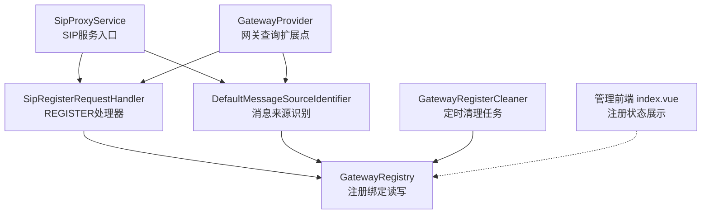
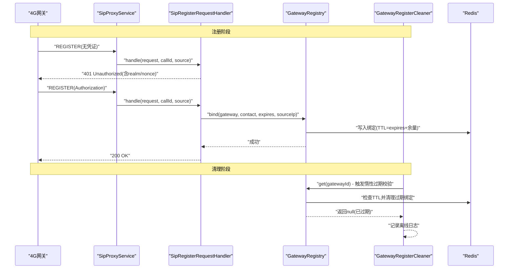
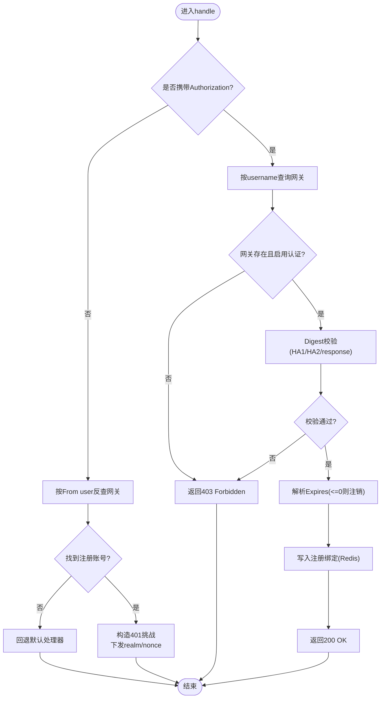
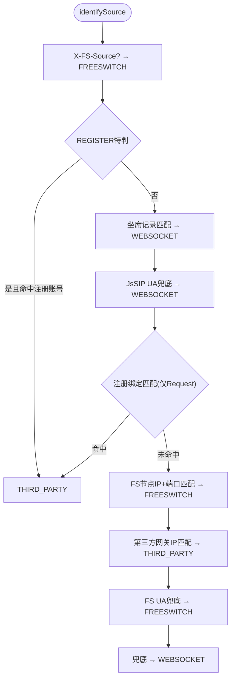
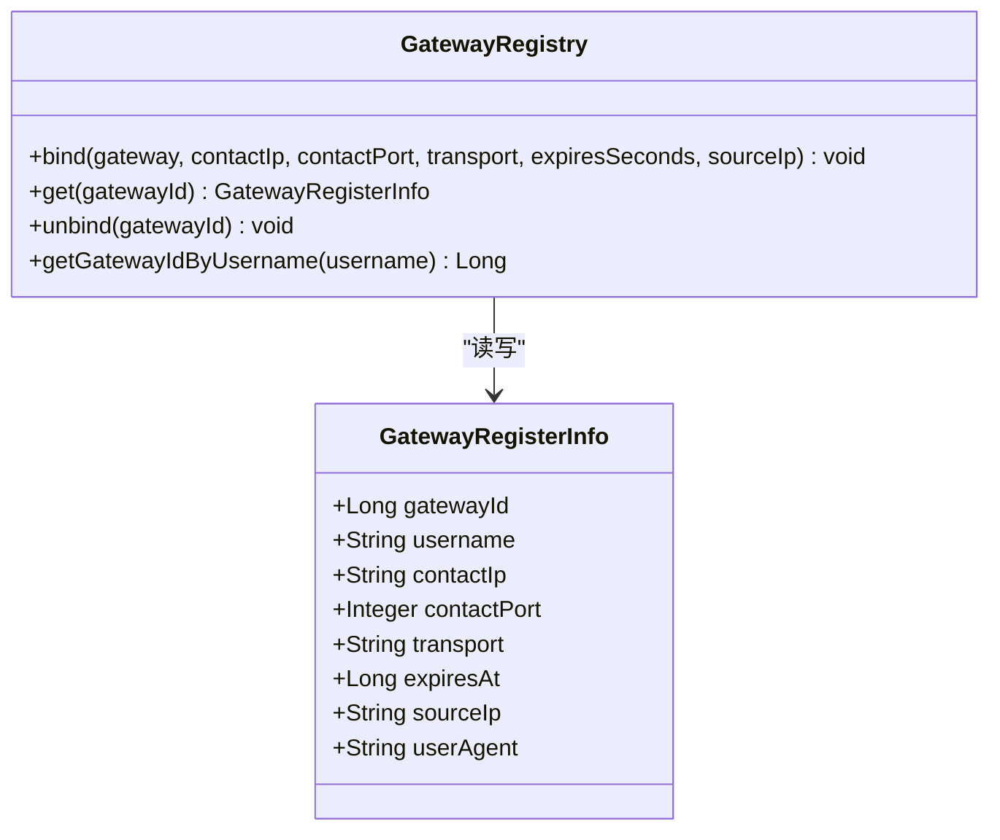
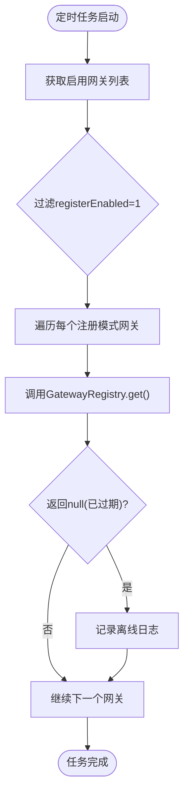
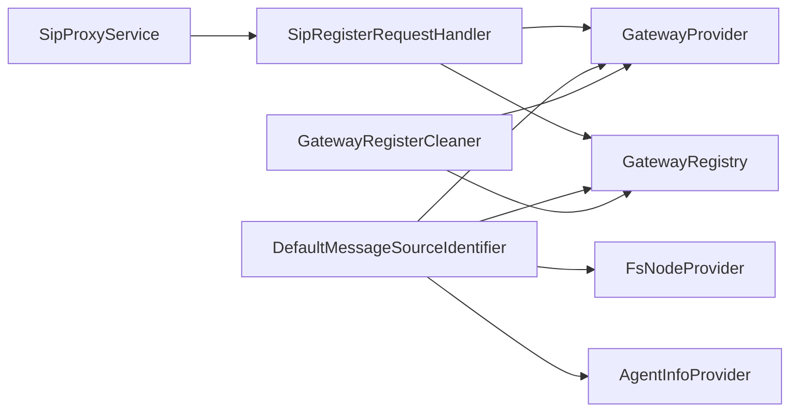

# 4G网关注册模式实现方案

<cite>
**本文引用的文件**
- [SipRegisterRequestHandler.java](file://yudao-cloud/yudao-module-cc/ipcc-sipproxy/src/main/java/cn/ipcc/sipproxy/core/handler/request/sip/SipRegisterRequestHandler.java)
- [GatewayRegistry.java](file://yudao-cloud/yudao-module-cc/ipcc-sipproxy/src/main/java/cn/ipcc/sipproxy/core/register/GatewayRegistry.java)
- [GatewayRegisterCleaner.java](file://yudao-cloud/yudao-module-cc/ipcc-sipproxy/src/main/java/cn/ipcc/sipproxy/core/register/GatewayRegisterCleaner.java)
- [DefaultMessageSourceIdentifier.java](file://yudao-cloud/yudao-module-cc/ipcc-sipproxy/src/main/java/cn/ipcc/sipproxy/defaults/gateway/DefaultMessageSourceIdentifier.java)
- [SipProxyAutoConfiguration.java](file://yudao-cloud/yudao-module-cc/ipcc-sipproxy/src/main/java/cn/ipcc/sipproxy/autoconfigure/SipProxyAutoConfiguration.java)
- [MessageSourceIdentifier.java](file://yudao-cloud/yudao-module-cc/ipcc-sipproxy/src/main/java/cn/ipcc/sipproxy/api/gateway/MessageSourceIdentifier.java)
- [index.vue](file://yudao-ui-admin-vue3/src/views/cc/sipproxygateway/index.vue)
</cite>

## 更新摘要
**变更内容**

- 文档状态更新：原计划文档（docs/4g-gateway-register-plan.md、docs/4g-gateway-register-implementation.md）已被完全移除，该功能已从代码库中删除
- 保留核心实现代码分析：REGISTER处理器、注册绑定管理、定时清理任务等核心组件仍存在于代码库中
- 更新文档引用：移除对已删除文档的引用，仅保留实际存在的代码文件引用
- 调整章节结构：简化引言部分，聚焦于当前代码实现状态

## 目录
1. [引言](#引言)
2. [项目结构](#项目结构)
3. [核心组件](#核心组件)
4. [架构总览](#架构总览)
5. [详细组件分析](#详细组件分析)
6. [依赖关系分析](#依赖关系分析)
7. [性能与可靠性](#性能与可靠性)
8. [故障排查指南](#故障排查指南)
9. [结论](#结论)
10. [附录](#附录)

## 引言

本方案基于现有代码库中的4G网关注册模式实现，提供SIP通道REGISTER处理、网关注册绑定管理、呼入来源识别特判等功能。虽然相关计划文档已被移除，但核心代码实现仍然完整存在，包括REGISTER处理器、注册绑定管理器、定时清理任务和前端状态展示等功能。

- 目标：在sipproxy中实现REGISTER处理链路（401/Digest/200 + Redis绑定），并在呼入/呼出路径中利用注册绑定进行来源识别与目标解析
- 技术栈：Java / Spring Boot / JAIN-SIP / MyBatis-Plus / Redis / Vue 3 + Element Plus
- 约束：不直接操作生产网络环境；涉及云安全组/nginx/防火墙调整需由用户侧处理

## 项目结构

围绕4G网关注册模式的关键代码集中在yudao-module-cc/ipcc-sipproxy模块，配合管理前端展示注册状态。

**图表来源**
- [SipRegisterRequestHandler.java:97-158](file://yudao-cloud/yudao-module-cc/ipcc-sipproxy/src/main/java/cn/ipcc/sipproxy/core/handler/request/sip/SipRegisterRequestHandler.java#L97-L158)
- [DefaultMessageSourceIdentifier.java:127-341](file://yudao-cloud/yudao-module-cc/ipcc-sipproxy/src/main/java/cn/ipcc/sipproxy/defaults/gateway/DefaultMessageSourceIdentifier.java#L127-L341)
- [GatewayRegistry.java:57-163](file://yudao-cloud/yudao-module-cc/ipcc-sipproxy/src/main/java/cn/ipcc/sipproxy/core/register/GatewayRegistry.java#L57-L163)
- [GatewayRegisterCleaner.java:42-63](file://yudao-cloud/yudao-module-cc/ipcc-sipproxy/src/main/java/cn/ipcc/sipproxy/core/register/GatewayRegisterCleaner.java#L42-L63)
- [index.vue:135-149](file://yudao-ui-admin-vue3/src/views/cc/sipproxygateway/index.vue#L135-L149)

## 核心组件

- SipRegisterRequestHandler：处理第三方网关注册（401挑战→Digest校验→200OK+绑定；Expires=0注销）
- GatewayRegistry：维护网关注册绑定（Redis），支持bind/get/unbind及按账号反查
- GatewayRegisterCleaner：定时清理过期注册绑定的任务组件
- DefaultMessageSourceIdentifier：在来源识别中增加REGISTER特判与注册绑定匹配层，避免与自有FS冲突
- 管理前端：对registerEnabled=1的网关显示注册状态（在线/离线）

**章节来源**
- [SipRegisterRequestHandler.java:97-158](file://yudao-cloud/yudao-module-cc/ipcc-sipproxy/src/main/java/cn/ipcc/sipproxy/core/handler/request/sip/SipRegisterRequestHandler.java#L97-L158)
- [GatewayRegistry.java:57-163](file://yudao-cloud/yudao-module-cc/ipcc-sipproxy/src/main/java/cn/ipcc/sipproxy/core/register/GatewayRegistry.java#L57-L163)
- [GatewayRegisterCleaner.java:42-63](file://yudao-cloud/yudao-module-cc/ipcc-sipproxy/src/main/java/cn/ipcc/sipproxy/core/register/GatewayRegisterCleaner.java#L42-L63)
- [DefaultMessageSourceIdentifier.java:139-158](file://yudao-cloud/yudao-module-cc/ipcc-sipproxy/src/main/java/cn/ipcc/sipproxy/defaults/gateway/DefaultMessageSourceIdentifier.java#L139-L158)
- [index.vue:135-149](file://yudao-ui-admin-vue3/src/views/cc/sipproxygateway/index.vue#L135-L149)

## 架构总览

注册型网关通过UDP/TCP向sipproxy发起REGISTER，完成Digest认证后，sipproxy将Contact地址与有效期写入Redis；后续呼入/呼出路径依据该绑定进行来源识别与目标解析。GatewayRegisterCleaner每60秒扫描一次注册模式网关，触发过期绑定的惰性清理。

**图表来源**
- [SipRegisterRequestHandler.java:97-158](file://yudao-cloud/yudao-module-cc/ipcc-sipproxy/src/main/java/cn/ipcc/sipproxy/core/handler/request/sip/SipRegisterRequestHandler.java#L97-L158)
- [GatewayRegistry.java:57-163](file://yudao-cloud/yudao-module-cc/ipcc-sipproxy/src/main/java/cn/ipcc/sipproxy/core/register/GatewayRegistry.java#L57-L163)
- [GatewayRegisterCleaner.java:42-63](file://yudao-cloud/yudao-module-cc/ipcc-sipproxy/src/main/java/cn/ipcc/sipproxy/core/register/GatewayRegisterCleaner.java#L42-L63)

## 详细组件分析

### 网关注册处理器（SipRegisterRequestHandler）

- 职责：处理第三方网关注册，完成401挑战、Digest校验、200OK或403返回；根据Expires头执行绑定或注销
- 关键点：
    - 仅处理THIRD_PARTY来源（来源识别已对REGISTER做特判）
    - realm回退链：register_realm→from_domain→sip.public-ip
    - Expires上限受网关表registerMaxExpires限制
    - 响应经服务端事务发送，避免UDP/TCP通道下空操作
    - 使用Redis存储nonce票据，防止重放攻击

**图表来源**
- [SipRegisterRequestHandler.java:97-158](file://yudao-cloud/yudao-module-cc/ipcc-sipproxy/src/main/java/cn/ipcc/sipproxy/core/handler/request/sip/SipRegisterRequestHandler.java#L97-L158)
- [SipRegisterRequestHandler.java:175-206](file://yudao-cloud/yudao-module-cc/ipcc-sipproxy/src/main/java/cn/ipcc/sipproxy/core/handler/request/sip/SipRegisterRequestHandler.java#L175-L206)
- [SipRegisterRequestHandler.java:277-333](file://yudao-cloud/yudao-module-cc/ipcc-sipproxy/src/main/java/cn/ipcc/sipproxy/core/handler/request/sip/SipRegisterRequestHandler.java#L277-L333)

**章节来源**
- [SipRegisterRequestHandler.java:97-158](file://yudao-cloud/yudao-module-cc/ipcc-sipproxy/src/main/java/cn/ipcc/sipproxy/core/handler/request/sip/SipRegisterRequestHandler.java#L97-L158)
- [SipRegisterRequestHandler.java:175-206](file://yudao-cloud/yudao-module-cc/ipcc-sipproxy/src/main/java/cn/ipcc/sipproxy/core/handler/request/sip/SipRegisterRequestHandler.java#L175-L206)
- [SipRegisterRequestHandler.java:277-333](file://yudao-cloud/yudao-module-cc/ipcc-sipproxy/src/main/java/cn/ipcc/sipproxy/core/handler/request/sip/SipRegisterRequestHandler.java#L277-L333)

### 消息来源识别（DefaultMessageSourceIdentifier）

- 新增第0.5层：REGISTER请求按From user反查网关，命中即THIRD_PARTY，避免与自有FS冲突
- 新增第2.5层：注册绑定匹配（From user索引/From domain或源IP命中Contact IP），置于FS节点匹配之前，仅对Request生效
- 保护条件：in-dialog请求、X-Gateway-Id头、源IP命中自有FS时跳过注册绑定匹配，防止误判

**图表来源**
- [DefaultMessageSourceIdentifier.java:127-341](file://yudao-cloud/yudao-module-cc/ipcc-sipproxy/src/main/java/cn/ipcc/sipproxy/defaults/gateway/DefaultMessageSourceIdentifier.java#L127-L341)
- [DefaultMessageSourceIdentifier.java:409-447](file://yudao-cloud/yudao-module-cc/ipcc-sipproxy/src/main/java/cn/ipcc/sipproxy/defaults/gateway/DefaultMessageSourceIdentifier.java#L409-L447)

**章节来源**
- [DefaultMessageSourceIdentifier.java:127-341](file://yudao-cloud/yudao-module-cc/ipcc-sipproxy/src/main/java/cn/ipcc/sipproxy/defaults/gateway/DefaultMessageSourceIdentifier.java#L127-L341)
- [DefaultMessageSourceIdentifier.java:409-447](file://yudao-cloud/yudao-module-cc/ipcc-sipproxy/src/main/java/cn/ipcc/sipproxy/defaults/gateway/DefaultMessageSourceIdentifier.java#L409-L447)

### 注册绑定管理器（GatewayRegistry）

- 功能：bind（写绑定+账号索引，TTL=expires+宽限）、get（惰性过期校验）、unbind（删除绑定与索引）、按账号反查gatewayId
- 设计要点：宽限期避免续订空窗导致的误离线；异常反序列化自动清理脏数据

**图表来源**
- [GatewayRegistry.java:57-163](file://yudao-cloud/yudao-module-cc/ipcc-sipproxy/src/main/java/cn/ipcc/sipproxy/core/register/GatewayRegistry.java#L57-L163)

**章节来源**
- [GatewayRegistry.java:57-163](file://yudao-cloud/yudao-module-cc/ipcc-sipproxy/src/main/java/cn/ipcc/sipproxy/core/register/GatewayRegistry.java#L57-L163)

### 定时清理任务（GatewayRegisterCleaner）

- 功能：每60秒扫描一次注册模式网关，调用GatewayRegistry.get触发过期校验，自动清理过期绑定并记录离线日志
- 设计要点：仅扫描registerEnabled=1的网关，避免对静态直连网关产生噪音日志；异常仅记录日志不中断扫描

**图表来源**
- [GatewayRegisterCleaner.java:42-63](file://yudao-cloud/yudao-module-cc/ipcc-sipproxy/src/main/java/cn/ipcc/sipproxy/core/register/GatewayRegisterCleaner.java#L42-L63)

**章节来源**

- [GatewayRegisterCleaner.java:42-63](file://yudao-cloud/yudao-module-cc/ipcc-sipproxy/src/main/java/cn/ipcc/sipproxy/core/register/GatewayRegisterCleaner.java#L42-L63)

### 服务装配与事务发送

- 在SipProxyAutoConfiguration中注册默认消息来源识别器，注入GatewayRegistry依赖
- MessageSourceIdentifier接口提供消息来源识别扩展点，支持自定义实现

**章节来源**

- [SipProxyAutoConfiguration.java:149-169](file://yudao-cloud/yudao-module-cc/ipcc-sipproxy/src/main/java/cn/ipcc/sipproxy/autoconfigure/SipProxyAutoConfiguration.java#L149-L169)
- [MessageSourceIdentifier.java:1-22](file://yudao-cloud/yudao-module-cc/ipcc-sipproxy/src/main/java/cn/ipcc/sipproxy/api/gateway/MessageSourceIdentifier.java#L1-L22)

### 管理前端状态展示

- 对registerEnabled=1的网关显示注册状态（在线/离线），基于字典标签渲染
- 并行拉取列表与注册状态映射，状态接口失败不影响列表展示

**章节来源**
- [index.vue:135-149](file://yudao-ui-admin-vue3/src/views/cc/sipproxygateway/index.vue#L135-L149)
- [index.vue:234-248](file://yudao-ui-admin-vue3/src/views/cc/sipproxygateway/index.vue#L234-L248)

## 依赖关系分析

- 处理器依赖：SipRegisterRequestHandler依赖GatewayProvider（按账号查网关）、GatewayRegistry（绑定读写）、SipProxyProperties（public-ip）
- 来源识别依赖：DefaultMessageSourceIdentifier依赖GatewayProvider、GatewayRegistry、FsNodeProvider、AgentInfoProvider
- 清理任务依赖：GatewayRegisterCleaner依赖GatewayRegistry、GatewayProvider
- 服务装配：SipProxyAutoConfiguration注册默认消息来源识别器，注入GatewayRegistry依赖

**图表来源**
- [SipRegisterRequestHandler.java:65-79](file://yudao-cloud/yudao-module-cc/ipcc-sipproxy/src/main/java/cn/ipcc/sipproxy/core/handler/request/sip/SipRegisterRequestHandler.java#L65-L79)
- [DefaultMessageSourceIdentifier.java:61-82](file://yudao-cloud/yudao-module-cc/ipcc-sipproxy/src/main/java/cn/ipcc/sipproxy/defaults/gateway/DefaultMessageSourceIdentifier.java#L61-L82)
- [GatewayRegisterCleaner.java:29-33](file://yudao-cloud/yudao-module-cc/ipcc-sipproxy/src/main/java/cn/ipcc/sipproxy/core/register/GatewayRegisterCleaner.java#L29-L33)

**章节来源**
- [SipRegisterRequestHandler.java:65-79](file://yudao-cloud/yudao-module-cc/ipcc-sipproxy/src/main/java/cn/ipcc/sipproxy/core/handler/request/sip/SipRegisterRequestHandler.java#L65-L79)
- [DefaultMessageSourceIdentifier.java:61-82](file://yudao-cloud/yudao-module-cc/ipcc-sipproxy/src/main/java/cn/ipcc/sipproxy/defaults/gateway/DefaultMessageSourceIdentifier.java#L61-L82)
- [GatewayRegisterCleaner.java:29-33](file://yudao-cloud/yudao-module-cc/ipcc-sipproxy/src/main/java/cn/ipcc/sipproxy/core/register/GatewayRegisterCleaner.java#L29-L33)

## 性能与可靠性

- 注册绑定TTL带宽限期，减少续订时序抖动导致的误离线
- 来源识别采用多层级短路判断，优先精确匹配（X-FS-Source、坐席记录、FS节点），再匹配第三方网关，降低误判概率
- 响应发送经服务端事务，避免UDP/TCP通道下的空操作与丢包风险
- 定时清理任务仅扫描注册模式网关，减少日志噪音与无效遍历
- GatewayRegisterCleaner每60秒执行一次，平衡了清理频率与系统开销

## 故障排查指南

- 注册失败（403）：检查网关auth_type与密码是否正确；确认realm回退链一致；核对Digest计算
- 注册绑定未生效：确认Redis Key前缀与TTL；检查GatewayRegistry.bind调用是否触发；查看get的惰性过期逻辑
- 呼入来源误判：核查DefaultMessageSourceIdentifier的第0.5/2.5层命中情况；确认in-dialog/X-Gateway-Id/自有FS命中时的跳过逻辑
- 清理任务异常：检查GatewayRegisterCleaner的定时任务是否正常执行；查看异常日志中的msg字段

**章节来源**
- [SipRegisterRequestHandler.java:175-206](file://yudao-cloud/yudao-module-cc/ipcc-sipproxy/src/main/java/cn/ipcc/sipproxy/core/handler/request/sip/SipRegisterRequestHandler.java#L175-L206)
- [GatewayRegistry.java:57-163](file://yudao-cloud/yudao-module-cc/ipcc-sipproxy/src/main/java/cn/ipcc/sipproxy/core/register/GatewayRegistry.java#L57-L163)
- [DefaultMessageSourceIdentifier.java:139-158](file://yudao-cloud/yudao-module-cc/ipcc-sipproxy/src/main/java/cn/ipcc/sipproxy/defaults/gateway/DefaultMessageSourceIdentifier.java#L139-L158)
- [GatewayRegisterCleaner.java:59-61](file://yudao-cloud/yudao-module-cc/ipcc-sipproxy/src/main/java/cn/ipcc/sipproxy/core/register/GatewayRegisterCleaner.java#L59-L61)

## 结论

通过现有的REGISTER处理器、注册绑定管理、定时清理任务和来源识别特判，系统实现了完整的4G网关注册模式功能。关键保障包括：严格的Digest认证、带宽限期的绑定TTL、多层级来源识别、事务化响应发送和自动化的过期清理机制。虽然相关计划文档已被移除，但核心代码实现保持完整，功能稳定可靠。

## 附录
- 参考文档：
    - 4G语音网关接入分析与现状说明：[4g-voice-gateway-integration.md](file://docs/4g-voice-gateway-integration.md)

**章节来源**
- [4g-voice-gateway-integration.md:1-18](file://docs/4g-voice-gateway-integration.md#L1-L18)