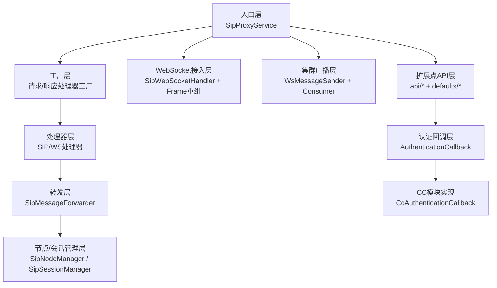
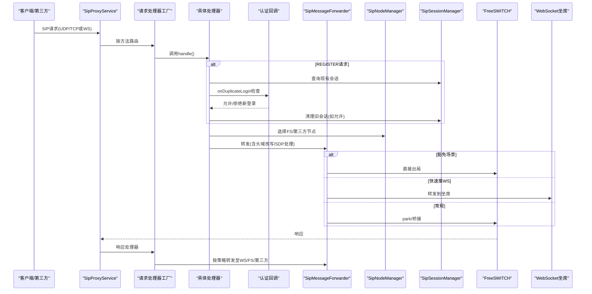
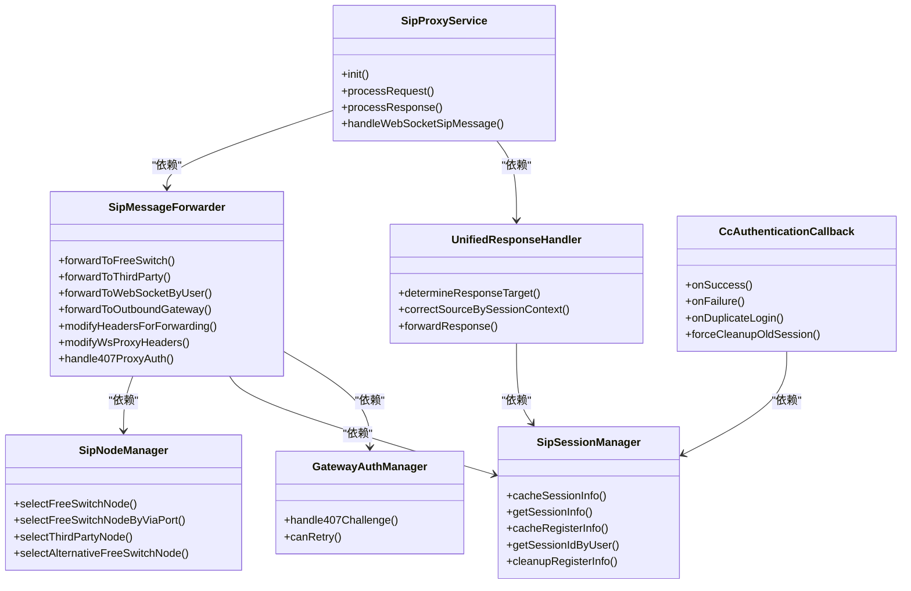
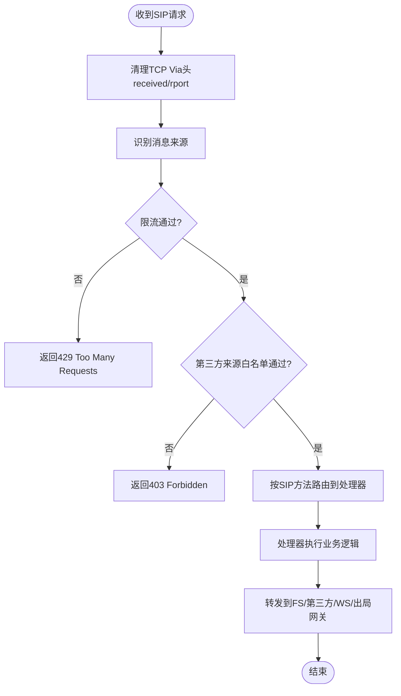
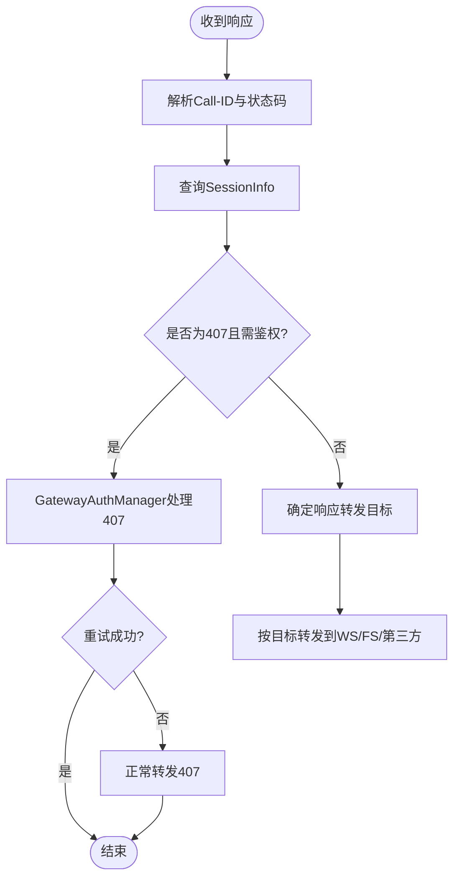
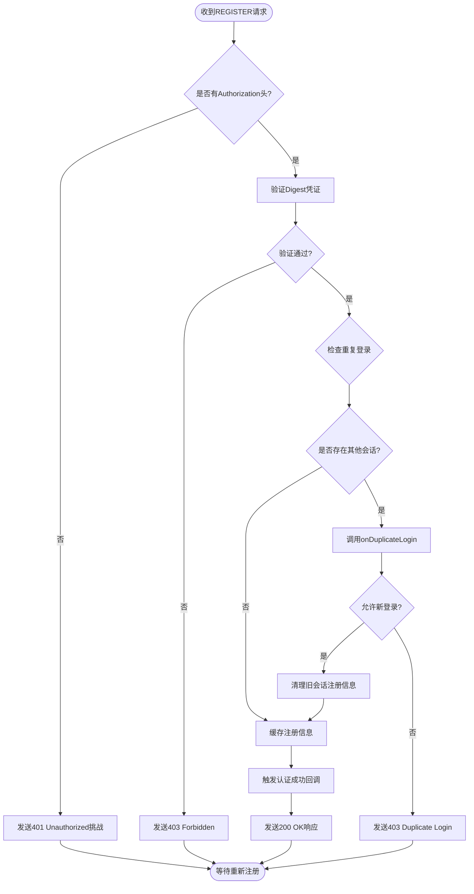

# SIP代理架构

<cite>
**本文引用的文件**
- [sipproxy组件架构设计.md](file://yudao-cloud/yudao-module-cc/ipcc-sipproxy/sipproxy组件架构设计.md)
- [SipProxyService.java](file://yudao-cloud/yudao-module-cc/ipcc-sipproxy/src/main/java/cn/ipcc/sipproxy/core/SipProxyService.java)
- [SipMessageForwarder.java](file://yudao-cloud/yudao-module-cc/ipcc-sipproxy/src/main/java/cn/ipcc/sipproxy/core/forwarder/SipMessageForwarder.java)
- [SipNodeManager.java](file://yudao-cloud/yudao-module-cc/ipcc-sipproxy/src/main/java/cn/ipcc/sipproxy/core/node/SipNodeManager.java)
- [SipSessionManager.java](file://yudao-cloud/yudao-module-cc/ipcc-sipproxy/src/main/java/cn/ipcc/sipproxy/core/session/SipSessionManager.java)
- [GatewayAuthManager.java](file://yudao-cloud/yudao-module-cc/ipcc-sipproxy/src/main/java/cn/ipcc/sipproxy/core/auth/GatewayAuthManager.java)
- [UnifiedResponseHandler.java](file://yudao-cloud/yudao-module-cc/ipcc-sipproxy/src/main/java/cn/ipcc/sipproxy/core/handler/response/UnifiedResponseHandler.java)
- [SipWebSocketHandler.java](file://yudao-cloud/yudao-module-cc/ipcc-sipproxy/src/main/java/cn/ipcc/sipproxy/websocket/SipWebSocketHandler.java)
- [SipFrameReassembler.java](file://yudao-cloud/yudao-module-cc/ipcc-sipproxy/src/main/java/cn/ipcc/sipproxy/websocket/SipFrameReassembler.java)
- [ClusterBroadcastConsumer.java](file://yudao-cloud/yudao-module-cc/ipcc-sipproxy/src/main/java/cn/ipcc/sipproxy/cluster/ClusterBroadcastConsumer.java)
- [WsMessageSender.java](file://yudao-cloud/yudao-module-cc/ipcc-sipproxy/src/main/java/cn/ipcc/sipproxy/cluster/WsMessageSender.java)
- [SipMethod.java](file://yudao-cloud/yudao-module-cc/ipcc-sipproxy/src/main/java/cn/ipcc/sipproxy/core/annotation/SipMethod.java)
- [RedisConstants.java](file://yudao-cloud/yudao-module-cc/ipcc-sipproxy/src/main/java/cn/ipcc/sipproxy/support/RedisConstants.java)
- [SipProxyConstants.java](file://yudao-cloud/yudao-module-cc/ipcc-sipproxy/src/main/java/cn/ipcc/sipproxy/support/SipProxyConstants.java)
- [SipProxyException.java](file://yudao-cloud/yudao-module-cc/ipcc-sipproxy/src/main/java/cn/ipcc/sipproxy/support/SipProxyException.java)
- [SipProxyErrorCodeConstants.java](file://yudao-cloud/yudao-module-cc/ipcc-sipproxy/src/main/java/cn/ipcc/sipproxy/support/SipProxyErrorCodeConstants.java)
- [SipAnalysisUtil.java](file://yudao-cloud/yudao-module-cc/ipcc-sipproxy/src/main/java/cn/ipcc/sipproxy/core/utils/SipAnalysisUtil.java)
- [AbstractSipRequestHandler.java](file://yudao-cloud/yudao-module-cc/ipcc-sipproxy/src/main/java/cn/ipcc/sipproxy/core/handler/request/sip/AbstractSipRequestHandler.java)
- [SipInviteRequestHandler.java](file://yudao-cloud/yudao-module-cc/ipcc-sipproxy/src/main/java/cn/ipcc/sipproxy/core/handler/request/sip/SipInviteRequestHandler.java)
- [SipByeRequestHandler.java](file://yudao-cloud/yudao-module-cc/ipcc-sipproxy/src/main/java/cn/ipcc/sipproxy/core/handler/request/sip/SipByeRequestHandler.java)
- [SipDefaultRequestHandler.java](file://yudao-cloud/yudao-module-cc/ipcc-sipproxy/src/main/java/cn/ipcc/sipproxy/core/handler/request/sip/SipDefaultRequestHandler.java)
- [AbstractWsSipRequestHandler.java](file://yudao-cloud/yudao-module-cc/ipcc-sipproxy/src/main/java/cn/ipcc/sipproxy/core/handler/request/ws/AbstractWsSipRequestHandler.java)
- [WsInviteRequestHandler.java](file://yudao-cloud/yudao-module-cc/ipcc-sipproxy/src/main/java/cn/ipcc/sipproxy/core/handler/request/ws/WsInviteRequestHandler.java)
- [WsByeRequestHandler.java](file://yudao-cloud/yudao-module-cc/ipcc-sipproxy/src/main/java/cn/ipcc/sipproxy/core/handler/request/ws/WsByeRequestHandler.java)
- [WsReferRequestHandler.java](file://yudao-cloud/yudao-module-cc/ipcc-sipproxy/src/main/java/cn/ipcc/sipproxy/core/handler/request/ws/WsReferRequestHandler.java)
- [WsRegisterRequestHandler.java](file://yudao-cloud/yudao-module-cc/ipcc-sipproxy/src/main/java/cn/ipcc/sipproxy/core/handler/request/ws/WsRegisterRequestHandler.java)
- [WsOptionsRequestHandler.java](file://yudao-cloud/yudao-module-cc/ipcc-sipproxy/src/main/java/cn/ipcc/sipproxy/core/handler/request/ws/WsOptionsRequestHandler.java)
- [WsDefaultRequestHandler.java](file://yudao-cloud/yudao-module-cc/ipcc-sipproxy/src/main/java/cn/ipcc/sipproxy/core/handler/request/ws/WsDefaultRequestHandler.java)
- [CcAuthenticationCallback.java](file://yudao-cloud/yudao-module-cc/yudao-module-cc-server/src/main/java/cn/iocoder/yudao/module/cc/sipproxy/integration/CcAuthenticationCallback.java)
- [CcWebSocketMessageSender.java](file://yudao-cloud/yudao-module-cc/yudao-module-cc-server/src/main/java/cn/iocoder/yudao/module/cc/websocket/core/sender/CcWebSocketMessageSender.java)
- [WebSocketClient.ts](file://yudao-ui-admin-vue3/src/layout/components/SoftPhone/src/WebSocketClient.ts)
</cite>

## 更新摘要
**所做更改**
- 新增坐席唯一登录检查机制，通过CcAuthenticationCallback接口实现重复登录检测与强制下线逻辑
- 增强WsRegisterRequestHandler处理器，集成认证回调和会话管理功能
- 扩展WebSocket消息通信能力，支持强制下线消息类型定义
- 更新注册流程文档，包含重复登录检测和用户确认机制

## 目录
1. [简介](#简介)
2. [项目结构](#项目结构)
3. [核心组件](#核心组件)
4. [架构总览](#架构总览)
5. [详细组件分析](#详细组件分析)
6. [依赖关系分析](#依赖关系分析)
7. [性能考量](#性能考量)
8. [故障排查指南](#故障排查指南)
9. [结论](#结论)
10. [附录](#附录)

## 简介
本文件为IPCC呼叫中心系统的SIP代理（B2BUA）架构文档，聚焦于五层架构（入口层、工厂层、处理器层、转发层、节点/会话管理层），并覆盖WebSocket接入层、集群广播层与扩展点API层。文档基于模块的自描述设计与实现，系统阐述SIP协议栈初始化、消息解析、头域改写、故障转移、注册鉴权、响应路由等关键技术，并提供请求处理流程图与组件交互图，以及自定义处理器开发与性能优化建议。

**更新** 新增了坐席唯一登录检查机制，通过CcAuthenticationCallback接口实现重复登录检测和强制下线功能，增强了注册流程的安全性和用户体验。

## 项目结构
该模块采用完全独立的Spring Boot工程组织，围绕"入口→工厂→处理器→转发→节点/会话管理"的分层进行解耦设计，并通过扩展点接口与父程序解耦，默认实现保证可独立启动。

图表来源
- [sipproxy组件架构设计.md:47-147](file://yudao-cloud/yudao-module-cc/ipcc-sipproxy/sipproxy组件架构设计.md#L47-L147)
- [CcAuthenticationCallback.java:31-101](file://yudao-cloud/yudao-module-cc/yudao-module-cc-server/src/main/java/cn/iocoder/yudao/module/cc/sipproxy/integration/CcAuthenticationCallback.java#L31-L101)

章节来源
- [sipproxy组件架构设计.md:47-147](file://yudao-cloud/yudao-module-cc/ipcc-sipproxy/sipproxy组件架构设计.md#L47-L147)

## 核心组件
- 入口服务：负责SIP栈初始化、UDP/TCP监听、WebSocket消息分发、生命周期管理。
- 工厂层：按SIP方法自动扫描注册处理器，统一响应处理。
- 处理器层：分别处理来自FS/第三方与WebSocket的请求，封装业务逻辑与转发决策。
- 转发层：封装FS/第三方/WS/出局网关四种目标发送、头域改写、SDP处理与故障转移。
- 节点/会话管理层：维护FS/第三方节点选择与会话状态缓存（Redis）。
- WebSocket接入层：文本帧重组、握手拦截、会话管理与僵尸清理。
- 集群广播层：多实例间WebSocket消息广播（local/redis/kafka/rabbitmq/rocketmq）。
- 扩展点API层：认证、鉴权、路由、媒体、安全、追踪、传输等扩展点及默认实现。
- **新增** 认证回调层：提供AuthenticationCallback接口，用于处理注册成功、失败和重复登录场景。

章节来源
- [sipproxy组件架构设计.md:149-183](file://yudao-cloud/yudao-module-cc/ipcc-sipproxy/sipproxy组件架构设计.md#L149-L183)

## 架构总览
整体采用B2BUA模式，维持两段独立对话，通过会话管理器持久化Call-ID到节点映射，确保BYE与会话内方法一致性；不依赖Record-Route，显式移除以居中转发。

图表来源
- [sipproxy组件架构设计.md:255-520](file://yudao-cloud/yudao-module-cc/ipcc-sipproxy/sipproxy组件架构设计.md#L255-L520)
- [SipProxyService.java](file://yudao-cloud/yudao-module-cc/ipcc-sipproxy/src/main/java/cn/ipcc/sipproxy/core/SipProxyService.java)
- [SipMessageForwarder.java](file://yudao-cloud/yudao-module-cc/ipcc-sipproxy/src/main/java/cn/ipcc/sipproxy/core/forwarder/SipMessageForwarder.java)
- [SipNodeManager.java](file://yudao-cloud/yudao-module-cc/ipcc-sipproxy/src/main/java/cn/ipcc/sipproxy/core/node/SipNodeManager.java)
- [SipSessionManager.java](file://yudao-cloud/yudao-module-cc/ipcc-sipproxy/src/main/java/cn/ipcc/sipproxy/core/session/SipSessionManager.java)
- [UnifiedResponseHandler.java](file://yudao-cloud/yudao-module-cc/ipcc-sipproxy/src/main/java/cn/ipcc/sipproxy/core/handler/response/UnifiedResponseHandler.java)
- [CcAuthenticationCallback.java:74-80](file://yudao-cloud/yudao-module-cc/yudao-module-cc-server/src/main/java/cn/iocoder/yudao/module/cc/sipproxy/integration/CcAuthenticationCallback.java#L74-L80)

## 详细组件分析

### 入口层：SipProxyService
- 职责：实现SipListener，初始化SIP栈（UDP+TCP）、处理请求/响应、处理WebSocket SIP消息、生命周期管理。
- 关键点：
  - 初始化时创建SipStack、ListeningPoint、SipProvider，注入各工厂与转发器。
  - processRequest中执行来源识别、限流、白名单校验后路由到处理器。
  - handleWebSocketSipMessage中解析文本、提取Call-ID、更新WebSocket Contact、添加UA标识后分发。
  - cleanViaHeaderForTcpRequest清理NAT参数，避免错误路由。

章节来源
- [sipproxy组件架构设计.md:524-562](file://yudao-cloud/yudao-module-cc/ipcc-sipproxy/sipproxy组件架构设计.md#L524-L562)
- [SipProxyService.java](file://yudao-cloud/yudao-module-cc/ipcc-sipproxy/src/main/java/cn/ipcc/sipproxy/core/SipProxyService.java)

### 工厂层：请求/响应处理器工厂
- 请求工厂：按@SipMethod注解自动扫描注册处理器，支持新增处理器零侵入。
- 响应工厂：统一返回响应处理器，集中处理407拦截与策略转发。

章节来源
- [sipproxy组件架构设计.md:151-183](file://yudao-cloud/yudao-module-cc/ipcc-sipproxy/sipproxy组件架构设计.md#L151-L183)
- [SipMethod.java](file://yudao-cloud/yudao-module-cc/ipcc-sipproxy/src/main/java/cn/ipcc/sipproxy/core/annotation/SipMethod.java)

### 处理器层：SIP与WebSocket处理器
- SIP来源处理器：
  - INVITE：识别豁免场景直接出局、已注册坐席快速推WS、否则park到FS。
  - BYE：按To头注册状态转发到WS或第三方。
  - 默认处理器：PRACK/UPDATE/INFO等会话内方法按Call-ID查SessionInfo并决策转发。
- WebSocket来源处理器：
  - INVITE：re-INVITE检测、选择FS、构造SessionInfo并park到FS。
  - BYE：转发到会话绑定的FS。
  - REFER：优先委托扩展点实现ESL编排，否则透明转发FS。
  - **更新** REGISTER：Digest鉴权、注册信息缓存、回调通知、重复登录检查。
  - OPTIONS：心跳处理，返回Allow头。
  - 默认处理器：会话内方法按SessionInfo与响应策略转发。

章节来源
- [sipproxy组件架构设计.md:295-465](file://yudao-cloud/yudao-module-cc/ipcc-sipproxy/sipproxy组件架构设计.md#L295-L465)
- [AbstractSipRequestHandler.java](file://yudao-cloud/yudao-module-cc/ipcc-sipproxy/src/main/java/cn/ipcc/sipproxy/core/handler/request/sip/AbstractSipRequestHandler.java)
- [SipInviteRequestHandler.java](file://yudao-cloud/yudao-module-cc/ipcc-sipproxy/src/main/java/cn/ipcc/sipproxy/core/handler/request/sip/SipInviteRequestHandler.java)
- [SipByeRequestHandler.java](file://yudao-cloud/yudao-module-cc/ipcc-sipproxy/src/main/java/cn/ipcc/sipproxy/core/handler/request/sip/SipByeRequestHandler.java)
- [SipDefaultRequestHandler.java](file://yudao-cloud/yudao-module-cc/ipcc-sipproxy/src/main/java/cn/ipcc/sipproxy/core/handler/request/sip/SipDefaultRequestHandler.java)
- [AbstractWsSipRequestHandler.java](file://yudao-cloud/yudao-module-cc/ipcc-sipproxy/src/main/java/cn/ipcc/sipproxy/core/handler/request/ws/AbstractWsSipRequestHandler.java)
- [WsInviteRequestHandler.java](file://yudao-cloud/yudao-module-cc/ipcc-sipproxy/src/main/java/cn/ipcc/sipproxy/core/handler/request/ws/WsInviteRequestHandler.java)
- [WsByeRequestHandler.java](file://yudao-cloud/yudao-module-cc/ipcc-sipproxy/src/main/java/cn/ipcc/sipproxy/core/handler/request/ws/WsByeRequestHandler.java)
- [WsReferRequestHandler.java](file://yudao-cloud/yudao-module-cc/ipcc-sipproxy/src/main/java/cn/ipcc/sipproxy/core/handler/request/ws/WsReferRequestHandler.java)
- [WsRegisterRequestHandler.java:79-136](file://yudao-cloud/yudao-module-cc/ipcc-sipproxy/src/main/java/cn/ipcc/sipproxy/core/handler/request/ws/WsRegisterRequestHandler.java#L79-L136)
- [WsOptionsRequestHandler.java](file://yudao-cloud/yudao-module-cc/ipcc-sipproxy/src/main/java/cn/ipcc/sipproxy/core/handler/request/ws/WsOptionsRequestHandler.java)
- [WsDefaultRequestHandler.java](file://yudao-cloud/yudao-module-cc/ipcc-sipproxy/src/main/java/cn/ipcc/sipproxy/core/handler/request/ws/WsDefaultRequestHandler.java)

### 转发层：SipMessageForwarder
- 功能：封装FS/第三方/WS/出局网关四种转发目标，提供标准头域改写、WebSocket代理头改写、SDP处理、407鉴权处理与故障转移。
- 关键流程：
  - forwardToFreeSwitch：循环尝试节点，失败则选择备用节点，直至成功或耗尽。
  - forwardToOutboundGateway：豁免场景直接出局，重写头域并缓存原始INVITE用于407重发。
  - modifyHeadersForForwarding：替换Contact/Via/Request-URI为代理公网地址，响应回送来源节点。
  - modifyWsProxyHeaders：将Contact/Via改为ws传输，必要时改写SDP c=行适配WebRTC。
  - handle407ProxyAuth：委托GatewayAuthManager处理407挑战与重发。

章节来源
- [sipproxy组件架构设计.md:563-667](file://yudao-cloud/yudao-module-cc/ipcc-sipproxy/sipproxy组件架构设计.md#L563-L667)
- [SipMessageForwarder.java](file://yudao-cloud/yudao-module-cc/ipcc-sipproxy/src/main/java/cn/ipcc/sipproxy/core/forwarder/SipMessageForwarder.java)

### 节点/会话管理层：SipNodeManager 与 SipSessionManager
- SipNodeManager：
  - selectFreeSwitchNode：一致性哈希选择，保证同一会话路由到同一FS。
  - selectFreeSwitchNodeByViaPort：多FS场景下按Via端口锚定发起节点。
  - selectThirdPartyNode：按sourceIp精确匹配第三方网关节点。
  - selectAlternativeFreeSwitchNode：故障转移选择未尝试节点。
- SipSessionManager：
  - 维护SessionInfo与注册信息的Redis读写，TTL设计保障活跃期一致性与注册存活。
  - **新增** getSessionIdByUser：查询用户当前活跃的WebSocket会话ID。
  - **新增** cleanupRegisterInfo：清理指定会话的注册信息，支持强制下线场景。

章节来源
- [sipproxy组件架构设计.md:729-798](file://yudao-cloud/yudao-module-cc/ipcc-sipproxy/sipproxy组件架构设计.md#L729-L798)
- [SipNodeManager.java](file://yudao-cloud/yudao-module-cc/ipcc-sipproxy/src/main/java/cn/ipcc/sipproxy/core/node/SipNodeManager.java)
- [SipSessionManager.java](file://yudao-cloud/yudao-module-cc/ipcc-sipproxy/src/main/java/cn/ipcc/sipproxy/core/session/SipSessionManager.java)
- [RedisConstants.java](file://yudao-cloud/yudao-module-cc/ipcc-sipproxy/src/main/java/cn/ipcc/sipproxy/support/RedisConstants.java)

### WebSocket接入层
- SipWebSocketHandler：接收文本帧，更新活跃时间，委托Frame重组。
- SipFrameReassembler：分片重组SIP消息，限制最大缓冲大小防止内存溢出。
- 会话管理：本地会话管理与僵尸会话定时清理，保障资源释放。

章节来源
- [sipproxy组件架构设计.md:121-128](file://yudao-cloud/yudao-module-cc/ipcc-sipproxy/sipproxy组件架构设计.md#L121-L128)
- [SipWebSocketHandler.java](file://yudao-cloud/yudao-module-cc/ipcc-sipproxy/src/main/java/cn/ipcc/sipproxy/websocket/SipWebSocketHandler.java)
- [SipFrameReassembler.java](file://yudao-cloud/yudao-module-cc/ipcc-sipproxy/src/main/java/cn/ipcc/sipproxy/websocket/SipFrameReassembler.java)

### 集群广播层
- WsMessageSender：抽象发送接口，支持local/redis/kafka/rabbitmq/rocketmq多种后端。
- ClusterBroadcastConsumer：按目标类型分发到本实例WebSocket会话，实现跨实例广播。

章节来源
- [sipproxy组件架构设计.md:130-135](file://yudao-cloud/yudao-module-cc/ipcc-sipproxy/sipproxy组件架构设计.md#L130-L135)
- [ClusterBroadcastConsumer.java](file://yudao-cloud/yudao-module-cc/ipcc-sipproxy/src/main/java/cn/ipcc/sipproxy/cluster/ClusterBroadcastConsumer.java)
- [WsMessageSender.java](file://yudao-cloud/yudao-module-cc/ipcc-sipproxy/src/main/java/cn/ipcc/sipproxy/cluster/WsMessageSender.java)

### 扩展点API层
- 扩展点包括：AgentInfoProvider、FsNodeProvider、GatewayProvider、MessageSourceIdentifier、OutboundGatewayRewriter、SdpProcessor、IpWhitelist、SipRateLimiter、SipAuthenticationProvider、WsHandshakeAuthenticator、AuthenticationCallback、SipMessageInterceptor、TraceContext、SipMessageTransport。
- 默认实现位于defaults包，使用条件装配，允许父工程覆盖。

章节来源
- [sipproxy组件架构设计.md:137-146](file://yudao-cloud/yudao-module-cc/ipcc-sipproxy/sipproxy组件架构设计.md#L137-L146)

### 认证回调层：CcAuthenticationCallback
- **新增** 职责：实现AuthenticationCallback接口，提供坐席唯一登录检查和强制下线功能。
- 核心功能：
  - onSuccess：记录认证成功日志，审计登录事件。
  - onFailure：记录认证失败原因，便于发现暴力破解攻击。
  - onDuplicateLogin：检测重复登录，返回false拒绝新登录，触发前端强制登录对话框。
  - forceCleanupOldSession：清理旧会话的注册信息，允许新会话重新注册。
- 工作流程：
  1. 检测到同一坐席已有活跃会话 → 调用onDuplicateLogin → 返回false
  2. sipproxy向新客户端发送403 "Duplicate Login"响应
  3. 新客户端弹出"是否强制登录？"对话框
  4. 用户确认后调用force-login接口清理旧会话
  5. 新客户端重新发起REGISTER请求完成登录

章节来源
- [CcAuthenticationCallback.java:31-101](file://yudao-cloud/yudao-module-cc/yudao-module-cc-server/src/main/java/cn/iocoder/yudao/module/cc/sipproxy/integration/CcAuthenticationCallback.java#L31-L101)

### WebSocket消息通信层
- **新增** CcWebSocketMessageSender：提供WebSocket消息发送接口，支持按用户、用户类型、会话ID发送消息。
- 消息类型：支持FORCE_LOGOUT_REQUEST等专用消息类型，用于强制下线通知。
- 前端集成：WebSocketClient.ts中注册消息回调，处理强制下线请求和用户确认。

章节来源
- [CcWebSocketMessageSender.java:10-53](file://yudao-cloud/yudao-module-cc/yudao-module-cc-server/src/main/java/cn/iocoder/yudao/module/cc/websocket/core/sender/CcWebSocketMessageSender.java#L10-L53)
- [WebSocketClient.ts](file://yudao-ui-admin-vue3/src/layout/components/SoftPhone/src/WebSocketClient.ts)

## 依赖关系分析
- 入口服务依赖各工厂、转发器、鉴权管理器、限流器、白名单与来源识别扩展点。
- 处理器依赖转发器与节点/会话管理器，完成业务逻辑与转发决策。
- 转发器依赖节点管理器、网关提供者、鉴权管理器、出站重写器与SDP处理器。
- 节点/会话管理器依赖扩展点获取节点列表，并使用Redis进行状态缓存。
- **新增** 认证回调依赖SipSessionManager，用于查询和清理用户会话信息。

图表来源
- [SipProxyService.java](file://yudao-cloud/yudao-module-cc/ipcc-sipproxy/src/main/java/cn/ipcc/sipproxy/core/SipProxyService.java)
- [SipMessageForwarder.java](file://yudao-cloud/yudao-module-cc/ipcc-sipproxy/src/main/java/cn/ipcc/sipproxy/core/forwarder/SipMessageForwarder.java)
- [SipNodeManager.java](file://yudao-cloud/yudao-module-cc/ipcc-sipproxy/src/main/java/cn/ipcc/sipproxy/core/node/SipNodeManager.java)
- [SipSessionManager.java](file://yudao-cloud/yudao-module-cc/ipcc-sipproxy/src/main/java/cn/ipcc/sipproxy/core/session/SipSessionManager.java)
- [GatewayAuthManager.java](file://yudao-cloud/yudao-module-cc/ipcc-sipproxy/src/main/java/cn/ipcc/sipproxy/core/auth/GatewayAuthManager.java)
- [UnifiedResponseHandler.java](file://yudao-cloud/yudao-module-cc/ipcc-sipproxy/src/main/java/cn/ipcc/sipproxy/core/handler/response/UnifiedResponseHandler.java)
- [CcAuthenticationCallback.java:31-101](file://yudao-cloud/yudao-module-cc/yudao-module-cc-server/src/main/java/cn/iocoder/yudao/module/cc/sipproxy/integration/CcAuthenticationCallback.java#L31-L101)

章节来源
- [sipproxy组件架构设计.md:149-183](file://yudao-cloud/yudao-module-cc/ipcc-sipproxy/sipproxy组件架构设计.md#L149-L183)

## 性能考量
- 一致性哈希路由：使用Call-ID哈希选择FS节点，降低跨节点状态不一致风险。
- 会话缓存TTL：会话级缓存120秒，注册信息3600秒，兼顾活跃刷新与连接存活。
- 故障转移：转发失败时自动选择备用节点，提升可用性。
- WebSocket分片重组：限制最大缓冲，避免大消息导致内存压力。
- 头域改写与SDP处理：仅在必要时改写，减少额外开销。
- 集群广播：根据部署规模选择合适的后端（local/redis/mq），平衡延迟与吞吐。
- **新增** 重复登录检查：通过Redis快速查询用户会话状态，避免数据库查询开销。

## 故障排查指南
- 407鉴权失败：检查GatewayAuthManager的canRetry逻辑、nonce更新与stale标志，确认网关凭证配置正确。
- 节点不可用：查看SipNodeManager的备用节点选择是否生效，确认在线节点列表与缓存一致性。
- WebSocket连接异常：检查SipWebSocketHandler与SipFrameReassembler的日志，确认分片重组与超时清理。
- 响应路由错误：核对UnifiedResponseHandler的策略表与SessionInfo上下文校正逻辑。
- 限流/白名单拦截：确认SipRateLimiter与IpWhitelist配置，避免误拦截合法流量。
- **新增** 重复登录问题：检查CcAuthenticationCallback的onDuplicateLogin逻辑，确认Redis会话状态正常。
- **新增** 强制下线失败：验证forceCleanupOldSession是否正确清理旧会话注册信息。

章节来源
- [GatewayAuthManager.java](file://yudao-cloud/yudao-module-cc/ipcc-sipproxy/src/main/java/cn/ipcc/sipproxy/core/auth/GatewayAuthManager.java)
- [SipNodeManager.java](file://yudao-cloud/yudao-module-cc/ipcc-sipproxy/src/main/java/cn/ipcc/sipproxy/core/node/SipNodeManager.java)
- [SipWebSocketHandler.java](file://yudao-cloud/yudao-module-cc/ipcc-sipproxy/src/main/java/cn/ipcc/sipproxy/websocket/SipWebSocketHandler.java)
- [SipFrameReassembler.java](file://yudao-cloud/yudao-module-cc/ipcc-sipproxy/src/main/java/cn/ipcc/sipproxy/websocket/SipFrameReassembler.java)
- [UnifiedResponseHandler.java](file://yudao-cloud/yudao-module-cc/ipcc-sipproxy/src/main/java/cn/ipcc/sipproxy/core/handler/response/UnifiedResponseHandler.java)
- [CcAuthenticationCallback.java:74-101](file://yudao-cloud/yudao-module-cc/yudao-module-cc-server/src/main/java/cn/iocoder/yudao/module/cc/sipproxy/integration/CcAuthenticationCallback.java#L74-L101)

## 结论
本SIP代理模块以B2BUA为核心，通过清晰的分层与扩展点机制，实现了高可用、可扩展的SIP信令处理能力。其会话与节点管理、头域改写、故障转移与集群广播能力，满足呼叫中心对高并发与高可靠性的要求。配合WebSocket接入与标准化扩展点，便于在任意Spring Boot工程中复用与定制。

**更新** 新增的坐席唯一登录检查机制进一步增强了系统的安全性，通过CcAuthenticationCallback接口提供了灵活的重复登录处理策略，支持强制下线功能，提升了用户体验和管理控制能力。

## 附录

### SIP请求处理流程图（第三方/FS → sipproxy）

图表来源
- [sipproxy组件架构设计.md:255-361](file://yudao-cloud/yudao-module-cc/ipcc-sipproxy/sipproxy组件架构设计.md#L255-L361)

### 响应处理流程图

图表来源
- [sipproxy组件架构设计.md:467-520](file://yudao-cloud/yudao-module-cc/ipcc-sipproxy/sipproxy组件架构设计.md#L467-L520)

### REGISTER请求处理流程图（新增）

图表来源
- [WsRegisterRequestHandler.java:79-136](file://yudao-cloud/yudao-module-cc/ipcc-sipproxy/src/main/java/cn/ipcc/sipproxy/core/handler/request/ws/WsRegisterRequestHandler.java#L79-L136)
- [CcAuthenticationCallback.java:74-101](file://yudao-cloud/yudao-module-cc/yudao-module-cc-server/src/main/java/cn/iocoder/yudao/module/cc/sipproxy/integration/CcAuthenticationCallback.java#L74-L101)

### 自定义处理器开发指南
- 新建处理器类继承对应基类（SIP来源继承AbstractSipRequestHandler，WS来源继承AbstractWsSipRequestHandler）。
- 使用@SipMethod("METHOD")标注支持的SIP方法，工厂将自动注册。
- 在doHandle中实现业务逻辑，调用SipMessageForwarder进行转发，必要时更新SessionInfo。
- 如需拦截或增强，可实现SipMessageInterceptor扩展点，接管ESL编排或修改消息。
- **新增** 如需处理认证相关逻辑，可实现AuthenticationCallback接口，注册重复登录检查和强制下线功能。

章节来源
- [sipproxy组件架构设计.md:137-146](file://yudao-cloud/yudao-module-cc/ipcc-sipproxy/sipproxy组件架构设计.md#L137-L146)
- [SipMethod.java](file://yudao-cloud/yudao-module-cc/ipcc-sipproxy/src/main/java/cn/ipcc/sipproxy/core/annotation/SipMethod.java)
- [CcAuthenticationCallback.java:31-101](file://yudao-cloud/yudao-module-cc/yudao-module-cc-server/src/main/java/cn/iocoder/yudao/module/cc/sipproxy/integration/CcAuthenticationCallback.java#L31-L101)

### 关键数据结构与常量
- SessionInfo：会话信息载体，包含Call-ID、节点绑定、呼叫类型、网关ID、鉴权上下文等。
- Redis常量：定义会话、注册、节点绑定的Key前缀与TTL。
- 常量与异常：SIP代理常量、错误码与统一异常类型。

章节来源
- [sipproxy组件架构设计.md:184-252](file://yudao-cloud/yudao-module-cc/ipcc-sipproxy/sipproxy组件架构设计.md#L184-L252)
- [RedisConstants.java](file://yudao-cloud/yudao-module-cc/ipcc-sipproxy/src/main/java/cn/ipcc/sipproxy/support/RedisConstants.java)
- [SipProxyConstants.java](file://yudao-cloud/yudao-module-cc/ipcc-sipproxy/src/main/java/cn/ipcc/sipproxy/support/SipProxyConstants.java)
- [SipProxyException.java](file://yudao-cloud/yudao-module-cc/ipcc-sipproxy/src/main/java/cn/ipcc/sipproxy/support/SipProxyException.java)
- [SipProxyErrorCodeConstants.java](file://yudao-cloud/yudao-module-cc/ipcc-sipproxy/src/main/java/cn/ipcc/sipproxy/support/SipProxyErrorCodeConstants.java)

### 工具与辅助
- SipAnalysisUtil：提供SIP文本/对象解析、头域提取、来源IP提取、响应构造等工具方法。

章节来源
- [SipAnalysisUtil.java](file://yudao-cloud/yudao-module-cc/ipcc-sipproxy/src/main/java/cn/ipcc/sipproxy/core/utils/SipAnalysisUtil.java)