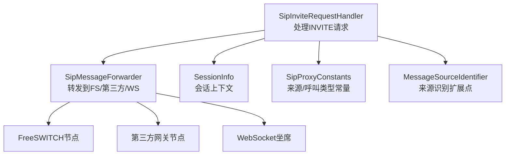
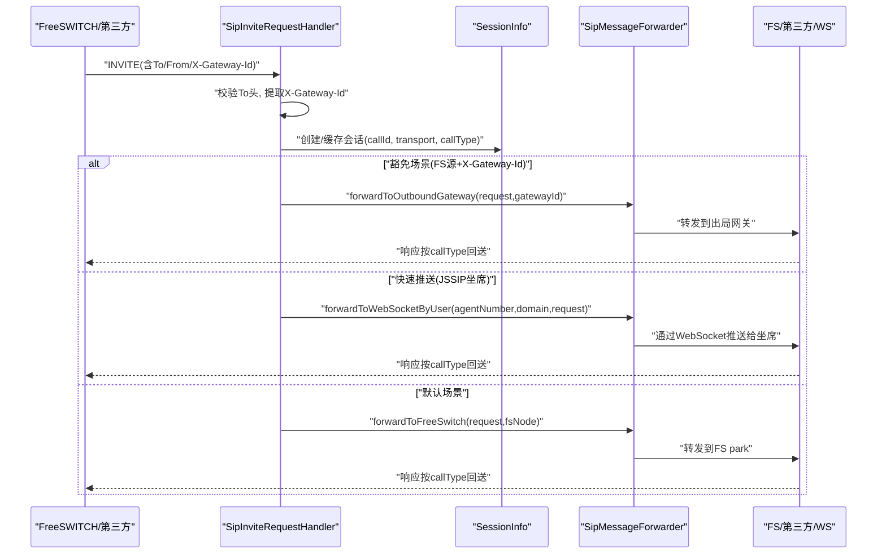
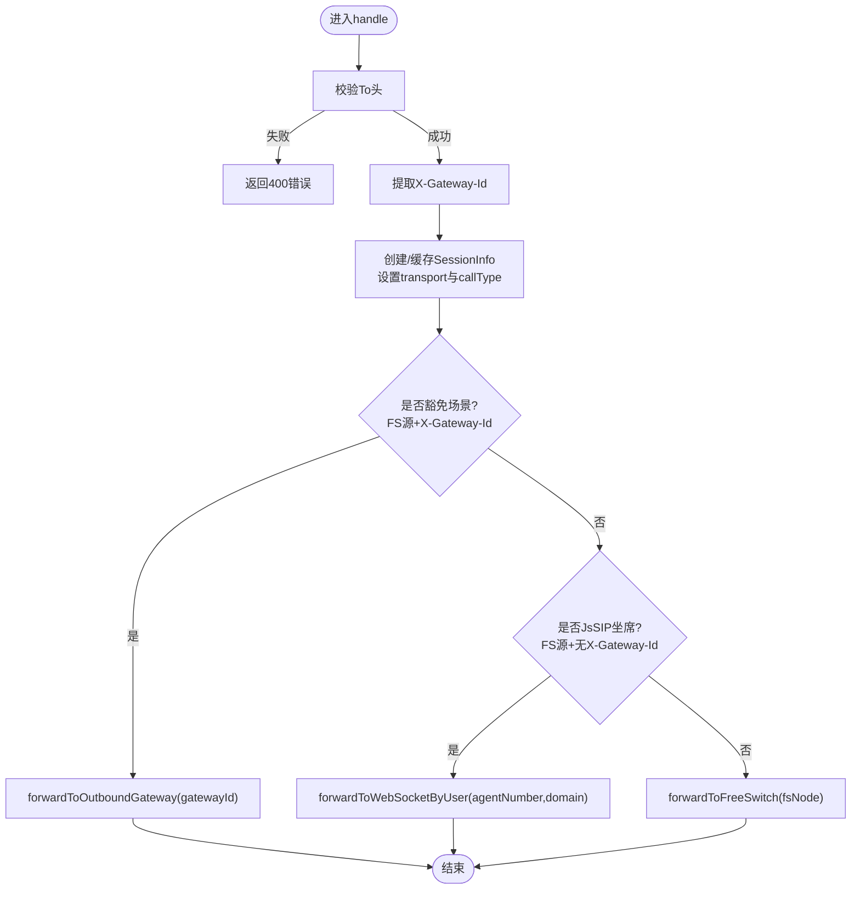
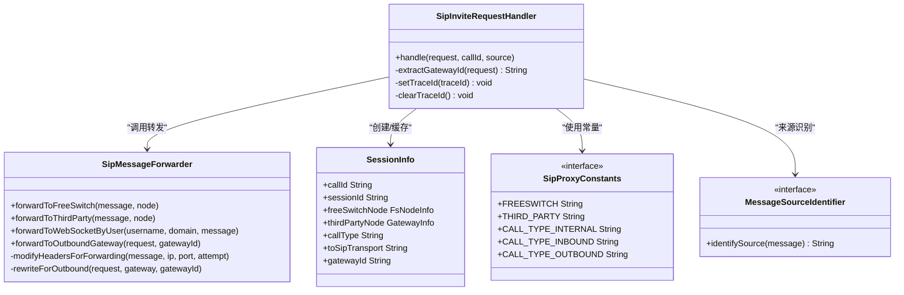

# INVITE请求处理流程

<cite>
**本文引用的文件**
- [SipInviteRequestHandler.java](file://yudao-cloud/yudao-module-cc/ipcc-sipproxy/src/main/java/cn/ipcc/sipproxy/core/handler/request/sip/SipInviteRequestHandler.java)
- [SipMessageForwarder.java](file://yudao-cloud/yudao-module-cc/ipcc-sipproxy/src/main/java/cn/ipcc/sipproxy/core/forwarder/SipMessageForwarder.java)
- [SessionInfo.java](file://yudao-cloud/yudao-module-cc/ipcc-sipproxy/src/main/java/cn/ipcc/sipproxy/core/session/SessionInfo.java)
- [SipProxyConstants.java](file://yudao-cloud/yudao-module-cc/ipcc-sipproxy/src/main/java/cn/ipcc/sipproxy/support/SipProxyConstants.java)
- [MessageSourceIdentifier.java](file://yudao-cloud/yudao-module-cc/ipcc-sipproxy/src/main/java/cn/ipcc/sipproxy/api/gateway/MessageSourceIdentifier.java)
</cite>

## 目录
1. [简介](#简介)
2. [项目结构](#项目结构)
3. [核心组件](#核心组件)
4. [架构总览](#架构总览)
5. [详细组件分析](#详细组件分析)
6. [依赖关系分析](#依赖关系分析)
7. [性能考量](#性能考量)
8. [故障排查指南](#故障排查指南)
9. [结论](#结论)

## 简介
本文件面向IPCC呼叫中心系统，聚焦SIP代理模块中INVITE请求的处理流程。重点说明SipInviteRequestHandler的完整处理逻辑：来源识别（FREESWITCH/THIRD_PARTY）、X-Gateway-Id头域提取、会话信息创建与callType标记规则；并深入解释两类快速路径：
- 豁免场景：FS源+携带X-Gateway-Id的快速出局机制，直接转发到指定出局网关，跳过FS park与号码路由匹配。
- JsSIP坐席快速推送优化：FS源且未携带X-Gateway-Id时，若被叫为已注册JsSIP坐席，则直接通过WebSocket推送到坐席，避免回环与媒体协商失败。

文档提供从INVITE接收到响应发送的完整时序图，并给出错误处理策略与关键实现位置引用。

## 项目结构
围绕INVITE处理的代码主要位于sipproxy模块的core层：
- 请求处理器：SipInviteRequestHandler负责解析、决策与分流
- 消息转发器：SipMessageForwarder负责向FreeSWITCH、第三方网关或WebSocket客户端转发
- 会话模型：SessionInfo承载Call-ID、callType、传输协议、节点信息等
- 常量定义：SipProxyConstants定义来源标识、呼叫类型等
- 来源识别扩展点：MessageSourceIdentifier用于识别消息来源（WEBSOCKET/FREESWITCH/THIRD_PARTY）

图表来源
- [SipInviteRequestHandler.java:71-238](file://yudao-cloud/yudao-module-cc/ipcc-sipproxy/src/main/java/cn/ipcc/sipproxy/core/handler/request/sip/SipInviteRequestHandler.java#L71-L238)
- [SipMessageForwarder.java:110-257](file://yudao-cloud/yudao-module-cc/ipcc-sipproxy/src/main/java/cn/ipcc/sipproxy/core/forwarder/SipMessageForwarder.java#L110-L257)
- [SessionInfo.java:17-75](file://yudao-cloud/yudao-module-cc/ipcc-sipproxy/src/main/java/cn/ipcc/sipproxy/core/session/SessionInfo.java#L17-L75)
- [SipProxyConstants.java:10-51](file://yudao-cloud/yudao-module-cc/ipcc-sipproxy/src/main/java/cn/ipcc/sipproxy/support/SipProxyConstants.java#L10-L51)
- [MessageSourceIdentifier.java:13-21](file://yudao-cloud/yudao-module-cc/ipcc-sipproxy/src/main/java/cn/ipcc/sipproxy/api/gateway/MessageSourceIdentifier.java#L13-L21)

章节来源
- [SipInviteRequestHandler.java:71-238](file://yudao-cloud/yudao-module-cc/ipcc-sipproxy/src/main/java/cn/ipcc/sipproxy/core/handler/request/sip/SipInviteRequestHandler.java#L71-L238)
- [SipMessageForwarder.java:110-257](file://yudao-cloud/yudao-module-cc/ipcc-sipproxy/src/main/java/cn/ipcc/sipproxy/core/forwarder/SipMessageForwarder.java#L110-L257)
- [SessionInfo.java:17-75](file://yudao-cloud/yudao-module-cc/ipcc-sipproxy/src/main/java/cn/ipcc/sipproxy/core/session/SessionInfo.java#L17-L75)
- [SipProxyConstants.java:10-51](file://yudao-cloud/yudao-module-cc/ipcc-sipproxy/src/main/java/cn/ipcc/sipproxy/support/SipProxyConstants.java#L10-L51)
- [MessageSourceIdentifier.java:13-21](file://yudao-cloud/yudao-module-cc/ipcc-sipproxy/src/main/java/cn/ipcc/sipproxy/api/gateway/MessageSourceIdentifier.java#L13-L21)

## 核心组件
- SipInviteRequestHandler：接收INVITE，校验To头，提取X-Gateway-Id，创建/缓存SessionInfo，设置callType，执行快速出局或快速推送，否则转发至FS park。
- SipMessageForwarder：封装转发逻辑，支持到FreeSWITCH、第三方网关、WebSocket客户端；负责头域改写、SDP处理、传输协议选择与故障转移。
- SessionInfo：存储callId、sessionId、freeSwitchNode、thirdPartyNode、callType、toSipTransport、gatewayId等。
- SipProxyConstants：定义来源标识（FREESWITCH/THIRD_PARTY/WEBSOCKET）、呼叫类型（INTERNAL/INBOUND/OUTBOUND/UNKNOWN）等。
- MessageSourceIdentifier：可扩展的消息来源识别接口，决定后续路由分发。

章节来源
- [SipInviteRequestHandler.java:71-238](file://yudao-cloud/yudao-module-cc/ipcc-sipproxy/src/main/java/cn/ipcc/sipproxy/core/handler/request/sip/SipInviteRequestHandler.java#L71-L238)
- [SipMessageForwarder.java:110-257](file://yudao-cloud/yudao-module-cc/ipcc-sipproxy/core/forwarder/SipMessageForwarder.java#L110-L257)
- [SessionInfo.java:17-75](file://yudao-cloud/yudao-module-cc/ipcc-sipproxy/src/main/java/cn/ipcc/sipproxy/core/session/SessionInfo.java#L17-L75)
- [SipProxyConstants.java:10-51](file://yudao-cloud/yudao-module-cc/ipcc-sipproxy/src/main/java/cn/ipcc/sipproxy/support/SipProxyConstants.java#L10-L51)
- [MessageSourceIdentifier.java:13-21](file://yudao-cloud/yudao-module-cc/ipcc-sipproxy/src/main/java/cn/ipcc/sipproxy/api/gateway/MessageSourceIdentifier.java#L13-L21)

## 架构总览
下图展示INVITE请求在SIP代理中的整体流转：来源识别→会话创建→callType标记→快速路径判断→转发目标选择→响应回送方向。

图表来源
- [SipInviteRequestHandler.java:71-238](file://yudao-cloud/yudao-module-cc/ipcc-sipproxy/src/main/java/cn/ipcc/sipproxy/core/handler/request/sip/SipInviteRequestHandler.java#L71-L238)
- [SipMessageForwarder.java:110-257](file://yudao-cloud/yudao-module-cc/ipcc-sipproxy/src/main/java/cn/ipcc/sipproxy/core/forwarder/SipMessageForwarder.java#L110-L257)
- [SessionInfo.java:17-75](file://yudao-cloud/yudao-module-cc/ipcc-sipproxy/core/session/SessionInfo.java#L17-L75)

## 详细组件分析

### SipInviteRequestHandler处理逻辑
- 入口与追踪：设置traceId（优先复用Call-ID），finally清理，保证日志串联。
- To头校验：缺失或非法返回400错误。
- X-Gateway-Id提取：从自定义头域获取，作为后续IVR转接节点的网关覆盖项。
- 会话创建与callType标记：
  - FREESWITCH + 携带X-Gateway-Id → OUTBOUND（c-leg出局腿，响应需回送FS）
  - FREESWITCH + 未携带X-Gateway-Id → INTERNAL（FS内部回环）
  - THIRD_PARTY → INBOUND（响应转发回第三方）
  - 其他 → INTERNAL
- 豁免场景（快速出局）：FS源且携带X-Gateway-Id时，直接调用forwardToOutboundGateway，跳过FS park与号码路由匹配。
- JsSIP坐席快速推送：FS源且不携带X-Gateway-Id时，若被叫为已注册JsSIP坐席，则直接forwardToWebSocketByUser，避免回环与媒体协商失败。
- 默认场景：转发到FS park，由ESL处理器走号码路由匹配→IVR流程。

图表来源
- [SipInviteRequestHandler.java:71-238](file://yudao-cloud/yudao-module-cc/ipcc-sipproxy/src/main/java/cn/ipcc/sipproxy/core/handler/request/sip/SipInviteRequestHandler.java#L71-L238)

章节来源
- [SipInviteRequestHandler.java:71-238](file://yudao-cloud/yudao-module-cc/ipcc-sipproxy/src/main/java/cn/ipcc/sipproxy/core/handler/request/sip/SipInviteRequestHandler.java#L71-L238)

### 来源识别与X-Gateway-Id提取
- 来源识别：通过MessageSourceIdentifier识别消息来源（WEBSOCKET/FREESWITCH/THIRD_PARTY），用于后续路由分发。
- X-Gateway-Id提取：从请求头域读取，去除空白后保存至SessionInfo.gatewayId，供后续IVR转接节点使用。

章节来源
- [MessageSourceIdentifier.java:13-21](file://yudao-cloud/yudao-module-cc/ipcc-sipproxy/src/main/java/cn/ipcc/sipproxy/api/gateway/MessageSourceIdentifier.java#L13-L21)
- [SipInviteRequestHandler.java:88-133](file://yudao-cloud/yudao-module-cc/ipcc-sipproxy/src/main/java/cn/ipcc/sipproxy/core/handler/request/sip/SipInviteRequestHandler.java#L88-L133)

### 会话信息与callType标记规则
- SessionInfo字段：callId、sessionId、freeSwitchNode、thirdPartyNode、callType、toSipTransport、gatewayId等。
- callType标记规则：
  - INTERNAL：内部呼叫（坐席→坐席）
  - INBOUND：呼入（外部→坐席）
  - OUTBOUND：呼出（坐席→外部）
  - UNKNOWN：无法识别来源

章节来源
- [SessionInfo.java:17-75](file://yudao-cloud/yudao-module-cc/ipcc-sipproxy/src/main/java/cn/ipcc/sipproxy/core/session/SessionInfo.java#L17-L75)
- [SipProxyConstants.java:44-51](file://yudao-cloud/yudao-module-cc/ipcc-sipproxy/src/main/java/cn/ipcc/sipproxy/support/SipProxyConstants.java#L44-L51)

### 豁免场景（FS源+X-Gateway-Id）快速出局
- 适用场景：三方会议c-leg、双向出局转接、REFER转接外部、自动外呼等。
- 处理逻辑：检测到FS源且携带X-Gateway-Id时，直接调用forwardToOutboundGateway，跳过FS park与号码路由匹配。
- 转发细节：SipMessageForwarder进行头域改写、SDP处理、传输协议选择，并缓存原始INVITE文本与第三方网关节点。

章节来源
- [SipInviteRequestHandler.java:142-154](file://yudao-cloud/yudao-module-cc/ipcc-sipproxy/src/main/java/cn/ipcc/sipproxy/core/handler/request/sip/SipInviteRequestHandler.java#L142-L154)
- [SipMessageForwarder.java:558-611](file://yudao-cloud/yudao-module-cc/ipcc-sipproxy/src/main/java/cn/ipcc/sipproxy/core/forwarder/SipMessageForwarder.java#L558-L611)

### JsSIP坐席快速推送优化路径
- 背景：B2BUA架构下第二段INVITE必须直接转发到坐席WebSocket，避免回环与WebRTC SDP媒体协商失败。
- 处理逻辑：FS源且不携带X-Gateway-Id时，拆分被叫“坐席号&域名”，查询坐席记录，若存在则直接forwardToWebSocketByUser，并将WebSocket sessionId回写到SessionInfo，确保后续ACK/BYE正确转发。
- 多FS实例兼容：根据Via端口选择发起originate的FS实例，避免选错FS导致响应无法送达。

章节来源
- [SipInviteRequestHandler.java:156-218](file://yudao-cloud/yudao-module-cc/ipcc-sipproxy/src/main/java/cn/ipcc/sipproxy/core/handler/request/sip/SipInviteRequestHandler.java#L156-L218)
- [SipMessageForwarder.java:242-257](file://yudao-cloud/yudao-module-cc/ipcc-sipproxy/src/main/java/cn/ipcc/sipproxy/core/forwarder/SipMessageForwarder.java#L242-L257)

### 默认场景（FS park）
- 处理逻辑：若无豁免或快速推送条件，则选择内部FS节点并转发至FS park，由ESL处理器走号码路由匹配→IVR流程。
- 头域透传：X-Gateway-Id头域保留并透传到FS，最终到ESL事件，作为IVR转接节点的网关覆盖项。

章节来源
- [SipInviteRequestHandler.java:220-233](file://yudao-cloud/yudao-module-cc/ipcc-sipproxy/src/main/java/cn/ipcc/sipproxy/core/handler/request/sip/SipInviteRequestHandler.java#L220-L233)

## 依赖关系分析
- SipInviteRequestHandler依赖：
  - SipMessageForwarder：执行具体转发
  - SessionManager：创建/缓存会话信息
  - NodeManager：选择FS/第三方节点
  - AgentInfoProvider：查询坐席信息
  - TraceContext：可选注入，用于链路追踪
- SipMessageForwarder依赖：
  - WsSessionManager：WebSocket发送
  - SipNodeManager：FS节点选择与故障转移
  - GatewayProvider/GatewayAuthManager：网关信息与鉴权
  - SdpProcessor：SDP处理扩展点
  - SipProxyProperties：公共IP/端口配置

图表来源
- [SipInviteRequestHandler.java:71-238](file://yudao-cloud/yudao-module-cc/ipcc-sipproxy/src/main/java/cn/ipcc/sipproxy/core/handler/request/sip/SipInviteRequestHandler.java#L71-L238)
- [SipMessageForwarder.java:110-611](file://yudao-cloud/yudao-module-cc/ipcc-sipproxy/src/main/java/cn/ipcc/sipproxy/core/forwarder/SipMessageForwarder.java#L110-L611)
- [SessionInfo.java:17-75](file://yudao-cloud/yudao-module-cc/ipcc-sipproxy/src/main/java/cn/ipcc/sipproxy/core/session/SessionInfo.java#L17-L75)
- [SipProxyConstants.java:10-51](file://yudao-cloud/yudao-module-cc/ipcc-sipproxy/src/main/java/cn/ipcc/sipproxy/support/SipProxyConstants.java#L10-L51)
- [MessageSourceIdentifier.java:13-21](file://yudao-cloud/yudao-module-cc/ipcc-sipproxy/src/main/java/cn/ipcc/sipproxy/api/gateway/MessageSourceIdentifier.java#L13-L21)

章节来源
- [SipInviteRequestHandler.java:71-238](file://yudao-cloud/yudao-module-cc/ipcc-sipproxy/src/main/java/cn/ipcc/sipproxy/core/handler/request/sip/SipInviteRequestHandler.java#L71-L238)
- [SipMessageForwarder.java:110-611](file://yudao-cloud/yudao-module-cc/ipcc-sipproxy/core/forwarder/SipMessageForwarder.java#L110-L611)
- [SessionInfo.java:17-75](file://yudao-cloud/yudao-module-cc/ipcc-sipproxy/core/session/SessionInfo.java#L17-L75)
- [SipProxyConstants.java:10-51](file://yudao-cloud/yudao-module-cc/ipcc-sipproxy/support/SipProxyConstants.java#L10-L51)
- [MessageSourceIdentifier.java:13-21](file://yudao-cloud/yudao-module-cc/ipcc-sipproxy/api/gateway/MessageSourceIdentifier.java#L13-L21)

## 性能考量
- 快速路径减少延迟：豁免场景与JsSIP快速推送避免不必要的FS park往返，降低时延。
- 传输协议选择：根据SessionInfo.toSipTransport选择UDP/TCP，提升兼容性。
- 故障转移：FreeSWITCH转发支持多节点尝试，提高可用性。
- SDP处理：通过SdpProcessor扩展点可定制ICE候选替换与编解码过滤，优化媒体协商。

[本节为通用指导，不直接分析具体文件]

## 故障排查指南
- 400错误：To头校验失败，检查INVITE的To头格式。
- 407鉴权：第三方网关要求认证时，SipMessageForwarder委托GatewayAuthManager处理重试逻辑。
- 转发失败：所有节点尝试失败抛出异常，检查FS/第三方节点可达性与配置。
- WebSocket会话未找到：JsSIP快速推送时若未找到会话，检查坐席注册状态与domain匹配。
- 媒体协商失败：检查SDP中ICE候选完整性与地址替换是否正确。

章节来源
- [SipInviteRequestHandler.java:83-85](file://yudao-cloud/yudao-module-cc/ipcc-sipproxy/src/main/java/cn/ipcc/sipproxy/core/handler/request/sip/SipInviteRequestHandler.java#L83-L85)
- [SipMessageForwarder.java:140-154](file://yudao-cloud/yudao-module-cc/ipcc-sipproxy/src/main/java/cn/ipcc/sipproxy/core/forwarder/SipMessageForwarder.java#L140-L154)
- [SipMessageForwarder.java:242-257](file://yudao-cloud/yudao-module-cc/ipcc-sipproxy/core/forwarder/SipMessageForwarder.java#L242-L257)
- [SipMessageForwarder.java:363-389](file://yudao-cloud/yudao-module-cc/ipcc-sipproxy/core/forwarder/SipMessageForwarder.java#L363-L389)

## 结论
SipInviteRequestHandler通过来源识别、X-Gateway-Id提取与callType标记，实现了灵活的INVITE处理路径：豁免场景快速出局与JsSIP坐席快速推送显著优化了呼叫建立时延与可靠性；默认场景则保持与FS park及IVR流程的兼容。结合SipMessageForwarder的健壮转发能力与SessionInfo的上下文管理，系统在复杂网络环境下仍能提供稳定高效的呼叫处理能力。

[本节为总结性内容，不直接分析具体文件]