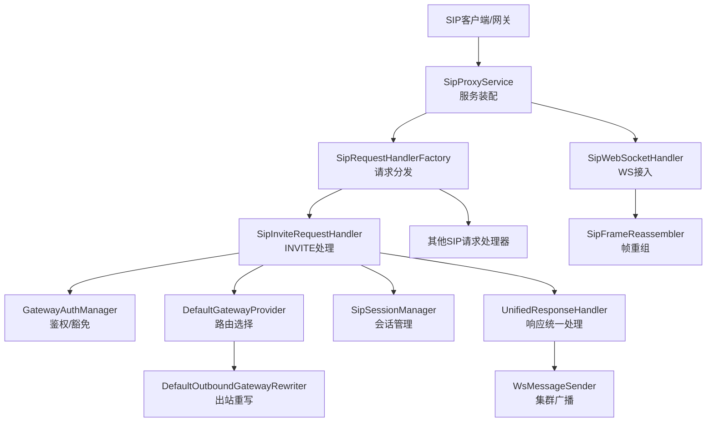
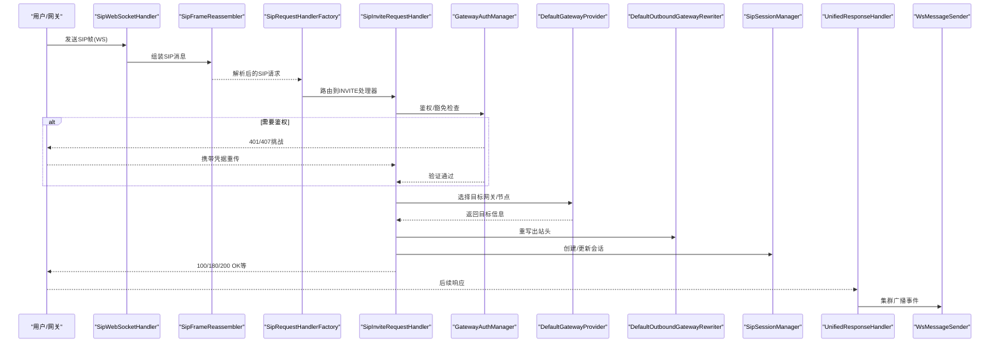
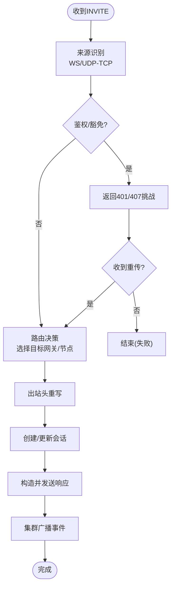
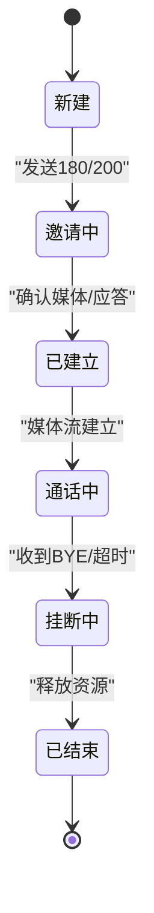
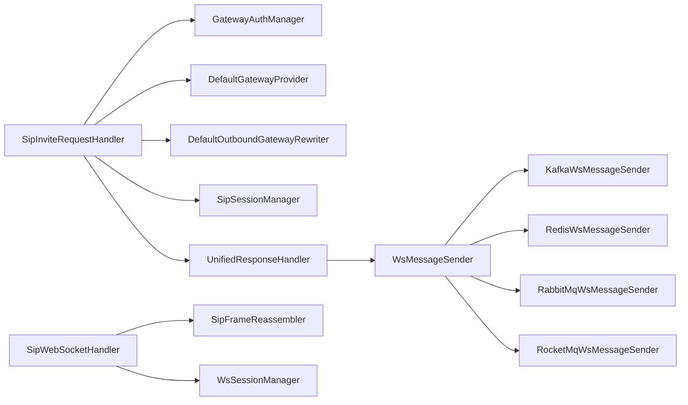

# SIP消息处理流程

<cite>
**本文引用的文件**
- [SipProxyService.java](file://yudao-cloud/yudao-module-cc/ipcc-sipproxy/src/main/java/cn/ipcc/sipproxy/core/SipProxyService.java)
- [SipInviteRequestHandler.java](file://yudao-cloud/yudao-module-cc/ipcc-sipproxy/src/main/java/cn/ipcc/sipproxy/core/handler/request/sip/SipInviteRequestHandler.java)
- [AbstractSipRequestHandler.java](file://yudao-cloud/yudao-module-cc/ipcc-sipproxy/src/main/java/cn/ipcc/sipproxy/core/handler/request/sip/AbstractSipRequestHandler.java)
- [SipRequestHandlerFactory.java](file://yudao-cloud/yudao-module-cc/ipcc-sipproxy/src/main/java/cn/ipcc/sipproxy/core/handler/request/sip/SipRequestHandlerFactory.java)
- [UnifiedResponseHandler.java](file://yudao-cloud/yudao-module-cc/ipcc-sipproxy/src/main/java/cn/ipcc/sipproxy/core/handler/response/UnifiedResponseHandler.java)
- [SipResponseHandlerFactory.java](file://yudao-cloud/yudao-module-cc/ipcc-sipproxy/src/main/java/cn/ipcc/sipproxy/core/handler/response/SipResponseHandlerFactory.java)
- [GatewayAuthManager.java](file://yudao-cloud/yudao-module-cc/ipcc-sipproxy/src/main/java/cn/ipcc/sipproxy/core/auth/GatewayAuthManager.java)
- [DefaultGatewayProvider.java](file://yudao-cloud/yudao-module-cc/ipcc-sipproxy/src/main/java/cn/ipcc/sipproxy/defaults/gateway/DefaultGatewayProvider.java)
- [DefaultMessageSourceIdentifier.java](file://yudao-cloud/yudao-module-cc/ipcc-sipproxy/src/main/java/cn/ipcc/sipproxy/defaults/gateway/DefaultMessageSourceIdentifier.java)
- [DefaultOutboundGatewayRewriter.java](file://yudao-cloud/yudao-module-cc/ipcc-sipproxy/src/main/java/cn/ipcc/sipproxy/defaults/gateway/DefaultOutboundGatewayRewriter.java)
- [SipWebSocketHandler.java](file://yudao-cloud/yudao-module-cc/ipcc-sipproxy/src/main/java/cn/ipcc/sipproxy/websocket/SipWebSocketHandler.java)
- [WsSessionManager.java](file://yudao-cloud/yudao-module-cc/ipcc-sipproxy/src/main/java/cn/ipcc/sipproxy/websocket/WsSessionManager.java)
- [LocalWsSessionManager.java](file://yudao-cloud/yudao-module-cc/ipcc-sipproxy/src/main/java/cn/ipcc/sipproxy/websocket/LocalWsSessionManager.java)
- [SipFrameReassembler.java](file://yudao-cloud/yudao-module-cc/ipcc-sipproxy/src/main/java/cn/ipcc/sipproxy/websocket/SipFrameReassembler.java)
- [SipSessionManager.java](file://yudao-cloud/yudao-module-cc/ipcc-sipproxy/src/main/java/cn/ipcc/sipproxy/core/session/SipSessionManager.java)
- [SessionInfo.java](file://yudao-cloud/yudao-module-cc/ipcc-sipproxy/src/main/java/cn/ipcc/sipproxy/core/session/SessionInfo.java)
- [SipNodeManager.java](file://yudao-cloud/yudao-module-cc/ipcc-sipproxy/src/main/java/cn/ipcc/sipproxy/core/node/SipNodeManager.java)
- [KafkaWsMessageSender.java](file://yudao-cloud/yudao-module-cc/ipcc-sipproxy/src/main/java/cn/ipcc/sipproxy/cluster/KafkaWsMessageSender.java)
- [RedisWsMessageSender.java](file://yudao-cloud/yudao-module-cc/ipcc-sipproxy/src/main/java/cn/ipcc/sipproxy/cluster/RedisWsMessageSender.java)
- [RabbitMqWsMessageSender.java](file://yudao-cloud/yudao-module-cc/ipcc-sipproxy/src/main/java/cn/ipcc/sipproxy/cluster/RabbitMqWsMessageSender.java)
- [RocketMqWsMessageSender.java](file://yudao-cloud/yudao-module-cc/ipcc-sipproxy/src/main/java/cn/ipcc/sipproxy/cluster/RocketMqWsMessageSender.java)
- [SipWsBroadcastMessage.java](file://yudao-cloud/yudao-module-cc/ipcc-sipproxy/src/main/java/cn/ipcc/sipproxy/cluster/SipWsBroadcastMessage.java)
- [ClusterBroadcastConsumer.java](file://yudao-cloud/yudao-module-cc/ipcc-sipproxy/src/main/java/cn/ipcc/sipproxy/cluster/ClusterBroadcastConsumer.java)
- [SipProxyProperties.java](file://yudao-cloud/yudao-module-cc/ipcc-sipproxy/src/main/java/cn/ipcc/sipproxy/autoconfigure/SipProxyProperties.java)
- [SipProxyWebSocketAutoConfiguration.java](file://yudao-cloud/yudao-module-cc/ipcc-sipproxy/src/main/java/cn/ipcc/sipproxy/autoconfigure/SipProxyWebSocketAutoConfiguration.java)
- [SipProxyClusterAutoConfiguration.java](file://yudao-cloud/yudao-module-cc/ipcc-sipproxy/src/main/java/cn/ipcc/sipproxy/autoconfigure/SipProxyClusterAutoConfiguration.java)
- [SipProxyAutoConfiguration.java](file://yudao-cloud/yudao-module-cc/ipcc-sipproxy/src/main/java/cn/ipcc/sipproxy/autoconfigure/SipProxyAutoConfiguration.java)
</cite>

## 目录
1. [简介](#简介)
2. [项目结构](#项目结构)
3. [核心组件](#核心组件)
4. [架构总览](#架构总览)
5. [详细组件分析](#详细组件分析)
6. [依赖关系分析](#依赖关系分析)
7. [性能考量](#性能考量)
8. [故障排查指南](#故障排查指南)
9. [结论](#结论)
10. [附录](#附录)

## 简介
本文件面向IPCC呼叫中心系统的SIP消息处理流程，重点说明INVITE请求的完整处理链路：来源识别、路由决策、会话建立与响应统一处理。文档同时覆盖WebSocket与UDP/TCP两种消息来源的差异、407鉴权处理、豁免场景、快速推送等高级特性，并提供时序图与状态转换图以及错误处理策略，帮助读者从代码层面理解系统行为。

## 项目结构
SIP代理模块采用分层与职责分离的设计：
- 入口与服务编排：SipProxyService负责整体装配与生命周期管理。
- 请求处理：按方法分派到具体处理器（如INVITE、BYE等），并区分SIP与WS来源。
- 响应处理：统一响应处理器对各类响应进行转发、改写与广播。
- 网关与路由：通过GatewayProvider选择目标节点，使用OutboundGatewayRewriter改写出站消息头。
- 会话与会话集：SipSessionManager维护会话上下文，SessionInfo承载会话元数据。
- WebSocket支持：SipWebSocketHandler处理握手、帧重组、会话绑定与集群广播。
- 集群能力：基于多种中间件的WsMessageSender实现跨节点消息广播与消费。

图表来源
- [SipProxyService.java](file://yudao-cloud/yudao-module-cc/ipcc-sipproxy/src/main/java/cn/ipcc/sipproxy/core/SipProxyService.java)
- [SipRequestHandlerFactory.java](file://yudao-cloud/yudao-module-cc/ipcc-sipproxy/src/main/java/cn/ipcc/sipproxy/core/handler/request/sip/SipRequestHandlerFactory.java)
- [SipInviteRequestHandler.java](file://yudao-cloud/yudao-module-cc/ipcc-sipproxy/src/main/java/cn/ipcc/sipproxy/core/handler/request/sip/SipInviteRequestHandler.java)
- [SipWebSocketHandler.java](file://yudao-cloud/yudao-module-cc/ipcc-sipproxy/src/main/java/cn/ipcc/sipproxy/websocket/SipWebSocketHandler.java)
- [SipFrameReassembler.java](file://yudao-cloud/yudao-module-cc/ipcc-sipproxy/src/main/java/cn/ipcc/sipproxy/websocket/SipFrameReassembler.java)
- [GatewayAuthManager.java](file://yudao-cloud/yudao-module-cc/ipcc-sipproxy/src/main/java/cn/ipcc/sipproxy/core/auth/GatewayAuthManager.java)
- [DefaultGatewayProvider.java](file://yudao-cloud/yudao-module-cc/ipcc-sipproxy/src/main/java/cn/ipcc/sipproxy/defaults/gateway/DefaultGatewayProvider.java)
- [DefaultOutboundGatewayRewriter.java](file://yudao-cloud/yudao-module-cc/ipcc-sipproxy/src/main/java/cn/ipcc/sipproxy/defaults/gateway/DefaultOutboundGatewayRewriter.java)
- [UnifiedResponseHandler.java](file://yudao-cloud/yudao-module-cc/ipcc-sipproxy/src/main/java/cn/ipcc/sipproxy/core/handler/response/UnifiedResponseHandler.java)
- [KafkaWsMessageSender.java](file://yudao-cloud/yudao-module-cc/ipcc-sipproxy/src/main/java/cn/ipcc/sipproxy/cluster/KafkaWsMessageSender.java)

章节来源
- [SipProxyService.java](file://yudao-cloud/yudao-module-cc/ipcc-sipproxy/src/main/java/cn/ipcc/sipproxy/core/SipProxyService.java)
- [SipProxyAutoConfiguration.java](file://yudao-cloud/yudao-module-cc/ipcc-sipproxy/src/main/java/cn/ipcc/sipproxy/autoconfigure/SipProxyAutoConfiguration.java)
- [SipProxyWebSocketAutoConfiguration.java](file://yudao-cloud/yudao-module-cc/ipcc-sipproxy/src/main/java/cn/ipcc/sipproxy/autoconfigure/SipProxyWebSocketAutoConfiguration.java)
- [SipProxyClusterAutoConfiguration.java](file://yudao-cloud/yudao-module-cc/ipcc-sipproxy/src/main/java/cn/ipcc/sipproxy/autoconfigure/SipProxyClusterAutoConfiguration.java)

## 核心组件
- 请求处理链
  - SipRequestHandlerFactory：根据SIP方法将请求路由到对应处理器。
  - AbstractSipRequestHandler：提供通用校验、来源识别、会话关联等基础能力。
  - SipInviteRequestHandler：实现INVITE的核心逻辑，包括鉴权、路由、会话建立、媒体协商与响应构造。
- 响应处理
  - UnifiedResponseHandler：统一处理所有响应，完成转发、改写、追踪与集群广播。
  - SipResponseHandlerFactory：按响应类型分派到具体处理器或默认处理器。
- 网关与路由
  - GatewayAuthManager：集中处理鉴权与豁免策略（如白名单、免认证）。
  - DefaultGatewayProvider：根据配置与上下文选择目标网关/节点。
  - DefaultOutboundGatewayRewriter：对出站消息头进行重写（如Via/Record-Route/Contact等）。
- 会话管理
  - SipSessionManager：维护会话生命周期、状态与上下文。
  - SessionInfo：封装会话关键信息（Call-ID、From/To、方向、媒体参数等）。
- WebSocket接入
  - SipWebSocketHandler：处理WS连接、握手、SIP帧组装与事件分发。
  - WsSessionManager/LocalWsSessionManager：管理本地WS会话集合与绑定。
  - SipFrameReassembler：将分片帧重组为完整SIP消息。
- 集群广播
  - WsMessageSender接口及多实现（Kafka/Redis/RabbitMQ/RocketMQ）：跨节点广播SIP事件。
  - ClusterBroadcastConsumer：订阅并消费集群消息，驱动本地处理。

章节来源
- [SipRequestHandlerFactory.java](file://yudao-cloud/yudao-module-cc/ipcc-sipproxy/src/main/java/cn/ipcc/sipproxy/core/handler/request/sip/SipRequestHandlerFactory.java)
- [AbstractSipRequestHandler.java](file://yudao-cloud/yudao-module-cc/ipcc-sipproxy/src/main/java/cn/ipcc/sipproxy/core/handler/request/sip/AbstractSipRequestHandler.java)
- [SipInviteRequestHandler.java](file://yudao-cloud/yudao-module-cc/ipcc-sipproxy/src/main/java/cn/ipcc/sipproxy/core/handler/request/sip/SipInviteRequestHandler.java)
- [UnifiedResponseHandler.java](file://yudao-cloud/yudao-module-cc/ipcc-sipproxy/src/main/java/cn/ipcc/sipproxy/core/handler/response/UnifiedResponseHandler.java)
- [SipResponseHandlerFactory.java](file://yudao-cloud/yudao-module-cc/ipcc-sipproxy/src/main/java/cn/ipcc/sipproxy/core/handler/response/SipResponseHandlerFactory.java)
- [GatewayAuthManager.java](file://yudao-cloud/yudao-module-cc/ipcc-sipproxy/src/main/java/cn/ipcc/sipproxy/core/auth/GatewayAuthManager.java)
- [DefaultGatewayProvider.java](file://yudao-cloud/yudao-module-cc/ipcc-sipproxy/src/main/java/cn/ipcc/sipproxy/defaults/gateway/DefaultGatewayProvider.java)
- [DefaultOutboundGatewayRewriter.java](file://yudao-cloud/yudao-module-cc/ipcc-sipproxy/src/main/java/cn/ipcc/sipproxy/defaults/gateway/DefaultOutboundGatewayRewriter.java)
- [SipSessionManager.java](file://yudao-cloud/yudao-module-cc/ipcc-sipproxy/src/main/java/cn/ipcc/sipproxy/core/session/SipSessionManager.java)
- [SessionInfo.java](file://yudao-cloud/yudao-module-cc/ipcc-sipproxy/src/main/java/cn/ipcc/sipproxy/core/session/SessionInfo.java)
- [SipWebSocketHandler.java](file://yudao-cloud/yudao-module-cc/ipcc-sipproxy/src/main/java/cn/ipcc/sipproxy/websocket/SipWebSocketHandler.java)
- [WsSessionManager.java](file://yudao-cloud/yudao-module-cc/ipcc-sipproxy/src/main/java/cn/ipcc/sipproxy/websocket/WsSessionManager.java)
- [LocalWsSessionManager.java](file://yudao-cloud/yudao-module-cc/ipcc-sipproxy/src/main/java/cn/ipcc/sipproxy/websocket/LocalWsSessionManager.java)
- [SipFrameReassembler.java](file://yudao-cloud/yudao-module-cc/ipcc-sipproxy/src/main/java/cn/ipcc/sipproxy/websocket/SipFrameReassembler.java)
- [KafkaWsMessageSender.java](file://yudao-cloud/yudao-module-cc/ipcc-sipproxy/src/main/java/cn/ipcc/sipproxy/cluster/KafkaWsMessageSender.java)
- [RedisWsMessageSender.java](file://yudao-cloud/yudao-module-cc/ipcc-sipproxy/src/main/java/cn/ipcc/sipproxy/cluster/RedisWsMessageSender.java)
- [RabbitMqWsMessageSender.java](file://yudao-cloud/yudao-module-cc/ipcc-sipproxy/src/main/java/cn/ipcc/sipproxy/cluster/RabbitMqWsMessageSender.java)
- [RocketMqWsMessageSender.java](file://yudao-cloud/yudao-module-cc/ipcc/sipproxy/src/main/java/cn/ipcc/sipproxy/cluster/RocketMqWsMessageSender.java)
- [SipWsBroadcastMessage.java](file://yudao-cloud/yudao-module-cc/ipcc-sipproxy/src/main/java/cn/ipcc/sipproxy/cluster/SipWsBroadcastMessage.java)
- [ClusterBroadcastConsumer.java](file://yudao-cloud/yudao-module-cc/ipcc/sipproxy/src/main/java/cn/ipcc/sipproxy/cluster/ClusterBroadcastConsumer.java)

## 架构总览
SIP代理以“请求-响应”为核心，结合“会话-网关-集群”形成闭环：
- 入站：SIP（UDP/TCP）或WebSocket进入后，经来源识别与鉴权，交由请求处理器处理。
- 路由：根据被叫/主叫、策略与拓扑选择目标网关/节点，必要时重写出站头。
- 会话：建立并维护会话上下文，跟踪媒体协商与状态机。
- 响应：统一处理响应，完成转发、改写与集群广播，确保多节点一致性。
- 集群：通过消息中间件在节点间广播SIP事件，保证会话状态一致性与快速推送。

图表来源
- [SipWebSocketHandler.java](file://yudao-cloud/yudao-module-cc/ipcc-sipproxy/src/main/java/cn/ipcc/sipproxy/websocket/SipWebSocketHandler.java)
- [SipFrameReassembler.java](file://yudao-cloud/yudao-module-cc/ipcc-sipproxy/src/main/java/cn/ipcc/sipproxy/websocket/SipFrameReassembler.java)
- [SipRequestHandlerFactory.java](file://yudao-cloud/yudao-module-cc/ipcc-sipproxy/src/main/java/cn/ipcc/sipproxy/core/handler/request/sip/SipRequestHandlerFactory.java)
- [SipInviteRequestHandler.java](file://yudao-cloud/yudao-module-cc/ipcc-sipproxy/src/main/java/cn/ipcc/sipproxy/core/handler/request/sip/SipInviteRequestHandler.java)
- [GatewayAuthManager.java](file://yudao-cloud/yudao-module-cc/ipcc-sipproxy/src/main/java/cn/ipcc/sipproxy/core/auth/GatewayAuthManager.java)
- [DefaultGatewayProvider.java](file://yudao-cloud/yudao-module-cc/ipcc-sipproxy/src/main/java/cn/ipcc/sipproxy/defaults/gateway/DefaultGatewayProvider.java)
- [DefaultOutboundGatewayRewriter.java](file://yudao-cloud/yudao-module-cc/ipcc-sipproxy/src/main/java/cn/ipcc/sipproxy/defaults/gateway/DefaultOutboundGatewayRewriter.java)
- [SipSessionManager.java](file://yudao-cloud/yudao-module-cc/ipcc-sipproxy/src/main/java/cn/ipcc/sipproxy/core/session/SipSessionManager.java)
- [UnifiedResponseHandler.java](file://yudao-cloud/yudao-module-cc/ipcc-sipproxy/src/main/java/cn/ipcc/sipproxy/core/handler/response/UnifiedResponseHandler.java)
- [KafkaWsMessageSender.java](file://yudao-cloud/yudao-module-cc/ipcc-sipproxy/src/main/java/cn/ipcc/sipproxy/cluster/KafkaWsMessageSender.java)

## 详细组件分析

### INVITE请求处理链路
INVITE是呼叫建立的关键请求，其处理链路包含以下关键步骤：
- 来源识别：区分来自UDP/TCP还是WebSocket；WS路径需先进行帧重组。
- 鉴权与豁免：调用GatewayAuthManager进行鉴权，支持白名单或特定场景豁免。
- 路由决策：通过DefaultGatewayProvider选择目标网关/节点，必要时使用DefaultOutboundGatewayRewriter重写出站头。
- 会话建立：在SipSessionManager中创建或查找会话，记录Call-ID、From/To、方向、媒体参数等。
- 响应构造与转发：生成100 Trying、180 Ringing、200 OK等响应，并通过UnifiedResponseHandler统一处理。
- 集群广播：通过WsMessageSender将关键事件广播到集群，确保多节点一致性。

图表来源
- [SipInviteRequestHandler.java](file://yudao-cloud/yudao-module-cc/ipcc-sipproxy/src/main/java/cn/ipcc/sipproxy/core/handler/request/sip/SipInviteRequestHandler.java)
- [GatewayAuthManager.java](file://yudao-cloud/yudao-module-cc/ipcc-sipproxy/src/main/java/cn/ipcc/sipproxy/core/auth/GatewayAuthManager.java)
- [DefaultGatewayProvider.java](file://yudao-cloud/yudao-module-cc/ipcc-sipproxy/src/main/java/cn/ipcc/sipproxy/defaults/gateway/DefaultGatewayProvider.java)
- [DefaultOutboundGatewayRewriter.java](file://yudao-cloud/yudao-module-cc/ipcc-sipproxy/src/main/java/cn/ipcc/sipproxy/defaults/gateway/DefaultOutboundGatewayRewriter.java)
- [SipSessionManager.java](file://yudao-cloud/yudao-module-cc/ipcc-sipproxy/src/main/java/cn/ipcc/sipproxy/core/session/SipSessionManager.java)
- [UnifiedResponseHandler.java](file://yudao-cloud/yudao-module-cc/ipcc-sipproxy/src/main/java/cn/ipcc/sipproxy/core/handler/response/UnifiedResponseHandler.java)

章节来源
- [SipInviteRequestHandler.java](file://yudao-cloud/yudao-module-cc/ipcc-sipproxy/src/main/java/cn/ipcc/sipproxy/core/handler/request/sip/SipInviteRequestHandler.java)
- [AbstractSipRequestHandler.java](file://yudao-cloud/yudao-module-cc/ipcc-sipproxy/src/main/java/cn/ipcc/sipproxy/core/handler/request/sip/AbstractSipRequestHandler.java)
- [GatewayAuthManager.java](file://yudao-cloud/yudao-module-cc/ipcc-sipproxy/src/main/java/cn/ipcc/sipproxy/core/auth/GatewayAuthManager.java)
- [DefaultGatewayProvider.java](file://yudao-cloud/yudao-module-cc/ipcc-sipproxy/src/main/java/cn/ipcc/sipproxy/defaults/gateway/DefaultGatewayProvider.java)
- [DefaultOutboundGatewayRewriter.java](file://yudao-cloud/yudao-module-cc/ipcc-sipproxy/src/main/java/cn/ipcc/sipproxy/defaults/gateway/DefaultOutboundGatewayRewriter.java)
- [SipSessionManager.java](file://yudao-cloud/yudao-module-cc/ipcc-sipproxy/src/main/java/cn/ipcc/sipproxy/core/session/SipSessionManager.java)
- [UnifiedResponseHandler.java](file://yudao-cloud/yudao-module-cc/ipcc-sipproxy/src/main/java/cn/ipcc/sipproxy/core/handler/response/UnifiedResponseHandler.java)

### WebSocket与UDP/TCP消息来源差异
- WebSocket路径
  - 由SipWebSocketHandler接收帧，使用SipFrameReassembler将分片帧重组为完整SIP消息。
  - 通过WsSessionManager/LocalWsSessionManager管理本地WS会话，支持会话绑定与清理。
  - 适合浏览器端或长连接场景，具备自动重连与心跳能力。
- UDP/TCP路径
  - 直接由底层SIP传输层接收，经SipRequestHandlerFactory分派到具体处理器。
  - 无帧重组过程，但需关注网络分包与超时处理。
- 共同点
  - 均经过来源识别、鉴权、路由、会话管理与响应统一处理。
  - 均可触发集群广播，确保多节点一致性。

章节来源
- [SipWebSocketHandler.java](file://yudao-cloud/yudao-module-cc/ipcc-sipproxy/src/main/java/cn/ipcc/sipproxy/websocket/SipWebSocketHandler.java)
- [SipFrameReassembler.java](file://yudao-cloud/yudao-module-cc/ipcc-sipproxy/src/main/java/cn/ipcc/sipproxy/websocket/SipFrameReassembler.java)
- [WsSessionManager.java](file://yudao-cloud/yudao-module-cc/ipcc-sipproxy/src/main/java/cn/ipcc/sipproxy/websocket/WsSessionManager.java)
- [LocalWsSessionManager.java](file://yudao-cloud/yudao-module-cc/ipcc-sipproxy/src/main/java/cn/ipcc/sipproxy/websocket/LocalWsSessionManager.java)
- [SipRequestHandlerFactory.java](file://yudao-cloud/yudao-module-cc/ipcc-sipproxy/src/main/java/cn/ipcc/sipproxy/core/handler/request/sip/SipRequestHandlerFactory.java)

### 响应处理的统一机制
- UnifiedResponseHandler对所有响应进行统一处理，包括：
  - 转发至原请求方或上游网关。
  - 根据策略重写响应头（如Record-Route、Contact等）。
  - 记录追踪信息与指标。
  - 通过WsMessageSender广播关键事件，驱动集群内其他节点同步状态。
- SipResponseHandlerFactory按响应类型分派到具体处理器或默认处理器，便于扩展。

章节来源
- [UnifiedResponseHandler.java](file://yudao-cloud/yudao-module-cc/ipcc-sipproxy/src/main/java/cn/ipcc/sipproxy/core/handler/response/UnifiedResponseHandler.java)
- [SipResponseHandlerFactory.java](file://yudao-cloud/yudao-module-cc/ipcc-sipproxy/src/main/java/cn/ipcc/sipproxy/core/handler/response/SipResponseHandlerFactory.java)

### 407鉴权处理与豁免场景
- 407鉴权
  - 当GatewayAuthManager检测到请求未通过鉴权时，返回407 Proxy Authentication Required，要求客户端提供凭据。
  - 客户端重传携带凭据的请求，再次进行鉴权。
- 豁免场景
  - 支持白名单或特定场景豁免，例如内部网段、测试环境或特定网关标识。
  - 豁免后可跳过鉴权直接进入路由与处理流程。

章节来源
- [GatewayAuthManager.java](file://yudao-cloud/yudao-module-cc/ipcc-sipproxy/src/main/java/cn/ipcc/sipproxy/core/auth/GatewayAuthManager.java)

### 快速推送与集群广播
- 快速推送
  - 通过WsMessageSender将SIP事件快速推送到集群各节点，减少延迟。
  - 支持多种中间件（Kafka/Redis/RabbitMQ/RocketMQ），可根据部署环境选择。
- 集群消费
  - ClusterBroadcastConsumer订阅并消费集群消息，驱动本地处理器执行相应动作。
  - 确保多节点会话状态一致，避免重复处理或遗漏。

章节来源
- [KafkaWsMessageSender.java](file://yudao-cloud/yudao-module-cc/ipcc-sipproxy/src/main/java/cn/ipcc/sipproxy/cluster/KafkaWsMessageSender.java)
- [RedisWsMessageSender.java](file://yudao-cloud/yudao-module-cc/ipcc-sipproxy/src/main/java/cn/ipcc/sipproxy/cluster/RedisWsMessageSender.java)
- [RabbitMqWsMessageSender.java](file://yudao-cloud/yudao-module-cc/ipcc-sipproxy/src/main/java/cn/ipcc/sipproxy/cluster/RabbitMqWsMessageSender.java)
- [RocketMqWsMessageSender.java](file://yudao-cloud/yudao-module-cc/ipcc/sipproxy/src/main/java/cn/ipcc/sipproxy/cluster/RocketMqWsMessageSender.java)
- [SipWsBroadcastMessage.java](file://yudao-cloud/yudao-module-cc/ipcc-sipproxy/src/main/java/cn/ipcc/sipproxy/cluster/SipWsBroadcastMessage.java)
- [ClusterBroadcastConsumer.java](file://yudao-cloud/yudao-module-cc/ipcc-sipproxy/src/main/java/cn/ipcc/sipproxy/cluster/ClusterBroadcastConsumer.java)

### 状态转换图（会话）

图表来源
- [SipSessionManager.java](file://yudao-cloud/yudao-module-cc/ipcc-sipproxy/src/main/java/cn/ipcc/sipproxy/core/session/SipSessionManager.java)
- [SessionInfo.java](file://yudao-cloud/yudao-module-cc/ipcc-sipproxy/src/main/java/cn/ipcc/sipproxy/core/session/SessionInfo.java)

## 依赖关系分析
- 组件耦合
  - SipInviteRequestHandler依赖GatewayAuthManager、DefaultGatewayProvider、DefaultOutboundGatewayRewriter、SipSessionManager与UnifiedResponseHandler。
  - WebSocket路径依赖SipWebSocketHandler、SipFrameReassembler与WsSessionManager。
  - 集群广播依赖WsMessageSender及其多实现，以及ClusterBroadcastConsumer。
- 外部依赖
  - 消息中间件（Kafka/Redis/RabbitMQ/RocketMQ）用于集群广播。
  - 配置项通过SipProxyProperties注入，控制行为与开关。

图表来源
- [SipInviteRequestHandler.java](file://yudao-cloud/yudao-module-cc/ipcc-sipproxy/src/main/java/cn/ipcc/sipproxy/core/handler/request/sip/SipInviteRequestHandler.java)
- [GatewayAuthManager.java](file://yudao-cloud/yudao-module-cc/ipcc-sipproxy/src/main/java/cn/ipcc/sipproxy/core/auth/GatewayAuthManager.java)
- [DefaultGatewayProvider.java](file://yudao-cloud/yudao-module-cc/ipcc-sipproxy/src/main/java/cn/ipcc/sipproxy/defaults/gateway/DefaultGatewayProvider.java)
- [DefaultOutboundGatewayRewriter.java](file://yudao-cloud/yudao-module-cc/ipcc-sipproxy/src/main/java/cn/ipcc/sipproxy/defaults/gateway/DefaultOutboundGatewayRewriter.java)
- [SipSessionManager.java](file://yudao-cloud/yudao-module-cc/ipcc-sipproxy/src/main/java/cn/ipcc/sipproxy/core/session/SipSessionManager.java)
- [UnifiedResponseHandler.java](file://yudao-cloud/yudao-module-cc/ipcc-sipproxy/src/main/java/cn/ipcc/sipproxy/core/handler/response/UnifiedResponseHandler.java)
- [SipWebSocketHandler.java](file://yudao-cloud/yudao-module-cc/ipcc-sipproxy/src/main/java/cn/ipcc/sipproxy/websocket/SipWebSocketHandler.java)
- [SipFrameReassembler.java](file://yudao-cloud/yudao-module-cc/ipcc-sipproxy/src/main/java/cn/ipcc/sipproxy/websocket/SipFrameReassembler.java)
- [WsSessionManager.java](file://yudao-cloud/yudao-module-cc/ipcc-sipproxy/src/main/java/cn/ipcc/sipproxy/websocket/WsSessionManager.java)
- [KafkaWsMessageSender.java](file://yudao-cloud/yudao-module-cc/ipcc-sipproxy/src/main/java/cn/ipcc/sipproxy/cluster/KafkaWsMessageSender.java)
- [RedisWsMessageSender.java](file://yudao-cloud/yudao-module-cc/ipcc-sipproxy/src/main/java/cn/ipcc/sipproxy/cluster/RedisWsMessageSender.java)
- [RabbitMqWsMessageSender.java](file://yudao-cloud/yudao-module-cc/ipcc-sipproxy/src/main/java/cn/ipcc/sipproxy/cluster/RabbitMqWsMessageSender.java)
- [RocketMqWsMessageSender.java](file://yudao-cloud/yudao-module-cc/ipcc-sipproxy/src/main/java/cn/ipcc/sipproxy/cluster/RocketMqWsMessageSender.java)

章节来源
- [SipProxyProperties.java](file://yudao-cloud/yudao-module-cc/ipcc-sipproxy/src/main/java/cn/ipcc/sipproxy/autoconfigure/SipProxyProperties.java)
- [SipProxyAutoConfiguration.java](file://yudao-cloud/yudao-module-cc/ipcc-sipproxy/src/main/java/cn/ipcc/sipproxy/autoconfigure/SipProxyAutoConfiguration.java)
- [SipProxyWebSocketAutoConfiguration.java](file://yudao-cloud/yudao-module-cc/ipcc-sipproxy/src/main/java/cn/ipcc/sipproxy/autoconfigure/SipProxyWebSocketAutoConfiguration.java)
- [SipProxyClusterAutoConfiguration.java](file://yudao-cloud/yudao-module-cc/ipcc-sipproxy/src/main/java/cn/ipcc/sipproxy/autoconfigure/SipProxyClusterAutoConfiguration.java)

## 性能考量
- 低延迟路径
  - WebSocket路径适合浏览器端，具备长连接优势，减少握手开销。
  - 集群广播选择合适中间件（如Redis用于低延迟，Kafka用于高吞吐）。
- 资源管理
  - 合理设置会话超时与清理策略，避免内存泄漏。
  - 对WS帧重组进行缓冲限制，防止恶意分片攻击。
- 可扩展性
  - 通过SipRequestHandlerFactory与SipResponseHandlerFactory扩展新方法与响应处理。
  - 通过GatewayProvider与OutboundGatewayRewriter扩展路由与重写策略。

[本节为一般性指导，不直接分析具体文件]

## 故障排查指南
- 常见问题
  - 407鉴权失败：检查凭据是否正确、白名单是否配置、豁免策略是否生效。
  - 路由失败：确认目标网关/节点可达、出站头重写是否符合预期。
  - 会话异常：检查会话状态机、超时与清理策略。
  - 集群不一致：检查WsMessageSender与ClusterBroadcastConsumer配置与连通性。
- 定位方法
  - 查看日志中的追踪ID与关键步骤标记。
  - 使用调试工具捕获SIP消息，核对Via/Record-Route/Contact等头字段。
  - 检查中间件状态与消费者偏移量。

章节来源
- [GatewayAuthManager.java](file://yudao-cloud/yudao-module-cc/ipcc-sipproxy/src/main/java/cn/ipcc/sipproxy/core/auth/GatewayAuthManager.java)
- [DefaultGatewayProvider.java](file://yudao-cloud/yudao-module-cc/ipcc-sipproxy/src/main/java/cn/ipcc/sipproxy/defaults/gateway/DefaultGatewayProvider.java)
- [DefaultOutboundGatewayRewriter.java](file://yudao-cloud/yudao-module-cc/ipcc-sipproxy/src/main/java/cn/ipcc/sipproxy/defaults/gateway/DefaultOutboundGatewayRewriter.java)
- [SipSessionManager.java](file://yudao-cloud/yudao-module-cc/ipcc-sipproxy/src/main/java/cn/ipcc/sipproxy/core/session/SipSessionManager.java)
- [KafkaWsMessageSender.java](file://yudao-cloud/yudao-module-cc/ipcc-sipproxy/src/main/java/cn/ipcc/sipproxy/cluster/KafkaWsMessageSender.java)
- [RedisWsMessageSender.java](file://yudao-cloud/yudao-module-cc/ipcc-sipproxy/src/main/java/cn/ipcc/sipproxy/cluster/RedisWsMessageSender.java)
- [RabbitMqWsMessageSender.java](file://yudao-cloud/yudao-module-cc/ipcc/sipproxy/src/main/java/cn/ipcc/sipproxy/cluster/RabbitMqWsMessageSender.java)
- [RocketMqWsMessageSender.java](file://yudao-cloud/yudao-module-cc/ipcc-sipproxy/src/main/java/cn/ipcc/sipproxy/cluster/RocketMqWsMessageSender.java)
- [ClusterBroadcastConsumer.java](file://yudao-cloud/yudao-module-cc/ipcc-sipproxy/src/main/java/cn/ipcc/sipproxy/cluster/ClusterBroadcastConsumer.java)

## 结论
本系统通过清晰的请求-响应处理链路与统一的响应机制，实现了SIP消息的高效处理与集群一致性。INVITE请求的处理链路涵盖来源识别、鉴权与豁免、路由决策、会话建立与响应转发，支持WebSocket与UDP/TCP双通道接入，并通过集群广播实现快速推送与状态同步。建议在生产环境中合理配置鉴权与豁免策略、选择合适的中间件与超时策略，以确保稳定性与性能。

[本节为总结性内容，不直接分析具体文件]

## 附录
- 配置项参考
  - SipProxyProperties：集中管理SIP代理相关配置，如端口、超时、集群中间件选择等。
- 自动装配
  - SipProxyAutoConfiguration：核心组件装配。
  - SipProxyWebSocketAutoConfiguration：WebSocket相关组件装配。
  - SipProxyClusterAutoConfiguration：集群广播相关组件装配。

章节来源
- [SipProxyProperties.java](file://yudao-cloud/yudao-module-cc/ipcc-sipproxy/src/main/java/cn/ipcc/sipproxy/autoconfigure/SipProxyProperties.java)
- [SipProxyAutoConfiguration.java](file://yudao-cloud/yudao-module-cc/ipcc-sipproxy/src/main/java/cn/ipcc/sipproxy/autoconfigure/SipProxyAutoConfiguration.java)
- [SipProxyWebSocketAutoConfiguration.java](file://yudao-cloud/yudao-module-cc/ipcc-sipproxy/src/main/java/cn/ipcc/sipproxy/autoconfigure/SipProxyWebSocketAutoConfiguration.java)
- [SipProxyClusterAutoConfiguration.java](file://yudao-cloud/yudao-module-cc/ipcc-sipproxy/src/main/java/cn/ipcc/sipproxy/autoconfigure/SipProxyClusterAutoConfiguration.java)