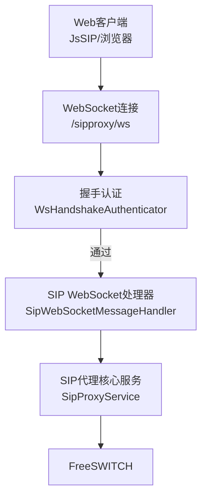
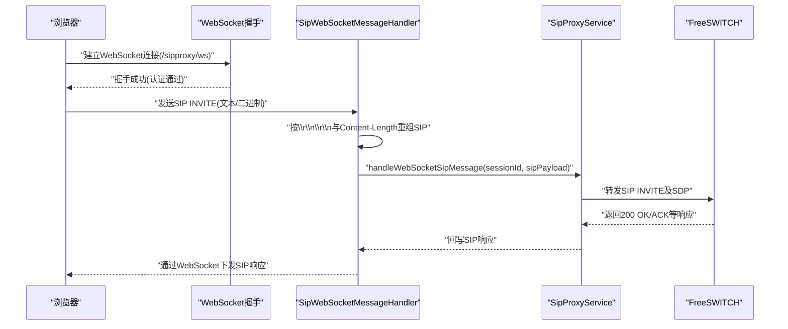
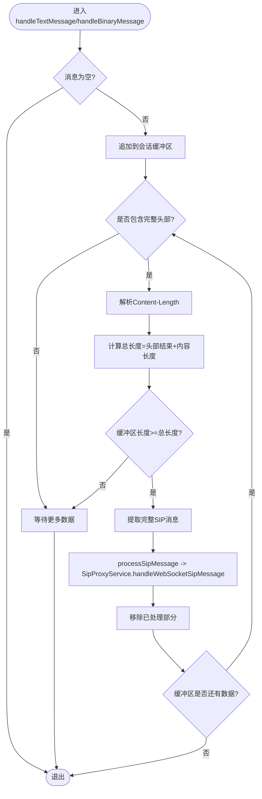
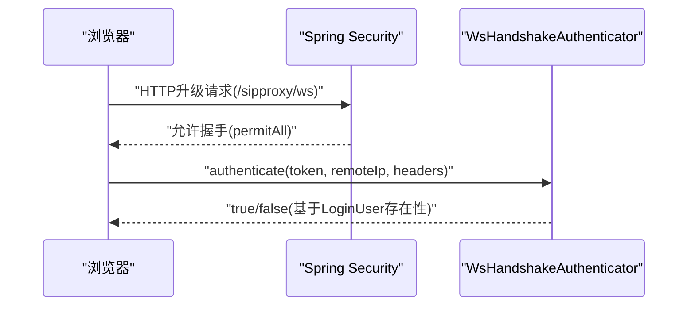
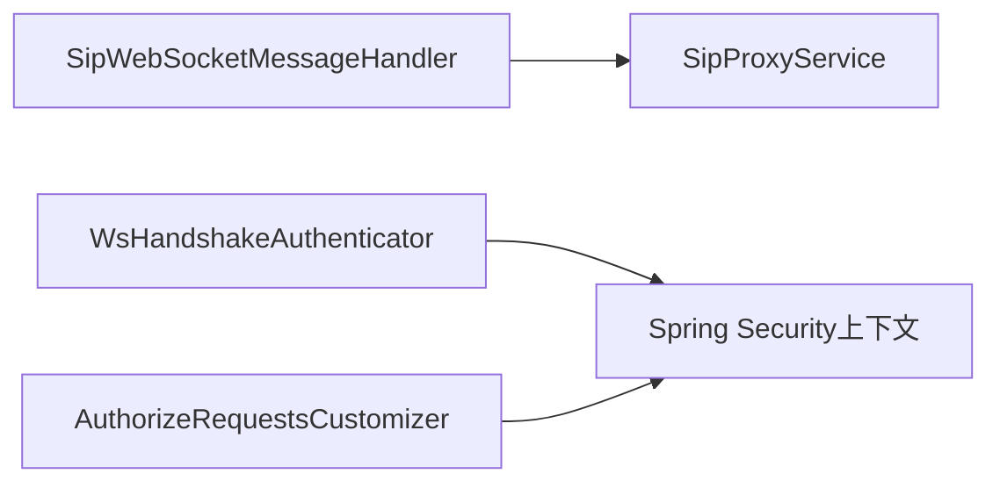

# WebSocket INVITE处理

<cite>
**本文引用的文件**
- [SipWebSocketMessageHandler.java](file://yudao-cloud/yudao-module-cc/yudao-module-cc-server/src/main/java/cn/iocoder/yudao/module/cc/websocket/core/handler/SipWebSocketMessageHandler.java)
- [JsonWebSocketMessageHandler.java](file://yudao-cloud/yudao-module-cc/yudao-module-cc-server/src/main/java/cn/iocoder/yudao/module/cc/websocket/core/handler/JsonWebSocketMessageHandler.java)
- [CcWsHandshakeAuthenticator.java](file://yudao-cloud/yudao-module-cc/yudao-module-cc-server/src/main/java/cn/iocoder/yudao/module/cc/sipproxy/integration/CcWsHandshakeAuthenticator.java)
- [SipProxyWebSocketAuthorizeRequestsCustomizer.java](file://yudao-cloud/yudao-module-cc/yudao-module-cc-server/src/main/java/cn/iocoder/yudao/module/cc/sipproxy/integration/SipProxyWebSocketAuthorizeRequestsCustomizer.java)
</cite>

## 目录
1. [简介](#简介)
2. [项目结构](#项目结构)
3. [核心组件](#核心组件)
4. [架构总览](#架构总览)
5. [详细组件分析](#详细组件分析)
6. [依赖关系分析](#依赖关系分析)
7. [性能考量](#性能考量)
8. [故障排查指南](#故障排查指南)
9. [结论](#结论)
10. [附录：前端集成与API示例](#附录前端集成与api示例)

## 简介
本文件面向IPCC呼叫中心系统，聚焦于“WebSocket INVITE请求处理”的端到端流程。重点说明后端如何通过WebSocket接收来自Web客户端的SIP消息（含INVITE），完成协议转换、会话管理、与FreeSWITCH通信，以及WebRTC媒体协商（SDP与ICE候选）在信令层的流转方式。文档同时给出WebSocket到SIP的转换规则、状态同步策略、错误处理机制，并提供前端集成要点与调用示例路径指引。

## 项目结构
本项目在cc-server模块中提供WebSocket能力，并通过sipproxy集成将SIP over WebSocket接入FreeSWITCH。关键位置如下：
- WebSocket消息处理：位于websocket.core.handler包，包含SIP文本/二进制消息处理与JSON消息路由。
- SIP代理集成：位于sipproxy.integration包，实现握手认证与安全放行配置。
- 外部依赖：通过SipProxyService对接sipproxy核心服务，最终与FreeSWITCH交互。

图表来源
- [SipWebSocketMessageHandler.java:43-182](file://yudao-cloud/yudao-module-cc/yudao-module-cc-server/src/main/java/cn/iocoder/yudao/module/cc/websocket/core/handler/SipWebSocketMessageHandler.java#L43-L182)
- [CcWsHandshakeAuthenticator.java:47-62](file://yudao-cloud/yudao-module-cc/yudao-module-cc-server/src/main/java/cn/iocoder/yudao/module/cc/sipproxy/integration/CcWsHandshakeAuthenticator.java#L47-L62)
- [SipProxyWebSocketAuthorizeRequestsCustomizer.java:36-40](file://yudao-cloud/yudao-module-cc/yudao-module-cc-server/src/main/java/cn/iocoder/yudao/module/cc/sipproxy/integration/SipProxyWebSocketAuthorizeRequestsCustomizer.java#L36-L40)

章节来源
- [SipWebSocketMessageHandler.java:43-182](file://yudao-cloud/yudao-module-cc/yudao-module-cc-server/src/main/java/cn/iocoder/yudao/module/cc/websocket/core/handler/SipWebSocketMessageHandler.java#L43-L182)
- [SipProxyWebSocketAuthorizeRequestsCustomizer.java:36-40](file://yudao-cloud/yudao-module-cc/yudao-module-cc-server/src/main/java/cn/iocoder/yudao/module/cc/sipproxy/integration/SipProxyWebSocketAuthorizeRequestsCustomizer.java#L36-L40)
- [CcWsHandshakeAuthenticator.java:47-62](file://yudao-cloud/yudao-module-cc/yudao-module-cc-server/src/main/java/cn/iocoder/yudao/module/cc/sipproxy/integration/CcWsHandshakeAuthenticator.java#L47-L62)

## 核心组件
- SipWebSocketMessageHandler：负责接收并重组SIP over WebSocket的文本/二进制消息，按Content-Length完整提取SIP报文后交由SipProxyService处理。
- JsonWebSocketMessageHandler：用于通用JSON消息路由，按type分发至对应监听器（与SIP信令解耦）。
- CcWsHandshakeAuthenticator：在WebSocket握手阶段复用Spring Security上下文中的登录用户进行鉴权。
- SipProxyWebSocketAuthorizeRequestsCustomizer：对sipproxy的WebSocket端点进行安全放行，使握手阶段可绕过全局鉴权过滤器。

章节来源
- [SipWebSocketMessageHandler.java:43-182](file://yudao-cloud/yudao-module-cc/yudao-module-cc-server/src/main/java/cn/iocoder/yudao/module/cc/websocket/core/handler/SipWebSocketMessageHandler.java#L43-L182)
- [JsonWebSocketMessageHandler.java:44-83](file://yudao-cloud/yudao-module-cc/yudao-module-cc-server/src/main/java/cn/iocoder/yudao/module/cc/websocket/core/handler/JsonWebSocketMessageHandler.java#L44-L83)
- [CcWsHandshakeAuthenticator.java:47-62](file://yudao-cloud/yudao-module-cc/yudao-module-cc-server/src/main/java/cn/iocoder/yudao/module/cc/sipproxy/integration/CcWsHandshakeAuthenticator.java#L47-L62)
- [SipProxyWebSocketAuthorizeRequestsCustomizer.java:36-40](file://yudao-cloud/yudao-module-cc/yudao-module-cc-server/src/main/java/cn/iocoder/yudao/module/cc/sipproxy/integration/SipProxyWebSocketAuthorizeRequestsCustomizer.java#L36-L40)

## 架构总览
下图展示从Web客户端发起INVITE到FreeSWITCH的完整链路：浏览器通过WebSocket发送SIP INVITE；服务端完成握手认证与消息重组后，交给SipProxyService转发至FreeSWITCH；媒体协商相关的SDP与ICE候选以SIP消息体形式透传。

图表来源
- [SipWebSocketMessageHandler.java:43-182](file://yudao-cloud/yudao-module-cc/yudao-module-cc-server/src/main/java/cn/iocoder/yudao/module/cc/websocket/core/handler/SipWebSocketMessageHandler.java#L43-L182)
- [CcWsHandshakeAuthenticator.java:47-62](file://yudao-cloud/yudao-module-cc/yudao-module-cc-server/src/main/java/cn/iocoder/yudao/module/cc/sipproxy/integration/CcWsHandshakeAuthenticator.java#L47-L62)

## 详细组件分析

### SipWebSocketMessageHandler：SIP over WebSocket消息处理
- 职责
  - 接收Text/Binary消息，统一转为字符串并按SIP头部结束标记“\r\n\r\n”定位头部边界。
  - 解析Content-Length，计算完整消息长度，支持分片重组。
  - 将完整SIP消息交由SipProxyService处理，实现与FreeSWITCH的通信。
  - 连接关闭时清理会话缓冲区与注册信息。
- 关键点
  - 使用ConcurrentHashMap维护每会话的消息缓冲，避免跨会话污染。
  - 设置最大缓冲区限制（1MB），超限丢弃并记录日志，防止内存泄漏。
  - 异常与空消息快速返回，降低无效开销。

图表来源
- [SipWebSocketMessageHandler.java:71-182](file://yudao-cloud/yudao-module-cc/yudao-module-cc-server/src/main/java/cn/iocoder/yudao/module/cc/websocket/core/handler/SipWebSocketMessageHandler.java#L71-L182)

章节来源
- [SipWebSocketMessageHandler.java:43-182](file://yudao-cloud/yudao-module-cc/yudao-module-cc-server/src/main/java/cn/iocoder/yudao/module/cc/websocket/core/handler/SipWebSocketMessageHandler.java#L43-L182)

### 握手与安全：WsHandshakeAuthenticator与授权放行
- 握手认证
  - 复用Spring Security上下文中的LoginUser进行校验，非空即通过。
  - 记录远程IP与用户标识，便于审计。
- 授权放行
  - 将sipproxy的WebSocket端点（默认/sipproxy/ws）设为permitAll，由握手拦截器承担鉴权职责。

图表来源
- [CcWsHandshakeAuthenticator.java:47-62](file://yudao-cloud/yudao-module-cc/yudao-module-cc-server/src/main/java/cn/iocoder/yudao/module/cc/sipproxy/integration/CcWsHandshakeAuthenticator.java#L47-L62)
- [SipProxyWebSocketAuthorizeRequestsCustomizer.java:36-40](file://yudao-cloud/yudao-module-cc/yudao-module-cc-server/src/main/java/cn/iocoder/yudao/module/cc/sipproxy/integration/SipProxyWebSocketAuthorizeRequestsCustomizer.java#L36-L40)

章节来源
- [CcWsHandshakeAuthenticator.java:47-62](file://yudao-cloud/yudao-module-cc/yudao-module-cc-server/src/main/java/cn/iocoder/yudao/module/cc/sipproxy/integration/CcWsHandshakeAuthenticator.java#L47-L62)
- [SipProxyWebSocketAuthorizeRequestsCustomizer.java:36-40](file://yudao-cloud/yudao-module-cc/yudao-module-cc-server/src/main/java/cn/iocoder/yudao/module/cc/sipproxy/integration/SipProxyWebSocketAuthorizeRequestsCustomizer.java#L36-L40)

### JSON消息路由：JsonWebSocketMessageHandler
- 职责：将JSON格式消息按type路由到对应监听器，支持租户上下文执行。
- 与SIP流程的关系：该处理器不直接参与SIP INVITE处理，但可用于业务侧控制面事件（如通话状态变更）的推送。

章节来源
- [JsonWebSocketMessageHandler.java:44-83](file://yudao-cloud/yudao-module-cc/yudao-module-cc-server/src/main/java/cn/iocoder/yudao/module/cc/websocket/core/handler/JsonWebSocketMessageHandler.java#L44-L83)

## 依赖关系分析
- 组件耦合
  - SipWebSocketMessageHandler依赖SipProxyService进行SIP转发，属于松耦合接口调用。
  - 握手认证依赖Spring Security上下文，与业务逻辑解耦。
- 外部依赖
  - FreeSWITCH：通过SipProxyService间接通信，承载SIP信令与媒体通道建立。
- 潜在循环依赖
  - 当前未发现循环依赖；SipWebSocketMessageHandler单向依赖SipProxyService。

图表来源
- [SipWebSocketMessageHandler.java:180-182](file://yudao-cloud/yudao-module-cc/yudao-module-cc-server/src/main/java/cn/iocoder/yudao/module/cc/websocket/core/handler/SipWebSocketMessageHandler.java#L180-L182)
- [CcWsHandshakeAuthenticator.java:47-62](file://yudao-cloud/yudao-module-cc/yudao-module-cc-server/src/main/java/cn/iocoder/yudao/module/cc/sipproxy/integration/CcWsHandshakeAuthenticator.java#L47-L62)
- [SipProxyWebSocketAuthorizeRequestsCustomizer.java:36-40](file://yudao-cloud/yudao-module-cc/yudao-module-cc-server/src/main/java/cn/iocoder/yudao/module/cc/sipproxy/integration/SipProxyWebSocketAuthorizeRequestsCustomizer.java#L36-L40)

章节来源
- [SipWebSocketMessageHandler.java:180-182](file://yudao-cloud/yudao-module-cc/yudao-module-cc-server/src/main/java/cn/iocoder/yudao/module/cc/websocket/core/handler/SipWebSocketMessageHandler.java#L180-L182)
- [CcWsHandshakeAuthenticator.java:47-62](file://yudao-cloud/yudao-module-cc/yudao-module-cc-server/src/main/java/cn/iocoder/yudao/module/cc/sipproxy/integration/CcWsHandshakeAuthenticator.java#L47-L62)
- [SipProxyWebSocketAuthorizeRequestsCustomizer.java:36-40](file://yudao-cloud/yudao-module-cc/yudao-module-cc-server/src/main/java/cn/iocoder/yudao/module/cc/sipproxy/integration/SipProxyWebSocketAuthorizeRequestsCustomizer.java#L36-L40)

## 性能考量
- 消息重组
  - 按会话维度维护StringBuilder缓冲，减少对象创建；超过阈值（1MB）主动丢弃，防止内存膨胀。
  - 使用正则解析Content-Length，建议在高并发场景下评估正则开销，必要时可优化为更轻量解析。
- 并发与线程
  - 使用ConcurrentHashMap保证多会话安全；后续可考虑引入背压或限流保护峰值流量。
- 网络与IO
  - 文本与二进制统一处理，减少分支成本；注意UTF-8编码一致性。
- 资源清理
  - 连接关闭时清理缓冲与注册信息，避免僵尸会话占用资源。

[本节为通用性能指导，不直接分析具体文件]

## 故障排查指南
- 常见问题
  - 握手失败：检查Spring Security上下文是否注入LoginUser；确认URL参数token传递正确。
  - 消息不完整：检查Content-Length是否正确；确认WebSocket未截断大消息体。
  - 缓冲区溢出：监控日志中“超过最大限制”提示，排查异常大消息或恶意攻击。
  - 连接断开：确认afterConnectionClosed是否触发清理逻辑。
- 定位方法
  - 查看SipWebSocketMessageHandler相关日志，关注“处理异常”“缓冲区超过最大限制”等关键字。
  - 核对握手认证日志，确认remoteIp与用户信息。

章节来源
- [SipWebSocketMessageHandler.java:54-66](file://yudao-cloud/yudao-module-cc/yudao-module-cc-server/src/main/java/cn/iocoder/yudao/module/cc/websocket/core/handler/SipWebSocketMessageHandler.java#L54-L66)
- [SipWebSocketMessageHandler.java:152-156](file://yudao-cloud/yudao-module-cc/yudao-module-cc-server/src/main/java/cn/iocoder/yudao/module/cc/websocket/core/handler/SipWebSocketMessageHandler.java#L152-L156)
- [CcWsHandshakeAuthenticator.java:47-62](file://yudao-cloud/yudao-module-cc/yudao-module-cc-server/src/main/java/cn/iocoder/yudao/module/cc/sipproxy/integration/CcWsHandshakeAuthenticator.java#L47-L62)

## 结论
本方案通过SipWebSocketMessageHandler实现SIP over WebSocket的可靠传输，结合WsHandshakeAuthenticator完成握手鉴权，并将SIP消息交由SipProxyService与FreeSWITCH交互。对于WebRTC媒体协商，SDP与ICE候选以SIP消息体形式透传，由FreeSWITCH完成媒体通道建立。整体设计清晰、可扩展，具备完善的错误处理与资源清理机制。

[本节为总结性内容，不直接分析具体文件]

## 附录：前端集成与API示例
- 连接建立
  - 使用浏览器WebSocket连接到/sipproxy/ws，并在握手阶段携带token（由框架拦截器解析）。
  - 参考握手认证实现，确保Spring Security上下文能正确识别登录用户。
- 发送INVITE
  - 构造标准SIP INVITE消息，包含Contact、Via、From、To、Call-ID、CSeq等头部，以及SDP作为消息体。
  - 通过WebSocket发送文本或二进制消息；后端会按Content-Length自动重组。
- 处理响应
  - 监听WebSocket消息，解析SIP响应（如100 Trying、180 Ringing、200 OK等）。
  - 收到200 OK后，根据SDP完成媒体协商；若涉及NAT，需配合ICE候选交换。
- ICE与SDP
  - SDP中的a=ice-ufrag/a=ice-pwd与candidate行随SIP消息体透传，无需额外协议。
  - 如遇NAT穿透问题，请检查coturn/TURN配置与STUN服务器可达性。
- 错误处理
  - 若收到4xx/5xx响应，前端应提示用户并重试或转人工。
  - 若WebSocket断开，需重连并恢复会话上下文。

章节来源
- [SipWebSocketMessageHandler.java:71-182](file://yudao-cloud/yudao-module-cc/yudao-module-cc-server/src/main/java/cn/iocoder/yudao/module/cc/websocket/core/handler/SipWebSocketMessageHandler.java#L71-L182)
- [CcWsHandshakeAuthenticator.java:47-62](file://yudao-cloud/yudao-module-cc/yudao-module-cc-server/src/main/java/cn/iocoder/yudao/module/cc/sipproxy/integration/CcWsHandshakeAuthenticator.java#L47-L62)
- [SipProxyWebSocketAuthorizeRequestsCustomizer.java:36-40](file://yudao-cloud/yudao-module-cc/yudao-module-cc-server/src/main/java/cn/iocoder/yudao/module/cc/sipproxy/integration/SipProxyWebSocketAuthorizeRequestsCustomizer.java#L36-L40)