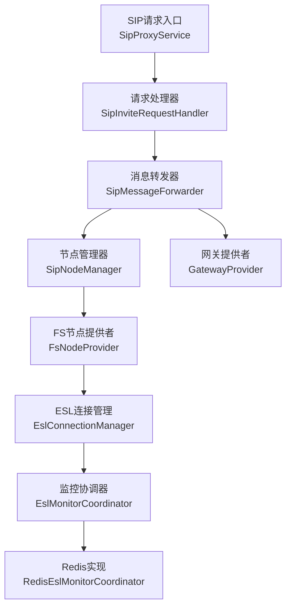
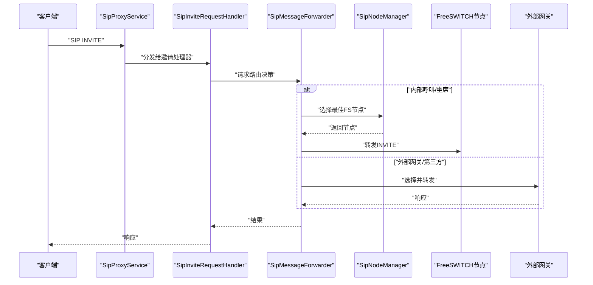
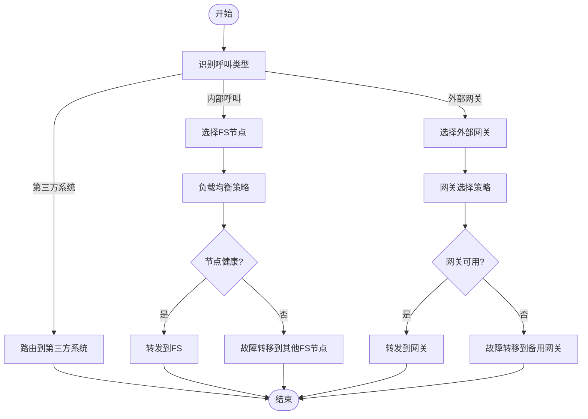
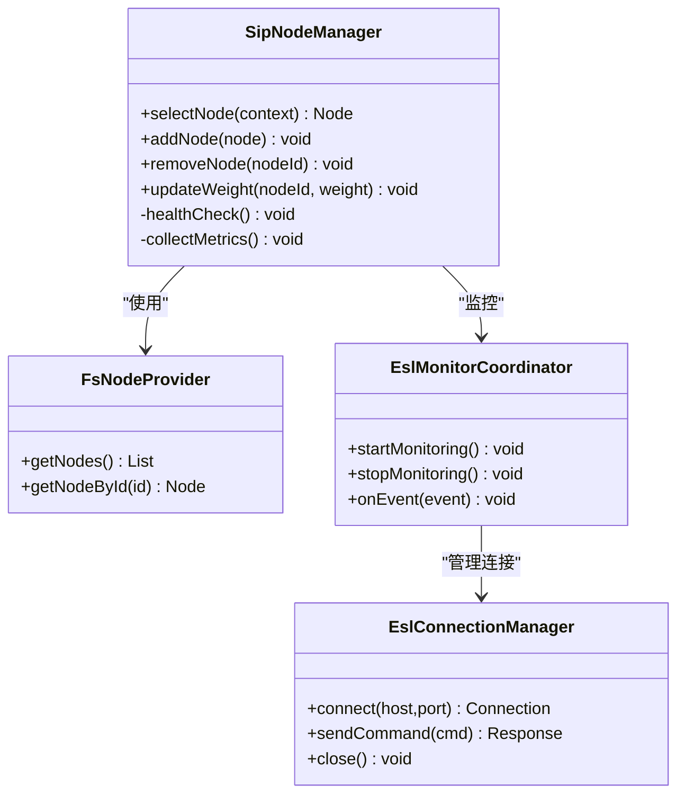
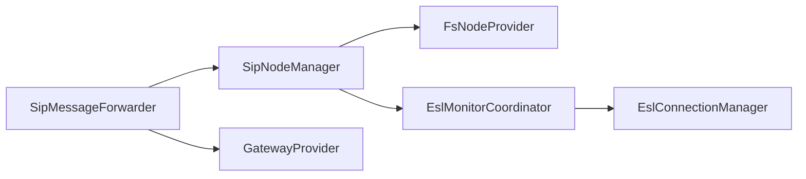

# 消息路由决策

<cite>
**本文引用的文件**
- [SipMessageForwarder.java](file://yudao-cloud/yudao-module-cc/ipcc-sipproxy/src/main/java/cn/ipcc/sipproxy/core/forwarder/SipMessageForwarder.java)
- [SipNodeManager.java](file://yudao-cloud/yudao-module-cc/ipcc-sipproxy/src/main/java/cn/ipcc/sipproxy/core/node/SipNodeManager.java)
- [SipProxyService.java](file://yudao-cloud/yudao-module-cc/ipcc-sipproxy/src/main/java/cn/ipcc/sipproxy/core/SipProxyService.java)
- [SipInviteRequestHandler.java](file://yudao-cloud/yudao-module-cc/ipcc-sipproxy/src/main/java/cn/ipcc/sipproxy/core/handler/request/sip/SipInviteRequestHandler.java)
- [GatewayProvider.java](file://yudao-cloud/yudao-module-cc/ipcc-sipproxy/src/main/java/cn/ipcc/sipproxy/api/gateway/GatewayProvider.java)
- [DefaultGatewayProvider.java](file://yudao-cloud/yudao-module-cc/ipcc-sipproxy/src/main/java/cn/ipcc/sipproxy/defaults/gateway/DefaultGatewayProvider.java)
- [FsNodeProvider.java](file://yudao-cloud/yudao-module-cc/ipcc-sipproxy/src/main/java/cn/ipcc/sipproxy/api/fs/FsNodeProvider.java)
- [DefaultAgentInfoProvider.java](file://yudao-cloud/yudao-module-cc/ipcc-sipproxy/src/main/java/cn/ipcc/sipproxy/defaults/agent/DefaultAgentInfoProvider.java)
- [EslConnectionManager.java](file://yudao-cloud/yudao-module-cc/ipcc-fs-esl/src/main/java/cn/ipcc/fs/esl/EslConnectionManager.java)
- [EslMonitorCoordinator.java](file://yudao-cloud/yudao-module-cc/ipcc-fs-esl/src/main/java/cn/ipcc/fs/esl/coordinator/EslMonitorCoordinator.java)
- [RedisEslMonitorCoordinator.java](file://yudao-cloud/yudao-module-cc/ipcc-fs-esl/src/main/java/cn/ipcc/fs/esl/coordinator/redis/RedisEslMonitorCoordinator.java)
- [EslClientProperties.java](file://yudao-cloud/yudao-module-cc/ipcc-fs-esl/src/main/java/cn/ipcc/fs/esl/spring/EslClientProperties.java)
- [SipProxyProperties.java](file://yudao-cloud/yudao-module-cc/ipcc-sipproxy/src/main/java/cn/ipcc/sipproxy/autoconfigure/SipProxyProperties.java)
</cite>

## 目录
1. [简介](#简介)
2. [项目结构](#项目结构)
3. [核心组件](#核心组件)
4. [架构总览](#架构总览)
5. [详细组件分析](#详细组件分析)
6. [依赖关系分析](#依赖关系分析)
7. [性能考量](#性能考量)
8. [故障排查指南](#故障排查指南)
9. [结论](#结论)
10. [附录：配置选项与场景说明](#附录：配置选项与场景说明)

## 简介
本文件面向IPCC呼叫中心系统的消息路由决策，聚焦于SipMessageForwarder的路由算法、Node管理（通过SipNodeManager）对FreeSWITCH节点池的管理策略，以及在不同呼叫场景下的路由逻辑。文档涵盖节点选择策略、负载均衡机制、故障转移逻辑，并提供流程图、配置项说明与优化建议，帮助读者理解并调优系统行为。

## 项目结构
本项目采用模块化设计，SIP代理与FreeSWITCH集成分别位于不同子模块：
- SIP代理模块（ipcc-sipproxy）：负责SIP消息处理、会话管理、节点选择与转发、网关抽象等。
- FreeSWITCH客户端模块（ipcc-fs-esl）：提供ESL连接、事件监控、指标采集与协调器，支撑节点健康检查与动态调整。

图表来源
- [SipProxyService.java](file://yudao-cloud/yudao-module-cc/ipcc-sipproxy/src/main/java/cn/ipcc/sipproxy/core/SipProxyService.java)
- [SipInviteRequestHandler.java](file://yudao-cloud/yudao-module-cc/ipcc-sipproxy/src/main/java/cn/ipcc/sipproxy/core/handler/request/sip/SipInviteRequestHandler.java)
- [SipMessageForwarder.java](file://yudao-cloud/yudao-module-cc/ipcc-sipproxy/src/main/java/cn/ipcc/sipproxy/core/forwarder/SipMessageForwarder.java)
- [SipNodeManager.java](file://yudao-cloud/yudao-module-cc/ipcc-sipproxy/src/main/java/cn/ipcc/sipproxy/core/node/SipNodeManager.java)
- [FsNodeProvider.java](file://yudao-cloud/yudao-module-cc/ipcc-sipproxy/src/main/java/cn/ipcc/sipproxy/api/fs/FsNodeProvider.java)
- [GatewayProvider.java](file://yudao-cloud/yudao-module-cc/ipcc-sipproxy/src/main/java/cn/ipcc/sipproxy/api/gateway/GatewayProvider.java)
- [EslConnectionManager.java](file://yudao-cloud/yudao-module-cc/ipcc-fs-esl/src/main/java/cn/ipcc/fs/esl/EslConnectionManager.java)
- [EslMonitorCoordinator.java](file://yudao-cloud/yudao-module-cc/ipcc-fs-esl/src/main/java/cn/ipcc/fs/esl/coordinator/EslMonitorCoordinator.java)
- [RedisEslMonitorCoordinator.java](file://yudao-cloud/yudao-module-cc/ipcc-fs-esl/src/main/java/cn/ipcc/fs/esl/coordinator/redis/RedisEslMonitorCoordinator.java)

章节来源
- [SipProxyService.java](file://yudao-cloud/yudao-module-cc/ipcc-sipproxy/src/main/java/cn/ipcc/sipproxy/core/SipProxyService.java)
- [SipInviteRequestHandler.java](file://yudao-cloud/yudao-module-cc/ipcc-sipproxy/src/main/java/cn/ipcc/sipproxy/core/handler/request/sip/SipInviteRequestHandler.java)
- [SipMessageForwarder.java](file://yudao-cloud/yudao-module-cc/ipcc-sipproxy/src/main/java/cn/ipcc/sipproxy/core/forwarder/SipMessageForwarder.java)
- [SipNodeManager.java](file://yudao-cloud/yudao-module-cc/ipcc-sipproxy/src/main/java/cn/ipcc/sipproxy/core/node/SipNodeManager.java)
- [GatewayProvider.java](file://yudao-cloud/yudao-module-cc/ipcc-sipproxy/src/main/java/cn/ipcc/sipproxy/api/gateway/GatewayProvider.java)
- [FsNodeProvider.java](file://yudao-cloud/yudao-module-cc/ipcc-sipproxy/src/main/java/cn/ipcc/sipproxy/api/fs/FsNodeProvider.java)
- [EslConnectionManager.java](file://yudao-cloud/yudao-module-cc/ipcc-fs-esl/src/main/java/cn/ipcc/fs/esl/EslConnectionManager.java)
- [EslMonitorCoordinator.java](file://yudao-cloud/yudao-module-cc/ipcc-fs-esl/src/main/java/cn/ipcc/fs/esl/coordinator/EslMonitorCoordinator.java)
- [RedisEslMonitorCoordinator.java](file://yudao-cloud/yudao-module-cc/ipcc-fs-esl/src/main/java/cn/ipcc/fs/esl/coordinator/redis/RedisEslMonitorCoordinator.java)

## 核心组件
- SipMessageForwarder：消息转发的核心，决定将SIP消息路由到FreeSWITCH节点或外部网关，并执行负载均衡与故障转移。
- SipNodeManager：维护FreeSWITCH节点池，负责节点健康检查、性能监控与动态调整（如权重、上下线）。
- GatewayProvider：抽象外部网关接入能力，支持第三方系统或运营商网关的出站路由。
- FsNodeProvider：提供FS节点信息，供SipNodeManager进行节点选择与调度。
- EslConnectionManager与EslMonitorCoordinator：在FS侧建立ESL连接并监控事件，为健康检查与指标上报提供基础。

章节来源
- [SipMessageForwarder.java](file://yudao-cloud/yudao-module-cc/ipcc-sipproxy/src/main/java/cn/ipcc/sipproxy/core/forwarder/SipMessageForwarder.java)
- [SipNodeManager.java](file://yudao-cloud/yudao-module-cc/ipcc-sipproxy/src/main/java/cn/ipcc/sipproxy/core/node/SipNodeManager.java)
- [GatewayProvider.java](file://yudao-cloud/yudao-module-cc/ipcc-sipproxy/src/main/java/cn/ipcc/sipproxy/api/gateway/GatewayProvider.java)
- [FsNodeProvider.java](file://yudao-cloud/yudao-module-cc/ipcc-sipproxy/src/main/java/cn/ipcc/sipproxy/api/fs/FsNodeProvider.java)
- [EslConnectionManager.java](file://yudao-cloud/yudao-module-cc/ipcc-fs-esl/src/main/java/cn/ipcc/fs/esl/EslConnectionManager.java)
- [EslMonitorCoordinator.java](file://yudao-cloud/yudao-module-cc/ipcc-fs-esl/src/main/java/cn/ipcc/fs/esl/coordinator/EslMonitorCoordinator.java)

## 架构总览
SIP请求进入后，由SipProxyService分发至具体处理器（如SipInviteRequestHandler），处理器调用SipMessageForwarder进行路由决策；转发器根据呼叫类型、目标号码、策略配置选择FS节点或外部网关；节点选择由SipNodeManager基于健康状态与负载指标进行；FS侧通过EslConnectionManager与EslMonitorCoordinator进行健康检查与指标采集，形成闭环的动态调整。

图表来源
- [SipProxyService.java](file://yudao-cloud/yudao-module-cc/ipcc-sipproxy/src/main/java/cn/ipcc/sipproxy/core/SipProxyService.java)
- [SipInviteRequestHandler.java](file://yudao-cloud/yudao-module-cc/ipcc-sipproxy/src/main/java/cn/ipcc/sipproxy/core/handler/request/sip/SipInviteRequestHandler.java)
- [SipMessageForwarder.java](file://yudao-cloud/yudao-module-cc/ipcc-sipproxy/src/main/java/cn/ipcc/sipproxy/core/forwarder/SipMessageForwarder.java)
- [SipNodeManager.java](file://yudao-cloud/yudao-module-cc/ipcc-sipproxy/src/main/java/cn/ipcc/sipproxy/core/node/SipNodeManager.java)
- [GatewayProvider.java](file://yudao-cloud/yudao-module-cc/ipcc-sipproxy/src/main/java/cn/ipcc/sipproxy/api/gateway/GatewayProvider.java)

## 详细组件分析

### SipMessageForwarder：路由决策算法
- 输入上下文：呼叫方向（入/出）、被叫号码、主叫信息、业务标签、策略配置。
- 决策流程：
  - 识别呼叫类型：内部呼叫（坐席/IVR）、外部网关（运营商/第三方）、第三方系统（API/WS）。
  - 匹配路由规则：按优先级匹配号码前缀、业务域、租户等。
  - 选择目标：若命中FS节点池，则交由SipNodeManager选择；否则交由GatewayProvider选择外部网关。
  - 负载均衡：支持轮询、最少连接、加权随机、延迟感知等策略（由配置与运行时指标驱动）。
  - 故障转移：当首选节点不可用或超时，自动切换到备选节点或降级到备用网关。
  - 结果返回：返回目标节点/网关及必要的头部重写信息。

图表来源
- [SipMessageForwarder.java](file://yudao-cloud/yudao-module-cc/ipcc-sipproxy/src/main/java/cn/ipcc/sipproxy/core/forwarder/SipMessageForwarder.java)
- [SipNodeManager.java](file://yudao-cloud/yudao-module-cc/ipcc-sipproxy/src/main/java/cn/ipcc/sipproxy/core/node/SipNodeManager.java)
- [GatewayProvider.java](file://yudao-cloud/yudao-module-cc/ipcc-sipproxy/src/main/java/cn/ipcc/sipproxy/api/gateway/GatewayProvider.java)

章节来源
- [SipMessageForwarder.java](file://yudao-cloud/yudao-module-cc/ipcc-sipproxy/src/main/java/cn/ipcc/sipproxy/core/forwarder/SipMessageForwarder.java)

### SipNodeManager：FreeSWITCH节点池管理
- 节点注册与发现：通过FsNodeProvider获取节点列表，维护节点元数据（地址、端口、权重、能力）。
- 健康检查：结合EslMonitorCoordinator与EslConnectionManager，周期性探测FS节点可达性与状态（如注册数、并发、错误率）。
- 性能监控：采集并上报指标（延迟、吞吐、错误率），用于动态权重调整与策略选择。
- 动态调整：根据指标阈值自动升降权、下线异常节点、上线恢复节点；支持手动干预（运维面板）。
- 选择策略：轮询、最少连接、加权随机、延迟优先；可结合业务标签（如区域、方言）做亲和路由。

图表来源
- [SipNodeManager.java](file://yudao-cloud/yudao-module-cc/ipcc-sipproxy/src/main/java/cn/ipcc/sipproxy/core/node/SipNodeManager.java)
- [FsNodeProvider.java](file://yudao-cloud/yudao-module-cc/ipcc-sipproxy/src/main/java/cn/ipcc/sipproxy/api/fs/FsNodeProvider.java)
- [EslMonitorCoordinator.java](file://yudao-cloud/yudao-module-cc/ipcc-fs-esl/src/main/java/cn/ipcc/fs/esl/coordinator/EslMonitorCoordinator.java)
- [EslConnectionManager.java](file://yudao-cloud/yudao-module-cc/ipcc-fs-esl/src/main/java/cn/ipcc/fs/esl/EslConnectionManager.java)

章节来源
- [SipNodeManager.java](file://yudao-cloud/yudao-module-cc/ipcc-sipproxy/src/main/java/cn/ipcc/sipproxy/core/node/SipNodeManager.java)
- [FsNodeProvider.java](file://yudao-cloud/yudao-module-cc/ipcc-sipproxy/src/main/java/cn/ipcc/sipproxy/api/fs/FsNodeProvider.java)
- [EslMonitorCoordinator.java](file://yudao-cloud/yudao-module-cc/ipcc-fs-esl/src/main/java/cn/ipcc/fs/esl/coordinator/EslMonitorCoordinator.java)
- [EslConnectionManager.java](file://yudao-cloud/yudao-module-cc/ipcc-fs-esl/src/main/java/cn/ipcc/fs/esl/EslConnectionManager.java)

### GatewayProvider：外部网关与第三方系统路由
- 统一抽象：通过GatewayProvider接口屏蔽不同网关差异，支持运营商中继、第三方语音平台、云通信服务等。
- 出站重写：根据业务需求重写SIP头、SDP参数、路由信息等（默认实现见DefaultGatewayProvider）。
- 路由策略：可按被叫号码段、业务域、租户、成本策略选择网关；支持多网关并行与快速切换。
- 故障转移：当主网关不可用或质量差时，自动切换到备用网关，并记录告警与指标。

章节来源
- [GatewayProvider.java](file://yudao-cloud/yudao-module-cc/ipcc-sipproxy/src/main/java/cn/ipcc/sipproxy/api/gateway/GatewayProvider.java)
- [DefaultGatewayProvider.java](file://yudao-cloud/yudao-module-cc/ipcc-sipproxy/src/main/java/cn/ipcc/sipproxy/defaults/gateway/DefaultGatewayProvider.java)

### 场景化路由决策
- 内部呼叫（坐席/IVR）：
  - 识别为内部呼叫后，交由SipNodeManager选择最优FS节点；考虑坐席亲和、区域就近、负载最低。
  - 若首选节点健康检查失败，立即故障转移到其他节点。
- 外部网关（运营商/第三方）：
  - 根据被叫号码段与策略选择对应网关；支持成本优先、质量优先、地域优先等策略。
  - 网关不可用时，自动切换到备用网关，并触发告警。
- 第三方系统（API/WS）：
  - 通过SipMessageForwarder的第三方路由分支，将SIP事件转换为系统事件或回调，完成业务联动。

章节来源
- [SipMessageForwarder.java](file://yudao-cloud/yudao-module-cc/ipcc-sipproxy/src/main/java/cn/ipcc/sipproxy/core/forwarder/SipMessageForwarder.java)
- [GatewayProvider.java](file://yudao-cloud/yudao-module-cc/ipcc-sipproxy/src/main/java/cn/ipcc/sipproxy/api/gateway/GatewayProvider.java)
- [DefaultAgentInfoProvider.java](file://yudao-cloud/yudao-module-cc/ipcc-sipproxy/src/main/java/cn/ipcc/sipproxy/defaults/agent/DefaultAgentInfoProvider.java)

## 依赖关系分析
- SipMessageForwarder依赖SipNodeManager与GatewayProvider，解耦了FS与外部网关的选择逻辑。
- SipNodeManager依赖FsNodeProvider与EslMonitorCoordinator，形成“节点发现—健康检查—指标采集”的闭环。
- EslConnectionManager作为底层连接管理，支撑所有FS交互与监控。

图表来源
- [SipMessageForwarder.java](file://yudao-cloud/yudao-module-cc/ipcc-sipproxy/src/main/java/cn/ipcc/sipproxy/core/forwarder/SipMessageForwarder.java)
- [SipNodeManager.java](file://yudao-cloud/yudao-module-cc/ipcc-sipproxy/src/main/java/cn/ipcc/sipproxy/core/node/SipNodeManager.java)
- [GatewayProvider.java](file://yudao-cloud/yudao-module-cc/ipcc-sipproxy/src/main/java/cn/ipcc/sipproxy/api/gateway/GatewayProvider.java)
- [FsNodeProvider.java](file://yudao-cloud/yudao-module-cc/ipcc-sipproxy/src/main/java/cn/ipcc/sipproxy/api/fs/FsNodeProvider.java)
- [EslMonitorCoordinator.java](file://yudao-cloud/yudao-module-cc/ipcc-fs-esl/src/main/java/cn/ipcc/fs/esl/coordinator/EslMonitorCoordinator.java)
- [EslConnectionManager.java](file://yudao-cloud/yudao-module-cc/ipcc-fs-esl/src/main/java/cn/ipcc/fs/esl/EslConnectionManager.java)

章节来源
- [SipMessageForwarder.java](file://yudao-cloud/yudao-module-cc/ipcc-sipproxy/src/main/java/cn/ipcc/sipproxy/core/forwarder/SipMessageForwarder.java)
- [SipNodeManager.java](file://yudao-cloud/yudao-module-cc/ipcc-sipproxy/src/main/java/cn/ipcc/sipproxy/core/node/SipNodeManager.java)
- [GatewayProvider.java](file://yudao-cloud/yudao-module-cc/ipcc-sipproxy/src/main/java/cn/ipcc/sipproxy/api/gateway/GatewayProvider.java)
- [FsNodeProvider.java](file://yudao-cloud/yudao-module-cc/ipcc-sipproxy/src/main/java/cn/ipcc/sipproxy/api/fs/FsNodeProvider.java)
- [EslMonitorCoordinator.java](file://yudao-cloud/yudao-module-cc/ipcc-fs-esl/src/main/java/cn/ipcc/fs/esl/coordinator/EslMonitorCoordinator.java)
- [EslConnectionManager.java](file://yudao-cloud/yudao-module-cc/ipcc-fs-esl/src/main/java/cn/ipcc/fs/esl/EslConnectionManager.java)

## 性能考量
- 节点选择策略：在高并发下优先使用“最少连接”或“延迟感知”策略，降低尾延迟。
- 健康检查频率：合理设置检查间隔与超时，避免频繁探测造成额外开销。
- 指标采样：对关键指标（延迟、错误率、并发）进行滑动窗口统计，减少计算压力。
- 缓存与会话亲和：对同一会话或同一用户尽量亲和到同一节点，减少跨节点信令开销。
- 网关选择：按成本与质量权衡，必要时启用多网关并行与快速切换，提升可用性。

[本节为通用指导，不直接分析具体文件]

## 故障排查指南
- 节点不可用：检查EslConnectionManager连接状态与EslMonitorCoordinator事件流，确认FS是否在线与注册正常。
- 路由失败：查看SipMessageForwarder日志，确认路由规则匹配与策略配置是否正确。
- 高延迟/丢包：分析SipNodeManager指标，定位热点节点与瓶颈，调整权重或扩容。
- 网关异常：检查GatewayProvider实现与下游网关状态，必要时切换到备用网关并告警。

章节来源
- [EslConnectionManager.java](file://yudao-cloud/yudao-module-cc/ipcc-fs-esl/src/main/java/cn/ipcc/fs/esl/EslConnectionManager.java)
- [EslMonitorCoordinator.java](file://yudao-cloud/yudao-module-cc/ipcc-fs-esl/src/main/java/cn/ipcc/fs/esl/coordinator/EslMonitorCoordinator.java)
- [SipMessageForwarder.java](file://yudao-cloud/yudao-module-cc/ipcc-sipproxy/src/main/java/cn/ipcc/sipproxy/core/forwarder/SipMessageForwarder.java)
- [GatewayProvider.java](file://yudao-cloud/yudao-module-cc/ipcc-sipproxy/src/main/java/cn/ipcc/sipproxy/api/gateway/GatewayProvider.java)

## 结论
SipMessageForwarder与SipNodeManager共同构成了IPCC呼叫中心的智能路由中枢：前者负责策略与决策，后者负责节点池管理与动态调整。通过健康检查、性能监控与故障转移，系统能够在复杂网络与多网关环境下保持高可用与高性能。建议在生产环境中结合业务特征调优策略与指标阈值，持续观察并迭代优化。

[本节为总结性内容，不直接分析具体文件]

## 附录：配置选项与场景说明
- SipProxyProperties：SIP代理相关配置（监听端口、集群模式、WebSocket开关等）。
- EslClientProperties：ESL客户端配置（连接超时、重试次数、心跳间隔、事件订阅等）。
- 路由策略配置：节点选择策略、权重、健康检查阈值、故障转移顺序、网关优先级等。
- 场景化配置：内部呼叫亲和、外部网关成本策略、第三方系统回调URL与鉴权。

章节来源
- [SipProxyProperties.java](file://yudao-cloud/yudao-module-cc/ipcc-sipproxy/src/main/java/cn/ipcc/sipproxy/autoconfigure/SipProxyProperties.java)
- [EslClientProperties.java](file://yudao-cloud/yudao-module-cc/ipcc-fs-esl/src/main/java/cn/ipcc/fs/esl/spring/EslClientProperties.java)