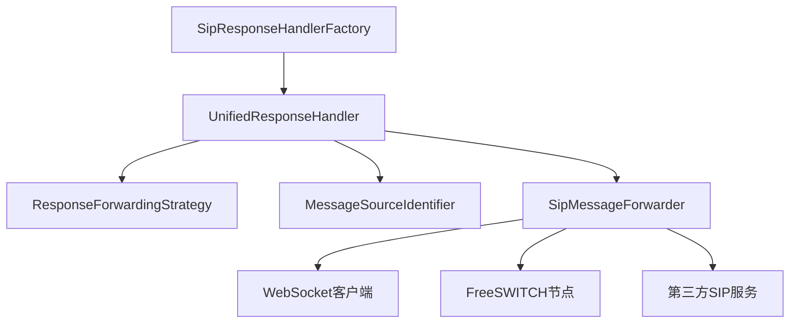
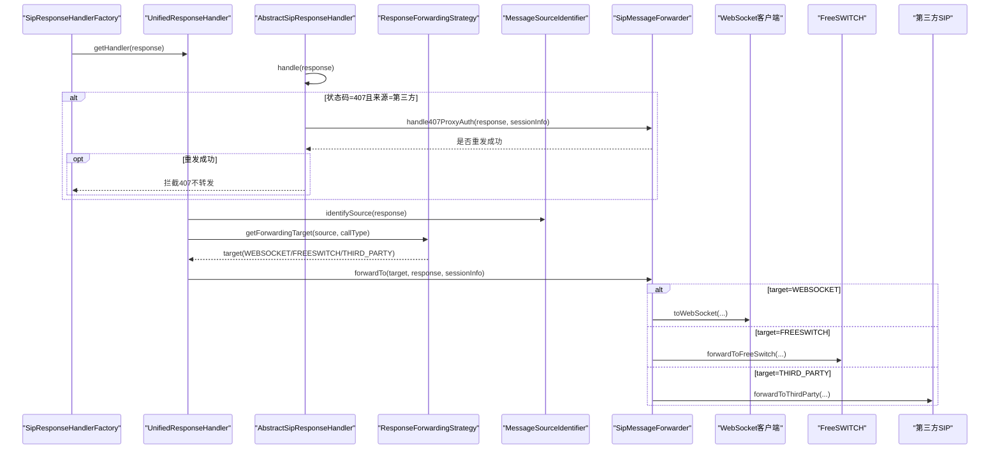
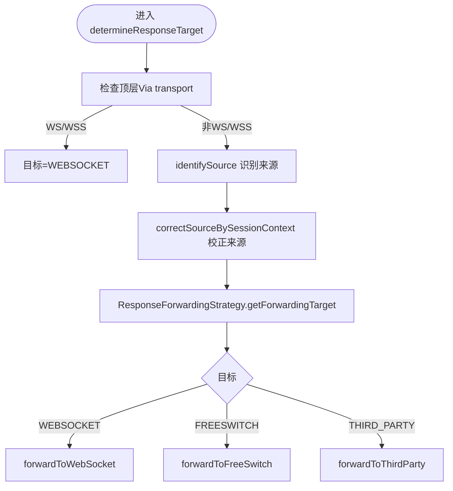
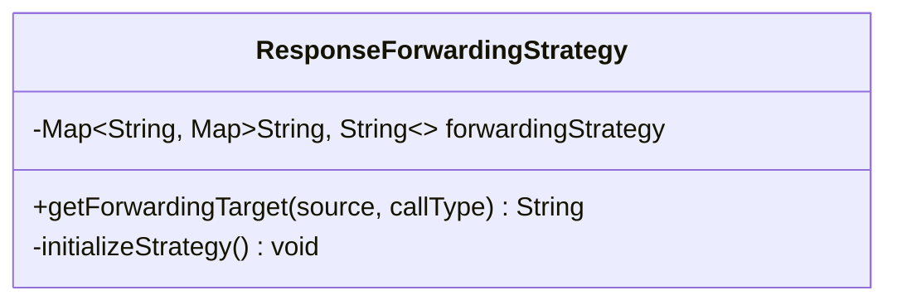
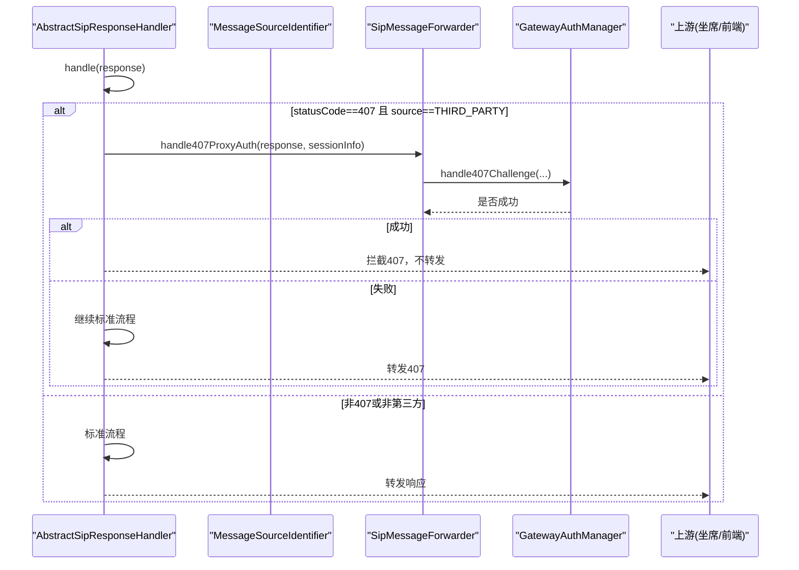
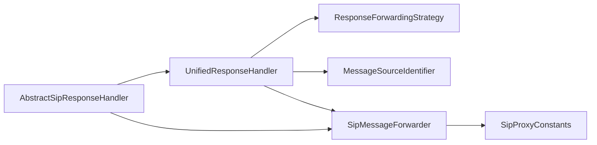

# 统一响应处理机制

<cite>
**本文引用的文件**
- [UnifiedResponseHandler.java](file://yudao-cloud/yudao-module-cc/ipcc-sipproxy/src/main/java/cn/ipcc/sipproxy/core/handler/response/UnifiedResponseHandler.java)
- [AbstractSipResponseHandler.java](file://yudao-cloud/yudao-module-cc/ipcc-sipproxy/src/main/java/cn/ipcc/sipproxy/core/handler/response/AbstractSipResponseHandler.java)
- [ResponseForwardingStrategy.java](file://yudao-cloud/yudao-module-cc/ipcc-sipproxy/src/main/java/cn/ipcc/sipproxy/core/handler/response/ResponseForwardingStrategy.java)
- [SipResponseHandlerFactory.java](file://yudao-cloud/yudao-module-cc/ipcc-sipproxy/src/main/java/cn/ipcc/sipproxy/core/handler/response/SipResponseHandlerFactory.java)
- [SipMessageForwarder.java](file://yudao-cloud/yudao-module-cc/ipcc-sipproxy/src/main/java/cn/ipcc/sipproxy/core/forwarder/SipMessageForwarder.java)
- [MessageSourceIdentifier.java](file://yudao-cloud/yudao-module-cc/ipcc-sipproxy/src/main/java/cn/ipcc/sipproxy/api/gateway/MessageSourceIdentifier.java)
- [SipProxyConstants.java](file://yudao-cloud/yudao-module-cc/ipcc-sipproxy/src/main/java/cn/ipcc/sipproxy/support/SipProxyConstants.java)
</cite>

## 目录
1. [简介](#简介)
2. [项目结构](#项目结构)
3. [核心组件](#核心组件)
4. [架构总览](#架构总览)
5. [详细组件分析](#详细组件分析)
6. [依赖关系分析](#依赖关系分析)
7. [性能考虑](#性能考虑)
8. [故障排查指南](#故障排查指南)
9. [结论](#结论)

## 简介
本文件面向IPCC呼叫中心系统的SIP代理层，系统化说明“统一响应处理机制”的设计与实现。重点围绕 UnifiedResponseHandler 类如何统一处理各类SIP响应（包括200 OK、407鉴权、错误响应）的转发策略；解释基于会话信息与消息来源的响应路由决策；并文档化407鉴权的特殊处理流程（认证头注入、重试与失败回退）。文末提供流程图与代码级交互图，帮助读者快速理解各组件协作关系。

## 项目结构
与统一响应处理相关的核心代码位于 sipproxy 模块的 handler/response 与 forwarder 包中：
- 响应处理器族：AbstractSipResponseHandler、UnifiedResponseHandler、ResponseForwardingStrategy、SipResponseHandlerFactory
- 消息转发器：SipMessageForwarder（负责WebSocket/FreeSWITCH/第三方SIP的转发与头部改写）
- 扩展点：MessageSourceIdentifier（用于识别消息来源）
- 常量定义：SipProxyConstants（来源标识、呼叫类型、传输协议等）

图表来源
- [SipResponseHandlerFactory.java:17-31](file://yudao-cloud/yudao-module-cc/ipcc-sipproxy/src/main/java/cn/ipcc/sipproxy/core/handler/response/SipResponseHandlerFactory.java#L17-L31)
- [UnifiedResponseHandler.java:21-64](file://yudao-cloud/yudao-module-cc/ipcc-sipproxy/src/main/java/cn/ipcc/sipproxy/core/handler/response/UnifiedResponseHandler.java#L21-L64)
- [ResponseForwardingStrategy.java:21-79](file://yudao-cloud/yudao-module-cc/ipcc-sipproxy/src/main/java/cn/ipcc/sipproxy/core/handler/response/ResponseForwardingStrategy.java#L21-L79)
- [SipMessageForwarder.java:97-240](file://yudao-cloud/yudao-module-cc/ipcc-sipproxy/src/main/java/cn/ipcc/sipproxy/core/forwarder/SipMessageForwarder.java#L97-L240)

章节来源
- [SipResponseHandlerFactory.java:17-31](file://yudao-cloud/yudao-module-cc/ipcc-sipproxy/src/main/java/cn/ipcc/sipproxy/core/handler/response/SipResponseHandlerFactory.java#L17-L31)
- [UnifiedResponseHandler.java:21-64](file://yudao-cloud/yudao-module-cc/ipcc-sipproxy/src/main/java/cn/ipcc/sipproxy/core/handler/response/UnifiedResponseHandler.java#L21-L64)
- [ResponseForwardingStrategy.java:21-79](file://yudao-cloud/yudao-module-cc/ipcc-sipproxy/src/main/java/cn/ipcc/sipproxy/core/handler/response/ResponseForwardingStrategy.java#L21-L79)
- [SipMessageForwarder.java:97-240](file://yudao-cloud/yudao-module-cc/ipcc-sipproxy/src/main/java/cn/ipcc/sipproxy/core/forwarder/SipMessageForwarder.java#L97-L240)

## 核心组件
- AbstractSipResponseHandler：定义响应处理的通用流程，包含407鉴权拦截与重发逻辑，以及统一的“确定目标→转发”骨架。
- UnifiedResponseHandler：具体实现响应目标判定与转发分发，结合消息来源识别与会话上下文进行校正，再按策略转发到WebSocket/FreeSWITCH/第三方。
- ResponseForwardingStrategy：维护“来源×呼叫类型→目标”的映射表，决定响应最终去向。
- SipMessageForwarder：封装向WebSocket、FreeSWITCH、第三方SIP发送消息的能力，负责头部改写、SDP处理、故障转移等。
- MessageSourceIdentifier：可插拔的消息来源识别接口，默认依据UA/Via等特征区分WEBSOCKET/FREESWITCH/THIRD_PARTY。
- SipProxyConstants：集中定义来源标识、呼叫类型、传输协议等常量。

章节来源
- [AbstractSipResponseHandler.java:33-76](file://yudao-cloud/yudao-module-cc/ipcc-sipproxy/src/main/java/cn/ipcc/sipproxy/core/handler/response/AbstractSipResponseHandler.java#L33-L76)
- [UnifiedResponseHandler.java:31-64](file://yudao-cloud/yudao-module-cc/ipcc-sipproxy/src/main/java/cn/ipcc/sipproxy/core/handler/response/UnifiedResponseHandler.java#L31-L64)
- [ResponseForwardingStrategy.java:27-79](file://yudao-cloud/yudao-module-cc/ipcc-sipproxy/src/main/java/cn/ipcc/sipproxy/core/handler/response/ResponseForwardingStrategy.java#L27-L79)
- [SipMessageForwarder.java:97-240](file://yudao-cloud/yudao-module-cc/ipcc-sipproxy/src/main/java/cn/ipcc/sipproxy/core/forwarder/SipMessageForwarder.java#L97-L240)
- [MessageSourceIdentifier.java:13-22](file://yudao-cloud/yudao-module-cc/ipcc-sipproxy/src/main/java/cn/ipcc/sipproxy/api/gateway/MessageSourceIdentifier.java#L13-L22)
- [SipProxyConstants.java:10-54](file://yudao-cloud/yudao-module-cc/ipcc-sipproxy/src/main/java/cn/ipcc/sipproxy/support/SipProxyConstants.java#L10-L54)

## 架构总览
统一响应处理采用“抽象基类 + 具体处理器 + 策略模式 + 扩展点”的组合：
- 入口：SipResponseHandlerFactory 返回统一处理器 UnifiedResponseHandler
- 流程：AbstractSipResponseHandler.handle 完成407拦截与标准转发
- 决策：UnifiedResponseHandler.determineResponseTarget 结合消息来源与会话上下文确定目标
- 策略：ResponseForwardingStrategy 根据“来源×呼叫类型”查表得到目标
- 执行：UnifiedResponseHandler.forwardResponse 调用 SipMessageForwarder 发送到对应目标

图表来源
- [SipResponseHandlerFactory.java:17-31](file://yudao-cloud/yudao-module-cc/ipcc-sipproxy/src/main/java/cn/ipcc/sipproxy/core/handler/response/SipResponseHandlerFactory.java#L17-L31)
- [AbstractSipResponseHandler.java:33-76](file://yudao-cloud/yudao-module-cc/ipcc-sipproxy/src/main/java/cn/ipcc/sipproxy/core/handler/response/AbstractSipResponseHandler.java#L33-L76)
- [UnifiedResponseHandler.java:31-64](file://yudao-cloud/yudao-module-cc/ipcc-sipproxy/src/main/java/cn/ipcc/sipproxy/core/handler/response/UnifiedResponseHandler.java#L31-L64)
- [ResponseForwardingStrategy.java:27-79](file://yudao-cloud/yudao-module-cc/ipcc-sipproxy/src/main/java/cn/ipcc/sipproxy/core/handler/response/ResponseForwardingStrategy.java#L27-L79)
- [SipMessageForwarder.java:97-240](file://yudao-cloud/yudao-module-cc/ipcc-sipproxy/src/main/java/cn/ipcc/sipproxy/core/forwarder/SipMessageForwarder.java#L97-L240)

## 详细组件分析

### 统一响应处理器 UnifiedResponseHandler
职责
- 确定响应目标：优先通过 Via transport 判断是否为WebSocket；否则结合 SessionInfo 对来源做二次校正；最后用策略表得出目标。
- 转发响应：根据目标分别转发至 WebSocket、FreeSWITCH 或第三方SIP。

关键逻辑
- 来源识别：委托 MessageSourceIdentifier.identifySource
- 来源校正：correctSourceBySessionContext
  - 若存在第三方leg（thirdPartyNode或gatewayId），强制来源为 THIRD_PARTY
  - 若仅存在自有FS leg且初始识别为 WEBSOCKET，则校正为 FREESWITCH
- 转发分发：forwardResponse 根据目标调用对应方法，内部使用 SipMessageForwarder

图表来源
- [UnifiedResponseHandler.java:31-64](file://yudao-cloud/yudao-module-cc/ipcc-sipproxy/src/main/java/cn/ipcc/sipproxy/core/handler/response/UnifiedResponseHandler.java#L31-L64)
- [UnifiedResponseHandler.java:96-151](file://yudao-cloud/yudao-module-cc/ipcc-sipproxy/src/main/java/cn/ipcc/sipproxy/core/handler/response/UnifiedResponseHandler.java#L96-L151)
- [ResponseForwardingStrategy.java:27-79](file://yudao-cloud/yudao-module-cc/ipcc-sipproxy/src/main/java/cn/ipcc/sipproxy/core/handler/response/ResponseForwardingStrategy.java#L27-L79)

章节来源
- [UnifiedResponseHandler.java:31-64](file://yudao-cloud/yudao-module-cc/ipcc-sipproxy/src/main/java/cn/ipcc/sipproxy/core/handler/response/UnifiedResponseHandler.java#L31-L64)
- [UnifiedResponseHandler.java:96-151](file://yudao-cloud/yudao-module-cc/ipcc-sipproxy/src/main/java/cn/ipcc/sipproxy/core/handler/response/UnifiedResponseHandler.java#L96-L151)
- [UnifiedResponseHandler.java:153-216](file://yudao-cloud/yudao-module-cc/ipcc-sipproxy/src/main/java/cn/ipcc/sipproxy/core/handler/response/UnifiedResponseHandler.java#L153-L216)

### 响应转发策略 ResponseForwardingStrategy
职责
- 维护“消息来源 × 呼叫类型 → 转发目标”的映射表
- 根据当前响应的来源与呼叫类型查询目标

策略要点
- WEBSOCKET 来源：无论何种呼叫类型，均转发到 FreeSWITCH
- FREESWITCH 来源：内部/外呼转WebSocket，入呼转第三方
- THIRD_PARTY 来源：无论何种呼叫类型，均转发到 FreeSWITCH

图表来源
- [ResponseForwardingStrategy.java:21-79](file://yudao-cloud/yudao-module-cc/ipcc-sipproxy/src/main/java/cn/ipcc/sipproxy/core/handler/response/ResponseForwardingStrategy.java#L21-L79)

章节来源
- [ResponseForwardingStrategy.java:27-79](file://yudao-cloud/yudao-module-cc/ipcc-sipproxy/src/main/java/cn/ipcc/sipproxy/core/handler/response/ResponseForwardingStrategy.java#L27-L79)

### 消息来源识别 MessageSourceIdentifier
职责
- 提供可扩展的消息来源识别能力，默认基于User-Agent/Via等特征区分 WEBSOCKET/FREESWITCH/THIRD_PARTY
- 在响应场景下，可通过 SessionInfo 上下文进一步校正（由 UnifiedResponseHandler 完成）

章节来源
- [MessageSourceIdentifier.java:13-22](file://yudao-cloud/yudao-module-cc/ipcc-sipproxy/src/main/java/cn/ipcc/sipproxy/api/gateway/MessageSourceIdentifier.java#L13-L22)
- [UnifiedResponseHandler.java:31-64](file://yudao-cloud/yudao-module-cc/ipcc-sipproxy/core/handler/response/UnifiedResponseHandler.java#L31-L64)

### 消息转发器 SipMessageForwarder
职责
- 将SIP消息转发到 WebSocket、FreeSWITCH、第三方SIP
- 负责头部改写（Contact/Via/Request-URI）、SDP处理、故障转移等
- 提供407鉴权处理入口（委托 GatewayAuthManager）

关键点
- modifyWsProxyHeaders：为WebSocket侧转发准备头部与SDP
- modifyHeadersForForwarding：为FS/第三方侧转发准备头部与SDP
- forwardToFreeSwitch / forwardToThirdParty：实际网络发送与异常处理
- handle407ProxyAuth：触发鉴权重试

章节来源
- [SipMessageForwarder.java:97-240](file://yudao-cloud/yudao-module-cc/ipcc-sipproxy/src/main/java/cn/ipcc/sipproxy/core/forwarder/SipMessageForwarder.java#L97-L240)
- [SipMessageForwarder.java:262-358](file://yudao-cloud/yudao-module-cc/ipcc-sipproxy/src/main/java/cn/ipcc/sipproxy/core/forwarder/SipMessageForwarder.java#L262-L358)
- [SipMessageForwarder.java:391-550](file://yudao-cloud/yudao-module-cc/ipcc-sipproxy/src/main/java/cn/ipcc/sipproxy/core/forwarder/SipMessageForwarder.java#L391-L550)
- [SipMessageForwarder.java:631-640](file://yudao-cloud/yudao-module-cc/ipcc-sipproxy/src/main/java/cn/ipcc/sipproxy/core/forwarder/SipMessageForwarder.java#L631-L640)

### 407鉴权处理流程
触发条件
- 收到状态码为407 Proxy Authentication Required的响应
- 来源识别为第三方网关，且会话中存在有效的网关ID

处理步骤
- 调用 SipMessageForwarder.handle407ProxyAuth（内部委托 GatewayAuthManager）
- 若重发成功：拦截该407，不转发给坐席
- 若重发失败：继续正常转发407，让上层感知错误

图表来源
- [AbstractSipResponseHandler.java:33-76](file://yudao-cloud/yudao-module-cc/ipcc-sipproxy/src/main/java/cn/ipcc/sipproxy/core/handler/response/AbstractSipResponseHandler.java#L33-L76)
- [SipMessageForwarder.java:631-640](file://yudao-cloud/yudao-module-cc/ipcc-sipproxy/src/main/java/cn/ipcc/sipproxy/core/forwarder/SipMessageForwarder.java#L631-L640)

章节来源
- [AbstractSipResponseHandler.java:33-76](file://yudao-cloud/yudao-module-cc/ipcc-sipproxy/src/main/java/cn/ipcc/sipproxy/core/handler/response/AbstractSipResponseHandler.java#L33-L76)
- [SipMessageForwarder.java:631-640](file://yudao-cloud/yudao-module-cc/ipcc-sipproxy/src/main/java/cn/ipcc/sipproxy/core/forwarder/SipMessageForwarder.java#L631-L640)

### 200 OK与其他响应处理
- 200 OK：遵循统一路由决策，根据来源与呼叫类型转发到正确目标（通常为FreeSWITCH或WebSocket）
- 错误响应（4xx/5xx/6xx）：同样走统一流程，确保错误能准确回传到发起方（坐席或上游网关）
- 通过 SessionInfo 上下文与 Via transport 双重保障，避免误判导致ACK缺失或媒体协商失败

章节来源
- [UnifiedResponseHandler.java:31-64](file://yudao-cloud/yudao-module-cc/ipcc-sipproxy/src/main/java/cn/ipcc/sipproxy/core/handler/response/UnifiedResponseHandler.java#L31-L64)
- [UnifiedResponseHandler.java:153-216](file://yudao-cloud/yudao-module-cc/ipcc-sipproxy/core/handler/response/UnifiedResponseHandler.java#L153-L216)

## 依赖关系分析
- UnifiedResponseHandler 依赖：
  - ResponseForwardingStrategy：决定转发目标
  - MessageSourceIdentifier：识别消息来源
  - SipMessageForwarder：执行实际转发
- AbstractSipResponseHandler 依赖：
  - SipSessionManager：获取会话信息
  - SipMessageForwarder：407鉴权重试
- 常量 SipProxyConstants 被多处引用，保证来源、呼叫类型、传输协议的一致性

图表来源
- [UnifiedResponseHandler.java:21-64](file://yudao-cloud/yudao-module-cc/ipcc-sipproxy/src/main/java/cn/ipcc/sipproxy/core/handler/response/UnifiedResponseHandler.java#L21-L64)
- [AbstractSipResponseHandler.java:21-76](file://yudao-cloud/yudao-module-cc/ipcc-sipproxy/src/main/java/cn/ipcc/sipproxy/core/handler/response/AbstractSipResponseHandler.java#L21-L76)
- [SipProxyConstants.java:10-54](file://yudao-cloud/yudao-module-cc/ipcc-sipproxy/src/main/java/cn/ipcc/sipproxy/support/SipProxyConstants.java#L10-L54)

章节来源
- [UnifiedResponseHandler.java:21-64](file://yudao-cloud/yudao-module-cc/ipcc-sipproxy/src/main/java/cn/ipcc/sipproxy/core/handler/response/UnifiedResponseHandler.java#L21-L64)
- [AbstractSipResponseHandler.java:21-76](file://yudao-cloud/yudao-module-cc/ipcc-sipproxy/src/main/java/cn/ipcc/sipproxy/core/handler/response/AbstractSipResponseHandler.java#L21-L76)
- [SipProxyConstants.java:10-54](file://yudao-cloud/yudao-module-cc/ipcc-sipproxy/src/main/java/cn/ipcc/sipproxy/support/SipProxyConstants.java#L10-L54)

## 性能考虑
- 来源识别与会话校正仅在响应路径上执行一次，开销较小
- 转发前进行必要的头部与SDP修改，必要时进行故障转移（FreeSWITCH多节点尝试）
- 建议在高并发场景下关注日志输出与异常统计，便于定位瓶颈

[本节为通用指导，不直接分析具体文件]

## 故障排查指南
常见问题与定位要点
- 407未拦截或重复转发：检查来源识别是否正确（第三方），会话中是否存在有效网关ID，以及 GatewayAuthManager 的重试结果
- 200 OK未到达预期端：确认 Via transport 是否为WS/WSS；检查 SessionInfo 中的 freeSwitchNode/thirdPartyNode/gatewayId 是否正确；核对 ResponseForwardingStrategy 的策略表
- 转发失败：查看 SipMessageForwarder 的异常日志，确认目标地址、传输协议、头部改写是否成功

章节来源
- [AbstractSipResponseHandler.java:33-76](file://yudao-cloud/yudao-module-cc/ipcc-sipproxy/src/main/java/cn/ipcc/sipproxy/core/handler/response/AbstractSipResponseHandler.java#L33-L76)
- [UnifiedResponseHandler.java:31-64](file://yudao-cloud/yudao-module-cc/ipcc-sipproxy/core/handler/response/UnifiedResponseHandler.java#L31-L64)
- [SipMessageForwarder.java:110-200](file://yudao-cloud/yudao-module-cc/ipcc-sipproxy/src/main/java/cn/ipcc/sipproxy/core/forwarder/SipMessageForwarder.java#L110-L200)

## 结论
统一响应处理机制通过“来源识别 + 会话校正 + 策略路由 + 可靠转发”的组合，确保了SIP响应在不同场景下的正确回传。特别是针对407鉴权、WS/WSS来源、第三方网关等复杂情况，提供了健壮的处理与回退策略。该设计具备良好的扩展性与可维护性，适合在呼叫中心大规模部署中使用。