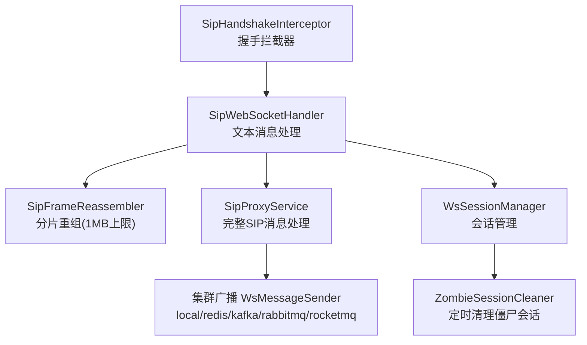
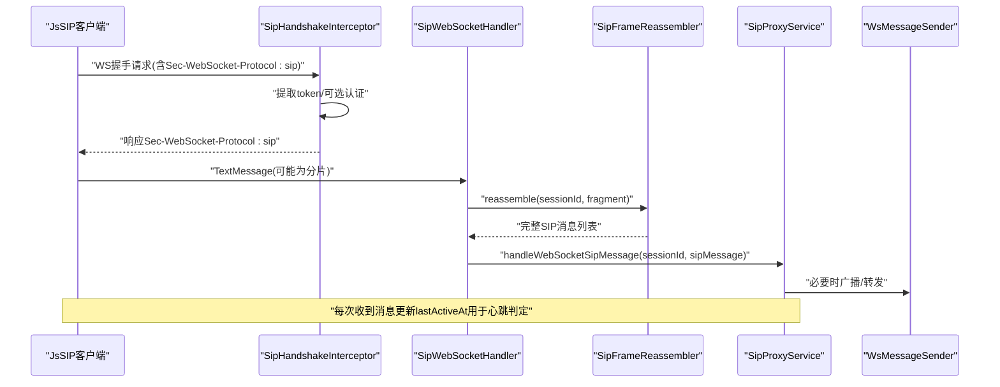
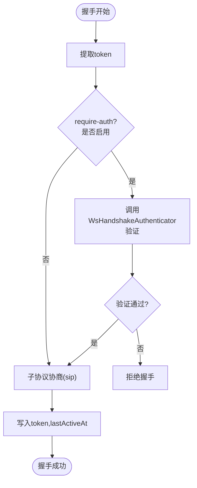
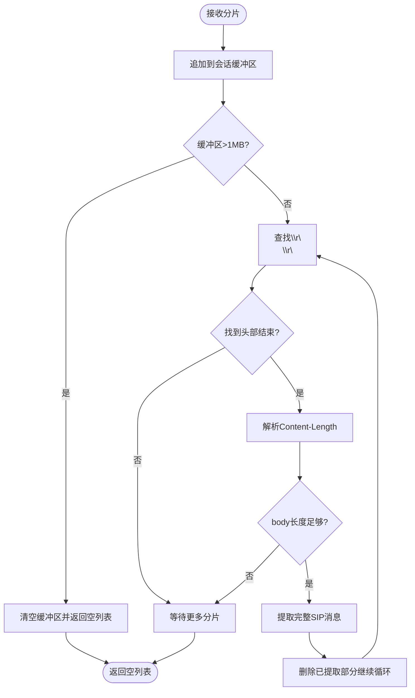
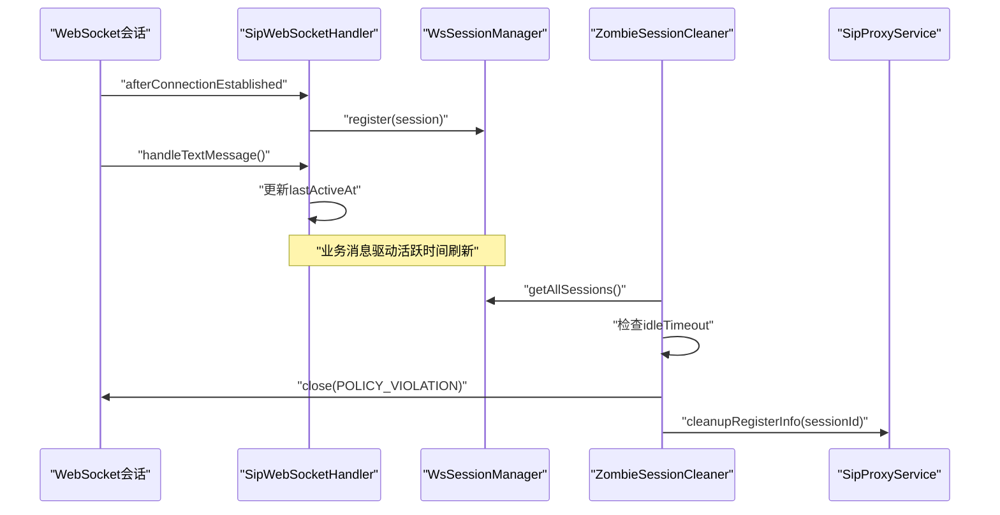
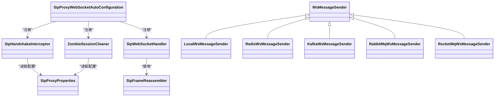

# WebSocket集成

<cite>
**本文引用的文件**
- [SipWebSocketHandler.java](file://yudao-cloud/yudao-module-cc/ipcc-sipproxy/src/main/java/cn/ipcc/sipproxy/websocket/SipWebSocketHandler.java)
- [SipFrameReassembler.java](file://yudao-cloud/yudao-module-cc/ipcc-sipproxy/src/main/java/cn/ipcc/sipproxy/websocket/SipFrameReassembler.java)
- [SipHandshakeInterceptor.java](file://yudao-cloud/yudao-module-cc/ipcc-sipproxy/src/main/java/cn/ipcc/sipproxy/websocket/SipHandshakeInterceptor.java)
- [ZombieSessionCleaner.java](file://yudao-cloud/yudao-module-cc/ipcc-sipproxy/src/main/java/cn/ipcc/sipproxy/websocket/ZombieSessionCleaner.java)
- [README.md](file://yudao-cloud/yudao-module-cc/ipcc-sipproxy/README.md)
- [SipProxyProperties.java](file://yudao-cloud/yudao-module-cc/ipcc-sipproxy/src/main/java/cn/ipcc/sipproxy/autoconfigure/SipProxyProperties.java)
- [SipProxyWebSocketAutoConfiguration.java](file://yudao-cloud/yudao-module-cc/ipcc-sipproxy/src/main/java/cn/ipcc/sipproxy/autoconfigure/SipProxyWebSocketAutoConfiguration.java)
- [WsMessageSender.java](file://yudao-cloud/yudao-module-cc/ipcc-sipproxy/src/main/java/cn/ipcc/sipproxy/cluster/WsMessageSender.java)
- [LocalWsMessageSender.java](file://yudao-cloud/yudao-module-cc/ipcc-sipproxy/src/main/java/cn/ipcc/sipproxy/cluster/LocalWsMessageSender.java)
- [KafkaWsMessageSender.java](file://yudao-cloud/yudao-module-cc/ipcc-sipproxy/src/main/java/cn/ipcc/sipproxy/cluster/KafkaWsMessageSender.java)
- [RedisWsMessageSender.java](file://yudao-cloud/yudao-module-cc/ipcc-sipproxy/src/main/java/cn/ipcc/sipproxy/cluster/RedisWsMessageSender.java)
- [RabbitMqWsMessageSender.java](file://yudao-cloud/yudao-module-cc/ipcc-sipproxy/src/main/java/cn/ipcc/sipproxy/cluster/RabbitMqWsMessageSender.java)
- [RocketMqWsMessageSender.java](file://yudao-cloud/yudao-module-cc/ipcc-sipproxy/src/main/java/cn/ipcc/sipproxy/cluster/RocketMqWsMessageSender.java)
- [SipProxyService.java](file://yudao-cloud/yudao-module-cc/ipcc-sipproxy/src/main/java/cn/ipcc/sipproxy/core/SipProxyService.java)
</cite>

## 目录
1. [简介](#简介)
2. [项目结构](#项目结构)
3. [核心组件](#核心组件)
4. [架构总览](#架构总览)
5. [详细组件分析](#详细组件分析)
6. [依赖关系分析](#依赖关系分析)
7. [性能与内存管理](#性能与内存管理)
8. [配置示例](#配置示例)
9. [监控指标与排障](#监控指标与排障)
10. [结论](#结论)

## 简介
本文件面向IPCC呼叫中心系统的WebSocket集成，聚焦SIP over WebSocket（RFC 7118）的接入能力。文档覆盖握手认证、子协议协商、安全校验、SIP消息分片重组（含1MB缓冲上限）、会话管理与僵尸清理、心跳检测、与JsSIP客户端兼容性、错误处理机制、集群广播、配置与调优建议以及监控指标说明。

## 项目结构
sipproxy模块提供独立的SIP代理服务（B2BUA），通过Spring Boot自动装配启用WebSocket SIP接入。WebSocket相关能力集中在websocket包：握手拦截器、文本消息处理器、分片重组器、僵尸会话清理器；并通过自动配置类注册到Spring容器。集群广播通过多种WsMessageSender实现支持本地或分布式环境。

图表来源
- [SipHandshakeInterceptor.java:59-100](file://yudao-cloud/yudao-module-cc/ipcc-sipproxy/src/main/java/cn/ipcc/sipproxy/websocket/SipHandshakeInterceptor.java#L59-L100)
- [SipWebSocketHandler.java:52-87](file://yudao-cloud/yudao-module-cc/ipcc-sipproxy/src/main/java/cn/ipcc/sipproxy/websocket/SipWebSocketHandler.java#L52-L87)
- [SipFrameReassembler.java:44-74](file://yudao-cloud/yudao-module-cc/ipcc-sipproxy/src/main/java/cn/ipcc/sipproxy/websocket/SipFrameReassembler.java#L44-L74)
- [ZombieSessionCleaner.java:67-90](file://yudao-cloud/yudao-module-cc/ipcc-sipproxy/src/main/java/cn/ipcc/sipproxy/websocket/ZombieSessionCleaner.java#L67-L90)
- [WsMessageSender.java](file://yudao-cloud/yudao-module-cc/ipcc-sipproxy/src/main/java/cn/ipcc/sipproxy/cluster/WsMessageSender.java)
- [LocalWsMessageSender.java](file://yudao-cloud/yudao-module-cc/ipcc-sipproxy/src/main/java/cn/ipcc/sipproxy/cluster/LocalWsMessageSender.java)
- [KafkaWsMessageSender.java](file://yudao-cloud/yudao-module-cc/ipcc-sipproxy/src/main/java/cn/ipcc/sipproxy/cluster/KafkaWsMessageSender.java)
- [RedisWsMessageSender.java](file://yudao-cloud/yudao-module-cc/ipcc-sipproxy/src/main/java/cn/ipcc/sipproxy/cluster/RedisWsMessageSender.java)
- [RabbitMqWsMessageSender.java](file://yudao-cloud/yudao-module-cc/ipcc-sipproxy/src/main/java/cn/ipcc/sipproxy/cluster/RabbitMqWsMessageSender.java)
- [RocketMqWsMessageSender.java](file://yudao-cloud/yudao-module-cc/ipcc-sipproxy/src/main/java/cn/ipcc/sipproxy/cluster/RocketMqWsMessageSender.java)

章节来源
- [README.md:32-60](file://yudao-cloud/yudao-module-cc/ipcc-sipproxy/README.md#L32-L60)
- [README.md:183-199](file://yudao-cloud/yudao-module-cc/ipcc-sipproxy/README.md#L183-L199)

## 核心组件
- 握手拦截器：负责token提取、可选认证、RFC 7118子协议协商、写入attributes供后续使用。
- 文本消息处理器：注册/注销会话、更新活跃时间、调用分片重组器、转发完整SIP消息至核心服务。
- 分片重组器：按\r\n\r\n头结束标记与Content-Length计算长度，支持单帧多消息与单消息多帧，设置1MB缓冲上限保护内存。
- 僵尸会话清理器：定时扫描会话，对超过空闲阈值的连接主动关闭并清理注册信息。
- 集群广播：通过不同WsMessageSender在本地或分布式环境中向目标会话发送消息。

章节来源
- [SipHandshakeInterceptor.java:59-100](file://yudao-cloud/yudao-module-cc/ipcc-sipproxy/src/main/java/cn/ipcc/sipproxy/websocket/SipHandshakeInterceptor.java#L59-L100)
- [SipWebSocketHandler.java:52-87](file://yudao-cloud/yudao-module-cc/ipcc-sipproxy/src/main/java/cn/ipcc/sipproxy/websocket/SipWebSocketHandler.java#L52-L87)
- [SipFrameReassembler.java:23-24](file://yudao-cloud/yudao-module-cc/ipcc-sipproxy/src/main/java/cn/ipcc/sipproxy/websocket/SipFrameReassembler.java#L23-L24)
- [ZombieSessionCleaner.java:67-90](file://yudao-cloud/yudao-module-cc/ipcc-sipproxy/src/main/java/cn/ipcc/sipproxy/websocket/ZombieSessionCleaner.java#L67-L90)

## 架构总览
WebSocket接入层将HTTP升级后的SIP over WebSocket流量转换为JAIN-SIP对象，交由核心服务进行路由、转发与会话管理。握手阶段完成认证与子协议协商；运行期通过心跳与定时任务维护会话健康；异常时及时释放资源。

图表来源
- [SipHandshakeInterceptor.java:59-100](file://yudao-cloud/yudao-module-cc/ipcc-sipproxy/src/main/java/cn/ipcc/sipproxy/websocket/SipHandshakeInterceptor.java#L59-L100)
- [SipWebSocketHandler.java:58-72](file://yudao-cloud/yudao-module-cc/ipcc-sipproxy/src/main/java/cn/ipcc/sipproxy/websocket/SipWebSocketHandler.java#L58-L72)
- [SipFrameReassembler.java:44-74](file://yudao-cloud/yudao-module-cc/ipcc-sipproxy/src/main/java/cn/ipcc/sipproxy/websocket/SipFrameReassembler.java#L44-L74)
- [SipProxyService.java](file://yudao-cloud/yudao-module-cc/ipcc-sipproxy/src/main/java/cn/ipcc/sipproxy/core/SipProxyService.java)
- [WsMessageSender.java](file://yudao-cloud/yudao-module-cc/ipcc-sipproxy/src/main/java/cn/ipcc/sipproxy/cluster/WsMessageSender.java)

## 详细组件分析

### 握手认证与子协议协商
- token提取：从URL查询参数中读取，支持Servlet与非Servlet环境兜底解析。
- 可选认证：当require-auth=true且提供扩展点实现时，调用WsHandshakeAuthenticator进行token校验；否则允许本地调试模式跳过。
- RFC 7118子协议协商：若客户端携带Sec-WebSocket-Protocol:sip，则服务端必须返回所选协议，否则JsSIP会立即断开。
- attributes注入：通过后将token与lastActiveAt写入attributes，供后续处理器与心跳逻辑使用。

图表来源
- [SipHandshakeInterceptor.java:59-100](file://yudao-cloud/yudao-module-cc/ipcc-sipproxy/src/main/java/cn/ipcc/sipproxy/websocket/SipHandshakeInterceptor.java#L59-L100)
- [SipHandshakeInterceptor.java:126-140](file://yudao-cloud/yudao-module-cc/ipcc-sipproxy/src/main/java/cn/ipcc/sipproxy/websocket/SipHandshakeInterceptor.java#L126-L140)
- [SipHandshakeInterceptor.java:151-168](file://yudao-cloud/yudao-module-cc/ipcc-sipproxy/src/main/java/cn/ipcc/sipproxy/websocket/SipHandshakeInterceptor.java#L151-L168)

章节来源
- [SipHandshakeInterceptor.java:59-100](file://yudao-cloud/yudao-module-cc/ipcc-sipproxy/src/main/java/cn/ipcc/sipproxy/websocket/SipHandshakeInterceptor.java#L59-L100)
- [SipHandshakeInterceptor.java:126-140](file://yudao-cloud/yudao-module-cc/ipcc-sipproxy/src/main/java/cn/ipcc/sipproxy/websocket/SipHandshakeInterceptor.java#L126-L140)
- [SipHandshakeInterceptor.java:151-168](file://yudao-cloud/yudao-module-cc/ipcc-sipproxy/src/main/java/cn/ipcc/sipproxy/websocket/SipHandshakeInterceptor.java#L151-L168)

### SIP消息分片重组与1MB缓冲上限
- 分片策略：每个WebSocket会话维护独立StringBuilder缓冲区，避免跨会话污染。
- 重组算法：以\r\n\r\n作为头部结束标记，解析Content-Length确定消息体长度，循环提取完整SIP消息，支持单帧多消息与单消息多帧。
- 内存保护：缓冲区超过1MB即清空并丢弃，防止恶意或异常客户端导致内存溢出。
- 清理机制：连接关闭时清理对应会话的缓冲区。

图表来源
- [SipFrameReassembler.java:23-24](file://yudao-cloud/yudao-module-cc/ipcc-sipproxy/src/main/java/cn/ipcc/sipproxy/websocket/SipFrameReassembler.java#L23-L24)
- [SipFrameReassembler.java:44-74](file://yudao-cloud/yudao-module-cc/ipcc-sipproxy/src/main/java/cn/ipcc/sipproxy/websocket/SipFrameReassembler.java#L44-L74)
- [SipFrameReassembler.java:84-96](file://yudao-cloud/yudao-module-cc/ipcc-sipproxy/src/main/java/cn/ipcc/sipproxy/websocket/SipFrameReassembler.java#L84-L96)
- [SipFrameReassembler.java:103-105](file://yudao-cloud/yudao-module-cc/ipcc-sipproxy/src/main/java/cn/ipcc/sipproxy/websocket/SipFrameReassembler.java#L103-L105)

章节来源
- [SipFrameReassembler.java:44-74](file://yudao-cloud/yudao-module-cc/ipcc-sipproxy/src/main/java/cn/ipcc/sipproxy/websocket/SipFrameReassembler.java#L44-L74)
- [SipFrameReassembler.java:84-96](file://yudao-cloud/yudao-module-cc/ipcc-sipproxy/src/main/java/cn/ipcc/sipproxy/websocket/SipFrameReassembler.java#L84-L96)
- [SipFrameReassembler.java:103-105](file://yudao-cloud/yudao-module-cc/ipcc-sipproxy/src/main/java/cn/ipcc/sipproxy/websocket/SipFrameReassembler.java#L103-L105)

### 会话管理与僵尸清理
- 会话注册/注销：连接建立时注册到WsSessionManager，关闭时注销并清理重组缓冲区与注册信息。
- 活跃时间：每次收到消息更新lastActiveAt，供心跳判定使用。
- 僵尸清理：定时任务每60秒扫描所有会话，对超过空闲阈值的连接以POLICY_VIOLATION关闭，并清理Redis中的注册映射。

图表来源
- [SipWebSocketHandler.java:52-87](file://yudao-cloud/yudao-module-cc/ipcc-sipproxy/src/main/java/cn/ipcc/sipproxy/websocket/SipWebSocketHandler.java#L52-L87)
- [ZombieSessionCleaner.java:67-90](file://yudao-cloud/yudao-module-cc/ipcc-sipproxy/src/main/java/cn/ipcc/sipproxy/websocket/ZombieSessionCleaner.java#L67-L90)

章节来源
- [SipWebSocketHandler.java:52-87](file://yudao-cloud/yudao-module-cc/ipcc-sipproxy/websocket/SipWebSocketHandler.java#L52-L87)
- [ZombieSessionCleaner.java:67-90](file://yudao-cloud/yudao-module-cc/ipcc-sipproxy/websocket/ZombieSessionCleaner.java#L67-L90)

### 与JsSIP兼容性与RFC 7118支持
- JsSIP兼容性：握手时必须响应Sec-WebSocket-Protocol:sip，否则浏览器端会立即断开（表现为EOFException与CloseStatus 1006）。
- RFC 7118：采用sip子协议承载明文SIP over WebSocket；sips子协议标识加密通道（当前未启用）。
- 前端测试：仓库提供example-jssip示例页面，便于端到端验证注册与呼叫流程。

章节来源
- [SipHandshakeInterceptor.java:112-140](file://yudao-cloud/yudao-module-cc/ipcc-sipproxy/src/main/java/cn/ipcc/sipproxy/websocket/SipHandshakeInterceptor.java#L112-L140)
- [README.md:276-286](file://yudao-cloud/yudao-module-cc/ipcc-sipproxy/README.md#L276-L286)

### 错误处理机制
- 传输异常：记录日志，框架触发afterConnectionClosed进行资源清理。
- 单条消息失败：捕获异常并记录，不影响后续消息处理，避免连接被异常中断。
- 握手失败：token为空且require-auth=true时拒绝握手；认证失败也拒绝握手。
- 缓冲区超限：丢弃并返回空列表，由调用方感知异常并记录告警。

章节来源
- [SipWebSocketHandler.java:65-72](file://yudao-cloud/yudao-module-cc/ipcc-sipproxy/src/main/java/cn/ipcc/sipproxy/websocket/SipWebSocketHandler.java#L65-L72)
- [SipWebSocketHandler.java:84-87](file://yudao-cloud/yudao-module-cc/ipcc-sipproxy/websocket/SipWebSocketHandler.java#L84-L87)
- [SipHandshakeInterceptor.java:66-92](file://yudao-cloud/yudao-module-cc/ipcc-sipproxy/websocket/SipHandshakeInterceptor.java#L66-L92)
- [SipFrameReassembler.java:49-53](file://yudao-cloud/yudao-module-cc/ipcc-sipproxy/src/main/java/cn/ipcc/sipproxy/websocket/SipFrameReassembler.java#L49-L53)

## 依赖关系分析
- 自动配置：SipProxyWebSocketAutoConfiguration将握手拦截器、处理器等装配到Spring容器。
- 属性绑定：SipProxyProperties提供websocket路径、require-auth、heartbeat等配置项。
- 集群广播：根据sender-type选择Local/Redis/Kafka/RabbitMQ/RocketMQ实现，实现跨节点消息分发。

图表来源
- [SipProxyWebSocketAutoConfiguration.java](file://yudao-cloud/yudao-module-cc/ipcc-sipproxy/src/main/java/cn/ipcc/sipproxy/autoconfigure/SipProxyWebSocketAutoConfiguration.java)
- [SipProxyProperties.java](file://yudao-cloud/yudao-module-cc/ipcc-sipproxy/src/main/java/cn/ipcc/sipproxy/autoconfigure/SipProxyProperties.java)
- [WsMessageSender.java](file://yudao-cloud/yudao-module-cc/ipcc-sipproxy/src/main/java/cn/ipcc/sipproxy/cluster/WsMessageSender.java)
- [LocalWsMessageSender.java](file://yudao-cloud/yudao-module-cc/ipcc-sipproxy/src/main/java/cn/ipcc/sipproxy/cluster/LocalWsMessageSender.java)
- [RedisWsMessageSender.java](file://yudao-cloud/yudao-module-cc/ipcc-sipproxy/src/main/java/cn/ipcc/sipproxy/cluster/RedisWsMessageSender.java)
- [KafkaWsMessageSender.java](file://yudao-cloud/yudao-module-cc/ipcc-sipproxy/src/main/java/cn/ipcc/sipproxy/cluster/KafkaWsMessageSender.java)
- [RabbitMqWsMessageSender.java](file://yudao-cloud/yudao-module-cc/ipcc-sipproxy/src/main/java/cn/ipcc/sipproxy/cluster/RabbitMqWsMessageSender.java)
- [RocketMqWsMessageSender.java](file://yudao-cloud/yudao-module-cc/ipcc-sipproxy/src/main/java/cn/ipcc/sipproxy/cluster/RocketMqWsMessageSender.java)

章节来源
- [SipProxyWebSocketAutoConfiguration.java](file://yudao-cloud/yudao-module-cc/ipcc-sipproxy/src/main/java/cn/ipcc/sipproxy/autoconfigure/SipProxyWebSocketAutoConfiguration.java)
- [SipProxyProperties.java](file://yudao-cloud/yudao-module-cc/ipcc-sipproxy/src/main/java/cn/ipcc/sipproxy/autoconfigure/SipProxyProperties.java)
- [WsMessageSender.java](file://yudao-cloud/yudao-module-cc/ipcc-sipproxy/src/main/java/cn/ipcc/sipproxy/cluster/WsMessageSender.java)

## 性能与内存管理
- 分片重组效率：基于字符串索引与切片操作，单次重组复杂度近似O(n)，n为缓冲区长度；合理控制缓冲区大小可显著降低GC压力。
- 1MB缓冲上限：有效防止恶意或异常客户端导致的内存膨胀；超限后清空并返回空列表，需配合上游限流与告警。
- 心跳与清理：默认60秒扫描一次，空闲超时阈值可配置；建议根据网络质量与客户端行为调整idle-timeout。
- 集群广播：根据负载与延迟要求选择合适的WsMessageSender；本地场景优先local，跨节点使用redis/kafka/rabbitmq/rocketmq。

[本节为通用性能指导，不直接分析具体文件]

## 配置示例
以下为最小可用配置（前缀sipproxy.*），可根据实际部署调整：

- websocket.path：SIP over WebSocket接入路径
- websocket.require-auth：是否启用token认证
- heartbeat.idle-timeout：空闲超时（秒）
- heartbeat.zombie-clean-enabled：是否启用僵尸会话清理
- cluster.sender-type：集群广播类型（local/redis/kafka/rabbitmq/rocketmq）
- session.session-ttl：会话TTL（秒）
- session.register-ttl：注册信息TTL（秒）

章节来源
- [README.md:183-199](file://yudao-cloud/yudao-module-cc/ipcc-sipproxy/README.md#L183-L199)

## 监控指标与排障
- 关键指标
  - 握手成功率：统计beforeHandshake返回true的比例
  - 子协议协商成功率：统计返回Sec-WebSocket-Protocol:sip的比例
  - 分片重组成功率：统计reassemble返回非空列表的比例
  - 僵尸会话清理次数：统计cleanZombieSessions执行次数与清理数量
  - 传输错误率：统计handleTransportError发生频率
- 常见排障
  - JsSIP立即断开：确认握手响应包含Sec-WebSocket-Protocol:sip
  - 频繁断连：检查idle-timeout与客户端心跳策略是否匹配
  - 内存飙升：关注分片重组缓冲区是否频繁达到1MB上限，排查异常客户端或超大SIP消息
  - 认证失败：确认require-auth与token传递正确，检查WsHandshakeAuthenticator实现

章节来源
- [SipHandshakeInterceptor.java:59-100](file://yudao-cloud/yudao-module-cc/ipcc-sipproxy/src/main/java/cn/ipcc/sipproxy/websocket/SipHandshakeInterceptor.java#L59-L100)
- [SipWebSocketHandler.java:84-87](file://yudao-cloud/yudao-module-cc/ipcc-sipproxy/src/main/java/cn/ipcc/sipproxy/websocket/SipWebSocketHandler.java#L84-L87)
- [SipFrameReassembler.java:49-53](file://yudao-cloud/yudao-module-cc/ipcc-sipproxy/src/main/java/cn/ipcc/sipproxy/websocket/SipFrameReassembler.java#L49-L53)
- [ZombieSessionCleaner.java:67-90](file://yudao-cloud/yudao-module-cc/ipcc-sipproxy/src/main/java/cn/ipcc/sipproxy/websocket/ZombieSessionCleaner.java#L67-L90)

## 结论
本WebSocket集成方案以RFC 7118为基础，结合严格的握手认证、健壮的分片重组与内存保护、完善的会话管理与僵尸清理，以及与JsSIP的良好兼容，满足呼叫中心高并发、低延迟与高可靠性的需求。通过灵活的集群广播与可扩展的认证机制，可在单机与分布式环境下稳定运行。建议在生产环境开启认证与心跳清理，并根据业务规模调优空闲超时与广播后端，同时建立完善的监控与告警体系。