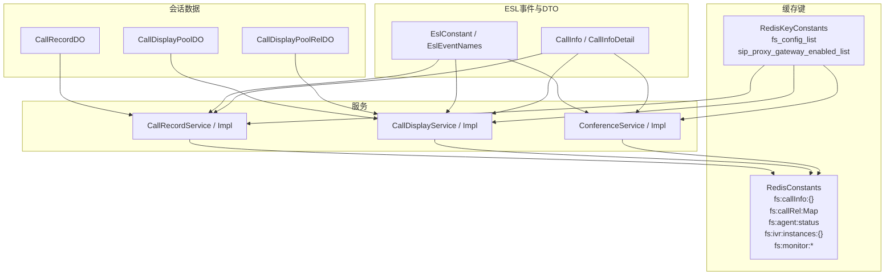
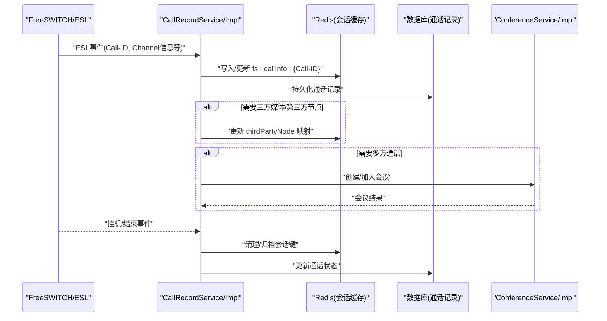
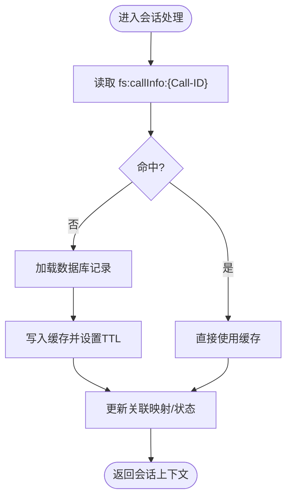
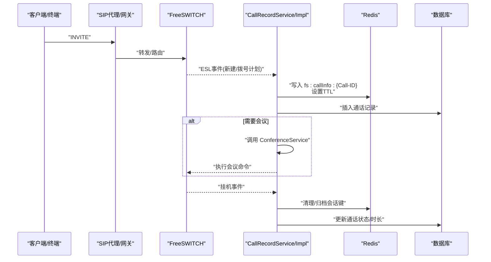
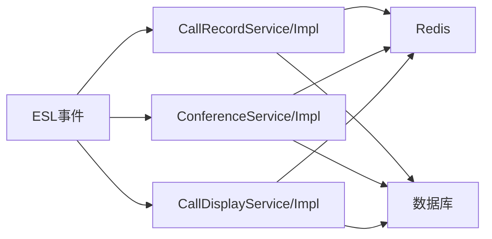

# 会话管理机制

<cite>
**本文引用的文件**
- [RedisConstants.java](file://yudao-cloud/yudao-module-cc/yudao-module-cc-server/src/main/java/cn/iocoder/yudao/module/cc/constant/RedisConstants.java)
- [RedisKeyConstants.java](file://yudao-cloud/yudao-module-cc/yudao-module-cc-server/src/main/java/cn/iocoder/yudao/module/cc/dal/redis/RedisKeyConstants.java)
- [CallRecordDO.java](file://yudao-cloud/yudao-module-cc/yudao-module-cc-server/src/main/java/cn/iocoder/yudao/module/cc/dal/dataobject/call/CallRecordDO.java)
- [CallDisplayPoolDO.java](file://yudao-cloud/yudao-module-cc/yudao-module-cc-server/src/main/java/cn/iocoder/yudao/module/cc/dal/dataobject/call/CallDisplayPoolDO.java)
- [CallDisplayPoolRelDO.java](file://yudao-cloud/yudao-module-cc/yudao-module-cc-server/src/main/java/cn/iocoder/yudao/module/cc/dal/dataobject/call/CallDisplayPoolRelDO.java)
- [CallDisplayService.java](file://yudao-cloud/yudao-module-cc/yudao-module-cc-server/src/main/java/cn/iocoder/yudao/module/cc/service/call/CallDisplayService.java)
- [CallDisplayServiceImpl.java](file://yudao-cloud/yudao-module-cc/yudao-module-cc-server/src/main/java/cn/iocoder/yudao/module/cc/service/call/CallDisplayServiceImpl.java)
- [CallRecordService.java](file://yudao-cloud/yudao-module-cc/yudao-module-cc-server/src/main/java/cn/iocoder/yudao/module/cc/service/call/CallRecordService.java)
- [CallRecordServiceImpl.java](file://yudao-cloud/yudao-module-cc/yudao-module-cc-server/src/main/java/cn/iocoder/yudao/module/cc/service/call/CallRecordServiceImpl.java)
- [ConferenceService.java](file://yudao-cloud/yudao-module-cc/yudao-module-cc-server/src/main/java/cn/iocoder/yudao/module/cc/service/call/ConferenceService.java)
- [ConferenceServiceImpl.java](file://yudao-cloud/yudao-module-cc/yudao-module-cc-server/src/main/java/cn/iocoder/yudao/module/cc/service/call/ConferenceServiceImpl.java)
- [FsConfigDO.java](file://yudao-cloud/yudao-module-cc/yudao-module-cc-server/src/main/java/cn/iocoder/yudao/module/cc/dal/dataobject/fs/FsConfigDO.java)
- [SipProxyGatewayDO.java](file://yudao-cloud/yudao-module-cc/yudao-module-cc-server/src/main/java/cn/iocoder/yudao/module/cc/dal/dataobject/sipproxy/SipProxyGatewayDO.java)
- [EslConstant.java](file://yudao-cloud/yudao-module-cc/yudao-module-cc-server/src/main/java/cn/iocoder/yudao/module/cc/esl/constant/EslConstant.java)
- [EslEventNames.java](file://yudao-cloud/yudao-module-cc/yudao-module-cc-server/src/main/java/cn/iocoder/yudao/module/cc/esl/constant/EslEventNames.java)
- [CallInfo.java](file://yudao-cloud/yudao-module-cc/yudao-module-cc-server/src/main/java/cn/iocoder/yudao/module/cc/esl/dto/CallInfo.java)
- [CallInfoDetail.java](file://yudao-cloud/yudao-module-cc/yudao-module-cc-server/src/main/java/cn/iocoder/yudao/module/cc/esl/dto/CallInfoDetail.java)
</cite>

## 目录
1. [引言](#引言)
2. [项目结构](#项目结构)
3. [核心组件](#核心组件)
4. [架构总览](#架构总览)
5. [详细组件分析](#详细组件分析)
6. [依赖关系分析](#依赖关系分析)
7. [性能考量](#性能考量)
8. [故障排查指南](#故障排查指南)
9. [结论](#结论)
10. [附录](#附录)

## 引言
本文件面向IPCC呼叫中心系统的“会话管理”能力，聚焦于SessionInfo数据模型设计、Redis存储与TTL策略、注册信息与用户会话映射、节点绑定管理、会话生命周期与异常恢复、分布式会话同步等主题。文档基于仓库中cc模块的常量定义、数据对象与服务接口进行梳理，给出可落地的数据库表结构与Redis Key设计规范，并提供关键流程的时序图与流程图辅助理解。

## 项目结构
- 会话相关的数据对象集中在 dal/dataobject/call 下，包括通话记录、显示池及关联关系等。
- Redis键常量集中在 constant/RedisConstants.java 与 dal/redis/RedisKeyConstants.java，用于统一缓存命名与过期策略。
- 服务层在 service/call 下提供通话、会议、显示池等业务能力；esl 子包提供FreeSWITCH事件与通道信息DTO。
- FS配置与SIP代理网关配置在 fs 与 sipproxy 数据对象中，配合RedisKeyConstants进行缓存。

图表来源
- [RedisConstants.java:1-82](file://yudao-cloud/yudao-module-cc/yudao-module-cc-server/src/main/java/cn/iocoder/yudao/module/cc/constant/RedisConstants.java#L1-L82)
- [RedisKeyConstants.java:1-31](file://yudao-cloud/yudao-module-cc/yudao-module-cc-server/src/main/java/cn/iocoder/yudao/module/cc/dal/redis/RedisKeyConstants.java#L1-L31)
- [CallRecordDO.java](file://yudao-cloud/yudao-module-cc/yudao-module-cc-server/src/main/java/cn/iocoder/yudao/module/cc/dal/dataobject/call/CallRecordDO.java)
- [CallDisplayPoolDO.java](file://yudao-cloud/yudao-module-cc/yudao-module-cc-server/src/main/java/cn/iocoder/yudao/module/cc/dal/dataobject/call/CallDisplayPoolDO.java)
- [CallDisplayPoolRelDO.java](file://yudao-cloud/yudao-module-cc/yudao-module-cc-server/src/main/java/cn/iocoder/yudao/module/cc/dal/dataobject/call/CallDisplayPoolRelDO.java)
- [CallRecordService.java](file://yudao-cloud/yudao-module-cc/yudao-module-cc-server/src/main/java/cn/iocoder/yudao/module/cc/service/call/CallRecordService.java)
- [CallRecordServiceImpl.java](file://yudao-cloud/yudao-module-cc/yudao-module-cc-server/src/main/java/cn/iocoder/yudao/module/cc/service/call/CallRecordServiceImpl.java)
- [CallDisplayService.java](file://yudao-cloud/yudao-module-cc/yudao-module-cc-server/src/main/java/cn/iocoder/yudao/module/cc/service/call/CallDisplayService.java)
- [CallDisplayServiceImpl.java](file://yudao-cloud/yudao-module-cc/yudao-module-cc-server/src/main/java/cn/iocoder/yudao/module/cc/service/call/CallDisplayServiceImpl.java)
- [ConferenceService.java](file://yudao-cloud/yudao-module-cc/yudao-module-cc-server/src/main/java/cn/iocoder/yudao/module/cc/service/call/ConferenceService.java)
- [ConferenceServiceImpl.java](file://yudao-cloud/yudao-module-cc/yudao-module-cc-server/src/main/java/cn/iocoder/yudao/module/cc/service/call/ConferenceServiceImpl.java)
- [EslConstant.java](file://yudao-cloud/yudao-module-cc/yudao-module-cc-server/src/main/java/cn/iocoder/yudao/module/cc/esl/constant/EslConstant.java)
- [EslEventNames.java](file://yudao-cloud/yudao-module-cc/yudao-module-cc-server/src/main/java/cn/iocoder/yudao/module/cc/esl/constant/EslEventNames.java)
- [CallInfo.java](file://yudao-cloud/yudao-module-cc/yudao-module-cc-server/src/main/java/cn/iocoder/yudao/module/cc/esl/dto/CallInfo.java)
- [CallInfoDetail.java](file://yudao-cloud/yudao-module-cc/yudao-module-cc-server/src/main/java/cn/iocoder/yudao/module/cc/esl/dto/CallInfoDetail.java)

章节来源
- [RedisConstants.java:1-82](file://yudao-cloud/yudao-module-cc/yudao-module-cc-server/src/main/java/cn/iocoder/yudao/module/cc/constant/RedisConstants.java#L1-L82)
- [RedisKeyConstants.java:1-31](file://yudao-cloud/yudao-module-cc/yudao-module-cc-server/src/main/java/cn/iocoder/yudao/module/cc/dal/redis/RedisKeyConstants.java#L1-L31)

## 核心组件
- 会话数据模型（SessionInfo）：以Call-ID、sessionId、freeSwitchNode、thirdPartyNode为核心标识，分别代表呼叫唯一ID、系统内部会话ID、FreeSWITCH节点、第三方媒体/信令节点。该模型贯穿通话建立、路由、桥接、会议与挂断全生命周期。
- 会话状态与映射：通过Redis维护“坐席当前状态”“IVR实例”“通话记录”“通话腿关联”等映射，支撑多节点协同与会话路由。
- 节点绑定管理：结合FS配置与SIP代理网关启用列表缓存，实现会话到具体FS节点或SIP网关的绑定与切换。
- 会话生命周期：从接入、路由、桥接到会议、挂机，各阶段通过ESL事件驱动更新Redis与持久化记录。
- 异常恢复与分布式同步：利用锁与状态键（如fs:monitor:*）保障监听与状态一致性，结合TTL与刷新时间实现自愈与容错。

章节来源
- [RedisConstants.java:1-82](file://yudao-cloud/yudao-module-cc/yudao-module-cc-server/src/main/java/cn/iocoder/yudao/module/cc/constant/RedisConstants.java#L1-L82)
- [CallRecordDO.java](file://yudao-cloud/yudao-module-cc/yudao-module-cc-server/src/main/java/cn/iocoder/yudao/module/cc/dal/dataobject/call/CallRecordDO.java)
- [CallInfo.java](file://yudao-cloud/yudao-module-cc/yudao-module-cc-server/src/main/java/cn/iocoder/yudao/module/cc/esl/dto/CallInfo.java)
- [CallInfoDetail.java](file://yudao-cloud/yudao-module-cc/yudao-module-cc-server/src/main/java/cn/iocoder/yudao/module/cc/esl/dto/CallInfoDetail.java)

## 架构总览
下图展示会话管理在ESL事件驱动下的整体交互：ESL事件携带Call-ID等信息，服务层据此读写Redis缓存并更新数据库记录，必要时触发会议或路由动作。

图表来源
- [EslEventNames.java](file://yudao-cloud/yudao-module-cc/yudao-module-cc-server/src/main/java/cn/iocoder/yudao/module/cc/esl/constant/EslEventNames.java)
- [CallRecordService.java](file://yudao-cloud/yudao-module-cc/yudao-module-cc-server/src/main/java/cn/iocoder/yudao/module/cc/service/call/CallRecordService.java)
- [CallRecordServiceImpl.java](file://yudao-cloud/yudao-module-cc/yudao-module-cc-server/src/main/java/cn/iocoder/yudao/module/cc/service/call/CallRecordServiceImpl.java)
- [ConferenceService.java](file://yudao-cloud/yudao-module-cc/yudao-module-cc-server/src/main/java/cn/iocoder/yudao/module/cc/service/call/ConferenceService.java)
- [ConferenceServiceImpl.java](file://yudao-cloud/yudao-module-cc/yudao-module-cc-server/src/main/java/cn/iocoder/yudao/module/cc/service/call/ConferenceServiceImpl.java)
- [RedisConstants.java:1-82](file://yudao-cloud/yudao-module-cc/yudao-module-cc-server/src/main/java/cn/iocoder/yudao/module/cc/constant/RedisConstants.java#L1-L82)

## 详细组件分析

### SessionInfo数据模型设计
- Call-ID：来自FreeSWITCH的唯一呼叫标识，作为跨节点、跨服务的会话主键，用于关联所有通话腿与事件。
- sessionId：系统内部会话ID，便于业务层对一次完整通话进行聚合与统计。
- freeSwitchNode：当前会话所在的FreeSWITCH节点标识，用于路由、监控与故障转移。
- thirdPartyNode：第三方媒体/信令节点标识，用于三方通话、录音、转码等场景的媒体面定位。
- 其他字段：包含主被叫号码、方向、状态、时间戳等，支撑查询与报表。

建议的数据库表结构（示例）
- 表名：call_record
  - 字段：id(PK), call_id(UK), session_id, free_switch_node, third_party_node, caller, callee, direction, status, start_time, answer_time, end_time, duration, extra_json
- 索引：call_id、session_id、start_time、status

章节来源
- [CallRecordDO.java](file://yudao-cloud/yudao-module-cc/yudao-module-cc-server/src/main/java/cn/iocoder/yudao/module/cc/dal/dataobject/call/CallRecordDO.java)
- [CallInfo.java](file://yudao-cloud/yudao-module-cc/yudao-module-cc-server/src/main/java/cn/iocoder/yudao/module/cc/esl/dto/CallInfo.java)
- [CallInfoDetail.java](file://yudao-cloud/yudao-module-cc/yudao-module-cc-server/src/main/java/cn/iocoder/yudao/module/cc/esl/dto/CallInfoDetail.java)

### Redis存储策略与TTL管理
- 通话记录缓存：fs:callInfo:{Call-ID}，用于快速读取当前会话上下文。
- 通话腿关联：fs:callRel:Map，维护同一Call-ID下的多条通道/腿关系。
- 坐席状态：fs:agent:status，维护坐席在线/忙碌等状态，供路由与排队使用。
- IVR实例：fs:ivr:instances:{}，维护IVR流程运行态。
- 监控锁与状态：fs:monitor:lock:{}、fs:monitor:status:{}，用于分布式监听与状态同步。
- TTL与刷新：默认缓存有效期720分钟，刷新时间120分钟；监控锁过期60秒，状态更新间隔20秒。

图表来源
- [RedisConstants.java:1-82](file://yudao-cloud/yudao-module-cc/yudao-module-cc-server/src/main/java/cn/iocoder/yudao/module/cc/constant/RedisConstants.java#L1-L82)

章节来源
- [RedisConstants.java:1-82](file://yudao-cloud/yudao-module-cc/yudao-module-cc-server/src/main/java/cn/iocoder/yudao/module/cc/constant/RedisConstants.java#L1-L82)

### 注册信息管理、用户会话映射与节点绑定
- 注册信息：通过FS配置列表缓存（fs_config_list:online）与SIP代理网关启用列表缓存（sip_proxy_gateway_enabled_list）维护可用节点与网关。
- 用户会话映射：基于Call-ID与sessionId，将用户侧会话与后端会话绑定，并通过fs:callRel:Map维护多端/多腿关系。
- 节点绑定：根据路由策略与负载情况，选择freeSwitchNode/thirdPartyNode，并在会话上下文中持久化与缓存。

章节来源
- [RedisKeyConstants.java:1-31](file://yudao-cloud/yudao-module-cc/yudao-module-cc-server/src/main/java/cn/iocoder/yudao/module/cc/dal/redis/RedisKeyConstants.java#L1-L31)
- [FsConfigDO.java](file://yudao-cloud/yudao-module-cc/yudao-module-cc-server/src/main/java/cn/iocoder/yudao/module/cc/dal/dataobject/fs/FsConfigDO.java)
- [SipProxyGatewayDO.java](file://yudao-cloud/yudao-module-cc/yudao-module-cc-server/src/main/java/cn/iocoder/yudao/module/cc/dal/dataobject/sipproxy/SipProxyGatewayDO.java)

### 会话生命周期管理与异常恢复
- 生命周期：接入→路由→桥接→会议→挂机，每个阶段由ESL事件驱动，更新Redis与数据库。
- 异常恢复：利用fs:monitor:lock:{}与fs:monitor:status:{}实现分布式锁与状态同步，避免重复监听与状态不一致；TTL保证异常后自动释放资源。
- 会话同步：通过fs:callRel:Map与fs:ivr:instances:{}在多节点间共享会话元数据，确保跨节点操作一致。

图表来源
- [CallRecordService.java](file://yudao-cloud/yudao-module-cc/yudao-module-cc-server/src/main/java/cn/iocoder/yudao/module/cc/service/call/CallRecordService.java)
- [CallRecordServiceImpl.java](file://yudao-cloud/yudao-module-cc/yudao-module-cc-server/src/main/java/cn/iocoder/yudao/module/cc/service/call/CallRecordServiceImpl.java)
- [ConferenceService.java](file://yudao-cloud/yudao-module-cc/yudao-module-cc-server/src/main/java/cn/iocoder/yudao/module/cc/service/call/ConferenceService.java)
- [ConferenceServiceImpl.java](file://yudao-cloud/yudao-module-cc/yudao-module-cc-server/src/main/java/cn/iocoder/yudao/module/cc/service/call/ConferenceServiceImpl.java)
- [RedisConstants.java:1-82](file://yudao-cloud/yudao-module-cc/yudao-module-cc-server/src/main/java/cn/iocoder/yudao/module/cc/constant/RedisConstants.java#L1-L82)

章节来源
- [RedisConstants.java:1-82](file://yudao-cloud/yudao-module-cc/yudao-module-cc-server/src/main/java/cn/iocoder/yudao/module/cc/constant/RedisConstants.java#L1-L82)

### 显示池与会话分配（补充）
- 显示池：CallDisplayPoolDO与CallDisplayPoolRelDO用于来电显示与队列分配，配合fs:display:pool:polling:键进行轮询与抢占。
- 服务：CallDisplayService/Impl负责池内资源的获取、释放与状态同步。

章节来源
- [CallDisplayPoolDO.java](file://yudao-cloud/yudao-module-cc/yudao-module-cc-server/src/main/java/cn/iocoder/yudao/module/cc/dal/dataobject/call/CallDisplayPoolDO.java)
- [CallDisplayPoolRelDO.java](file://yudao-cloud/yudao-module-cc/yudao-module-cc-server/src/main/java/cn/iocoder/yudao/module/cc/dal/dataobject/call/CallDisplayPoolRelDO.java)
- [CallDisplayService.java](file://yudao-cloud/yudao-module-cc/yudao-module-cc-server/src/main/java/cn/iocoder/yudao/module/cc/service/call/CallDisplayService.java)
- [CallDisplayServiceImpl.java](file://yudao-cloud/yudao-module-cc/yudao-module-cc-server/src/main/java/cn/iocoder/yudao/module/cc/service/call/CallDisplayServiceImpl.java)
- [RedisConstants.java:1-82](file://yudao-cloud/yudao-module-cc/yudao-module-cc-server/src/main/java/cn/iocoder/yudao/module/cc/constant/RedisConstants.java#L1-L82)

## 依赖关系分析
- 服务层依赖：CallRecordService/Impl、ConferenceService/Impl、CallDisplayService/Impl共同消费ESL事件与Redis键。
- 数据层依赖：CallRecordDO、CallDisplayPoolDO、CallDisplayPoolRelDO为持久化实体；FsConfigDO、SipProxyGatewayDO为节点与网关配置实体。
- 外部依赖：FreeSWITCH通过ESL推送事件；Redis作为分布式缓存与协调器。

图表来源
- [CallRecordService.java](file://yudao-cloud/yudao-module-cc/yudao-module-cc-server/src/main/java/cn/iocoder/yudao/module/cc/service/call/CallRecordService.java)
- [CallRecordServiceImpl.java](file://yudao-cloud/yudao-module-cc/yudao-module-cc-server/src/main/java/cn/iocoder/yudao/module/cc/service/call/CallRecordServiceImpl.java)
- [ConferenceService.java](file://yudao-cloud/yudao-module-cc/yudao-module-cc-server/src/main/java/cn/iocoder/yudao/module/cc/service/call/ConferenceService.java)
- [ConferenceServiceImpl.java](file://yudao-cloud/yudao-module-cc/yudao-module-cc-server/src/main/java/cn/iocoder/yudao/module/cc/service/call/ConferenceServiceImpl.java)
- [CallDisplayService.java](file://yudao-cloud/yudao-module-cc/yudao-module-cc-server/src/main/java/cn/iocoder/yudao/module/cc/service/call/CallDisplayService.java)
- [CallDisplayServiceImpl.java](file://yudao-cloud/yudao-module-cc/yudao-module-cc-server/src/main/java/cn/iocoder/yudao/module/cc/service/call/CallDisplayServiceImpl.java)

章节来源
- [CallRecordService.java](file://yudao-cloud/yudao-module-cc/yudao-module-cc-server/src/main/java/cn/iocoder/yudao/module/cc/service/call/CallRecordService.java)
- [CallRecordServiceImpl.java](file://yudao-cloud/yudao-module-cc/yudao-module-cc-server/src/main/java/cn/iocoder/yudao/module/cc/service/call/CallRecordServiceImpl.java)
- [ConferenceService.java](file://yudao-cloud/yudao-module-cc/yudao-module-cc-server/src/main/java/cn/iocoder/yudao/module/cc/service/call/ConferenceService.java)
- [ConferenceServiceImpl.java](file://yudao-cloud/yudao-module-cc/yudao-module-cc-server/src/main/java/cn/iocoder/yudao/module/cc/service/call/ConferenceServiceImpl.java)
- [CallDisplayService.java](file://yudao-cloud/yudao-module-cc/yudao-module-cc-server/src/main/java/cn/iocoder/yudao/module/cc/service/call/CallDisplayService.java)
- [CallDisplayServiceImpl.java](file://yudao-cloud/yudao-module-cc/yudao-module-cc-server/src/main/java/cn/iocoder/yudao/module/cc/service/call/CallDisplayServiceImpl.java)

## 性能考量
- 缓存命中率：合理设置TTL与刷新时间，减少数据库压力；热点会话优先走缓存。
- 并发控制：使用fs:monitor:lock:{}避免重复监听与竞态；监控状态键降低广播风暴。
- 批量操作：IVR实例与通话腿关联采用Hash/Map结构，提升批量读写效率。
- 连接池与超时：FreeSWITCH与Redis连接需配置合理的超时与重试策略，避免雪崩。

[本节为通用性能指导，不直接分析具体文件]

## 故障排查指南
- 会话丢失：检查fs:callInfo:{Call-ID}是否存在且未过期；核对数据库通话记录是否完整。
- 节点不可用：查看fs:monitor:status:{}与fs:monitor:lock:{}状态，确认监听是否正常；检查FS配置列表缓存。
- 路由错误：核对fs:callRel:Map中的腿关系是否正确；验证SIP代理网关启用列表缓存。
- 监控异常：确认锁过期时间与状态更新间隔配置是否合理，避免死锁或频繁重建。

章节来源
- [RedisConstants.java:1-82](file://yudao-cloud/yudao-module-cc/yudao-module-cc-server/src/main/java/cn/iocoder/yudao/module/cc/constant/RedisConstants.java#L1-L82)
- [RedisKeyConstants.java:1-31](file://yudao-cloud/yudao-module-cc/yudao-module-cc-server/src/main/java/cn/iocoder/yudao/module/cc/dal/redis/RedisKeyConstants.java#L1-L31)

## 结论
本方案以Call-ID为核心，结合sessionId、freeSwitchNode、thirdPartyNode构建统一的会话模型，通过Redis实现高性能的会话状态与映射管理，并以ESL事件驱动完成会话生命周期管理。借助分布式锁与TTL机制，系统在异常情况下具备自愈能力。配套的数据库表结构与Redis Key规范为落地实施提供了清晰指引。

## 附录

### 数据库表结构（建议）
- 表：call_record
  - 字段：id(PK), call_id(UK), session_id, free_switch_node, third_party_node, caller, callee, direction, status, start_time, answer_time, end_time, duration, extra_json
  - 索引：call_id, session_id, start_time, status

[本节为概念性设计，不直接引用具体文件]

### Redis Key设计规范
- 会话上下文：fs:callInfo:{Call-ID}
- 通话腿关联：fs:callRel:Map
- 坐席状态：fs:agent:status
- IVR实例：fs:ivr:instances:{Call-ID}
- 监控锁：fs:monitor:lock:{group}
- 监控状态：fs:monitor:status:{group}
- 显示池轮询：fs:display:pool:polling:{poolId}
- FS配置列表：fs_config_list:online
- SIP代理网关启用列表：sip_proxy_gateway_enabled_list

章节来源
- [RedisConstants.java:1-82](file://yudao-cloud/yudao-module-cc/yudao-module-cc-server/src/main/java/cn/iocoder/yudao/module/cc/constant/RedisConstants.java#L1-L82)
- [RedisKeyConstants.java:1-31](file://yudao-cloud/yudao-module-cc/yudao-module-cc-server/src/main/java/cn/iocoder/yudao/module/cc/dal/redis/RedisKeyConstants.java#L1-L31)