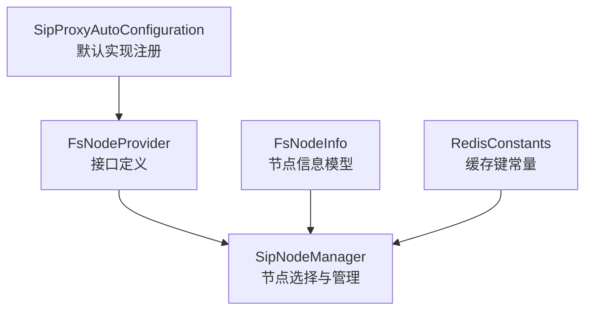
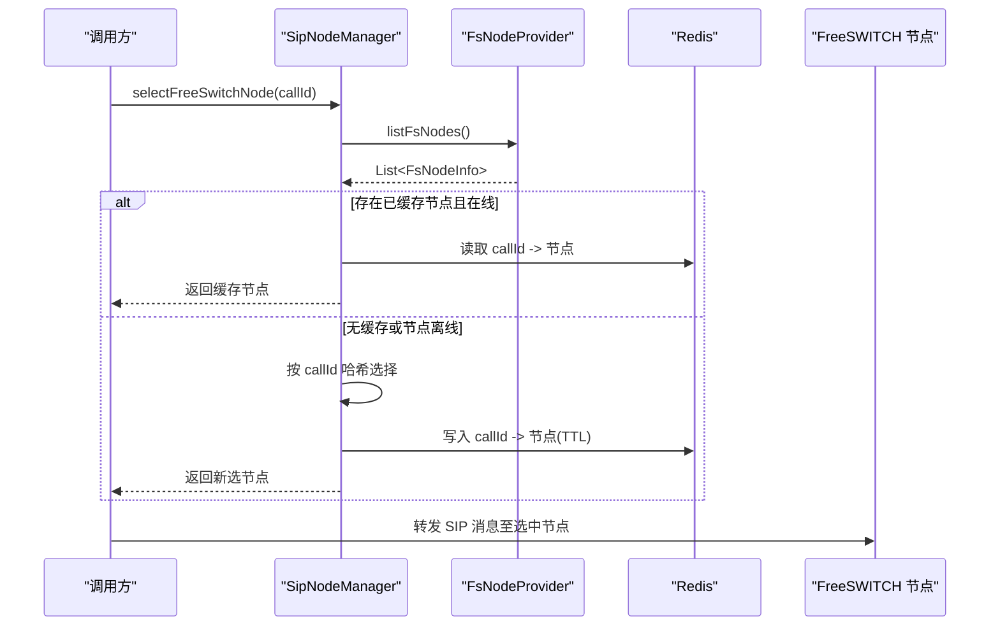
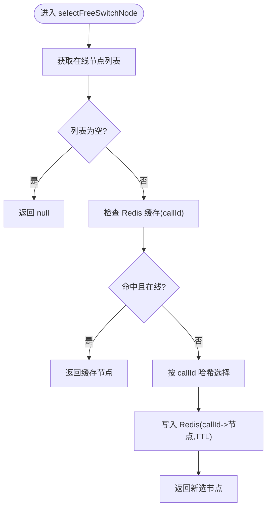
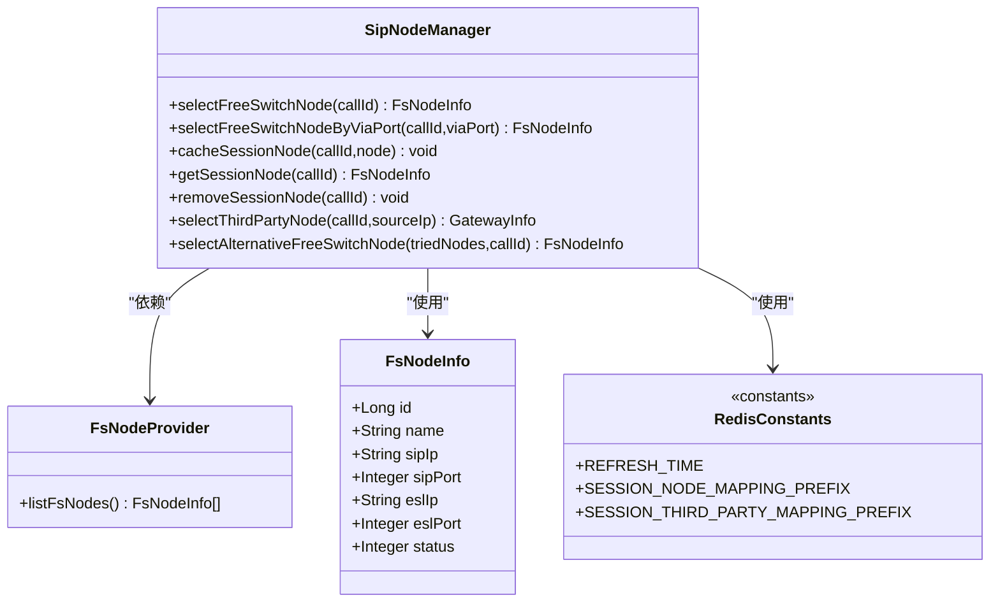

# FreeSWITCH节点提供者接口

<cite>
**本文引用的文件**
- [FsNodeProvider.java](file://yudao-cloud/yudao-module-cc/ipcc-sipproxy/src/main/java/cn/ipcc/sipproxy/api/fs/FsNodeProvider.java)
- [FsNodeInfo.java](file://yudao-cloud/yudao-module-cc/ipcc-sipproxy/src/main/java/cn/ipcc/sipproxy/support/model/FsNodeInfo.java)
- [SipNodeManager.java](file://yudao-cloud/yudao-module-cc/ipcc-sipproxy/src/main/java/cn/ipcc/sipproxy/core/node/SipNodeManager.java)
- [RedisConstants.java](file://yudao-cloud/yudao-module-cc/ipcc-sipproxy/src/main/java/cn/ipcc/sipproxy/support/RedisConstants.java)
- [SipProxyAutoConfiguration.java](file://yudao-cloud/yudao-module-cc/ipcc-sipproxy/src/main/java/cn/ipcc/sipproxy/autoconfigure/SipProxyAutoConfiguration.java)
</cite>

## 目录
1. [简介](#简介)
2. [项目结构](#项目结构)
3. [核心组件](#核心组件)
4. [架构总览](#架构总览)
5. [详细组件分析](#详细组件分析)
6. [依赖关系分析](#依赖关系分析)
7. [性能考虑](#性能考虑)
8. [故障排查指南](#故障排查指南)
9. [结论](#结论)
10. [附录](#附录)

## 简介
本文件面向在 SIP 代理（sipproxy）中接入 FreeSWITCH 集群的开发者，系统化说明 FsNodeProvider 接口的设计目标、职责边界与使用方式。该接口用于向 sipproxy 提供“在线 FreeSWITCH 节点”列表，使 sipproxy 在不直接连接 FreeSWITCH、不依赖父程序 ORM 的前提下，完成信令转发目标的发现与选择。结合 SipNodeManager 的会话绑定、Via 端口匹配、哈希选择与故障转移等策略，可实现高可用的多 FS 实例路由。

## 项目结构
围绕 FsNodeProvider 的关键代码分布在以下位置：
- 扩展点定义：api/fs/FsNodeProvider.java
- 数据模型：support/model/FsNodeInfo.java
- 节点选择与管理：core/node/SipNodeManager.java
- Redis 键常量：support/RedisConstants.java
- 自动装配与默认实现注册：autoconfigure/SipProxyAutoConfiguration.java

图表来源
- [FsNodeProvider.java:1-25](file://yudao-cloud/yudao-module-cc/ipcc-sipproxy/src/main/java/cn/ipcc/sipproxy/api/fs/FsNodeProvider.java#L1-L25)
- [SipNodeManager.java:1-334](file://yudao-cloud/yudao-module-cc/ipcc-sipproxy/src/main/java/cn/ipcc/sipproxy/core/node/SipNodeManager.java#L1-L334)
- [FsNodeInfo.java:1-34](file://yudao-cloud/yudao-module-cc/ipcc-sipproxy/src/main/java/cn/ipcc/sipproxy/support/model/FsNodeInfo.java#L1-L34)
- [RedisConstants.java:1-47](file://yudao-cloud/yudao-module-cc/ipcc-sipproxy/src/main/java/cn/ipcc/sipproxy/support/RedisConstants.java#L1-L47)
- [SipProxyAutoConfiguration.java:94-111](file://yudao-cloud/yudao-module-cc/ipcc-sipproxy/src/main/java/cn/ipcc/sipproxy/autoconfigure/SipProxyAutoConfiguration.java#L94-L111)

章节来源
- [FsNodeProvider.java:1-25](file://yudao-cloud/yudao-module-cc/ipcc-sipproxy/src/main/java/cn/ipcc/sipproxy/api/fs/FsNodeProvider.java#L1-L25)
- [SipNodeManager.java:1-334](file://yudao-cloud/yudao-module-cc/ipcc-sipproxy/src/main/java/cn/ipcc/sipproxy/core/node/SipNodeManager.java#L1-L334)
- [FsNodeInfo.java:1-34](file://yudao-cloud/yudao-module-cc/ipcc-sipproxy/src/main/java/cn/ipcc/sipproxy/support/model/FsNodeInfo.java#L1-L34)
- [RedisConstants.java:1-47](file://yudao-cloud/yudao-module-cc/ipcc-sipproxy/src/main/java/cn/ipcc/sipproxy/support/RedisConstants.java#L1-L47)
- [SipProxyAutoConfiguration.java:94-111](file://yudao-cloud/yudao-module-cc/ipcc-sipproxy/src/main/java/cn/ipcc/sipproxy/autoconfigure/SipProxyAutoConfiguration.java#L94-L111)

## 核心组件
- FsNodeProvider：扩展点接口，返回当前在线的 FreeSWITCH 节点列表。sipproxy 仅消费该列表进行路由，不直接连接 FS。
- FsNodeInfo：节点信息模型，包含节点 ID、名称、SIP/ESL 地址与端口、状态等字段。
- SipNodeManager：节点选择与管理器，负责：
  - 通过 FsNodeProvider 获取在线节点
  - 基于 Call-ID 哈希选择并缓存到 Redis
  - 按 Via 端口精确匹配回源 FS（解决多实例共用公网 IP 场景）
  - 故障转移与备用节点选择
  - 第三方网关节点的匹配与缓存
- RedisConstants：定义会话-节点映射等 Redis Key 前缀与 TTL 常量。
- SipProxyAutoConfiguration：以 @ConditionalOnMissingBean 方式注册 FsNodeProvider 的默认实现；父工程可通过提供同名 Bean 覆盖。

章节来源
- [FsNodeProvider.java:1-25](file://yudao-cloud/yudao-module-cc/ipcc-sipproxy/src/main/java/cn/ipcc/sipproxy/api/fs/FsNodeProvider.java#L1-L25)
- [FsNodeInfo.java:1-34](file://yudao-cloud/yudao-module-cc/ipcc-sipproxy/src/main/java/cn/ipcc/sipproxy/support/model/FsNodeInfo.java#L1-L34)
- [SipNodeManager.java:154-332](file://yudao-cloud/yudao-module-cc/ipcc-sipproxy/src/main/java/cn/ipcc/sipproxy/core/node/SipNodeManager.java#L154-L332)
- [RedisConstants.java:16-42](file://yudao-cloud/yudao-module-cc/ipcc-sipproxy/src/main/java/cn/ipcc/sipproxy/support/RedisConstants.java#L16-L42)
- [SipProxyAutoConfiguration.java:94-111](file://yudao-cloud/yudao-module-cc/ipcc-sipproxy/src/main/java/cn/ipcc/sipproxy/autoconfigure/SipProxyAutoConfiguration.java#L94-L111)

## 架构总览
FsNodeProvider 作为“节点发现”的唯一入口，被 SipNodeManager 在每次需要选择目标 FS 时调用。SipNodeManager 将选定的节点与会话绑定并持久化到 Redis，确保后续响应能正确回送到同一 FS。对于多 FS 实例共享公网 IP 的场景，支持按 Via 端口精确匹配，避免响应发错实例。

图表来源
- [SipNodeManager.java:154-182](file://yudao-cloud/yudao-module-cc/ipcc-sipproxy/src/main/java/cn/ipcc/sipproxy/core/node/SipNodeManager.java#L154-L182)
- [SipNodeManager.java:50-89](file://yudao-cloud/yudao-module-cc/ipcc-sipproxy/src/main/java/cn/ipcc/sipproxy/core/node/SipNodeManager.java#L50-L89)
- [RedisConstants.java:39-42](file://yudao-cloud/yudao-module-cc/ipcc-sipproxy/src/main/java/cn/ipcc/sipproxy/support/RedisConstants.java#L39-L42)

## 详细组件分析

### FsNodeProvider 接口规范
- 职责：返回当前在线的 FreeSWITCH 节点列表。空列表表示无可用的节点，由调用方按异常处理。
- 设计约束：sipproxy 不连接 FreeSWITCH，仅承担信令转发；ESL 交互由父程序通过拦截器实现。
- 关键方法：
  - listFsNodes(): 返回在线节点集合

章节来源
- [FsNodeProvider.java:1-25](file://yudao-cloud/yudao-module-cc/ipcc-sipproxy/src/main/java/cn/ipcc/sipproxy/api/fs/FsNodeProvider.java#L1-L25)

### FsNodeInfo 数据模型
- 字段说明：
  - id：节点主键（透传）
  - name：节点名称（日志展示）
  - sipIp/sipPort：SIP 信令地址与端口（转发目标）
  - eslIp/eslPort：ESL 地址与端口（供父程序拦截器使用）
  - status：启用状态（仅选用启用的节点）

章节来源
- [FsNodeInfo.java:1-34](file://yudao-cloud/yudao-module-cc/ipcc-sipproxy/src/main/java/cn/ipcc/sipproxy/support/model/FsNodeInfo.java#L1-L34)

### SipNodeManager 节点选择与管理
- 功能要点：
  - 通过 FsNodeProvider 获取在线节点
  - 基于 Call-ID 哈希选择并缓存到 Redis（TTL 由常量定义）
  - 支持按 Via 端口精确匹配回源 FS，避免响应发错实例
  - 支持故障转移与备用节点选择
  - 对第三方网关节点进行来源 IP 匹配与缓存
- 关键方法：
  - selectFreeSwitchNode(callId)：哈希选择 + 缓存
  - selectFreeSwitchNodeByViaPort(callId, viaPort)：优先 Via 端口匹配，失败再哈希
  - cacheSessionNode/removeSessionNode/getSessionNode：会话-节点映射缓存
  - selectThirdPartyNode(callId, sourceIp)：第三方网关匹配
  - selectAlternativeFreeSwitchNode(triedNodes, callId)：故障转移

图表来源
- [SipNodeManager.java:154-182](file://yudao-cloud/yudao-module-cc/ipcc-sipproxy/src/main/java/cn/ipcc/sipproxy/core/node/SipNodeManager.java#L154-L182)
- [SipNodeManager.java:50-89](file://yudao-cloud/yudao-module-cc/ipcc-sipproxy/src/main/java/cn/ipcc/sipproxy/core/node/SipNodeManager.java#L50-L89)
- [RedisConstants.java:16-17](file://yudao-cloud/yudao-module-cc/ipcc-sipproxy/src/main/java/cn/ipcc/sipproxy/support/RedisConstants.java#L16-L17)

章节来源
- [SipNodeManager.java:154-332](file://yudao-cloud/yudao-module-cc/ipcc-sipproxy/src/main/java/cn/ipcc/sipproxy/core/node/SipNodeManager.java#L154-L332)
- [RedisConstants.java:16-42](file://yudao-cloud/yudao-module-cc/ipcc-sipproxy/src/main/java/cn/ipcc/sipproxy/support/RedisConstants.java#L16-L42)

### 自动装配与默认实现
- 自动配置类会在容器中不存在 FsNodeProvider Bean 时注册默认实现；父工程只需提供一个 FsNodeProvider 的实现并注册为 Bean，即可无缝覆盖默认行为。
- 默认实现会尝试从 H2 seed 表查询启用节点；未配置数据源时返回空列表，保证服务可启动但呼叫能力受限。

章节来源
- [SipProxyAutoConfiguration.java:94-111](file://yudao-cloud/yudao-module-cc/ipcc-sipproxy/src/main/java/cn/ipcc/sipproxy/autoconfigure/SipProxyAutoConfiguration.java#L94-L111)

## 依赖关系分析
- SipNodeManager 依赖 FsNodeProvider 获取节点列表，依赖 Redis 进行会话-节点映射缓存。
- FsNodeInfo 作为数据载体贯穿 Provider 与 Manager。
- RedisConstants 提供统一的 Key 命名空间与 TTL 策略。
- 自动配置类管理默认实现的注册与覆盖机制。

图表来源
- [FsNodeProvider.java:1-25](file://yudao-cloud/yudao-module-cc/ipcc-sipproxy/src/main/java/cn/ipcc/sipproxy/api/fs/FsNodeProvider.java#L1-L25)
- [FsNodeInfo.java:1-34](file://yudao-cloud/yudao-module-cc/ipcc-sipproxy/src/main/java/cn/ipcc/sipproxy/support/model/FsNodeInfo.java#L1-L34)
- [SipNodeManager.java:1-334](file://yudao-cloud/yudao-module-cc/ipcc-sipproxy/src/main/java/cn/ipcc/sipproxy/core/node/SipNodeManager.java#L1-L334)
- [RedisConstants.java:1-47](file://yudao-cloud/yudao-module-cc/ipcc-sipproxy/src/main/java/cn/ipcc/sipproxy/support/RedisConstants.java#L1-L47)

章节来源
- [SipNodeManager.java:1-334](file://yudao-cloud/yudao-module-cc/ipcc-sipproxy/src/main/java/cn/ipcc/sipproxy/core/node/SipNodeManager.java#L1-L334)
- [FsNodeProvider.java:1-25](file://yudao-cloud/yudao-module-cc/ipcc-sipproxy/src/main/java/cn/ipcc/sipproxy/api/fs/FsNodeProvider.java#L1-L25)
- [FsNodeInfo.java:1-34](file://yudao-cloud/yudao-module-cc/ipcc-sipproxy/src/main/java/cn/ipcc/sipproxy/support/model/FsNodeInfo.java#L1-L34)
- [RedisConstants.java:1-47](file://yudao-cloud/yudao-module-cc/ipcc-sipproxy/src/main/java/cn/ipcc/sipproxy/support/RedisConstants.java#L1-L47)

## 性能考虑
- 节点列表获取：FsNodeProvider 应尽可能高效地返回在线节点，建议结合本地缓存或轻量级查询，避免频繁访问数据库。
- 会话-节点映射：使用 Redis 缓存，TTL 较短（默认 120 秒），降低内存占用并保证一定时效性。
- 哈希选择：基于 Call-ID 的哈希选择具有确定性，有利于会话内一致性；在高并发下减少锁竞争。
- Via 端口匹配：在多 FS 共享公网 IP 场景下，优先按 Via 端口匹配，避免错误路由导致的呼叫失败。
- 故障转移：当首选节点不可用时，快速切换到备用节点，提升可用性。

[本节为通用性能建议，不直接分析具体文件]

## 故障排查指南
- 没有可用节点：
  - 现象：selectFreeSwitchNode 返回 null 并记录错误日志
  - 排查：确认 FsNodeProvider.listFsNodes() 是否返回空列表；检查节点状态与上线逻辑
- 会话绑定失效：
  - 现象：响应无法回送到正确的 FS
  - 排查：检查 Redis 中 callId 对应的节点映射是否存在且未过期；确认 isNodeOnline 判断逻辑
- Via 端口匹配失败：
  - 现象：多 FS 实例共用公网 IP 时响应发错实例
  - 排查：确认 FsNodeInfo.sipPort 与 Via 头端口一致；必要时调整监听端口配置
- 第三方网关匹配失败：
  - 现象：selectThirdPartyNode 返回 null
  - 排查：确认来源 IP 与网关节点 address 是否完全匹配；检查网关列表是否为空

章节来源
- [SipNodeManager.java:154-182](file://yudao-cloud/yudao-module-cc/ipcc-sipproxy/src/main/java/cn/ipcc/sipproxy/core/node/SipNodeManager.java#L154-L182)
- [SipNodeManager.java:201-228](file://yudao-cloud/yudao-module-cc/ipcc-sipproxy/src/main/java/cn/ipcc/sipproxy/core/node/SipNodeManager.java#L201-L228)
- [SipNodeManager.java:260-296](file://yudao-cloud/yudao-module-cc/ipcc-sipproxy/src/main/java/cn/ipcc/sipproxy/core/node/SipNodeManager.java#L260-L296)
- [RedisConstants.java:39-42](file://yudao-cloud/yudao-module-cc/ipcc-sipproxy/src/main/java/cn/ipcc/sipproxy/support/RedisConstants.java#L39-L42)

## 结论
FsNodeProvider 为 sipproxy 提供了松耦合的 FreeSWITCH 节点发现能力，配合 SipNodeManager 的会话绑定、Via 端口匹配、哈希选择与故障转移策略，能够在多 FS 实例环境下实现稳定、高效的信令转发。通过自动装配机制，父工程可以低成本替换默认实现，满足不同部署与运维需求。

[本节为总结性内容，不直接分析具体文件]

## 附录

### 接口与使用场景速查
- 接口：FsNodeProvider.listFsNodes()
- 使用场景：
  - 新增/下线 FS 节点后，更新 Provider 返回的在线列表
  - 多 FS 共享公网 IP 时，确保 sipPort 唯一并与 Via 端口一致
  - 第三方网关接入时，配合 selectThirdPartyNode 进行来源 IP 匹配

章节来源
- [FsNodeProvider.java:1-25](file://yudao-cloud/yudao-module-cc/ipcc-sipproxy/src/main/java/cn/ipcc/sipproxy/api/fs/FsNodeProvider.java#L1-L25)
- [SipNodeManager.java:260-296](file://yudao-cloud/yudao-module-cc/ipcc-sipproxy/src/main/java/cn/ipcc/sipproxy/core/node/SipNodeManager.java#L260-L296)

### 健康检查、故障转移与监控实现指南
- 健康检查：
  - 在 FsNodeProvider 中维护节点健康状态（如心跳、连通性探测），仅返回健康节点
  - 定期刷新节点列表，避免缓存陈旧
- 故障转移：
  - 利用 selectAlternativeFreeSwitchNode 在首次失败时切换备用节点
  - 结合 Redis 中的会话-节点映射，及时清理失效绑定
- 性能监控：
  - 记录节点选择耗时、命中率、失败次数等指标
  - 关注 Redis 命中率与 TTL 设置，避免频繁重建映射

[本节为通用实现指南，不直接分析具体文件]

### 扩展开发示例（步骤）
- 步骤一：实现 FsNodeProvider 接口，提供 listFsNodes() 的具体逻辑（例如从数据库或配置中心加载启用节点）
- 步骤二：将实现类注册为 Spring Bean（@Component 或 @Bean）
- 步骤三：验证自动装配覆盖生效（容器中存在自定义 FsNodeProvider 时，默认实现不会被注册）
- 步骤四：结合 SipNodeManager 的方法进行测试：
  - selectFreeSwitchNode：验证哈希选择与缓存
  - selectFreeSwitchNodeByViaPort：验证 Via 端口匹配
  - selectAlternativeFreeSwitchNode：验证故障转移

章节来源
- [SipProxyAutoConfiguration.java:94-111](file://yudao-cloud/yudao-module-cc/ipcc-sipproxy/src/main/java/cn/ipcc/sipproxy/autoconfigure/SipProxyAutoConfiguration.java#L94-L111)
- [SipNodeManager.java:154-332](file://yudao-cloud/yudao-module-cc/ipcc-sipproxy/src/main/java/cn/ipcc/sipproxy/core/node/SipNodeManager.java#L154-L332)