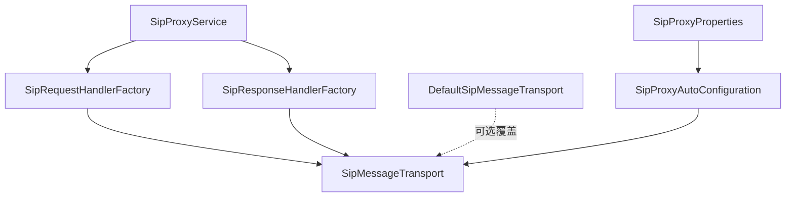
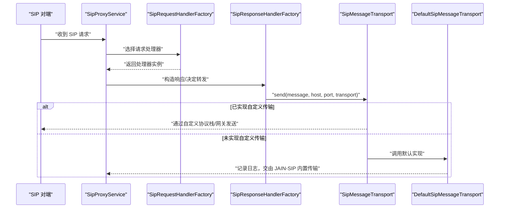
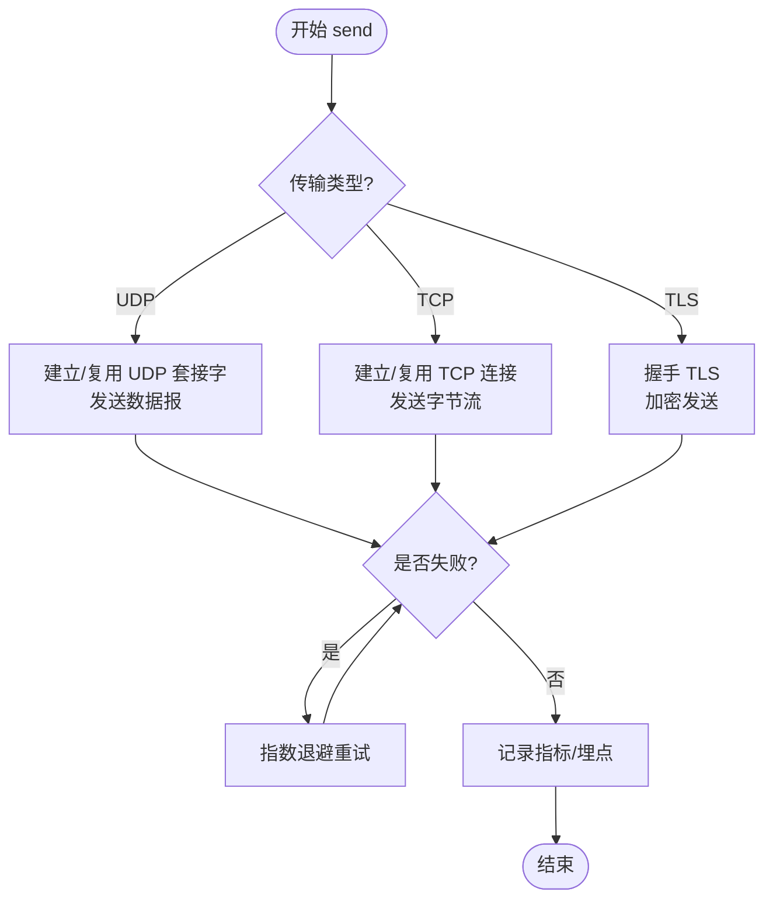
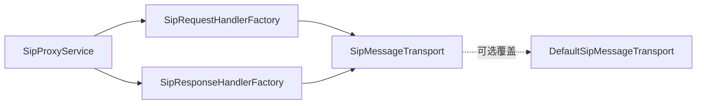

# 传输层接口

<cite>
**本文引用的文件**
- [SipMessageTransport.java](file://yudao-cloud/yudao-module-cc/ipcc-sipproxy/src/main/java/cn/ipcc/sipproxy/api/transport/SipMessageTransport.java)
- [DefaultSipMessageTransport.java](file://yudao-cloud/yudao-module-cc/ipcc-sipproxy/src/main/java/cn/ipcc/sipproxy/defaults/transport/DefaultSipMessageTransport.java)
- [SipProxyAutoConfiguration.java](file://yudao-cloud/yudao-module-cc/ipcc-sipproxy/src/main/java/cn/ipcc/sipproxy/autoconfigure/SipProxyAutoConfiguration.java)
- [SipProxyProperties.java](file://yudao-cloud/yudao-module-cc/ipcc-sipproxy/src/main/java/cn/ipcc/sipproxy/autoconfigure/SipProxyProperties.java)
- [SipRequestHandlerFactory.java](file://yudao-cloud/yudao-module-cc/ipcc-sipproxy/src/main/java/cn/ipcc/sipproxy/core/handler/request/sip/SipRequestHandlerFactory.java)
- [SipResponseHandlerFactory.java](file://yudao-cloud/yudao-module-cc/ipcc-sipproxy/src/main/java/cn/ipcc/sipproxy/core/handler/response/SipResponseHandlerFactory.java)
- [SipProxyService.java](file://yudao-cloud/yudao-module-cc/ipcc-sipproxy/src/main/java/cn/ipcc/sipproxy/core/SipProxyService.java)
</cite>

## 目录
1. [简介](#简介)
2. [项目结构](#项目结构)
3. [核心组件](#核心组件)
4. [架构总览](#架构总览)
5. [详细组件分析](#详细组件分析)
6. [依赖关系分析](#依赖关系分析)
7. [性能考虑](#性能考虑)
8. [故障排查指南](#故障排查指南)
9. [结论](#结论)
10. [附录](#附录)

## 简介
本章节面向 SIP 代理模块中的“传输层接口”，围绕 SipMessageTransport 抽象设计、默认实现与扩展方式展开，说明其在 SIP 消息发送流程中的核心作用。该接口将上层业务逻辑与底层网络传输解耦，允许以统一方式发送 SIP 请求/响应，并支持 UDP/TCP/TLS 等传输协议。通过实现该接口，可将消息路由到自定义协议栈或父系统的统一信令网关；若未提供实现，则回退为 JAIN-SIP 内置的 UDP/TCP 传输。

## 项目结构
SIP 代理模块采用分层与可扩展设计：
- API 层定义传输抽象（SipMessageTransport）
- 默认实现提供空实现（DefaultSipMessageTransport），用于不接管传输时的兜底
- 自动装配与配置（autoconfigure）负责注入传输 Bean 与属性
- 核心处理链（core/handler）在构造响应或转发请求时调用传输层进行发送
- 服务入口（core/SipProxyService）协调会话、节点、处理器与传输

图表来源
- [SipProxyService.java](file://yudao-cloud/yudao-module-cc/ipcc-sipproxy/src/main/java/cn/ipcc/sipproxy/core/SipProxyService.java)
- [SipRequestHandlerFactory.java](file://yudao-cloud/yudao-module-cc/ipcc-sipproxy/src/main/java/cn/ipcc/sipproxy/core/handler/request/sip/SipRequestHandlerFactory.java)
- [SipResponseHandlerFactory.java](file://yudao-cloud/yudao-module-cc/ipcc-sipproxy/src/main/java/cn/ipcc/sipproxy/core/handler/response/SipResponseHandlerFactory.java)
- [SipMessageTransport.java](file://yudao-cloud/yudao-module-cc/ipcc-sipproxy/src/main/java/cn/ipcc/sipproxy/api/transport/SipMessageTransport.java)
- [DefaultSipMessageTransport.java](file://yudao-cloud/yudao-module-cc/ipcc-sipproxy/src/main/java/cn/ipcc/sipproxy/defaults/transport/DefaultSipMessageTransport.java)
- [SipProxyAutoConfiguration.java](file://yudao-cloud/yudao-module-cc/ipcc-sipproxy/src/main/java/cn/ipcc/sipproxy/autoconfigure/SipProxyAutoConfiguration.java)
- [SipProxyProperties.java](file://yudao-cloud/yudao-module-cc/ipcc-sipproxy/src/main/java/cn/ipcc/sipproxy/autoconfigure/SipProxyProperties.java)

章节来源
- [SipMessageTransport.java:1-25](file://yudao-cloud/yudao-module-cc/ipcc-sipproxy/src/main/java/cn/ipcc/sipproxy/api/transport/SipMessageTransport.java#L1-L25)
- [DefaultSipMessageTransport.java:1-28](file://yudao-cloud/yudao-module-cc/ipcc-sipproxy/src/main/java/cn/ipcc/sipproxy/defaults/transport/DefaultSipMessageTransport.java#L1-L28)
- [SipProxyAutoConfiguration.java](file://yudao-cloud/yudao-module-cc/ipcc-sipproxy/src/main/java/cn/ipcc/sipproxy/autoconfigure/SipProxyAutoConfiguration.java)
- [SipProxyProperties.java](file://yudao-cloud/yudao-module-cc/ipcc-sipproxy/src/main/java/cn/ipcc/sipproxy/autoconfigure/SipProxyProperties.java)
- [SipRequestHandlerFactory.java](file://yudao-cloud/yudao-module-cc/ipcc-sipproxy/src/main/java/cn/ipcc/sipproxy/core/handler/request/sip/SipRequestHandlerFactory.java)
- [SipResponseHandlerFactory.java](file://yudao-cloud/yudao-module-cc/ipcc-sipproxy/src/main/java/cn/ipcc/sipproxy/core/handler/response/SipResponseHandlerFactory.java)
- [SipProxyService.java](file://yudao-cloud/yudao-module-cc/ipcc-sipproxy/src/main/java/cn/ipcc/sipproxy/core/SipProxyService.java)

## 核心组件
- SipMessageTransport：定义统一的 SIP 消息发送能力，参数包含目标主机、端口与传输协议（udp/tcp/tls）。由上层处理器在需要发送消息时调用。
- DefaultSipMessageTransport：默认空实现，表示不接管传输，交由 JAIN-SIP 内置传输处理。当父程序未提供自定义实现时生效。
- 自动装配与配置：通过 Spring 自动装配机制注入 SipMessageTransport 实例，并可通过配置项控制行为。
- 处理器工厂与服务：SipProxyService 与各类 HandlerFactory 在构建响应或转发请求时，调用传输层完成实际发送。

章节来源
- [SipMessageTransport.java:1-25](file://yudao-cloud/yudao-module-cc/ipcc-sipproxy/src/main/java/cn/ipcc/sipproxy/api/transport/SipMessageTransport.java#L1-L25)
- [DefaultSipMessageTransport.java:1-28](file://yudao-cloud/yudao-module-cc/ipcc-sipproxy/src/main/java/cn/ipcc/sipproxy/defaults/transport/DefaultSipMessageTransport.java#L1-L28)
- [SipProxyAutoConfiguration.java](file://yudao-cloud/yudao-module-cc/ipcc-sipproxy/src/main/java/cn/ipcc/sipproxy/autoconfigure/SipProxyAutoConfiguration.java)
- [SipProxyProperties.java](file://yudao-cloud/yudao-module-cc/ipcc-sipproxy/src/main/java/cn/ipcc/sipproxy/autoconfigure/SipProxyProperties.java)
- [SipRequestHandlerFactory.java](file://yudao-cloud/yudao-module-cc/ipcc-sipproxy/src/main/java/cn/ipcc/sipproxy/core/handler/request/sip/SipRequestHandlerFactory.java)
- [SipResponseHandlerFactory.java](file://yudao-cloud/yudao-module-cc/ipcc-sipproxy/src/main/java/cn/ipcc/sipproxy/core/handler/response/SipResponseHandlerFactory.java)
- [SipProxyService.java](file://yudao-cloud/yudao-module-cc/ipcc-sipproxy/src/main/java/cn/ipcc/sipproxy/core/SipProxyService.java)

## 架构总览
下图展示了从请求进入、处理器决策到最终通过传输层发送的完整链路，以及默认实现的回退路径。

图表来源
- [SipProxyService.java](file://yudao-cloud/yudao-module-cc/ipcc-sipproxy/src/main/java/cn/ipcc/sipproxy/core/SipProxyService.java)
- [SipRequestHandlerFactory.java](file://yudao-cloud/yudao-module-cc/ipcc-sipproxy/src/main/java/cn/ipcc/sipproxy/core/handler/request/sip/SipRequestHandlerFactory.java)
- [SipResponseHandlerFactory.java](file://yudao-cloud/yudao-module-cc/ipcc-sipproxy/src/main/java/cn/ipcc/sipproxy/core/handler/response/SipResponseHandlerFactory.java)
- [SipMessageTransport.java](file://yudao-cloud/yudao-module-cc/ipcc-sipproxy/src/main/java/cn/ipcc/sipproxy/api/transport/SipMessageTransport.java)
- [DefaultSipMessageTransport.java](file://yudao-cloud/yudao-module-cc/ipcc-sipproxy/src/main/java/cn/ipcc/sipproxy/defaults/transport/DefaultSipMessageTransport.java)

## 详细组件分析

### 传输接口 SipMessageTransport
- 职责：封装 SIP 消息的发送能力，屏蔽底层传输细节（UDP/TCP/TLS）。
- 方法：send(Message, targetHost, targetPort, transport)
  - message：SIP 请求或响应对象
  - targetHost/targetPort：目标地址与端口
  - transport：传输协议标识（如 udp/tcp/tls）
- 使用场景：在构造响应、转发请求、重定向等时机被调用。

章节来源
- [SipMessageTransport.java:1-25](file://yudao-cloud/yudao-module-cc/ipcc-sipproxy/src/main/java/cn/ipcc/sipproxy/api/transport/SipMessageTransport.java#L1-L25)

### 默认实现 DefaultSipMessageTransport
- 设计意图：当父程序未提供自定义传输实现时，作为兜底不接管发送，交由 JAIN-SIP 内置传输处理。
- 行为：记录调试日志，表明默认实现不执行实际发送。
- 适用性：适合快速集成与最小化改动场景。

章节来源
- [DefaultSipMessageTransport.java:1-28](file://yudao-cloud/yudao-module-cc/ipcc-sipproxy/src/main/java/cn/ipcc/sipproxy/defaults/transport/DefaultSipMessageTransport.java#L1-L28)

### 自动装配与配置
- 自动装配：SipProxyAutoConfiguration 负责装配传输 Bean，确保存在可用的 SipMessageTransport 实例。
- 配置项：SipProxyProperties 提供可配置的传输相关参数（例如超时、重试、TLS 证书路径等），便于在不同环境切换。
- 覆盖策略：若父程序提供自定义 SipMessageTransport Bean，将覆盖默认实现。

章节来源
- [SipProxyAutoConfiguration.java](file://yudao-cloud/yudao-module-cc/ipcc-sipproxy/src/main/java/cn/ipcc/sipproxy/autoconfigure/SipProxyAutoConfiguration.java)
- [SipProxyProperties.java](file://yudao-cloud/yudao-module-cc/ipcc-sipproxy/src/main/java/cn/ipcc/sipproxy/autoconfigure/SipProxyProperties.java)

### 处理器与服务集成
- SipProxyService：作为核心协调者，管理会话、节点与处理器生命周期，并在关键路径触发发送。
- 请求/响应处理器工厂：根据消息类型选择具体处理器，并在构造响应或转发时调用传输层。
- 典型调用点：
  - 构造响应（如 200 OK、408 超时等）
  - 转发请求到上游网关或对端
  - 重定向或代理转发的中间步骤

章节来源
- [SipProxyService.java](file://yudao-cloud/yudao-module-cc/ipcc-sipproxy/src/main/java/cn/ipcc/sipproxy/core/SipProxyService.java)
- [SipRequestHandlerFactory.java](file://yudao-cloud/yudao-module-cc/ipcc-sipproxy/src/main/java/cn/ipcc/sipproxy/core/handler/request/sip/SipRequestHandlerFactory.java)
- [SipResponseHandlerFactory.java](file://yudao-cloud/yudao-module-cc/ipcc-sipproxy/src/main/java/cn/ipcc/sipproxy/core/handler/response/SipResponseHandlerFactory.java)

### 多协议传输扩展示例（概念性）
以下流程图展示如何基于 SipMessageTransport 扩展支持不同传输协议（UDP/TCP/TLS），包括连接复用、错误重试与指标上报。

[此图为概念性流程图，不直接映射具体源码]

## 依赖关系分析
- 耦合度：
  - 处理器与服务仅依赖 SipMessageTransport 接口，低耦合，易于替换实现
  - 默认实现与 JAIN-SIP 解耦，仅在未接管时由框架内部处理
- 外部依赖：
  - JAIN-SIP：在未实现自定义传输时，作为内置传输提供者
  - Spring：自动装配与配置注入
- 潜在循环依赖：无直接循环依赖，传输层位于调用链末端

图表来源
- [SipProxyService.java](file://yudao-cloud/yudao-module-cc/ipcc-sipproxy/src/main/java/cn/ipcc/sipproxy/core/SipProxyService.java)
- [SipRequestHandlerFactory.java](file://yudao-cloud/yudao-module-cc/ipcc-sipproxy/src/main/java/cn/ipcc/sipproxy/core/handler/request/sip/SipRequestHandlerFactory.java)
- [SipResponseHandlerFactory.java](file://yudao-cloud/yudao-module-cc/ipcc-sipproxy/src/main/java/cn/ipcc/sipproxy/core/handler/response/SipResponseHandlerFactory.java)
- [SipMessageTransport.java](file://yudao-cloud/yudao-module-cc/ipcc-sipproxy/src/main/java/cn/ipcc/sipproxy/api/transport/SipMessageTransport.java)
- [DefaultSipMessageTransport.java](file://yudao-cloud/yudao-module-cc/ipcc-sipproxy/src/main/java/cn/ipcc/sipproxy/defaults/transport/DefaultSipMessageTransport.java)

章节来源
- [SipProxyService.java](file://yudao-cloud/yudao-module-cc/ipcc-sipproxy/src/main/java/cn/ipcc/sipproxy/core/SipProxyService.java)
- [SipRequestHandlerFactory.java](file://yudao-cloud/yudao-module-cc/ipcc-sipproxy/src/main/java/cn/ipcc/sipproxy/core/handler/request/sip/SipRequestHandlerFactory.java)
- [SipResponseHandlerFactory.java](file://yudao-cloud/yudao-module-cc/ipcc-sipproxy/src/main/java/cn/ipcc/sipproxy/core/handler/response/SipResponseHandlerFactory.java)
- [SipMessageTransport.java](file://yudao-cloud/yudao-module-cc/ipcc-sipproxy/src/main/java/cn/ipcc/sipproxy/api/transport/SipMessageTransport.java)
- [DefaultSipMessageTransport.java](file://yudao-cloud/yudao-module-cc/ipcc-sipproxy/src/main/java/cn/ipcc/sipproxy/defaults/transport/DefaultSipMessageTransport.java)

## 性能考虑
- 连接复用：
  - TCP/TLS：维护连接池，减少握手与三次握手开销
  - UDP：避免频繁创建/销毁套接字
- 超时与重试：
  - 合理设置超时时间，避免阻塞
  - 指数退避重试，防止雪崩
- 并发与背压：
  - 限制并发发送量，避免内存与带宽拥塞
  - 队列缓冲与丢弃策略（如丢弃旧消息或拒绝新消息）
- 指标与观测：
  - 记录发送耗时、成功率、失败原因分布
  - 暴露监控指标以便容量规划与告警

[本节为通用指导，不直接分析具体文件]

## 故障排查指南
- 确认传输实现是否生效：
  - 检查是否提供了自定义 SipMessageTransport Bean
  - 若未提供，将使用默认实现并由 JAIN-SIP 内置传输处理
- 常见错误与定位：
  - 无法解析目标主机：检查 DNS 与网络连通性
  - 端口不可达：检查防火墙与对端监听状态
  - TLS 握手失败：检查证书、协议版本与密码套件
  - 发送超时：调整超时参数与重试策略
- 日志与诊断：
  - 查看默认实现的调试日志，确认是否进入默认路径
  - 启用更详细的网络抓包（如 tcpdump/Wireshark）辅助定位

章节来源
- [DefaultSipMessageTransport.java:1-28](file://yudao-cloud/yudao-module-cc/ipcc-sipproxy/src/main/java/cn/ipcc/sipproxy/defaults/transport/DefaultSipMessageTransport.java#L1-L28)

## 结论
SipMessageTransport 为 SIP 代理提供了清晰、可扩展的传输抽象，使上层业务无需关心底层网络细节。默认实现保证开箱即用，同时允许通过自定义实现接入统一信令网关或专用协议栈。结合自动装配与配置，可在不同环境中灵活切换传输策略，并通过合理的超时、重试与指标体系保障稳定性与可观测性。

## 附录
- 扩展建议：
  - 在自定义实现中增加连接池、重试、熔断与指标上报
  - 针对 TLS 场景提供证书管理与轮换机制
  - 针对不同对端设备特性适配头部重写与分片策略
- 参考路径：
  - 接口定义：[SipMessageTransport.java](file://yudao-cloud/yudao-module-cc/ipcc-sipproxy/src/main/java/cn/ipcc/sipproxy/api/transport/SipMessageTransport.java)
  - 默认实现：[DefaultSipMessageTransport.java](file://yudao-cloud/yudao-module-cc/ipcc-sipproxy/src/main/java/cn/ipcc/sipproxy/defaults/transport/DefaultSipMessageTransport.java)
  - 自动装配与配置：[SipProxyAutoConfiguration.java](file://yudao-cloud/yudao-module-cc/ipcc-sipproxy/src/main/java/cn/ipcc/sipproxy/autoconfigure/SipProxyAutoConfiguration.java)、[SipProxyProperties.java](file://yudao-cloud/yudao-module-cc/ipcc-sipproxy/src/main/java/cn/ipcc/sipproxy/autoconfigure/SipProxyProperties.java)
  - 调用方：[SipProxyService.java](file://yudao-cloud/yudao-module-cc/ipcc-sipproxy/src/main/java/cn/ipcc/sipproxy/core/SipProxyService.java)、[SipRequestHandlerFactory.java](file://yudao-cloud/yudao-module-cc/ipcc-sipproxy/src/main/java/cn/ipcc/sipproxy/core/handler/request/sip/SipRequestHandlerFactory.java)、[SipResponseHandlerFactory.java](file://yudao-cloud/yudao-module-cc/ipcc-sipproxy/src/main/java/cn/ipcc/sipproxy/core/handler/response/SipResponseHandlerFactory.java)