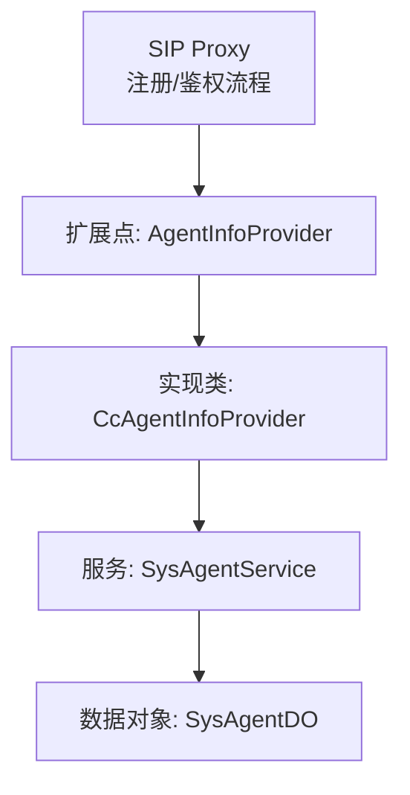
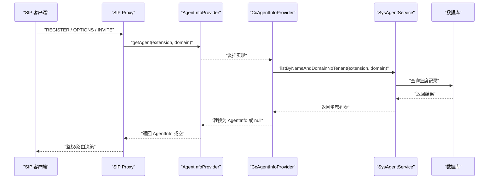
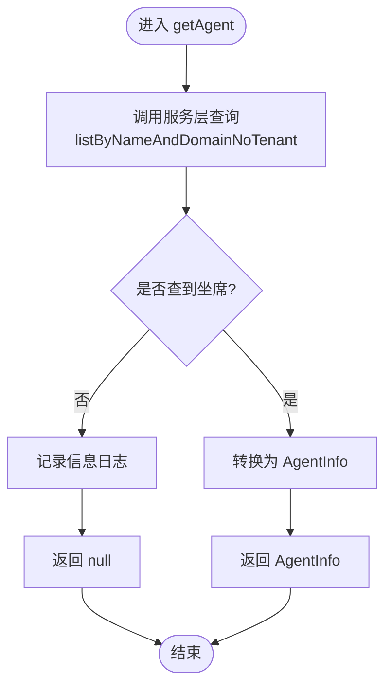
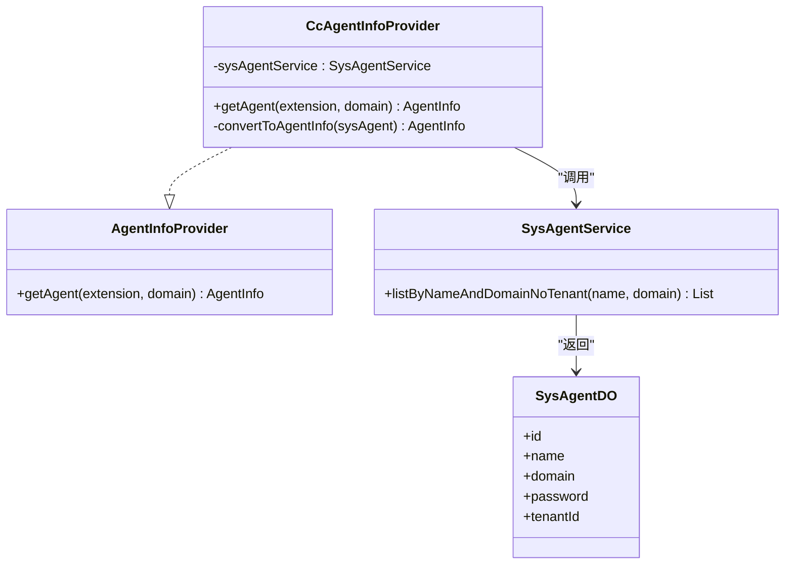

# 坐席信息提供者接口

<cite>
**本文引用的文件**
- [CcAgentInfoProvider.java](file://yudao-cloud/yudao-module-cc/yudao-module-cc-server/src/main/java/cn/iocoder/yudao/module/cc/sipproxy/integration/CcAgentInfoProvider.java)
- [AgentInfoProvider.java](file://yudao-cloud/yudao-module-cc/ipcc-sipproxy/src/main/java/cn/ipcc/sipproxy/api/agent/AgentInfoProvider.java)
- [SysAgentService.java](file://yudao-cloud/yudao-module-cc/yudao-module-cc-server/src/main/java/cn/iocoder/yudao/module/cc/service/sys/SysAgentService.java)
- [SysAgentDO.java](file://yudao-cloud/yudao-module-cc/yudao-module-cc-server/src/main/java/cn/iocoder/yudao/module/cc/dal/dataobject/sys/SysAgentDO.java)
</cite>

## 目录
1. [简介](#简介)
2. [项目结构](#项目结构)
3. [核心组件](#核心组件)
4. [架构总览](#架构总览)
5. [详细组件分析](#详细组件分析)
6. [依赖关系分析](#依赖关系分析)
7. [性能考虑](#性能考虑)
8. [故障排查指南](#故障排查指南)
9. [结论](#结论)
10. [附录：接口规范与实现示例](#附录接口规范与实现示例)

## 简介
本文件面向“坐席信息提供者接口”的设计、集成与扩展，聚焦以下目标：
- 说明 AgentInfoProvider 接口的设计目的与核心能力：坐席信息查询、状态获取、权限验证等。
- 文档化接口的抽象方法与实现要求，提供自定义坐席信息提供者的开发指南。
- 解释与 FreeSWITCH 坐席系统的集成方式，并给出分布式坐席信息管理的建议方案。
- 提供完整的接口规范、实现要点与最佳实践。

## 项目结构
围绕坐席信息提供者，本项目采用“扩展点 + 具体实现”的分层组织方式：
- 扩展点定义位于 ipcc-sipproxy 模块的 api 包中，供 SIP Proxy 在注册、鉴权等流程中调用。
- 具体实现位于 cc-server 模块的 sipproxy/integration 包中，将业务侧的坐席数据（数据库）适配为扩展点所需的数据模型。
- 通过 Spring 容器装配，SIP Proxy 以统一的方式查询坐席信息，屏蔽底层存储差异。

图表来源
- [AgentInfoProvider.java](file://yudao-cloud/yudao-module-cc/ipcc-sipproxy/src/main/java/cn/ipcc/sipproxy/api/agent/AgentInfoProvider.java)
- [CcAgentInfoProvider.java](file://yudao-cloud/yudao-module-cc/yudao-module-cc-server/src/main/java/cn/iocoder/yudao/module/cc/sipproxy/integration/CcAgentInfoProvider.java)
- [SysAgentService.java](file://yudao-cloud/yudao-module-cc/yudao-module-cc-server/src/main/java/cn/iocoder/yudao/module/cc/service/sys/SysAgentService.java)
- [SysAgentDO.java](file://yudao-cloud/yudao-module-cc/yudao-module-cc-server/src/main/java/cn/iocoder/yudao/module/cc/dal/dataobject/sys/SysAgentDO.java)

章节来源
- [CcAgentInfoProvider.java:14-75](file://yudao-cloud/yudao-module-cc/yudao-module-cc-server/src/main/java/cn/iocoder/yudao/module/cc/sipproxy/integration/CcAgentInfoProvider.java#L14-L75)

## 核心组件
- AgentInfoProvider：SIP Proxy 提供的扩展点，用于按分机号与域名查询坐席信息，支撑注册、鉴权、路由等场景。
- CcAgentInfoProvider：业务侧的具体实现，负责从系统坐席表查询数据，并映射为 SIP Proxy 所需的 AgentInfo 模型。
- SysAgentService / SysAgentDO：业务侧的服务与数据对象，承载跨租户的坐席查询能力与字段定义。

职责边界
- 扩展点仅暴露最小必要方法，避免耦合具体存储。
- 实现类承担领域模型到扩展点模型的转换、异常处理与日志记录。
- 服务层封装跨租户查询、缓存策略与一致性保障。

章节来源
- [AgentInfoProvider.java](file://yudao-cloud/yudao-module-cc/ipcc-sipproxy/src/main/java/cn/ipcc/sipproxy/api/agent/AgentInfoProvider.java)
- [CcAgentInfoProvider.java:24-75](file://yudao-cloud/yudao-module-cc/yudao-module-cc-server/src/main/java/cn/iocoder/yudao/module/cc/sipproxy/integration/CcAgentInfoProvider.java#L24-L75)
- [SysAgentService.java](file://yudao-cloud/yudao-module-cc/yudao-module-cc-server/src/main/java/cn/iocoder/yudao/module/cc/service/sys/SysAgentService.java)
- [SysAgentDO.java](file://yudao-cloud/yudao-module-cc/yudao-module-cc-server/src/main/java/cn/iocoder/yudao/module/cc/dal/dataobject/sys/SysAgentDO.java)

## 架构总览
下图展示了 SIP Proxy 在注册/鉴权过程中如何通过扩展点查询坐席信息，以及业务实现如何对接数据库。

图表来源
- [AgentInfoProvider.java](file://yudao-cloud/yudao-module-cc/ipcc-sipproxy/src/main/java/cn/ipcc/sipproxy/api/agent/AgentInfoProvider.java)
- [CcAgentInfoProvider.java:41-55](file://yudao-cloud/yudao-module-cc/yudao-module-cc-server/src/main/java/cn/iocoder/yudao/module/cc/sipproxy/integration/CcAgentInfoProvider.java#L41-L55)
- [SysAgentService.java](file://yudao-cloud/yudao-module-cc/yudao-module-cc-server/src/main/java/cn/iocoder/yudao/module/cc/service/sys/SysAgentService.java)

## 详细组件分析

### 组件：AgentInfoProvider（扩展点）
- 设计目的
  - 为 SIP Proxy 提供统一的坐席信息查询入口，解耦上层流程与底层存储。
  - 支持按分机号与域名查询，满足多租户、多域场景。
- 核心能力
  - 坐席信息查询：根据 extension 与 domain 获取 AgentInfo。
  - 状态获取：由上层结合其他扩展点（如 FsNodeProvider）完成在线/离线状态聚合。
  - 权限验证：结合认证扩展点，校验分机号与密码/令牌是否匹配。
- 抽象方法与契约
  - getAgent(extension, domain)：返回 AgentInfo；未找到时返回空，不抛异常。
  - 线程安全：实现需保证并发安全。
  - 幂等性：相同参数多次调用应返回一致结果。
  - 可观测性：实现需输出必要的日志，便于问题定位。

章节来源
- [AgentInfoProvider.java](file://yudao-cloud/yudao-module-cc/ipcc-sipproxy/src/main/java/cn/ipcc/sipproxy/api/agent/AgentInfoProvider.java)

### 组件：CcAgentInfoProvider（业务实现）
- 职责
  - 将业务侧 SysAgentDO 转换为 SIP Proxy 所需的 AgentInfo。
  - 使用 SysAgentService 进行跨租户查询，确保多租户隔离。
  - 对异常进行捕获与日志记录，保证上层稳定性。
- 关键流程
  - 接收 extension 与 domain。
  - 调用服务层查询坐席列表。
  - 若为空则返回空；否则取首条记录并转换。
  - 转换字段包括：extension、domain、password、agentId、tenantId、displayName。
- 错误处理
  - 查询异常时记录错误日志并返回空，避免影响 SIP 流程。
  - 未命中时记录信息日志，便于审计与排障。

图表来源
- [CcAgentInfoProvider.java:41-75](file://yudao-cloud/yudao-module-cc/yudao-module-cc-server/src/main/java/cn/iocoder/yudao/module/cc/sipproxy/integration/CcAgentInfoProvider.java#L41-L75)

章节来源
- [CcAgentInfoProvider.java:24-75](file://yudao-cloud/yudao-module-cc/yudao-module-cc-server/src/main/java/cn/iocoder/yudao/module/cc/sipproxy/integration/CcAgentInfoProvider.java#L24-L75)

### 组件：SysAgentService / SysAgentDO（业务数据层）
- 角色
  - SysAgentService：提供跨租户的坐席查询能力，屏蔽 SQL 拼接与租户过滤细节。
  - SysAgentDO：承载坐席实体字段，如 name、domain、password、id、tenantId 等。
- 关键点
  - 跨租户查询：确保不同租户的坐席数据隔离。
  - 字段映射：name 对应 SIP 分机号（extension），id 作为 agentId。

章节来源
- [SysAgentService.java](file://yudao-cloud/yudao-module-cc/yudao-module-cc-server/src/main/java/cn/iocoder/yudao/module/cc/service/sys/SysAgentService.java)
- [SysAgentDO.java](file://yudao-cloud/yudao-module-cc/yudao-module-cc-server/src/main/java/cn/iocoder/yudao/module/cc/dal/dataobject/sys/SysAgentDO.java)

## 依赖关系分析
- 松耦合：SIP Proxy 仅依赖 AgentInfoProvider 接口，不感知具体实现。
- 可替换：可通过实现不同的 AgentInfoProvider 接入不同后端（内存、Redis、远程服务等）。
- 可观测：实现类内嵌日志，便于追踪查询路径与异常。

图表来源
- [AgentInfoProvider.java](file://yudao-cloud/yudao-module-cc/ipcc-sipproxy/src/main/java/cn/ipcc/sipproxy/api/agent/AgentInfoProvider.java)
- [CcAgentInfoProvider.java:24-75](file://yudao-cloud/yudao-module-cc/yudao-module-cc-server/src/main/java/cn/iocoder/yudao/module/cc/sipproxy/integration/CcAgentInfoProvider.java#L24-L75)
- [SysAgentService.java](file://yudao-cloud/yudao-module-cc/yudao-module-cc-server/src/main/java/cn/iocoder/yudao/module/cc/service/sys/SysAgentService.java)
- [SysAgentDO.java](file://yudao-cloud/yudao-module-cc/yudao-module-cc-server/src/main/java/cn/iocoder/yudao/module/cc/dal/dataobject/sys/SysAgentDO.java)

章节来源
- [CcAgentInfoProvider.java:24-75](file://yudao-cloud/yudao-module-cc/yudao-module-cc-server/src/main/java/cn/iocoder/yudao/module/cc/sipproxy/integration/CcAgentInfoProvider.java#L24-L75)

## 性能考虑
- 查询优化
  - 建议在 SysAgentService 层增加缓存（如 Redis），减少数据库压力。
  - 合理索引：针对 name、domain、tenantId 建立复合索引。
- 并发与一致性
  - 实现类无状态，天然线程安全；注意服务层并发访问数据库时的连接池配置。
  - 热点分机号可引入本地缓存（注意过期与失效策略）。
- 可扩展性
  - 对于高并发场景，可将 AgentInfoProvider 的实现改为远端服务（gRPC/HTTP），并通过负载均衡提升吞吐。

[本节为通用指导，无需特定文件引用]

## 故障排查指南
- 常见问题
  - 未查询到坐席：检查 extension 与 domain 是否正确；确认跨租户查询条件是否生效。
  - 查询异常：查看实现类中的错误日志，定位服务层或数据库异常。
  - 字段映射错误：核对 name→extension、id→agentId 等映射是否符合预期。
- 排查步骤
  - 开启调试日志，观察 getAgent 的入参与返回值。
  - 在服务层执行等价查询，验证数据是否存在。
  - 检查数据库索引与慢查询，必要时优化 SQL。

章节来源
- [CcAgentInfoProvider.java:41-55](file://yudao-cloud/yudao-module-cc/yudao-module-cc-server/src/main/java/cn/iocoder/yudao/module/cc/sipproxy/integration/CcAgentInfoProvider.java#L41-L55)

## 结论
- AgentInfoProvider 提供了 SIP Proxy 与业务侧之间的清晰边界，便于扩展与替换。
- CcAgentInfoProvider 实现了跨租户的坐席查询与模型转换，具备健壮的错误处理与可观测性。
- 通过合理的缓存与索引策略，可在高并发场景下保持稳定的查询性能。
- 未来可进一步引入分布式缓存或服务化实现，以支撑更大规模的坐席信息管理。

[本节为总结性内容，无需特定文件引用]

## 附录：接口规范与实现示例

### 接口规范
- 方法签名
  - getAgent(String extension, String domain) → AgentInfo
- 语义约定
  - extension：SIP 分机号（对应业务侧 name）。
  - domain：可选的域名条件，用于多域/多租户场景。
  - 返回值：找到返回 AgentInfo；未找到返回空；异常时不应向上抛出，应在实现内部处理并记录日志。
- 行为约束
  - 幂等：相同输入多次调用结果一致。
  - 线程安全：实现需支持并发调用。
  - 可观测：记录关键路径日志，包含入参与结果摘要。

章节来源
- [AgentInfoProvider.java](file://yudao-cloud/yudao-module-cc/ipcc-sipproxy/src/main/java/cn/ipcc/sipproxy/api/agent/AgentInfoProvider.java)
- [CcAgentInfoProvider.java:41-55](file://yudao-cloud/yudao-module-cc/yudao-module-cc-server/src/main/java/cn/iocoder/yudao/module/cc/sipproxy/integration/CcAgentInfoProvider.java#L41-L55)

### 实现示例（要点）
- 数据源：通过 SysAgentService 查询跨租户坐席列表。
- 字段映射：
  - extension ← name
  - domain ← domain
  - password ← password
  - agentId ← id
  - tenantId ← tenantId
  - displayName ← name（占位）
- 异常处理：捕获异常并记录错误日志，返回空以避免中断 SIP 流程。

章节来源
- [CcAgentInfoProvider.java:57-75](file://yudao-cloud/yudao-module-cc/yudao-module-cc-server/src/main/java/cn/iocoder/yudao/module/cc/sipproxy/integration/CcAgentInfoProvider.java#L57-L75)
- [SysAgentService.java](file://yudao-cloud/yudao-module-cc/yudao-module-cc-server/src/main/java/cn/iocoder/yudao/module/cc/service/sys/SysAgentService.java)
- [SysAgentDO.java](file://yudao-cloud/yudao-module-cc/yudao-module-cc-server/src/main/java/cn/iocoder/yudao/module/cc/dal/dataobject/sys/SysAgentDO.java)

### 与 FreeSWITCH 坐席系统集成
- 集成方式
  - SIP Proxy 在注册/鉴权阶段调用 AgentInfoProvider 获取坐席信息。
  - 结合 FsNodeProvider 获取 FreeSWITCH 节点上的在线状态，形成最终的状态视图。
- 分布式管理建议
  - 使用集中式缓存（如 Redis）维护坐席在线状态，所有节点共享。
  - 通过事件总线（消息队列）广播状态变更，保证多节点一致性。
  - 对热点分机号做本地缓存，设置短 TTL 并监听失效事件。

[本节为概念性说明，无需特定文件引用]

### 自定义坐席信息提供者开发指南
- 步骤
  - 新建类实现 AgentInfoProvider 接口。
  - 注入所需的数据源或服务（如 Redis、远程 API）。
  - 实现 getAgent 方法，遵循幂等、线程安全与可观测性要求。
  - 注册为 Spring 组件，确保被 SIP Proxy 发现。
- 注意事项
  - 不要向上抛出异常，统一在实现内部处理。
  - 对敏感字段（如密码）进行脱敏或按需返回。
  - 做好监控与告警，关注失败率与延迟指标。

[本节为通用指导，无需特定文件引用]