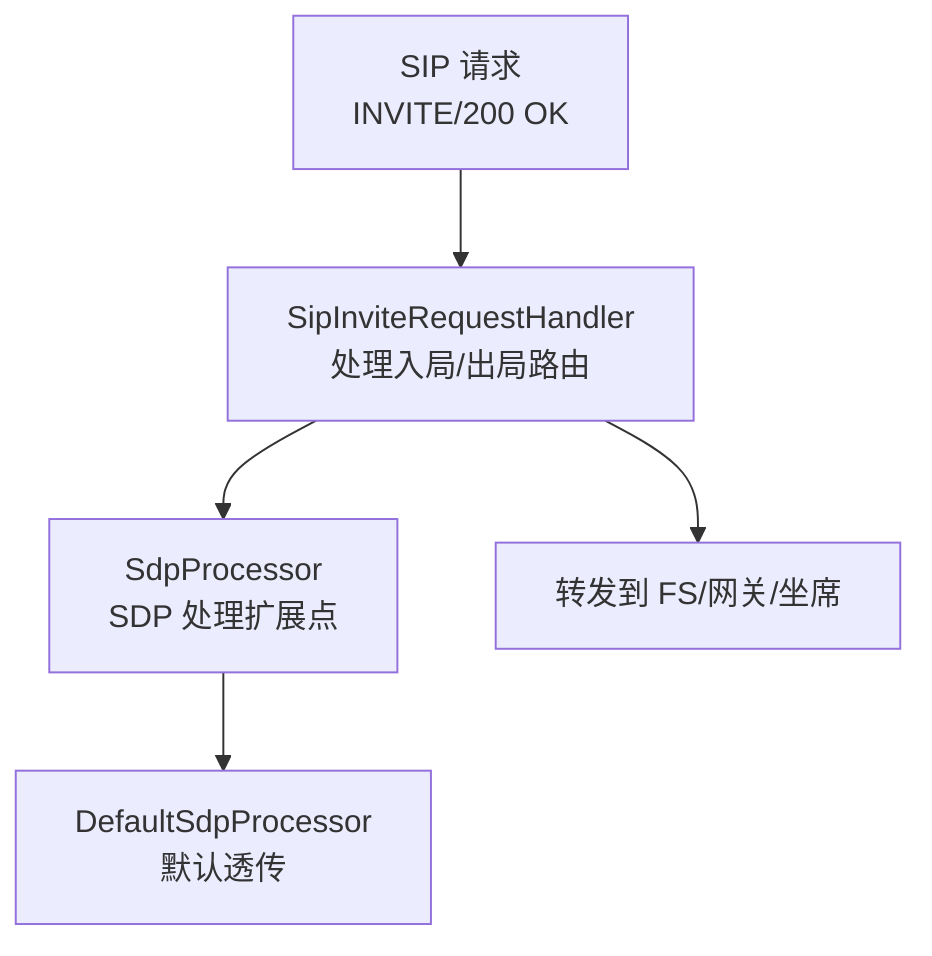
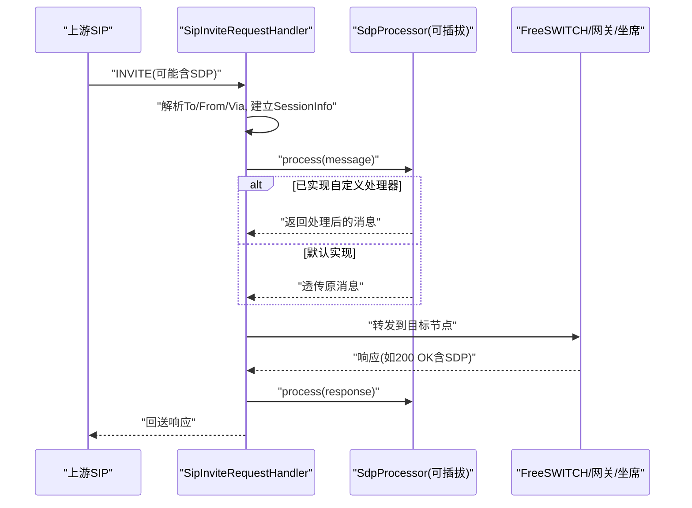
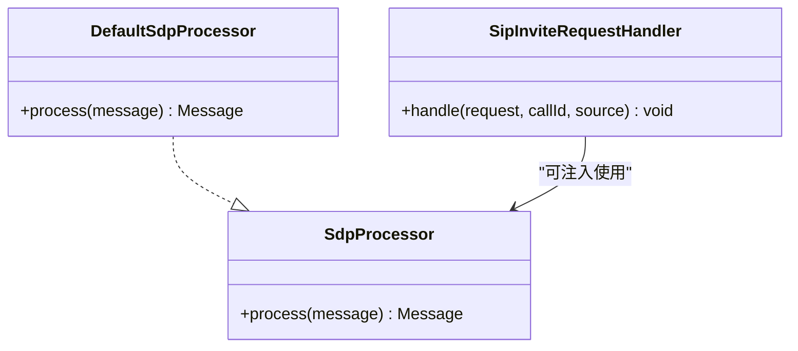
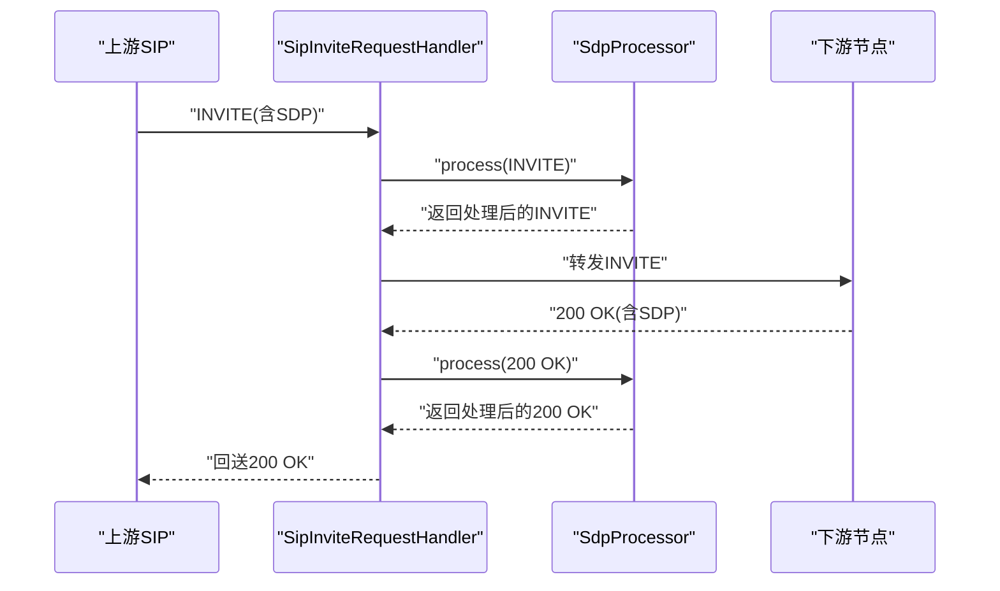
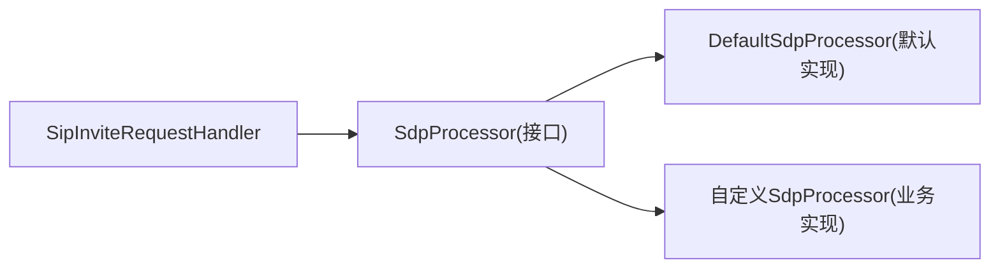
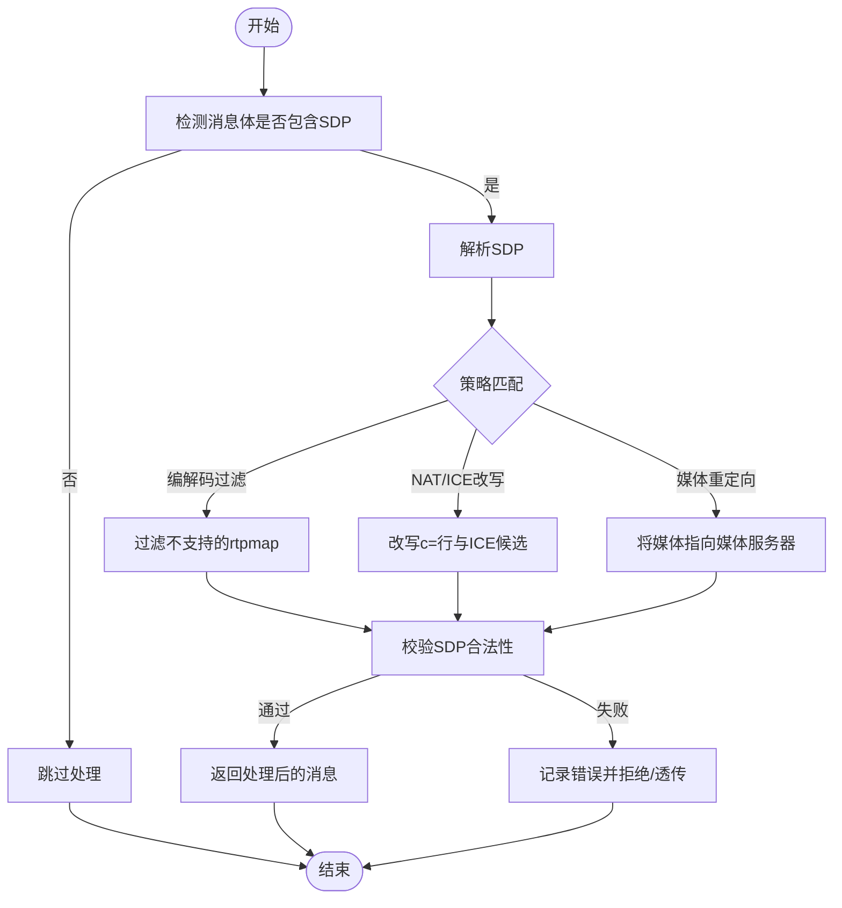

# 媒体处理接口

<cite>
**本文引用的文件**
- [SdpProcessor.java](file://yudao-cloud/yudao-module-cc/ipcc-sipproxy/src/main/java/cn/ipcc/sipproxy/api/media/SdpProcessor.java)
- [DefaultSdpProcessor.java](file://yudao-cloud/yudao-module-cc/ipcc-sipproxy/src/main/java/cn/ipcc/sipproxy/defaults/media/DefaultSdpProcessor.java)
- [SipInviteRequestHandler.java](file://yudao-cloud/yudao-module-cc/ipcc-sipproxy/src/main/java/cn/ipcc/sipproxy/core/handler/request/sip/SipInviteRequestHandler.java)
</cite>

## 目录
1. [简介](#简介)
2. [项目结构](#项目结构)
3. [核心组件](#核心组件)
4. [架构总览](#架构总览)
5. [详细组件分析](#详细组件分析)
6. [依赖关系分析](#依赖关系分析)
7. [性能考虑](#性能考虑)
8. [故障排查指南](#故障排查指南)
9. [结论](#结论)
10. [附录：示例与调试技巧](#附录示例与调试技巧)

## 简介
本文件面向媒体处理接口，重点说明 SdpProcessor 在 SIP 代理中的职责与作用：在 INVITE/200 OK 等携带 SDP 的 SIP 消息进入或离开代理时，提供扩展点以进行媒体协商、编解码器选择、NAT/ICE 地址改写、媒体流重定向等。默认实现为透传，不修改 SDP；业务方可通过实现该接口并注册为 Spring Bean 来覆盖默认行为。文档同时给出 SDP 解析、修改与生成的流程建议、链式调用方式、性能优化建议以及调试技巧。

## 项目结构
与媒体处理相关的关键位置如下：
- 扩展点定义：api/media/SdpProcessor.java
- 默认实现：defaults/media/DefaultSdpProcessor.java
- 呼叫入口（INVITE）：core/handler/request/sip/SipInviteRequestHandler.java

图表来源
- [SipInviteRequestHandler.java:71-233](file://yudao-cloud/yudao-module-cc/ipcc-sipproxy/src/main/java/cn/ipcc/sipproxy/core/handler/request/sip/SipInviteRequestHandler.java#L71-L233)
- [SdpProcessor.java:13-21](file://yudao-cloud/yudao-module-cc/ipcc-sipproxy/src/main/java/cn/ipcc/sipproxy/api/media/SdpProcessor.java#L13-L21)
- [DefaultSdpProcessor.java:17-29](file://yudao-cloud/yudao-module-cc/ipcc-sipproxy/src/main/java/cn/ipcc/sipproxy/defaults/media/DefaultSdpProcessor.java#L17-L29)

章节来源
- [SdpProcessor.java:1-23](file://yudao-cloud/yudao-module-cc/ipcc-sipproxy/src/main/java/cn/ipcc/sipproxy/api/media/SdpProcessor.java#L1-L23)
- [DefaultSdpProcessor.java:1-31](file://yudao-cloud/yudao-module-cc/ipcc-sipproxy/src/main/java/cn/ipcc/sipproxy/defaults/media/DefaultSdpProcessor.java#L1-L31)
- [SipInviteRequestHandler.java:1-293](file://yudao-cloud/yudao-module-cc/ipcc-sipproxy/src/main/java/cn/ipcc/sipproxy/core/handler/request/sip/SipInviteRequestHandler.java#L1-L293)

## 核心组件
- SdpProcessor：定义 SDP 处理的统一扩展点，接收含 SDP 的 SIP 消息，返回处理后的消息。用于媒体协商、编解码器过滤、NAT/ICE 地址替换、媒体流重定向等。
- DefaultSdpProcessor：默认实现，直接透传原消息，不做任何修改。
- SipInviteRequestHandler：处理入局 INVITE，负责会话信息构建、路由决策与转发。当前版本未直接调用 SdpProcessor，但可作为后续接入 SDP 处理的合适切入点。

章节来源
- [SdpProcessor.java:13-21](file://yudao-cloud/yudao-module-cc/ipcc-sipproxy/src/main/java/cn/ipcc/sipproxy/api/media/SdpProcessor.java#L13-L21)
- [DefaultSdpProcessor.java:17-29](file://yudao-cloud/yudao-module-cc/ipcc-sipproxy/src/main/java/cn/ipcc/sipproxy/defaults/media/DefaultSdpProcessor.java#L17-L29)
- [SipInviteRequestHandler.java:71-233](file://yudao-cloud/yudao-module-cc/ipcc-sipproxy/src/main/java/cn/ipcc/sipproxy/core/handler/request/sip/SipInviteRequestHandler.java#L71-L233)

## 架构总览
SIP 代理对媒体协商的处理采用“可扩展处理器”模式：
- 入口：SipInviteRequestHandler 处理 INVITE，完成路由与会话上下文准备。
- 扩展点：SdpProcessor 作为可选 Bean 注入，用于在转发前对 SDP 进行修改。
- 默认行为：DefaultSdpProcessor 透传，保证最小侵入。
- 转发：根据 callType/source 决定转发到 FreeSWITCH、第三方网关或 WebSocket 坐席。

图表来源
- [SipInviteRequestHandler.java:71-233](file://yudao-cloud/yudao-module-cc/ipcc-sipproxy/src/main/java/cn/ipcc/sipproxy/core/handler/request/sip/SipInviteRequestHandler.java#L71-L233)
- [SdpProcessor.java:13-21](file://yudao-cloud/yudao-module-cc/ipcc-sipproxy/src/main/java/cn/ipcc/sipproxy/api/media/SdpProcessor.java#L13-L21)
- [DefaultSdpProcessor.java:17-29](file://yudao-cloud/yudao-module-cc/ipcc-sipproxy/src/main/java/cn/ipcc/sipproxy/defaults/media/DefaultSdpProcessor.java#L17-L29)

## 详细组件分析

### SdpProcessor 接口
- 作用：定义统一的 SDP 处理契约，支持在 SIP 代理转发前后对 SDP 进行解析、校验、改写与生成。
- 输入输出：输入为含 SDP body 的 javax.sip.message.Message，输出为处理后的 Message（可为同一对象或新构造）。
- 典型能力：
  - 媒体协商：根据端能力集交集选择编解码器。
  - NAT/ICE：重写 c= 行、rtpmap 中的 IP/端口，注入/转换 ICE 候选。
  - 媒体流重定向：将媒体指向媒体服务器或 SFU/MCU。
  - 安全策略：强制启用 SRTP/DTLS，禁用不安全编解码。

章节来源
- [SdpProcessor.java:13-21](file://yudao-cloud/yudao-module-cc/ipcc-sipproxy/src/main/java/cn/ipcc/sipproxy/api/media/SdpProcessor.java#L13-L21)

### DefaultSdpProcessor 默认实现
- 行为：直接返回原消息，不做任何修改，确保最小侵入和向后兼容。
- 适用场景：无需媒体面干预的简单代理场景；或上层已有独立媒体控制平面。

章节来源
- [DefaultSdpProcessor.java:17-29](file://yudao-cloud/yudao-module-cc/ipcc-sipproxy/src/main/java/cn/ipcc/sipproxy/defaults/media/DefaultSdpProcessor.java#L17-L29)

### SipInviteRequestHandler 与 SDP 集成点
- 角色：处理来自 FreeSWITCH/第三方的 INVITE，构建 SessionInfo，决定快速出局、WebSocket 直推或转发至 FS park。
- 与 SDP 的关系：当前实现未直接调用 SdpProcessor，但可在以下位置集成：
  - 转发前：对 INVITE 的 SDP 进行处理（例如改写媒体地址、过滤编解码）。
  - 响应后：对 200 OK 的 SDP 进行处理（例如将媒体指向媒体服务器）。
- 注意：对于 WebRTC 场景（FS originate 到 JsSIP），INVITE 的 SDP 为 WebRTC 格式，需特别注意 DTLS-SRTP/ICE 兼容性。

章节来源
- [SipInviteRequestHandler.java:71-233](file://yudao-cloud/yudao-module-cc/ipcc-sipproxy/src/main/java/cn/ipcc/sipproxy/core/handler/request/sip/SipInviteRequestHandler.java#L71-L233)

#### 类图（代码级）

图表来源
- [SdpProcessor.java:13-21](file://yudao-cloud/yudao-module-cc/ipcc-sipproxy/src/main/java/cn/ipcc/sipproxy/api/media/SdpProcessor.java#L13-L21)
- [DefaultSdpProcessor.java:17-29](file://yudao-cloud/yudao-module-cc/ipcc-sipproxy/src/main/java/cn/ipcc/sipproxy/defaults/media/DefaultSdpProcessor.java#L17-L29)
- [SipInviteRequestHandler.java:71-233](file://yudao-cloud/yudao-module-cc/ipcc-sipproxy/src/main/java/cn/ipcc/sipproxy/core/handler/request/sip/SipInviteRequestHandler.java#L71-L233)

#### 序列图（SDP 处理流程）

图表来源
- [SipInviteRequestHandler.java:71-233](file://yudao-cloud/yudao-module-cc/ipcc-sipproxy/src/main/java/cn/ipcc/sipproxy/core/handler/request/sip/SipInviteRequestHandler.java#L71-L233)
- [SdpProcessor.java:13-21](file://yudao-cloud/yudao-module-cc/ipcc-sipproxy/src/main/java/cn/ipcc/sipproxy/api/media/SdpProcessor.java#L13-L21)

## 依赖关系分析
- 松耦合：SdpProcessor 是纯接口，默认实现位于 defaults 包，便于按模块隔离。
- 可选注入：通过 Spring 容器管理 Bean，父程序可选择实现覆盖默认行为。
- 调用点：建议在 SipInviteRequestHandler 中按需调用，避免对非 SDP 消息造成不必要开销。

图表来源
- [SipInviteRequestHandler.java:71-233](file://yudao-cloud/yudao-module-cc/ipcc-sipproxy/src/main/java/cn/ipcc/sipproxy/core/handler/request/sip/SipInviteRequestHandler.java#L71-L233)
- [SdpProcessor.java:13-21](file://yudao-cloud/yudao-module-cc/ipcc-sipproxy/src/main/java/cn/ipcc/sipproxy/api/media/SdpProcessor.java#L13-L21)
- [DefaultSdpProcessor.java:17-29](file://yudao-cloud/yudao-module-cc/ipcc-sipproxy/src/main/java/cn/ipcc/sipproxy/defaults/media/DefaultSdpProcessor.java#L17-L29)

章节来源
- [SdpProcessor.java:13-21](file://yudao-cloud/yudao-module-cc/ipcc-sipproxy/src/main/java/cn/ipcc/sipproxy/api/media/SdpProcessor.java#L13-L21)
- [DefaultSdpProcessor.java:17-29](file://yudao-cloud/yudao-module-cc/ipcc-sipproxy/src/main/java/cn/ipcc/sipproxy/defaults/media/DefaultSdpProcessor.java#L17-L29)
- [SipInviteRequestHandler.java:71-233](file://yudao-cloud/yudao-module-cc/ipcc-sipproxy/src/main/java/cn/ipcc/sipproxy/core/handler/request/sip/SipInviteRequestHandler.java#L71-L233)

## 性能考虑
- 仅在必要时处理 SDP：对不含 SDP 的消息跳过处理，减少解析开销。
- 局部修改：尽量只修改必要字段（如 c= 行、rtpmap），避免全量重建消息体。
- 缓存编解码能力表：对常见终端能力做本地缓存，降低重复计算。
- 异步化与批量化：在高并发场景下，可将复杂处理放入线程池或队列，避免阻塞主处理路径。
- 日志与度量：对关键步骤打点（耗时、失败率），便于定位瓶颈。

[本节为通用性能建议，不直接分析具体文件]

## 故障排查指南
- 现象：媒体无法连通或无音
  - 检查是否启用了自定义 SdpProcessor，确认是否错误地改写了媒体地址或禁用了必要编解码。
  - 核对 NAT/ICE 场景下的 c= 行与 ICE 候选是否正确替换为可达地址。
- 现象：WebRTC 坐席收不到媒体
  - 确认 FS originate 的 SDP 为 WebRTC 格式（RTP/SAVPF+DTLS-SRTP+ICE），避免被错误改写导致握手失败。
- 现象：响应方向错误
  - 检查 callType/source 判断逻辑，确保响应正确回送到发起方（FS/第三方/坐席）。
- 建议：
  - 在 SipInviteRequestHandler 中增加对 INVITE/200 OK 的 SDP 打印（脱敏后）与处理前后对比日志。
  - 对异常分支添加明确错误码与告警，便于快速定位。

章节来源
- [SipInviteRequestHandler.java:71-233](file://yudao-cloud/yudao-module-cc/ipcc-sipproxy/src/main/java/cn/ipcc/sipproxy/core/handler/request/sip/SipInviteRequestHandler.java#L71-L233)

## 结论
SdpProcessor 提供了轻量且可扩展的媒体处理扩展点，默认透传保证最小侵入，业务方可按需实现媒体协商、编解码选择、NAT/ICE 改写与媒体流重定向等功能。建议在 SipInviteRequestHandler 的转发前后集成该扩展点，结合链路追踪与度量，形成稳定可靠的媒体处理流水线。

[本节为总结性内容，不直接分析具体文件]

## 附录：示例与调试技巧

### SDP 处理流程图（概念）

[此图为概念流程，不直接映射具体源码]

### 如何扩展支持新的媒体类型与处理逻辑
- 新增处理器：实现 SdpProcessor 接口，注册为 Spring Bean 以覆盖默认实现。
- 策略开关：在处理器内依据消息头、会话上下文或配置项决定是否应用特定逻辑。
- 组合多个处理器：可通过装饰器模式或责任链模式组合多个处理器，实现分阶段处理（如先过滤再改写）。
- 测试验证：针对典型终端（软电话、硬电话、WebRTC）构造用例，验证编解码选择与地址改写结果。

[本节为通用指导，不直接分析具体文件]

### 链式调用实现方式（建议）
- 责任链：定义 ProcessorChain，内部维护 SdpProcessor 列表，依次调用 process，任一环节可短路返回。
- 顺序控制：通过优先级或条件路由控制执行顺序，例如先安全策略，再编解码过滤，最后地址改写。
- 可观测性：在每个环节记录输入/输出摘要与耗时，便于问题回溯。

[本节为通用设计建议，不直接分析具体文件]

### 完整示例（端到端）
- 入局 INVITE：SipInviteRequestHandler 收到 INVITE，若含 SDP，则调用 SdpProcessor.process 进行编解码过滤与地址改写，随后转发到 FS/网关/坐席。
- 响应 200 OK：下游返回 200 OK（含 SDP），再次调用 SdpProcessor.process 进行最终媒体地址确认，然后回送给上游。
- 异常处理：若 SDP 非法或策略拒绝，返回错误响应或透传原始消息并记录告警。

[本节为流程示例，不直接分析具体文件]

### 调试技巧
- 抓包比对：在 sipproxy 两侧抓取 SIP 报文，对比处理前后的 SDP 差异。
- 日志增强：在 SipInviteRequestHandler 中增加关键路径日志（callId、source、callType、目标节点）。
- 断点与单测：对 SdpProcessor 的实现编写单元测试，覆盖常见终端能力集与 NAT 场景。
- 指标监控：统计处理耗时、失败率、编解码选择分布，辅助容量规划与问题定位。

[本节为通用调试建议，不直接分析具体文件]