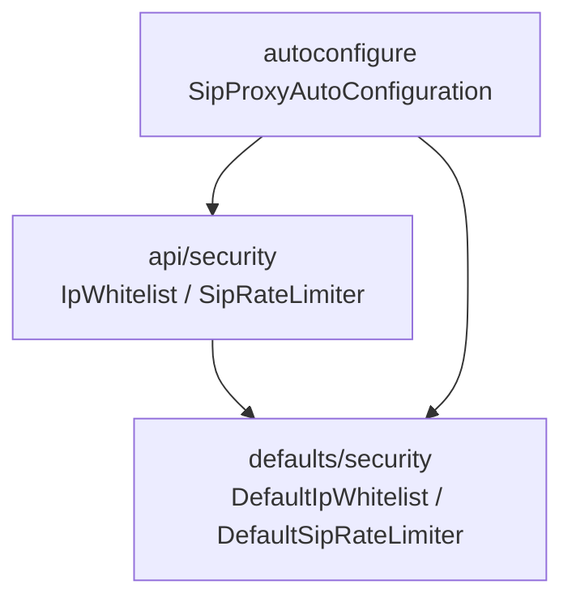
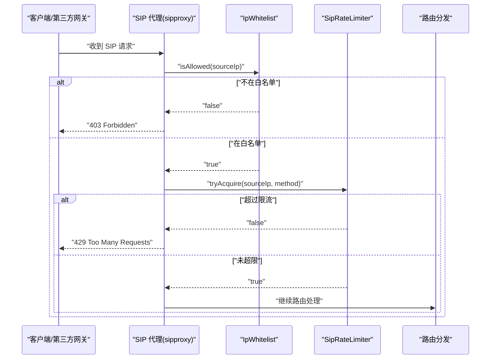
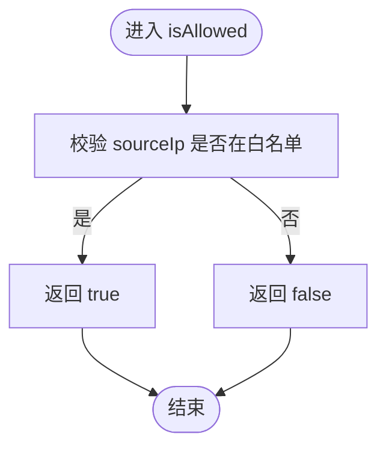
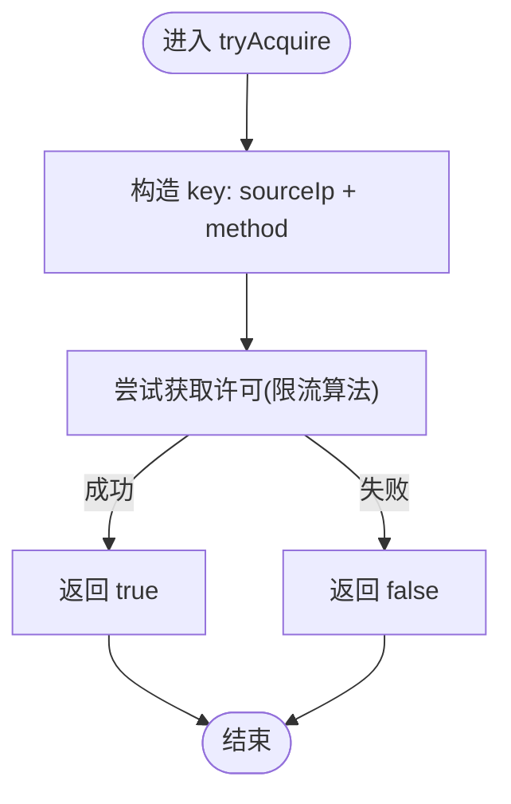
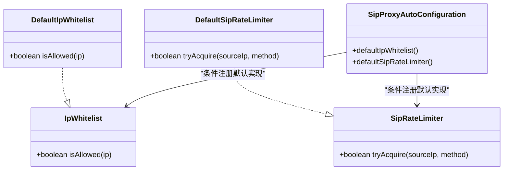
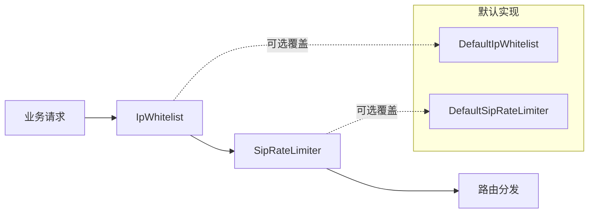

# 安全相关接口

<cite>
**本文引用的文件**
- [IpWhitelist.java](file://yudao-cloud/yudao-module-cc/ipcc-sipproxy/src/main/java/cn/ipcc/sipproxy/api/security/IpWhitelist.java)
- [SipRateLimiter.java](file://yudao-cloud/yudao-module-cc/ipcc-sipproxy/src/main/java/cn/ipcc/sipproxy/api/security/SipRateLimiter.java)
- [DefaultIpWhitelist.java](file://yudao-cloud/yudao-module-cc/ipcc-sipproxy/src/main/java/cn/ipcc/sipproxy/defaults/security/DefaultIpWhitelist.java)
- [DefaultSipRateLimiter.java](file://yudao-cloud/yudao-module-cc/ipcc-sipproxy/src/main/java/cn/ipcc/sipproxy/defaults/security/DefaultSipRateLimiter.java)
- [SipProxyAutoConfiguration.java](file://yudao-cloud/yudao-module-cc/ipcc-sipproxy/src/main/java/cn/ipcc/sipproxy/autoconfigure/SipProxyAutoConfiguration.java)
</cite>

## 目录
1. [简介](#简介)
2. [项目结构](#项目结构)
3. [核心组件](#核心组件)
4. [架构总览](#架构总览)
5. [详细组件分析](#详细组件分析)
6. [依赖关系分析](#依赖关系分析)
7. [性能与容量规划](#性能与容量规划)
8. [故障排查指南](#故障排查指南)
9. [结论](#结论)
10. [附录：配置与最佳实践](#附录配置与最佳实践)

## 简介
本章节面向 SIP 代理（sipproxy）的安全扩展点，围绕 IP 白名单与请求速率限制两大能力，说明其在 SIP 安全防护中的作用、调用时机、默认行为以及自定义实现方式。通过这两个扩展点，可快速构建针对第三方网关接入的 IP 准入控制与单 IP 恶意刷量防护（如注册风暴、INVITE 洪泛），为 DDoS 防护提供基础防线。

## 项目结构
安全相关代码位于 sipproxy 模块中，采用“接口 + 默认实现 + 自动装配”的分层组织：
- api/security：定义安全扩展点接口（IpWhitelist、SipRateLimiter）。
- defaults/security：提供默认实现（全部放行），便于内网或无外部网关场景直接启动。
- autoconfigure：统一注册默认 Bean，支持父工程覆盖。

图表来源
- [IpWhitelist.java:1-22](file://yudao-cloud/yudao-module-cc/ipcc-sipproxy/src/main/java/cn/ipcc/sipproxy/api/security/IpWhitelist.java#L1-L22)
- [SipRateLimiter.java:1-22](file://yudao-cloud/yudao-module-cc/ipcc-sipproxy/src/main/java/cn/ipcc/sipproxy/api/security/SipRateLimiter.java#L1-L22)
- [DefaultIpWhitelist.java:1-28](file://yudao-cloud/yudao-module-cc/ipcc-sipproxy/src/main/java/cn/ipcc/sipproxy/defaults/security/DefaultIpWhitelist.java#L1-L28)
- [DefaultSipRateLimiter.java:1-29](file://yudao-cloud/yudao-module-cc/ipcc-sipproxy/src/main/java/cn/ipcc/sipproxy/defaults/security/DefaultSipRateLimiter.java#L1-L29)
- [SipProxyAutoConfiguration.java:186-216](file://yudao-cloud/yudao-module-cc/ipcc-sipproxy/src/main/java/cn/ipcc/sipproxy/autoconfigure/SipProxyAutoConfiguration.java#L186-L216)

章节来源
- [SipProxyAutoConfiguration.java:186-216](file://yudao-cloud/yudao-module-cc/ipcc-sipproxy/src/main/java/cn/ipcc/sipproxy/autoconfigure/SipProxyAutoConfiguration.java#L186-L216)

## 核心组件
- IpWhitelist：IP 白名单扩展点，用于校验第三方 SIP 请求来源 IP 是否允许接入。不在白名单的请求将被拒绝。
- SipRateLimiter：SIP 速率限制扩展点，用于对单 IP 的请求进行限流，防止恶意注册/呼叫刷量。超出限制将返回过多请求错误。
- 默认实现：两者均提供“全部放行”的默认实现，确保在无自定义策略时服务仍可正常启动与运行。
- 自动装配：通过自动配置类以条件化 Bean 的方式注册默认实现；父工程只需实现对应接口并注册为 Bean，即可无缝覆盖默认策略。

章节来源
- [IpWhitelist.java:1-22](file://yudao-cloud/yudao-module-cc/ipcc-sipproxy/src/main/java/cn/ipcc/sipproxy/api/security/IpWhitelist.java#L1-L22)
- [SipRateLimiter.java:1-22](file://yudao-cloud/yudao-module-cc/ipcc-sipproxy/src/main/java/cn/ipcc/sipproxy/api/security/SipRateLimiter.java#L1-L22)
- [DefaultIpWhitelist.java:1-28](file://yudao-cloud/yudao-module-cc/ipcc-sipproxy/src/main/java/cn/ipcc/sipproxy/defaults/security/DefaultIpWhitelist.java#L1-L28)
- [DefaultSipRateLimiter.java:1-29](file://yudao-cloud/yudao-module-cc/ipcc-sipproxy/src/main/java/cn/ipcc/sipproxy/defaults/security/DefaultSipRateLimiter.java#L1-L29)
- [SipProxyAutoConfiguration.java:186-216](file://yudao-cloud/yudao-module-cc/ipcc-sipproxy/src/main/java/cn/ipcc/sipproxy/autoconfigure/SipProxyAutoConfiguration.java#L186-L216)

## 架构总览
下图展示了 SIP 请求进入后的安全拦截流程：先进行 IP 白名单校验，再进行速率限制检查，通过后继续路由分发。

图表来源
- [IpWhitelist.java:14-20](file://yudao-cloud/yudao-module-cc/ipcc-sipproxy/src/main/java/cn/ipcc/sipproxy/api/security/IpWhitelist.java#L14-L20)
- [SipRateLimiter.java:13-20](file://yudao-cloud/yudao-module-cc/ipcc-sipproxy/src/main/java/cn/ipcc/sipproxy/api/security/SipRateLimiter.java#L13-L20)
- [SipProxyAutoConfiguration.java:186-216](file://yudao-cloud/yudao-module-cc/ipcc-sipproxy/src/main/java/cn/ipcc/sipproxy/autoconfigure/SipProxyAutoConfiguration.java#L186-L216)

## 详细组件分析

### 组件一：IpWhitelist（IP 白名单）
- 职责：在收到第三方 SIP 请求时，校验来源 IP 是否在白名单内。
- 调用时机：请求进入后、路由分发前。
- 返回值语义：
  - true：允许通过，继续后续处理。
  - false：拒绝访问，返回 403 Forbidden。
- 默认实现：DefaultIpWhitelist 始终放行，适用于内网或外部防火墙已做 IP 过滤的场景。
- 自定义实现要点：
  - 从数据库/缓存加载白名单列表，支持 IPv4/IPv6。
  - 支持 CIDR 匹配、动态更新与热加载。
  - 建议记录被拒绝的 IP 日志，便于审计与告警。

图表来源
- [IpWhitelist.java:14-20](file://yudao-cloud/yudao-module-cc/ipcc-sipproxy/src/main/java/cn/ipcc/sipproxy/api/security/IpWhitelist.java#L14-L20)
- [DefaultIpWhitelist.java:17-26](file://yudao-cloud/yudao-module-cc/ipcc-sipproxy/src/main/java/cn/ipcc/sipproxy/defaults/security/DefaultIpWhitelist.java#L17-L26)

章节来源
- [IpWhitelist.java:1-22](file://yudao-cloud/yudao-module-cc/ipcc-sipproxy/src/main/java/cn/ipcc/sipproxy/api/security/IpWhitelist.java#L1-L22)
- [DefaultIpWhitelist.java:1-28](file://yudao-cloud/yudao-module-cc/ipcc-sipproxy/src/main/java/cn/ipcc/sipproxy/defaults/security/DefaultIpWhitelist.java#L1-L28)

### 组件二：SipRateLimiter（SIP 速率限制）
- 职责：对单 IP 的 SIP 请求进行频率限制，防止恶意注册/呼叫刷量。
- 调用时机：收到 SIP 请求后、路由分发前。
- 参数说明：
  - sourceIp：客户端真实 IP（非 Via 头）。
  - method：SIP 方法（如 REGISTER、INVITE、OPTIONS）。
- 返回值语义：
  - true：允许通过。
  - false：拒绝请求，返回 429 Too Many Requests。
- 默认实现：DefaultSipRateLimiter 始终放行，适用于功能验证与低流量场景。
- 自定义实现要点：
  - 基于令牌桶/滑动窗口/固定窗口等算法实现。
  - 按 sourceIp 维度限流，可按 method 差异化配额。
  - 使用 Redis 等分布式存储保证多实例一致性。
  - 记录超限事件，结合监控告警。

图表来源
- [SipRateLimiter.java:13-20](file://yudao-cloud/yudao-module-cc/ipcc-sipproxy/src/main/java/cn/ipcc/sipproxy/api/security/SipRateLimiter.java#L13-L20)
- [DefaultSipRateLimiter.java:17-26](file://yudao-cloud/yudao-module-cc/ipcc-sipproxy/src/main/java/cn/ipcc/sipproxy/defaults/security/DefaultSipRateLimiter.java#L17-L26)

章节来源
- [SipRateLimiter.java:1-22](file://yudao-cloud/yudao-module-cc/ipcc-sipproxy/src/main/java/cn/ipcc/sipproxy/api/security/SipRateLimiter.java#L1-L22)
- [DefaultSipRateLimiter.java:1-29](file://yudao-cloud/yudao-module-cc/ipcc-sipproxy/src/main/java/cn/ipcc/sipproxy/defaults/security/DefaultSipRateLimiter.java#L1-L29)

### 自动装配与覆盖机制
- 自动配置类在容器中检测是否存在用户自定义的 IpWhitelist/SipRateLimiter Bean：
  - 若不存在，则注册默认实现（全部放行）。
  - 若存在，则优先使用用户实现。
- 覆盖方式：父工程实现对应接口并以 @Component 注册为 Bean 即可生效，无需额外配置。

图表来源
- [SipProxyAutoConfiguration.java:186-216](file://yudao-cloud/yudao-module-cc/ipcc-sipproxy/src/main/java/cn/ipcc/sipproxy/autoconfigure/SipProxyAutoConfiguration.java#L186-L216)
- [DefaultIpWhitelist.java:1-28](file://yudao-cloud/yudao-module-cc/ipcc-sipproxy/src/main/java/cn/ipcc/sipproxy/defaults/security/DefaultIpWhitelist.java#L1-L28)
- [DefaultSipRateLimiter.java:1-29](file://yudao-cloud/yudao-module-cc/ipcc-sipproxy/src/main/java/cn/ipcc/sipproxy/defaults/security/DefaultSipRateLimiter.java#L1-L29)

章节来源
- [SipProxyAutoConfiguration.java:186-216](file://yudao-cloud/yudao-module-cc/ipcc-sipproxy/src/main/java/cn/ipcc/sipproxy/autoconfigure/SipProxyAutoConfiguration.java#L186-L216)

## 依赖关系分析
- 松耦合：安全逻辑通过接口解耦，默认实现仅用于兜底，不影响核心路由。
- 可替换性：父工程可完全替换默认实现，无需修改 sipproxy 内部代码。
- 可扩展性：可在实现中集成外部系统（数据库、Redis、WAF、风控平台）以实现更复杂策略。

图表来源
- [SipProxyAutoConfiguration.java:186-216](file://yudao-cloud/yudao-module-cc/ipcc-sipproxy/src/main/java/cn/ipcc/sipproxy/autoconfigure/SipProxyAutoConfiguration.java#L186-L216)

章节来源
- [SipProxyAutoConfiguration.java:186-216](file://yudao-cloud/yudao-module-cc/ipcc-sipproxy/src/main/java/cn/ipcc/sipproxy/autoconfigure/SipProxyAutoConfiguration.java#L186-L216)

## 性能与容量规划
- 白名单匹配：
  - 小名单：内存集合 O(1) 查找。
  - 大名单/CIDR：建议使用 Trie/BITSET 或专用库，避免线性扫描。
- 限流实现：
  - 单机可用本地计数器；集群需 Redis 原子操作（INCR/EXPIRE）或 Lua 脚本。
  - 推荐滑动窗口或令牌桶，兼顾突发与长期稳定。
- 资源占用：
  - 避免在关键路径执行重 IO；缓存热点数据，减少 DB 查询。
  - 限流 key 设计要合理，避免 key 爆炸（如按 sourceIp+method 聚合）。
- 可观测性：
  - 记录白名单拒绝、限流拒绝指标与日志，支撑容量评估与调优。

[本节为通用指导，不直接分析具体文件]

## 故障排查指南
- 现象：大量 403 Forbidden
  - 可能原因：来源 IP 不在白名单或未正确传递 sourceIp。
  - 排查步骤：核对白名单配置、检查上游代理是否正确透传真实 IP、查看被拒绝日志。
- 现象：大量 429 Too Many Requests
  - 可能原因：单 IP 请求频率过高或阈值设置过低。
  - 排查步骤：确认限流算法与阈值、检查 key 维度（sourceIp/method）、观察 Redis 命中率与延迟。
- 现象：误拦截合法流量
  - 可能原因：CIDR 规则过严、动态更新不及时。
  - 排查步骤：校验规则命中逻辑、增加灰度与回滚机制、完善变更审批与审计。

章节来源
- [IpWhitelist.java:14-20](file://yudao-cloud/yudao-module-cc/ipcc-sipproxy/src/main/java/cn/ipcc/sipproxy/api/security/IpWhitelist.java#L14-L20)
- [SipRateLimiter.java:13-20](file://yudao-cloud/yudao-module-cc/ipcc-sipproxy/src/main/java/cn/ipcc/sipproxy/api/security/SipRateLimiter.java#L13-L20)

## 结论
通过 IpWhitelist 与 SipRateLimiter 两个扩展点，sipproxy 提供了轻量而强大的安全基线：既能在内网快速启用，也能在生产环境对接外部风控与限流体系。配合合理的默认实现与自动装配机制，开发者可以最小改动完成安全策略定制与升级。

[本节为总结性内容，不直接分析具体文件]

## 附录：配置与最佳实践
- 启用/关闭
  - 通过自动配置开关控制模块启用（默认开启），按需调整。
- 白名单策略
  - 生产建议：严格白名单，仅允许可信第三方网关 IP/CIDR 接入。
  - 动态更新：支持热加载，变更后尽快生效并记录审计日志。
- 限流策略
  - 按方法差异化：REGISTER/INVITE/OPTIONS 分别设定阈值。
  - 防刷重点：针对 REGISTER 风暴与 INVITE 洪泛设置更严格的短期阈值。
  - 分布式：使用 Redis 保证多实例一致性，注意 key 过期与清理。
- 监控告警
  - 指标：白名单拒绝数、限流拒绝数、各方法 QPS、P99 延迟。
  - 告警：当单位时间内拒绝率突增或某 IP 高频触发时告警。
  - 日志：记录 sourceIp、method、结果（允许/拒绝）、耗时，便于溯源。
- 常见攻击防护方案
  - DDoS/CC：结合 WAF 与限流，短窗高阈值保护突发流量。
  - 暴力破解：限制认证失败次数，结合封禁与验证码。
  - 协议滥用：对异常报文与畸形头部进行拦截与采样分析。
- 自定义实现示例（思路）
  - 白名单：从数据库加载 CIDR 列表，使用高效匹配库判断；支持定时刷新与缓存。
  - 限流：基于 Redis 滑动窗口，key=sourceIp:method，统计窗口内请求数并比较阈值。
  - 可观测：埋点记录拒绝原因与耗时，上报至监控系统。

[本节为通用指导，不直接分析具体文件]