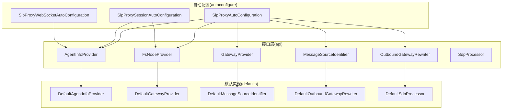
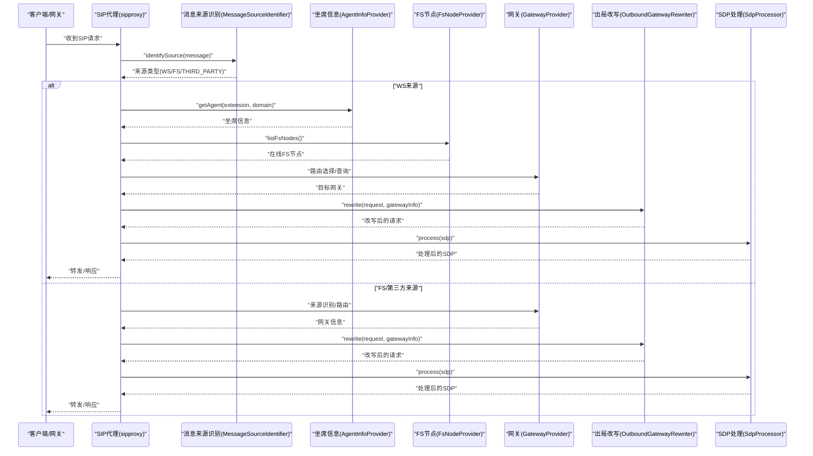
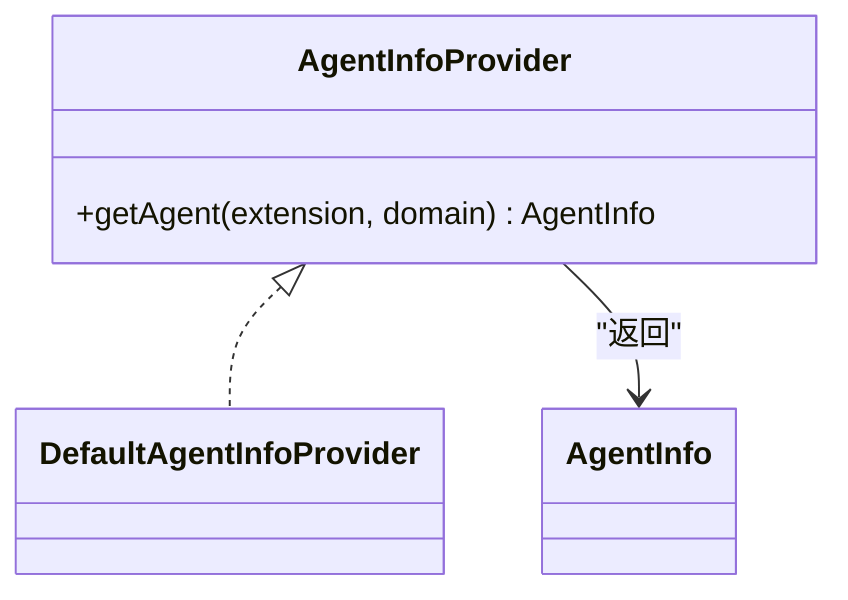
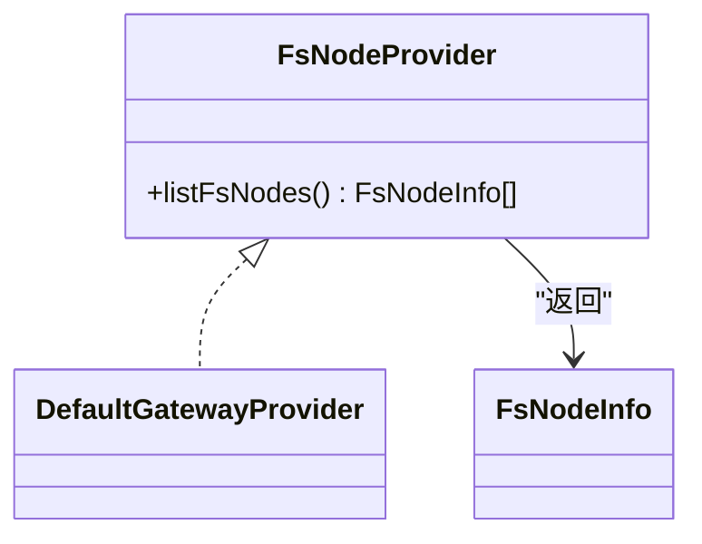
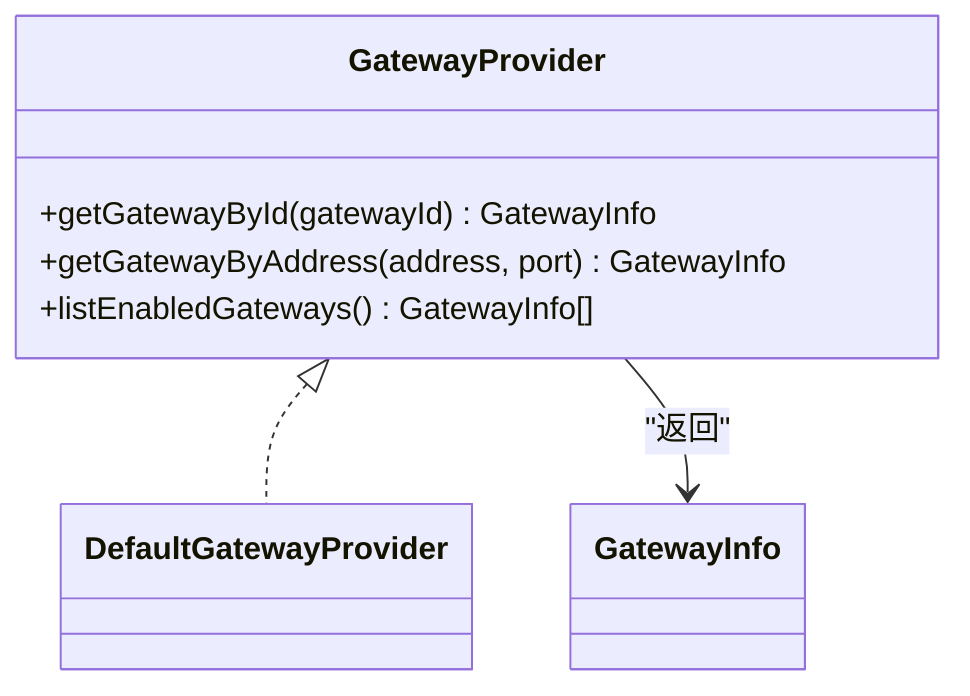
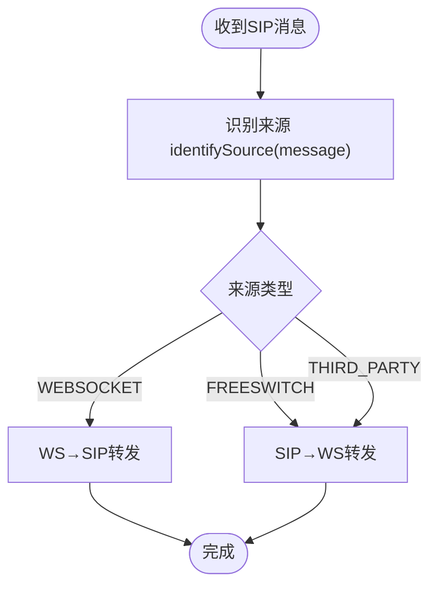
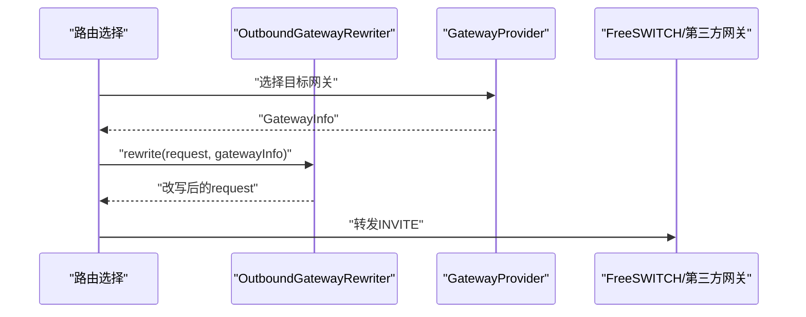
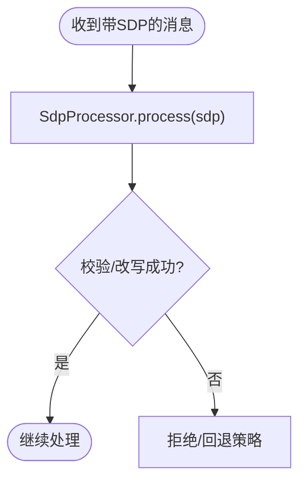
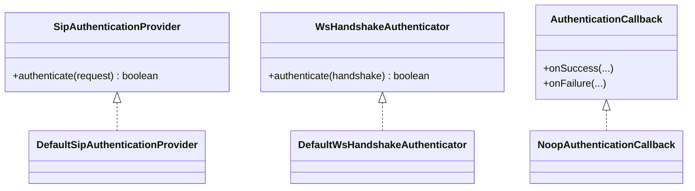
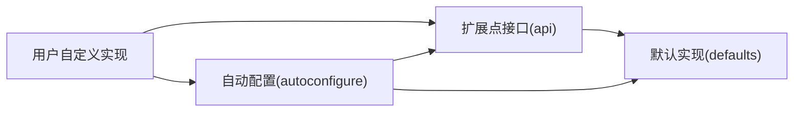

# 扩展点API设计

<cite>
**本文引用的文件**
- [AgentInfoProvider.java](file://yudao-cloud/yudao-module-cc/ipcc-sipproxy/src/main/java/cn/ipcc/sipproxy/api/agent/AgentInfoProvider.java)
- [FsNodeProvider.java](file://yudao-cloud/yudao-module-cc/ipcc-sipproxy/src/main/java/cn/ipcc/sipproxy/api/fs/FsNodeProvider.java)
- [GatewayProvider.java](file://yudao-cloud/yudao-module-cc/ipcc-sipproxy/src/main/java/cn/ipcc/sipproxy/api/gateway/GatewayProvider.java)
- [MessageSourceIdentifier.java](file://yudao-cloud/yudao-module-cc/ipcc-sipproxy/src/main/java/cn/ipcc/sipproxy/api/gateway/MessageSourceIdentifier.java)
- [OutboundGatewayRewriter.java](file://yudao-cloud/yudao-module-cc/ipcc-sipproxy/src/main/java/cn/ipcc/sipproxy/api/gateway/OutboundGatewayRewriter.java)
- [SdpProcessor.java](file://yudao-cloud/yudao-module-cc/ipcc-sipproxy/src/main/java/cn/ipcc/sipproxy/api/media/SdpProcessor.java)
- [DefaultAgentInfoProvider.java](file://yudao-cloud/yudao-module-cc/ipcc-sipproxy/src/main/java/cn/ipcc/sipproxy/defaults/agent/DefaultAgentInfoProvider.java)
- [DefaultGatewayProvider.java](file://yudao-cloud/yudao-module-cc/ipcc-sipproxy/src/main/java/cn/ipcc/sipproxy/defaults/gateway/DefaultGatewayProvider.java)
- [DefaultMessageSourceIdentifier.java](file://yudao-cloud/yudao-module-cc/ipcc-sipproxy/src/main/java/cn/ipcc/sipproxy/defaults/gateway/DefaultMessageSourceIdentifier.java)
- [DefaultOutboundGatewayRewriter.java](file://yudao-cloud/yudao-module-cc/ipcc-sipproxy/src/main/java/cn/ipcc/sipproxy/defaults/gateway/DefaultOutboundGatewayRewriter.java)
- [DefaultSdpProcessor.java](file://yudao-cloud/yudao-module-cc/ipcc-sipproxy/src/main/java/cn/ipcc/sipproxy/defaults/media/DefaultSdpProcessor.java)
- [NoopSipMessageInterceptor.java](file://yudao-cloud/yudao-module-cc/ipcc-sipproxy/src/main/java/cn/ipcc/sipproxy/defaults/interceptor/NoopSipMessageInterceptor.java)
- [DefaultSipAuthenticationProvider.java](file://yudao-cloud/yudao-module-cc/ipcc-sipproxy/src/main/java/cn/ipcc/sipproxy/defaults/authentication/DefaultSipAuthenticationProvider.java)
- [DefaultWsHandshakeAuthenticator.java](file://yudao-cloud/yudao-module-cc/ipcc-sipproxy/src/main/java/cn/ipcc/sipproxy/defaults/authentication/DefaultWsHandshakeAuthenticator.java)
- [SipProxyAutoConfiguration.java](file://yudao-cloud/yudao-module-cc/ipcc-sipproxy/src/main/java/cn/ipcc/sipproxy/autoconfigure/SipProxyAutoConfiguration.java)
- [SipProxySessionAutoConfiguration.java](file://yudao-cloud/yudao-module-cc/ipcc-sipproxy/src/main/java/cn/ipcc/sipproxy/autoconfigure/SipProxySessionAutoConfiguration.java)
- [SipProxyWebSocketAutoConfiguration.java](file://yudao-cloud/yudao-module-cc/ipcc-sipproxy/src/main/java/cn/ipcc/sipproxy/autoconfigure/SipProxyWebSocketAutoConfiguration.java)
- [AgentInfo.java](file://yudao-cloud/yudao-module-cc/ipcc-sipproxy/src/main/java/cn/ipcc/sipproxy/support/model/AgentInfo.java)
- [FsNodeInfo.java](file://yudao-cloud/yudao-module-cc/ipcc-sipproxy/src/main/java/cn/ipcc/sipproxy/support/model/FsNodeInfo.java)
- [GatewayInfo.java](file://yudao-cloud/yudao-module-cc/ipcc-sipproxy/src/main/java/cn/ipcc/sipproxy/support/model/GatewayInfo.java)
</cite>

## 目录
1. [简介](#简介)
2. [项目结构](#项目结构)
3. [核心组件](#核心组件)
4. [架构总览](#架构总览)
5. [详细组件分析](#详细组件分析)
6. [依赖关系分析](#依赖关系分析)
7. [性能考虑](#性能考虑)
8. [故障排查指南](#故障排查指南)
9. [结论](#结论)
10. [附录](#附录)

## 简介
本文件面向IPCC呼叫中心系统的扩展点API，系统化说明13个扩展点接口的设计理念、用途与默认实现，覆盖坐席信息、FS节点、网关路由、消息来源识别、出局信令改写、SDP处理、认证与会话等关键能力。文档同时给出条件装配注解@ConditionalOnMissingBean的使用方式、自定义扩展开发指南（如自定义认证提供者、消息拦截器、SDP处理器），并提供完整的接口规范、最佳实践建议与常见问题排查方法。

## 项目结构
sipproxy模块采用“接口在api包 + 默认实现在defaults包 + 自动配置在autoconfigure包”的分层组织方式：
- api：定义扩展点接口与数据模型（如AgentInfo、FsNodeInfo、GatewayInfo）
- defaults：提供开箱即用的默认实现，便于零配置运行
- autoconfigure：基于Spring Boot自动装配机制，按条件注入默认或用户自定义实现
- support：通用常量、错误码、异常与共享模型
- core：核心处理流程（请求/响应处理器、会话管理、转发器等）

图表来源
- [SipProxyAutoConfiguration.java](file://yudao-cloud/yudao-module-cc/ipcc-sipproxy/src/main/java/cn/ipcc/sipproxy/autoconfigure/SipProxyAutoConfiguration.java)
- [SipProxySessionAutoConfiguration.java](file://yudao-cloud/yudao-module-cc/ipcc-sipproxy/src/main/java/cn/ipcc/sipproxy/autoconfigure/SipProxySessionAutoConfiguration.java)
- [SipProxyWebSocketAutoConfiguration.java](file://yudao-cloud/yudao-module-cc/ipcc-sipproxy/src/main/java/cn/ipcc/sipproxy/autoconfigure/SipProxyWebSocketAutoConfiguration.java)
- [AgentInfoProvider.java](file://yudao-cloud/yudao-module-cc/ipcc-sipproxy/src/main/java/cn/ipcc/sipproxy/api/agent/AgentInfoProvider.java)
- [FsNodeProvider.java](file://yudao-cloud/yudao-module-cc/ipcc-sipproxy/src/main/java/cn/ipcc/sipproxy/api/fs/FsNodeProvider.java)
- [GatewayProvider.java](file://yudao-cloud/yudao-module-cc/ipcc-sipproxy/src/main/java/cn/ipcc/sipproxy/api/gateway/GatewayProvider.java)
- [MessageSourceIdentifier.java](file://yudao-cloud/yudao-module-cc/ipcc-sipproxy/src/main/java/cn/ipcc/sipproxy/api/gateway/MessageSourceIdentifier.java)
- [OutboundGatewayRewriter.java](file://yudao-cloud/yudao-module-cc/ipcc-sipproxy/src/main/java/cn/ipcc/sipproxy/api/gateway/OutboundGatewayRewriter.java)
- [SdpProcessor.java](file://yudao-cloud/yudao-module-cc/ipcc-sipproxy/src/main/java/cn/ipcc/sipproxy/api/media/SdpProcessor.java)

章节来源
- [AgentInfoProvider.java:1-23](file://yudao-cloud/yudao-module-cc/ipcc-sipproxy/src/main/java/cn/ipcc/sipproxy/api/agent/AgentInfoProvider.java#L1-L23)
- [FsNodeProvider.java:1-25](file://yudao-cloud/yudao-module-cc/ipcc-sipproxy/src/main/java/cn/ipcc/sipproxy/api/fs/FsNodeProvider.java#L1-L25)
- [GatewayProvider.java:1-42](file://yudao-cloud/yudao-module-cc/ipcc-sipproxy/src/main/java/cn/ipcc/sipproxy/api/gateway/GatewayProvider.java#L1-L42)
- [MessageSourceIdentifier.java:1-23](file://yudao-cloud/yudao-module-cc/ipcc-sipproxy/src/main/java/cn/ipcc/sipproxy/api/gateway/MessageSourceIdentifier.java#L1-L23)
- [OutboundGatewayRewriter.java:1-24](file://yudao-cloud/yudao-module-cc/ipcc-sipproxy/src/main/java/cn/ipcc/sipproxy/api/gateway/OutboundGatewayRewriter.java#L1-L24)
- [SdpProcessor.java](file://yudao-cloud/yudao-module-cc/ipcc-sipproxy/src/main/java/cn/ipcc/sipproxy/api/media/SdpProcessor.java)

## 核心组件
本节概述13个扩展点的设计目标与职责边界，帮助读者快速理解系统可扩展的关键切面。

- 坐席信息扩展点（AgentInfoProvider）
  - 目的：为INVITE/REGISTER等请求提供坐席元数据（显示名、租户归属等），避免sipproxy直接依赖业务服务
  - 典型调用：入呼/注册时解析分机号并查询坐席信息
  - 默认实现：DefaultAgentInfoProvider

- FS节点扩展点（FsNodeProvider）
  - 目的：返回在线FreeSWITCH节点列表，供信令转发选择目标
  - 约束：sipproxy仅做信令转发，不直连FS；ESL由父程序通过拦截器接入
  - 默认实现：DefaultGatewayProvider（作为FS节点查询的默认策略）

- 网关查询扩展点（GatewayProvider）
  - 目的：提供第三方SIP网关查询能力，用于出局路由与来源IP反查
  - 能力：按ID查询、按地址+端口查询、列出启用网关
  - 默认实现：DefaultGatewayProvider

- 消息来源识别扩展点（MessageSourceIdentifier）
  - 目的：识别SIP消息来源（WEBSOCKET / FREESWITCH / THIRD_PARTY），决定路由方向
  - 默认实现：DefaultMessageSourceIdentifier（基于User-Agent/Via IP）

- 出局信令改写扩展点（OutboundGatewayRewriter）
  - 目的：在选定目标网关后、转发前对INVITE头域进行改写（From/PAI/Authorization/Route/User-Agent等）
  - 默认实现：DefaultOutboundGatewayRewriter（标准6步改写）

- SDP处理扩展点（SdpProcessor）
  - 目的：对媒体协商SDP进行校验/改写，适配不同网关/终端要求
  - 默认实现：DefaultSdpProcessor

- 认证相关扩展点
  - SipAuthenticationProvider：SIP鉴权提供者（默认：DefaultSipAuthenticationProvider）
  - WsHandshakeAuthenticator：WebSocket握手鉴权（默认：DefaultWsHandshakeAuthenticator）
  - AuthenticationCallback：认证回调（默认：NoopAuthenticationCallback）

- 消息拦截扩展点（SipMessageInterceptor）
  - 目的：在信令处理链中插入拦截逻辑（审计、统计、规则校验等）
  - 默认实现：NoopSipMessageInterceptor（空操作）

- 安全与限流扩展点
  - IpWhitelist：IP白名单策略
  - SipRateLimiter：SIP请求速率限制

- 传输与追踪扩展点
  - SipMessageTransport：SIP消息传输抽象
  - TraceContext：链路追踪上下文

章节来源
- [AgentInfoProvider.java:1-23](file://yudao-cloud/yudao-module-cc/ipcc-sipproxy/src/main/java/cn/ipcc/sipproxy/api/agent/AgentInfoProvider.java#L1-L23)
- [FsNodeProvider.java:1-25](file://yudao-cloud/yudao-module-cc/ipcc-sipproxy/src/main/java/cn/ipcc/sipproxy/api/fs/FsNodeProvider.java#L1-L25)
- [GatewayProvider.java:1-42](file://yudao-cloud/yudao-module-cc/ipcc-sipproxy/src/main/java/cn/ipcc/sipproxy/api/gateway/GatewayProvider.java#L1-L42)
- [MessageSourceIdentifier.java:1-23](file://yudao-cloud/yudao-module-cc/ipcc-sipproxy/src/main/java/cn/ipcc/sipproxy/api/gateway/MessageSourceIdentifier.java#L1-L23)
- [OutboundGatewayRewriter.java:1-24](file://yudao-cloud/yudao-module-cc/ipcc-sipproxy/src/main/java/cn/ipcc/sipproxy/api/gateway/OutboundGatewayRewriter.java#L1-L24)
- [SdpProcessor.java](file://yudao-cloud/yudao-module-cc/ipcc-sipproxy/src/main/java/cn/ipcc/sipproxy/api/media/SdpProcessor.java)
- [DefaultSipAuthenticationProvider.java](file://yudao-cloud/yudao-module-cc/ipcc-sipproxy/src/main/java/cn/ipcc/sipproxy/defaults/authentication/DefaultSipAuthenticationProvider.java)
- [DefaultWsHandshakeAuthenticator.java](file://yudao-cloud/yudao-module-cc/ipcc-sipproxy/src/main/java/cn/ipcc/sipproxy/defaults/authentication/DefaultWsHandshakeAuthenticator.java)
- [NoopSipMessageInterceptor.java](file://yudao-cloud/yudao-module-cc/ipcc-sipproxy/src/main/java/cn/ipcc/sipproxy/defaults/interceptor/NoopSipMessageInterceptor.java)

## 架构总览
下图展示了扩展点在请求处理中的协作关系：消息来源识别决定路由方向；坐席/FS节点/网关查询支撑路由决策；出局前执行信令改写；媒体协商阶段由SDP处理器参与；认证与会话贯穿全流程。

图表来源
- [MessageSourceIdentifier.java:1-23](file://yudao-cloud/yudao-module-cc/ipcc-sipproxy/src/main/java/cn/ipcc/sipproxy/api/gateway/MessageSourceIdentifier.java#L1-L23)
- [AgentInfoProvider.java:1-23](file://yudao-cloud/yudao-module-cc/ipcc-sipproxy/src/main/java/cn/ipcc/sipproxy/api/agent/AgentInfoProvider.java#L1-L23)
- [FsNodeProvider.java:1-25](file://yudao-cloud/yudao-module-cc/ipcc-sipproxy/src/main/java/cn/ipcc/sipproxy/api/fs/FsNodeProvider.java#L1-L25)
- [GatewayProvider.java:1-42](file://yudao-cloud/yudao-module-cc/ipcc-sipproxy/src/main/java/cn/ipcc/sipproxy/api/gateway/GatewayProvider.java#L1-L42)
- [OutboundGatewayRewriter.java:1-24](file://yudao-cloud/yudao-module-cc/ipcc-sipproxy/src/main/java/cn/ipcc/sipproxy/api/gateway/OutboundGatewayRewriter.java#L1-L24)
- [SdpProcessor.java](file://yudao-cloud/yudao-module-cc/ipcc-sipproxy/src/main/java/cn/ipcc/sipproxy/api/media/SdpProcessor.java)

## 详细组件分析

### 坐席信息查询扩展点（AgentInfoProvider）
- 设计理念：将坐席元数据获取从sipproxy中解耦，避免对业务服务的强耦合
- 使用场景：INVITE/REGISTER时根据extension/domain查询坐席显示名、租户等
- 默认实现：DefaultAgentInfoProvider
- 扩展方式：实现AgentInfoProvider并在容器中注册；若未提供自定义实现，则使用默认实现
- 数据模型：AgentInfo（包含坐席标识、显示名、租户等信息）

图表来源
- [AgentInfoProvider.java:1-23](file://yudao-cloud/yudao-module-cc/ipcc-sipproxy/src/main/java/cn/ipcc/sipproxy/api/agent/AgentInfoProvider.java#L1-L23)
- [DefaultAgentInfoProvider.java](file://yudao-cloud/yudao-module-cc/ipcc-sipproxy/src/main/java/cn/ipcc/sipproxy/defaults/agent/DefaultAgentInfoProvider.java)
- [AgentInfo.java](file://yudao-cloud/yudao-module-cc/ipcc-sipproxy/src/main/java/cn/ipcc/sipproxy/support/model/AgentInfo.java)

章节来源
- [AgentInfoProvider.java:1-23](file://yudao-cloud/yudao-module-cc/ipcc-sipproxy/src/main/java/cn/ipcc/sipproxy/api/agent/AgentInfoProvider.java#L1-L23)
- [AgentInfo.java](file://yudao-cloud/yudao-module-cc/ipcc-sipproxy/src/main/java/cn/ipcc/sipproxy/support/model/AgentInfo.java)

### FS节点查询扩展点（FsNodeProvider）
- 设计理念：仅暴露在线FS节点列表，保持sipproxy只做信令转发，不直连FS
- 使用场景：选择SIP信令转发目标时遍历可用节点
- 默认实现：DefaultGatewayProvider（作为默认策略）
- 数据模型：FsNodeInfo（节点地址、状态等）

图表来源
- [FsNodeProvider.java:1-25](file://yudao-cloud/yudao-module-cc/ipcc-sipproxy/src/main/java/cn/ipcc/sipproxy/api/fs/FsNodeProvider.java#L1-L25)
- [DefaultGatewayProvider.java](file://yudao-cloud/yudao-module-cc/ipcc-sipproxy/src/main/java/cn/ipcc/sipproxy/defaults/gateway/DefaultGatewayProvider.java)
- [FsNodeInfo.java](file://yudao-cloud/yudao-module-cc/ipcc-sipproxy/src/main/java/cn/ipcc/sipproxy/support/model/FsNodeInfo.java)

章节来源
- [FsNodeProvider.java:1-25](file://yudao-cloud/yudao-module-cc/ipcc-sipproxy/src/main/java/cn/ipcc/sipproxy/api/fs/FsNodeProvider.java#L1-L25)
- [FsNodeInfo.java](file://yudao-cloud/yudao-module-cc/ipcc-sipproxy/src/main/java/cn/ipcc/sipproxy/support/model/FsNodeInfo.java)

### 网关查询扩展点（GatewayProvider）
- 设计理念：封装第三方SIP网关查询，支持出局路由与来源IP反查
- 能力：按ID查询、按地址+端口查询、列出启用网关
- 默认实现：DefaultGatewayProvider
- 数据模型：GatewayInfo（proxy、externalLineNumber、fromDomain、realm等）

图表来源
- [GatewayProvider.java:1-42](file://yudao-cloud/yudao-module-cc/ipcc-sipproxy/src/main/java/cn/ipcc/sipproxy/api/gateway/GatewayProvider.java#L1-L42)
- [DefaultGatewayProvider.java](file://yudao-cloud/yudao-module-cc/ipcc-sipproxy/src/main/java/cn/ipcc/sipproxy/defaults/gateway/DefaultGatewayProvider.java)
- [GatewayInfo.java](file://yudao-cloud/yudao-module-cc/ipcc-sipproxy/src/main/java/cn/ipcc/sipproxy/support/model/GatewayInfo.java)

章节来源
- [GatewayProvider.java:1-42](file://yudao-cloud/yudao-module-cc/ipcc-sipproxy/src/main/java/cn/ipcc/sipproxy/api/gateway/GatewayProvider.java#L1-L42)
- [GatewayInfo.java](file://yudao-cloud/yudao-module-cc/ipcc-sipproxy/src/main/java/cn/ipcc/sipproxy/support/model/GatewayInfo.java)

### 消息来源识别扩展点（MessageSourceIdentifier）
- 设计理念：统一识别SIP消息来源，驱动路由分发（WS→SIP或SIP→WS）
- 默认实现：DefaultMessageSourceIdentifier（基于User-Agent/Via IP）
- 返回值：WEBSOCKET / FREESWITCH / THIRD_PARTY

图表来源
- [MessageSourceIdentifier.java:1-23](file://yudao-cloud/yudao-module-cc/ipcc-sipproxy/src/main/java/cn/ipcc/sipproxy/api/gateway/MessageSourceIdentifier.java#L1-L23)
- [DefaultMessageSourceIdentifier.java](file://yudao-cloud/yudao-module-cc/ipcc-sipproxy/src/main/java/cn/ipcc/sipproxy/defaults/gateway/DefaultMessageSourceIdentifier.java)

章节来源
- [MessageSourceIdentifier.java:1-23](file://yudao-cloud/yudao-module-cc/ipcc-sipproxy/src/main/java/cn/ipcc/sipproxy/api/gateway/MessageSourceIdentifier.java#L1-L23)

### 出局信令改写扩展点（OutboundGatewayRewriter）
- 设计理念：在选定目标网关后、转发前对INVITE头域进行标准化改写
- 默认实现：DefaultOutboundGatewayRewriter（标准6步改写）
- 参数：Request（出局SIP请求）、GatewayInfo（目标网关信息）

图表来源
- [OutboundGatewayRewriter.java:1-24](file://yudao-cloud/yudao-module-cc/ipcc-sipproxy/src/main/java/cn/ipcc/sipproxy/api/gateway/OutboundGatewayRewriter.java#L1-L24)
- [DefaultOutboundGatewayRewriter.java](file://yudao-cloud/yudao-module-cc/ipcc-sipproxy/src/main/java/cn/ipcc/sipproxy/defaults/gateway/DefaultOutboundGatewayRewriter.java)
- [GatewayProvider.java:1-42](file://yudao-cloud/yudao-module-cc/ipcc-sipproxy/src/main/java/cn/ipcc/sipproxy/api/gateway/GatewayProvider.java#L1-L42)

章节来源
- [OutboundGatewayRewriter.java:1-24](file://yudao-cloud/yudao-module-cc/ipcc/sipproxy/src/main/java/cn/ipcc/sipproxy/api/gateway/OutboundGatewayRewriter.java#L1-L24)

### SDP处理扩展点（SdpProcessor）
- 设计理念：对媒体协商SDP进行校验/改写，适配不同网关/终端
- 默认实现：DefaultSdpProcessor
- 使用场景：INVITE/200 OK等携带SDP的消息处理

图表来源
- [SdpProcessor.java](file://yudao-cloud/yudao-module-cc/ipcc-sipproxy/src/main/java/cn/ipcc/sipproxy/api/media/SdpProcessor.java)
- [DefaultSdpProcessor.java](file://yudao-cloud/yudao-module-cc/ipcc-sipproxy/src/main/java/cn/ipcc/sipproxy/defaults/media/DefaultSdpProcessor.java)

章节来源
- [SdpProcessor.java](file://yudao-cloud/yudao-module-cc/ipcc-sipproxy/src/main/java/cn/ipcc/sipproxy/api/media/SdpProcessor.java)

### 认证与会话扩展点
- SIP认证提供者（SipAuthenticationProvider）
  - 默认实现：DefaultSipAuthenticationProvider
  - 用途：对SIP请求进行鉴权（如Digest认证）
- WebSocket握手认证（WsHandshakeAuthenticator）
  - 默认实现：DefaultWsHandshakeAuthenticator
  - 用途：对WebSocket握手进行鉴权
- 认证回调（AuthenticationCallback）
  - 默认实现：NoopAuthenticationCallback
  - 用途：认证结果回调钩子
- 会话管理
  - 通过SipProxySessionAutoConfiguration装配会话相关组件

图表来源
- [DefaultSipAuthenticationProvider.java](file://yudao-cloud/yudao-module-cc/ipcc-sipproxy/src/main/java/cn/ipcc/sipproxy/defaults/authentication/DefaultSipAuthenticationProvider.java)
- [DefaultWsHandshakeAuthenticator.java](file://yudao-cloud/yudao-module-cc/ipcc-sipproxy/src/main/java/cn/ipcc/sipproxy/defaults/authentication/DefaultWsHandshakeAuthenticator.java)
- [SipProxySessionAutoConfiguration.java](file://yudao-cloud/yudao-module-cc/ipcc-sipproxy/src/main/java/cn/ipcc/sipproxy/autoconfigure/SipProxySessionAutoConfiguration.java)

章节来源
- [DefaultSipAuthenticationProvider.java](file://yudao-cloud/yudao-module-cc/ipcc-sipproxy/src/main/java/cn/ipcc/sipproxy/defaults/authentication/DefaultSipAuthenticationProvider.java)
- [DefaultWsHandshakeAuthenticator.java](file://yudao-cloud/yudao-module-cc/ipcc-sipproxy/src/main/java/cn/ipcc/sipproxy/defaults/authentication/DefaultWsHandshakeAuthenticator.java)
- [SipProxySessionAutoConfiguration.java](file://yudao-cloud/yudao-module-cc/ipcc-sipproxy/src/main/java/cn/ipcc/sipproxy/autoconfigure/SipProxySessionAutoConfiguration.java)

### 消息拦截扩展点（SipMessageInterceptor）
- 默认实现：NoopSipMessageInterceptor（空操作）
- 用途：在信令处理链中插入审计、统计、规则校验等逻辑
- 扩展方式：实现SipMessageInterceptor并在容器中注册；若未提供自定义实现，则使用空操作实现

章节来源
- [NoopSipMessageInterceptor.java](file://yudao-cloud/yudao-module-cc/ipcc-sipproxy/src/main/java/cn/ipcc/sipproxy/defaults/interceptor/NoopSipMessageInterceptor.java)

## 依赖关系分析
- 接口与默认实现的松耦合：所有扩展点以接口形式暴露，默认实现位于defaults包，便于替换
- 自动装配：autoconfigure包通过Spring Boot自动装配机制，按条件注入默认或用户自定义实现
- 条件装配注解@ConditionalOnMissingBean：当容器中存在用户自定义实现时，优先使用用户实现；否则加载默认实现，确保可插拔性

图表来源
- [SipProxyAutoConfiguration.java](file://yudao-cloud/yudao-module-cc/ipcc-sipproxy/src/main/java/cn/ipcc/sipproxy/autoconfigure/SipProxyAutoConfiguration.java)
- [SipProxySessionAutoConfiguration.java](file://yudao-cloud/yudao-module-cc/ipcc-sipproxy/src/main/java/cn/ipcc/sipproxy/autoconfigure/SipProxySessionAutoConfiguration.java)
- [SipProxyWebSocketAutoConfiguration.java](file://yudao-cloud/yudao-module-cc/ipcc-sipproxy/src/main/java/cn/ipcc/sipproxy/autoconfigure/SipProxyWebSocketAutoConfiguration.java)

章节来源
- [SipProxyAutoConfiguration.java](file://yudao-cloud/yudao-module-cc/ipcc-sipproxy/src/main/java/cn/ipcc/sipproxy/autoconfigure/SipProxyAutoConfiguration.java)
- [SipProxySessionAutoConfiguration.java](file://yudao-cloud/yudao-module-cc/ipcc-sipproxy/src/main/java/cn/ipcc/sipproxy/autoconfigure/SipProxySessionAutoConfiguration.java)
- [SipProxyWebSocketAutoConfiguration.java](file://yudao-cloud/yudao-module-cc/ipcc-sipproxy/src/main/java/cn/ipcc/sipproxy/autoconfigure/SipProxyWebSocketAutoConfiguration.java)

## 性能考虑
- 缓存策略：GatewayProvider与FsNodeProvider的查询结果可结合外部缓存（如Redis）降低数据库压力
- 并发控制：SipRateLimiter可对高频请求进行限流，防止雪崩
- 连接池：与下游网关/FS的连接应使用连接池，减少握手开销
- 异步处理：长耗时操作（如远程鉴权）建议使用异步/回调模式，避免阻塞主线程
- 日志与监控：通过TraceContext与拦截器记录关键路径指标，便于定位瓶颈

[本节为通用指导，无需特定文件来源]

## 故障排查指南
- 无可用FS节点
  - 现象：listFsNodes返回空列表，导致无法转发
  - 排查：检查FsNodeProvider实现是否正确返回在线节点；确认FS服务状态
- 网关查询失败
  - 现象：GatewayProvider.getGatewayById/getGatewayByAddress返回null
  - 排查：核对网关配置是否启用；检查地址/端口匹配逻辑
- 消息来源识别错误
  - 现象：路由方向错误（WS→SIP误判为SIP→WS）
  - 排查：检查MessageSourceIdentifier实现；确认User-Agent/Via字段是否符合预期
- 出局信令改写异常
  - 现象：From/PAI/Authorization等头域不符合网关要求
  - 排查：检查OutboundGatewayRewriter实现；确认GatewayInfo参数正确
- SDP协商失败
  - 现象：媒体建立失败
  - 排查：检查SdpProcessor实现；确认SDP格式与网关兼容性
- 认证失败
  - 现象：SIP/WSS握手被拒绝
  - 排查：检查SipAuthenticationProvider/WsHandshakeAuthenticator实现；确认凭据与策略

章节来源
- [DefaultGatewayProvider.java](file://yudao-cloud/yudao-module-cc/ipcc-sipproxy/src/main/java/cn/ipcc/sipproxy/defaults/gateway/DefaultGatewayProvider.java)
- [DefaultMessageSourceIdentifier.java](file://yudao-cloud/yudao-module-cc/ipcc-sipproxy/src/main/java/cn/ipcc/sipproxy/defaults/gateway/DefaultMessageSourceIdentifier.java)
- [DefaultOutboundGatewayRewriter.java](file://yudao-cloud/yudao-module-cc/ipcc-sipproxy/src/main/java/cn/ipcc/sipproxy/defaults/gateway/DefaultOutboundGatewayRewriter.java)
- [DefaultSdpProcessor.java](file://yudao-cloud/yudao-module-cc/ipcc-sipproxy/src/main/java/cn/ipcc/sipproxy/defaults/media/DefaultSdpProcessor.java)
- [DefaultSipAuthenticationProvider.java](file://yudao-cloud/yudao-module-cc/ipcc-sipproxy/src/main/java/cn/ipcc/sipproxy/defaults/authentication/DefaultSipAuthenticationProvider.java)
- [DefaultWsHandshakeAuthenticator.java](file://yudao-cloud/yudao-module-cc/ipcc-sipproxy/src/main/java/cn/ipcc/sipproxy/defaults/authentication/DefaultWsHandshakeAuthenticator.java)

## 结论
本扩展点体系通过接口抽象与默认实现分离，结合Spring Boot自动装配与@ConditionalOnMissingBean条件装配，实现了高内聚、低耦合的可插拔架构。开发者可按需替换或增强各扩展点，满足多样化业务需求。建议在扩展实现中注重性能、可观测性与健壮性，遵循最小权限与防御式编程原则。

[本节为总结，无需特定文件来源]

## 附录

### 扩展点清单与用途速览
- AgentInfoProvider：坐席信息查询（INVITE/REGISTER）
- FsNodeProvider：在线FS节点列表（信令转发目标选择）
- GatewayProvider：第三方SIP网关查询（出局路由/来源识别）
- MessageSourceIdentifier：消息来源识别（路由分发）
- OutboundGatewayRewriter：出局信令改写（头域标准化）
- SdpProcessor：SDP处理（媒体协商）
- SipAuthenticationProvider：SIP鉴权
- WsHandshakeAuthenticator：WebSocket握手鉴权
- AuthenticationCallback：认证回调
- SipMessageInterceptor：信令拦截（审计/统计/规则）
- IpWhitelist：IP白名单
- SipRateLimiter：速率限制
- SipMessageTransport：传输抽象
- TraceContext：链路追踪

### 自定义扩展开发指南
- 自定义认证提供者
  - 步骤：实现SipAuthenticationProvider或WsHandshakeAuthenticator；在容器中注册Bean；利用@ConditionalOnMissingBean确保优先级
  - 注意：保证鉴权逻辑幂等与超时控制；记录认证结果以便审计
- 自定义消息拦截器
  - 步骤：实现SipMessageInterceptor；在容器中注册Bean；关注拦截时机与异常处理
  - 注意：避免阻塞主流程；必要时异步处理
- 自定义SDP处理器
  - 步骤：实现SdpProcessor；在容器中注册Bean；确保SDP格式兼容
  - 注意：对不支持的媒体类型进行回退或拒绝；记录变更日志

### 最佳实践建议
- 接口优先：始终通过接口调用，避免硬编码实现类
- 条件装配：使用@ConditionalOnMissingBean确保可替换性
- 防御式编程：对空值、异常进行妥善处理；提供合理的默认行为
- 可观测性：通过TraceContext与拦截器记录关键指标
- 性能优化：缓存热点数据；使用连接池；异步处理长耗时操作

[本节为通用指导，无需特定文件来源]