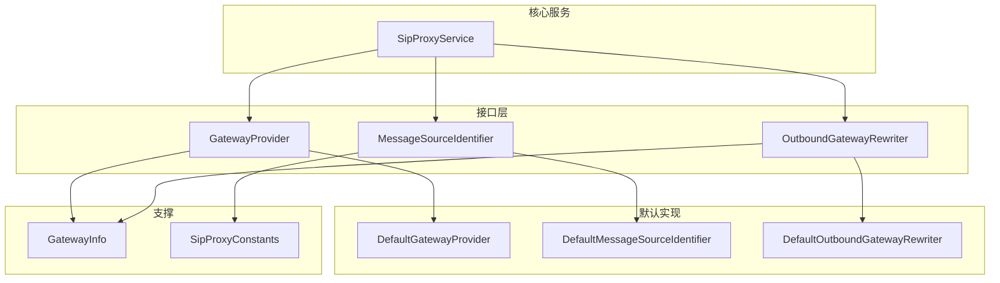
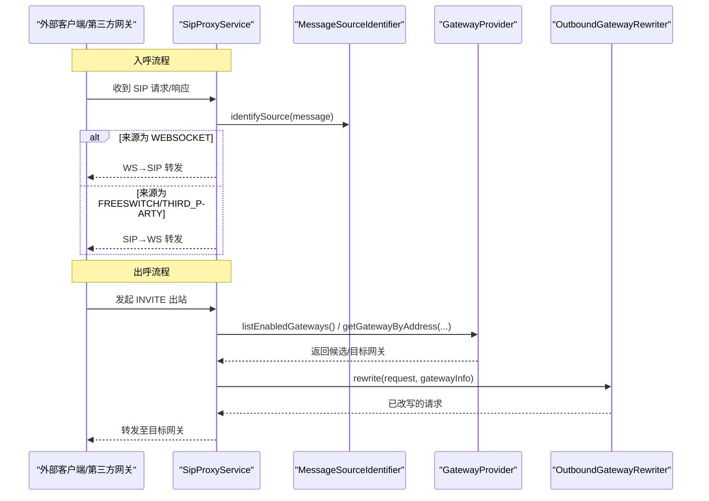
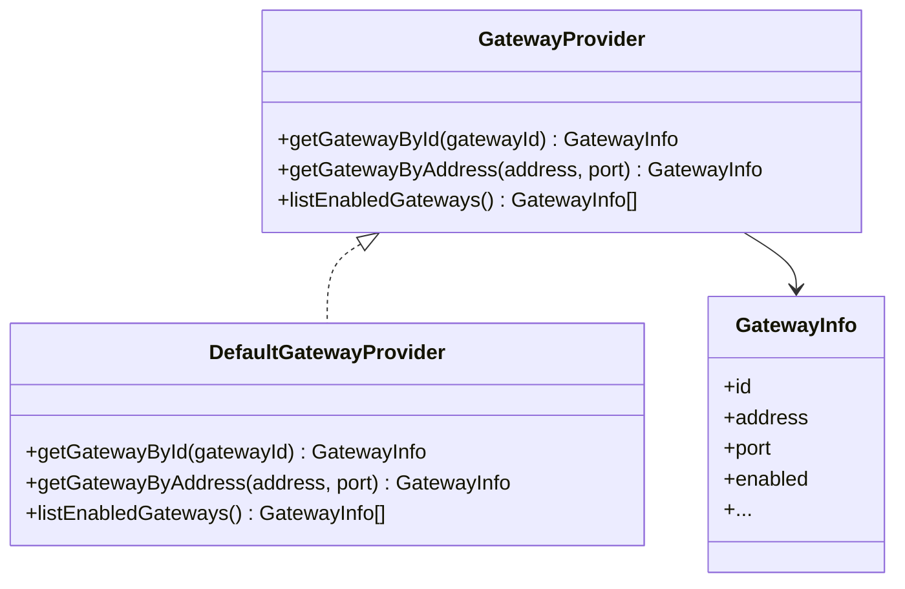
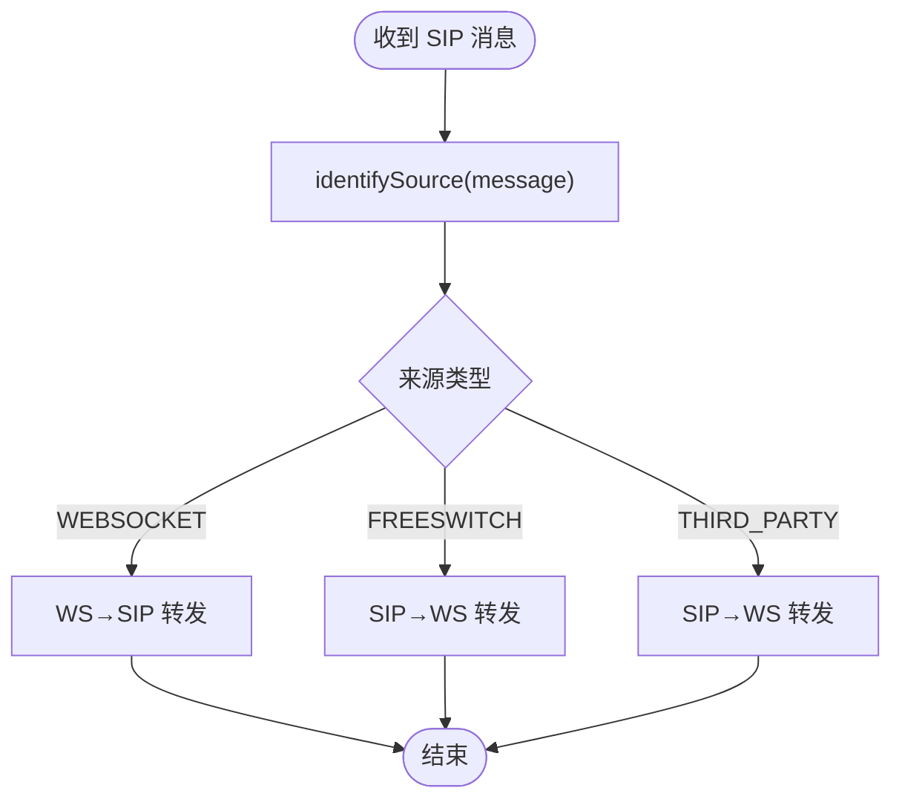
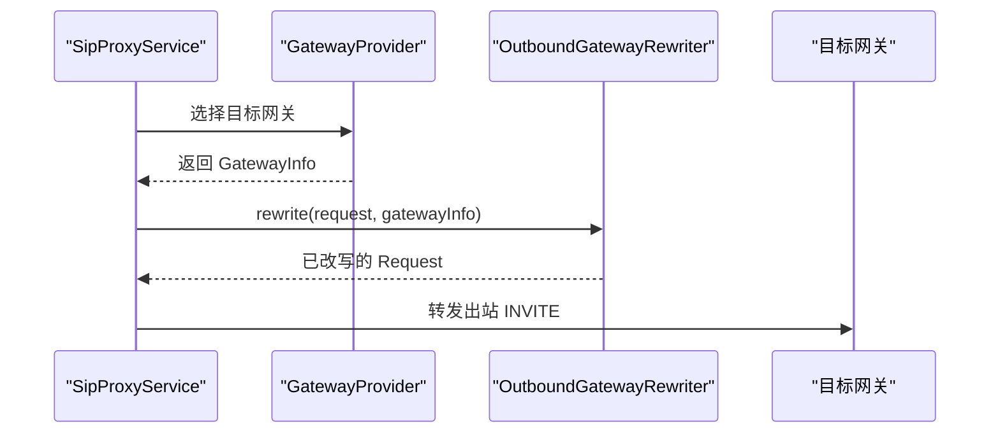
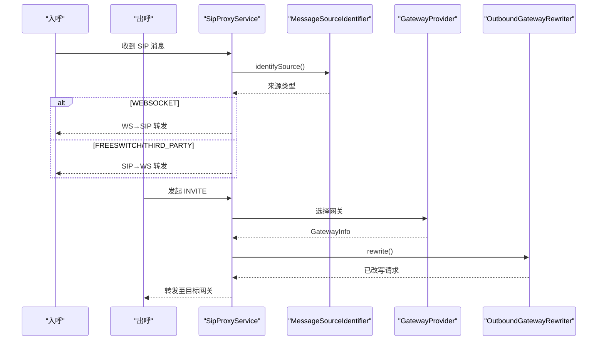
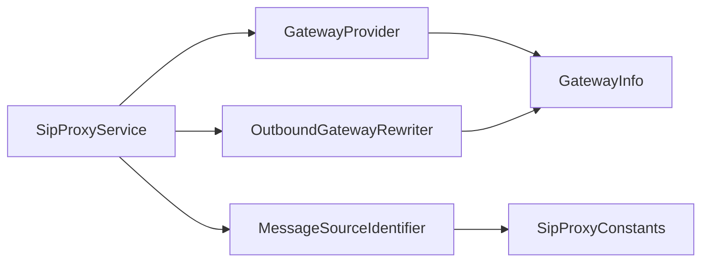

# 网关相关接口

<cite>
**本文引用的文件**
- [GatewayProvider.java](file://yudao-cloud/yudao-module-cc/ipcc-sipproxy/src/main/java/cn/ipcc/sipproxy/api/gateway/GatewayProvider.java)
- [MessageSourceIdentifier.java](file://yudao-cloud/yudao-module-cc/ipcc-sipproxy/src/main/java/cn/ipcc/sipproxy/api/gateway/MessageSourceIdentifier.java)
- [OutboundGatewayRewriter.java](file://yudao-cloud/yudao-module-cc/ipcc-sipproxy/src/main/java/cn/ipcc/sipproxy/api/gateway/OutboundGatewayRewriter.java)
- [DefaultGatewayProvider.java](file://yudao-cloud/yudao-module-cc/ipcc-sipproxy/src/main/java/cn/ipcc/sipproxy/defaults/gateway/DefaultGatewayProvider.java)
- [DefaultMessageSourceIdentifier.java](file://yudao-cloud/yudao-module-cc/ipcc-sipproxy/src/main/java/cn/ipcc/sipproxy/defaults/gateway/DefaultMessageSourceIdentifier.java)
- [DefaultOutboundGatewayRewriter.java](file://yudao-cloud/yudao-module-cc/ipcc-sipproxy/src/main/java/cn/ipcc/sipproxy/defaults/gateway/DefaultOutboundGatewayRewriter.java)
- [SipProxyService.java](file://yudao-cloud/yudao-module-cc/ipcc-sipproxy/src/main/java/cn/ipcc/sipproxy/core/SipProxyService.java)
- [SipProxyConstants.java](file://yudao-cloud/yudao-module-cc/ipcc-sipproxy/src/main/java/cn/ipcc/sipproxy/support/SipProxyConstants.java)
- [GatewayInfo.java](file://yudao-cloud/yudao-module-cc/ipcc-sipproxy/src/main/java/cn/ipcc/sipproxy/support/model/GatewayInfo.java)
</cite>

## 目录
1. [简介](#简介)
2. [项目结构](#项目结构)
3. [核心组件](#核心组件)
4. [架构总览](#架构总览)
5. [详细组件分析](#详细组件分析)
6. [依赖关系分析](#依赖关系分析)
7. [性能考虑](#性能考虑)
8. [故障排查指南](#故障排查指南)
9. [结论](#结论)
10. [附录](#附录)

## 简介
本文件面向 SIP 网关扩展点，围绕三个关键接口 GatewayProvider、MessageSourceIdentifier、OutboundGatewayRewriter 进行系统化说明。文档解释其设计理念、职责边界、协作关系与调用时序，并给出自定义网关适配器的开发指南，覆盖网关注册、消息来源识别、出站消息重写等能力。同时提供配置、路由策略与消息转换的完整实现思路与示例路径，帮助快速集成与扩展。

## 项目结构
该功能位于 CC 模块的 SIP Proxy 子工程中，采用“接口 + 默认实现”的扩展模式：
- 接口定义在 api/gateway 包下，用于解耦父程序与 sipproxy 的数据访问与业务逻辑。
- 默认实现在 defaults/gateway 包下，提供开箱即用的行为。
- 运行时由 SipProxyService 协调各扩展点完成入呼/出呼处理。
- 常量与模型在 support 包中提供（如来源类型常量、网关信息模型）。

图表来源
- [GatewayProvider.java:1-42](file://yudao-cloud/yudao-module-cc/ipcc-sipproxy/src/main/java/cn/ipcc/sipproxy/api/gateway/GatewayProvider.java#L1-L42)
- [MessageSourceIdentifier.java:1-23](file://yudao-cloud/yudao-module-cc/ipcc-sipproxy/src/main/java/cn/ipcc/sipproxy/api/gateway/MessageSourceIdentifier.java#L1-L23)
- [OutboundGatewayRewriter.java:1-24](file://yudao-cloud/yudao-module-cc/ipcc-sipproxy/src/main/java/cn/ipcc/sipproxy/api/gateway/OutboundGatewayRewriter.java#L1-L24)
- [DefaultGatewayProvider.java](file://yudao-cloud/yudao-module-cc/ipcc-sipproxy/src/main/java/cn/ipcc/sipproxy/defaults/gateway/DefaultGatewayProvider.java)
- [DefaultMessageSourceIdentifier.java](file://yudao-cloud/yudao-module-cc/ipcc-sipproxy/src/main/java/cn/ipcc/sipproxy/defaults/gateway/DefaultMessageSourceIdentifier.java)
- [DefaultOutboundGatewayRewriter.java](file://yudao-cloud/yudao-module-cc/ipcc-sipproxy/src/main/java/cn/ipcc/sipproxy/defaults/gateway/DefaultOutboundGatewayRewriter.java)
- [SipProxyService.java](file://yudao-cloud/yudao-module-cc/ipcc-sipproxy/src/main/java/cn/ipcc/sipproxy/core/SipProxyService.java)
- [GatewayInfo.java](file://yudao-cloud/yudao-module-cc/ipcc-sipproxy/src/main/java/cn/ipcc/sipproxy/support/model/GatewayInfo.java)
- [SipProxyConstants.java](file://yudao-cloud/yudao-module-cc/ipcc-sipproxy/src/main/java/cn/ipcc/sipproxy/support/SipProxyConstants.java)

章节来源
- [GatewayProvider.java:1-42](file://yudao-cloud/yudao-module-cc/ipcc-sipproxy/src/main/java/cn/ipcc/sipproxy/api/gateway/GatewayProvider.java#L1-L42)
- [MessageSourceIdentifier.java:1-23](file://yudao-cloud/yudao-module-cc/ipcc-sipproxy/src/main/java/cn/ipcc/sipproxy/api/gateway/MessageSourceIdentifier.java#L1-L23)
- [OutboundGatewayRewriter.java:1-24](file://yudao-cloud/yudao-module-cc/ipcc/sipproxy/src/main/java/cn/ipcc/sipproxy/api/gateway/OutboundGatewayRewriter.java#L1-L24)

## 核心组件
- GatewayProvider：网关查询扩展点，负责按 ID、地址+端口查询网关，以及列出所有启用网关。用于出局 INVITE 路由选择与入呼来源反查。
- MessageSourceIdentifier：消息来源识别扩展点，根据 SIP 消息判断来源为 WEBSOCKET、FREESWITCH 或 THIRD_PARTY，决定后续转发方向。
- OutboundGatewayRewriter：出站信令改写扩展点，在选定目标网关后、转发前对请求头域进行改写（From、Contact、PAI、Authorization、Route、User-Agent 等）。

章节来源
- [GatewayProvider.java:1-42](file://yudao-cloud/yudao-module-cc/ipcc-sipproxy/src/main/java/cn/ipcc/sipproxy/api/gateway/GatewayProvider.java#L1-L42)
- [MessageSourceIdentifier.java:1-23](file://yudao-cloud/yudao-module-cc/ipcc-sipproxy/src/main/java/cn/ipcc/sipproxy/api/gateway/MessageSourceIdentifier.java#L1-L23)
- [OutboundGatewayRewriter.java:1-24](file://yudao-cloud/yudao-module-cc/ipcc-sipproxy/src/main/java/cn/ipcc/sipproxy/api/gateway/OutboundGatewayRewriter.java#L1-L24)

## 架构总览
SIP 消息进入后，系统先识别来源，再依据来源进行不同转发路径；出局时通过网关提供者选择目标网关，并在转发前执行出站改写。

图表来源
- [SipProxyService.java](file://yudao-cloud/yudao-module-cc/ipcc-sipproxy/src/main/java/cn/ipcc/sipproxy/core/SipProxyService.java)
- [MessageSourceIdentifier.java:1-23](file://yudao-cloud/yudao-module-cc/ipcc-sipproxy/src/main/java/cn/ipcc/sipproxy/api/gateway/MessageSourceIdentifier.java#L1-L23)
- [GatewayProvider.java:1-42](file://yudao-cloud/yudao-module-cc/ipcc-sipproxy/src/main/java/cn/ipcc/sipproxy/api/gateway/GatewayProvider.java#L1-L42)
- [OutboundGatewayRewriter.java:1-24](file://yudao-cloud/yudao-module-cc/ipcc-sipproxy/src/main/java/cn/ipcc/sipproxy/api/gateway/OutboundGatewayRewriter.java#L1-L24)

## 详细组件分析

### GatewayProvider 与 DefaultGatewayProvider
- 设计目标：将“网关数据源”从 sipproxy 中抽离，避免直接耦合父程序的数据访问层。
- 主要职责：
  - 按网关 ID 查询：用于路由命中后的精确匹配。
  - 按地址+端口查询：用于入呼来源识别时的反向查找（例如识别 THIRD_PARTY 来源）。
  - 列出启用网关：用于路由候选集构建与遍历。
- 默认实现：提供基于内存/配置的默认查询逻辑，便于无外部依赖时运行。
- 复杂度与性能：
  - 列表查询通常为 O(n)，建议上层缓存结果并按需刷新。
  - 按地址查询可结合索引或哈希表优化到近似 O(1)。
- 错误处理：不存在或禁用时返回空值，调用方需做空判断。

图表来源
- [GatewayProvider.java:1-42](file://yudao-cloud/yudao-module-cc/ipcc-sipproxy/src/main/java/cn/ipcc/sipproxy/api/gateway/GatewayProvider.java#L1-L42)
- [DefaultGatewayProvider.java](file://yudao-cloud/yudao-module-cc/ipcc-sipproxy/src/main/java/cn/ipcc/sipproxy/defaults/gateway/DefaultGatewayProvider.java)
- [GatewayInfo.java](file://yudao-cloud/yudao-module-cc/ipcc-sipproxy/src/main/java/cn/ipcc/sipproxy/support/model/GatewayInfo.java)

章节来源
- [GatewayProvider.java:1-42](file://yudao-cloud/yudao-module-cc/ipcc-sipproxy/src/main/java/cn/ipcc/sipproxy/api/gateway/GatewayProvider.java#L1-L42)
- [DefaultGatewayProvider.java](file://yudao-cloud/yudao-module-cc/ipcc-sipproxy/src/main/java/cn/ipcc/sipproxy/defaults/gateway/DefaultGatewayProvider.java)

### MessageSourceIdentifier 与 DefaultMessageSourceIdentifier
- 设计目标：将“消息来源识别”抽象为可扩展策略，支持不同接入环境下的差异化识别。
- 主要职责：
  - 识别 SIP 消息来源为 WEBSOCKET、FREESWITCH 或 THIRD_PARTY。
  - 依据来源决定后续转发方向（WS↔SIP）。
- 默认实现：基于 User-Agent/Via IP 等常见字段进行识别。
- 使用场景：
  - 入呼到达时，快速分流到 WS→SIP 或 SIP→WS 分支。
  - 与 GatewayProvider 配合，通过来源 IP 反查网关以确认 THIRD_PARTY。

图表来源
- [MessageSourceIdentifier.java:1-23](file://yudao-cloud/yudao-module-cc/ipcc-sipproxy/src/main/java/cn/ipcc/sipproxy/api/gateway/MessageSourceIdentifier.java#L1-L23)
- [DefaultMessageSourceIdentifier.java](file://yudao-cloud/yudao-module-cc/ipcc-sipproxy/src/main/java/cn/ipcc/sipproxy/defaults/gateway/DefaultMessageSourceIdentifier.java)
- [SipProxyConstants.java](file://yudao-cloud/yudao-module-cc/ipcc-sipproxy/src/main/java/cn/ipcc/sipproxy/support/SipProxyConstants.java)

章节来源
- [MessageSourceIdentifier.java:1-23](file://yudao-cloud/yudao-module-cc/ipcc-sipproxy/src/main/java/cn/ipcc/sipproxy/api/gateway/MessageSourceIdentifier.java#L1-L23)
- [DefaultMessageSourceIdentifier.java](file://yudao-cloud/yudao-module-cc/ipcc-sipproxy/src/main/java/cn/ipcc/sipproxy/defaults/gateway/DefaultMessageSourceIdentifier.java)

### OutboundGatewayRewriter 与 DefaultOutboundGatewayRewriter
- 设计目标：将“出站信令改写”与路由选择解耦，允许针对不同网关定制头部改写策略。
- 主要职责：
  - 在选定目标网关后、转发前，对请求头域进行改写（From、Contact、PAI、Authorization、Route、User-Agent 等）。
  - 使用 GatewayInfo 中的 proxy、externalLineNumber、fromDomain、realm 等参数指导改写。
- 默认实现：执行标准六步改写流程，满足大多数场景。
- 典型用法：
  - 统一 From/Contact 显示号码与域名。
  - 注入 PAI/Authorization 以满足第三方鉴权要求。
  - 设置 Route/User-Agent 以兼容不同网关行为。

图表来源
- [OutboundGatewayRewriter.java:1-24](file://yudao-cloud/yudao-module-cc/ipcc-sipproxy/src/main/java/cn/ipcc/sipproxy/api/gateway/OutboundGatewayRewriter.java#L1-L24)
- [DefaultOutboundGatewayRewriter.java](file://yudao-cloud/yudao-module-cc/ipcc-sipproxy/src/main/java/cn/ipcc/sipproxy/defaults/gateway/DefaultOutboundGatewayRewriter.java)
- [GatewayProvider.java:1-42](file://yudao-cloud/yudao-module-cc/ipcc-sipproxy/src/main/java/cn/ipcc/sipproxy/api/gateway/GatewayProvider.java#L1-L42)

章节来源
- [OutboundGatewayRewriter.java:1-24](file://yudao-cloud/yudao-module-cc/ipcc-sipproxy/src/main/java/cn/ipcc/sipproxy/api/gateway/OutboundGatewayRewriter.java#L1-L24)
- [DefaultOutboundGatewayRewriter.java](file://yudao-cloud/yudao-module-cc/ipcc-sipproxy/src/main/java/cn/ipcc/sipproxy/defaults/gateway/DefaultOutboundGatewayRewriter.java)

### 协作关系与时序
- 入呼：SipProxyService 接收消息 → 调用 MessageSourceIdentifier 识别来源 → 根据来源决定 WS↔SIP 转发路径。
- 出呼：SipProxyService 选择目标网关（GatewayProvider） → 调用 OutboundGatewayRewriter 改写请求 → 转发至目标网关。
- 关键点：
  - 来源识别与网关查询相互独立，但可通过来源 IP 反查网关（THIRD_PARTY）。
  - 出站改写仅在选定目标网关后进行，确保改写参数准确。

图表来源
- [SipProxyService.java](file://yudao-cloud/yudao-module-cc/ipcc-sipproxy/src/main/java/cn/ipcc/sipproxy/core/SipProxyService.java)
- [MessageSourceIdentifier.java:1-23](file://yudao-cloud/yudao-module-cc/ipcc-sipproxy/src/main/java/cn/ipcc/sipproxy/api/gateway/MessageSourceIdentifier.java#L1-L23)
- [GatewayProvider.java:1-42](file://yudao-cloud/yudao-module-cc/ipcc-sipproxy/src/main/java/cn/ipcc/sipproxy/api/gateway/GatewayProvider.java#L1-L42)
- [OutboundGatewayRewriter.java:1-24](file://yudao-cloud/yudao-module-cc/ipcc-sipproxy/src/main/java/cn/ipcc/sipproxy/api/gateway/OutboundGatewayRewriter.java#L1-L24)

## 依赖关系分析
- 松耦合：接口与默认实现分离，父程序只需实现接口即可替换默认行为。
- 低内聚高内聚：每个接口职责单一，便于测试与维护。
- 外部依赖：仅依赖 javax.sip.message 与内部模型/常量，避免引入重型框架。
- 潜在循环：接口之间无直接依赖，均通过 SipProxyService 组合使用，降低耦合风险。

图表来源
- [SipProxyService.java](file://yudao-cloud/yudao-module-cc/ipcc-sipproxy/src/main/java/cn/ipcc/sipproxy/core/SipProxyService.java)
- [GatewayProvider.java:1-42](file://yudao-cloud/yudao-module-cc/ipcc-sipproxy/src/main/java/cn/ipcc/sipproxy/api/gateway/GatewayProvider.java#L1-L42)
- [MessageSourceIdentifier.java:1-23](file://yudao-cloud/yudao-module-cc/ipcc-sipproxy/src/main/java/cn/ipcc/sipproxy/api/gateway/MessageSourceIdentifier.java#L1-L23)
- [OutboundGatewayRewriter.java:1-24](file://yudao-cloud/yudao-module-cc/ipcc-sipproxy/src/main/java/cn/ipcc/sipproxy/api/gateway/OutboundGatewayRewriter.java#L1-L24)
- [GatewayInfo.java](file://yudao-cloud/yudao-module-cc/ipcc-sipproxy/src/main/java/cn/ipcc/sipproxy/support/model/GatewayInfo.java)
- [SipProxyConstants.java](file://yudao-cloud/yudao-module-cc/ipcc-sipproxy/src/main/java/cn/ipcc/sipproxy/support/SipProxyConstants.java)

## 性能考虑
- 网关列表缓存：GatewayProvider.listEnabledGateways() 建议在上层缓存并按变更事件刷新，减少频繁 IO。
- 地址反查优化：getGatewayByAddress() 可使用哈希表或索引提升命中率。
- 改写开销控制：OutboundGatewayRewriter 应避免复杂计算，必要时缓存改写模板。
- 来源识别轻量：MessageSourceIdentifier 应优先基于已有头域快速判断，避免额外网络或数据库调用。

## 故障排查指南
- 来源识别失败：检查 MessageSourceIdentifier 实现是否覆盖了必要字段（User-Agent/Via），并核对 SipProxyConstants 的取值。
- 网关未命中：确认 GatewayProvider 是否正确返回启用网关，且地址/端口与入呼来源一致。
- 出站改写异常：验证 OutboundGatewayRewriter 中对 From/Contact/PAI/Authorization/Route/User-Agent 的修改是否符合目标网关要求。
- 日志定位：在 SipProxyService 的关键调用点增加日志，跟踪来源识别、网关选择与改写过程。

章节来源
- [MessageSourceIdentifier.java:1-23](file://yudao-cloud/yudao-module-cc/ipcc-sipproxy/src/main/java/cn/ipcc/sipproxy/api/gateway/MessageSourceIdentifier.java#L1-L23)
- [GatewayProvider.java:1-42](file://yudao-cloud/yudao-module-cc/ipcc-sipproxy/src/main/java/cn/ipcc/sipproxy/api/gateway/GatewayProvider.java#L1-L42)
- [OutboundGatewayRewriter.java:1-24](file://yudao-cloud/yudao-module-cc/ipcc-sipproxy/src/main/java/cn/ipcc/sipproxy/api/gateway/OutboundGatewayRewriter.java#L1-L24)
- [SipProxyService.java](file://yudao-cloud/yudao-module-cc/ipcc-sipproxy/src/main/java/cn/ipcc/sipproxy/core/SipProxyService.java)

## 结论
GatewayProvider、MessageSourceIdentifier、OutboundGatewayRewriter 构成了 SIP 网关扩展的核心三角：来源识别决定转发方向，网关查询决定路由目标，出站改写保证协议兼容。通过接口化设计与默认实现，系统既具备开箱即用能力，又支持灵活定制，满足多厂商、多场景的 SIP 互通需求。

## 附录

### 自定义网关适配器开发指南
- 实现 GatewayProvider：
  - 提供 getGatewayById/getGatewayByAddress/listEnabledGateways 的实现。
  - 建议对接父程序的数据源，并对结果进行缓存与失效管理。
- 实现 MessageSourceIdentifier（可选）：
  - 根据实际接入环境调整识别规则，如基于特定 UA、Via 或认证头。
- 实现 OutboundGatewayRewriter（可选）：
  - 针对目标网关的特殊要求，定制 From/Contact/PAI/Authorization/Route/User-Agent 的改写逻辑。
- 集成方式：
  - 将自定义实现注册为 Spring Bean，由容器自动装配到 SipProxyService。
  - 若无需自定义，可直接使用默认实现。

章节来源
- [GatewayProvider.java:1-42](file://yudao-cloud/yudao-module-cc/ipcc-sipproxy/src/main/java/cn/ipcc/sipproxy/api/gateway/GatewayProvider.java#L1-L42)
- [MessageSourceIdentifier.java:1-23](file://yudao-cloud/yudao-module-cc/ipcc-sipproxy/src/main/java/cn/ipcc/sipproxy/api/gateway/MessageSourceIdentifier.java#L1-L23)
- [OutboundGatewayRewriter.java:1-24](file://yudao-cloud/yudao-module-cc/ipcc-sipproxy/src/main/java/cn/ipcc/sipproxy/api/gateway/OutboundGatewayRewriter.java#L1-L24)

### 配置与路由策略要点
- 网关配置：
  - 在父程序中维护网关元数据（ID、地址、端口、启用状态、fromDomain、realm 等）。
  - 通过 GatewayProvider 暴露给 sipproxy。
- 路由策略：
  - 基于来源 IP 反查网关（THIRD_PARTY）。
  - 基于被叫/主叫/业务规则选择目标网关。
- 消息转换：
  - 使用 OutboundGatewayRewriter 统一改写出站头域，确保与第三方网关兼容。

章节来源
- [GatewayProvider.java:1-42](file://yudao-cloud/yudao-module-cc/ipcc-sipproxy/src/main/java/cn/ipcc/sipproxy/api/gateway/GatewayProvider.java#L1-L42)
- [OutboundGatewayRewriter.java:1-24](file://yudao-cloud/yudao-module-cc/ipcc-sipproxy/src/main/java/cn/ipcc/sipproxy/api/gateway/OutboundGatewayRewriter.java#L1-L24)
- [GatewayInfo.java](file://yudao-cloud/yudao-module-cc/ipcc-sipproxy/src/main/java/cn/ipcc/sipproxy/support/model/GatewayInfo.java)

### 完整实现示例（路径指引）
- 网关查询：参考默认实现的查询与过滤逻辑，按需替换为真实数据源。
  - 参考路径：[DefaultGatewayProvider.java](file://yudao-cloud/yudao-module-cc/ipcc-sipproxy/src/main/java/cn/ipcc/sipproxy/defaults/gateway/DefaultGatewayProvider.java)
- 来源识别：参考默认实现基于 UA/Via 的判断逻辑，扩展自定义规则。
  - 参考路径：[DefaultMessageSourceIdentifier.java](file://yudao-cloud/yudao-module-cc/ipcc-sipproxy/src/main/java/cn/ipcc/sipproxy/defaults/gateway/DefaultMessageSourceIdentifier.java)
- 出站改写：参考默认实现的六步改写流程，按需增强或裁剪。
  - 参考路径：[DefaultOutboundGatewayRewriter.java](file://yudao-cloud/yudao-module-cc/ipcc-sipproxy/src/main/java/cn/ipcc/sipproxy/defaults/gateway/DefaultOutboundGatewayRewriter.java)

章节来源
- [DefaultGatewayProvider.java](file://yudao-cloud/yudao-module-cc/ipcc-sipproxy/src/main/java/cn/ipcc/sipproxy/defaults/gateway/DefaultGatewayProvider.java)
- [DefaultMessageSourceIdentifier.java](file://yudao-cloud/yudao-module-cc/ipcc-sipproxy/src/main/java/cn/ipcc/sipproxy/defaults/gateway/DefaultMessageSourceIdentifier.java)
- [DefaultOutboundGatewayRewriter.java](file://yudao-cloud/yudao-module-cc/ipcc-sipproxy/src/main/java/cn/ipcc/sipproxy/defaults/gateway/DefaultOutboundGatewayRewriter.java)