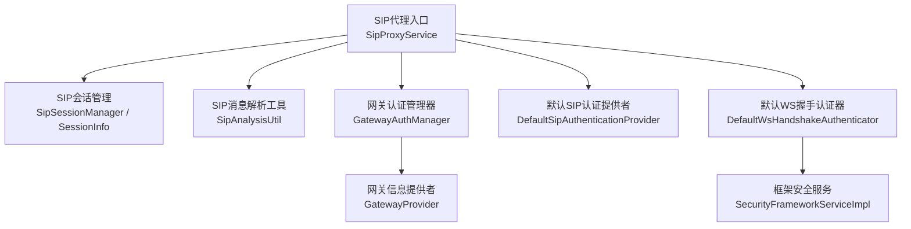
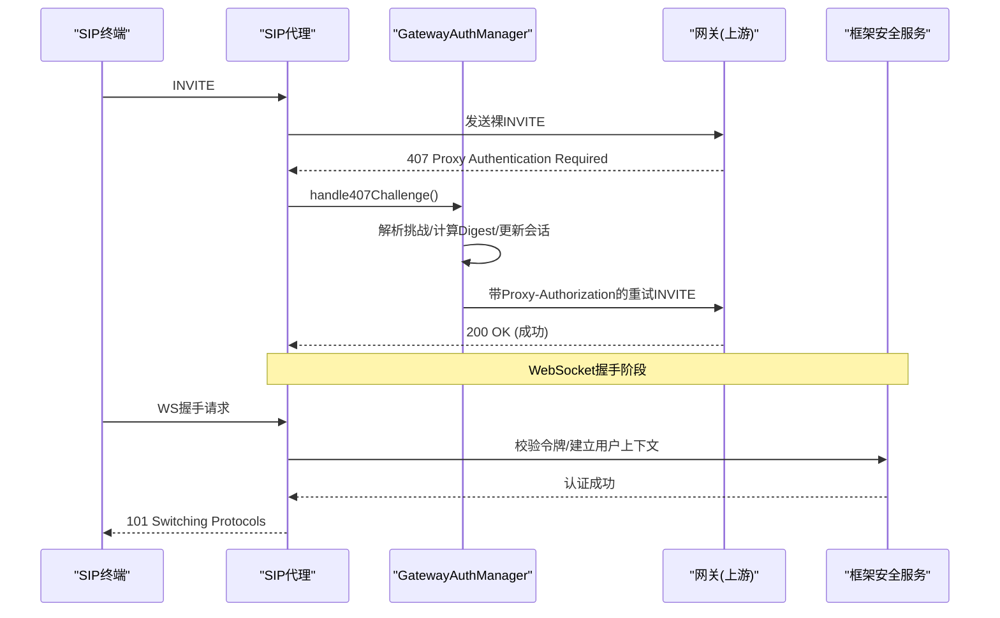
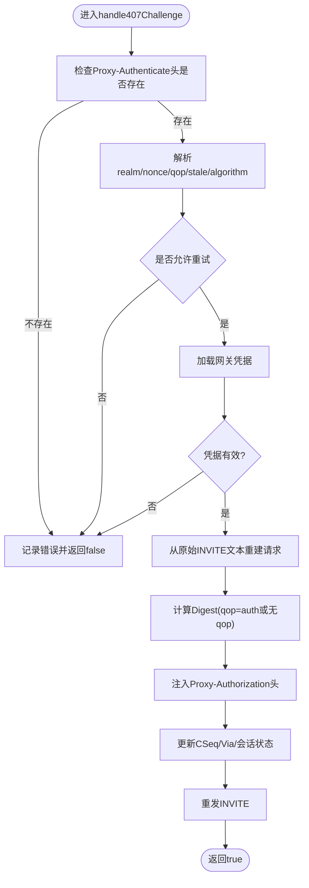
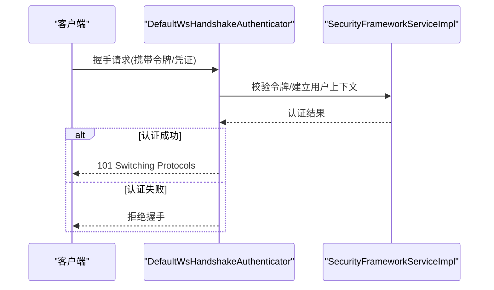
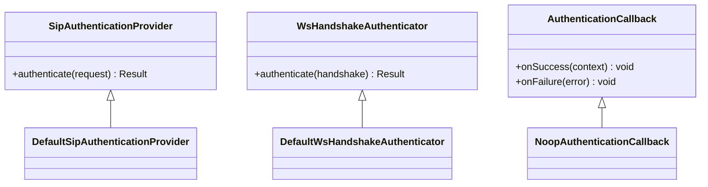
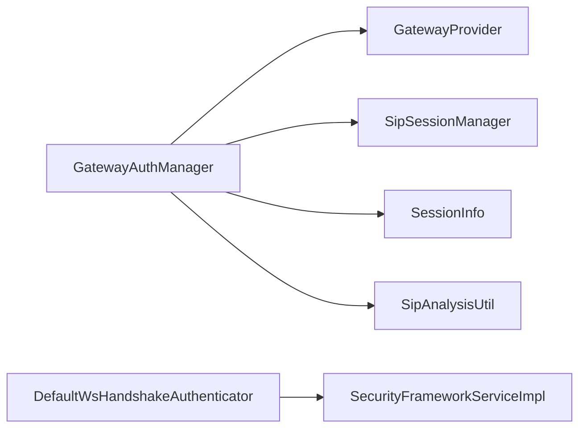

# 认证相关接口

<cite>
**本文引用的文件**
- [GatewayAuthManager.java](file://yudao-cloud/yudao-module-cc/ipcc-sipproxy/src/main/java/cn/ipcc/sipproxy/core/auth/GatewayAuthManager.java)
- [DefaultSipAuthenticationProvider.java](file://yudao-cloud/yudao-module-cc/ipcc-sipproxy/src/main/java/cn/ipcc/sipproxy/defaults/authentication/DefaultSipAuthenticationProvider.java)
- [DefaultWsHandshakeAuthenticator.java](file://yudao-cloud/yudao-module-cc/ipcc-sipproxy/src/main/java/cn/ipcc/sipproxy/defaults/authentication/DefaultWsHandshakeAuthenticator.java)
- [NoopAuthenticationCallback.java](file://yudao-cloud/yudao-module-cc/ipcc-sipproxy/src/main/java/cn/ipcc/sipproxy/defaults/authentication/NoopAuthenticationCallback.java)
- [SipProxyService.java](file://yudao-cloud/yudao-module-cc/ipcc-sipproxy/src/main/java/cn/ipcc/sipproxy/core/SipProxyService.java)
- [SipSessionManager.java](file://yudao-cloud/yudao-module-cc/ipcc-sipproxy/src/main/java/cn/ipcc/sipproxy/core/session/SipSessionManager.java)
- [SessionInfo.java](file://yudao-cloud/yudao-module-cc/ipcc-sipproxy/src/main/java/cn/ipcc/sipproxy/core/session/SessionInfo.java)
- [SipAnalysisUtil.java](file://yudao-cloud/yudao-module-cc/ipcc-sipproxy/src/main/java/cn/ipcc/sipproxy/core/utils/SipAnalysisUtil.java)
- [GatewayProvider.java](file://yudao-cloud/yudao-module-cc/ipcc-sipproxy/src/main/java/cn/ipcc/sipproxy/api/gateway/GatewayProvider.java)
- [SecurityFrameworkServiceImpl.java](file://yudao-cloud/yudao-framework/yudao-spring-boot-starter-security/src/main/java/cn/iocoder/yudao/framework/security/core/service/SecurityFrameworkServiceImpl.java)
</cite>

## 目录
1. [简介](#简介)
2. [项目结构](#项目结构)
3. [核心组件](#核心组件)
4. [架构总览](#架构总览)
5. [详细组件分析](#详细组件分析)
6. [依赖关系分析](#依赖关系分析)
7. [性能与安全考量](#性能与安全考量)
8. [故障排查指南](#故障排查指南)
9. [结论](#结论)
10. [附录：自定义认证提供者开发指南](#附录自定义认证提供者开发指南)

## 简介
本文件面向SIP代理与WebSocket握手场景的认证能力，聚焦以下目标：
- 说明SIP Digest认证流程（含qop=auth增强模式、stale重挑战、循环防护）
- 说明WebSocket握手认证机制及与SIP认证的协作方式
- 文档化SipAuthenticationProvider、WsHandshakeAuthenticator、AuthenticationCallback的作用与协作关系
- 提供自定义认证提供者开发指南（LDAP集成、OAuth2支持、自定义令牌验证等）
- 给出完整认证流程示例与安全最佳实践

## 项目结构
本项目在CC模块中提供了SIP代理与默认实现，安全能力由框架层的安全starter提供。关键位置如下：
- SIP代理核心与认证：yudao-module-cc/ipcc-sipproxy
- 默认认证实现：ipcc-sipproxy/defaults/authentication
- 会话与工具：ipcc-sipproxy/core/{session,utils}
- 网关信息访问：ipcc-sipproxy/api/gateway
- 框架安全服务：yudao-framework/yudao-spring-boot-starter-security

图表来源
- [SipProxyService.java](file://yudao-cloud/yudao-module-cc/ipcc-sipproxy/src/main/java/cn/ipcc/sipproxy/core/SipProxyService.java)
- [GatewayAuthManager.java:1-334](file://yudao-cloud/yudao-module-cc/ipcc-sipproxy/src/main/java/cn/ipcc/sipproxy/core/auth/GatewayAuthManager.java#L1-L334)
- [SipSessionManager.java](file://yudao-cloud/yudao-module-cc/ipcc-sipproxy/src/main/java/cn/ipcc/sipproxy/core/session/SipSessionManager.java)
- [SessionInfo.java](file://yudao-cloud/yudao-module-cc/ipcc-sipproxy/src/main/java/cn/ipcc/sipproxy/core/session/SessionInfo.java)
- [SipAnalysisUtil.java](file://yudao-cloud/yudao-module-cc/ipcc-sipproxy/src/main/java/cn/ipcc/sipproxy/core/utils/SipAnalysisUtil.java)
- [GatewayProvider.java](file://yudao-cloud/yudao-module-cc/ipcc-sipproxy/src/main/java/cn/ipcc/sipproxy/api/gateway/GatewayProvider.java)
- [DefaultSipAuthenticationProvider.java](file://yudao-cloud/yudao-module-cc/ipcc-sipproxy/src/main/java/cn/ipcc/sipproxy/defaults/authentication/DefaultSipAuthenticationProvider.java)
- [DefaultWsHandshakeAuthenticator.java](file://yudao-cloud/yudao-module-cc/ipcc-sipproxy/src/main/java/cn/ipcc/sipproxy/defaults/authentication/DefaultWsHandshakeAuthenticator.java)
- [SecurityFrameworkServiceImpl.java](file://yudao-cloud/yudao-framework/yudao-spring-boot-starter-security/src/main/java/cn/iocoder/yudao/framework/security/core/service/SecurityFrameworkServiceImpl.java)

章节来源
- [GatewayAuthManager.java:1-334](file://yudao-cloud/yudao-module-cc/ipcc-sipproxy/src/main/java/cn/ipcc/sipproxy/core/auth/GatewayAuthManager.java#L1-L334)
- [SipProxyService.java](file://yudao-cloud/yudao-module-cc/ipcc-sipproxy/src/main/java/cn/ipcc/sipproxy/core/SipProxyService.java)

## 核心组件
- GatewayAuthManager：负责SIP出站INVITE的Digest认证处理，包括407挑战解析、qop=auth支持、stale重挑战、循环防护、请求重建与重发。
- DefaultSipAuthenticationProvider：SIP入站/出站认证策略的默认实现（用于统一接入点）。
- DefaultWsHandshakeAuthenticator：WebSocket握手阶段的认证实现，通常结合框架安全服务完成用户上下文建立。
- NoopAuthenticationCallback：无操作回调，作为占位或默认行为。
- SipSessionManager/SessionInfo：维护SIP会话状态，包含认证挑战计数、原始INVITE文本缓存等。
- GatewayProvider：提供网关配置信息（如用户名、密码、认证类型），支撑Digest计算。
- SecurityFrameworkServiceImpl：框架层安全服务，提供统一的认证/授权能力，供WS握手等场景使用。

章节来源
- [GatewayAuthManager.java:1-334](file://yudao-cloud/yudao-module-cc/ipcc-sipproxy/src/main/java/cn/ipcc/sipproxy/core/auth/GatewayAuthManager.java#L1-L334)
- [DefaultSipAuthenticationProvider.java](file://yudao-cloud/yudao-module-cc/ipcc-sipproxy/src/main/java/cn/ipcc/sipproxy/defaults/authentication/DefaultSipAuthenticationProvider.java)
- [DefaultWsHandshakeAuthenticator.java](file://yudao-cloud/yudao-module-cc/ipcc-sipproxy/src/main/java/cn/ipcc/sipproxy/defaults/authentication/DefaultWsHandshakeAuthenticator.java)
- [NoopAuthenticationCallback.java](file://yudao-cloud/yudao-module-cc/ipcc-sipproxy/src/main/java/cn/ipcc/sipproxy/defaults/authentication/NoopAuthenticationCallback.java)
- [SipSessionManager.java](file://yudao-cloud/yudao-module-cc/ipcc-sipproxy/core/session/SipSessionManager.java)
- [SessionInfo.java](file://yudao-cloud/yudao-module-cc/ipcc-sipproxy/core/session/SessionInfo.java)
- [GatewayProvider.java](file://yudao-cloud/yudao-module-cc/ipcc-sipproxy/api/gateway/GatewayProvider.java)
- [SecurityFrameworkServiceImpl.java](file://yudao-cloud/yudao-framework/yudao-spring-boot-starter-security/src/main/java/cn/iocoder/yudao/framework/security/core/service/SecurityFrameworkServiceImpl.java)

## 架构总览
SIP与WebSocket认证的整体协作如下：
- SIP侧：SIP代理收到出站INVITE后，若上游网关返回407，则由GatewayAuthManager解析挑战并计算Digest响应，必要时进行多次重试（含stale重挑战），最终将携带Proxy-Authorization的请求重发。
- WebSocket侧：客户端发起握手时，由DefaultWsHandshakeAuthenticator执行认证，可复用框架安全服务完成用户上下文构建；后续业务可通过统一安全上下文获取当前用户。
- 会话与工具：SipSessionManager/SessionInfo保存必要上下文（如原始INVITE文本、挑战计数），SipAnalysisUtil用于从文本重建SIP请求对象。

图表来源
- [GatewayAuthManager.java:100-240](file://yudao-cloud/yudao-module-cc/ipcc-sipproxy/src/main/java/cn/ipcc/sipproxy/core/auth/GatewayAuthManager.java#L100-L240)
- [DefaultWsHandshakeAuthenticator.java](file://yudao-cloud/yudao-module-cc/ipcc-sipproxy/src/main/java/cn/ipcc/sipproxy/defaults/authentication/DefaultWsHandshakeAuthenticator.java)
- [SecurityFrameworkServiceImpl.java](file://yudao-cloud/yudao-framework/yudao-spring-boot-starter-security/src/main/java/cn/iocoder/yudao/framework/security/core/service/SecurityFrameworkServiceImpl.java)

## 详细组件分析

### SIP Digest认证流程（GatewayAuthManager）
- 职责
  - 处理407挑战：解析realm、nonce、algorithm、qop、stale等参数
  - 循环防护：限制最大重试次数，stale=true允许二次重试
  - 请求重建：基于原始INVITE文本重建请求，注入Proxy-Authorization头
  - Digest计算：支持无qop模式与qop=auth模式
  - 重发策略：按传输协议选择SipProvider发送
- 关键数据流
  - 从SessionInfo读取callId、gatewayId、originalInviteText、authChallengeCount、last407Nonce
  - 通过GatewayProvider获取网关凭据
  - 使用SipAnalysisUtil解析原始INVITE文本为Request对象
- 复杂度与性能
  - 字符串拼接与MD5哈希开销较低
  - 避免重复解析：仅对失败挑战进行重建与重算
  - 通过CSeq+1与Via branch更新保证事务正确性

图表来源
- [GatewayAuthManager.java:100-240](file://yudao-cloud/yudao-module-cc/ipcc-sipproxy/src/main/java/cn/ipcc/sipproxy/core/auth/GatewayAuthManager.java#L100-L240)
- [GatewayAuthManager.java:242-261](file://yudao-cloud/yudao-module-cc/ipcc-sipproxy/src/main/java/cn/ipcc/sipproxy/core/auth/GatewayAuthManager.java#L242-L261)
- [GatewayAuthManager.java:263-289](file://yudao-cloud/yudao-module-cc/ipcc-sipproxy/src/main/java/cn/ipcc/sipproxy/core/auth/GatewayAuthManager.java#L263-L289)

章节来源
- [GatewayAuthManager.java:100-240](file://yudao-cloud/yudao-module-cc/ipcc-sipproxy/src/main/java/cn/ipcc/sipproxy/core/auth/GatewayAuthManager.java#L100-L240)
- [GatewayAuthManager.java:242-261](file://yudao-cloud/yudao-module-cc/ipcc-sipproxy/src/main/java/cn/ipcc/sipproxy/core/auth/GatewayAuthManager.java#L242-L261)
- [GatewayAuthManager.java:263-289](file://yudao-cloud/yudao-module-cc/ipcc-sipproxy/src/main/java/cn/ipcc/sipproxy/core/auth/GatewayAuthManager.java#L263-L289)

### WebSocket握手认证（DefaultWsHandshakeAuthenticator）
- 职责
  - 在WebSocket握手阶段执行认证，通常调用框架安全服务完成令牌校验与用户上下文建立
  - 认证成功后允许升级连接，失败则拒绝握手
- 与SIP认证的关系
  - SIP侧主要处理网关间Digest认证
  - WebSocket侧侧重应用层用户身份认证，可与SIP用户体系打通（例如通过同一用户ID）

图表来源
- [DefaultWsHandshakeAuthenticator.java](file://yudao-cloud/yudao-module-cc/ipcc-sipproxy/src/main/java/cn/ipcc/sipproxy/defaults/authentication/DefaultWsHandshakeAuthenticator.java)
- [SecurityFrameworkServiceImpl.java](file://yudao-cloud/yudao-framework/yudao-spring-boot-starter-security/src/main/java/cn/iocoder/yudao/framework/security/core/service/SecurityFrameworkServiceImpl.java)

章节来源
- [DefaultWsHandshakeAuthenticator.java](file://yudao-cloud/yudao-module-cc/ipcc-sipproxy/src/main/java/cn/ipcc/sipproxy/defaults/authentication/DefaultWsHandshakeAuthenticator.java)
- [SecurityFrameworkServiceImpl.java](file://yudao-cloud/yudao-framework/yudao-spring-boot-starter-security/src/main/java/cn/iocoder/yudao/framework/security/core/service/SecurityFrameworkServiceImpl.java)

### 认证提供者与回调（SipAuthenticationProvider、AuthenticationCallback）
- 角色定位
  - SipAuthenticationProvider：定义SIP认证策略的统一接入点，便于扩展不同认证后端
  - WsHandshakeAuthenticator：定义WebSocket握手认证策略的统一接入点
  - AuthenticationCallback：定义认证结果的回调接口，便于在认证链中传递结果或触发后续动作
- 默认实现
  - DefaultSipAuthenticationProvider：默认SIP认证策略
  - DefaultWsHandshakeAuthenticator：默认WS握手认证策略
  - NoopAuthenticationCallback：无操作回调，用于不需要额外处理的场景

图表来源
- [DefaultSipAuthenticationProvider.java](file://yudao-cloud/yudao-module-cc/ipcc-sipproxy/src/main/java/cn/ipcc/sipproxy/defaults/authentication/DefaultSipAuthenticationProvider.java)
- [DefaultWsHandshakeAuthenticator.java](file://yudao-cloud/yudao-module-cc/ipcc-sipproxy/src/main/java/cn/ipcc/sipproxy/defaults/authentication/DefaultWsHandshakeAuthenticator.java)
- [NoopAuthenticationCallback.java](file://yudao-cloud/yudao-module-cc/ipcc-sipproxy/src/main/java/cn/ipcc/sipproxy/defaults/authentication/NoopAuthenticationCallback.java)

章节来源
- [DefaultSipAuthenticationProvider.java](file://yudao-cloud/yudao-module-cc/ipcc-sipproxy/src/main/java/cn/ipcc/sipproxy/defaults/authentication/DefaultSipAuthenticationProvider.java)
- [DefaultWsHandshakeAuthenticator.java](file://yudao-cloud/yudao-module-cc/ipcc-sipproxy/src/main/java/cn/ipcc/sipproxy/defaults/authentication/DefaultWsHandshakeAuthenticator.java)
- [NoopAuthenticationCallback.java](file://yudao-cloud/yudao-module-cc/ipcc-sipproxy/src/main/java/cn/ipcc/sipproxy/defaults/authentication/NoopAuthenticationCallback.java)

## 依赖关系分析
- GatewayAuthManager依赖
  - GatewayProvider：获取网关凭据与认证类型
  - SipSessionManager/SessionInfo：读写会话状态（挑战计数、原始INVITE文本、最后nonce等）
  - SipAnalysisUtil：从文本重建SIP请求
  - JAIN SIP工厂：创建头域、地址、发送请求
- 安全依赖
  - 框架安全服务：用于WebSocket握手认证与用户上下文管理
- 耦合与内聚
  - GatewayAuthManager高内聚于SIP出站认证逻辑，低耦合于具体网关实现（通过GatewayProvider抽象）
  - 默认认证实现位于defaults包，便于替换为自定义实现

图表来源
- [GatewayAuthManager.java:1-334](file://yudao-cloud/yudao-module-cc/ipcc-sipproxy/src/main/java/cn/ipcc/sipproxy/core/auth/GatewayAuthManager.java#L1-L334)
- [DefaultWsHandshakeAuthenticator.java](file://yudao-cloud/yudao-module-cc/ipcc-sipproxy/src/main/java/cn/ipcc/sipproxy/defaults/authentication/DefaultWsHandshakeAuthenticator.java)
- [SecurityFrameworkServiceImpl.java](file://yudao-cloud/yudao-framework/yudao-spring-boot-starter-security/src/main/java/cn/iocoder/yudao/framework/security/core/service/SecurityFrameworkServiceImpl.java)

章节来源
- [GatewayAuthManager.java:1-334](file://yudao-cloud/yudao-module-cc/ipcc-sipproxy/src/main/java/cn/ipcc/sipproxy/core/auth/GatewayAuthManager.java#L1-L334)
- [DefaultWsHandshakeAuthenticator.java](file://yudao-cloud/yudao-module-cc/ipcc-sipproxy/src/main/java/cn/ipcc/sipproxy/defaults/authentication/DefaultWsHandshakeAuthenticator.java)
- [SecurityFrameworkServiceImpl.java](file://yudao-cloud/yudao-framework/yudao-spring-boot-starter-security/src/main/java/cn/iocoder/yudao/framework/security/core/service/SecurityFrameworkServiceImpl.java)

## 性能与安全考量
- 性能
  - 仅在需要时重建请求与计算Digest，避免不必要的开销
  - 通过CSeq与Via分支更新确保事务正确性，减少重传风暴
  - 限制最大重试次数，防止无限重试导致资源耗尽
- 安全
  - 严格校验网关配置（认证类型、用户名、密码）后再参与Digest计算
  - 支持qop=auth增强模式，提升抗重放能力
  - stale重挑战仅在nonce更新时允许二次重试，防止凭证泄露被滥用
  - WebSocket握手建议启用HTTPS与强令牌的校验，结合框架安全服务统一管理

[本节为通用指导，不直接分析具体文件]

## 故障排查指南
- 常见问题
  - 407响应缺少Proxy-Authenticate头：检查上游网关配置与日志
  - 无法重试：检查challengeCount是否已达上限或stale=false且nonce未更新
  - 原始INVITE文本为空：确认SessionInfo是否正确缓存originalInviteText
  - 网关凭据缺失：确认GatewayProvider返回的authType与username/password是否有效
- 定位步骤
  - 查看GatewayAuthManager中的日志输出，关注challengeCount、realm、nonce、qop、stale等字段
  - 核对SipAnalysisUtil是否能正确解析原始INVITE文本
  - 检查SipSessionManager中会话状态更新是否生效
  - 对于WebSocket握手失败，检查框架安全服务的认证流程与令牌格式

章节来源
- [GatewayAuthManager.java:100-240](file://yudao-cloud/yudao-module-cc/ipcc-sipproxy/src/main/java/cn/ipcc/sipproxy/core/auth/GatewayAuthManager.java#L100-L240)
- [GatewayAuthManager.java:242-261](file://yudao-cloud/yudao-module-cc/ipcc-sipproxy/src/main/java/cn/ipcc/sipproxy/core/auth/GatewayAuthManager.java#L242-L261)
- [GatewayAuthManager.java:263-289](file://yudao-cloud/yudao-module-cc/ipcc-sipproxy/src/main/java/cn/ipcc/sipproxy/core/auth/GatewayAuthManager.java#L263-L289)

## 结论
- SIP侧通过GatewayAuthManager实现了标准的Digest认证流程，支持qop=auth与stale重挑战，具备完善的循环防护与请求重建能力
- WebSocket侧通过DefaultWsHandshakeAuthenticator与框架安全服务完成握手认证，便于统一用户上下文管理
- 通过SipAuthenticationProvider与WsHandshakeAuthenticator的抽象，系统具备良好的可扩展性，便于集成LDAP、OAuth2等认证后端

[本节为总结，不直接分析具体文件]

## 附录：自定义认证提供者开发指南
- 目标
  - 在不修改核心流程的前提下，替换或扩展认证后端（如LDAP、OAuth2、自定义令牌）
- 步骤
  - 实现SipAuthenticationProvider接口，封装SIP认证逻辑（如对接LDAP/OAuth2）
  - 实现WsHandshakeAuthenticator接口，封装WebSocket握手认证逻辑（如校验JWT、签名等）
  - 根据需要实现AuthenticationCallback接口，处理认证成功/失败的后续动作
  - 注册自定义实现到Spring容器，覆盖默认实现
- 注意事项
  - 保持与现有会话状态兼容（如SessionInfo字段）
  - 遵循安全最佳实践（最小权限、敏感信息保护、防重放）
  - 充分测试边界条件（超时、网络异常、令牌过期）

[本节为通用指导，不直接分析具体文件]