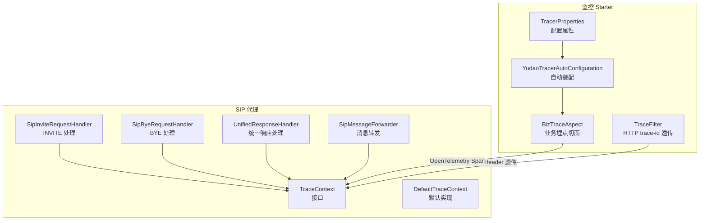
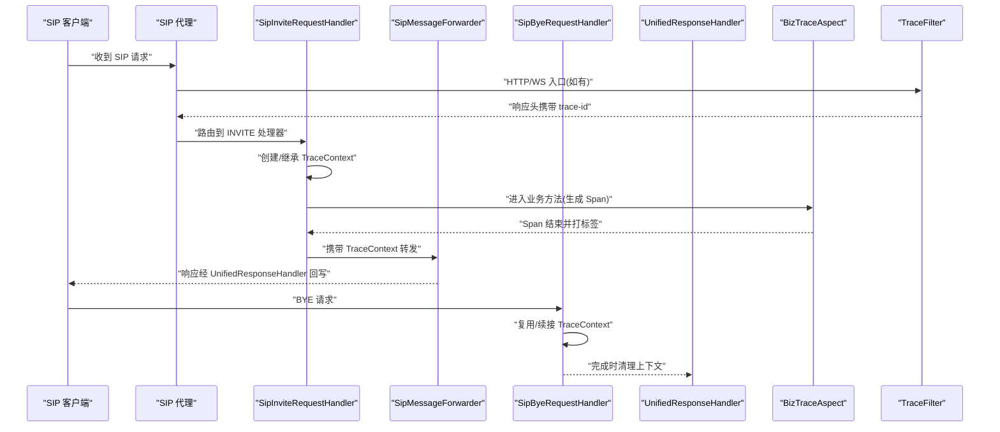
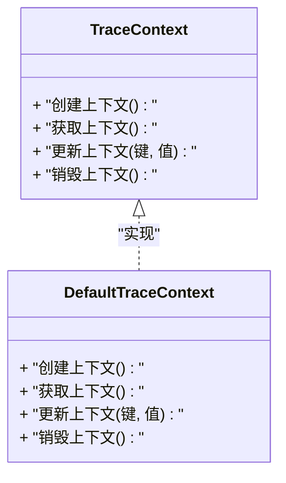
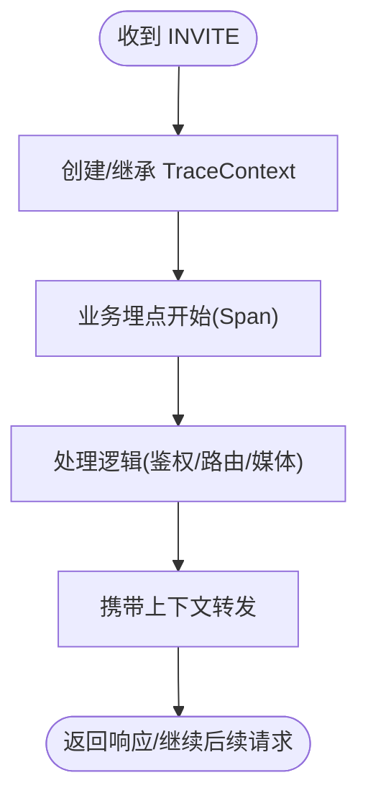
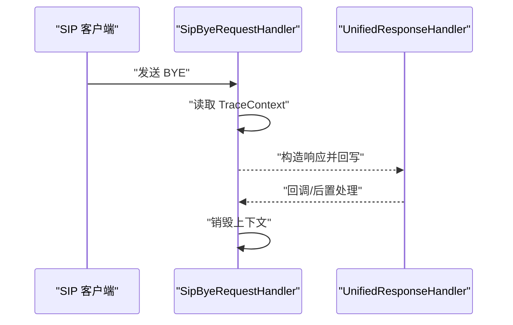
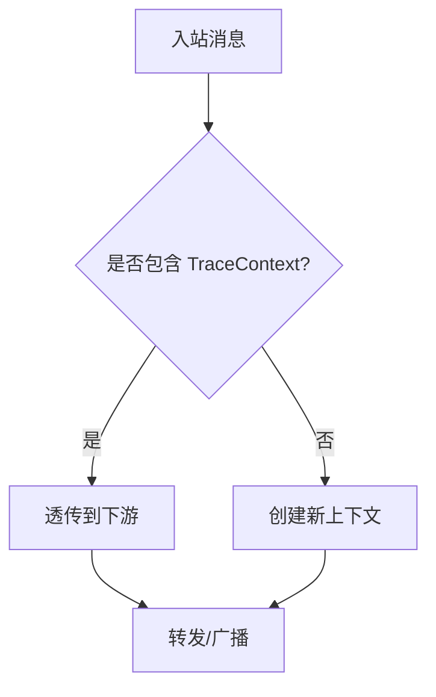
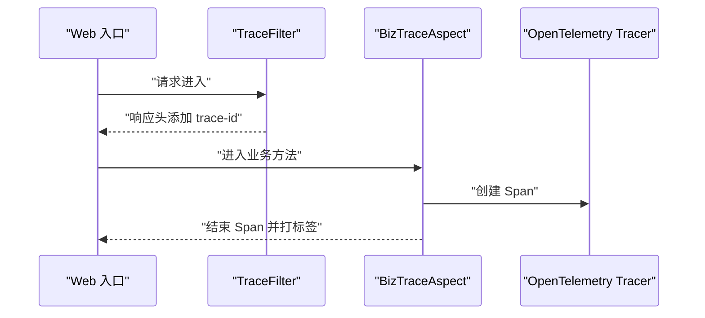
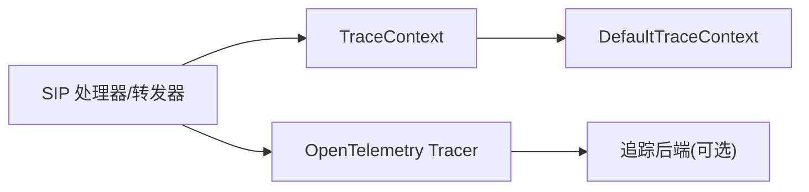

# 链路追踪接口

<cite>
**本文引用的文件**
- [TraceContext.java](file://yudao-cloud/yudao-module-cc/ipcc-sipproxy/src/main/java/cn/ipcc/sipproxy/api/trace/TraceContext.java)
- [DefaultTraceContext.java](file://yudao-cloud/yudao-module-cc/ipcc-sipproxy/src/main/java/cn/ipcc/sipproxy/defaults/trace/DefaultTraceContext.java)
- [SipInviteRequestHandler.java](file://yudao-cloud/yudao-module-cc/ipcc-sipproxy/src/main/java/cn/ipcc/sipproxy/core/handler/request/sip/SipInviteRequestHandler.java)
- [SipByeRequestHandler.java](file://yudao-cloud/yudao-module-cc/ipcc-sipproxy/src/main/java/cn/ipcc/sipproxy/core/handler/request/sip/SipByeRequestHandler.java)
- [AbstractSipRequestHandler.java](file://yudao-cloud/yudao-module-cc/ipcc-sipproxy/src/main/java/cn/ipcc/sipproxy/core/handler/request/sip/AbstractSipRequestHandler.java)
- [UnifiedResponseHandler.java](file://yudao-cloud/yudao-module-cc/ipcc-sipproxy/src/main/java/cn/ipcc/sipproxy/core/handler/response/UnifiedResponseHandler.java)
- [SipMessageForwarder.java](file://yudao-cloud/yudao-module-cc/ipcc-sipproxy/src/main/java/cn/ipcc/sipproxy/core/forwarder/SipMessageForwarder.java)
- [BizTraceAspect.java](file://yudao-cloud/yudao-framework/yudao-spring-boot-starter-monitor/src/main/java/cn/iocoder/yudao/framework/tracer/core/aop/BizTraceAspect.java)
- [TraceFilter.java](file://yudao-cloud/yudao-framework/yudao-spring-boot-starter-monitor/src/main/java/cn/iocoder/yudao/framework/tracer/core/filter/TraceFilter.java)
- [TracerProperties.java](file://yudao-cloud/yudao-framework/yudao-spring-boot-starter-monitor/src/main/java/cn/iocoder/yudao/framework/tracer/config/TracerProperties.java)
- [YudaoTracerAutoConfiguration.java](file://yudao-cloud/yudao-framework/yudao-spring-boot-starter-monitor/src/main/java/cn/iocoder/yudao/framework/tracer/config/YudaoTracerAutoConfiguration.java)
</cite>

## 目录
1. [简介](#简介)
2. [项目结构](#项目结构)
3. [核心组件](#核心组件)
4. [架构总览](#架构总览)
5. [详细组件分析](#详细组件分析)
6. [依赖关系分析](#依赖关系分析)
7. [性能与可观测性建议](#性能与可观测性建议)
8. [故障排查指南](#故障排查指南)
9. [结论](#结论)
10. [附录：配置与集成示例](#附录：配置与集成示例)

## 简介
本文件面向 SIP 呼叫链路的链路追踪能力，围绕 TraceContext 接口及其默认实现，说明在 SIP 呼叫生命周期中如何创建、传递和销毁追踪上下文，并结合框架层的 OpenTelemetry 切面与过滤器，形成端到端的调用链跟踪、性能分析与问题定位能力。文档还给出与第三方追踪系统（如 SkyWalking、Zipkin）集成的思路与最佳实践，以及呼叫质量分析与性能监控的实践建议。

## 项目结构
本项目在 SIP 代理模块中提供统一的追踪上下文抽象，并在请求/响应处理链中贯穿使用；在通用监控 starter 中提供基于 OpenTelemetry 的业务埋点切面与 HTTP 过滤器的 trace-id 透传能力。整体结构如下：

图表来源
- [TraceContext.java:1-200](file://yudao-cloud/yudao-module-cc/ipcc-sipproxy/src/main/java/cn/ipcc/sipproxy/api/trace/TraceContext.java#L1-L200)
- [DefaultTraceContext.java:1-200](file://yudao-cloud/yudao-module-cc/ipcc-sipproxy/src/main/java/cn/ipcc/sipproxy/defaults/trace/DefaultTraceContext.java#L1-L200)
- [SipInviteRequestHandler.java:1-200](file://yudao-cloud/yudao-module-cc/ipcc-sipproxy/src/main/java/cn/ipcc/sipproxy/core/handler/request/sip/SipInviteRequestHandler.java#L1-L200)
- [SipByeRequestHandler.java:1-200](file://yudao-cloud/yudao-module-cc/ipcc-sipproxy/src/main/java/cn/ipcc/sipproxy/core/handler/request/sip/SipByeRequestHandler.java#L1-L200)
- [UnifiedResponseHandler.java:1-200](file://yudao-cloud/yudao-module-cc/ipcc-sipproxy/src/main/java/cn/ipcc/sipproxy/core/handler/response/UnifiedResponseHandler.java#L1-L200)
- [SipMessageForwarder.java:1-200](file://yudao-cloud/yudao-module-cc/ipcc-sipproxy/src/main/java/cn/ipcc/sipproxy/core/forwarder/SipMessageForwarder.java#L1-L200)
- [BizTraceAspect.java:1-78](file://yudao-cloud/yudao-framework/yudao-spring-boot-starter-monitor/src/main/java/cn/iocoder/yudao/framework/tracer/core/aop/BizTraceAspect.java#L1-L78)
- [TraceFilter.java:1-34](file://yudao-cloud/yudao-framework/yudao-spring-boot-starter-monitor/src/main/java/cn/iocoder/yudao/framework/tracer/core/filter/TraceFilter.java#L1-L34)
- [TracerProperties.java:1-15](file://yudao-cloud/yudao-framework/yudao-spring-boot-starter-monitor/src/main/java/cn/iocoder/yudao/framework/tracer/config/TracerProperties.java#L1-L15)
- [YudaoTracerAutoConfiguration.java:1-200](file://yudao-cloud/yudao-framework/yudao-spring-boot-starter-monitor/src/main/java/cn/iocoder/yudao/framework/tracer/config/YudaoTracerAutoConfiguration.java#L1-L200)

章节来源
- [TraceContext.java:1-200](file://yudao-cloud/yudao-module-cc/ipcc-sipproxy/src/main/java/cn/ipcc/sipproxy/api/trace/TraceContext.java#L1-L200)
- [DefaultTraceContext.java:1-200](file://yudao-cloud/yudao-module-cc/ipcc-sipproxy/src/main/java/cn/ipcc/sipproxy/defaults/trace/DefaultTraceContext.java#L1-L200)
- [BizTraceAspect.java:1-78](file://yudao-cloud/yudao-framework/yudao-spring-boot-starter-monitor/src/main/java/cn/iocoder/yudao/framework/tracer/core/aop/BizTraceAspect.java#L1-L78)
- [TraceFilter.java:1-34](file://yudao-cloud/yudao-framework/yudao-spring-boot-starter-monitor/src/main/java/cn/iocoder/yudao/framework/tracer/core/filter/TraceFilter.java#L1-L34)

## 核心组件
- TraceContext：SIP 呼叫链路追踪的上下文接口，用于承载并传播一次呼叫的全局标识与扩展信息，贯穿 INVITE、媒体协商、后续请求与 BYE 等阶段。
- DefaultTraceContext：默认实现，提供线程安全或会话隔离的上下文管理，支持创建、获取、更新与清理。
- 请求/响应处理器：在 INVITE/BYE 等关键节点读取/写入 TraceContext，确保跨组件、跨线程的链路一致性。
- 监控 Starter：
  - BizTraceAspect：基于 OpenTelemetry 的业务方法级埋点，生成 Span 并设置业务标签。
  - TraceFilter：在 HTTP 层将 trace-id 注入响应头，便于前端或网关串联调用链。
  - TracerProperties / YudaoTracerAutoConfiguration：暴露配置项并自动装配追踪相关 Bean。

章节来源
- [TraceContext.java:1-200](file://yudao-cloud/yudao-module-cc/ipcc-sipproxy/src/main/java/cn/ipcc/sipproxy/api/trace/TraceContext.java#L1-L200)
- [DefaultTraceContext.java:1-200](file://yudao-cloud/yudao-module-cc/ipcc-sipproxy/src/main/java/cn/ipcc/sipproxy/defaults/trace/DefaultTraceContext.java#L1-L200)
- [BizTraceAspect.java:1-78](file://yudao-cloud/yudao-framework/yudao-spring-boot-starter-monitor/src/main/java/cn/iocoder/yudao/framework/tracer/core/aop/BizTraceAspect.java#L1-L78)
- [TraceFilter.java:1-34](file://yudao-cloud/yudao-framework/yudao-spring-boot-starter-monitor/src/main/java/cn/iocoder/yudao/framework/tracer/core/filter/TraceFilter.java#L1-L34)
- [TracerProperties.java:1-15](file://yudao-cloud/yudao-framework/yudao-spring-boot-starter-monitor/src/main/java/cn/iocoder/yudao/framework/tracer/config/TracerProperties.java#L1-L15)
- [YudaoTracerAutoConfiguration.java:1-200](file://yudao-cloud/yudao-framework/yudao-spring-boot-starter-monitor/src/main/java/cn/iocoder/yudao/framework/tracer/config/YudaoTracerAutoConfiguration.java#L1-L200)

## 架构总览
下图展示了一次 SIP INVITE 呼叫从接入到转发的追踪上下文流转过程，以及与业务埋点的协作关系。

图表来源
- [SipInviteRequestHandler.java:1-200](file://yudao-cloud/yudao-module-cc/ipcc-sipproxy/src/main/java/cn/ipcc/sipproxy/core/handler/request/sip/SipInviteRequestHandler.java#L1-L200)
- [SipByeRequestHandler.java:1-200](file://yudao-cloud/yudao-module-cc/ipcc-sipproxy/src/main/java/cn/ipcc/sipproxy/core/handler/request/sip/SipByeRequestHandler.java#L1-L200)
- [UnifiedResponseHandler.java:1-200](file://yudao-cloud/yudao-module-cc/ipcc-sipproxy/src/main/java/cn/ipcc/sipproxy/core/handler/response/UnifiedResponseHandler.java#L1-L200)
- [SipMessageForwarder.java:1-200](file://yudao-cloud/yudao-module-cc/ipcc-sipproxy/src/main/java/cn/ipcc/sipproxy/core/forwarder/SipMessageForwarder.java#L1-L200)
- [BizTraceAspect.java:1-78](file://yudao-cloud/yudao-framework/yudao-spring-boot-starter-monitor/src/main/java/cn/iocoder/yudao/framework/tracer/core/aop/BizTraceAspect.java#L1-L78)
- [TraceFilter.java:1-34](file://yudao-cloud/yudao-framework/yudao-spring-boot-starter-monitor/src/main/java/cn/iocoder/yudao/framework/tracer/core/filter/TraceFilter.java#L1-L34)

## 详细组件分析

### TraceContext 接口与默认实现
- 职责
  - 创建：在 INVITE 入口处为一次呼叫生成全局唯一的追踪标识，并初始化上下文。
  - 传递：在后续请求、响应、异步任务、跨线程/进程边界保持上下文一致。
  - 销毁：在 BYE 或异常路径释放资源，避免内存泄漏。
- 设计要点
  - 线程安全：保证并发场景下上下文不被污染。
  - 可扩展：允许附加业务维度（如主叫/被叫、网关、IVR 流程等）。
  - 低侵入：通过处理器与转发器最小改动接入。

图表来源
- [TraceContext.java:1-200](file://yudao-cloud/yudao-module-cc/ipcc-sipproxy/src/main/java/cn/ipcc/sipproxy/api/trace/TraceContext.java#L1-L200)
- [DefaultTraceContext.java:1-200](file://yudao-cloud/yudao-module-cc/ipcc-sipproxy/src/main/java/cn/ipcc/sipproxy/defaults/trace/DefaultTraceContext.java#L1-L200)

章节来源
- [TraceContext.java:1-200](file://yudao-cloud/yudao-module-cc/ipcc-sipproxy/src/main/java/cn/ipcc/sipproxy/api/trace/TraceContext.java#L1-L200)
- [DefaultTraceContext.java:1-200](file://yudao-cloud/yudao-module-cc/ipcc-sipproxy/src/main/java/cn/ipcc/sipproxy/defaults/trace/DefaultTraceContext.java#L1-L200)

### INVITE 处理中的追踪上下文创建与传递
- 关键点
  - 在 INVITE 入口创建或继承上游传入的 TraceContext。
  - 将上下文注入后续转发、媒体协商、状态上报等环节。
  - 结合业务埋点，记录关键阶段耗时与错误。

图表来源
- [SipInviteRequestHandler.java:1-200](file://yudao-cloud/yudao-module-cc/ipcc-sipproxy/src/main/java/cn/ipcc/sipproxy/core/handler/request/sip/SipInviteRequestHandler.java#L1-L200)
- [BizTraceAspect.java:1-78](file://yudao-cloud/yudao-framework/yudao-spring-boot-starter-monitor/src/main/java/cn/iocoder/yudao/framework/tracer/core/aop/BizTraceAspect.java#L1-L78)

章节来源
- [SipInviteRequestHandler.java:1-200](file://yudao-cloud/yudao-module-cc/ipcc-sipproxy/src/main/java/cn/ipcc/sipproxy/core/handler/request/sip/SipInviteRequestHandler.java#L1-L200)
- [BizTraceAspect.java:1-78](file://yudao-cloud/yudao-framework/yudao-spring-boot-starter-monitor/src/main/java/cn/iocoder/yudao/framework/tracer/core/aop/BizTraceAspect.java#L1-L78)

### BYE 处理与上下文销毁
- 关键点
  - 在 BYE 阶段复用同一 TraceContext，确保完整呼叫链可视。
  - 在响应完成后清理上下文，释放资源。

图表来源
- [SipByeRequestHandler.java:1-200](file://yudao-cloud/yudao-module-cc/ipcc-sipproxy/src/main/java/cn/ipcc/sipproxy/core/handler/request/sip/SipByeRequestHandler.java#L1-L200)
- [UnifiedResponseHandler.java:1-200](file://yudao-cloud/yudao-module-cc/ipcc-sipproxy/src/main/java/cn/ipcc/sipproxy/core/handler/response/UnifiedResponseHandler.java#L1-L200)

章节来源
- [SipByeRequestHandler.java:1-200](file://yudao-cloud/yudao-module-cc/ipcc-sipproxy/src/main/java/cn/ipcc/sipproxy/core/handler/request/sip/SipByeRequestHandler.java#L1-L200)
- [UnifiedResponseHandler.java:1-200](file://yudao-cloud/yudao-module-cc/ipcc-sipproxy/src/main/java/cn/ipcc/sipproxy/core/handler/response/UnifiedResponseHandler.java#L1-L200)

### 消息转发中的上下文透传
- 关键点
  - SipMessageForwarder 在转发 SIP 消息时，需携带 TraceContext，确保下游节点可续接链路。
  - 对于 WebSocket/集群广播场景，应保证上下文序列化与反序列化的正确性。

图表来源
- [SipMessageForwarder.java:1-200](file://yudao-cloud/yudao-module-cc/ipcc-sipproxy/src/main/java/cn/ipcc/sipproxy/core/forwarder/SipMessageForwarder.java#L1-L200)

章节来源
- [SipMessageForwarder.java:1-200](file://yudao-cloud/yudao-module-cc/ipcc-sipproxy/src/main/java/cn/ipcc/sipproxy/core/forwarder/SipMessageForwarder.java#L1-L200)

### 业务埋点与 HTTP 链路透传
- BizTraceAspect
  - 基于 OpenTelemetry 的 Tracer 创建 Span，记录业务操作名、类型与 ID 等标签。
  - 在异常路径记录错误并标记 Span 失败。
- TraceFilter
  - 在响应头中注入 trace-id，便于前端或网关串联调用链。
- 配置与自动装配
  - TracerProperties 暴露配置项。
  - YudaoTracerAutoConfiguration 负责装配 Tracer、切面与过滤器。

图表来源
- [BizTraceAspect.java:1-78](file://yudao-cloud/yudao-framework/yudao-spring-boot-starter-monitor/src/main/java/cn/iocoder/yudao/framework/tracer/core/aop/BizTraceAspect.java#L1-L78)
- [TraceFilter.java:1-34](file://yudao-cloud/yudao-framework/yudao-spring-boot-starter-monitor/src/main/java/cn/iocoder/yudao/framework/tracer/core/filter/TraceFilter.java#L1-L34)
- [TracerProperties.java:1-15](file://yudao-cloud/yudao-framework/yudao-spring-boot-starter-monitor/src/main/java/cn/iocoder/yudao/framework/tracer/config/TracerProperties.java#L1-L15)
- [YudaoTracerAutoConfiguration.java:1-200](file://yudao-cloud/yudao-framework/yudao-spring-boot-starter-monitor/src/main/java/cn/iocoder/yudao/framework/tracer/config/YudaoTracerAutoConfiguration.java#L1-L200)

章节来源
- [BizTraceAspect.java:1-78](file://yudao-cloud/yudao-framework/yudao-spring-boot-starter-monitor/src/main/java/cn/iocoder/yudao/framework/tracer/core/aop/BizTraceAspect.java#L1-L78)
- [TraceFilter.java:1-34](file://yudao-cloud/yudao-framework/yudao-spring-boot-starter-monitor/src/main/java/cn/iocoder/yudao/framework/tracer/core/filter/TraceFilter.java#L1-L34)
- [TracerProperties.java:1-15](file://yudao-cloud/yudao-framework/yudao-spring-boot-starter-monitor/src/main/java/cn/iocoder/yudao/framework/tracer/config/TracerProperties.java#L1-L15)
- [YudaoTracerAutoConfiguration.java:1-200](file://yudao-cloud/yudao-framework/yudao-spring-boot-starter-monitor/src/main/java/cn/iocoder/yudao/framework/tracer/config/YudaoTracerAutoConfiguration.java#L1-L200)

## 依赖关系分析
- 组件耦合
  - SIP 处理器依赖 TraceContext 进行链路贯穿。
  - 转发器依赖上下文透传机制，确保跨节点一致性。
  - 监控 Starter 通过 Spring 自动装配与 AOP 对业务方法进行无侵入埋点。
- 外部依赖
  - OpenTelemetry：作为底层追踪 SDK，支撑 Span 的创建、传播与导出。
  - 可选：SkyWalking Agent、Zipkin Collector 等后端采集与可视化。

图表来源
- [SipInviteRequestHandler.java:1-200](file://yudao-cloud/yudao-module-cc/ipcc-sipproxy/src/main/java/cn/ipcc/sipproxy/core/handler/request/sip/SipInviteRequestHandler.java#L1-L200)
- [SipMessageForwarder.java:1-200](file://yudao-cloud/yudao-module-cc/ipcc-sipproxy/src/main/java/cn/ipcc/sipproxy/core/forwarder/SipMessageForwarder.java#L1-L200)
- [BizTraceAspect.java:1-78](file://yudao-cloud/yudao-framework/yudao-spring-boot-starter-monitor/src/main/java/cn/iocoder/yudao/framework/tracer/core/aop/BizTraceAspect.java#L1-L78)

章节来源
- [SipInviteRequestHandler.java:1-200](file://yudao-cloud/yudao-module-cc/ipcc-sipproxy/src/main/java/cn/ipcc/sipproxy/core/handler/request/sip/SipInviteRequestHandler.java#L1-L200)
- [SipMessageForwarder.java:1-200](file://yudao-cloud/yudao-module-cc/ipcc-sipproxy/src/main/java/cn/ipcc/sipproxy/core/forwarder/SipMessageForwarder.java#L1-L200)
- [BizTraceAspect.java:1-78](file://yudao-cloud/yudao-framework/yudao-spring-boot-starter-monitor/src/main/java/cn/iocoder/yudao/framework/tracer/core/aop/BizTraceAspect.java#L1-L78)

## 性能与可观测性建议
- 控制 Span 粒度
  - 以“呼叫”为单位维护 TraceContext，避免过度细粒度的 Span 导致数据膨胀。
  - 对热点方法使用 @BizTrace 标注，减少手工埋点成本。
- 采样策略
  - 在高吞吐场景开启采样，按呼叫成功率、延迟分位等指标动态调整。
- 上下文大小
  - 仅保留必要字段（如主叫/被叫、网关、IVR 节点），避免过大负载影响网络与存储。
- 异步与跨线程
  - 在异步任务、线程池切换时显式传递 TraceContext，防止链路断裂。
- 日志关联
  - 日志中输出 trace-id，便于与追踪数据联动检索。
- 监控指标
  - 统计 INVITE 成功率、建立时延、媒体接通率、BYE 比例等关键指标。

[本节为通用指导，不直接分析具体文件]

## 故障排查指南
- 常见问题
  - 链路断裂：检查 INVITE/BYE 是否均能访问 TraceContext，转发器是否正确透传。
  - 重复创建：确认上游已存在上下文时不应覆盖，避免产生多条链路。
  - 未清理：BYE 后必须销毁上下文，防止内存泄漏。
  - 埋点缺失：确认业务方法是否被 @BizTrace 覆盖，或是否在关键路径手动埋点。
  - 响应头缺失：检查 TraceFilter 是否生效，trace-id 是否正确写入响应头。
- 定位步骤
  - 通过 trace-id 在日志与追踪系统中检索整条链路。
  - 核对各阶段 Span 的开始/结束时间与标签，识别瓶颈与异常。
  - 对比不同环境/版本的链路差异，快速定位回归问题。

章节来源
- [TraceFilter.java:1-34](file://yudao-cloud/yudao-framework/yudao-spring-boot-starter-monitor/src/main/java/cn/iocoder/yudao/framework/tracer/core/filter/TraceFilter.java#L1-L34)
- [BizTraceAspect.java:1-78](file://yudao-cloud/yudao-framework/yudao-spring-boot-starter-monitor/src/main/java/cn/iocoder/yudao/framework/tracer/core/aop/BizTraceAspect.java#L1-L78)
- [SipByeRequestHandler.java:1-200](file://yudao-cloud/yudao-module-cc/ipcc-sipproxy/src/main/java/cn/ipcc/sipproxy/core/handler/request/sip/SipByeRequestHandler.java#L1-L200)

## 结论
通过 TraceContext 在 SIP 呼叫全生命周期的创建、传递与销毁，结合框架层的 OpenTelemetry 埋点与 HTTP 链路透传，可实现端到端的呼叫链路追踪与性能分析。配合合理的采样、上下文设计与指标体系，可有效提升问题定位效率与系统稳定性。

[本节为总结性内容，不直接分析具体文件]

## 附录：配置与集成示例
- 基础配置
  - 启用自动装配：确保 YudaoTracerAutoConfiguration 生效。
  - 配置属性：通过 TracerProperties 暴露的配置项调整行为（如采样、命名空间等）。
- 与 SkyWalking 集成
  - 部署 SkyWalking Agent，使 OpenTelemetry 数据上报至 SkyWalking 后端。
  - 在应用启动参数中启用对应 Agent，验证链路是否可见。
- 与 Zipkin 集成
  - 配置 OpenTelemetry 导出器指向 Zipkin Collector。
  - 在 Zipkin UI 中通过 trace-id 检索呼叫链路。
- 数据分析示例
  - 查询某主叫/被叫的呼叫链路，观察 INVITE 到 BYE 的各阶段耗时。
  - 统计失败原因分布（鉴权失败、路由失败、媒体协商失败等）。
  - 对比不同网关/节点的延迟与错误率，识别瓶颈。
- 呼叫质量分析与性能监控最佳实践
  - 定义关键指标：接通率、建立时延、掉话率、重定向次数等。
  - 分层监控：接入层、路由层、媒体层分别统计。
  - 告警策略：针对异常阈值（如高错配率、长时延）设置告警。
  - 持续优化：根据链路数据优化路由策略、扩容与降级方案。

[本节为通用指导，不直接分析具体文件]