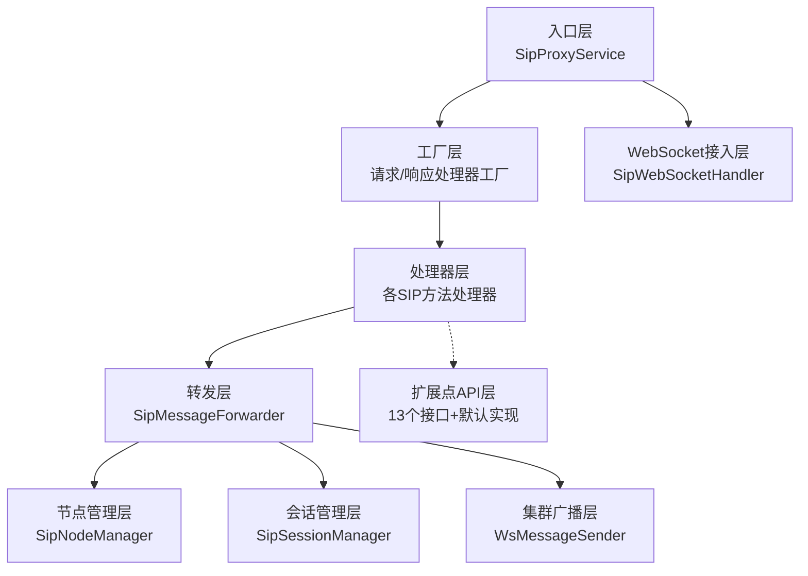
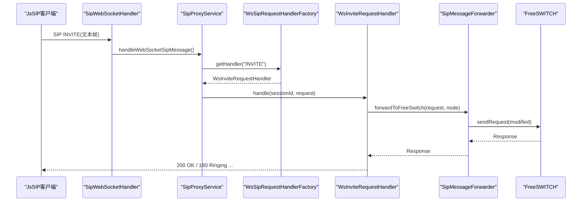
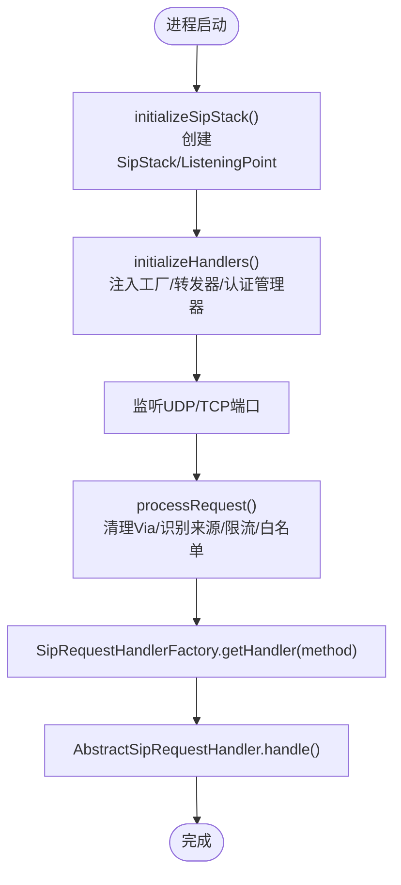
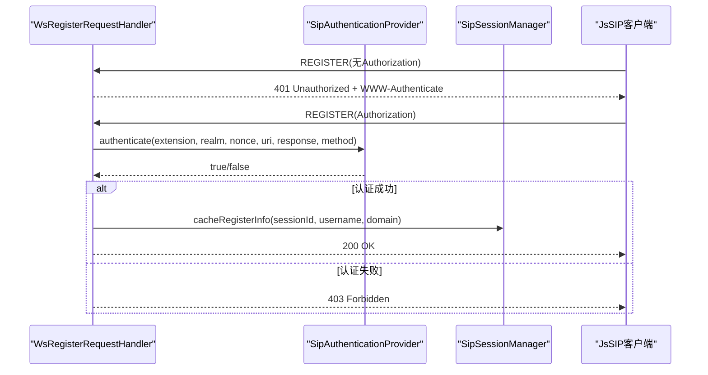
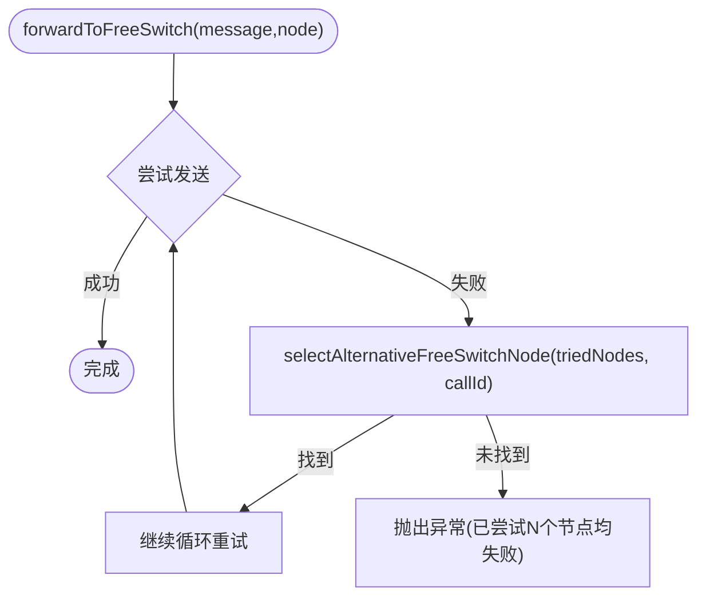
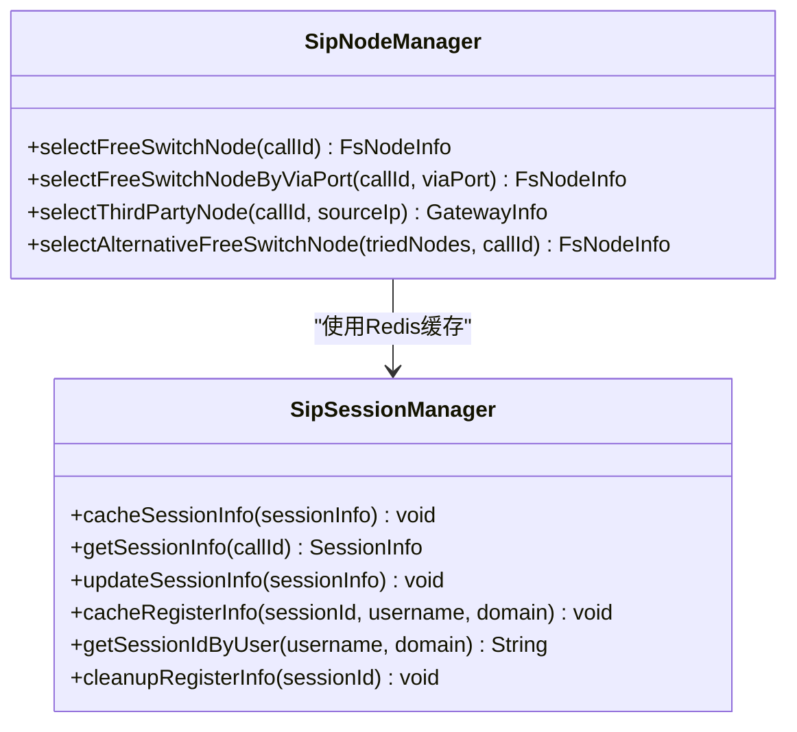
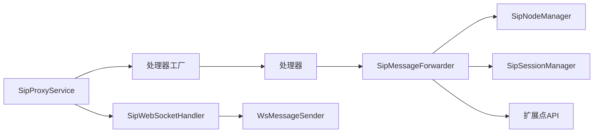

# 核心架构设计

<cite>
**本文引用的文件**
- [README.md](file://yudao-cloud/yudao-module-cc/ipcc-sipproxy/README.md)
- [sipproxy组件架构设计.md](file://yudao-cloud/yudao-module-cc/ipcc-sipproxy/sipproxy组件架构设计.md)
- [SipProxyService.java](file://yudao-cloud/yudao-module-cc/ipcc-sipproxy/src/main/java/cn/ipcc/sipproxy/core/SipProxyService.java)
- [SipMessageForwarder.java](file://yudao-cloud/yudao-module-cc/ipcc-sipproxy/src/main/java/cn/ipcc/sipproxy/core/forwarder/SipMessageForwarder.java)
- [SipNodeManager.java](file://yudao-cloud/yudao-module-cc/ipcc-sipproxy/src/main/java/cn/ipcc/sipproxy/core/node/SipNodeManager.java)
- [SipSessionManager.java](file://yudao-cloud/yudao-module-cc/ipcc-sipproxy/src/main/java/cn/ipcc/sipproxy/core/session/SipSessionManager.java)
- [SipWebSocketHandler.java](file://yudao-cloud/yudao-module-cc/ipcc-sipproxy/src/main/java/cn/ipcc/sipproxy/websocket/SipWebSocketHandler.java)
- [WsMessageSender.java](file://yudao-cloud/yudao-module-cc/ipcc-sipproxy/src/main/java/cn/ipcc/sipproxy/cluster/WsMessageSender.java)
- [SipAuthenticationProvider.java](file://yudao-cloud/yudao-module-cc/ipcc-sipproxy/src/main/java/cn/ipcc/sipproxy/api/authentication/SipAuthenticationProvider.java)
- [WsRegisterRequestHandler.java](file://yudao-cloud/yudao-module-cc/ipcc-sipproxy/src/main/java/cn/ipcc/sipproxy/core/handler/request/ws/WsRegisterRequestHandler.java)
</cite>

## 目录
1. [简介](#简介)
2. [项目结构](#项目结构)
3. [核心组件](#核心组件)
4. [架构总览](#架构总览)
5. [详细组件分析](#详细组件分析)
6. [依赖关系分析](#依赖关系分析)
7. [性能与可靠性](#性能与可靠性)
8. [故障排查指南](#故障排查指南)
9. [结论](#结论)
10. [附录：配置与示例](#附录配置与示例)

## 简介
本模块为IPCC呼叫中心系统的SIP代理核心，采用B2BUA（背靠背用户代理）模式实现。其职责不是简单透传SIP消息，而是维护两段独立对话（坐席侧与FS/第三方侧），承担注册管理、认证鉴权、请求路由、协议转换、会话管理与集群广播等能力。模块通过五层架构（入口层、工厂层、处理器层、转发层、节点/会话管理层）组织代码，并辅以WebSocket接入层、集群广播层、扩展点API层，确保高内聚、低耦合与可插拔。

## 项目结构
模块采用分层与职责分离的组织方式：
- 入口层：SipProxyService 负责SIP栈初始化、UDP/TCP与WebSocket消息入口分发
- 工厂层：按SIP方法自动扫描注册处理器，响应统一处理
- 处理器层：针对INVITE/BYE/REGISTER/OPTIONS/REFER及会话内方法的请求/响应处理器
- 转发层：封装FS/第三方/WS/出局网关的发送逻辑、头域改写与故障转移
- 节点/会话管理层：FreeSWITCH/第三方节点选择与会话状态持久化
- 支撑层：WebSocket接入、集群广播、扩展点API、常量与异常模型

图表来源
- [SipProxyService.java:112-185](file://yudao-cloud/yudao-module-cc/ipcc-sipproxy/src/main/java/cn/ipcc/sipproxy/core/SipProxyService.java#L112-L185)
- [SipMessageForwarder.java:110-155](file://yudao-cloud/yudao-module-cc/ipcc-sipproxy/src/main/java/cn/ipcc/sipproxy/core/forwarder/SipMessageForwarder.java#L110-L155)
- [SipNodeManager.java:156-182](file://yudao-cloud/yudao-module-cc/ipcc-sipproxy/src/main/java/cn/ipcc/sipproxy/core/node/SipNodeManager.java#L156-L182)
- [SipSessionManager.java:35-72](file://yudao-cloud/yudao-module-cc/ipcc-sipproxy/src/main/java/cn/ipcc/sipproxy/core/session/SipSessionManager.java#L35-L72)
- [SipWebSocketHandler.java:52-82](file://yudao-cloud/yudao-module-cc/ipcc-sipproxy/src/main/java/cn/ipcc/sipproxy/websocket/SipWebSocketHandler.java#L52-L82)
- [WsMessageSender.java:12-44](file://yudao-cloud/yudao-module-cc/ipcc-sipproxy/src/main/java/cn/ipcc/sipproxy/cluster/WsMessageSender.java#L12-L44)

章节来源
- [README.md:72-127](file://yudao-cloud/yudao-module-cc/ipcc-sipproxy/README.md#L72-L127)
- [sipproxy组件架构设计.md:45-147](file://yudao-cloud/yudao-module-cc/ipcc-sipproxy/sipproxy组件架构设计.md#L45-L147)

## 核心组件
- SipProxyService：SIP栈初始化、UDP/TCP与WebSocket消息入口、事件回调、处理器装配
- SipMessageForwarder：统一转发器，含头域改写、SDP处理、故障转移、407鉴权委托
- SipNodeManager：FS/第三方节点选择、一致性哈希、Via端口匹配、备用节点切换
- SipSessionManager：会话信息与注册信息Redis缓存、TTL刷新、双向映射清理
- WebSocket接入层：SipWebSocketHandler + SipFrameReassembler，分片重组、握手拦截、僵尸会话清理
- 集群广播层：WsMessageSender抽象与多实现（local/redis/kafka/rabbitmq/rocketmq），按USER/SESSION/ALL目标分发
- 扩展点API层：13个接口（如SipAuthenticationProvider、OutboundGatewayRewriter、SdpProcessor等），默认实现保证可独立运行

章节来源
- [SipProxyService.java:58-185](file://yudao-cloud/yudao-module-cc/ipcc-sipproxy/src/main/java/cn/ipcc/sipproxy/core/SipProxyService.java#L58-L185)
- [SipMessageForwarder.java:51-86](file://yudao-cloud/yudao-module-cc/ipcc-sipproxy/src/main/java/cn/ipcc/sipproxy/core/forwarder/SipMessageForwarder.java#L51-L86)
- [SipNodeManager.java:36-47](file://yudao-cloud/yudao-module-cc/ipcc-sipproxy/src/main/java/cn/ipcc/sipproxy/core/node/SipNodeManager.java#L36-L47)
- [SipSessionManager.java:24-29](file://yudao-cloud/yudao-module-cc/ipcc-sipproxy/src/main/java/cn/ipcc/sipproxy/core/session/SipSessionManager.java#L24-L29)
- [SipWebSocketHandler.java:28-50](file://yudao-cloud/yudao-module-cc/ipcc-sipproxy/src/main/java/cn/ipcc/sipproxy/websocket/SipWebSocketHandler.java#L28-L50)
- [WsMessageSender.java:12-44](file://yudao-cloud/yudao-module-cc/ipcc-sipproxy/src/main/java/cn/ipcc/sipproxy/cluster/WsMessageSender.java#L12-L44)
- [README.md:201-218](file://yudao-cloud/yudao-module-cc/ipcc-sipproxy/README.md#L201-L218)

## 架构总览
B2BUA模式下，sipproxy维护两段独立对话：坐席侧（WebSocket/UDP/TCP）与FS/第三方侧。INVITE流程中先建立坐席段，再由FS发起第二段回注到sipproxy；BYE由两端分别协调。关键特性包括：
- 双入口接入：UDP/TCP（JAIN-SIP）+ WebSocket（RFC 7118 sip子协议）
- 五层架构：入口→工厂→处理器→转发→节点/会话管理
- 集群广播：多实例部署下按目标类型分发消息
- 扩展点解耦：13个接口覆盖认证、路由、媒体、安全、追踪、传输等

图表来源
- [SipWebSocketHandler.java:59-72](file://yudao-cloud/yudao-module-cc/ipcc-sipproxy/src/main/java/cn/ipcc/sipproxy/websocket/SipWebSocketHandler.java#L59-L72)
- [SipProxyService.java:293-328](file://yudao-cloud/yudao-module-cc/ipcc-sipproxy/src/main/java/cn/ipcc/sipproxy/core/SipProxyService.java#L293-L328)
- [SipMessageForwarder.java:110-155](file://yudao-cloud/yudao-module-cc/ipcc-sipproxy/src/main/java/cn/ipcc/sipproxy/core/forwarder/SipMessageForwarder.java#L110-L155)

章节来源
- [sipproxy组件架构设计.md:255-520](file://yudao-cloud/yudao-module-cc/ipcc-sipproxy/sipproxy组件架构设计.md#L255-L520)

## 详细组件分析

### 入口层：SipProxyService
- 职责：创建SipStack与ListeningPoint（UDP/TCP）、注入工厂与转发器、处理请求/响应/超时/IO异常/事务终止/对话终止
- 关键点：
  - 禁用自动对话框支持（B2BUA自管对话）
  - TCP请求清理Via头的received/rport参数
  - 限流与白名单校验（扩展点）
  - 按方法路由到处理器或默认处理器

图表来源
- [SipProxyService.java:112-185](file://yudao-cloud/yudao-module-cc/ipcc-sipproxy/src/main/java/cn/ipcc/sipproxy/core/SipProxyService.java#L112-L185)
- [SipProxyService.java:344-387](file://yudao-cloud/yudao-module-cc/ipcc-sipproxy/src/main/java/cn/ipcc/sipproxy/core/SipProxyService.java#L344-L387)

章节来源
- [SipProxyService.java:112-185](file://yudao-cloud/yudao-module-cc/ipcc-sipproxy/src/main/java/cn/ipcc/sipproxy/core/SipProxyService.java#L112-L185)
- [SipProxyService.java:344-387](file://yudao-cloud/yudao-module-cc/ipcc-sipproxy/src/main/java/cn/ipcc/sipproxy/core/SipProxyService.java#L344-L387)

### 工厂层：请求/响应处理器工厂
- 请求工厂：按@SipMethod注解扫描注册处理器，支持SIP来源与WS来源两类
- 响应工厂：统一返回UnifiedResponseHandler，按策略表决策转发方向

章节来源
- [sipproxy组件架构设计.md:149-183](file://yudao-cloud/yudao-module-cc/ipcc-sipproxy/sipproxy组件架构设计.md#L149-L183)

### 处理器层：SIP方法处理器
- 典型处理器：INVITE/BYE/REGISTER/OPTIONS/REFER及会话内方法（PRACK/UPDATE/INFO）
- 模板基类：AbstractSipRequestHandler/AbstractWsSipRequestHandler提供公共校验与转发兜底
- 注册流程：首次无Authorization返回401挑战，携带Authorization后校验并缓存注册信息

图表来源
- [WsRegisterRequestHandler.java:79-121](file://yudao-cloud/yudao-module-cc/ipcc-sipproxy/src/main/java/cn/ipcc/sipproxy/core/handler/request/ws/WsRegisterRequestHandler.java#L79-L121)
- [SipAuthenticationProvider.java:22-43](file://yudao-cloud/yudao-module-cc/ipcc-sipproxy/src/main/java/cn/ipcc/sipproxy/api/authentication/SipAuthenticationProvider.java#L22-L43)
- [SipSessionManager.java:91-99](file://yudao-cloud/yudao-module-cc/ipcc-sipproxy/src/main/java/cn/ipcc/sipproxy/core/session/SipSessionManager.java#L91-L99)

章节来源
- [WsRegisterRequestHandler.java:79-121](file://yudao-cloud/yudao-module-cc/ipcc-sipproxy/src/main/java/cn/ipcc/sipproxy/core/handler/request/ws/WsRegisterRequestHandler.java#L79-L121)
- [sipproxy组件架构设计.md:449-465](file://yudao-cloud/yudao-module-cc/ipcc-sipproxy/sipproxy组件架构设计.md#L449-L465)

### 转发层：SipMessageForwarder
- 功能：
  - 转发到FS（含故障转移）、第三方、WebSocket、出局网关
  - 标准头域改写（Contact/Via/Request-URI）
  - WebSocket代理头改写（含SDP地址替换）
  - 407鉴权委托（GatewayAuthManager）
- 故障转移：当主节点失败时，选择备用节点并重试，直至成功或全部失败

图表来源
- [SipMessageForwarder.java:110-155](file://yudao-cloud/yudao-module-cc/ipcc-sipproxy/src/main/java/cn/ipcc/sipproxy/core/forwarder/SipMessageForwarder.java#L110-L155)
- [SipNodeManager.java:298-332](file://yudao-cloud/yudao-module-cc/ipcc-sipproxy/src/main/java/cn/ipcc/sipproxy/core/node/SipNodeManager.java#L298-L332)

章节来源
- [SipMessageForwarder.java:110-155](file://yudao-cloud/yudao-module-cc/ipcc-sipproxy/src/main/java/cn/ipcc/sipproxy/core/forwarder/SipMessageForwarder.java#L110-L155)
- [sipproxy组件架构设计.md:571-631](file://yudao-cloud/yudao-module-cc/ipcc-sipproxy/sipproxy组件架构设计.md#L571-L631)

### 节点/会话管理层
- 节点管理：
  - FS节点：一致性哈希选择、Via端口匹配、备用节点切换
  - 第三方节点：按来源IP精确匹配并缓存
- 会话管理：
  - SessionInfo Redis缓存（TTL=120s），注册信息双向映射（TTL=3600s）
  - 会话内方法到达时刷新TTL，连接关闭时清理注册映射

图表来源
- [SipNodeManager.java:156-182](file://yudao-cloud/yudao-module-cc/ipcc-sipproxy/src/main/java/cn/ipcc/sipproxy/core/node/SipNodeManager.java#L156-L182)
- [SipSessionManager.java:35-72](file://yudao-cloud/yudao-module-cc/ipcc-sipproxy/src/main/java/cn/ipcc/sipproxy/core/session/SipSessionManager.java#L35-L72)

章节来源
- [SipNodeManager.java:156-182](file://yudao-cloud/yudao-module-cc/ipcc-sipproxy/src/main/java/cn/ipcc/sipproxy/core/node/SipNodeManager.java#L156-L182)
- [SipSessionManager.java:35-72](file://yudao-cloud/yudao-module-cc/ipcc-sipproxy/core/session/SipSessionManager.java#L35-L72)

### WebSocket接入层
- 职责：连接建立/关闭、文本消息分片重组、调用核心服务处理完整SIP消息、清理注册信息
- 健壮性：1MB缓冲上限、僵尸会话定时清理、握手token认证（可选）

章节来源
- [SipWebSocketHandler.java:52-82](file://yudao-cloud/yudao-module-cc/ipcc-sipproxy/src/main/java/cn/ipcc/sipproxy/websocket/SipWebSocketHandler.java#L52-L82)
- [README.md:54-59](file://yudao-cloud/yudao-module-cc/ipcc-sipproxy/README.md#L54-L59)

### 集群广播层
- 抽象：WsMessageSender接口定义send与onReceive回调
- 实现：local/redis/kafka/rabbitmq/rocketmq五种，按配置选择
- 目标类型：USER/SESSION/ALL，ClusterBroadcastConsumer按类型分发到本地WS会话

章节来源
- [WsMessageSender.java:12-44](file://yudao-cloud/yudao-module-cc/ipcc-sipproxy/src/main/java/cn/ipcc/sipproxy/cluster/WsMessageSender.java#L12-L44)
- [README.md:56-59](file://yudao-cloud/yudao-module-cc/ipcc-sipproxy/README.md#L56-L59)

### 扩展点API层
- 认证：SipAuthenticationProvider（Digest校验）、WsHandshakeAuthenticator（WS握手token）
- 路由/媒体：OutboundGatewayRewriter（出局信令改写）、SdpProcessor（SDP处理）
- 安全：IpWhitelist（IP白名单）、SipRateLimiter（SIP限流）
- 追踪/传输：TraceContext（链路追踪）、SipMessageTransport（自定义传输）
- 回调：AuthenticationCallback（认证事件回调）、SipMessageInterceptor（REFER ESL编排委托）

章节来源
- [README.md:201-218](file://yudao-cloud/yudao-module-cc/ipcc-sipproxy/README.md#L201-L218)
- [SipAuthenticationProvider.java:22-43](file://yudao-cloud/yudao-module-cc/ipcc-sipproxy/src/main/java/cn/ipcc/sipproxy/api/authentication/SipAuthenticationProvider.java#L22-L43)

## 依赖关系分析
- 入口层依赖工厂层与转发层，处理器层依赖转发层与节点/会话管理层
- 转发层依赖节点/会话管理层、扩展点（SdpProcessor、OutboundGatewayRewriter、GatewayAuthManager）
- 节点/会话管理层依赖扩展点（FsNodeProvider、GatewayProvider）与Redis
- WebSocket接入层依赖核心服务与会话管理器
- 集群广播层通过WsMessageSender抽象与上层解耦

图表来源
- [SipProxyService.java:58-87](file://yudao-cloud/yudao-module-cc/ipcc-sipproxy/src/main/java/cn/ipcc/sipproxy/core/SipProxyService.java#L58-L87)
- [SipMessageForwarder.java:51-86](file://yudao-cloud/yudao-module-cc/ipcc-sipproxy/src/main/java/cn/ipcc/sipproxy/core/forwarder/SipMessageForwarder.java#L51-L86)
- [SipNodeManager.java:36-47](file://yudao-cloud/yudao-module-cc/ipcc-sipproxy/src/main/java/cn/ipcc/sipproxy/core/node/SipNodeManager.java#L36-L47)
- [SipSessionManager.java:24-29](file://yudao-cloud/yudao-module-cc/ipcc-sipproxy/src/main/java/cn/ipcc/sipproxy/core/session/SipSessionManager.java#L24-L29)
- [SipWebSocketHandler.java:28-50](file://yudao-cloud/yudao-module-cc/ipcc-sipproxy/src/main/java/cn/ipcc/sipproxy/websocket/SipWebSocketHandler.java#L28-L50)
- [WsMessageSender.java:12-44](file://yudao-cloud/yudao-module-cc/ipcc-sipproxy/src/main/java/cn/ipcc/sipproxy/cluster/WsMessageSender.java#L12-L44)

章节来源
- [sipproxy组件架构设计.md:149-183](file://yudao-cloud/yudao-module-cc/ipcc-sipproxy/sipproxy组件架构设计.md#L149-L183)

## 性能与可靠性
- 会话状态持久化：Redis TTL=120s（会话）、3600s（注册），活跃期间刷新
- 故障转移：FS节点失败时自动选择备用节点，避免单点故障
- 限流与白名单：SIP Rate Limiter与IP Whitelist保护后端资源
- WebSocket健壮性：分片重组、僵尸会话清理、握手token认证
- SDP处理：默认透传，可扩展做ICE候选替换等

章节来源
- [README.md:59-70](file://yudao-cloud/yudao-module-cc/ipcc-sipproxy/README.md#L59-L70)
- [SipMessageForwarder.java:110-155](file://yudao-cloud/yudao-module-cc/ipcc-sipproxy/src/main/java/cn/ipcc/sipproxy/core/forwarder/SipMessageForwarder.java#L110-L155)
- [SipSessionManager.java:35-72](file://yudao-cloud/yudao-module-cc/ipcc-sipproxy/src/main/java/cn/ipcc/sipproxy/core/session/SipSessionManager.java#L35-L72)

## 故障排查指南
- 401/403注册失败：检查SipAuthenticationProvider实现与AgentInfoProvider数据源
- 转发失败：查看SipMessageForwarder日志，确认节点在线与头域改写正确
- 会话丢失：检查Redis键是否存在且TTL是否合理，确认会话内方法是否刷新TTL
- WebSocket断连：确认ZombieSessionCleaner是否清理了注册映射，检查SipWebSocketHandler异常日志
- 407鉴权失败：检查GatewayAuthManager的Digest计算与replay防护逻辑

章节来源
- [WsRegisterRequestHandler.java:79-121](file://yudao-cloud/yudao-module-cc/ipcc-sipproxy/src/main/java/cn/ipcc/sipproxy/core/handler/request/ws/WsRegisterRequestHandler.java#L79-L121)
- [SipMessageForwarder.java:110-155](file://yudao-cloud/yudao-module-cc/ipcc-sipproxy/src/main/java/cn/ipcc/sipproxy/core/forwarder/SipMessageForwarder.java#L110-L155)
- [SipSessionManager.java:119-137](file://yudao-cloud/yudao-module-cc/ipcc-sipproxy/src/main/java/cn/ipcc/sipproxy/core/session/SipSessionManager.java#L119-L137)
- [SipWebSocketHandler.java:75-82](file://yudao-cloud/yudao-module-cc/ipcc-sipproxy/src/main/java/cn/ipcc/sipproxy/websocket/SipWebSocketHandler.java#L75-L82)

## 结论
本模块以B2BUA为核心，通过五层架构与扩展点机制实现了高内聚、低耦合的SIP代理服务。其双入口接入、集群广播、故障转移与SDP处理能力，满足呼叫中心对信令可靠性和灵活性的要求。建议在生产环境中结合业务系统实现扩展点，完善认证、路由与媒体协商策略，并通过监控与日志保障稳定性。

## 附录：配置与示例
- 最小配置项：sipproxy.enabled、instance-id、sip.port、websocket.path、cluster.sender-type、session.ttl
- 示例工程：example-1-java（默认实现+H2）、example-2-java（全扩展点覆盖）、example-jssip（前端测试页）
- 快速开始：编译打包、引入依赖、添加配置、启动应用

章节来源
- [README.md:129-177](file://yudao-cloud/yudao-module-cc/ipcc-sipproxy/README.md#L129-L177)
- [README.md:183-199](file://yudao-cloud/yudao-module-cc/ipcc-sipproxy/README.md#L183-L199)
- [README.md:248-286](file://yudao-cloud/yudao-module-cc/ipcc-sipproxy/README.md#L248-L286)