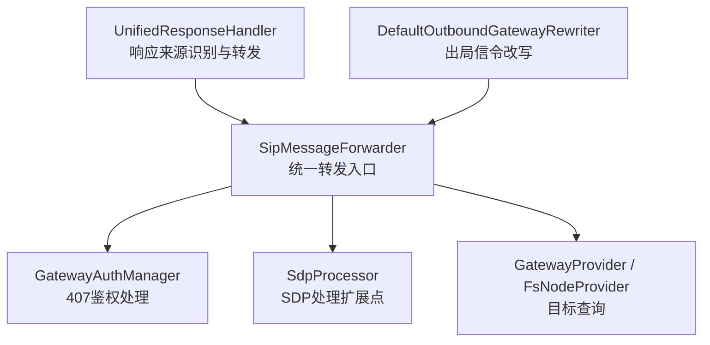
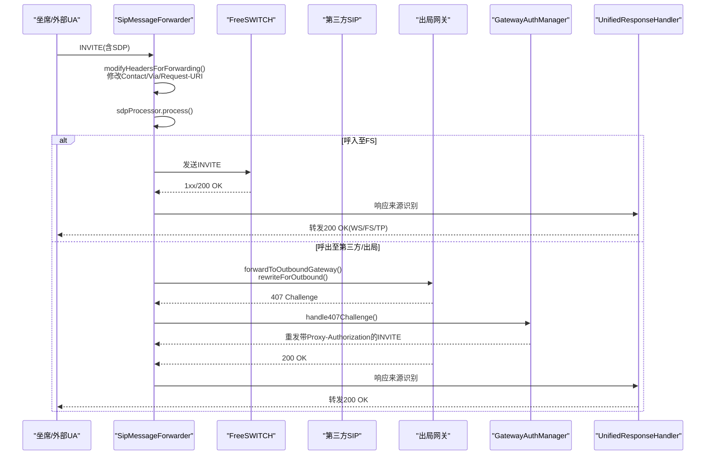
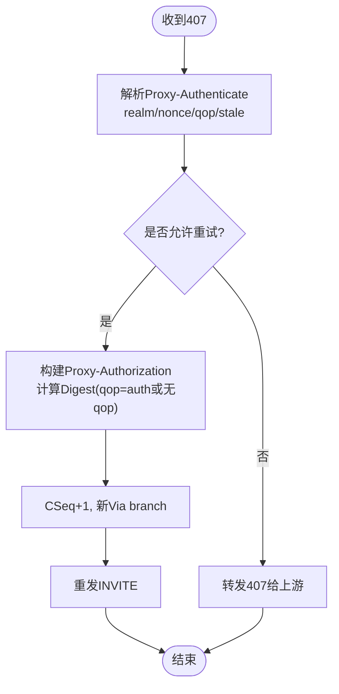
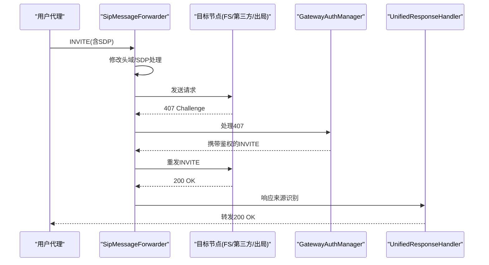
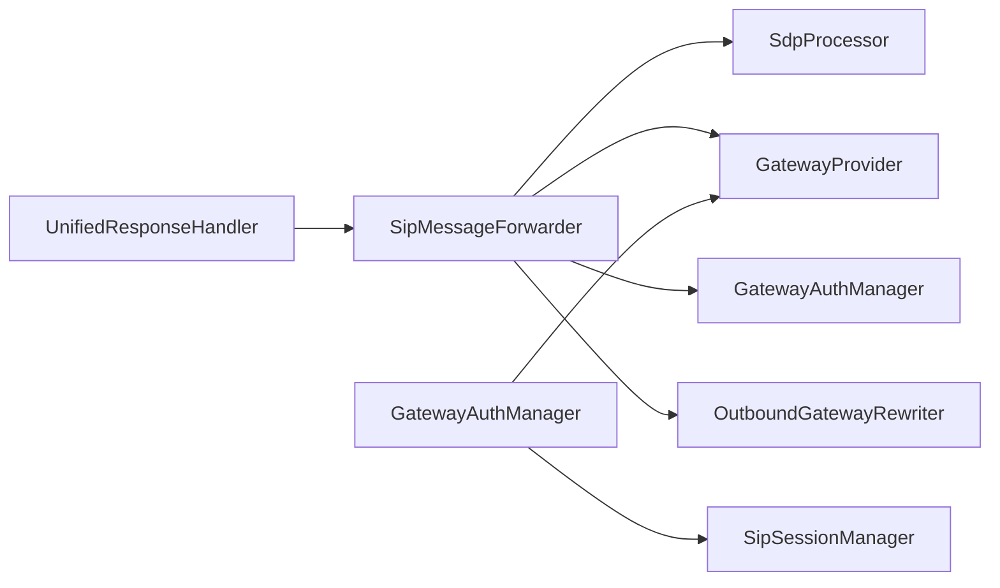

# 消息转发机制

<cite>
**本文引用的文件**
- [SipMessageForwarder.java](file://yudao-cloud/yudao-module-cc/ipcc-sipproxy/src/main/java/cn/ipcc/sipproxy/core/forwarder/SipMessageForwarder.java)
- [GatewayAuthManager.java](file://yudao-cloud/yudao-module-cc/ipcc-sipproxy/src/main/java/cn/ipcc/sipproxy/core/auth/GatewayAuthManager.java)
- [UnifiedResponseHandler.java](file://yudao-cloud/yudao-module-cc/ipcc-sipproxy/src/main/java/cn/ipcc/sipproxy/core/handler/response/UnifiedResponseHandler.java)
- [DefaultOutboundGatewayRewriter.java](file://yudao-cloud/yudao-module-cc/ipcc-sipproxy/src/main/java/cn/ipcc/sipproxy/defaults/gateway/DefaultOutboundGatewayRewriter.java)
- [SdpProcessor.java](file://yudao-cloud/yudao-module-cc/ipcc-sipproxy/src/main/java/cn/ipcc/sipproxy/api/media/SdpProcessor.java)
- [DefaultSdpProcessor.java](file://yudao-cloud/yudao-module-cc/ipcc-sipproxy/src/main/java/cn/ipcc/sipproxy/defaults/media/DefaultSdpProcessor.java)
- [GatewayProvider.java](file://yudao-cloud/yudao-module-cc/ipcc-sipproxy/src/main/java/cn/ipcc/sipproxy/api/gateway/GatewayProvider.java)
- [FsNodeProvider.java](file://yudao-cloud/yudao-module-cc/ipcc-sipproxy/src/main/java/cn/ipcc/sipproxy/api/fs/FsNodeProvider.java)
- [SipProxyConstants.java](file://yudao-cloud/yudao-module-cc/ipcc-sipproxy/src/main/java/cn/ipcc/sipproxy/support/SipProxyConstants.java)
</cite>

## 目录
1. [简介](#简介)
2. [项目结构](#项目结构)
3. [核心组件](#核心组件)
4. [架构总览](#架构总览)
5. [详细组件分析](#详细组件分析)
6. [依赖关系分析](#依赖关系分析)
7. [性能考虑](#性能考虑)
8. [故障排查指南](#故障排查指南)
9. [结论](#结论)
10. [附录](#附录)

## 简介
本文件面向IPCC呼叫中心系统的SIP代理模块，系统化说明“消息转发机制”的实现与策略。重点覆盖四类转发目标：FreeSWITCH（FS）、第三方SIP网关、WebSocket客户端、出局网关；详述头域改写策略（Contact、Via、Request-URI等）；文档化SDP处理、ICE候选校验、传输协议选择；并给出407鉴权处理、重试与超时控制、错误处理策略及完整流程图。

## 项目结构
围绕转发能力，核心位于sipproxy模块的以下位置：
- 转发器：core/forwarder/SipMessageForwarder.java
- 认证：core/auth/GatewayAuthManager.java
- 响应路由：core/handler/response/UnifiedResponseHandler.java
- 出局改写：defaults/gateway/DefaultOutboundGatewayRewriter.java
- SDP扩展点：api/media/SdpProcessor.java 与 defaults/media/DefaultSdpProcessor.java
- 网关/节点查询：api/gateway/GatewayProvider.java、api/fs/FsNodeProvider.java
- 常量定义：support/SipProxyConstants.java

图表来源
- [SipMessageForwarder.java:41-87](file://yudao-cloud/yudao-module-cc/ipcc-sipproxy/src/main/java/cn/ipcc/sipproxy/core/forwarder/SipMessageForwarder.java#L41-L87)
- [GatewayAuthManager.java:26-82](file://yudao-cloud/yudao-module-cc/ipcc-sipproxy/src/main/java/cn/ipcc/sipproxy/core/auth/GatewayAuthManager.java#L26-L82)
- [UnifiedResponseHandler.java:15-64](file://yudao-cloud/yudao-module-cc/ipcc-sipproxy/src/main/java/cn/ipcc/sipproxy/core/handler/response/UnifiedResponseHandler.java#L15-L64)
- [DefaultOutboundGatewayRewriter.java:19-39](file://yudao-cloud/yudao-module-cc/ipcc-sipproxy/src/main/java/cn/ipcc/sipproxy/defaults/gateway/DefaultOutboundGatewayRewriter.java#L19-L39)
- [SdpProcessor.java:5-22](file://yudao-cloud/yudao-module-cc/ipcc-sipproxy/src/main/java/cn/ipcc/sipproxy/api/media/SdpProcessor.java#L5-L22)
- [GatewayProvider.java:7-41](file://yudao-cloud/yudao-module-cc/ipcc-sipproxy/src/main/java/cn/ipcc/sipproxy/api/gateway/GatewayProvider.java#L7-L41)
- [FsNodeProvider.java:7-24](file://yudao-cloud/yudao-module-cc/ipcc-sipproxy/src/main/java/cn/ipcc/sipproxy/api/fs/FsNodeProvider.java#L7-L24)

章节来源
- [SipMessageForwarder.java:41-87](file://yudao-cloud/yudao-module-cc/ipcc-sipproxy/src/main/java/cn/ipcc/sipproxy/core/forwarder/SipMessageForwarder.java#L41-L87)
- [SipProxyConstants.java:10-83](file://yudao-cloud/yudao-module-cc/ipcc-sipproxy/src/main/java/cn/ipcc/sipproxy/support/SipProxyConstants.java#L10-L83)

## 核心组件
- SipMessageForwarder：统一转发器，负责将SIP请求/响应转发到WebSocket、FreeSWITCH、第三方SIP或出局网关；完成头域改写、SDP处理、传输协议选择与故障转移。
- GatewayAuthManager：处理407鉴权挑战，支持无qop与qop=auth模式，具备循环防护与最大重试次数限制。
- UnifiedResponseHandler：基于来源识别与Session上下文校正，决定响应回送目标（WebSocket/FS/第三方）。
- DefaultOutboundGatewayRewriter：默认出局INVITE头域改写（From、PAI、Record-Route清理），可被自定义实现覆盖。
- SdpProcessor/DefaultSdpProcessor：SDP处理扩展点，默认透传，父程序可实现ICE候选替换、编解码过滤等。
- GatewayProvider/FsNodeProvider：抽象网关/FS节点查询接口，避免直接耦合数据层。

章节来源
- [SipMessageForwarder.java:88-257](file://yudao-cloud/yudao-module-cc/ipcc-sipproxy/src/main/java/cn/ipcc/sipproxy/core/forwarder/SipMessageForwarder.java#L88-L257)
- [GatewayAuthManager.java:84-240](file://yudao-cloud/yudao-module-cc/ipcc-sipproxy/src/main/java/cn/ipcc/sipproxy/core/auth/GatewayAuthManager.java#L84-L240)
- [UnifiedResponseHandler.java:31-64](file://yudao-cloud/yudao-module-cc/ipcc-sipproxy/src/main/java/cn/ipcc/sipproxy/core/handler/response/UnifiedResponseHandler.java#L31-L64)
- [DefaultOutboundGatewayRewriter.java:59-135](file://yudao-cloud/yudao-module-cc/ipcc-sipproxy/src/main/java/cn/ipcc/sipproxy/defaults/gateway/DefaultOutboundGatewayRewriter.java#L59-L135)
- [SdpProcessor.java:5-22](file://yudao-cloud/yudao-module-cc/ipcc-sipproxy/src/main/java/cn/ipcc/sipproxy/api/media/SdpProcessor.java#L5-L22)
- [GatewayProvider.java:7-41](file://yudao-cloud/yudao-module-cc/ipcc-sipproxy/src/main/java/cn/ipcc/sipproxy/api/gateway/GatewayProvider.java#L7-L41)
- [FsNodeProvider.java:7-24](file://yudao-cloud/yudao-module-cc/ipcc-sipproxy/src/main/java/cn/ipcc/sipproxy/api/fs/FsNodeProvider.java#L7-L24)

## 架构总览
下图展示一次典型呼叫中，SIP代理如何协调各组件完成四路转发与响应回送。

图表来源
- [SipMessageForwarder.java:110-201](file://yudao-cloud/yudao-module-cc/ipcc-sipproxy/src/main/java/cn/ipcc/sipproxy/core/forwarder/SipMessageForwarder.java#L110-L201)
- [SipMessageForwarder.java:203-240](file://yudao-cloud/yudao-module-cc/ipcc-sipproxy/src/main/java/cn/ipcc/sipproxy/core/forwarder/SipMessageForwarder.java#L203-L240)
- [SipMessageForwarder.java:558-611](file://yudao-cloud/yudao-module-cc/ipcc-sipproxy/src/main/java/cn/ipcc/sipproxy/core/forwarder/SipMessageForwarder.java#L558-L611)
- [GatewayAuthManager.java:119-240](file://yudao-cloud/yudao-module-cc/ipcc-sipproxy/src/main/java/cn/ipcc/sipproxy/core/auth/GatewayAuthManager.java#L119-L240)
- [UnifiedResponseHandler.java:31-64](file://yudao-cloud/yudao-module-cc/ipcc-sipproxy/src/main/java/cn/ipcc/sipproxy/core/handler/response/UnifiedResponseHandler.java#L31-L64)

## 详细组件分析

### 四种转发目标与差异
- 转发到FreeSWITCH
  - 入口：forwardToFreeSwitch()
  - 特性：自动故障转移（尝试多个FS节点直至成功或耗尽）；按会话信息选择UDP/TCP传输；对SDP调用SdpProcessor处理；修改Contact/Via/Request-URI以适配下一跳。
  - 失败处理：记录已尝试节点列表，抛出统一异常供上层处理。
- 转发到第三方SIP
  - 入口：forwardToThirdParty()
  - 特性：根据会话信息选择传输；修改头域与SDP后通过对应SipProvider发送；异常统一包装。
- 转发到WebSocket
  - 入口：toWebSocket()/forwardToWebSocketByUser()
  - 特性：将SIP消息序列化为文本经WsSessionManager发送；针对WS场景重写Contact/Via/Request-URI，并将媒体地址替换为FS公网IP以支持ICE/DTLS-SRTP。
- 转发到出局网关
  - 入口：forwardToOutboundGateway()
  - 特性：先修改头域，再委托OutboundGatewayRewriter进行标准出局改写（From/PAI/Record-Route），随后调用SdpProcessor处理SDP，最后按会话传输发送；缓存原始INVITE用于后续407重发。

章节来源
- [SipMessageForwarder.java:110-201](file://yudao-cloud/yudao-module-cc/ipcc-sipproxy/src/main/java/cn/ipcc/sipproxy/core/forwarder/SipMessageForwarder.java#L110-L201)
- [SipMessageForwarder.java:203-240](file://yudao-cloud/yudao-module-cc/ipcc-sipproxy/src/main/java/cn/ipcc/sipproxy/core/forwarder/SipMessageForwarder.java#L203-L240)
- [SipMessageForwarder.java:242-257](file://yudao-cloud/yudao-module-cc/ipcc-sipproxy/src/main/java/cn/ipcc/sipproxy/core/forwarder/SipMessageForwarder.java#L242-L257)
- [SipMessageForwarder.java:558-611](file://yudao-cloud/yudao-module-cc/ipcc-sipproxy/src/main/java/cn/ipcc/sipproxy/core/forwarder/SipMessageForwarder.java#L558-L611)

### 头域改写策略（Contact、Via、Request-URI）
- 通用改写（FS/第三方/出局）
  - Contact：替换为代理公网地址与端口，并附加transport参数（udp/tcp/ws/wss）。
  - Via：请求方向添加代理公网Via；响应方向添加目标端Via；保留branch并设置rport。
  - Request-URI：请求时重写为目标IP与端口；保留原user部分。
- WebSocket代理专用改写
  - Contact/Via：使用本地监听地址与端口，transport设为ws。
  - Request-URI：优先使用会话中记录的WebSocket Contact；否则构造指向本地的SIP URI，并对FS originate场景中的“用户&域名”格式做裁剪，仅保留纯坐席号，确保JsSIP能匹配并触发来电事件。
- 出局网关改写（默认实现）
  - From：按配置决定是否使用原始主叫或线路号码（externalLineNumber）。
  - P-Asserted-Identity：注入原始主叫，便于运营商透传。
  - Record-Route：移除以避免误把代理作为下一跳。

章节来源
- [SipMessageForwarder.java:262-358](file://yudao-cloud/yudao-module-cc/ipcc-sipproxy/src/main/java/cn/ipcc/sipproxy/core/forwarder/SipMessageForwarder.java#L262-L358)
- [SipMessageForwarder.java:391-474](file://yudao-cloud/yudao-module-cc/ipcc-sipproxy/src/main/java/cn/ipcc/sipproxy/core/forwarder/SipMessageForwarder.java#L391-L474)
- [DefaultOutboundGatewayRewriter.java:80-135](file://yudao-cloud/yudao-module-cc/ipcc-sipproxy/src/main/java/cn/ipcc/sipproxy/defaults/gateway/DefaultOutboundGatewayRewriter.java#L80-L135)

### SDP处理与ICE候选验证
- 扩展点：SdpProcessor.process()在每次转发前被调用，默认实现透传，父程序可覆盖以实现ICE候选替换、编解码过滤等。
- ICE候选完整性校验：当存在a=ice-ufrag但缺少a=candidate时记录告警，提示可能影响媒体协商。
- WebSocket媒体地址替换：将SDP中c=行与a=candidate的连接地址由FS内网IP替换为FS公网IP，确保浏览器侧ICE/DTLS-SRTP握手可达。

章节来源
- [SdpProcessor.java:5-22](file://yudao-cloud/yudao-module-cc/ipcc-sipproxy/src/main/java/cn/ipcc/sipproxy/api/media/SdpProcessor.java#L5-L22)
- [DefaultSdpProcessor.java:17-30](file://yudao-cloud/yudao-module-cc/ipcc-sipproxy/src/main/java/cn/ipcc/sipproxy/defaults/media/DefaultSdpProcessor.java#L17-L30)
- [SipMessageForwarder.java:363-389](file://yudao-cloud/yudao-module-cc/ipcc-sipproxy/src/main/java/cn/ipcc/sipproxy/core/forwarder/SipMessageForwarder.java#L363-L389)
- [SipMessageForwarder.java:479-550](file://yudao-cloud/yudao-module-cc/ipcc-sipproxy/src/main/java/cn/ipcc/sipproxy/core/forwarder/SipMessageForwarder.java#L479-L550)

### 传输协议选择
- 依据会话信息中的toSipTransport字段选择UDP或TCP；若未设置则默认UDP。
- 通过不同的SipProvider实例（UDP/TCP）发送请求/响应。

章节来源
- [SipMessageForwarder.java:163-177](file://yudao-cloud/yudao-module-cc/ipcc-sipproxy/src/main/java/cn/ipcc/sipproxy/core/forwarder/SipMessageForwarder.java#L163-L177)
- [SipMessageForwarder.java:207-217](file://yudao-cloud/yudao-module-cc/ipcc-sipproxy/src/main/java/cn/ipcc/sipproxy/core/forwarder/SipMessageForwarder.java#L207-L217)
- [SipMessageForwarder.java:582-587](file://yudao-cloud/yudao-module-cc/ipcc-sipproxy/src/main/java/cn/ipcc/sipproxy/core/forwarder/SipMessageForwarder.java#L582-L587)

### 407鉴权处理与重试机制
- 预注入策略：默认不预注入Authorization头，直接发送裸INVITE等待407挑战。
- 挑战解析：从Proxy-Authenticate提取realm、nonce、algorithm、qop、stale。
- 循环防护：最多允许2次挑战（首次+stale=true二次），超过上限不再重试。
- Digest计算：支持无qop与qop=auth两种模式，生成Proxy-Authorization并重发INVITE。
- 事务更新：CSeq+1、新Via branch，更新会话计数与最近nonce。

图表来源
- [GatewayAuthManager.java:119-240](file://yudao-cloud/yudao-module-cc/ipcc-sipproxy/src/main/java/cn/ipcc/sipproxy/core/auth/GatewayAuthManager.java#L119-L240)
- [GatewayAuthManager.java:242-289](file://yudao-cloud/yudao-module-cc/ipcc-sipproxy/src/main/java/cn/ipcc/sipproxy/core/auth/GatewayAuthManager.java#L242-L289)

章节来源
- [GatewayAuthManager.java:84-240](file://yudao-cloud/yudao-module-cc/ipcc-sipproxy/src/main/java/cn/ipcc/sipproxy/core/auth/GatewayAuthManager.java#L84-L240)
- [GatewayAuthManager.java:242-289](file://yudao-cloud/yudao-module-cc/ipcc-sipproxy/src/main/java/cn/ipcc/sipproxy/core/auth/GatewayAuthManager.java#L242-L289)

### 响应来源识别与回送策略
- 来源识别：优先通过扩展点识别（WEBSOCKET/FREESWITCH/THIRD_PARTY）。
- 上下文校正：当SessionInfo明确缓存了thirdPartyNode或freeSwitchNode时，修正来源以避免误判（例如第三方网关也是FS部署导致UA相同）。
- 回送目标：根据callType与来源，选择转发到WebSocket/FS/第三方。

章节来源
- [UnifiedResponseHandler.java:31-64](file://yudao-cloud/yudao-module-cc/ipcc-sipproxy/src/main/java/cn/ipcc/sipproxy/core/handler/response/UnifiedResponseHandler.java#L31-L64)
- [UnifiedResponseHandler.java:96-151](file://yudao-cloud/yudao-module-cc/ipcc-sipproxy/src/main/java/cn/ipcc/sipproxy/core/handler/response/UnifiedResponseHandler.java#L96-L151)
- [UnifiedResponseHandler.java:153-216](file://yudao-cloud/yudao-module-cc/ipcc-sipproxy/src/main/java/cn/ipcc/sipproxy/core/handler/response/UnifiedResponseHandler.java#L153-L216)

### 完整转发流程与时序图

图表来源
- [SipMessageForwarder.java:110-201](file://yudao-cloud/yudao-module-cc/ipcc-sipproxy/src/main/java/cn/ipcc/sipproxy/core/forwarder/SipMessageForwarder.java#L110-L201)
- [GatewayAuthManager.java:119-240](file://yudao-cloud/yudao-module-cc/ipcc-sipproxy/src/main/java/cn/ipcc/sipproxy/core/auth/GatewayAuthManager.java#L119-L240)
- [UnifiedResponseHandler.java:31-64](file://yudao-cloud/yudao-module-cc/ipcc-sipproxy/src/main/java/cn/ipcc/sipproxy/core/handler/response/UnifiedResponseHandler.java#L31-L64)

## 依赖关系分析
- 松耦合设计：通过接口抽象（GatewayProvider、FsNodeProvider、SdpProcessor、OutboundGatewayRewriter）解耦数据访问与媒体处理逻辑，便于扩展与替换。
- 关键依赖链：
  - SipMessageForwarder 依赖 SessionInfo、SdpProcessor、GatewayProvider、GatewayAuthManager、OutboundGatewayRewriter。
  - UnifiedResponseHandler 依赖 MessageSourceIdentifier（扩展点）与转发策略。
  - GatewayAuthManager 依赖 GatewayProvider、SipSessionManager、SipNodeManager。

图表来源
- [SipMessageForwarder.java:41-87](file://yudao-cloud/yudao-module-cc/ipcc-sipproxy/src/main/java/cn/ipcc/sipproxy/core/forwarder/SipMessageForwarder.java#L41-L87)
- [GatewayAuthManager.java:59-82](file://yudao-cloud/yudao-module-cc/ipcc-sipproxy/src/main/java/cn/ipcc/sipproxy/core/auth/GatewayAuthManager.java#L59-L82)
- [UnifiedResponseHandler.java:25-30](file://yudao-cloud/yudao-module-cc/ipcc-sipproxy/src/main/java/cn/ipcc/sipproxy/core/handler/response/UnifiedResponseHandler.java#L25-L30)

章节来源
- [GatewayProvider.java:7-41](file://yudao-cloud/yudao-module-cc/ipcc-sipproxy/src/main/java/cn/ipcc/sipproxy/api/gateway/GatewayProvider.java#L7-L41)
- [FsNodeProvider.java:7-24](file://yudao-cloud/yudao-module-cc/ipcc-sipproxy/src/main/java/cn/ipcc/sipproxy/api/fs/FsNodeProvider.java#L7-L24)
- [SdpProcessor.java:5-22](file://yudao-cloud/yudao-module-cc/ipcc-sipproxy/src/main/java/cn/ipcc/sipproxy/api/media/SdpProcessor.java#L5-L22)

## 性能考虑
- 故障转移：对FS节点采用循环尝试，减少单点故障影响。
- 传输选择：基于会话信息动态选择UDP/TCP，降低网络栈切换开销。
- SDP处理：默认透传，仅在必要时执行正则替换（WebSocket场景），避免不必要的CPU消耗。
- 鉴权重试：限制最大挑战次数，防止无限重试造成资源占用。

[本节为通用指导，无需特定文件引用]

## 故障排查指南
- 无法提取Call-ID：检查消息结构与解析工具调用路径。
- 所有FS节点失败：查看已尝试节点列表与异常堆栈，确认节点健康与网络连通性。
- 407鉴权失败：检查网关配置（用户名/密码/认证类型）、challengeCount与stale标志、Digest计算参数。
- WebSocket媒体不通：确认SDP中c=与a=candidate的IP已替换为FS公网IP，且防火墙/NAT放行相应端口。
- 响应回送错误：核查UnifiedResponseHandler的来源识别与上下文校正逻辑，关注Via transport与SessionInfo缓存。

章节来源
- [SipMessageForwarder.java:110-155](file://yudao-cloud/yudao-module-cc/ipcc-sipproxy/src/main/java/cn/ipcc/sipproxy/core/forwarder/SipMessageForwarder.java#L110-L155)
- [GatewayAuthManager.java:119-240](file://yudao-cloud/yudao-module-cc/ipcc-sipproxy/src/main/java/cn/ipcc/sipproxy/core/auth/GatewayAuthManager.java#L119-L240)
- [UnifiedResponseHandler.java:31-64](file://yudao-cloud/yudao-module-cc/ipcc-sipproxy/src/main/java/cn/ipcc/sipproxy/core/handler/response/UnifiedResponseHandler.java#L31-L64)

## 结论
本机制通过统一的转发器与可扩展的处理器，实现了面向FS、第三方SIP、WebSocket与出局网关的多目标转发；结合严格的头域改写、SDP处理与407鉴权重试，保障了端到端的可靠性与兼容性。通过接口抽象与上下文校正，系统具备良好的扩展性与可维护性。

[本节为总结性内容，无需特定文件引用]

## 附录
- 常量参考：信令来源标识、传输协议、JAIN-SIP栈配置等见SipProxyConstants。
- 扩展点清单：
  - OutboundGatewayRewriter：自定义出局信令改写规则。
  - SdpProcessor：自定义SDP处理（ICE候选替换、编解码过滤等）。
  - GatewayProvider/FsNodeProvider：自定义网关/FS节点查询。

章节来源
- [SipProxyConstants.java:10-83](file://yudao-cloud/yudao-module-cc/ipcc-sipproxy/src/main/java/cn/ipcc/sipproxy/support/SipProxyConstants.java#L10-L83)
- [DefaultOutboundGatewayRewriter.java:19-39](file://yudao-cloud/yudao-module-cc/ipcc-sipproxy/src/main/java/cn/ipcc/sipproxy/defaults/gateway/DefaultOutboundGatewayRewriter.java#L19-L39)
- [SdpProcessor.java:5-22](file://yudao-cloud/yudao-module-cc/ipcc-sipproxy/src/main/java/cn/ipcc/sipproxy/api/media/SdpProcessor.java#L5-L22)
- [GatewayProvider.java:7-41](file://yudao-cloud/yudao-module-cc/ipcc-sipproxy/src/main/java/cn/ipcc/sipproxy/api/gateway/GatewayProvider.java#L7-L41)
- [FsNodeProvider.java:7-24](file://yudao-cloud/yudao-module-cc/ipcc-sipproxy/src/main/java/cn/ipcc/sipproxy/api/fs/FsNodeProvider.java#L7-L24)