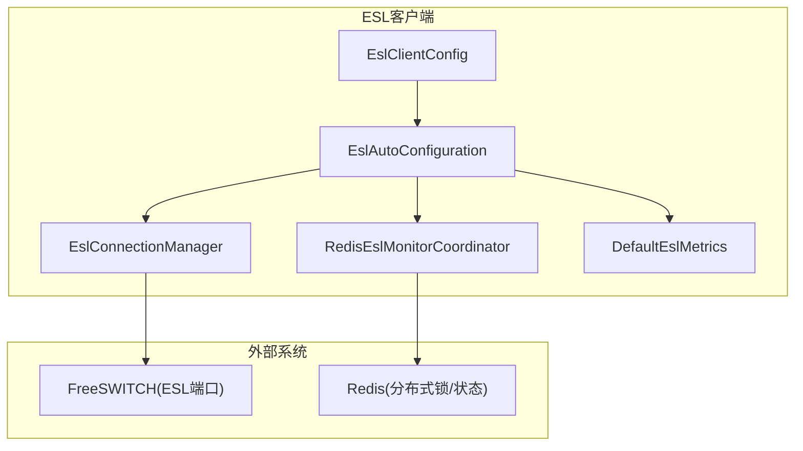
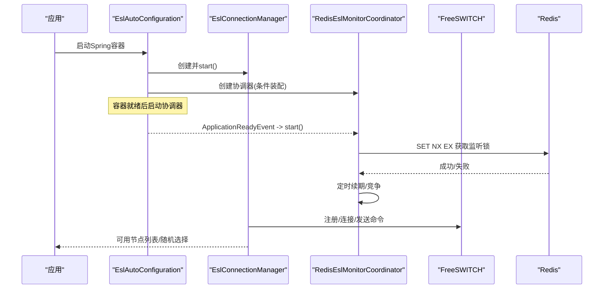
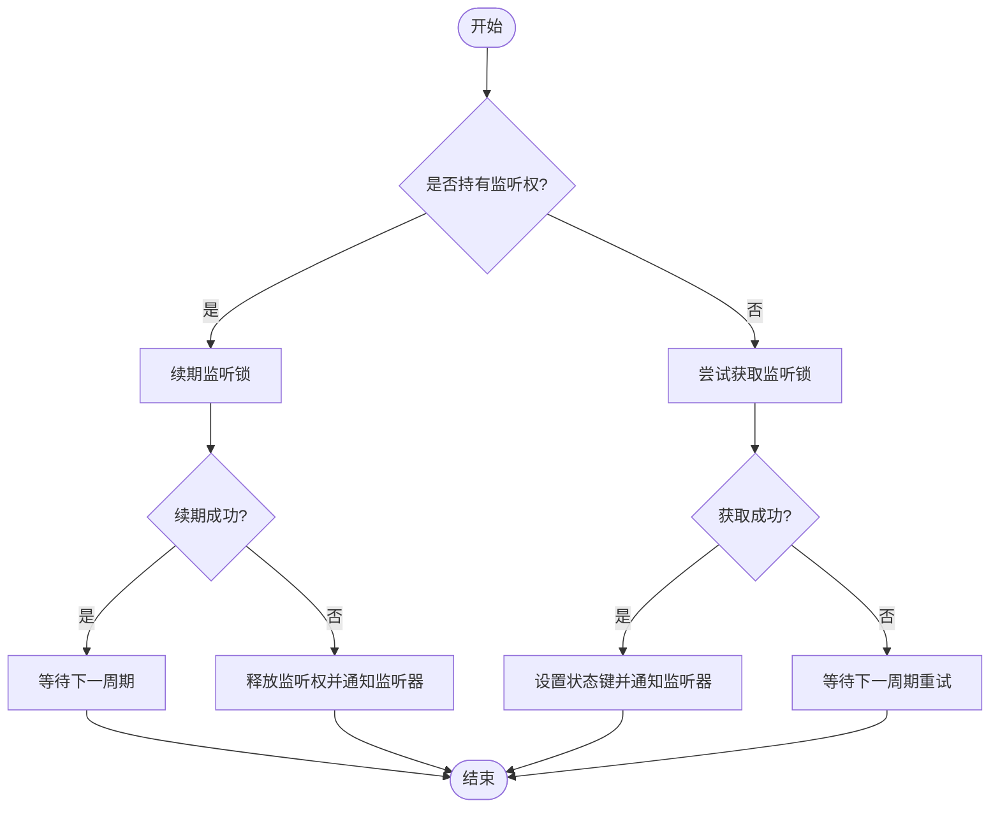
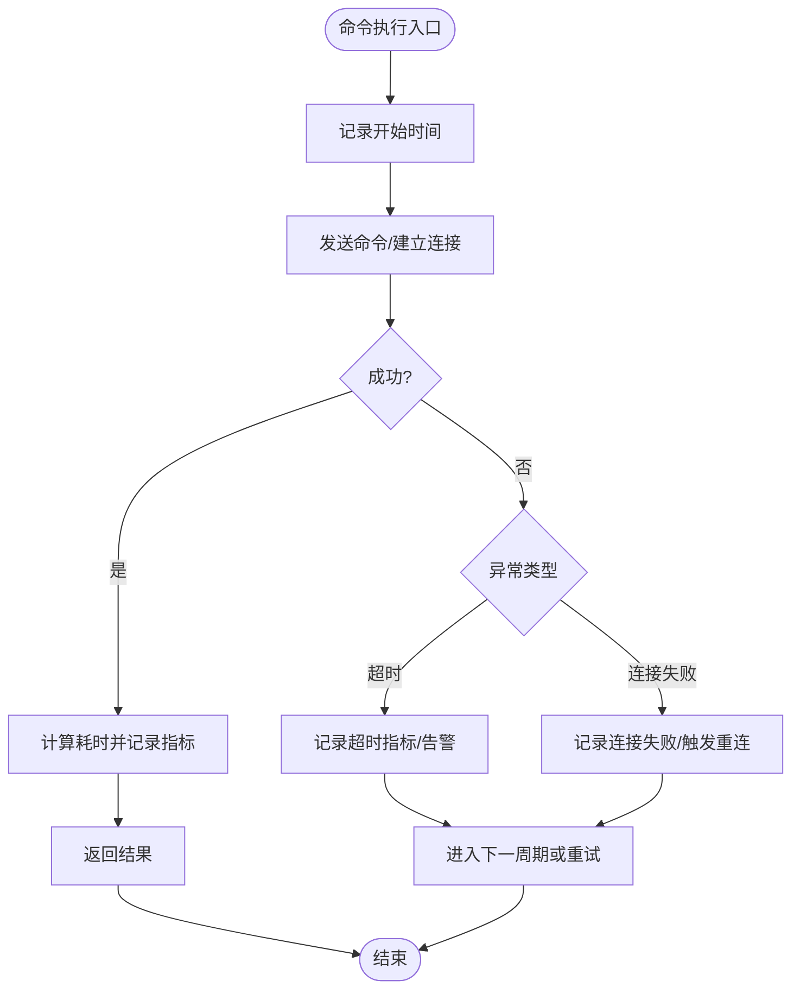
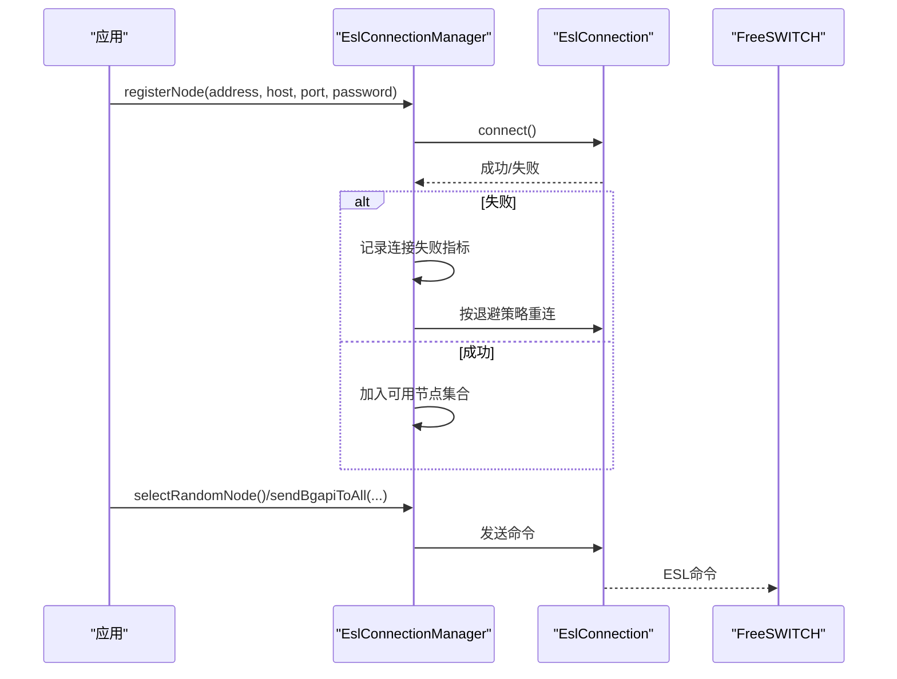
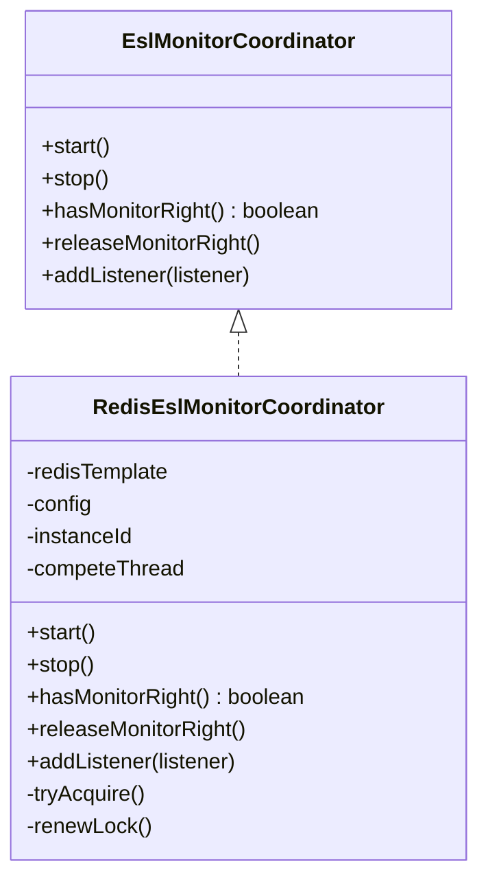
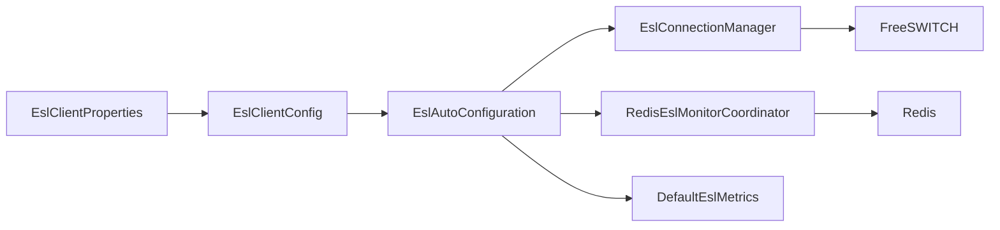
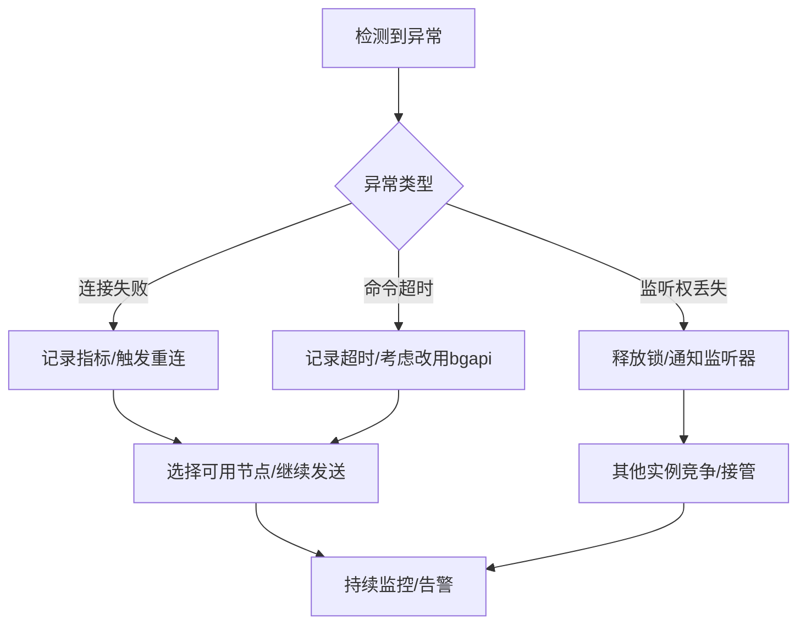

# 健康检查与故障恢复

<cite>
**本文引用的文件**
- [EslClientConfig.java](file://yudao-cloud/yudao-module-cc/ipcc-fs-esl/src/main/java/cn/ipcc/fs/esl/EslClientConfig.java)
- [EslAutoConfiguration.java](file://yudao-cloud/yudao-module-cc/ipcc-fs-esl/src/main/java/cn/ipcc/fs/esl/spring/EslAutoConfiguration.java)
- [EslMonitorCoordinator.java](file://yudao-cloud/yudao-module-cc/ipcc-fs-esl/src/main/java/cn/ipcc/fs/esl/coordinator/EslMonitorCoordinator.java)
- [RedisEslMonitorCoordinator.java](file://yudao-cloud/yudao-module-cc/ipcc-fs-esl/src/main/java/cn/ipcc/fs/esl/coordinator/redis/RedisEslMonitorCoordinator.java)
- [EslConnectionManager.java](file://yudao-cloud/yudao-module-cc/ipcc-fs-esl/src/main/java/cn/ipcc/fs/esl/EslConnectionManager.java)
- [EslMetrics.java](file://yudao-cloud/yudao-module-cc/ipcc-fs-esl/src/main/java/cn/ipcc/fs/esl/metrics/EslMetrics.java)
- [DefaultEslMetrics.java](file://yudao-cloud/yudao-module-cc/ipcc-fs-esl/src/main/java/cn/ipcc/fs/esl/metrics/DefaultEslMetrics.java)
- [EslConnectionException.java](file://yudao-cloud/yudao-module-cc/ipcc-fs-esl/src/main/java/cn/ipcc/fs/esl/exception/EslConnectionException.java)
- [EslCommandTimeoutException.java](file://yudao-cloud/yudao-module-cc/ipcc-fs-esl/src/main/java/cn/ipcc/fs/esl/exception/EslCommandTimeoutException.java)
</cite>

## 目录
1. [简介](#简介)
2. [项目结构](#项目结构)
3. [核心组件](#核心组件)
4. [架构总览](#架构总览)
5. [详细组件分析](#详细组件分析)
6. [依赖关系分析](#依赖关系分析)
7. [性能考量](#性能考量)
8. [故障排查指南](#故障排查指南)
9. [结论](#结论)
10. [附录](#附录)

## 简介
本文件面向IPCC呼叫中心系统的FreeSWITCH节点健康检查与故障恢复机制，覆盖心跳检测、连接状态监控、资源使用率监控、故障检测算法（超时判断、错误统计、阈值配置）、自动恢复（连接重连、节点切换、数据同步策略），以及配置参数、监控告警与性能调优建议。文档同时提供故障场景分析、恢复流程图与应急预案说明，帮助运维与研发快速定位问题并制定处置流程。

## 项目结构
围绕FreeSWITCH ESL客户端的模块位于 yudao-module-cc/ipcc-fs-esl，关键职责如下：
- 配置与装配：EslClientConfig、EslAutoConfiguration
- 连接管理：EslConnectionManager（多节点注册、选择、批量命令）
- 分布式协调：EslMonitorCoordinator 接口与 RedisEslMonitorCoordinator 实现（监听权竞争、续期、释放）
- 指标与拦截：EslMetrics 接口与 DefaultEslMetrics 默认实现（连接、命令、事件、线程池指标）
- 异常体系：EslConnectionException、EslCommandTimeoutException

图表来源
- [EslAutoConfiguration.java:56-85](file://yudao-cloud/yudao-module-cc/ipcc-fs-esl/src/main/java/cn/ipcc/fs/esl/spring/EslAutoConfiguration.java#L56-L85)
- [EslAutoConfiguration.java:98-127](file://yudao-cloud/yudao-module-cc/ipcc-fs-esl/src/main/java/cn/ipcc/fs/esl/spring/EslAutoConfiguration.java#L98-L127)
- [EslAutoConfiguration.java:135-169](file://yudao-cloud/yudao-module-cc/ipcc-fs-esl/src/main/java/cn/ipcc/fs/esl/spring/EslAutoConfiguration.java#L135-L169)
- [EslClientConfig.java:11-60](file://yudao-cloud/yudao-module-cc/ipcc-fs-esl/src/main/java/cn/ipcc/fs/esl/EslClientConfig.java#L11-L60)

章节来源
- [EslAutoConfiguration.java:56-169](file://yudao-cloud/yudao-module-cc/ipcc-fs-esl/src/main/java/cn/ipcc/fs/esl/spring/EslAutoConfiguration.java#L56-L169)
- [EslClientConfig.java:11-60](file://yudao-cloud/yudao-module-cc/ipcc-fs-esl/src/main/java/cn/ipcc/fs/esl/EslClientConfig.java#L11-L60)

## 核心组件
- EslClientConfig：集中定义连接、重连、健康检查、事件线程池、分布式协调等参数，并提供合理默认值。
- EslAutoConfiguration：将配置属性绑定为EslClientConfig；创建并装配EslConnectionManager、EslMonitorCoordinator、EslEventRouter、EslMetrics等Bean；在容器就绪后启动监听权竞争任务。
- EslConnectionManager：维护多个FS节点连接，支持随机选择可用节点、批量bgapi发送、对账式syncNodes动态扩缩容。
- EslMonitorCoordinator / RedisEslMonitorCoordinator：基于Redis SET NX EX + 状态键实现监听权竞争、续期与释放；通过监听器通知上层进行资源切换。
- EslMetrics / DefaultEslMetrics：记录连接、命令、事件、线程池指标，便于监控与告警。
- 异常类型：区分连接异常与命令超时异常，便于上层分类处理与重试策略。

章节来源
- [EslClientConfig.java:11-60](file://yudao-cloud/yudao-module-cc/ipcc-fs-esl/src/main/java/cn/ipcc/fs/esl/EslClientConfig.java#L11-L60)
- [EslAutoConfiguration.java:56-169](file://yudao-cloud/yudao-module-cc/ipcc-fs-esl/src/main/java/cn/ipcc/fs/esl/spring/EslAutoConfiguration.java#L56-L169)
- [EslConnectionManager.java:19-113](file://yudao-cloud/yudao-module-cc/ipcc-fs-esl/src/main/java/cn/ipcc/fs/esl/EslConnectionManager.java#L19-L113)
- [EslMonitorCoordinator.java:3-31](file://yudao-cloud/yudao-module-cc/ipcc-fs-esl/src/main/java/cn/ipcc/fs/esl/coordinator/EslMonitorCoordinator.java#L3-L31)
- [RedisEslMonitorCoordinator.java:16-158](file://yudao-cloud/yudao-module-cc/ipcc-fs-esl/src/main/java/cn/ipcc/fs/esl/coordinator/redis/RedisEslMonitorCoordinator.java#L16-L158)
- [EslMetrics.java:3-25](file://yudao-cloud/yudao-module-cc/ipcc-fs-esl/src/main/java/cn/ipcc/fs/esl/metrics/EslMetrics.java#L3-L25)
- [DefaultEslMetrics.java:9-79](file://yudao-cloud/yudao-module-cc/ipcc-fs-esl/src/main/java/cn/ipcc/fs/esl/metrics/DefaultEslMetrics.java#L9-L79)
- [EslConnectionException.java:3-25](file://yudao-cloud/yudao-module-cc/ipcc-fs-esl/src/main/java/cn/ipcc/fs/esl/exception/EslConnectionException.java#L3-L25)
- [EslCommandTimeoutException.java:3-25](file://yudao-cloud/yudao-module-cc/ipcc-fs-esl/src/main/java/cn/ipcc/fs/esl/exception/EslCommandTimeoutException.java#L3-L25)

## 架构总览
下图展示健康检查与故障恢复的整体交互：应用通过自动配置装配各组件；连接管理器负责多节点管理与命令路由；协调器基于Redis实现分布式监听权竞争与续期；指标组件采集连接/命令/事件/线程池指标用于监控告警。

图表来源
- [EslAutoConfiguration.java:98-169](file://yudao-cloud/yudao-module-cc/ipcc-fs-esl/src/main/java/cn/ipcc/fs/esl/spring/EslAutoConfiguration.java#L98-L169)
- [RedisEslMonitorCoordinator.java:61-115](file://yudao-cloud/yudao-module-cc/ipcc-fs-esl/src/main/java/cn/ipcc/fs/esl/coordinator/redis/RedisEslMonitorCoordinator.java#L61-L115)
- [EslConnectionManager.java:42-68](file://yudao-cloud/yudao-module-cc/ipcc-fs-esl/src/main/java/cn/ipcc/fs/esl/EslConnectionManager.java#L42-L68)

## 详细组件分析

### FreeSWITCH节点健康检查策略
- 心跳检测与续期：协调器以固定频率尝试获取或续期监听锁，续期失败则主动释放监听权，触发其他实例竞争。
- 连接状态监控：连接管理器维护可用节点集合，仅向canSend()为true的节点发送命令；批量bgapi时跳过不可用节点并记录日志。
- 资源使用率监控：指标组件记录线程池活跃线程数、队列长度、完成任务数，结合事件处理延迟告警。

图表来源
- [RedisEslMonitorCoordinator.java:77-115](file://yudao-cloud/yudao-module-cc/ipcc-fs-esl/src/main/java/cn/ipcc/fs/esl/coordinator/redis/RedisEslMonitorCoordinator.java#L77-L115)
- [EslMonitorCoordinator.java:15-31](file://yudao-cloud/yudao-module-cc/ipcc-fs-esl/src/main/java/cn/ipcc/fs/esl/coordinator/EslMonitorCoordinator.java#L15-L31)

章节来源
- [RedisEslMonitorCoordinator.java:61-158](file://yudao-cloud/yudao-module-cc/ipcc-fs-esl/src/main/java/cn/ipcc/fs/esl/coordinator/redis/RedisEslMonitorCoordinator.java#L61-L158)
- [EslConnectionManager.java:121-165](file://yudao-cloud/yudao-module-cc/ipcc-fs-esl/src/main/java/cn/ipcc/fs/esl/EslConnectionManager.java#L121-L165)
- [DefaultEslMetrics.java:67-79](file://yudao-cloud/yudao-module-cc/ipcc-fs-esl/src/main/java/cn/ipcc/fs/esl/metrics/DefaultEslMetrics.java#L67-L79)

### 故障检测算法（超时、错误统计、阈值）
- 超时判断：同步命令响应受commandTimeoutSeconds限制，超时抛出EslCommandTimeoutException；连接建立受connectTimeoutSeconds限制。
- 错误统计：指标组件记录连接失败、命令失败、事件拒绝、慢事件处理等计数与延迟，便于阈值告警。
- 阈值配置：healthCheckIntervalSeconds控制健康检查间隔；healthCheckFailureThreshold为连续失败阈值，达到后触发重连或降级策略。

图表来源
- [EslClientConfig.java:13-37](file://yudao-cloud/yudao-module-cc/ipcc-fs-esl/src/main/java/cn/ipcc/fs/esl/EslClientConfig.java#L13-L37)
- [DefaultEslMetrics.java:22-65](file://yudao-cloud/yudao-module-cc/ipcc-fs-esl/src/main/java/cn/ipcc/fs/esl/metrics/DefaultEslMetrics.java#L22-L65)
- [EslCommandTimeoutException.java:3-25](file://yudao-cloud/yudao-module-cc/ipcc-fs-esl/src/main/java/cn/ipcc/fs/esl/exception/EslCommandTimeoutException.java#L3-L25)
- [EslConnectionException.java:3-25](file://yudao-cloud/yudao-module-cc/ipcc-fs-esl/src/main/java/cn/ipcc/fs/esl/exception/EslConnectionException.java#L3-L25)

章节来源
- [EslClientConfig.java:13-37](file://yudao-cloud/yudao-module-cc/ipcc-fs-esl/src/main/java/cn/ipcc/fs/esl/EslClientConfig.java#L13-L37)
- [DefaultEslMetrics.java:22-65](file://yudao-cloud/yudao-module-cc/ipcc-fs-esl/src/main/java/cn/ipcc/fs/esl/metrics/DefaultEslMetrics.java#L22-L65)

### 自动恢复机制（重连、节点切换、数据同步）
- 连接重连：基于reconnectBaseDelaySeconds与reconnectMaxDelaySeconds指数退避；maxReconnectAttempts控制最大重试次数（0表示无限）。
- 节点切换：连接管理器提供selectRandomNode从可用节点中随机选择；sendBgapiToAll可批量发送到所有可用节点。
- 数据同步：syncNodes对目标节点列表与现有连接池做差集，移除多余节点、新增缺失节点，保持连接复用。

图表来源
- [EslConnectionManager.java:54-68](file://yudao-cloud/yudao-module-cc/ipcc-fs-esl/src/main/java/cn/ipcc/fs/esl/EslConnectionManager.java#L54-L68)
- [EslConnectionManager.java:89-113](file://yudao-cloud/yudao-module-cc/ipcc-fs-esl/src/main/java/cn/ipcc/fs/esl/EslConnectionManager.java#L89-L113)
- [EslConnectionManager.java:132-165](file://yudao-cloud/yudao-module-cc/ipcc-fs-esl/src/main/java/cn/ipcc/fs/esl/EslConnectionManager.java#L132-L165)
- [EslClientConfig.java:25-31](file://yudao-cloud/yudao-module-cc/ipcc-fs-esl/src/main/java/cn/ipcc/fs/esl/EslClientConfig.java#L25-L31)

章节来源
- [EslConnectionManager.java:54-165](file://yudao-cloud/yudao-module-cc/ipcc-fs-esl/src/main/java/cn/ipcc/fs/esl/EslConnectionManager.java#L54-L165)
- [EslClientConfig.java:25-31](file://yudao-cloud/yudao-module-cc/ipcc-fs-esl/src/main/java/cn/ipcc/fs/esl/EslClientConfig.java#L25-L31)

### 分布式监听权与故障切换
- 竞争机制：SET NX EX获取分布式锁，持权后定时续期；未持权时定期尝试竞争。
- 故障切换：持权实例宕机导致锁过期自动释放，其他实例竞争获取；续期失败主动释放监听权，触发竞争。
- 状态键：statusKey记录当前持权实例，便于观测与排障。

图表来源
- [EslMonitorCoordinator.java:3-31](file://yudao-cloud/yudao-module-cc/ipcc-fs-esl/src/main/java/cn/ipcc/fs/esl/coordinator/EslMonitorCoordinator.java#L3-L31)
- [RedisEslMonitorCoordinator.java:16-158](file://yudao-cloud/yudao-module-cc/ipcc-fs-esl/src/main/java/cn/ipcc/fs/esl/coordinator/redis/RedisEslMonitorCoordinator.java#L16-L158)

章节来源
- [EslMonitorCoordinator.java:3-31](file://yudao-cloud/yudao-module-cc/ipcc-fs-esl/src/main/java/cn/ipcc/fs/esl/coordinator/EslMonitorCoordinator.java#L3-L31)
- [RedisEslMonitorCoordinator.java:61-158](file://yudao-cloud/yudao-module-cc/ipcc-fs-esl/src/main/java/cn/ipcc/fs/esl/coordinator/redis/RedisEslMonitorCoordinator.java#L61-L158)

### 监控与告警
- 指标维度：连接（recordConnect/recordDisconnect/recordReconnect）、命令（recordCommand）、事件（recordEventReceived/recordEventProcessed/recordEventRejected）、线程池（recordThreadPoolStatus）。
- 告警建议：连接失败率、命令失败率、事件处理慢（>1000ms）、线程池队列堆积、重连频繁等。
- 扩展能力：可通过自定义EslMetrics替换为Micrometer/Prometheus实现，统一接入监控系统。

章节来源
- [EslMetrics.java:3-25](file://yudao-cloud/yudao-module-cc/ipcc-fs-esl/src/main/java/cn/ipcc/fs/esl/metrics/EslMetrics.java#L3-L25)
- [DefaultEslMetrics.java:22-79](file://yudao-cloud/yudao-module-cc/ipcc-fs-esl/src/main/java/cn/ipcc/fs/esl/metrics/DefaultEslMetrics.java#L22-L79)

## 依赖关系分析
- 配置到组件：EslAutoConfiguration将EslClientProperties转换为EslClientConfig，并注入到EslConnectionManager、EslMonitorCoordinator、EslEventRouter等。
- 协调器依赖：RedisEslMonitorCoordinator依赖StringRedisTemplate与EslClientConfig，通过Redis Key实现分布式锁与状态。
- 连接管理器依赖：EslConnectionManager依赖EslClientConfig与EslConnection（由内部创建），并通过监听器上报事件与连接生命周期。
- 指标依赖：DefaultEslMetrics被EslAutoConfiguration作为默认实现注入，供拦截器与业务代码使用。

图表来源
- [EslAutoConfiguration.java:56-85](file://yudao-cloud/yudao-module-cc/ipcc-fs-esl/src/main/java/cn/ipcc/fs/esl/spring/EslAutoConfiguration.java#L56-L85)
- [EslAutoConfiguration.java:98-169](file://yudao-cloud/yudao-module-cc/ipcc-fs-esl/src/main/java/cn/ipcc/fs/esl/spring/EslAutoConfiguration.java#L98-L169)
- [RedisEslMonitorCoordinator.java:39-59](file://yudao-cloud/yudao-module-cc/ipcc-fs-esl/src/main/java/cn/ipcc/fs/esl/coordinator/redis/RedisEslMonitorCoordinator.java#L39-L59)

章节来源
- [EslAutoConfiguration.java:56-169](file://yudao-cloud/yudao-module-cc/ipcc-fs-esl/src/main/java/cn/ipcc/fs/esl/spring/EslAutoConfiguration.java#L56-L169)
- [RedisEslMonitorCoordinator.java:39-59](file://yudao-cloud/yudao-module-cc/ipcc-fs-esl/src/main/java/cn/ipcc/fs/esl/coordinator/redis/RedisEslMonitorCoordinator.java#L39-L59)

## 性能考量
- 事件线程池：eventThreadPoolSize与eventQueueCapacity需根据事件吞吐调整；eventRejectedPolicy建议使用CALLER_RUNS避免丢事件。
- 健康检查间隔：healthCheckIntervalSeconds不宜过小，避免频繁竞争造成Redis压力；建议与monitorCompeteIntervalSeconds协调配置。
- 重连退避：reconnectBaseDelaySeconds与reconnectMaxDelaySeconds应合理设置，防止雪崩；maxReconnectAttempts=0适用于高可用场景。
- 帧与头部限制：maxFrameSize与maxHeaderLines防止放大攻击与OOM；nettyWorkerThreads根据CPU核数与并发量调整。

[本节为通用性能指导，不直接分析具体文件]

## 故障排查指南
- 连接失败：检查connectTimeoutSeconds与网络连通性；查看连接失败指标与日志；确认密码与端口正确。
- 命令超时：检查commandTimeoutSeconds是否过短；对于长时间运行命令优先使用bgapi避免阻塞；关注EslCommandTimeoutException。
- 监听权丢失：观察续期失败日志；确认Redis连通性与锁过期时间；必要时手动释放监听权并重新竞争。
- 事件处理慢：关注recordEventProcessed延迟告警；评估eventThreadPoolSize与eventQueueCapacity；优化处理器逻辑。
- 节点不一致：使用syncNodes对账；检查availableAddresses与目标节点列表差异；确认registerNode/unregisterNode调用时机。

章节来源
- [EslConnectionManager.java:121-165](file://yudao-cloud/yudao-module-cc/ipcc-fs-esl/src/main/java/cn/ipcc/fs/esl/EslConnectionManager.java#L121-L165)
- [DefaultEslMetrics.java:22-65](file://yudao-cloud/yudao-module-cc/ipcc-fs-esl/src/main/java/cn/ipcc/fs/esl/metrics/DefaultEslMetrics.java#L22-L65)
- [EslCommandTimeoutException.java:3-25](file://yudao-cloud/yudao-module-cc/ipcc-fs-esl/src/main/java/cn/ipcc/fs/esl/exception/EslCommandTimeoutException.java#L3-L25)
- [EslConnectionException.java:3-25](file://yudao-cloud/yudao-module-cc/ipcc-fs-esl/src/main/java/cn/ipcc/fs/esl/exception/EslConnectionException.java#L3-L25)

## 结论
本方案通过EslClientConfig集中化配置、EslAutoConfiguration自动化装配、EslConnectionManager多节点管理、RedisEslMonitorCoordinator分布式协调与DefaultEslMetrics指标采集，构建了完整的FreeSWITCH节点健康检查与故障恢复体系。配合合理的阈值与告警策略，可实现快速故障检测、自动重连与平滑切换，保障呼叫中心的高可用与稳定性。

[本节为总结性内容，不直接分析具体文件]

## 附录

### 配置参数清单（节选）
- 连接与协议
  - connectTimeoutSeconds：连接超时（秒）
  - commandTimeoutSeconds：同步命令响应超时（秒）
  - maxFrameSize：最大帧大小（字节）
  - maxHeaderLines：消息头最大行数
  - nettyWorkerThreads：Netty worker线程数
- 重连
  - reconnectBaseDelaySeconds：重连基础延迟（秒）
  - reconnectMaxDelaySeconds：重连最大延迟（秒）
  - maxReconnectAttempts：最大重连次数（0=无限）
- 健康检查
  - healthCheckIntervalSeconds：健康检查间隔（秒，0=关闭）
  - healthCheckFailureThreshold：连续失败阈值
- 事件线程池
  - eventExecutorMode：事件执行策略
  - eventThreadPoolSize：事件线程池大小
  - eventQueueCapacity：事件队列容量
  - eventRejectedPolicy：事件拒绝策略
- 分布式协调
  - monitorEnabled：是否启用监听权竞争
  - monitorGroup：监听组标识
  - monitorCompeteIntervalSeconds：竞争间隔（秒）
  - monitorLockExpireSeconds：锁过期时间（秒）
  - monitorHeartbeatIntervalSeconds：心跳续期间隔（秒）

章节来源
- [EslClientConfig.java:11-60](file://yudao-cloud/yudao-module-cc/ipcc-fs-esl/src/main/java/cn/ipcc/fs/esl/EslClientConfig.java#L11-L60)

### 故障场景与恢复流程
- 场景一：FreeSWITCH节点网络抖动
  - 现象：连接失败、命令超时、事件处理延迟上升
  - 恢复：重连退避、切换到其他可用节点、指标告警
- 场景二：持权实例宕机
  - 现象：监听锁过期，其他实例竞争获取
  - 恢复：自动释放与竞争、通知上层切换资源
- 场景三：节点列表变更
  - 现象：新增/移除节点
  - 恢复：syncNodes对账，增量注册/卸载连接

[此图为概念性流程图，不直接映射具体源码文件]

### 应急预案
- 立即措施
  - 暂停流量或限流，避免雪崩
  - 检查Redis连通性与锁状态
  - 重启异常节点或扩容新节点
- 中期措施
  - 调整健康检查间隔与阈值
  - 优化事件线程池与队列容量
  - 补充监控告警规则
- 长期措施
  - 完善压测与演练
  - 引入更完善的指标平台与可视化
  - 制定回滚与灰度发布策略

[本节为通用应急指导，不直接分析具体文件]