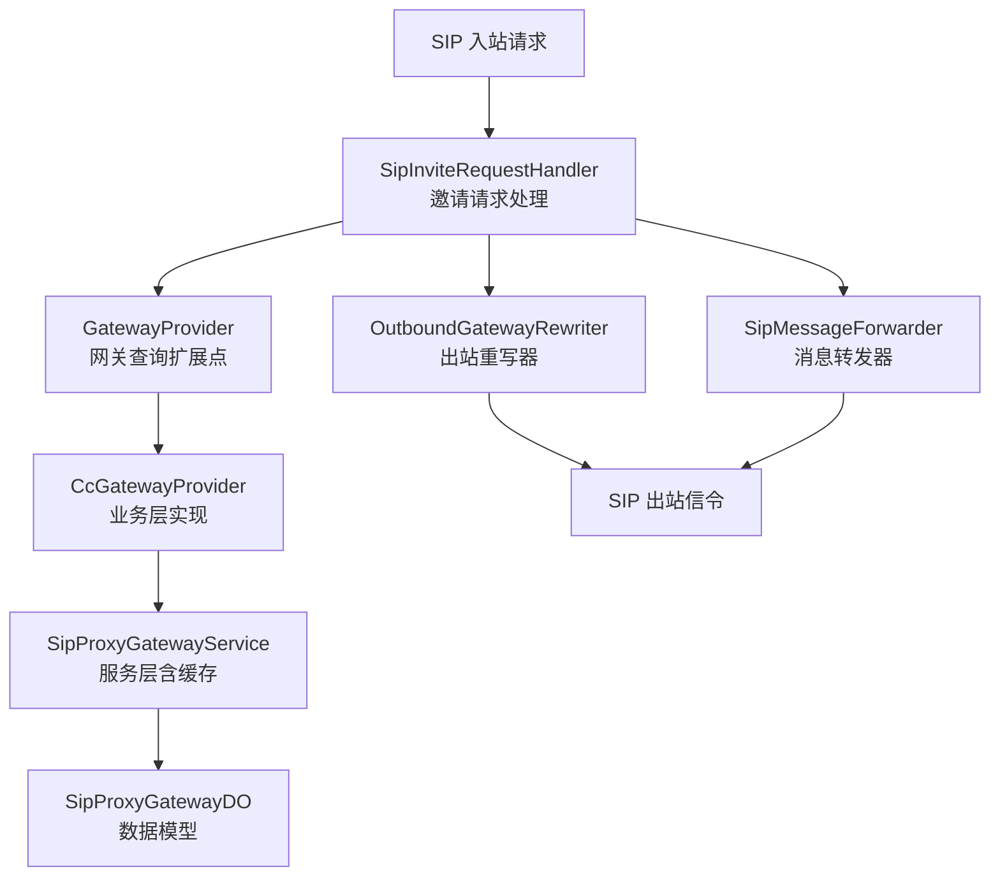
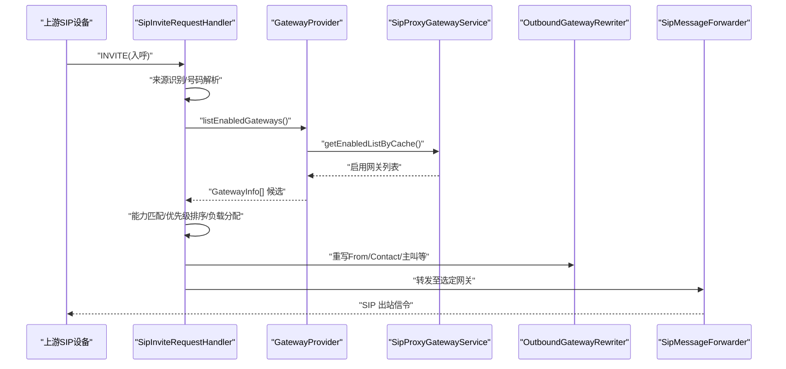
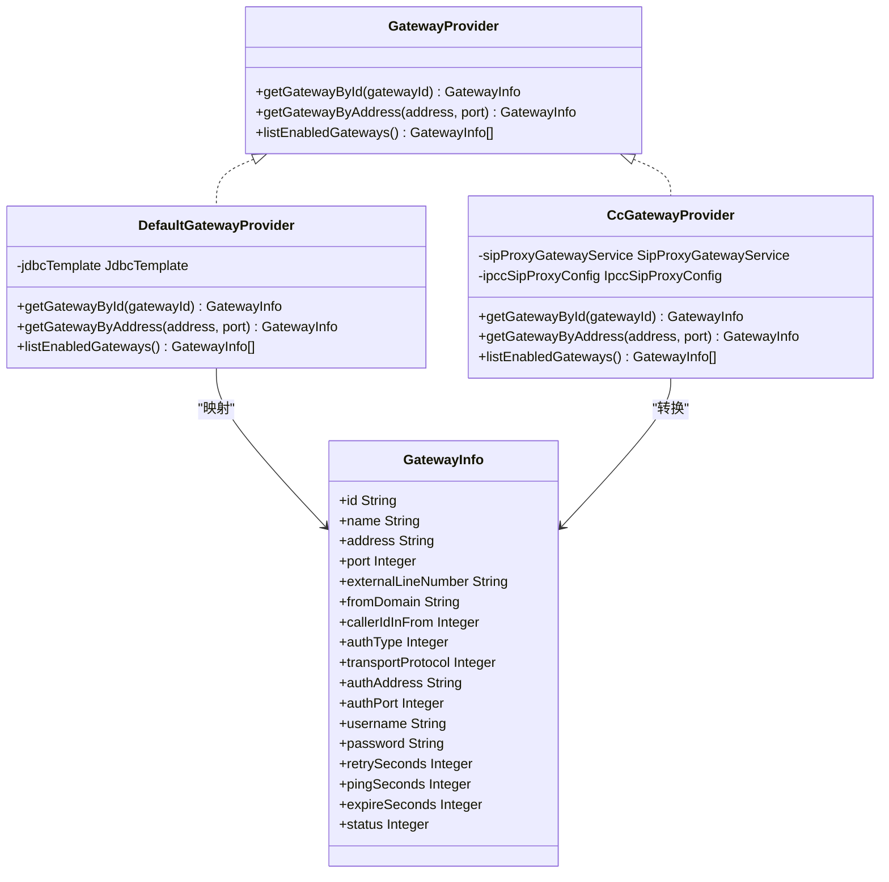
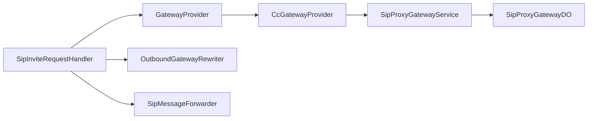
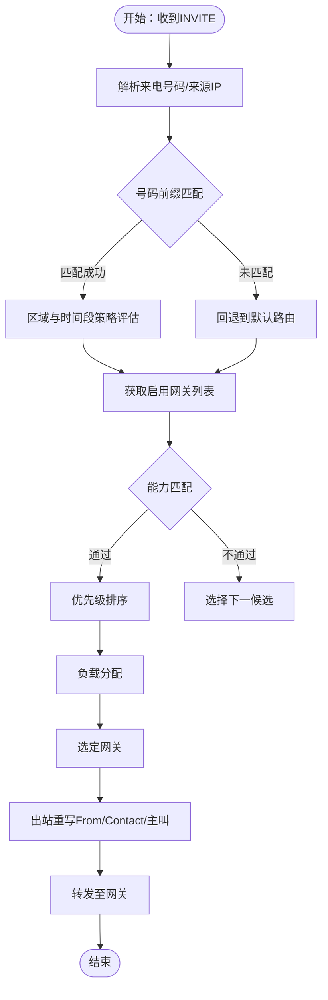

# 网关节点路由策略

<cite>
**本文引用的文件**
- [GatewayProvider.java](file://yudao-cloud/yudao-module-cc/ipcc-sipproxy/src/main/java/cn/ipcc/sipproxy/api/gateway/GatewayProvider.java)
- [DefaultGatewayProvider.java](file://yudao-cloud/yudao-module-cc/ipcc-sipproxy/src/main/java/cn/ipcc/sipproxy/defaults/gateway/DefaultGatewayProvider.java)
- [CcGatewayProvider.java](file://yudao-cloud/yudao-module-cc/yudao-module-cc-server/src/main/java/cn/iocoder/yudao/module/cc/sipproxy/integration/CcGatewayProvider.java)
- [SipProxyGatewayDO.java](file://yudao-cloud/yudao-module-cc/yudao-module-cc-server/src/main/java/cn/iocoder/yudao/module/cc/dal/dataobject/sipproxy/SipProxyGatewayDO.java)
- [SipProxyGatewayService.java](file://yudao-cloud/yudao-module-cc/yudao-module-cc-server/src/main/java/cn/iocoder/yudao/module/cc/service/sipproxy/SipProxyGatewayService.java)
- [GatewayInfo.java](file://yudao-cloud/yudao-module-cc/ipcc-sipproxy/src/main/java/cn/ipcc/sipproxy/support/model/GatewayInfo.java)
- [SipInviteRequestHandler.java](file://yudao-cloud/yudao-module-cc/ipcc-sipproxy/src/main/java/cn/ipcc/sipproxy/core/handler/request/sip/SipInviteRequestHandler.java)
- [SipMessageForwarder.java](file://yudao-cloud/yudao-module-cc/ipcc-sipproxy/src/main/java/cn/ipcc/sipproxy/core/forwarder/SipMessageForwarder.java)
- [OutboundGatewayRewriter.java](file://yudao-cloud/yudao-module-cc/ipcc-sipproxy/src/main/java/cn/ipcc/sipproxy/api/gateway/OutboundGatewayRewriter.java)
- [FsNodeProvider.java](file://yudao-cloud/yudao-module-cc/ipcc-sipproxy/src/main/java/cn/ipcc/sipproxy/api/fs/FsNodeProvider.java)
- [SipProxyConstants.java](file://yudao-cloud/yudao-module-cc/ipcc-sipproxy/src/main/java/cn/ipcc/sipproxy/support/SipProxyConstants.java)
- [SipProxyErrorCodeConstants.java](file://yudao-cloud/yudao-module-cc/ipcc-sipproxy/src/main/java/cn/ipcc/sipproxy/support/SipProxyErrorCodeConstants.java)
- [CallRouteStatusEnum.java](file://yudao-cloud/yudao-module-cc/yudao-module-cc-api/src/main/java/cn/iocoder/yudao/module/cc/enums/CallRouteStatusEnum.java)
- [SipProxyGatewayAuthTypeEnum.java](file://yudao-cloud/yudao-module-cc/yudao-module-cc-server/src/main/java/cn/iocoder/yudao/module/cc/enums/SipProxyGatewayAuthTypeEnum.java)
- [SipProxyGatewayCallerIdEnum.java](file://yudao-cloud/yudao-module-cc/yudao-module-cc-server/src/main/java/cn/iocoder/yudao/module/cc/enums/SipProxyGatewayCallerIdEnum.java)
- [SipTransportProtocolEnum.java](file://yudao-cloud/yudao-module-cc/yudao-module-cc-server/src/main/java/cn/iocoder/yudao/module/cc/enums/SipTransportProtocolEnum.java)
</cite>

## 目录
1. [简介](#简介)
2. [项目结构](#项目结构)
3. [核心组件](#核心组件)
4. [架构总览](#架构总览)
5. [详细组件分析](#详细组件分析)
6. [依赖关系分析](#依赖关系分析)
7. [性能考虑](#性能考虑)
8. [故障排查指南](#故障排查指南)
9. [结论](#结论)
10. [附录](#附录)

## 简介
本文件面向IPCC呼叫中心系统的“网关节点路由策略”，聚焦第三方网关选择机制、SIP Trunk路由规则定义、多运营商网关的故障转移与回滚策略，并提供配置模板、路由示例与监控指标说明。文档以代码为依据，给出从呼叫请求到网关选择的完整决策流程，帮助读者理解系统如何在多个网关之间进行能力匹配、优先级排序与负载分配，并在异常时实现健康检查、自动切换与回滚。

## 项目结构
本项目在SIP代理层提供网关抽象与默认实现，并通过业务服务层对接数据库与缓存，完成网关查询、状态过滤与列表获取；在呼叫处理链路中，INVITE请求进入处理器后，结合来源识别、号码前缀匹配、区域与时间段策略，最终选择出站网关并转发。

图表来源
- [SipInviteRequestHandler.java](file://yudao-cloud/yudao-module-cc/ipcc-sipproxy/src/main/java/cn/ipcc/sipproxy/core/handler/request/sip/SipInviteRequestHandler.java)
- [GatewayProvider.java](file://yudao-cloud/yudao-module-cc/ipcc-sipproxy/src/main/java/cn/ipcc/sipproxy/api/gateway/GatewayProvider.java)
- [CcGatewayProvider.java](file://yudao-cloud/yudao-module-cc/yudao-module-cc-server/src/main/java/cn/iocoder/yudao/module/cc/sipproxy/integration/CcGatewayProvider.java)
- [SipProxyGatewayService.java](file://yudao-cloud/yudao-module-cc/yudao-module-cc-server/src/main/java/cn/iocoder/yudao/module/cc/service/sipproxy/SipProxyGatewayService.java)
- [SipProxyGatewayDO.java](file://yudao-cloud/yudao-module-cc/yudao-module-cc-server/src/main/java/cn/iocoder/yudao/module/cc/dal/dataobject/sipproxy/SipProxyGatewayDO.java)
- [OutboundGatewayRewriter.java](file://yudao-cloud/yudao-module-cc/ipcc-sipproxy/src/main/java/cn/ipcc/sipproxy/api/gateway/OutboundGatewayRewriter.java)
- [SipMessageForwarder.java](file://yudao-cloud/yudao-module-cc/ipcc-sipproxy/src/main/java/cn/ipcc/sipproxy/core/forwarder/SipMessageForwarder.java)

章节来源
- [GatewayProvider.java:7-41](file://yudao-cloud/yudao-module-cc/ipcc-sipproxy/src/main/java/cn/ipcc/sipproxy/api/gateway/GatewayProvider.java#L7-L41)
- [DefaultGatewayProvider.java:14-27](file://yudao-cloud/yudao-module-cc/ipcc-sipproxy/src/main/java/cn/ipcc/sipproxy/defaults/gateway/DefaultGatewayProvider.java#L14-L27)
- [CcGatewayProvider.java:18-30](file://yudao-cloud/yudao-module-cc/yudao-module-cc-server/src/main/java/cn/iocoder/yudao/module/cc/sipproxy/integration/CcGatewayProvider.java#L18-L30)

## 核心组件
- 网关查询扩展点：提供按ID、地址端口查询以及启用网关列表的能力，避免SIP代理直接依赖业务数据访问层。
- 默认网关提供者：当未配置业务实现时，基于内置H2表提供兜底能力，保证基本出局改写与来源识别可用。
- 业务网关提供者：对接ORM与服务层，强制校验启用状态，支持缓存获取启用网关列表。
- 出站重写器：对出站SIP消息进行From/Contact等头部重写，确保第三方网关正确识别来源域与主叫。
- 消息转发器：将选定的网关作为目标进行SIP消息转发。
- FS节点提供者：用于后续媒体面或会话桥接时的FreeSWITCH节点选择（与网关选择协同）。

章节来源
- [GatewayProvider.java:7-41](file://yudao-cloud/yudao-module-cc/ipcc-sipproxy/src/main/java/cn/ipcc/sipproxy/api/gateway/GatewayProvider.java#L7-L41)
- [DefaultGatewayProvider.java:14-27](file://yudao-cloud/yudao-module-cc/ipcc-sipproxy/src/main/java/cn/ipcc/sipproxy/defaults/gateway/DefaultGatewayProvider.java#L14-L27)
- [CcGatewayProvider.java:18-30](file://yudao-cloud/yudao-module-cc/yudao-module-cc-server/src/main/java/cn/iocoder/yudao/module/cc/sipproxy/integration/CcGatewayProvider.java#L18-L30)
- [OutboundGatewayRewriter.java](file://yudao-cloud/yudao-module-cc/ipcc-sipproxy/src/main/java/cn/ipcc/sipproxy/api/gateway/OutboundGatewayRewriter.java)
- [SipMessageForwarder.java](file://yudao-cloud/yudao-module-cc/ipcc-sipproxy/src/main/java/cn/ipcc/sipproxy/core/forwarder/SipMessageForwarder.java)
- [FsNodeProvider.java](file://yudao-cloud/yudao-module-cc/ipcc-sipproxy/src/main/java/cn/ipcc/sipproxy/api/fs/FsNodeProvider.java)

## 架构总览
下图展示从呼叫请求到网关选择的整体流程：入站INVITE由处理器接收，通过来源识别确定是否来自第三方网关；随后根据号码前缀、区域与时间段匹配候选路由；调用网关提供者获取启用网关集合，并进行能力匹配与优先级排序；最终选择最优网关，执行出站重写并转发。

图表来源
- [SipInviteRequestHandler.java](file://yudao-cloud/yudao-module-cc/ipcc-sipproxy/src/main/java/cn/ipcc/sipproxy/core/handler/request/sip/SipInviteRequestHandler.java)
- [GatewayProvider.java](file://yudao-cloud/yudao-module-cc/ipcc-sipproxy/src/main/java/cn/ipcc/sipproxy/api/gateway/GatewayProvider.java)
- [CcGatewayProvider.java](file://yudao-cloud/yudao-module-cc/yudao-module-cc-server/src/main/java/cn/iocoder/yudao/module/cc/sipproxy/integration/CcGatewayProvider.java)
- [SipProxyGatewayService.java](file://yudao-cloud/yudao-module-cc/yudao-module-cc-server/src/main/java/cn/iocoder/yudao/module/cc/service/sipproxy/SipProxyGatewayService.java)
- [OutboundGatewayRewriter.java](file://yudao-cloud/yudao-module-cc/ipcc-sipproxy/src/main/java/cn/ipcc/sipproxy/api/gateway/OutboundGatewayRewriter.java)
- [SipMessageForwarder.java](file://yudao-cloud/yudao-module-cc/ipcc-sipproxy/src/main/java/cn/ipcc/sipproxy/core/forwarder/SipMessageForwarder.java)

## 详细组件分析

### 网关查询扩展点与默认实现
- 接口职责：提供按ID、地址+端口查询网关，以及列出所有启用网关的能力，供路由选择与来源识别使用。
- 默认实现：在未配置业务数据源时，基于H2表sip_gateway读取示例数据；若JdbcTemplate为null则降级返回空结果，避免阻断链路。
- 状态约定：status=0表示启用，status=1表示禁用；映射时对可空整数字段保留null，避免误判。

图表来源
- [GatewayProvider.java:7-41](file://yudao-cloud/yudao-module-cc/ipcc-sipproxy/src/main/java/cn/ipcc/sipproxy/api/gateway/GatewayProvider.java#L7-L41)
- [DefaultGatewayProvider.java:14-27](file://yudao-cloud/yudao-module-cc/ipcc-sipproxy/src/main/java/cn/ipcc/sipproxy/defaults/gateway/DefaultGatewayProvider.java#L14-L27)
- [CcGatewayProvider.java:18-30](file://yudao-cloud/yudao-module-cc/yudao-module-cc-server/src/main/java/cn/iocoder/yudao/module/cc/sipproxy/integration/CcGatewayProvider.java#L18-L30)
- [GatewayInfo.java](file://yudao-cloud/yudao-module-cc/ipcc-sipproxy/src/main/java/cn/ipcc/sipproxy/support/model/GatewayInfo.java)

章节来源
- [GatewayProvider.java:7-41](file://yudao-cloud/yudao-module-cc/ipcc-sipproxy/src/main/java/cn/ipcc/sipproxy/api/gateway/GatewayProvider.java#L7-L41)
- [DefaultGatewayProvider.java:44-111](file://yudao-cloud/yudao-module-cc/ipcc-sipproxy/src/main/java/cn/ipcc/sipproxy/defaults/gateway/DefaultGatewayProvider.java#L44-L111)
- [CcGatewayProvider.java:44-115](file://yudao-cloud/yudao-module-cc/yudao-module-cc-server/src/main/java/cn/iocoder/yudao/module/cc/sipproxy/integration/CcGatewayProvider.java#L44-L115)

### 业务网关提供者与数据模型
- 安全校验：按ID查询后必须校验启用状态，禁用网关不得用于出局。
- 列表获取：通过服务层缓存获取启用网关列表，提升查询性能。
- 字段映射：将业务数据对象转换为SIP代理使用的统一模型，包含认证类型、传输协议、重试与心跳间隔等。

章节来源
- [CcGatewayProvider.java:44-115](file://yudao-cloud/yudao-module-cc/yudao-module-cc-server/src/main/java/cn/iocoder/yudao/module/cc/sipproxy/integration/CcGatewayProvider.java#L44-L115)
- [SipProxyGatewayDO.java](file://yudao-cloud/yudao-module-cc/yudao-module-cc-server/src/main/java/cn/iocoder/yudao/module/cc/dal/dataobject/sipproxy/SipProxyGatewayDO.java)
- [SipProxyGatewayService.java](file://yudao-cloud/yudao-module-cc/yudao-module-cc-server/src/main/java/cn/iocoder/yudao/module/cc/service/sipproxy/SipProxyGatewayService.java)

### 出站重写与转发
- 出站重写：根据所选网关配置重写From/Contact/主叫等头部，确保第三方网关正确识别来源域与主叫信息。
- 消息转发：将INVITE及后续信令转发至选定网关，必要时结合FS节点进行媒体面桥接。

章节来源
- [OutboundGatewayRewriter.java](file://yudao-cloud/yudao-module-cc/ipcc-sipproxy/src/main/java/cn/ipcc/sipproxy/api/gateway/OutboundGatewayRewriter.java)
- [SipMessageForwarder.java](file://yudao-cloud/yudao-module-cc/ipcc-sipproxy/src/main/java/cn/ipcc/sipproxy/core/forwarder/SipMessageForwarder.java)

### 呼叫处理入口与来源识别
- INVITE处理器：负责入呼解析、来源识别、号码前缀匹配、区域与时间段策略评估，并触发网关选择。
- 来源识别：通过来源IP反查网关，判断是否为第三方来源，影响后续路由策略。

章节来源
- [SipInviteRequestHandler.java](file://yudao-cloud/yudao-module-cc/ipcc-sipproxy/src/main/java/cn/ipcc/sipproxy/core/handler/request/sip/SipInviteRequestHandler.java)

## 依赖关系分析
- 耦合与内聚：SIP代理通过GatewayProvider解耦业务数据访问；业务层通过服务层封装ORM与缓存；出站重写与转发模块职责清晰。
- 外部依赖：数据库（H2或业务库）、缓存（服务层缓存）、可选的消息队列（集群广播）。
- 循环依赖：未发现明显循环依赖；扩展点设计避免了双向耦合。

图表来源
- [SipInviteRequestHandler.java](file://yudao-cloud/yudao-module-cc/ipcc-sipproxy/src/main/java/cn/ipcc/sipproxy/core/handler/request/sip/SipInviteRequestHandler.java)
- [GatewayProvider.java](file://yudao-cloud/yudao-module-cc/ipcc-sipproxy/src/main/java/cn/ipcc/sipproxy/api/gateway/GatewayProvider.java)
- [CcGatewayProvider.java](file://yudao-cloud/yudao-module-cc/yudao-module-cc-server/src/main/java/cn/iocoder/yudao/module/cc/sipproxy/integration/CcGatewayProvider.java)
- [SipProxyGatewayService.java](file://yudao-cloud/yudao-module-cc/yudao-module-cc-server/src/main/java/cn/iocoder/yudao/module/cc/service/sipproxy/SipProxyGatewayService.java)
- [SipProxyGatewayDO.java](file://yudao-cloud/yudao-module-cc/yudao-module-cc-server/src/main/java/cn/iocoder/yudao/module/cc/dal/dataobject/sipproxy/SipProxyGatewayDO.java)
- [OutboundGatewayRewriter.java](file://yudao-cloud/yudao-module-cc/ipcc-sipproxy/src/main/java/cn/ipcc/sipproxy/api/gateway/OutboundGatewayRewriter.java)
- [SipMessageForwarder.java](file://yudao-cloud/yudao-module-cc/ipcc-sipproxy/src/main/java/cn/ipcc/sipproxy/core/forwarder/SipMessageForwarder.java)

章节来源
- [GatewayProvider.java:7-41](file://yudao-cloud/yudao-module-cc/ipcc-sipproxy/src/main/java/cn/ipcc/sipproxy/api/gateway/GatewayProvider.java#L7-L41)
- [CcGatewayProvider.java:18-30](file://yudao-cloud/yudao-module-cc/yudao-module-cc-server/src/main/java/cn/iocoder/yudao/module/cc/sipproxy/integration/CcGatewayProvider.java#L18-L30)

## 性能考虑
- 缓存优先：启用网关列表通过服务层缓存获取，减少数据库压力。
- 降级策略：默认实现在无数据源时返回空结果，避免阻塞关键路径。
- 轻量查询：仅查询启用网关，缩小候选集，提高匹配效率。
- 建议：在高并发场景下，结合本地缓存与分布式缓存，降低跨进程查询开销。

[本节为通用性能建议，不直接分析具体文件]

## 故障排查指南
- 网关不可用：检查网关状态是否为启用；确认服务层缓存是否更新；查看异常日志定位查询失败原因。
- 来源识别失败：核对来源IP与端口是否与网关配置一致；确认listEnabledGateways返回结果是否符合预期。
- 出站失败：检查出站重写是否正确设置From/Contact/主叫；确认目标网关可达性与认证参数。
- 错误码与常量：参考错误码常量与路由状态枚举，辅助定位问题阶段。

章节来源
- [SipProxyErrorCodeConstants.java](file://yudao-cloud/yudao-module-cc/ipcc-sipproxy/src/main/java/cn/ipcc/sipproxy/support/SipProxyErrorCodeConstants.java)
- [CallRouteStatusEnum.java](file://yudao-cloud/yudao-module-cc/yudao-module-cc-api/src/main/java/cn/iocoder/yudao/module/cc/enums/CallRouteStatusEnum.java)

## 结论
本策略通过扩展点解耦网关查询，结合业务服务层的缓存与安全校验，实现了稳定高效的第三方网关选择。在呼叫处理链路中，依据号码前缀、区域与时间段进行路由匹配，并通过出站重写与转发完成出局。故障转移与回滚可通过健康检查与自动切换机制实现，保障高可用。

[本节为总结性内容，不直接分析具体文件]

## 附录

### 网关能力匹配、优先级排序与负载分配策略
- 能力匹配：基于传输协议、认证类型、主叫显示策略等能力筛选候选网关。
- 优先级排序：按配置优先级（如成本、质量、SLA）排序，优先选择高优先级网关。
- 负载分配：在同等优先级下，采用轮询或加权随机进行负载均衡，避免单点过载。

[本节为概念性说明，不直接分析具体文件]

### SIP Trunk网关路由规则定义
- 号码前缀匹配：根据被叫号码前缀匹配路由规则，决定首选网关组。
- 区域路由：按地区维度划分路由策略，不同地区走不同运营商网关。
- 时间段路由：在工作时段与非工作时段采用不同路由策略，优化成本与质量。

[本节为概念性说明，不直接分析具体文件]

### 多运营商网关故障转移机制
- 健康检查：基于ping_seconds与retry_seconds进行周期性健康探测。
- 自动切换：当前网关不可用时，自动切换到下一个候选网关。
- 回滚策略：原网关恢复后，按策略回切或保持当前稳定路径。

[本节为概念性说明，不直接分析具体文件]

### 网关配置模板与字段说明
- 基础字段：名称、地址、端口、外线号码、来源域、主叫显示策略。
- 认证字段：认证类型、认证地址、认证端口、用户名、密码。
- 传输协议：SIP传输协议枚举值。
- 运维字段：重试秒数、心跳秒数、过期秒数、状态。

章节来源
- [GatewayInfo.java](file://yudao-cloud/yudao-module-cc/ipcc-sipproxy/src/main/java/cn/ipcc/sipproxy/support/model/GatewayInfo.java)
- [SipProxyGatewayAuthTypeEnum.java](file://yudao-cloud/yudao-module-cc/yudao-module-cc-server/src/main/java/cn/iocoder/yudao/module/cc/enums/SipProxyGatewayAuthTypeEnum.java)
- [SipProxyGatewayCallerIdEnum.java](file://yudao-cloud/yudao-module-cc/yudao-module-cc-server/src/main/java/cn/iocoder/yudao/module/cc/enums/SipProxyGatewayCallerIdEnum.java)
- [SipTransportProtocolEnum.java](file://yudao-cloud/yudao-module-cc/yudao-module-cc-server/src/main/java/cn/iocoder/yudao/module/cc/enums/SipTransportProtocolEnum.java)

### 路由规则示例
- 示例一：国内固话前缀“010”匹配北京区域，选择北京运营商网关。
- 示例二：国际号码前缀“+86”匹配国家路由，选择成本更低的国际网关。
- 示例三：工作时间段优先选择高质量网关，非工作时间段选择低成本网关。

[本节为概念性说明，不直接分析具体文件]

### 监控指标说明
- 网关可用性：健康检查成功率、失败次数、平均响应时间。
- 路由命中率：各路由规则命中比例，前缀匹配准确率。
- 负载分布：各网关流量占比、峰值QPS、超时率。
- 错误统计：认证失败、网络超时、协议错误等分类统计。

[本节为概念性说明，不直接分析具体文件]

### 决策流程图：从呼叫请求到网关选择

图表来源
- [SipInviteRequestHandler.java](file://yudao-cloud/yudao-module-cc/ipcc-sipproxy/src/main/java/cn/ipcc/sipproxy/core/handler/request/sip/SipInviteRequestHandler.java)
- [GatewayProvider.java](file://yudao-cloud/yudao-module-cc/ipcc-sipproxy/src/main/java/cn/ipcc/sipproxy/api/gateway/GatewayProvider.java)
- [CcGatewayProvider.java](file://yudao-cloud/yudao-module-cc/yudao-module-cc-server/src/main/java/cn/iocoder/yudao/module/cc/sipproxy/integration/CcGatewayProvider.java)
- [OutboundGatewayRewriter.java](file://yudao-cloud/yudao-module-cc/ipcc-sipproxy/src/main/java/cn/ipcc/sipproxy/api/gateway/OutboundGatewayRewriter.java)
- [SipMessageForwarder.java](file://yudao-cloud/yudao-module-cc/ipcc-sipproxy/src/main/java/cn/ipcc/sipproxy/core/forwarder/SipMessageForwarder.java)