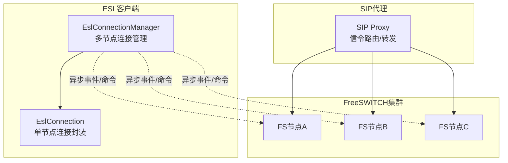
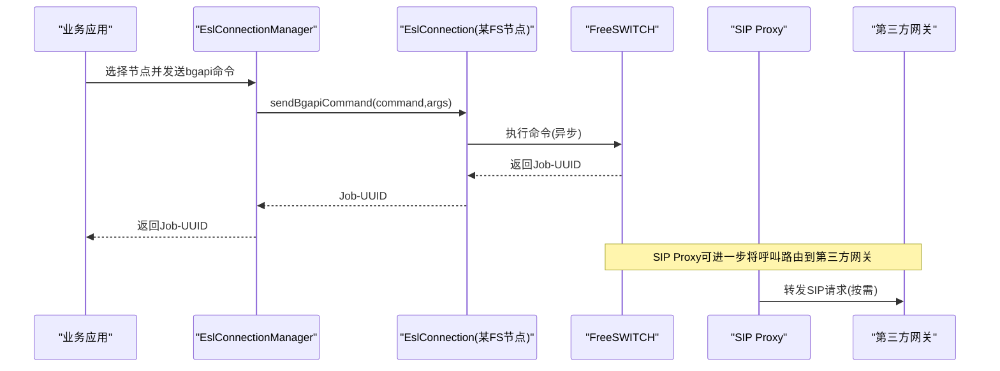
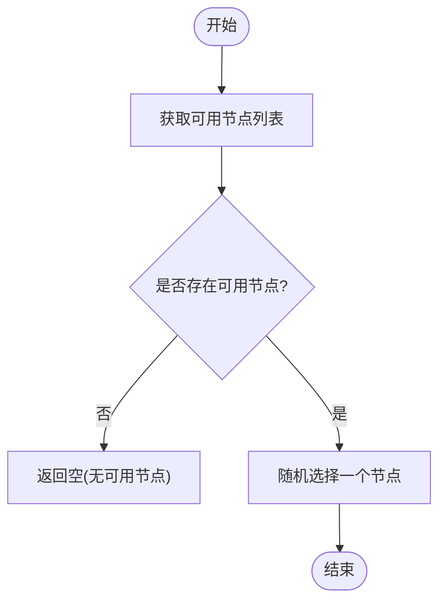
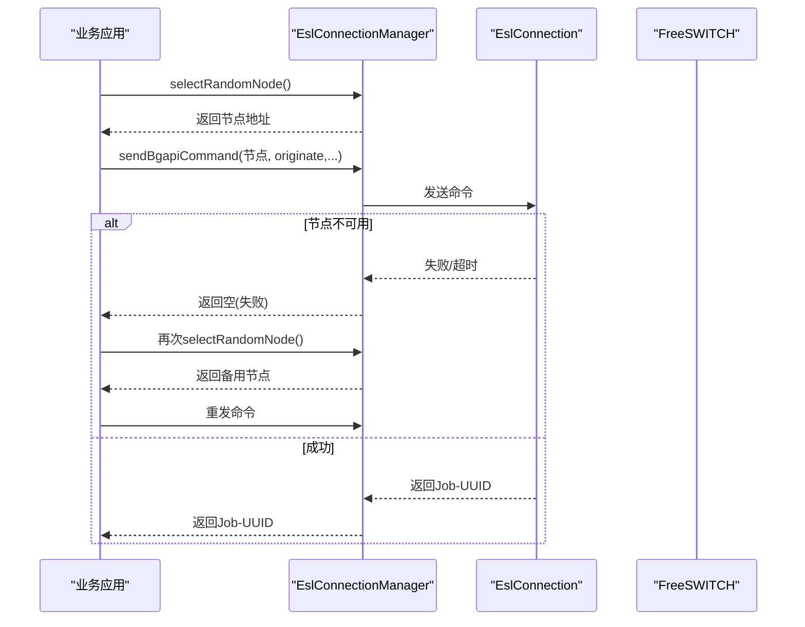
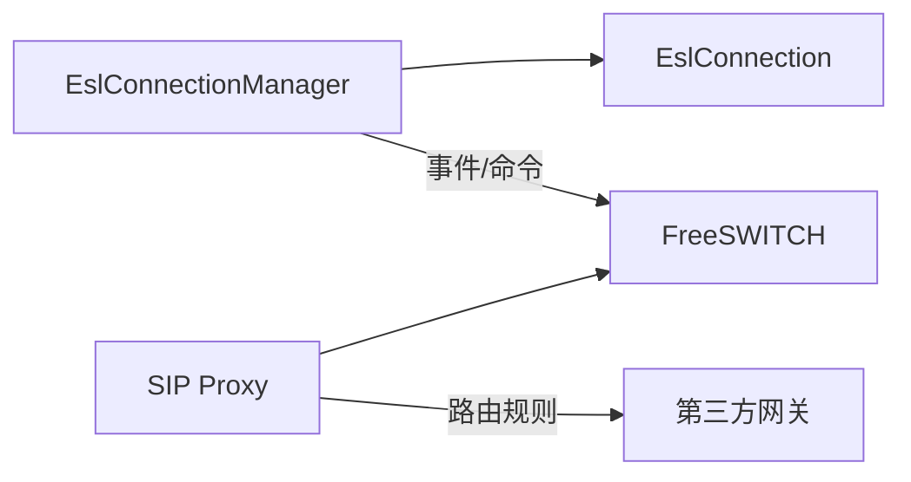

# 节点路由策略

<cite>
**本文引用的文件**
- [EslConnectionManager.java](file://yudao-cloud/yudao-module-cc/ipcc-fs-esl/src/main/java/cn/ipcc/fs/esl/EslConnectionManager.java)
- [fs-esl-client组件架构设计.md](file://yudao-cloud/yudao-module-cc/ipcc-fs-esl/fs-esl-client组件架构设计.md)
- [sipproxy组件架构设计.md](file://yudao-cloud/yudao-module-cc/ipcc-sipproxy/sipproxy组件架构设计.md)
- [freeswitch部署脚本1.py](file://yudao-cloud/yudao-module-cc/doc/freeswitch服务/freeswitch部署脚本1.py)
- [freeswitch部署脚本2-用于集群部署-修改了主要端口.py](file://yudao-cloud/yudao-module-cc/doc/freeswitch服务/freeswitch部署脚本2-用于集群部署-修改了主要端口.py)
- [freeswitch模拟第三方网关-运营商的fs部署脚本.py](file://yudao-cloud/yudao-module-cc/doc/freeswitch服务/freeswitch模拟第三方网关-运营商的fs部署脚本.py)
- [CallRouteStatusEnum.java](file://yudao-cloud/yudao-module-cc/yudao-module-cc-api/src/main/java/cn/iocoder/yudao/module/cc/enums/CallRouteStatusEnum.java)
</cite>

## 目录
1. [简介](#简介)
2. [项目结构](#项目结构)
3. [核心组件](#核心组件)
4. [架构总览](#架构总览)
5. [详细组件分析](#详细组件分析)
6. [依赖关系分析](#依赖关系分析)
7. [性能考量](#性能考量)
8. [故障排查指南](#故障排查指南)
9. [结论](#结论)
10. [附录](#附录)

## 简介
本文件面向IPCC呼叫中心系统的FreeSWITCH节点路由策略，聚焦于多FS节点下的连接管理、节点选择与负载均衡、第三方网关节点匹配、健康检查与故障恢复等能力。文档基于仓库中FreeSWITCH ESL客户端与SIP代理相关实现进行梳理，并结合部署脚本说明多实例部署场景下的路由与高可用策略。

## 项目结构
呼叫中心模块包含以下关键子模块：
- ipcc-fs-esl：FreeSWITCH ESL客户端库，提供多节点连接管理、事件路由、命令发送等能力。
- ipcc-sipproxy：SIP代理组件，负责SIP信令路由与转发，可与FS/SBC协同工作。
- yudao-module-cc-server/api：业务侧API与枚举定义，如呼叫路由状态等。
- doc/freeswitch服务：FS部署与集群化脚本，便于本地或生产环境快速搭建多节点FS。

图表来源
- [EslConnectionManager.java:19-139](file://yudao-cloud/yudao-module-cc/ipcc-fs-esl/src/main/java/cn/ipcc/fs/esl/EslConnectionManager.java#L19-L139)
- [sipproxy组件架构设计.md](file://yudao-cloud/yudao-module-cc/ipcc-sipproxy/sipproxy组件架构设计.md)

章节来源
- [EslConnectionManager.java:19-139](file://yudao-cloud/yudao-module-cc/ipcc-fs-esl/src/main/java/cn/ipcc/fs/esl/EslConnectionManager.java#L19-L139)
- [fs-esl-client组件架构设计.md](file://yudao-cloud/yudao-module-cc/ipcc-fs-esl/fs-esl-client组件架构设计.md)
- [sipproxy组件架构设计.md](file://yudao-cloud/yudao-module-cc/ipcc-sipproxy/sipproxy组件架构设计.md)

## 核心组件
- EslConnectionManager：多FS节点的连接管理器，负责注册/移除节点、同步节点列表、随机选择可用节点、批量bgapi命令下发、事件监听器聚合、优雅关闭等。
- EslConnection：对单个FS节点的ESL连接封装，支持命令发送、消息发送、连接生命周期回调。
- SIP Proxy：SIP信令路由与转发，结合FS节点完成媒体与信令路径构建。
- 部署脚本：提供FS单机与集群部署能力，便于验证路由与负载均衡效果。

章节来源
- [EslConnectionManager.java:19-254](file://yudao-cloud/yudao-module-cc/ipcc-fs-esl/src/main/java/cn/ipcc/fs/esl/EslConnectionManager.java#L19-L254)
- [fs-esl-client组件架构设计.md](file://yudao-cloud/yudao-module-cc/ipcc-fs-esl/fs-esl-client组件架构设计.md)
- [sipproxy组件架构设计.md](file://yudao-cloud/yudao-module-cc/ipcc-sipproxy/sipproxy组件架构设计.md)

## 架构总览
系统通过ESL客户端统一管理多个FreeSWITCH节点，业务侧发起呼叫时，由连接管理器根据策略选择目标FS节点；SIP Proxy负责SIP信令路由与媒体协商，必要时将呼叫引导至第三方网关（运营商）节点。

图表来源
- [EslConnectionManager.java:141-195](file://yudao-cloud/yudao-module-cc/ipcc-fs-esl/src/main/java/cn/ipcc/fs/esl/EslConnectionManager.java#L141-L195)
- [sipproxy组件架构设计.md](file://yudao-cloud/yudao-module-cc/ipcc-sipproxy/sipproxy组件架构设计.md)

## 详细组件分析

### FreeSWITCH节点选择算法
当前实现采用“可用节点集合 + 随机选择”的策略：
- 可用节点判定：仅当连接的canSend()为true时视为可用。
- 选择策略：从可用节点列表中随机选取一个节点作为目标。
- 无可用节点：返回null，调用方需做降级处理（如重试其他节点或上报失败）。

该策略具备简单、低开销、易扩展的特点，适合在节点能力相近且无强亲和性要求的场景。若后续需要按地域、负载、会话数等维度选择，可在获取可用节点列表后替换选择逻辑。

图表来源
- [EslConnectionManager.java:121-139](file://yudao-cloud/yudao-module-cc/ipcc-fs-esl/src/main/java/cn/ipcc/fs/esl/EslConnectionManager.java#L121-L139)

章节来源
- [EslConnectionManager.java:121-139](file://yudao-cloud/yudao-module-cc/ipcc-fs-esl/src/main/java/cn/ipcc/fs/esl/EslConnectionManager.java#L121-L139)

### ViaPort匹配与第三方网关节点选择
- 在SIP场景中，Via头部的端口信息可用于标识不同接入面或区域。结合SIP Proxy的路由规则，可将特定端口范围的流量导向对应FS节点或第三方网关。
- 对于第三方网关（运营商），可通过SIP Proxy的域/端口/用户前缀等条件匹配，将呼叫定向到指定网关节点。
- 若需要在ESL层做更细粒度的路由（例如按端口或域名），可在选择节点前对NodeConfig或连接元数据进行过滤，再执行随机或加权选择。

注意：具体匹配规则以SIP Proxy配置为准；ESL层主要负责节点管理与命令下发。

章节来源
- [sipproxy组件架构设计.md](file://yudao-cloud/yudao-module-cc/ipcc-sipproxy/sipproxy组件架构设计.md)

### 备用节点切换与自动恢复
- 备用节点切换：当主选节点不可用（连接断开或无法发送）时，调用方可重新触发selectRandomNode()获取新的可用节点，实现无缝切换。
- 自动恢复：EslConnectionManager支持动态syncNodes重载节点列表，新增/移除节点无需重启服务；连接断开后可通过事件监听器感知并在需要时重建连接。
- 批量操作：sendBgapiToAll可向所有节点广播命令，适用于全量对账或统一控制场景。

图表来源
- [EslConnectionManager.java:132-195](file://yudao-cloud/yudao-module-cc/ipcc-fs-esl/src/main/java/cn/ipcc/fs/esl/EslConnectionManager.java#L132-L195)

章节来源
- [EslConnectionManager.java:132-195](file://yudao-cloud/yudao-module-cc/ipcc-fs-esl/src/main/java/cn/ipcc/fs/esl/EslConnectionManager.java#L132-L195)

### 多实例部署下的负载均衡策略
- 当前默认策略：随机选择，适合各节点能力均衡的场景。
- 可扩展策略：在获取可用节点列表后，可按权重、会话数、延迟等指标进行加权轮询或最少连接优先。
- 与SIP Proxy配合：通过不同端口/域名的路由规则，将不同租户或区域的流量分流到不同FS集群，实现横向扩展。

章节来源
- [EslConnectionManager.java:121-139](file://yudao-cloud/yudao-module-cc/ipcc-fs-esl/src/main/java/cn/ipcc/fs/esl/EslConnectionManager.java#L121-L139)
- [sipproxy组件架构设计.md](file://yudao-cloud/yudao-module-cc/ipcc-sipproxy/sipproxy组件架构设计.md)

### 健康检查与故障检测
- 连接级健康：canSend()用于判断节点是否可发送命令；不可用时将被排除在选择范围。
- 事件驱动：通过事件监听器接收FS事件，可感知连接建立/断开、会话状态变化等。
- 批量对账：syncNodes可对节点列表进行增量更新，避免无效节点长期驻留。

章节来源
- [EslConnectionManager.java:121-139](file://yudao-cloud/yudao-module-cc/ipcc-fs-esl/src/main/java/cn/ipcc/fs/esl/EslConnectionManager.java#L121-L139)
- [EslConnectionManager.java:207-217](file://yudao-cloud/yudao-module-cc/ipcc-fs-esl/src/main/java/cn/ipcc/fs/esl/EslConnectionManager.java#L207-L217)

### 节点配置示例与路由规则
- 节点配置：通过NodeConfig定义address/host/port/password，并使用syncNodes进行动态加载。
- 路由规则：在SIP Proxy中基于端口、域名、用户前缀等条件设置路由规则，将呼叫导向对应FS节点或第三方网关。
- 部署脚本：使用提供的FS部署脚本快速拉起单机或多节点FS，便于测试路由与负载均衡。

章节来源
- [EslConnectionManager.java:234-252](file://yudao-cloud/yudao-module-cc/ipcc-fs-esl/src/main/java/cn/ipcc/fs/esl/EslConnectionManager.java#L234-L252)
- [freeswitch部署脚本1.py](file://yudao-cloud/yudao-module-cc/doc/freeswitch服务/freeswitch部署脚本1.py)
- [freeswitch部署脚本2-用于集群部署-修改了主要端口.py](file://yudao-cloud/yudao-module-cc/doc/freeswitch服务/freeswitch部署脚本2-用于集群部署-修改了主要端口.py)
- [freeswitch模拟第三方网关-运营商的fs部署脚本.py](file://yudao-cloud/yudao-module-cc/doc/freeswitch服务/freeswitch模拟第三方网关-运营商的fs部署脚本.py)

### 性能优化建议
- 使用bgapi发送长时间运行的命令，避免阻塞调用线程。
- 合理设置命令超时与重试次数，降低偶发网络抖动影响。
- 在节点数量较多时，优先筛选可用节点后再进行选择，减少无效尝试。
- 结合SIP Proxy的分流策略，将不同租户/区域流量隔离，提升整体吞吐。

章节来源
- [EslConnectionManager.java:177-195](file://yudao-cloud/yudao-module-cc/ipcc-fs-esl/src/main/java/cn/ipcc/fs/esl/EslConnectionManager.java#L177-L195)

## 依赖关系分析
- EslConnectionManager依赖EslConnection进行单节点通信，并通过事件监听器聚合FS事件。
- 与SIP Proxy协作完成SIP信令路由与媒体路径建立。
- 通过部署脚本快速构建FS集群，支撑多实例路由与负载均衡验证。

图表来源
- [EslConnectionManager.java:19-254](file://yudao-cloud/yudao-module-cc/ipcc-fs-esl/src/main/java/cn/ipcc/fs/esl/EslConnectionManager.java#L19-L254)
- [sipproxy组件架构设计.md](file://yudao-cloud/yudao-module-cc/ipcc-sipproxy/sipproxy组件架构设计.md)

章节来源
- [EslConnectionManager.java:19-254](file://yudao-cloud/yudao-module-cc/ipcc-fs-esl/src/main/java/cn/ipcc/fs/esl/EslConnectionManager.java#L19-L254)
- [sipproxy组件架构设计.md](file://yudao-cloud/yudao-module-cc/ipcc-sipproxy/sipproxy组件架构设计.md)

## 性能考量
- 随机选择策略时间复杂度O(1)，空间复杂度取决于可用节点数量。
- bgapi异步执行避免阻塞，提高并发能力。
- 批量命令下发适用于对账与控制场景，但需注意网络与FS处理能力。
- 建议在大规模节点环境下引入更精细的选择策略（如加权轮询、最少连接优先）以提升整体效率。

[本节为通用性能讨论，不直接分析具体文件]

## 故障排查指南
- 节点不可用：检查canSend()结果与连接状态，确认网络连通性与ESL端口可达。
- 命令失败：查看返回的Job-UUID与FS日志，确认命令参数与FS权限。
- 事件缺失：确认已添加事件监听器，并检查FS事件订阅是否正确。
- 节点列表不一致：使用syncNodes进行对账式重载，确保节点列表与实际一致。

章节来源
- [EslConnectionManager.java:121-139](file://yudao-cloud/yudao-module-cc/ipcc-fs-esl/src/main/java/cn/ipcc/fs/esl/EslConnectionManager.java#L121-L139)
- [EslConnectionManager.java:141-195](file://yudao-cloud/yudao-module-cc/ipcc-fs-esl/src/main/java/cn/ipcc/fs/esl/EslConnectionManager.java#L141-L195)
- [EslConnectionManager.java:207-217](file://yudao-cloud/yudao-module-cc/ipcc-fs-esl/src/main/java/cn/ipcc/fs/esl/EslConnectionManager.java#L207-L217)

## 结论
本系统通过EslConnectionManager实现了FreeSWITCH多节点连接管理与随机选择策略，结合SIP Proxy完成SIP信令路由与第三方网关对接。通过事件监听与动态节点同步，系统具备良好的可扩展性与高可用性。未来可根据实际负载与拓扑引入更精细的节点选择与负载均衡策略，进一步提升系统性能与稳定性。

[本节为总结性内容，不直接分析具体文件]

## 附录
- 呼叫路由状态枚举：用于标识呼叫在不同阶段的路由状态，便于监控与排障。

章节来源
- [CallRouteStatusEnum.java](file://yudao-cloud/yudao-module-cc/yudao-module-cc-api/src/main/java/cn/iocoder/yudao/module/cc/enums/CallRouteStatusEnum.java)