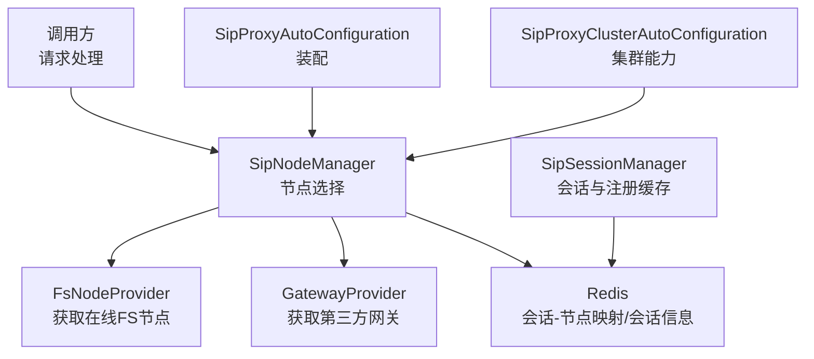
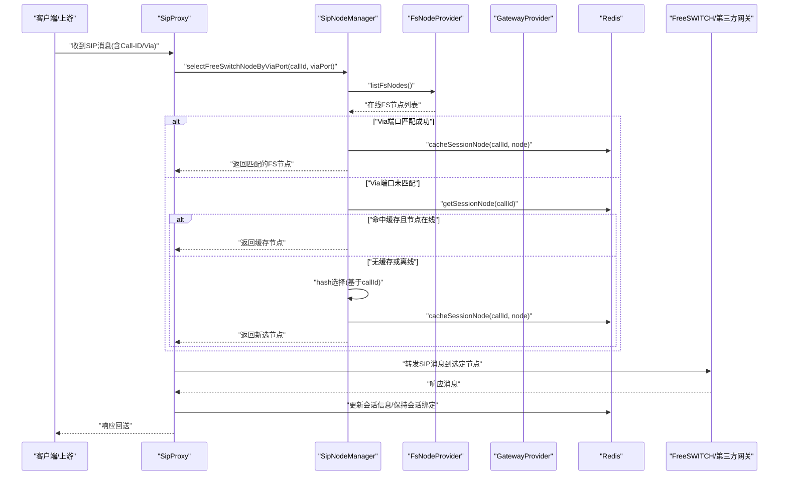
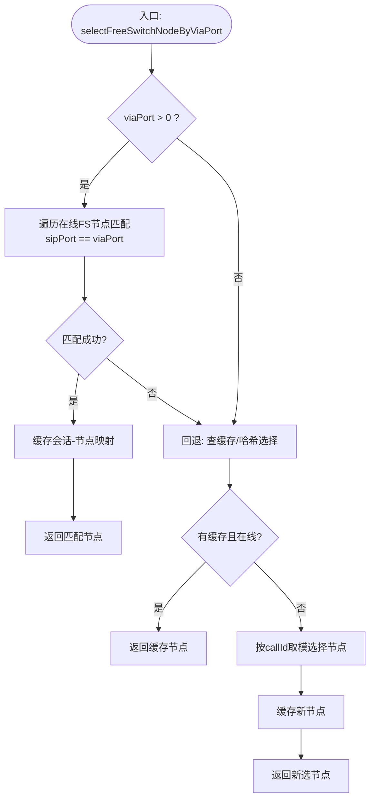
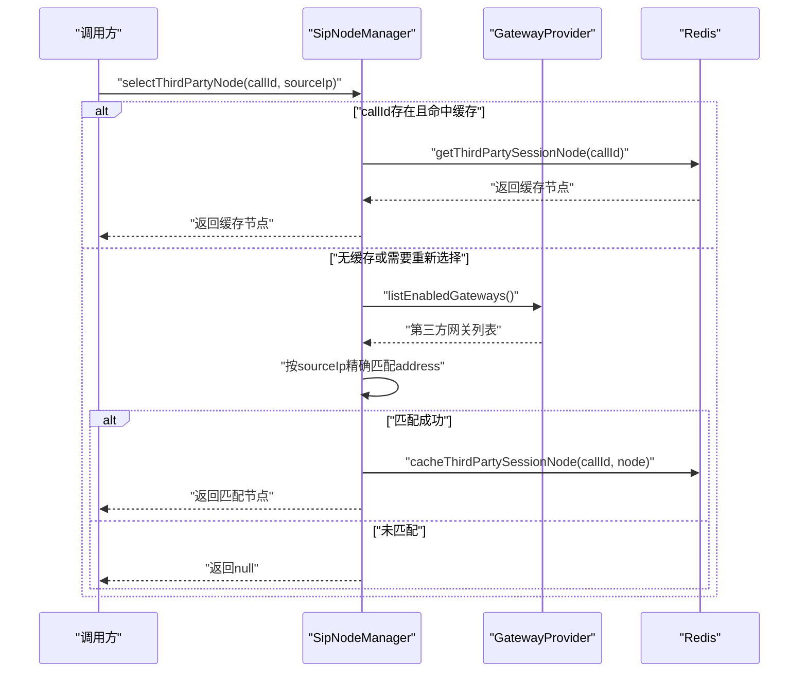
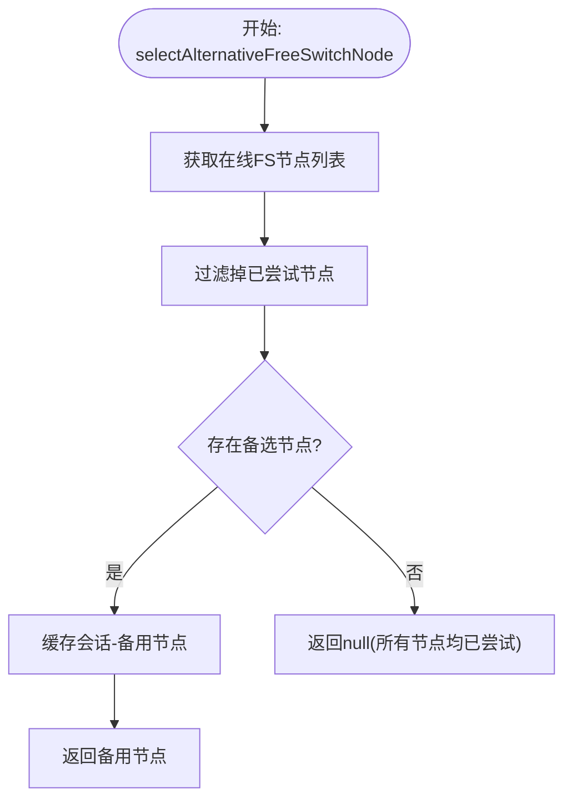
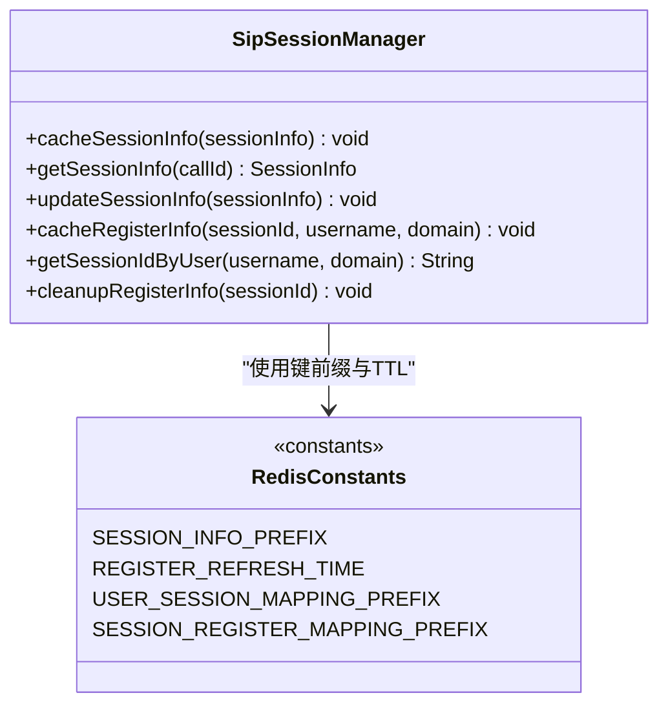
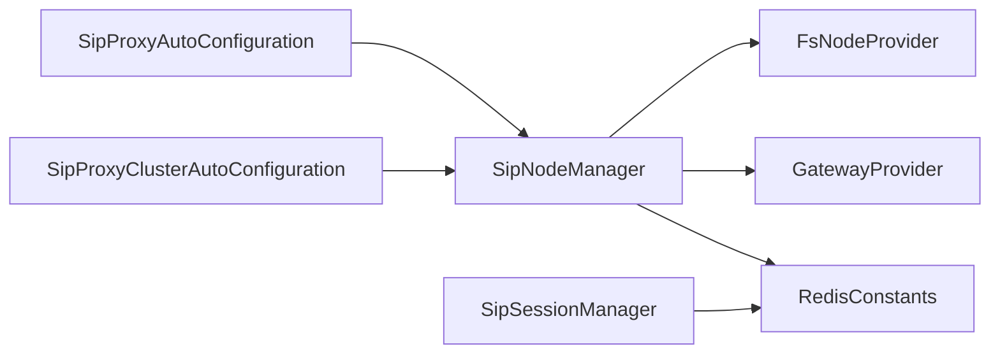

# 节点选择算法

<cite>
**本文引用的文件**
- [SipNodeManager.java](file://yudao-cloud/yudao-module-cc/ipcc-sipproxy/src/main/java/cn/ipcc/sipproxy/core/node/SipNodeManager.java)
- [SipSessionManager.java](file://yudao-cloud/yudao-module-cc/ipcc-sipproxy/src/main/java/cn/ipcc/sipproxy/core/session/SipSessionManager.java)
- [FsNodeInfo.java](file://yudao-cloud/yudao-module-cc/ipcc-sipproxy/src/main/java/cn/ipcc/sipproxy/support/model/FsNodeInfo.java)
- [GatewayInfo.java](file://yudao-cloud/yudao-module-cc/ipcc-sipproxy/src/main/java/cn/ipcc/sipproxy/support/model/GatewayInfo.java)
- [RedisConstants.java](file://yudao-cloud/yudao-module-cc/ipcc-sipproxy/src/main/java/cn/ipcc/sipproxy/support/RedisConstants.java)
- [SipProxyProperties.java](file://yudao-cloud/yudao-module-cc/ipcc-sipproxy/src/main/java/cn/ipcc/sipproxy/autoconfigure/SipProxyProperties.java)
- [SipProxyAutoConfiguration.java](file://yudao-cloud/yudao-module-cc/ipcc-sipproxy/src/main/java/cn/ipcc/sipproxy/autoconfigure/SipProxyAutoConfiguration.java)
- [SipProxyClusterAutoConfiguration.java](file://yudao-cloud/yudao-module-cc/ipcc-sipproxy/src/main/java/cn/ipcc/sipproxy/autoconfigure/SipProxyClusterAutoConfiguration.java)
- [FsNodeProvider.java](file://yudao-cloud/yudao-module-cc/ipcc-sipproxy/src/main/java/cn/ipcc/sipproxy/api/fs/FsNodeProvider.java)
- [GatewayProvider.java](file://yudao-cloud/yudao-module-cc/ipcc-sipproxy/src/main/java/cn/ipcc/sipproxy/api/gateway/GatewayProvider.java)
</cite>

## 目录
1. [简介](#简介)
2. [项目结构](#项目结构)
3. [核心组件](#核心组件)
4. [架构总览](#架构总览)
5. [详细组件分析](#详细组件分析)
6. [依赖关系分析](#依赖关系分析)
7. [性能考量](#性能考量)
8. [故障排查指南](#故障排查指南)
9. [结论](#结论)
10. [附录：配置与使用示例](#附录配置与使用示例)

## 简介
本文件面向IPCC呼叫中心系统的节点选择算法，聚焦以下目标：
- 一致性哈希与哈希环构建、节点映射机制、虚拟节点的作用说明（概念性指导）
- ViaPort匹配策略的工作流程：端口绑定、会话保持、连接复用
- 负载均衡算法的选择逻辑：轮询、加权轮询、最少连接数等策略的适用场景
- 结合仓库中实际实现，给出可落地的配置与使用路径、性能对比分析与最佳实践建议

## 项目结构
本仓库中与“节点选择”直接相关的代码集中在 sipproxy 模块的 core 层，关键类包括：
- SipNodeManager：负责FreeSWITCH节点与第三方网关节点的选择、缓存与会话绑定
- SipSessionManager：统一维护SIP会话信息与注册信息在Redis中的缓存
- FsNodeProvider / GatewayProvider：扩展点，提供在线FS节点列表与第三方网关列表
- RedisConstants：定义Redis键前缀与过期时间常量
- 自动装配类：SipProxyAutoConfiguration、SipProxyClusterAutoConfiguration、SipProxyProperties：用于组件装配与配置项管理

图表来源
- [SipNodeManager.java:156-228](file://yudao-cloud/yudao-module-cc/ipcc-sipproxy/src/main/java/cn/ipcc/sipproxy/core/node/SipNodeManager.java#L156-L228)
- [SipSessionManager.java:35-72](file://yudao-cloud/yudao-module-cc/ipcc-sipproxy/src/main/java/cn/ipcc/sipproxy/core/session/SipSessionManager.java#L35-L72)
- [SipProxyAutoConfiguration.java](file://yudao-cloud/yudao-module-cc/ipcc-sipproxy/src/main/java/cn/ipcc/sipproxy/autoconfigure/SipProxyAutoConfiguration.java)
- [SipProxyClusterAutoConfiguration.java](file://yudao-cloud/yudao-module-cc/ipcc-sipproxy/src/main/java/cn/ipcc/sipproxy/autoconfigure/SipProxyClusterAutoConfiguration.java)

章节来源
- [SipNodeManager.java:156-228](file://yudao-cloud/yudao-module-cc/ipcc-sipproxy/src/main/java/cn/ipcc/sipproxy/core/node/SipNodeManager.java#L156-L228)
- [SipSessionManager.java:35-72](file://yudao-cloud/yudao-module-cc/ipcc-sipproxy/src/main/java/cn/ipcc/sipproxy/core/session/SipSessionManager.java#L35-L72)
- [SipProxyAutoConfiguration.java](file://yudao-cloud/yudao-module-cc/ipcc-sipproxy/src/main/java/cn/ipcc/sipproxy/autoconfigure/SipProxyAutoConfiguration.java)
- [SipProxyClusterAutoConfiguration.java](file://yudao-cloud/yudao-module-cc/ipcc-sipproxy/src/main/java/cn/ipcc/sipproxy/autoconfigure/SipProxyClusterAutoConfiguration.java)

## 核心组件
- SipNodeManager
  - 职责：根据Call-ID或Via端口选择FreeSWITCH节点；按来源IP选择第三方网关节点；维护会话到节点的映射缓存（Redis）；支持备用节点选择。
  - 关键点：
    - 通过FsNodeProvider获取在线FS节点列表
    - 通过GatewayProvider获取第三方网关列表
    - 使用Redis缓存会话-节点映射与会话信息
    - 支持Via端口精确匹配与fallback到哈希选择
- SipSessionManager
  - 职责：统一缓存SIP会话信息、注册信息（WebSocket用户与sessionId双向映射），并提供查询与清理方法
  - 关键点：
    - 使用Redis存储会话信息，TTL由RedisConstants控制
    - 注册信息用于后续INVITE转发到WebSocket时查找会话

章节来源
- [SipNodeManager.java:156-228](file://yudao-cloud/yudao-module-cc/ipcc-sipproxy/src/main/java/cn/ipcc/sipproxy/core/node/SipNodeManager.java#L156-L228)
- [SipNodeManager.java:260-296](file://yudao-cloud/yudao-module-cc/ipcc-sipproxy/src/main/java/cn/ipcc/sipproxy/core/node/SipNodeManager.java#L260-L296)
- [SipSessionManager.java:35-72](file://yudao-cloud/yudao-module-cc/ipcc-sipproxy/src/main/java/cn/ipcc/sipproxy/core/session/SipSessionManager.java#L35-L72)
- [SipSessionManager.java:91-112](file://yudao-cloud/yudao-module-cc/ipcc-sipproxy/src/main/java/cn/ipcc/sipproxy/core/session/SipSessionManager.java#L91-L112)

## 架构总览
下图展示了从请求进入、节点选择、会话绑定到响应回送的完整流程，以及Redis在其中的作用。

图表来源
- [SipNodeManager.java:156-228](file://yudao-cloud/yudao-module-cc/ipcc-sipproxy/src/main/java/cn/ipcc/sipproxy/core/node/SipNodeManager.java#L156-L228)
- [SipSessionManager.java:35-72](file://yudao-cloud/yudao-module-cc/ipcc-sipproxy/src/main/java/cn/ipcc/sipproxy/core/session/SipSessionManager.java#L35-L72)

## 详细组件分析

### 一致性哈希与哈希环（概念性说明）
- 哈希环构建
  - 将节点ID或节点地址进行哈希，映射到固定范围的环形空间
  - 每个节点占据环上的一个或多个位置
- 节点映射机制
  - 对请求Key（如Call-ID）计算哈希值，沿环顺时针找到第一个节点作为目标
  - 保证相同Key始终路由到同一节点，提升会话亲和性
- 虚拟节点的作用
  - 为物理节点在环上放置多个虚拟副本，改善负载分布与扩容时的数据迁移成本
  - 减少因节点数量少导致的热点与倾斜问题
- 在本仓库中的对应实现
  - 当前SipNodeManager采用“基于Call-ID的取模哈希”而非严格的一致性哈希环
  - 优点：实现简单、性能高；缺点：节点增减时重路由比例较高
  - 若需引入一致性哈希环与虚拟节点，可在SipNodeManager中扩展新的选择器并保留ViaPort优先匹配

章节来源
- [SipNodeManager.java:156-182](file://yudao-cloud/yudao-module-cc/ipcc-sipproxy/src/main/java/cn/ipcc/sipproxy/core/node/SipNodeManager.java#L156-L182)

### ViaPort匹配策略（端口绑定、会话保持、连接复用）
- 端口绑定
  - 多FS实例共用公网IP但监听不同SIP端口时，通过解析SIP Via头中的端口，精确匹配发起originate的FS实例
  - 避免响应被错误地发送到其他FS实例导致b-leg收不到answer
- 会话保持
  - 首次选择后，将Call-ID到节点的映射写入Redis，后续同会话请求优先命中缓存
  - 若缓存节点离线，则剔除缓存并重新选择
- 连接复用
  - 同一会话内多次请求均路由到同一节点，有利于长连接与媒体流稳定
- 失败回退
  - Via端口未匹配时，先尝试已缓存节点，再fallback到哈希选择

图表来源
- [SipNodeManager.java:201-228](file://yudao-cloud/yudao-module-cc/ipcc-sipproxy/src/main/java/cn/ipcc/sipproxy/core/node/SipNodeManager.java#L201-L228)

章节来源
- [SipNodeManager.java:201-228](file://yudao-cloud/yudao-module-cc/ipcc-sipproxy/src/main/java/cn/ipcc/sipproxy/core/node/SipNodeManager.java#L201-L228)

### 第三方网关节点选择（按来源IP精确匹配）
- 选择逻辑
  - 优先返回已缓存的会话第三方节点（同一会话保持一致）
  - 遍历所有第三方节点，按sourceIp与节点address精确匹配
  - 全部不匹配时返回null，不做fallback以避免错误路由
- 适用场景
  - 多个运营商中继接入，需区分来源IP确保响应正确回送

图表来源
- [SipNodeManager.java:260-296](file://yudao-cloud/yudao-module-cc/ipcc-sipproxy/src/main/java/cn/ipcc/sipproxy/core/node/SipNodeManager.java#L260-L296)

章节来源
- [SipNodeManager.java:260-296](file://yudao-cloud/yudao-module-cc/ipcc-sipproxy/src/main/java/cn/ipcc/sipproxy/core/node/SipNodeManager.java#L260-L296)

### 备用节点选择（故障转移）
- 当主选节点不可用时，可选择未被尝试过的在线节点作为备用
- 适用于呼叫建立失败后的快速重试，提高成功率

图表来源
- [SipNodeManager.java:298-332](file://yudao-cloud/yudao-module-cc/ipcc-sipproxy/src/main/java/cn/ipcc/sipproxy/core/node/SipNodeManager.java#L298-L332)

章节来源
- [SipNodeManager.java:298-332](file://yudao-cloud/yudao-module-cc/ipcc-sipproxy/src/main/java/cn/ipcc/sipproxy/core/node/SipNodeManager.java#L298-L332)

### 会话信息管理（Redis缓存）
- 会话信息缓存
  - 使用统一前缀SESSION_INFO_PREFIX存储会话详情，便于查询与更新
- 注册信息缓存
  - 双向映射：sessionId→username:domain 与 username:domain→sessionId
  - TTL使用REGISTER_REFRESH_TIME，大于JsSIP默认Expires，避免连接存活但缓存过期导致转发失败

图表来源
- [SipSessionManager.java:35-72](file://yudao-cloud/yudao-module-cc/ipcc-sipproxy/src/main/java/cn/ipcc/sipproxy/core/session/SipSessionManager.java#L35-L72)
- [SipSessionManager.java:91-112](file://yudao-cloud/yudao-module-cc/ipcc-sipproxy/src/main/java/cn/ipcc/sipproxy/core/session/SipSessionManager.java#L91-L112)
- [RedisConstants.java](file://yudao-cloud/yudao-module-cc/ipcc-sipproxy/src/main/java/cn/ipcc/sipproxy/support/RedisConstants.java)

章节来源
- [SipSessionManager.java:35-72](file://yudao-cloud/yudao-module-cc/ipcc-sipproxy/src/main/java/cn/ipcc/sipproxy/core/session/SipSessionManager.java#L35-L72)
- [SipSessionManager.java:91-112](file://yudao-cloud/yudao-module-cc/ipcc-sipproxy/src/main/java/cn/ipcc/sipproxy/core/session/SipSessionManager.java#L91-L112)

## 依赖关系分析
- 组件耦合
  - SipNodeManager依赖FsNodeProvider与GatewayProvider以获取节点列表，降低对ORM的直接依赖
  - 通过Redis进行跨实例会话状态共享，增强集群能力
- 外部依赖
  - Redis：会话-节点映射、会话信息、注册信息
  - Spring自动装配：SipProxyAutoConfiguration、SipProxyClusterAutoConfiguration、SipProxyProperties

图表来源
- [SipNodeManager.java:156-228](file://yudao-cloud/yudao-module-cc/ipcc-sipproxy/src/main/java/cn/ipcc/sipproxy/core/node/SipNodeManager.java#L156-L228)
- [SipSessionManager.java:35-72](file://yudao-cloud/yudao-module-cc/ipcc-sipproxy/core/session/SipSessionManager.java#L35-L72)
- [SipProxyAutoConfiguration.java](file://yudao-cloud/yudao-module-cc/ipcc-sipproxy/src/main/java/cn/ipcc/sipproxy/autoconfigure/SipProxyAutoConfiguration.java)
- [SipProxyClusterAutoConfiguration.java](file://yudao-cloud/yudao-module-cc/ipcc-sipproxy/src/main/java/cn/ipcc/sipproxy/autoconfigure/SipProxyClusterAutoConfiguration.java)

章节来源
- [SipNodeManager.java:156-228](file://yudao-cloud/yudao-module-cc/ipcc-sipproxy/src/main/java/cn/ipcc/sipproxy/core/node/SipNodeManager.java#L156-L228)
- [SipSessionManager.java:35-72](file://yudao-cloud/yudao-module-cc/ipcc-sipproxy/core/session/SipSessionManager.java#L35-L72)
- [SipProxyAutoConfiguration.java](file://yudao-cloud/yudao-module-cc/ipcc-sipproxy/src/main/java/cn/ipcc/sipproxy/autoconfigure/SipProxyAutoConfiguration.java)
- [SipProxyClusterAutoConfiguration.java](file://yudao-cloud/yudao-module-cc/ipcc-sipproxy/src/main/java/cn/ipcc/sipproxy/autoconfigure/SipProxyClusterAutoConfiguration.java)

## 性能考量
- 哈希选择复杂度
  - 基于Call-ID取模选择：O(1)时间复杂度，适合高并发场景
- Redis读写开销
  - 会话-节点映射与注册信息频繁读写，建议使用合理的TTL与批量操作以降低延迟
- Via端口匹配
  - 线性扫描在线节点列表，节点规模较小时性能良好；大规模时可考虑索引优化
- 备用节点选择
  - 过滤已尝试节点的时间复杂度与已尝试集合大小相关，建议限制重试次数

[本节为通用性能讨论，不直接分析具体文件]

## 故障排查指南
- 常见问题
  - 没有可用FS节点：检查FsNodeProvider是否返回空列表
  - Via端口未匹配：确认SIP Via头端口与FS监听端口一致
  - 第三方网关未匹配：核对sourceIp与GatewayInfo.address是否一致
  - 缓存异常：检查Redis连通性与序列化/反序列化日志
- 定位步骤
  - 查看SipNodeManager与SipSessionManager的日志输出
  - 检查Redis中对应键是否存在与TTL设置
  - 验证FsNodeProvider与GatewayProvider的实现是否正确

章节来源
- [SipNodeManager.java:156-228](file://yudao-cloud/yudao-module-cc/ipcc-sipproxy/src/main/java/cn/ipcc/sipproxy/core/node/SipNodeManager.java#L156-L228)
- [SipNodeManager.java:260-296](file://yudao-cloud/yudao-module-cc/ipcc-sipproxy/src/main/java/cn/ipcc/sipproxy/core/node/SipNodeManager.java#L260-L296)
- [SipSessionManager.java:35-72](file://yudao-cloud/yudao-module-cc/ipcc-sipproxy/core/session/SipSessionManager.java#L35-L72)

## 结论
- 本仓库实现了以Call-ID为基础的哈希选择与Via端口精确匹配的混合策略，兼顾了会话亲和性与多FS实例部署下的响应正确性
- 通过Redis缓存会话-节点映射与会话信息，实现了跨实例的会话保持与连接复用
- 对于第三方网关接入，采用来源IP精确匹配，避免错误路由
- 若需进一步提升负载均匀性与扩容平滑性，可在SipNodeManager中引入一致性哈希环与虚拟节点，同时保留Via端口优先匹配

[本节为总结性内容，不直接分析具体文件]

## 附录：配置与使用示例
- 配置项
  - 通过SipProxyProperties定义相关配置（如TTL、超时等）
  - 通过SipProxyAutoConfiguration与SipProxyClusterAutoConfiguration完成组件装配
- 使用路径
  - FreeSWITCH节点选择：调用selectFreeSwitchNodeByViaPort(callId, viaPort)
  - 第三方网关节点选择：调用selectThirdPartyNode(callId, sourceIp)
  - 会话信息管理：使用SipSessionManager的cache/update/get方法
- 性能对比与最佳实践
  - 哈希选择 vs 一致性哈希：前者实现简单、后者更均衡；可根据节点规模与变更频率选择
  - Via端口优先：在多FS实例场景下必须启用，确保响应正确回送
  - 合理TTL：避免缓存过期导致会话漂移，同时防止内存占用过高

章节来源
- [SipProxyProperties.java](file://yudao-cloud/yudao-module-cc/ipcc-sipproxy/src/main/java/cn/ipcc/sipproxy/autoconfigure/SipProxyProperties.java)
- [SipProxyAutoConfiguration.java](file://yudao-cloud/yudao-module-cc/ipcc-sipproxy/src/main/java/cn/ipcc/sipproxy/autoconfigure/SipProxyAutoConfiguration.java)
- [SipProxyClusterAutoConfiguration.java](file://yudao-cloud/yudao-module-cc/ipcc-sipproxy/src/main/java/cn/ipcc/sipproxy/autoconfigure/SipProxyClusterAutoConfiguration.java)
- [SipNodeManager.java:156-228](file://yudao-cloud/yudao-module-cc/ipcc-sipproxy/src/main/java/cn/ipcc/sipproxy/core/node/SipNodeManager.java#L156-L228)
- [SipSessionManager.java:35-72](file://yudao-cloud/yudao-module-cc/ipcc-sipproxy/core/session/SipSessionManager.java#L35-L72)