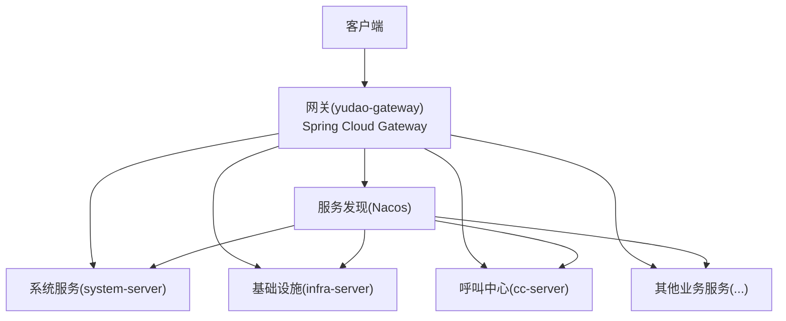
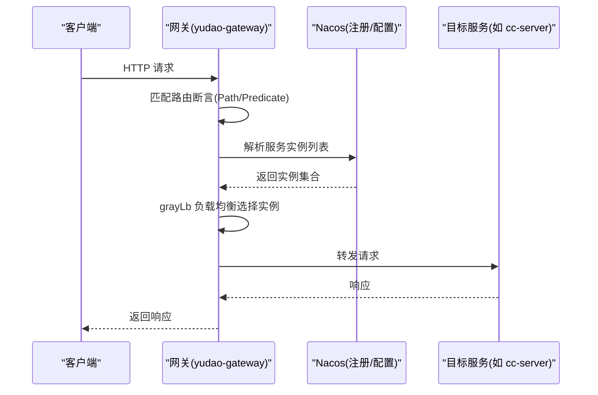
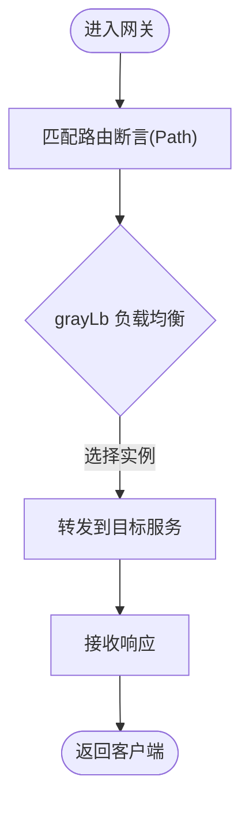
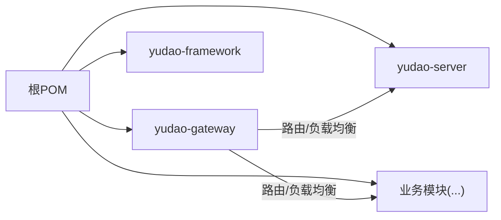

# 负载均衡配置

<cite>
**本文引用的文件**
- [yudao-gateway/src/main/resources/application.yaml](file://yudao-cloud/yudao-gateway/src/main/resources/application.yaml)
- [yudao-gateway/src/main/resources/application-dev.yaml](file://yudao-cloud/yudao-gateway/src/main/resources/application-dev.yaml)
- [yudao-server/src/main/resources/application.yaml](file://yudao-cloud/yudao-server/src/main/resources/application.yaml)
- [pom.xml](file://yudao-cloud/pom.xml)
</cite>

## 目录
1. [简介](#简介)
2. [项目结构](#项目结构)
3. [核心组件](#核心组件)
4. [架构总览](#架构总览)
5. [详细组件分析](#详细组件分析)
6. [依赖关系分析](#依赖关系分析)
7. [性能考虑](#性能考虑)
8. [故障排查指南](#故障排查指南)
9. [结论](#结论)
10. [附录](#附录)

## 简介
本文件面向IPCC呼叫中心系统的网关与微服务侧的负载均衡配置，聚焦于Spring Cloud Gateway的路由与灰度/负载均衡策略（grayLb）在路由中的使用方式，并结合Nacos注册发现能力，给出节点权重、最大连接数、超时时间等关键参数的配置要点。文档同时提供单机、集群与混合云部署场景下的推荐配置模板、动态更新机制说明（热重载与配置验证）、以及性能调优建议。

## 项目结构
本项目采用多模块Maven工程，网关模块为yudao-gateway，业务服务以yudao-server及多个业务模块组成。网关通过Spring Cloud Gateway进行请求路由，并在路由中统一使用自定义负载均衡前缀grayLb指向各服务名；服务端通过application.yaml管理自身运行参数，开发环境通过application-dev.yaml接入Nacos作为注册与配置中心。

图表来源
- [yudao-gateway/src/main/resources/application.yaml:28-239](file://yudao-cloud/yudao-gateway/src/main/resources/application.yaml#L28-L239)
- [yudao-gateway/src/main/resources/application-dev.yaml:3-14](file://yudao-cloud/yudao-gateway/src/main/resources/application-dev.yaml#L3-L14)

章节来源
- [yudao-gateway/src/main/resources/application.yaml:1-313](file://yudao-cloud/yudao-gateway/src/main/resources/application.yaml#L1-L313)
- [yudao-gateway/src/main/resources/application-dev.yaml:1-35](file://yudao-cloud/yudao-gateway/src/main/resources/application-dev.yaml#L1-L35)
- [yudao-server/src/main/resources/application.yaml:1-394](file://yudao-cloud/yudao-server/src/main/resources/application.yaml#L1-L394)
- [pom.xml:1-163](file://yudao-cloud/pom.xml#L1-L163)

## 核心组件
- 网关路由与负载均衡：在网关配置中，所有路由的URI统一使用“grayLb://服务名”的形式，表示通过自定义负载均衡策略将请求分发到对应服务的实例集合。
- 服务发现与配置中心：开发环境通过Nacos进行服务注册与配置拉取，支持命名空间与分组隔离。
- 应用服务器：业务服务基于Spring Boot运行，可通过application.yaml调整运行时参数（如编码、缓存、消息队列等）。

章节来源
- [yudao-gateway/src/main/resources/application.yaml:28-239](file://yudao-cloud/yudao-gateway/src/main/resources/application.yaml#L28-L239)
- [yudao-gateway/src/main/resources/application-dev.yaml:3-14](file://yudao-cloud/yudao-gateway/src/main/resources/application-dev.yaml#L3-L14)
- [yudao-server/src/main/resources/application.yaml:13-39](file://yudao-cloud/yudao-server/src/main/resources/application.yaml#L13-L39)

## 架构总览
下图展示了从客户端到网关再到后端服务的请求路径，以及负载均衡策略在网关层的作用点。

图表来源
- [yudao-gateway/src/main/resources/application.yaml:28-239](file://yudao-cloud/yudao-gateway/src/main/resources/application.yaml#L28-L239)
- [yudao-gateway/src/main/resources/application-dev.yaml:3-14](file://yudao-cloud/yudao-gateway/src/main/resources/application-dev.yaml#L3-L14)

## 详细组件分析

### 网关路由与负载均衡(grayLb)
- 路由定义：每个服务在网关中通过id标识，使用Path断言匹配URL前缀，并通过filters进行路径重写（如API文档路径）。
- 负载均衡策略：所有路由的URI统一采用“grayLb://服务名”，表明请求将通过自定义负载均衡策略（grayLb）选择具体实例。该策略通常用于实现一致性哈希、轮询、加权轮询等算法，并可与Nacos实例元数据配合实现按权重或灰度分流。
- WebSocket支持：对WebSocket路由（如cc/ws/**）同样适用grayLb，确保长连接在多实例间正确分配。

图表来源
- [yudao-gateway/src/main/resources/application.yaml:28-239](file://yudao-cloud/yudao-gateway/src/main/resources/application.yaml#L28-L239)

章节来源
- [yudao-gateway/src/main/resources/application.yaml:28-239](file://yudao-cloud/yudao-gateway/src/main/resources/application.yaml#L28-L239)

### 服务发现与配置中心(Nacos)
- 注册发现：开发环境启用Nacos discovery，指定server-addr、namespace与group，用于获取服务实例列表。
- 配置中心：通过config导入远程配置，支持按profile加载不同环境的配置。
- 监控与管理：暴露Actuator端点，便于健康检查与运维观测。

章节来源
- [yudao-gateway/src/main/resources/application-dev.yaml:3-14](file://yudao-cloud/yudao-gateway/src/main/resources/application-dev.yaml#L3-L14)
- [yudao-gateway/src/main/resources/application-dev.yaml:18-35](file://yudao-cloud/yudao-gateway/src/main/resources/application-dev.yaml#L18-L35)

### 应用服务器参数
- 编码设置：全局UTF-8编码，避免流式响应乱码。
- 缓存与消息：Redis缓存TTL、Kafka/RocketMQ消费者/生产者相关参数可按需调整。
- 安全与接口文档：Knife4j/Swagger开关与路径可配置。

章节来源
- [yudao-server/src/main/resources/application.yaml:13-39](file://yudao-cloud/yudao-server/src/main/resources/application.yaml#L13-L39)
- [yudao-server/src/main/resources/application.yaml:144-169](file://yudao-cloud/yudao-server/src/main/resources/application.yaml#L144-L169)

## 依赖关系分析
- Maven聚合工程：根POM定义了模块列表与版本管理，包含gateway、framework、server及各业务模块。
- 网关与服务解耦：通过服务名+负载均衡策略进行调用，降低耦合度，便于水平扩展与灰度发布。

图表来源
- [pom.xml:10-33](file://yudao-cloud/pom.xml#L10-L33)

章节来源
- [pom.xml:1-163](file://yudao-cloud/pom.xml#L1-L163)

## 性能考虑
- 网关缓冲与超时：根据实际负载调整HTTP编解码器缓冲区大小，避免大请求体导致内存压力。
- 连接池与并发：合理设置WebFlux线程模型与连接池参数，结合灰度策略控制热点流量。
- 缓存与降级：在服务端启用合适的缓存策略，必要时对非核心链路实施限流与降级。
- 监控与度量：开启Actuator端点，结合日志与指标采集，定位瓶颈。

[本节为通用指导，不直接分析具体文件]

## 故障排查指南
- 路由未命中：检查Path断言是否与实际访问路径一致，确认filters是否正确重写文档路径。
- 服务不可用：确认Nacos服务已注册且健康，检查命名空间与分组配置是否正确。
- 负载均衡异常：若grayLb策略未生效，检查服务实例元数据（如权重标签）是否与策略匹配。
- 超时与错误：查看网关与服务日志，结合Actuator与健康检查定位问题。

章节来源
- [yudao-gateway/src/main/resources/application.yaml:28-239](file://yudao-cloud/yudao-gateway/src/main/resources/application.yaml#L28-L239)
- [yudao-gateway/src/main/resources/application-dev.yaml:18-35](file://yudao-cloud/yudao-gateway/src/main/resources/application-dev.yaml#L18-L35)

## 结论
本项目的网关通过统一的grayLb负载均衡策略对各服务进行流量分发，结合Nacos的服务发现能力，可实现灵活的多实例调度与灰度发布。建议在生产环境中完善grayLb策略实现（一致性哈希、轮询、加权轮询），并通过Nacos元数据管理节点权重与灰度标签；同时结合监控与压测持续优化网关与服务的性能与稳定性。

[本节为总结性内容，不直接分析具体文件]

## 附录

### 负载均衡策略与参数配置要点
- 一致性哈希：适用于会话保持与状态化场景，建议基于用户ID或会话ID计算哈希，减少抖动。
- 轮询：适合无状态服务，保证各实例均匀分担。
- 加权轮询：通过实例元数据（如weight）控制流量比例，支持灰度与容量差异化。
- 节点权重：在Nacos中为实例添加权重标签，grayLb策略读取权重进行分配。
- 最大连接数限制：在网关与服务端分别设置连接池上限，防止过载。
- 超时时间设置：为网关到服务的调用设置合理的读/写超时，避免雪崩。

[本节为通用指导，不直接分析具体文件]

### 动态负载均衡与热重载
- 配置热重载：通过Nacos配置中心推送新配置，网关与服务监听配置变更并热更新，无需重启。
- 配置验证：在推送前进行语法校验与规则检查，确保灰度与权重配置的正确性。
- 回滚机制：保留历史版本配置，出现问题时快速回滚。

[本节为通用指导，不直接分析具体文件]

### 部署场景与推荐配置模板
- 单机部署：单实例运行，关闭复杂灰度逻辑，重点优化本地资源与缓存。
- 集群部署：多实例+灰度策略，结合Nacos权重与标签实现平滑扩容与灰度发布。
- 混合云部署：跨地域或多云环境，注意网络延迟与一致性哈希的稳定性，必要时引入区域感知路由。

[本节为通用指导，不直接分析具体文件]

### 配置示例与参考路径
- 网关路由与负载均衡：参见网关application.yaml中的routes与grayLb用法。
- Nacos注册与配置：参见application-dev.yaml中的nacos配置段。
- 服务端运行参数：参见yudao-server的application.yaml。

章节来源
- [yudao-gateway/src/main/resources/application.yaml:28-239](file://yudao-cloud/yudao-gateway/src/main/resources/application.yaml#L28-L239)
- [yudao-gateway/src/main/resources/application-dev.yaml:3-14](file://yudao-cloud/yudao-gateway/src/main/resources/application-dev.yaml#L3-L14)
- [yudao-server/src/main/resources/application.yaml:13-39](file://yudao-cloud/yudao-server/src/main/resources/application.yaml#L13-L39)

### 性能测试报告与调优指南
- 压测方法：使用标准压测工具模拟峰值流量，观察网关CPU、内存、连接数与RT分布。
- 指标采集：通过Actuator与日志收集关键指标，识别瓶颈点。
- 调优建议：根据压测结果调整连接池、线程模型、超时与缓存策略，逐步迭代至稳定态。

[本节为通用指导，不直接分析具体文件]