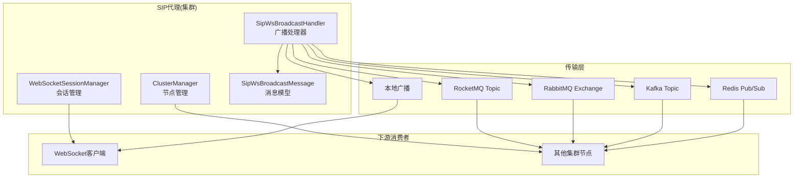
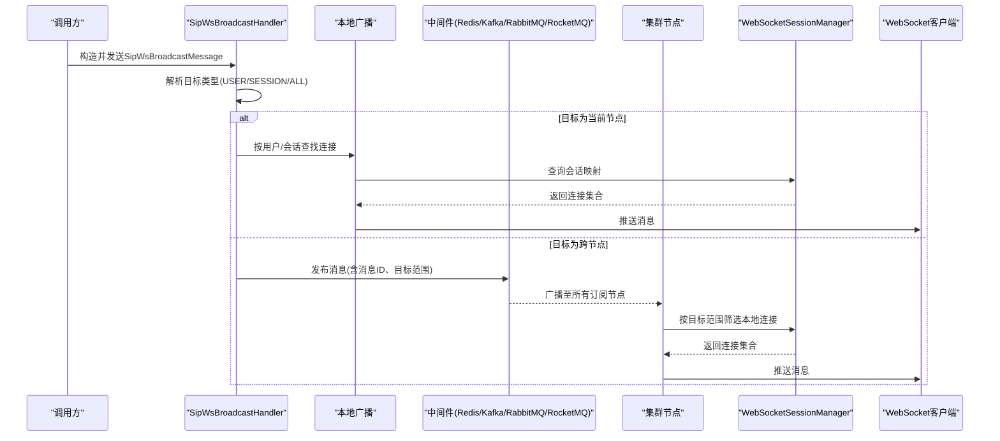
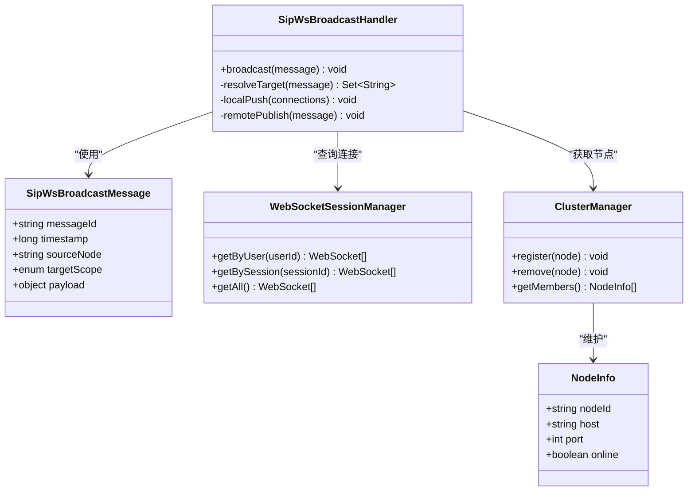
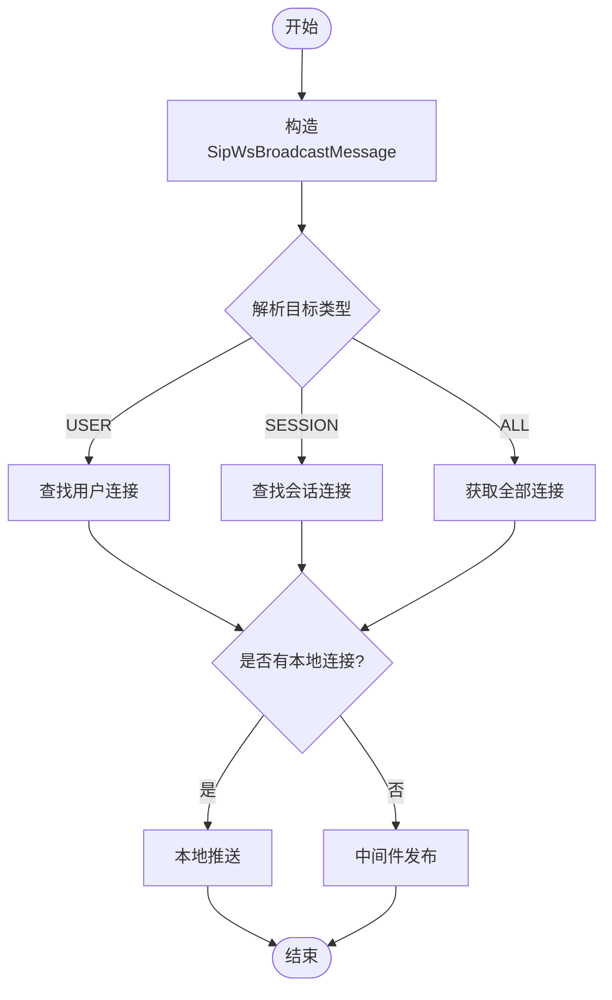

# 集群广播机制

<cite>
**本文引用的文件**
- [yudao-module-cc-server/pom.xml](file://yudao-cloud/yudao-module-cc/yudao-module-cc-server/pom.xml)
- [yudao-framework/yudao-spring-boot-starter-mq/pom.xml](file://yudao-cloud/yudao-framework/yudao-spring-boot-starter-mq/pom.xml)
- [yudao-framework/yudao-spring-boot-starter-websocket/pom.xml](file://yudao-cloud/yudao-framework/yudao-spring-boot-starter-websocket/pom.xml)
- [yudao-framework/yudao-spring-boot-starter-redis/pom.xml](file://yudao-cloud/yudao-framework/yudao-spring-boot-starter-redis/pom.xml)
- [yudao-module-cc/ipcc-sipproxy/src/main/java/cn/ipcc/sipproxy/cluster/ClusterManager.java](file://yudao-cloud/yudao-module-cc/ipcc-sipproxy/src/main/java/cn/ipcc/sipproxy/cluster/ClusterManager.java)
- [yudao-module-cc/ipcc-sipproxy/src/main/java/cn/ipcc/sipproxy/cluster/NodeInfo.java](file://yudao-cloud/yudao-module-cc/ipcc-sipproxy/src/main/java/cn/ipcc/sipproxy/cluster/NodeInfo.java)
- [yudao-module-cc/ipcc-sipproxy/src/main/java/cn/ipcc/sipproxy/core/session/WebSocketSessionManager.java](file://yudao-cloud/yudao-module-cc/ipcc-sipproxy/src/main/java/cn/ipcc/sipproxy/core/session/WebSocketSessionManager.java)
- [yudao-module-cc/ipcc-sipproxy/src/main/java/cn/ipcc/sipproxy/core/handler/SipWsBroadcastHandler.java](file://yudao-cloud/yudao-module-cc/ipcc-sipproxy/src/main/java/cn/ipcc/sipproxy/core/handler/SipWsBroadcastHandler.java)
- [yudao-module-cc/ipcc-sipproxy/src/main/java/cn/ipcc/sipproxy/core/model/SipWsBroadcastMessage.java](file://yudao-cloud/yudao-module-cc/ipcc-sipproxy/src/main/java/cn/ipcc/sipproxy/core/model/SipWsBroadcastMessage.java)
</cite>

## 目录
1. [简介](#简介)
2. [项目结构](#项目结构)
3. [核心组件](#核心组件)
4. [架构总览](#架构总览)
5. [详细组件分析](#详细组件分析)
6. [依赖关系分析](#依赖关系分析)
7. [性能考量](#性能考量)
8. [故障恢复指南](#故障恢复指南)
9. [结论](#结论)
10. [附录](#附录)

## 简介
本文件面向IPCC呼叫中心系统的多实例部署场景，系统化说明“集群广播机制”的设计与实现。文档覆盖以下要点：
- 五种广播通道：本地广播、Redis广播、Kafka广播、RabbitMQ广播、RocketMQ广播
- 消息载体 SipWsBroadcastMessage 的设计与字段语义
- 目标类型 USER、SESSION、ALL 的广播范围与路由策略
- 消息分发机制、顺序保证、重复处理等关键技术
- 集群配置示例、性能对比分析与故障恢复策略

该机制的核心目标是：在多个SIP代理或业务节点之间，将WebSocket侧的呼叫相关事件（如来电、去电、通话状态变更）以一致、可靠、可扩展的方式广播到所有需要处理的节点，确保用户会话与终端体验的一致性。

## 项目结构
围绕集群广播的关键代码位于CC模块的SIP代理子模块中，主要涉及：
- 集群管理：节点发现、成员维护、跨节点消息转发
- WebSocket会话管理：按用户/会话维度维护连接
- 广播处理器：统一入口，根据目标类型进行本地或远程分发
- 消息模型：承载广播内容的结构化对象
- 基础设施：通过Maven依赖引入Redis、Kafka、RabbitMQ、RocketMQ及WebSocket能力

图表来源
- [ClusterManager.java:1-200](file://yudao-module-cc/ipcc-sipproxy/src/main/java/cn/ipcc/sipproxy/cluster/ClusterManager.java#L1-L200)
- [WebSocketSessionManager.java:1-200](file://yudao-module-cc/ipcc-sipproxy/src/main/java/cn/ipcc/sipproxy/core/session/WebSocketSessionManager.java#L1-L200)
- [SipWsBroadcastHandler.java:1-200](file://yudao-module-cc/ipcc-sipproxy/src/main/java/cn/ipcc/sipproxy/core/handler/SipWsBroadcastHandler.java#L1-L200)
- [SipWsBroadcastMessage.java:1-200](file://yudao-module-cc/ipcc-sipproxy/src/main/java/cn/ipcc/sipproxy/core/model/SipWsBroadcastMessage.java#L1-L200)

章节来源
- [yudao-module-cc-server/pom.xml](file://yudao-cloud/yudao-module-cc/yudao-module-cc-server/pom.xml)
- [yudao-framework/yudao-spring-boot-starter-mq/pom.xml](file://yudao-cloud/yudao-framework/yudao-spring-boot-starter-mq/pom.xml)
- [yudao-framework/yudao-spring-boot-starter-websocket/pom.xml](file://yudao-cloud/yudao-framework/yudao-spring-boot-starter-websocket/pom.xml)
- [yudao-framework/yudao-spring-boot-starter-redis/pom.xml](file://yudao-cloud/yudao-framework/yudao-spring-boot-starter-redis/pom.xml)

## 核心组件
- 集群管理器 ClusterManager：负责节点注册、心跳、成员列表维护；提供跨节点的消息路由能力。
- WebSocket会话管理器 WebSocketSessionManager：维护用户ID到WebSocket连接的映射，支持按用户或会话ID推送消息。
- 广播处理器 SipWsBroadcastHandler：接收上层调用，解析目标类型（USER/SESSION/ALL），选择本地或远程通道进行广播。
- 消息模型 SipWsBroadcastMessage：定义消息头（如消息ID、时间戳、源节点）、负载（呼叫事件数据）、目标范围（USER/SESSION/ALL）。

章节来源
- [ClusterManager.java:1-200](file://yudao-module-cc/ipcc-sipproxy/src/main/java/cn/ipcc/sipproxy/cluster/ClusterManager.java#L1-L200)
- [WebSocketSessionManager.java:1-200](file://yudao-module-cc/ipcc-sipproxy/src/main/java/cn/ipcc/sipproxy/core/session/WebSocketSessionManager.java#L1-L200)
- [SipWsBroadcastHandler.java:1-200](file://yudao-module-cc/ipcc-sipproxy/src/main/java/cn/ipcc/sipproxy/core/handler/SipWsBroadcastHandler.java#L1-L200)
- [SipWsBroadcastMessage.java:1-200](file://yudao-module-cc/ipcc-sipproxy/src/main/java/cn/ipcc/sipproxy/core/model/SipWsBroadcastMessage.java#L1-L200)

## 架构总览
下图展示了从“触发广播”到“多通道投递”再到“下游消费”的整体流程。发送方通过统一的广播接口构造消息，处理器依据目标类型决定本地推送或经由中间件（Redis/Kafka/RabbitMQ/RocketMQ）进行跨节点广播。各节点订阅相应通道后，按自身会话表进行精准投递。

图表来源
- [SipWsBroadcastHandler.java:1-200](file://yudao-module-cc/ipcc-sipproxy/src/main/java/cn/ipcc/sipproxy/core/handler/SipWsBroadcastHandler.java#L1-L200)
- [WebSocketSessionManager.java:1-200](file://yudao-module-cc/ipcc-sipproxy/src/main/java/cn/ipcc/sipproxy/core/session/WebSocketSessionManager.java#L1-L200)
- [ClusterManager.java:1-200](file://yudao-module-cc/ipcc-sipproxy/src/main/java/cn/ipcc/sipproxy/cluster/ClusterManager.java#L1-L200)

## 详细组件分析

### 消息载体 SipWsBroadcastMessage
- 设计要点
  - 唯一标识：消息ID用于去重与幂等处理
  - 时间戳：用于排序与过期控制
  - 源节点：记录消息来源，便于追踪与审计
  - 目标范围：USER/SESSION/ALL，决定投递粒度
  - 负载内容：封装具体呼叫事件数据（如主被叫、IVR节点、通话状态等）
- 复杂度与扩展性
  - 采用扁平化结构，序列化开销低
  - 负载部分可灵活扩展，不影响头部稳定性
- 典型使用路径
  - 上游业务生成事件 -> 构造消息 -> 交由广播处理器分发

章节来源
- [SipWsBroadcastMessage.java:1-200](file://yudao-module-cc/ipcc-sipproxy/src/main/java/cn/ipcc/sipproxy/core/model/SipWsBroadcastMessage.java#L1-L200)

### 目标类型与广播范围
- USER：向指定用户的所有WebSocket连接广播，适用于用户级状态同步
- SESSION：向指定会话的连接广播，适用于单通通话上下文
- ALL：向所有在线连接广播，适用于全局公告或系统级事件
- 路由策略
  - 若目标在当前节点有连接，优先本地广播降低延迟
  - 否则通过中间件进行跨节点广播，各节点再按目标范围筛选本地连接

章节来源
- [SipWsBroadcastHandler.java:1-200](file://yudao-module-cc/ipcc-sipproxy/src/main/java/cn/ipcc/sipproxy/core/handler/SipWsBroadcastHandler.java#L1-L200)
- [WebSocketSessionManager.java:1-200](file://yudao-module-cc/ipcc-sipproxy/src/main/java/cn/ipcc/sipproxy/core/session/WebSocketSessionManager.java#L1-L200)

### 本地广播
- 工作原理
  - 基于进程内内存映射，快速定位用户/会话对应的WebSocket连接并推送
- 适用场景
  - 单实例部署或同一节点内的即时通知
- 优势与限制
  - 极低延迟、零网络开销
  - 无法跨节点传播，需配合中间件实现集群一致性

章节来源
- [WebSocketSessionManager.java:1-200](file://yudao-module-cc/ipcc-sipproxy/src/main/java/cn/ipcc/sipproxy/core/session/WebSocketSessionManager.java#L1-L200)

### Redis广播
- 工作原理
  - 使用Redis Pub/Sub进行轻量级跨节点广播
- 适用场景
  - 小规模集群、对实时性要求较高但吞吐不高的场景
- 注意事项
  - 无持久化，节点重启可能丢失未消费消息
  - 建议结合业务幂等与重试机制

章节来源
- [yudao-framework/yudao-spring-boot-starter-redis/pom.xml](file://yudao-cloud/yudao-framework/yudao-spring-boot-starter-redis/pom.xml)

### Kafka广播
- 工作原理
  - 通过Topic进行高吞吐、可回溯的消息广播
- 适用场景
  - 大规模集群、需要消息持久化与顺序保障的场景
- 顺序与幂等
  - 可通过分区键（如用户ID或会话ID）保证同Key的顺序
  - 消费者端基于消息ID去重，避免重复处理

章节来源
- [yudao-framework/yudao-spring-boot-starter-mq/pom.xml](file://yudao-cloud/yudao-framework/yudao-spring-boot-starter-mq/pom.xml)

### RabbitMQ广播
- 工作原理
  - 通过Exchange与队列进行灵活的路由与广播
- 适用场景
  - 需要细粒度路由、可靠性投递与死信处理的场景
- 顺序与幂等
  - 单队列内有序；多队列并行时需注意全局顺序需求
  - 消费者端基于消息ID去重

章节来源
- [yudao-framework/yudao-spring-boot-starter-mq/pom.xml](file://yudao-cloud/yudao-framework/yudao-spring-boot-starter-mq/pom.xml)

### RocketMQ广播
- 工作原理
  - 通过广播模式将消息投递给所有消费者实例
- 适用场景
  - 需要高可用、事务消息与顺序消息的组合场景
- 顺序与幂等
  - 支持分区内顺序；消费者端仍需幂等处理

章节来源
- [yudao-framework/yudao-spring-boot-starter-mq/pom.xml](file://yudao-cloud/yudao-framework/yudao-spring-boot-starter-mq/pom.xml)

### 消息分发机制与顺序保证
- 分发策略
  - 先本地后远程：若目标在本机有连接则直接推送，否则走中间件
  - 目标范围过滤：按USER/SESSION/ALL在本地会话表中筛选连接
- 顺序保证
  - 单会话顺序：通过会话ID作为分区键或队列路由键，确保同一会话消息有序
  - 全局顺序：仅在必要时启用，通常不建议，因为会牺牲吞吐
- 重复处理
  - 基于消息ID的去重缓存（本地或分布式）
  - 消费者幂等逻辑：相同消息ID仅处理一次

章节来源
- [SipWsBroadcastHandler.java:1-200](file://yudao-module-cc/ipcc-sipproxy/src/main/java/cn/ipcc/sipproxy/core/handler/SipWsBroadcastHandler.java#L1-L200)
- [WebSocketSessionManager.java:1-200](file://yudao-module-cc/ipcc-sipproxy/src/main/java/cn/ipcc/sipproxy/core/session/WebSocketSessionManager.java#L1-L200)

### 类图（关键组件关系）

图表来源
- [SipWsBroadcastMessage.java:1-200](file://yudao-module-cc/ipcc-sipproxy/src/main/java/cn/ipcc/sipproxy/core/model/SipWsBroadcastMessage.java#L1-L200)
- [SipWsBroadcastHandler.java:1-200](file://yudao-module-cc/ipcc-sipproxy/src/main/java/cn/ipcc/sipproxy/core/handler/SipWsBroadcastHandler.java#L1-L200)
- [WebSocketSessionManager.java:1-200](file://yudao-module-cc/ipcc-sipproxy/src/main/java/cn/ipcc/sipproxy/core/session/WebSocketSessionManager.java#L1-L200)
- [ClusterManager.java:1-200](file://yudao-module-cc/ipcc-sipproxy/src/main/java/cn/ipcc/sipproxy/cluster/ClusterManager.java#L1-L200)
- [NodeInfo.java:1-200](file://yudao-module-cc/ipcc-sipproxy/src/main/java/cn/ipcc/sipproxy/cluster/NodeInfo.java#L1-L200)

## 依赖关系分析
- 模块依赖
  - CC服务通过Maven引入WebSocket、Redis、MQ等starter，获得对应能力
- 运行时依赖
  - Redis/Kafka/RabbitMQ/RocketMQ作为外部中间件，需在集群环境中正确部署与配置
- 耦合度
  - 广播处理器与传输层解耦：通过抽象接口切换不同中间件实现
  - 会话管理与集群管理独立：便于横向扩展与维护

章节来源
- [yudao-module-cc-server/pom.xml](file://yudao-cloud/yudao-module-cc/yudao-module-cc-server/pom.xml)
- [yudao-framework/yudao-spring-boot-starter-mq/pom.xml](file://yudao-cloud/yudao-framework/yudao-spring-boot-starter-mq/pom.xml)
- [yudao-framework/yudao-spring-boot-starter-websocket/pom.xml](file://yudao-cloud/yudao-framework/yudao-spring-boot-starter-websocket/pom.xml)
- [yudao-framework/yudao-spring-boot-starter-redis/pom.xml](file://yudao-cloud/yudao-framework/yudao-spring-boot-starter-redis/pom.xml)

## 性能考量
- 本地广播
  - 延迟最低，适合高频小消息
- Redis广播
  - 轻量、低延迟，适合中小规模集群
- Kafka广播
  - 高吞吐、可回溯，适合大规模与强一致场景
- RabbitMQ广播
  - 灵活路由、可靠性强，适合复杂路由与重试需求
- RocketMQ广播
  - 高可用、事务与顺序支持，适合金融级可靠性场景
- 顺序与吞吐权衡
  - 单会话顺序优先于全局顺序
  - 合理设置分区键与队列数量，平衡并发与顺序
- 去重与幂等
  - 基于消息ID的去重缓存，避免重复处理影响性能

[本节为通用指导，不直接分析具体文件]

## 故障恢复指南
- 节点故障
  - 心跳检测与自动剔除：ClusterManager维护节点在线状态
  - 重连与补偿：消费者断线后重连，按偏移量或队列位点恢复
- 中间件故障
  - Redis：切换备用节点或使用持久化方案
  - Kafka/RabbitMQ/RocketMQ：启用副本与重试，监控积压与延迟
- 消息丢失与重复
  - 生产者确认与消费者ACK
  - 幂等处理：基于消息ID去重
- 回滚与降级
  - 当中间件不可用时，降级为本地广播，保证单机可用性
  - 异步补偿任务：在中间件恢复后补发缺失消息

章节来源
- [ClusterManager.java:1-200](file://yudao-module-cc/ipcc-sipproxy/src/main/java/cn/ipcc/sipproxy/cluster/ClusterManager.java#L1-L200)
- [SipWsBroadcastHandler.java:1-200](file://yudao-module-cc/ipcc-sipproxy/src/main/java/cn/ipcc/sipproxy/core/handler/SipWsBroadcastHandler.java#L1-L200)

## 结论
本集群广播机制通过统一的消息模型与灵活的传输通道，实现了在多实例环境下的一致性与可扩展性。针对不同的部署规模与可靠性需求，可选择合适的中间件组合，并通过顺序保证与幂等处理确保业务正确性。建议在上线前完成容量规划、压测与故障演练，确保系统在峰值与异常情况下仍保持稳定。

[本节为总结性内容，不直接分析具体文件]

## 附录

### 集群配置示例（概念性）
- 节点注册与发现
  - 每个节点启动时向集群管理器注册自身信息（节点ID、主机、端口）
  - 定期心跳上报，超时则标记离线
- 中间件配置
  - Redis：配置Pub/Sub频道与连接池
  - Kafka：配置Topic、分区数、消费者组
  - RabbitMQ：配置Exchange、Queue、RoutingKey
  - RocketMQ：配置Topic、ConsumerGroup、广播模式
- 会话映射
  - 按用户ID与会话ID维护WebSocket连接映射，支持快速检索

[本节为概念性配置说明，不直接分析具体文件]

### 流程图（广播处理核心逻辑）

图表来源
- [SipWsBroadcastHandler.java:1-200](file://yudao-module-cc/ipcc-sipproxy/src/main/java/cn/ipcc/sipproxy/core/handler/SipWsBroadcastHandler.java#L1-L200)
- [WebSocketSessionManager.java:1-200](file://yudao-module-cc/ipcc-sipproxy/src/main/java/cn/ipcc/sipproxy/core/session/WebSocketSessionManager.java#L1-L200)