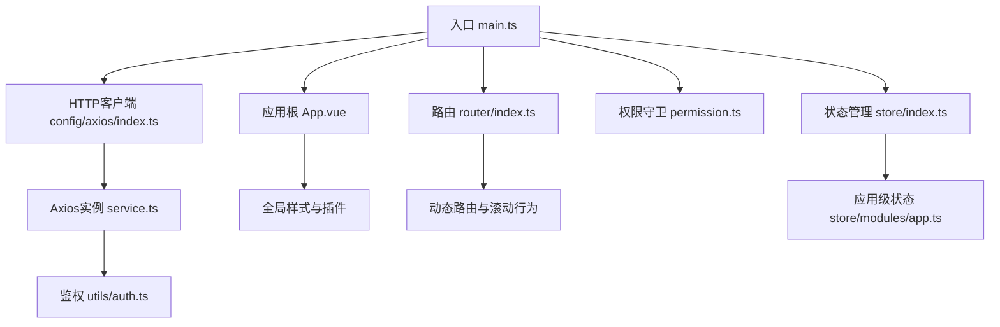
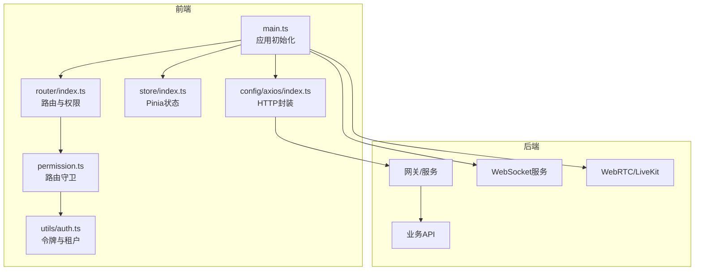
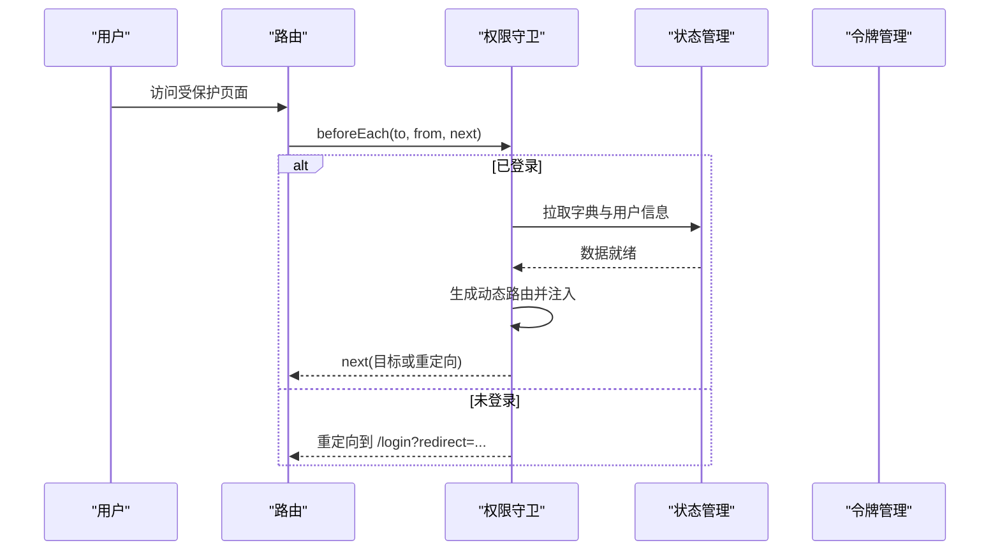
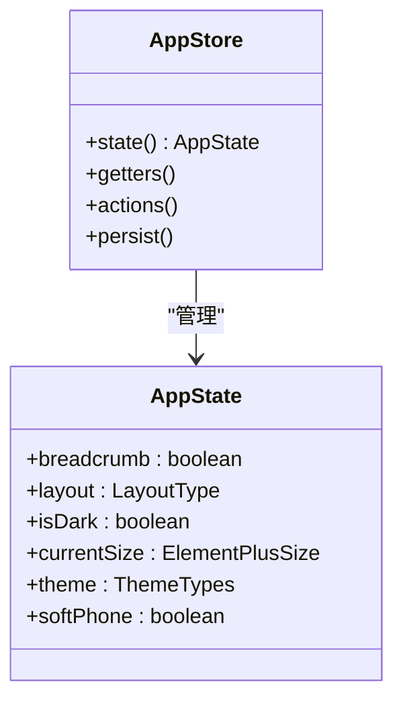
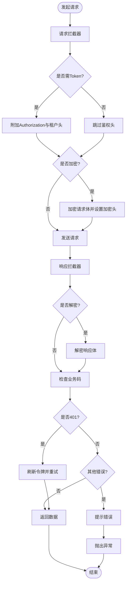
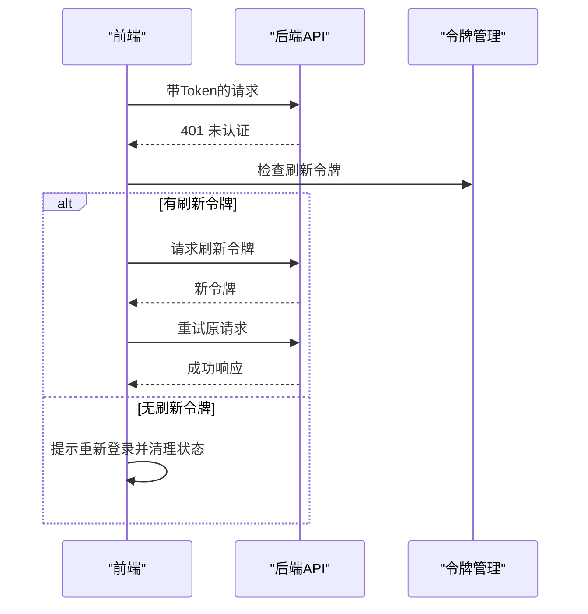
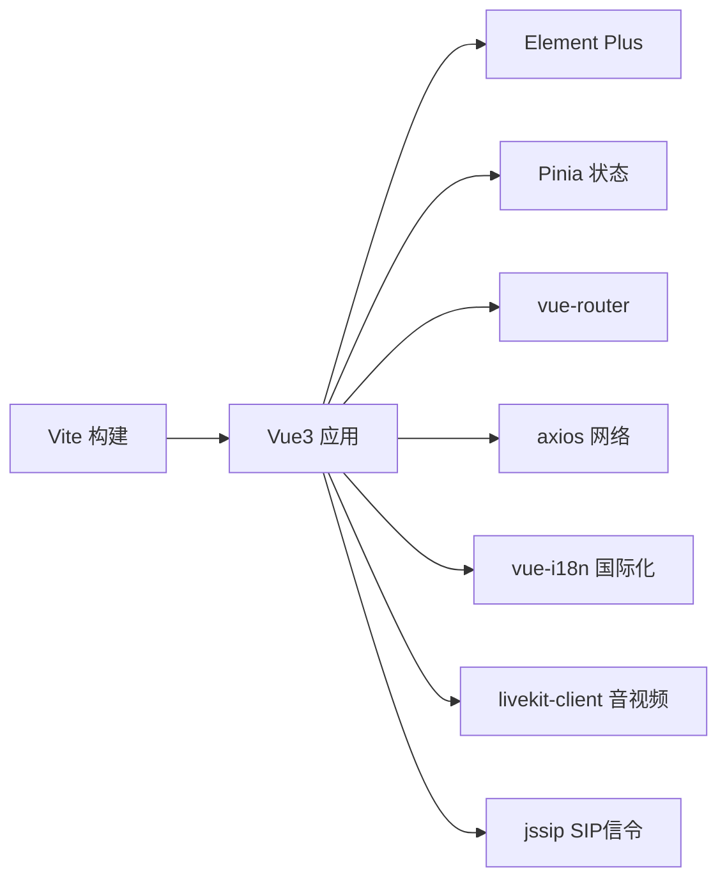

# 前后端分离架构

<cite>
**本文引用的文件**
- [package.json](file://yudao-ui-admin-vue3/package.json)
- [vite.config.ts](file://yudao-ui-admin-vue3/vite.config.ts)
- [main.ts](file://yudao-ui-admin-vue3/src/main.ts)
- [App.vue](file://yudao-ui-admin-vue3/src/App.vue)
- [router/index.ts](file://yudao-ui-admin-vue3/src/router/index.ts)
- [store/index.ts](file://yudao-ui-admin-vue3/src/store/index.ts)
- [store/modules/app.ts](file://yudao-ui-admin-vue3/src/store/modules/app.ts)
- [permission.ts](file://yudao-ui-admin-vue3/src/permission.ts)
- [config/axios/index.ts](file://yudao-ui-admin-vue3/src/config/axios/index.ts)
- [config/axios/service.ts](file://yudao-ui-admin-vue3/src/config/axios/service.ts)
- [utils/auth.ts](file://yudao-ui-admin-vue3/src/utils/auth.ts)
</cite>

## 目录
1. [简介](#简介)
2. [项目结构](#项目结构)
3. [核心组件](#核心组件)
4. [架构总览](#架构总览)
5. [详细组件分析](#详细组件分析)
6. [依赖关系分析](#依赖关系分析)
7. [性能考虑](#性能考虑)
8. [故障排查指南](#故障排查指南)
9. [结论](#结论)
10. [附录](#附录)

## 简介
本文件面向IPCC呼叫中心系统的前后端分离架构，聚焦Vue3 + TypeScript前端工程的结构设计、模块化组织、状态管理、前后端通信机制、API接口规范、认证授权流程、工程化配置与构建优化、部署方案，以及WebSocket实时通信、WebRTC音视频传输、响应式设计等关键技术的实现思路与实践建议。文档同时覆盖路由配置、权限控制、国际化支持，并提供开发环境搭建、调试工具使用与性能优化建议，帮助团队高效协作与持续交付。

## 项目结构
前端采用Vue3 + Vite + TypeScript工程，基于Element Plus UI库，结合Pinia进行状态管理，通过vue-router实现路由与权限控制，使用Axios封装统一HTTP请求与拦截器，集成i18n多语言、主题与布局配置、全局指令与插件。整体遵循“按功能域划分模块”的组织方式，将API、视图、组件、Store、Hooks、工具函数分层清晰，便于维护与扩展。

图表来源
- [main.ts:1-92](file://yudao-ui-admin-vue3/src/main.ts#L1-L92)
- [App.vue:1-58](file://yudao-ui-admin-vue3/src/App.vue#L1-L58)
- [router/index.ts:1-47](file://yudao-ui-admin-vue3/src/router/index.ts#L1-L47)
- [store/index.ts:1-13](file://yudao-ui-admin-vue3/src/store/index.ts#L1-L13)
- [config/axios/index.ts:1-48](file://yudao-ui-admin-vue3/src/config/axios/index.ts#L1-L48)
- [config/axios/service.ts:1-272](file://yudao-ui-admin-vue3/src/config/axios/service.ts#L1-L272)
- [utils/auth.ts:1-87](file://yudao-ui-admin-vue3/src/utils/auth.ts#L1-L87)

章节来源
- [main.ts:1-92](file://yudao-ui-admin-vue3/src/main.ts#L1-L92)
- [package.json:1-159](file://yudao-ui-admin-vue3/package.json#L1-L159)

## 核心组件
- 应用初始化与插件装配：在入口文件中依次注册国际化、状态管理、全局组件、UI框架、表单引擎、路由、指令、打印插件与内容安全处理，确保应用启动顺序正确且资源按需加载。
- 根组件与主题：根组件负责全局尺寸、灰度模式、暗黑模式切换与搜索栏挂载，并通过配置全局提供主题变量与布局能力。
- 路由与权限：基于vue-router创建历史模式路由，配置滚动行为与错误恢复；通过全局前置守卫完成登录态校验、字典与用户信息预取、动态菜单生成与路由注入，并处理重定向与白名单。
- 状态管理：使用Pinia作为全局状态容器，持久化插件用于本地缓存；应用级Store集中管理界面布局、主题、尺寸、移动端适配、软电话开关等。
- HTTP客户端：封装Axios实例，统一设置baseURL、超时、参数序列化、租户头、加密标识；请求拦截器自动附加Bearer Token与租户信息，响应拦截器处理解密、错误码、无感知刷新令牌与登出流程。
- 认证与令牌：封装访问令牌、刷新令牌、登录表单的存取与加解密，提供获取当前用户ID与租户上下文的能力。

章节来源
- [main.ts:1-92](file://yudao-ui-admin-vue3/src/main.ts#L1-L92)
- [App.vue:1-58](file://yudao-ui-admin-vue3/src/App.vue#L1-L58)
- [router/index.ts:1-47](file://yudao-ui-admin-vue3/src/router/index.ts#L1-L47)
- [store/index.ts:1-13](file://yudao-ui-admin-vue3/src/store/index.ts#L1-L13)
- [store/modules/app.ts:1-341](file://yudao-ui-admin-vue3/src/store/modules/app.ts#L1-L341)
- [config/axios/index.ts:1-48](file://yudao-ui-admin-vue3/src/config/axios/index.ts#L1-L48)
- [config/axios/service.ts:1-272](file://yudao-ui-admin-vue3/src/config/axios/service.ts#L1-L272)
- [utils/auth.ts:1-87](file://yudao-ui-admin-vue3/src/utils/auth.ts#L1-L87)

## 架构总览
前端以Vite为构建工具，采用模块化目录组织，通过路由与权限控制驱动页面渲染，借助Pinia管理跨组件状态，使用Axios统一网络层，集成i18n与主题系统。后端服务通过网关与微服务暴露REST API，前端通过Token鉴权访问；实时通信与音视频能力通过WebSocket与WebRTC（LiveKit）在前端集成，满足呼叫中心场景下的即时消息与通话需求。

图表来源
- [main.ts:1-92](file://yudao-ui-admin-vue3/src/main.ts#L1-L92)
- [router/index.ts:1-47](file://yudao-ui-admin-vue3/src/router/index.ts#L1-L47)
- [store/index.ts:1-13](file://yudao-ui-admin-vue3/src/store/index.ts#L1-L13)
- [config/axios/index.ts:1-48](file://yudao-ui-admin-vue3/src/config/axios/index.ts#L1-L48)
- [permission.ts:1-79](file://yudao-ui-admin-vue3/src/permission.ts#L1-L79)
- [utils/auth.ts:1-87](file://yudao-ui-admin-vue3/src/utils/auth.ts#L1-L87)

## 详细组件分析

### 应用初始化与插件装配
- 初始化顺序：先引入样式与图标，再注册国际化、状态管理、全局组件、UI框架、表单引擎、路由与指令，最后挂载应用。
- 错误恢复：监听Vite预加载失败事件，自动刷新页面以避免构建后chunk哈希变化导致的加载异常。
- 安全与打印：启用HTML内容净化与打印插件，提升安全性与可打印性。

章节来源
- [main.ts:1-92](file://yudao-ui-admin-vue3/src/main.ts#L1-L92)

### 根组件与主题管理
- 主题与尺寸：根据浏览器主题与本地缓存设置暗黑模式与组件尺寸，支持灰度模式。
- 全局容器：通过配置全局提供尺寸与主题变量，保证组件一致性。

章节来源
- [App.vue:1-58](file://yudao-ui-admin-vue3/src/App.vue#L1-L58)
- [store/modules/app.ts:1-341](file://yudao-ui-admin-vue3/src/store/modules/app.ts#L1-L341)

### 路由与权限控制
- 路由配置：使用history模式，配置滚动行为与动态导入失败恢复。
- 权限守卫：在进入路由前检查访问令牌，若存在则拉取字典与用户信息，生成动态菜单并注入路由；否则跳转登录页并携带redirect参数。
- 白名单：对登录、社交登录、绑定、注册等页面放行。

图表来源
- [permission.ts:1-79](file://yudao-ui-admin-vue3/src/permission.ts#L1-L79)
- [router/index.ts:1-47](file://yudao-ui-admin-vue3/src/router/index.ts#L1-L47)
- [utils/auth.ts:1-87](file://yudao-ui-admin-vue3/src/utils/auth.ts#L1-L87)

章节来源
- [permission.ts:1-79](file://yudao-ui-admin-vue3/src/permission.ts#L1-L79)
- [router/index.ts:1-47](file://yudao-ui-admin-vue3/src/router/index.ts#L1-L47)

### 状态管理（Pinia）
- 应用级状态：集中管理布局、主题、尺寸、移动端适配、软电话开关等，提供getter与action，支持本地持久化。
- 主题切换：根据暗黑模式计算主色深浅与RGB变量，动态更新CSS变量。

图表来源
- [store/modules/app.ts:1-341](file://yudao-ui-admin-vue3/src/store/modules/app.ts#L1-L341)

章节来源
- [store/index.ts:1-13](file://yudao-ui-admin-vue3/src/store/index.ts#L1-L13)
- [store/modules/app.ts:1-341](file://yudao-ui-admin-vue3/src/store/modules/app.ts#L1-L341)

### HTTP客户端与API规范
- 基础配置：设置baseURL、超时、参数序列化、禁用Cookie；GET请求添加no-cache头避免缓存。
- 请求拦截：自动附加Authorization（Bearer Token）、租户头与访问租户头；支持可选的数据加密请求头。
- 响应拦截：处理二进制下载、响应解密、错误码提示、无感知刷新令牌与登出流程。
- 统一方法：提供get/post/delete/put/upload/download等方法，简化调用。

图表来源
- [config/axios/service.ts:1-272](file://yudao-ui-admin-vue3/src/config/axios/service.ts#L1-L272)
- [config/axios/index.ts:1-48](file://yudao-ui-admin-vue3/src/config/axios/index.ts#L1-L48)
- [utils/auth.ts:1-87](file://yudao-ui-admin-vue3/src/utils/auth.ts#L1-L87)

章节来源
- [config/axios/index.ts:1-48](file://yudao-ui-admin-vue3/src/config/axios/index.ts#L1-L48)
- [config/axios/service.ts:1-272](file://yudao-ui-admin-vue3/src/config/axios/service.ts#L1-L272)
- [utils/auth.ts:1-87](file://yudao-ui-admin-vue3/src/utils/auth.ts#L1-L87)

### 认证与授权流程
- 令牌存储：访问令牌与刷新令牌通过本地缓存存取，支持加解密与过期策略。
- 路由鉴权：进入受保护路由时校验令牌，缺失则跳转登录并携带redirect；登录后拉取用户信息与动态菜单并注入路由。
- 无感知刷新：当接口返回401时，尝试刷新令牌并回放队列中的请求；刷新失败则提示重新登录并清理状态。

图表来源
- [config/axios/service.ts:1-272](file://yudao-ui-admin-vue3/src/config/axios/service.ts#L1-L272)
- [utils/auth.ts:1-87](file://yudao-ui-admin-vue3/src/utils/auth.ts#L1-L87)
- [permission.ts:1-79](file://yudao-ui-admin-vue3/src/permission.ts#L1-L79)

章节来源
- [permission.ts:1-79](file://yudao-ui-admin-vue3/src/permission.ts#L1-L79)
- [config/axios/service.ts:1-272](file://yudao-ui-admin-vue3/src/config/axios/service.ts#L1-L272)
- [utils/auth.ts:1-87](file://yudao-ui-admin-vue3/src/utils/auth.ts#L1-L87)

### WebSocket实时通信
- 集成方案：前端可通过原生WebSocket或事件源（如fetch-event-source）建立长连接，用于接收呼叫中心实时事件（来电、坐席状态、工单流转等）。
- 连接管理：建议在应用启动或进入相关页面时建立连接，并在离开时断开；实现心跳检测与断线重连机制，保障稳定性。
- 消息处理：定义消息协议与类型，区分业务事件与系统事件，结合状态管理更新UI。

[本节为概念性说明，不直接分析具体文件]

### WebRTC音视频传输
- 集成方案：使用LiveKit客户端库进行信令与媒体流管理，结合SIP代理或Freeswitch进行呼叫控制。
- 媒体协商：通过SDP交换与ICE候选收集完成端到端媒体通道建立；必要时配置TURN服务器穿透NAT。
- 用户体验：提供静音、摄像头开关、屏幕共享、通话质量监控与降级策略。

[本节为概念性说明，不直接分析具体文件]

### 响应式设计
- 布局适配：通过应用级状态检测移动端并调整布局；Element Plus尺寸与栅格系统配合实现自适应。
- 交互优化：在小屏设备上隐藏非必要操作，提供底部导航或抽屉式菜单。

章节来源
- [store/modules/app.ts:1-341](file://yudao-ui-admin-vue3/src/store/modules/app.ts#L1-L341)

## 依赖关系分析
- 构建与插件：Vite为核心构建工具，配合Vue插件、SCSS预处理、UnoCSS原子化样式、压缩与SVG图标插件。
- 运行时依赖：Vue3、Element Plus、Pinia、vue-router、axios、i18n、LiveKit、JSSIP等。
- 工程化工具：ESLint、Stylelint、Prettier、TypeScript、Vitest（可选）等。

图表来源
- [package.json:1-159](file://yudao-ui-admin-vue3/package.json#L1-L159)

章节来源
- [package.json:1-159](file://yudao-ui-admin-vue3/package.json#L1-L159)

## 性能考虑
- 构建优化：
  - 代码分割：将ECharts、FormCreate等大型库单独分包，减少首屏体积。
  - 压缩与SourceMap：生产环境关闭SourceMap或使用inline，按需开启调试。
  - SCSS变量注入：通过preprocessorOptions全局注入变量，减少重复编译。
- 运行期优化：
  - 路由懒加载与错误恢复：动态导入失败自动跳转目标页面，提升健壮性。
  - 请求缓存与去抖：GET请求添加no-cache头避免缓存；合理设置请求节流与防抖。
  - 主题与样式：使用CSS变量与原子化样式，减少重排重绘。
- 资源优化：
  - 图片与图标：使用SVG图标与按需引入，减少包体。
  - 第三方库：仅引入必要模块，避免全量引入。

章节来源
- [vite.config.ts:1-109](file://yudao-ui-admin-vue3/vite.config.ts#L1-L109)
- [router/index.ts:1-47](file://yudao-ui-admin-vue3/src/router/index.ts#L1-L47)

## 故障排查指南
- 路由错误：动态导入失败时自动跳转到目标页面，避免白屏；检查路由配置与模块路径。
- 网络错误：统一错误提示与超时处理；检查baseURL、CORS与Token有效性。
- 令牌过期：触发无感知刷新流程；若刷新失败则提示重新登录并清理状态。
- 构建问题：检查环境变量与插件配置；确认Node与pnpm版本符合引擎要求。

章节来源
- [router/index.ts:1-47](file://yudao-ui-admin-vue3/src/router/index.ts#L1-L47)
- [config/axios/service.ts:1-272](file://yudao-ui-admin-vue3/src/config/axios/service.ts#L1-L272)
- [package.json:1-159](file://yudao-ui-admin-vue3/package.json#L1-L159)

## 结论
该前端工程以Vue3 + Vite + TypeScript为基础，结合Element Plus、Pinia、vue-router与Axios构建了高内聚、低耦合的前端架构。通过权限守卫与动态路由实现细粒度访问控制，利用Axios拦截器与令牌管理实现健壮的认证与无感知刷新。工程化配置完善，具备构建优化与错误恢复能力。针对呼叫中心场景，建议在前端集成WebSocket与WebRTC（LiveKit），以实现实时通信与音视频通话，并结合响应式设计提升多端体验。

## 附录
- 开发环境搭建：
  - 安装Node.js与pnpm，确保版本满足引擎要求。
  - 安装依赖并启动开发服务器，查看端口与打开行为由环境变量控制。
- 调试工具：
  - 浏览器开发者工具：Network、Console、Performance面板。
  - Vue Devtools：组件树与状态调试。
  - 日志输出：使用内置Logger与控制台输出定位问题。
- 部署方案：
  - 构建产物输出至dist目录，部署至静态服务器或CDN。
  - 配置反向代理与HTTPS，确保API与WebSocket/WebRTC端口可达。
  - 环境变量：BASE_PATH、PORT、OPEN、OUT_DIR、SOURCEMAP等按需配置。

章节来源
- [package.json:1-159](file://yudao-ui-admin-vue3/package.json#L1-L159)
- [vite.config.ts:1-109](file://yudao-ui-admin-vue3/vite.config.ts#L1-L109)