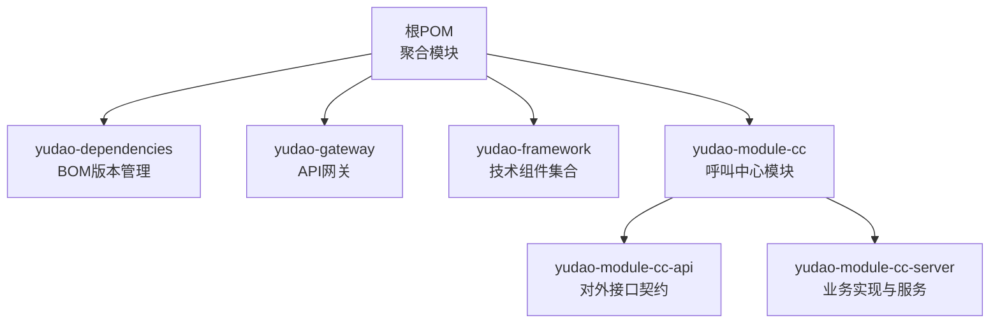
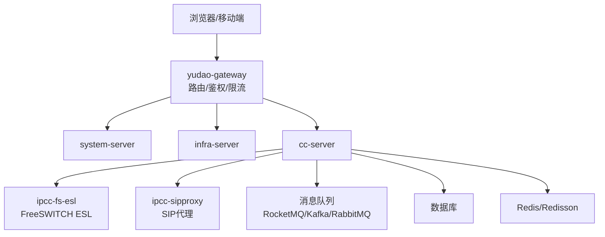
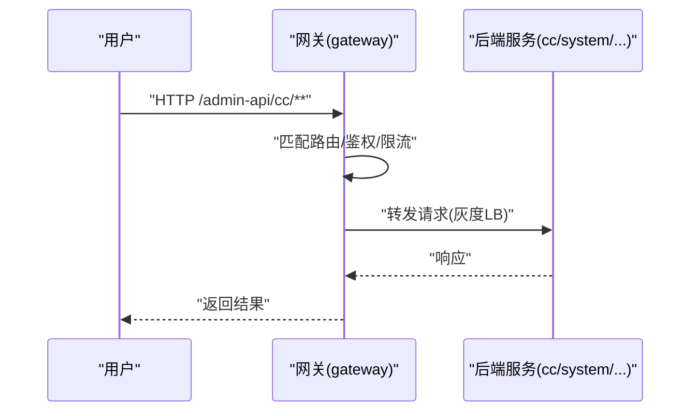
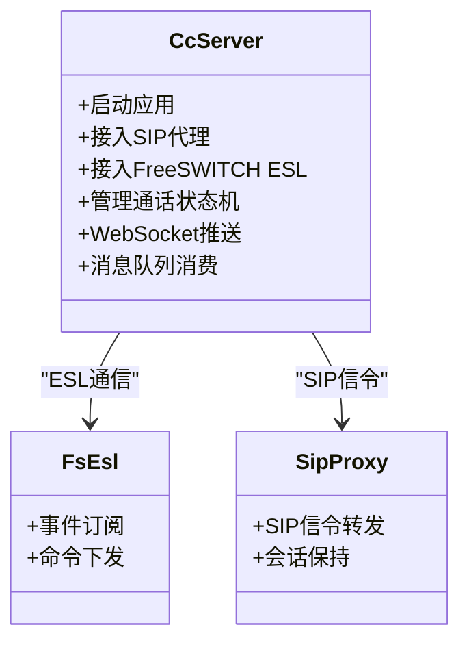
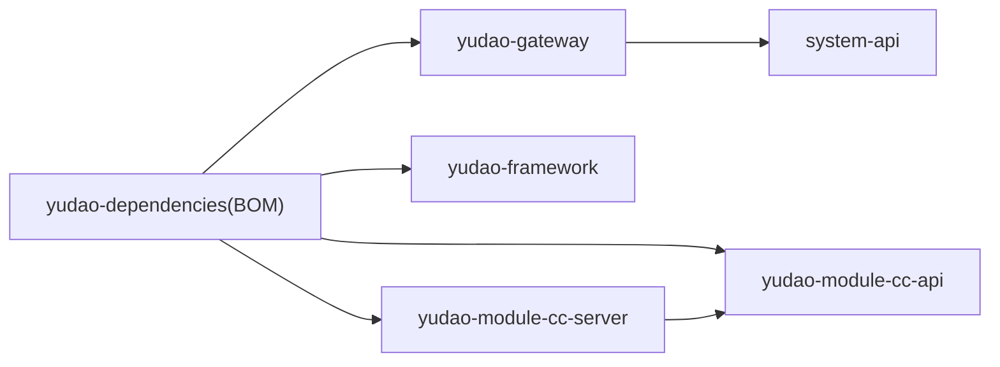

# 微服务架构

<cite>
**本文引用的文件**
- [pom.xml](file://yudao-cloud/pom.xml)
- [yudao-dependencies/pom.xml](file://yudao-cloud/yudao-dependencies/pom.xml)
- [README.md](file://yudao-cloud/README.md)
- [yudao-gateway/pom.xml](file://yudao-cloud/yudao-gateway/pom.xml)
- [yudao-gateway/src/main/resources/application.yaml](file://yudao-cloud/yudao-gateway/src/main/resources/application.yaml)
- [yudao-framework/pom.xml](file://yudao-cloud/yudao-framework/pom.xml)
- [yudao-module-cc/pom.xml](file://yudao-cloud/yudao-module-cc/pom.xml)
- [yudao-module-cc/yudao-module-cc-api/pom.xml](file://yudao-cloud/yudao-module-cc/yudao-module-cc-api/pom.xml)
- [yudao-module-cc/yudao-module-cc-server/pom.xml](file://yudao-cloud/yudao-module-cc/yudao-module-cc-server/pom.xml)
- [yudao-module-cc/yudao-module-cc-server/src/main/resources/application.yaml](file://yudao-cloud/yudao-module-cc/yudao-module-cc-server/src/main/resources/application.yaml)
</cite>

## 目录
1. [简介](#简介)
2. [项目结构](#项目结构)
3. [核心组件](#核心组件)
4. [架构总览](#架构总览)
5. [详细组件分析](#详细组件分析)
6. [依赖分析](#依赖分析)
7. [性能考虑](#性能考虑)
8. [故障排查指南](#故障排查指南)
9. [结论](#结论)
10. [附录](#附录)

## 简介
本文件面向IPCC呼叫中心系统的微服务架构，基于Spring Cloud与Spring Boot 3.x，采用Maven多模块组织。重点说明以下方面：
- 微服务拆分策略：yudao-module-cc（呼叫中心核心）、yudao-framework（基础框架）、yudao-gateway（API网关）等模块职责划分
- 服务间通信机制、依赖管理与版本控制策略
- Maven多模块项目结构、POM配置与构建流程
- 服务发现、配置中心、负载均衡等基础设施集成方式
- 部署拓扑、容器化方案与扩展性考虑
- 实际代码示例展示服务间调用模式（以路径引用形式提供）

## 项目结构
顶层聚合工程通过根POM统一声明模块与插件管理，并通过BOM集中管理依赖版本。关键要点：
- 根POM定义模块列表，包含gateway、framework、server以及各业务module（含cc）
- yudao-dependencies作为BOM，统一管理Spring Boot、Spring Cloud、Nacos、MyBatis Plus、Redisson等依赖版本
- 每个业务模块通常拆分为api与server子模块，实现接口与实现的解耦
- gateway为外部流量入口，负责路由转发、鉴权、限流、文档聚合等

图表来源
- [pom.xml:10-33](file://yudao-cloud/pom.xml#L10-L33)
- [yudao-dependencies/pom.xml:16-92](file://yudao-cloud/yudao-dependencies/pom.xml#L16-L92)

章节来源
- [pom.xml:1-163](file://yudao-cloud/pom.xml#L1-L163)
- [yudao-dependencies/pom.xml:1-800](file://yudao-cloud/yudao-dependencies/pom.xml#L1-L800)

## 核心组件
- yudao-framework：封装通用能力，如Web、Security、Redis、MyBatis、MQ、Job、RPC、监控、保护等starter，供各业务服务按需引入
- yudao-gateway：基于Spring Cloud Gateway的API网关，提供路由、鉴权、限流、跨域、文档聚合、灰度/负载均衡等能力
- yudao-module-cc：呼叫中心业务模块，包含SIP代理、FreeSWITCH ESL对接、通话路由、录音、IVR、坐席管理等；拆分为api与server，便于跨服务复用接口

章节来源
- [yudao-framework/pom.xml:12-34](file://yudao-cloud/yudao-framework/pom.xml#L12-L34)
- [yudao-gateway/pom.xml:18-86](file://yudao-cloud/yudao-gateway/pom.xml#L18-L86)
- [yudao-module-cc/pom.xml:10-15](file://yudao-cloud/yudao-module-cc/pom.xml#L10-L15)

## 架构总览
整体采用“网关+微服务”的分层架构：
- 客户端请求进入yudao-gateway，按路径匹配路由到具体服务
- 服务之间通过Feign/RPC进行声明式调用，结合Nacos完成服务发现与配置拉取
- 使用Redis/Redisson做缓存与分布式锁，RocketMQ/Kafka/RabbitMQ作为消息总线
- 通过SkyWalking/OpenTelemetry进行链路追踪与监控

图表来源
- [yudao-gateway/src/main/resources/application.yaml:34-236](file://yudao-cloud/yudao-gateway/src/main/resources/application.yaml#L34-L236)
- [yudao-module-cc/yudao-module-cc-server/pom.xml:132-182](file://yudao-cloud/yudao-module-cc/yudao-module-cc-server/pom.xml#L132-L182)

## 详细组件分析

### API网关（yudao-gateway）
- 功能定位：统一入口、路由转发、鉴权、限流、跨域、文档聚合、灰度发布
- 路由规则：按Path断言将/admin-api/*与/app-api/*映射到对应服务，并自动重写v3/api-docs路径以便Knife4j聚合
- 负载均衡：使用自定义负载均衡前缀grayLb指向服务名，结合Nacos注册中心实现动态实例选择
- 配置加载：支持本地application-${profile}.yaml与Nacos远程配置导入

图表来源
- [yudao-gateway/src/main/resources/application.yaml:34-236](file://yudao-cloud/yudao-gateway/src/main/resources/application.yaml#L34-L236)
- [yudao-gateway/pom.xml:32-59](file://yudao-cloud/yudao-gateway/pom.xml#L32-L59)

章节来源
- [yudao-gateway/pom.xml:1-110](file://yudao-cloud/yudao-gateway/pom.xml#L1-L110)
- [yudao-gateway/src/main/resources/application.yaml:1-313](file://yudao-cloud/yudao-gateway/src/main/resources/application.yaml#L1-L313)

### 呼叫中心核心（yudao-module-cc）
- 模块拆分：
  - yudao-module-cc-api：仅暴露接口契约与枚举，供其他模块依赖
  - yudao-module-cc-server：实现呼叫中心业务逻辑，包括通话路由、录音、IVR、坐席管理、状态机等
- 关键依赖：
  - ipcc-fs-esl：FreeSWITCH ESL客户端，用于事件订阅与控制
  - ipcc-sipproxy：SIP代理组件，处理SIP信令转发与会话建立
  - Spring Statemachine：通话状态机管理
  - WebSocket：实时信令/状态推送
  - MQ：异步任务与事件驱动
- 配置要点：
  - 启用Nacos配置中心与注册中心
  - 开启Swagger/Knife4j文档
  - 多租户、XSS防护、文件上传大小限制等

图表来源
- [yudao-module-cc/yudao-module-cc-server/pom.xml:132-182](file://yudao-cloud/yudao-module-cc/yudao-module-cc-server/pom.xml#L132-L182)
- [yudao-module-cc/yudao-module-cc-server/src/main/resources/application.yaml:1-125](file://yudao-cloud/yudao-module-cc/yudao-module-cc-server/src/main/resources/application.yaml#L1-L125)

章节来源
- [yudao-module-cc/pom.xml:1-26](file://yudao-cloud/yudao-module-cc/pom.xml#L1-L26)
- [yudao-module-cc/yudao-module-cc-api/pom.xml:1-24](file://yudao-cloud/yudao-module-cc/yudao-module-cc-api/pom.xml#L1-L24)
- [yudao-module-cc/yudao-module-cc-server/pom.xml:1-236](file://yudao-cloud/yudao-module-cc/yudao-module-cc-server/pom.xml#L1-L236)
- [yudao-module-cc/yudao-module-cc-server/src/main/resources/application.yaml:1-125](file://yudao-cloud/yudao-module-cc/yudao-module-cc-server/src/main/resources/application.yaml#L1-L125)

### 基础框架（yudao-framework）
- 目标：将通用能力抽象为starter，降低业务模块耦合度
- 主要组件：
  - Web、Security、WebSocket、Redis、MyBatis、MQ、Job、RPC、Monitor、Protection等
  - 业务组件：数据权限、租户隔离、IP解析等
- 使用方式：业务服务按需引入starter，快速获得能力装配

章节来源
- [yudao-framework/pom.xml:1-50](file://yudao-cloud/yudao-framework/pom.xml#L1-L50)

## 依赖分析
- 版本管理：通过yudao-dependencies的BOM统一锁定Spring Boot、Spring Cloud、Nacos、MyBatis Plus、Redisson等版本，避免冲突
- 模块依赖：
  - gateway依赖系统API与Gateway相关组件，并引入Nacos配置/发现、LoadBalancer、监控与链路追踪
  - cc-server依赖系统API、基础设施API、cc-api，以及FS-ESL、SIP代理、状态机、WebSocket、MQ等
- 依赖方向：
  - api模块无运行时依赖或仅依赖common
  - server模块依赖各自api与框架starter
  - gateway不直接依赖业务实现，仅依赖系统API用于文档聚合

图表来源
- [yudao-dependencies/pom.xml:94-124](file://yudao-cloud/yudao-dependencies/pom.xml#L94-L124)
- [yudao-gateway/pom.xml:18-86](file://yudao-cloud/yudao-gateway/pom.xml#L18-L86)
- [yudao-module-cc/yudao-module-cc-server/pom.xml:23-112](file://yudao-cloud/yudao-module-cc/yudao-module-cc-server/pom.xml#L23-L112)

章节来源
- [yudao-dependencies/pom.xml:1-800](file://yudao-cloud/yudao-dependencies/pom.xml#L1-L800)
- [yudao-gateway/pom.xml:1-110](file://yudao-cloud/yudao-gateway/pom.xml#L1-L110)
- [yudao-module-cc/yudao-module-cc-server/pom.xml:1-236](file://yudao-cloud/yudao-module-cc/yudao-module-cc-server/pom.xml#L1-L236)

## 性能考虑
- 网关层：
  - 调整HTTP编解码缓冲区大小，避免大请求被截断
  - 使用灰度负载均衡策略，支持A/B测试与平滑升级
  - 关闭不必要的特性（如循环依赖），减少启动开销
- 服务层：
  - 合理设置文件上传大小限制，避免内存溢出
  - 使用Redis缓存热点数据，降低DB压力
  - 使用状态机管理复杂状态流转，避免状态不一致
  - 通过MQ异步化处理耗时操作，提升吞吐
- 可观测性：
  - 接入SkyWalking/OpenTelemetry进行链路追踪与性能分析
  - 使用Spring Boot Admin监控JVM与运行指标

[本节为通用指导，无需特定文件引用]

## 故障排查指南
- 网关路由问题：
  - 检查Path断言与RewritePath配置是否正确
  - 确认服务已在Nacos注册且健康
- 配置中心问题：
  - 确认Nacos地址、命名空间、Data ID与Group配置正确
  - 检查本地与远程配置的优先级与覆盖关系
- 服务间调用失败：
  - 检查Feign/RPC starter是否引入
  - 查看服务日志与链路追踪，定位异常点
- 媒体通道问题（SIP/ESL）：
  - 检查SIP代理与FreeSWITCH连通性
  - 核对端口、防火墙与公网回环配置

章节来源
- [yudao-gateway/src/main/resources/application.yaml:34-236](file://yudao-cloud/yudao-gateway/src/main/resources/application.yaml#L34-L236)
- [yudao-module-cc/yudao-module-cc-server/src/main/resources/application.yaml:12-15](file://yudao-cloud/yudao-module-cc/yudao-module-cc-server/src/main/resources/application.yaml#L12-L15)

## 结论
本项目采用清晰的Maven多模块与Spring Cloud微服务架构，通过网关统一入口、Nacos服务发现与配置中心、标准化starter与BOM版本管理，实现了高内聚、低耦合的可扩展体系。呼叫中心核心模块在SIP与FreeSWITCH生态上进行了深度集成，配合状态机、消息队列与WebSocket，满足实时性与可靠性要求。建议在后续演进中持续完善灰度发布、弹性伸缩与全链路可观测性，以提升生产稳定性与运维效率。

[本节为总结性内容，无需特定文件引用]

## 附录

### 服务间调用模式（示例路径）
- 网关路由到cc-server：
  - 参考：[yudao-gateway/src/main/resources/application.yaml:223-235](file://yudao-cloud/yudao-gateway/src/main/resources/application.yaml#L223-L235)
- cc-server引入系统API与基础设施API进行跨服务调用：
  - 参考：[yudao-module-cc/yudao-module-cc-server/pom.xml:30-46](file://yudao-cloud/yudao-module-cc/yudao-module-cc-server/pom.xml#L30-L46)
- 使用Nacos进行服务发现与配置拉取：
  - 参考：[yudao-module-cc/yudao-module-cc-server/pom.xml:90-100](file://yudao-cloud/yudao-module-cc/yudao-module-cc-server/pom.xml#L90-L100)
  - 参考：[yudao-module-cc/yudao-module-cc-server/src/main/resources/application.yaml:12-15](file://yudao-cloud/yudao-module-cc/yudao-module-cc-server/src/main/resources/application.yaml#L12-L15)

### 部署拓扑与容器化
- 建议部署拓扑：
  - 前端静态资源由CDN托管
  - 网关独立部署，横向扩展
  - 各业务服务按领域拆分，独立扩缩容
  - Nacos集群、Redis集群、数据库主从/分库分表
- 容器化：
  - 每个服务提供Dockerfile，镜像内仅包含运行所需JDK与应用包
  - 使用Kubernetes进行编排，配置HPA与探针
  - 通过ConfigMap/Secret注入配置与密钥

[本节为通用指导，无需特定文件引用]

### 版本控制策略
- 统一版本号：根POM与BOM中使用${revision}统一管理版本，便于批量升级
- 依赖锁定：通过BOM锁定第三方依赖版本，避免传递依赖冲突
- 分支策略：主干开发+特性分支，发布打标签；敏感修复走热修复分支

章节来源
- [pom.xml:39-65](file://yudao-cloud/pom.xml#L39-L65)
- [yudao-dependencies/pom.xml:16-92](file://yudao-cloud/yudao-dependencies/pom.xml#L16-L92)