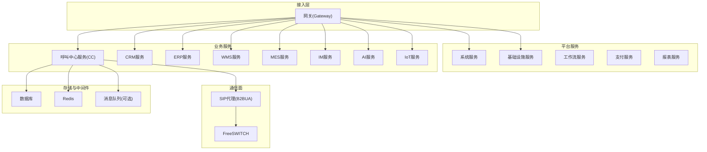
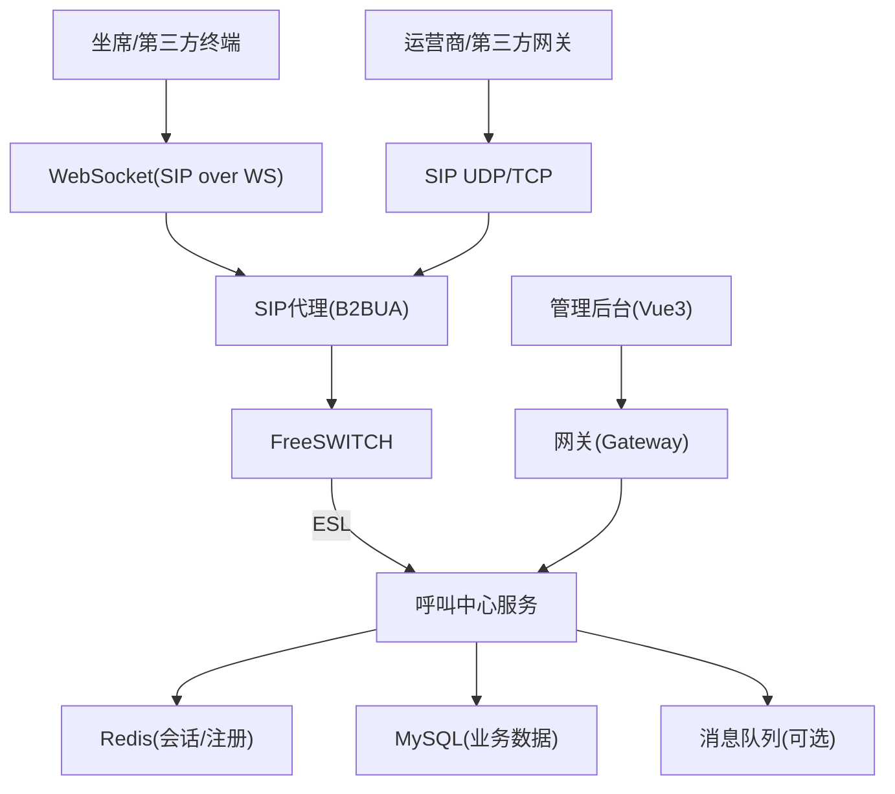
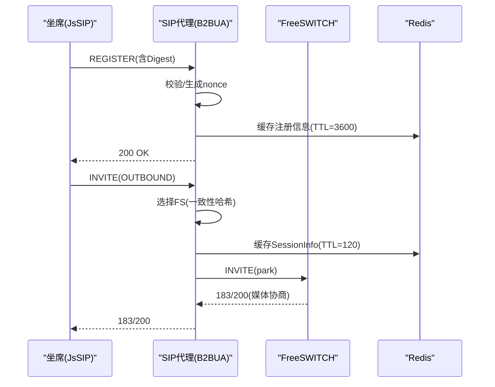
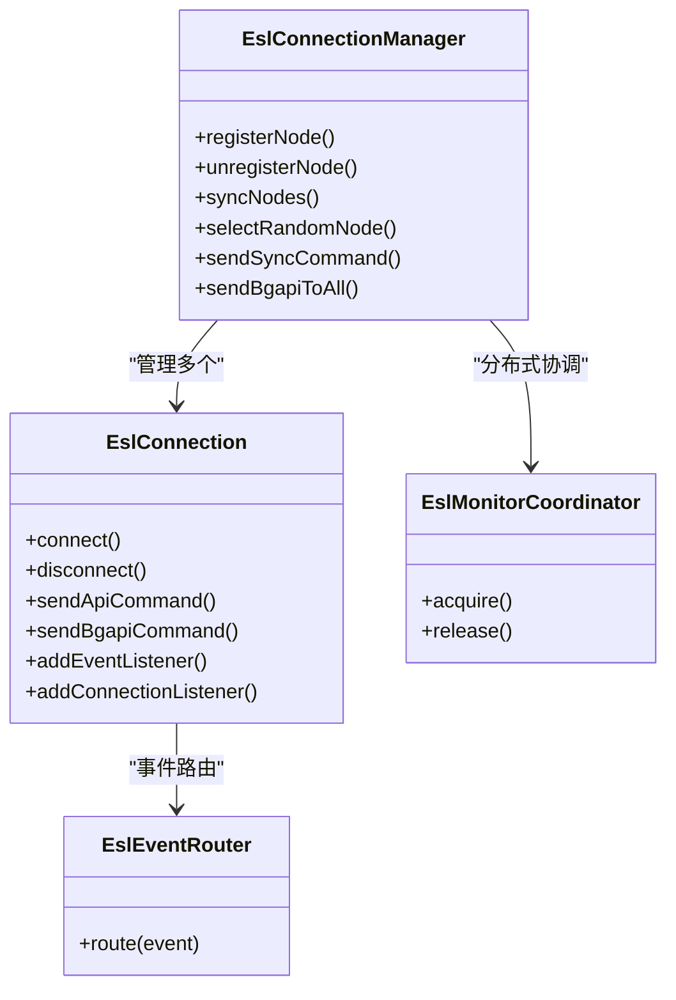
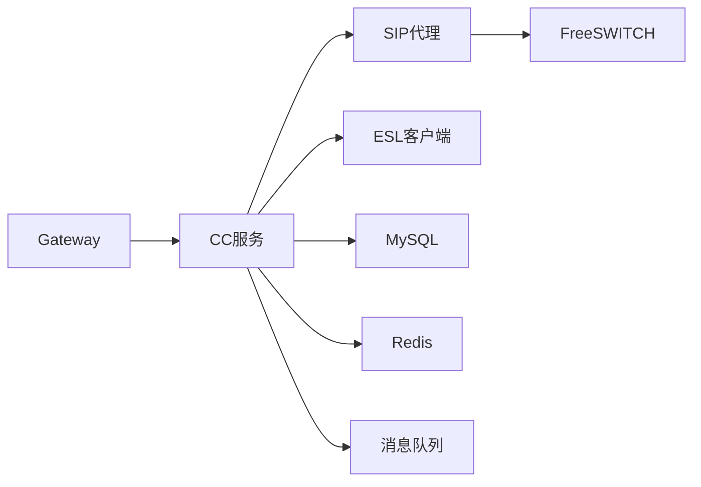
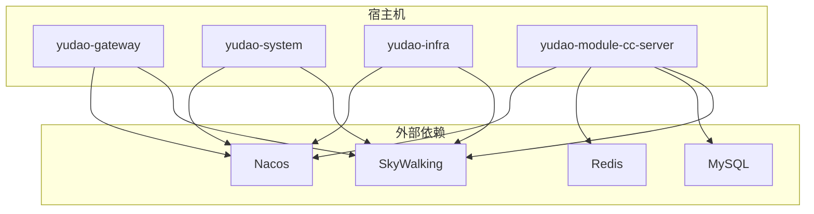

# 架构设计

<cite>
**本文引用的文件**
- [README.md](file://yudao-cloud/README.md)
- [docker-compose.yml](file://yudao-cloud/script/docker/docker-compose.yml)
- [sipproxy组件架构设计.md](file://yudao-cloud/yudao-module-cc/ipcc-sipproxy/sipproxy组件架构设计.md)
- [fs-esl-client组件架构设计.md](file://yudao-cloud/yudao-module-cc/ipcc-fs-esl/fs-esl-client组件架构设计.md)
- [CcConfig.java](file://yudao-cloud/yudao-module-cc/yudao-module-cc-server/src/main/java/cn/iocoder/yudao/module/cc/config/CcConfig.java)
</cite>

## 目录
1. [引言](#引言)
2. [项目结构](#项目结构)
3. [核心组件](#核心组件)
4. [架构总览](#架构总览)
5. [详细组件分析](#详细组件分析)
6. [依赖关系分析](#依赖关系分析)
7. [性能与可扩展性](#性能与可扩展性)
8. [安全、监控与灾难恢复](#安全监控与灾难恢复)
9. [部署拓扑与基础设施](#部署拓扑与基础设施)
10. [故障排查指南](#故障排查指南)
11. [结论](#结论)

## 引言
本架构设计文档面向IPCC呼叫中心系统，围绕微服务架构模式、SIP代理（B2BUA）架构、FreeSWITCH集成架构以及前后端分离架构进行系统化阐述。文档覆盖高层设计、组件边界、交互流程、数据流、技术选型与权衡、扩展性与部署拓扑，并补充安全性、可观测性与灾难恢复等横切关注点。

## 项目结构
整体采用“网关 + 微服务 + 业务模块”的分层组织：
- 网关层：Spring Cloud Gateway 统一入口，负责路由、鉴权、限流、链路追踪接入。
- 平台能力层：系统、基础设施、工作流、支付、报表等通用模块。
- 业务域层：呼叫中心（CC）、CRM、ERP、WMS、MES、IM、AI、IoT 等业务模块。
- 前端：Vue3管理后台，通过API网关访问后端服务。
- 通信面：SIP代理（B2BUA）与 FreeSWITCH ESL 客户端库作为独立子模块，支撑呼叫信令与控制面。

**图表来源**
- [docker-compose.yml:1-162](file://yudao-cloud/script/docker/docker-compose.yml#L1-L162)
- [README.md:327-379](file://yudao-cloud/README.md#L327-L379)

**章节来源**
- [README.md:39-64](file://yudao-cloud/README.md#L39-L64)
- [README.md:327-379](file://yudao-cloud/README.md#L327-L379)
- [docker-compose.yml:1-162](file://yudao-cloud/script/docker/docker-compose.yml#L1-L162)

## 核心组件
- SIP代理服务（B2BUA）：提供SIP注册、认证、会话管理、协议转换（UDP/TCP ↔ WebSocket）、集群广播与节点选择，承担呼叫信令转发与策略控制。
- FreeSWITCH ESL客户端：基于Netty 4.x重写的高性能ESL连接与事件路由，支持多节点管理、自动重连、健康检查、分布式监听权竞争与拦截器链。
- 呼叫中心业务服务：封装ESL命令、IVR流程编排、通话状态缓存、坐席状态管理、录音与TTS等。
- 网关与微服务：统一入口、鉴权、路由、限流、链路追踪；各业务模块按领域拆分，便于独立演进。
- 前端：Vue3管理后台，通过REST/WebSocket与后端交互。

**章节来源**
- [sipproxy组件架构设计.md:1-43](file://yudao-cloud/yudao-module-cc/ipcc-sipproxy/sipproxy组件架构设计.md#L1-L43)
- [fs-esl-client组件架构设计.md:1-46](file://yudao-cloud/yudao-module-cc/ipcc-fs-esl/fs-esl-client组件架构设计.md#L1-L46)
- [CcConfig.java:1-57](file://yudao-cloud/yudao-module-cc/yudao-module-cc-server/src/main/java/cn/iocoder/yudao/module/cc/config/CcConfig.java#L1-L57)

## 架构总览
系统采用“微服务 + B2BUA + ESL”的混合架构：
- 微服务层：以Spring Cloud Alibaba为基础，Nacos做注册与配置中心，Gateway为统一入口，SkyWalking实现链路追踪。
- 通信面：SIP代理作为B2BUA居中转发，FreeSWITCH负责媒体与IVR编排；ESL客户端用于控制面命令与事件处理。
- 数据面：MySQL持久化业务数据，Redis缓存会话与注册信息，消息队列用于异步解耦。
- 前端：Vue3管理后台，通过网关访问API。

**图表来源**
- [sipproxy组件架构设计.md:45-147](file://yudao-cloud/yudao-module-cc/ipcc-sipproxy/sipproxy组件架构设计.md#L45-L147)
- [fs-esl-client组件架构设计.md:114-191](file://yudao-cloud/yudao-module-cc/ipcc-fs-esl/fs-esl-client组件架构设计.md#L114-L191)
- [README.md:327-379](file://yudao-cloud/README.md#L327-L379)

## 详细组件分析

### SIP代理服务（B2BUA）
- 角色定位：B2BUA，维护两段独立对话，不依赖Record-Route留在信令路径，居中转发并改写Contact/Via头。
- 关键职责：坐席注册管理、Digest认证、请求路由、协议转换（WS↔UDP/TCP）、会话管理、集群广播、网关鉴权（407）。
- 分层架构：入口层→工厂层→处理器层→转发层→节点/会话管理层；辅以WebSocket接入层、集群广播层、扩展点API层。
- 核心数据结构：SessionInfo（Call-ID映射FS/第三方节点、callType、网关ID等），FsNodeInfo/GatewayInfo/AgentInfo模型。
- 请求处理：SIP请求经MessageSourceIdentifier识别来源后，按方法路由到具体处理器；INVITE/BYE/PRACK等分别处理；响应由UnifiedResponseHandler按策略表转发。
- 节点选择：一致性哈希保证同会话同一FS；ViaPort匹配确保回注场景锚定正确FS；备用节点故障转移。
- 会话与注册：Redis缓存SessionInfo与会话绑定节点，TTL=120s；注册信息TTL=3600s，避免WS存活但缓存过期。
- 集群广播：支持local/redis/kafka/rabbitmq/rocketmq五种发送器，按USER/SESSION/ALL目标分发。

**图表来源**
- [sipproxy组件架构设计.md:255-520](file://yudao-cloud/yudao-module-cc/ipcc-sipproxy/sipproxy组件架构设计.md#L255-L520)
- [sipproxy组件架构设计.md:184-252](file://yudao-cloud/yudao-module-cc/ipcc-sipproxy/sipproxy组件架构设计.md#L184-L252)

**章节来源**
- [sipproxy组件架构设计.md:1-43](file://yudao-cloud/yudao-module-cc/ipcc-sipproxy/sipproxy组件架构设计.md#L1-L43)
- [sipproxy组件架构设计.md:45-147](file://yudao-cloud/yudao-module-cc/ipcc-sipproxy/sipproxy组件架构设计.md#L45-L147)
- [sipproxy组件架构设计.md:255-520](file://yudao-cloud/yudao-module-cc/ipcc-sipproxy/sipproxy组件架构设计.md#L255-L520)

### FreeSWITCH ESL客户端
- 背景与目标：替代老旧第三方库，基于Netty 4.x重写，兼容JDK 17+与Spring Boot 3.x，提供高可用连接管理与事件路由。
- 分层架构：传输层（Netty Pipeline）→连接管理层（单连接/多节点）→事件路由层（注解驱动）→分布式协调层（Redis监听权竞争）→业务层（父程序）。
- 核心特性：自动重连（指数退避+抖动）、健康检查、事件拦截器链、指标监控、优雅关闭。
- 连接管理：EslConnection管理单个FS节点生命周期；EslConnectionManager管理多节点、批量操作、对账式同步与节点选择。
- 事件路由：@EslEventName注解扫描，通道一致性哈希保证同通道事件顺序；支持多处理器与拦截器链。
- 分布式协调：基于Redis的多实例监听权竞争，防止重复处理事件，支持切换回调。

**图表来源**
- [fs-esl-client组件架构设计.md:114-191](file://yudao-cloud/yudao-module-cc/ipcc-fs-esl/fs-esl-client组件架构设计.md#L114-L191)
- [fs-esl-client组件架构设计.md:489-800](file://yudao-cloud/yudao-module-cc/ipcc-fs-esl/fs-esl-client组件架构设计.md#L489-L800)

**章节来源**
- [fs-esl-client组件架构设计.md:1-46](file://yudao-cloud/yudao-module-cc/ipcc-fs-esl/fs-esl-client组件架构设计.md#L1-L46)
- [fs-esl-client组件架构设计.md:114-191](file://yudao-cloud/yudao-module-cc/ipcc-fs-esl/fs-esl-client组件架构设计.md#L114-L191)
- [fs-esl-client组件架构设计.md:489-800](file://yudao-cloud/yudao-module-cc/ipcc-fs-esl/fs-esl-client组件架构设计.md#L489-L800)

### 呼叫中心业务服务
- 职责：封装ESL命令、IVR流程编排、通话状态缓存、坐席状态管理、录音与TTS、XML-CURL事件策略等。
- 配置项：通过CcConfig读取Freeswitch相关配置（录音路径、编码、采样率、监听策略、分组、线程数、队列容量）。
- 与SIP代理集成：通过扩展点实现坐席/FS节点/网关查询、SDP处理、IP白名单、SIP限流、Digest认证、WS握手认证、认证回调、REFER ESL编排委托、链路追踪、自定义传输等。

**章节来源**
- [CcConfig.java:1-57](file://yudao-cloud/yudao-module-cc/yudao-module-cc-server/src/main/java/cn/iocoder/yudao/module/cc/config/CcConfig.java#L1-L57)
- [sipproxy组件架构设计.md:201-218](file://yudao-cloud/yudao-module-cc/ipcc-sipproxy/sipproxy组件架构设计.md#L201-L218)

### 前后端分离架构
- 前端：Vue3管理后台，模块化API调用，权限与路由在前端控制，通过网关访问后端。
- 后端：微服务按领域拆分，统一网关鉴权与路由，内部服务间通过RPC或HTTP调用。
- 实时通信：WebSocket用于坐席状态、通话事件推送与管理后台实时展示。

**章节来源**
- [README.md:39-64](file://yudao-cloud/README.md#L39-L64)
- [README.md:327-379](file://yudao-cloud/README.md#L327-L379)

## 依赖关系分析
- 微服务依赖：Gateway依赖各业务服务；业务服务依赖系统/基础设施服务；呼叫中心服务依赖SIP代理与ESL客户端。
- 外部依赖：Nacos（注册/配置）、Redis（会话/注册/分布式锁）、MySQL（业务数据）、消息队列（可选）、SkyWalking（链路追踪）。
- 通信面依赖：SIP代理依赖JAIN-SIP；ESL客户端依赖Netty 4.x；两者均与FreeSWITCH交互。

**图表来源**
- [docker-compose.yml:1-162](file://yudao-cloud/script/docker/docker-compose.yml#L1-L162)
- [README.md:327-379](file://yudao-cloud/README.md#L327-L379)

**章节来源**
- [README.md:327-379](file://yudao-cloud/README.md#L327-L379)
- [docker-compose.yml:1-162](file://yudao-cloud/script/docker/docker-compose.yml#L1-L162)

## 性能与可扩展性
- 性能优化：
  - SIP代理：WebSocket分片重组（1MB上限）、僵尸会话清理、标准头域改写减少往返、一致性哈希降低跨节点状态丢失。
  - ESL客户端：Netty 4.x高性能编解码、事件拦截器链、通道一致性哈希保证顺序、健康检查与自动重连。
  - 缓存：Redis缓存会话与注册信息，TTL合理设置避免频繁重建。
- 可扩展性：
  - 水平扩展：SIP代理与ESL客户端均可多实例部署，通过集群广播与Redis协调。
  - 节点选择：FS节点一致性哈希与备用节点故障转移，提升可用性。
  - 模块化：SIP代理与ESL客户端为独立模块，可通过扩展点替换实现，便于定制与演进。

[本节为通用指导，无需特定文件引用]

## 安全、监控与灾难恢复
- 安全：
  - SIP Digest认证与WS握手token认证，支持IP白名单与SIP限流。
  - 网关层统一鉴权与限流，敏感接口加密传输。
  - 407网关鉴权处理，支持qop=auth与stale重挑战。
- 监控：
  - SkyWalking链路追踪，Spring Boot Admin监控Java应用。
  - ESL客户端内置连接/命令/事件/线程池指标，支持Micrometer对接。
  - SIP代理日志与错误码，便于问题定位。
- 灾难恢复：
  - 自动重连与指数退避，健康检查失败触发重连。
  - 分布式监听权竞争避免重复处理，保障高可用。
  - Redis缓存TTL机制，会话与注册信息自动清理。

**章节来源**
- [sipproxy组件架构设计.md:201-218](file://yudao-cloud/yudao-module-cc/ipcc-sipproxy/sipproxy组件架构设计.md#L201-L218)
- [fs-esl-client组件架构设计.md:1-46](file://yudao-cloud/yudao-module-cc/ipcc-fs-esl/fs-esl-client组件架构设计.md#L1-L46)
- [README.md:327-379](file://yudao-cloud/README.md#L327-L379)

## 部署拓扑与基础设施
- 容器化部署：使用docker-compose编排网关与各业务服务，挂载日志与SkyWalking agent。
- 网络模式：host网络模式，简化端口映射，提升性能。
- 环境变量：配置时区、Nacos地址与命名空间、SkyWalking采集器地址等。
- 依赖服务：需准备Nacos、Redis、MySQL、可选消息队列与SkyWalking。

**图表来源**
- [docker-compose.yml:1-162](file://yudao-cloud/script/docker/docker-compose.yml#L1-L162)

**章节来源**
- [docker-compose.yml:1-162](file://yudao-cloud/script/docker/docker-compose.yml#L1-L162)

## 故障排查指南
- SIP代理常见问题：
  - 注册失败：检查Digest认证与扩展点实现，确认Redis缓存是否写入。
  - 呼叫无响应：检查FS节点选择与ViaPort匹配，确认SessionInfo缓存与TTL。
  - 407鉴权循环：检查GatewayAuthManager的canRetry逻辑与nonce更新。
- ESL客户端常见问题：
  - 连接断开：检查健康检查阈值与自动重连配置，确认Redis监听权竞争。
  - 事件乱序：确认通道一致性哈希与事件执行策略。
  - 命令超时：调整commandTimeoutSeconds与maxFrameSize。
- 网关与服务：
  - 路由失败：检查Nacos注册与配置，确认服务健康检查。
  - 链路追踪缺失：检查SkyWalking agent注入与环境变量配置。

**章节来源**
- [sipproxy组件架构设计.md:633-728](file://yudao-cloud/yudao-module-cc/ipcc-sipproxy/sipproxy组件架构设计.md#L633-L728)
- [fs-esl-client组件架构设计.md:153-179](file://yudao-cloud/yudao-module-cc/ipcc-fs-esl/fs-esl-client组件架构设计.md#L153-L179)
- [docker-compose.yml:1-162](file://yudao-cloud/script/docker/docker-compose.yml#L1-L162)

## 结论
本架构以微服务为基础，结合SIP代理（B2BUA）与FreeSWITCH ESL客户端，构建了高可用、可扩展、易演进的呼叫中心系统。通过标准化分层、扩展点机制与完善的监控与容错设计，满足复杂呼叫场景下的信令控制与媒体处理能力。建议在生产环境中充分评估资源与网络条件，合理配置TTL、线程池与健康检查参数，并结合SkyWalking与日志中心实现端到端可观测性。

[本节为总结性内容，无需特定文件引用]