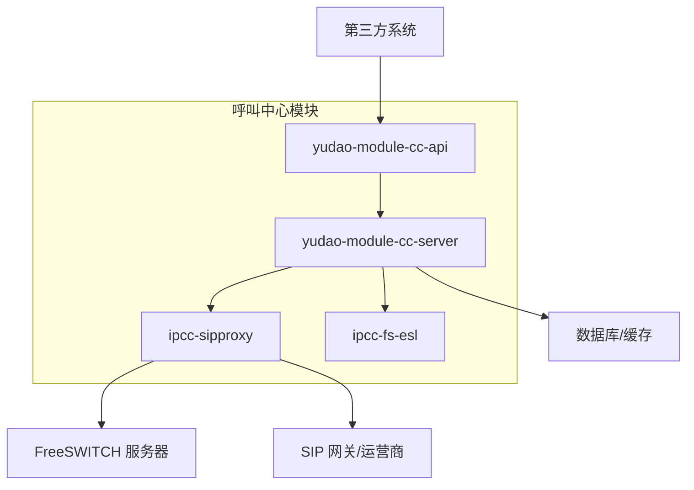
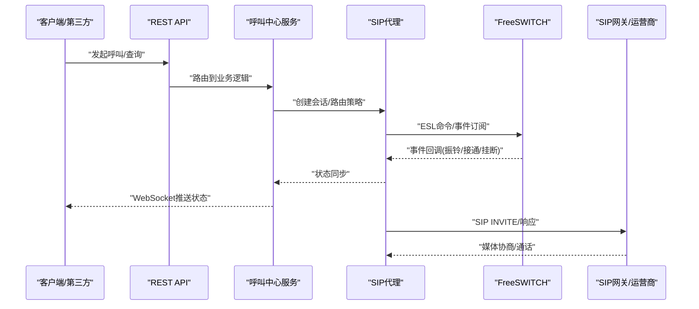
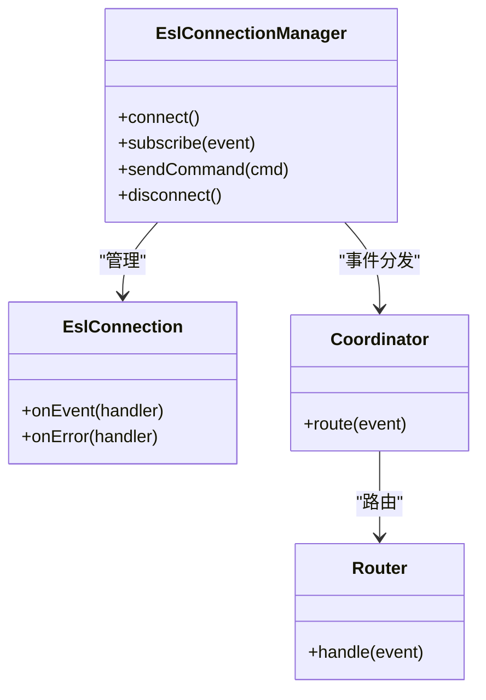
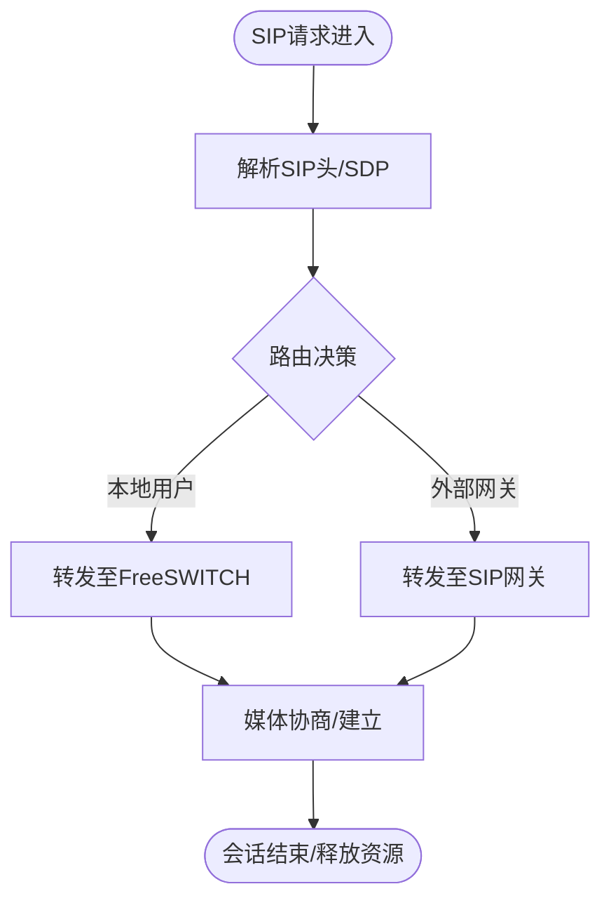
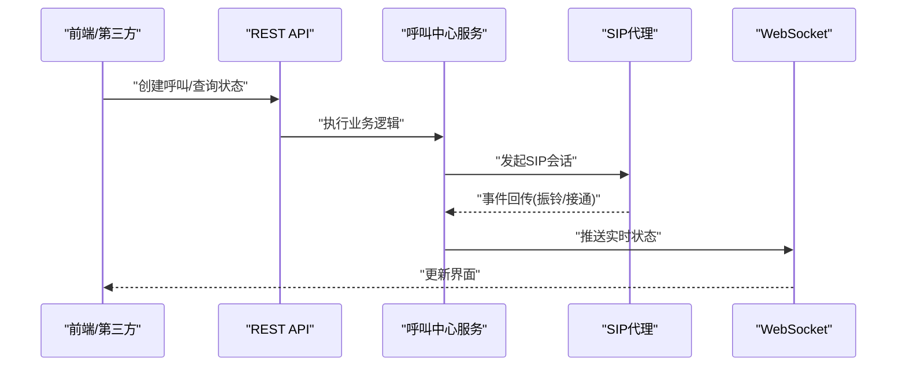
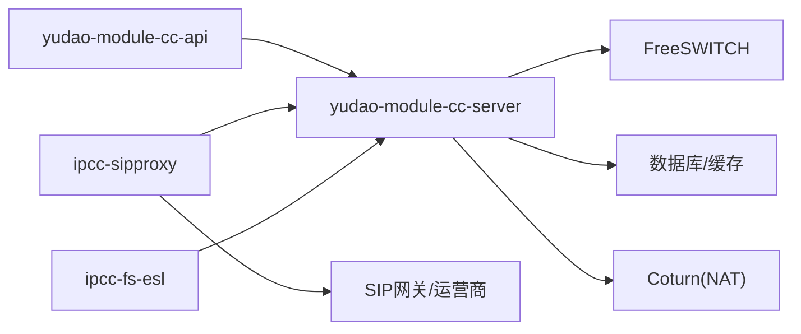

# 系统边界与集成

<cite>
**本文引用的文件**
- [README.md](file://README.md)
- [yudao-module-cc/pom.xml](file://yudao-cloud/yudao-module-cc/pom.xml)
- [ipcc-fs-esl/README.md](file://yudao-cloud/yudao-module-cc/ipcc-fs-esl/README.md)
- [ipcc-sipproxy/README.md](file://yudao-cloud/yudao-module-cc/ipcc-sipproxy/README.md)
- [yudao-module-cc-api/src/main/java/cn/iocoder/yudao/module/cc/enums/ApiConstants.java](file://yudao-cloud/yudao-module-cc/yudao-module-cc-api/src/main/java/cn/iocoder/yudao/module/cc/enums/ApiConstants.java)
- [yudao-module-cc-api/src/main/java/cn/iocoder/yudao/module/cc/enums/ErrorCodeConstants.java](file://yudao-cloud/yudao-module-cc/yudao-module-cc-api/src/main/java/cn/iocoder/yudao/module/cc/enums/ErrorCodeConstants.java)
- [doc/freeswitch服务/freeswitch部署脚本1.py](file://yudao-cloud/yudao-module-cc/doc/freeswitch服务/freeswitch部署脚本1.py)
- [doc/freeswitch服务/freeswitch部署脚本2-用于集群部署-修改了主要端口.py](file://yudao-cloud/yudao-module-cc/doc/freeswitch服务/freeswitch部署脚本2-用于集群部署-修改了主要端口.py)
- [doc/coturn服务/coturn安装和配置参考.md](file://yudao-cloud/yudao-module-cc/doc/coturn服务/coturn安装和配置参考.md)
- [doc/test-all/run_all_tests.py](file://yudao-cloud/yudao-module-cc/doc/test-all/run_all_tests.py)
- [doc/test-all/esl_helper.py](file://yudao-cloud/yudao-module-cc/doc/test-all/esl_helper.py)
- [doc/test-all/monitor_esl_fs1.py](file://yudao-cloud/yudao-module-cc/doc/test-all/monitor_esl_fs1.py)
- [doc/test-all/redis_helper.py](file://yudao-cloud/yudao-module-cc/doc/test-all/redis_helper.py)
</cite>

## 目录
1. [简介](#简介)
2. [项目结构](#项目结构)
3. [核心组件](#核心组件)
4. [架构总览](#架构总览)
5. [详细组件分析](#详细组件分析)
6. [依赖关系分析](#依赖关系分析)
7. [性能考虑](#性能考虑)
8. [故障排查指南](#故障排查指南)
9. [结论](#结论)
10. [附录](#附录)

## 简介
本文件面向IPCC呼叫中心系统的“系统边界与集成”，聚焦系统与外部组件的集成点，包括FreeSWITCH服务器、SIP网关、第三方系统等。文档明确系统边界定义、接口规范（RESTful API、WebSocket、SIP协议）、数据交换格式、集成模式、错误处理与安全考虑，并提供第三方对接指南、SDK使用说明、测试验证方法以及监控日志与运维支持建议。

## 项目结构
呼叫中心模块由以下子模块构成：
- yudao-module-cc-api：对外暴露的API常量与枚举定义，作为跨服务契约层
- yudao-module-cc-server：呼叫中心业务服务实现
- ipcc-sipproxy：SIP代理/网关能力，负责SIP信令路由、注册、媒体协商等
- ipcc-fs-esl：FreeSWITCH ESL客户端库，用于控制FS事件与执行命令

图表来源
- [yudao-module-cc/pom.xml:10-15](file://yudao-cloud/yudao-module-cc/pom.xml#L10-L15)

章节来源
- [yudao-module-cc/pom.xml:10-15](file://yudao-cloud/yudao-module-cc/pom.xml#L10-L15)

## 核心组件
- FreeSWITCH ESL客户端（ipcc-fs-esl）
  - 提供ESL连接管理、事件订阅、命令发送等能力，用于与FreeSWITCH进行控制面交互
  - 通过Netty实现高并发异步通信，具备连接协调、拦截器、指标采集等扩展点
- SIP代理（ipcc-sipproxy）
  - 提供SIP协议栈能力，支持注册、会话建立、路由、转发、NAT穿透等
  - 内置集群、默认配置、API扩展点，便于与上层业务集成
- 呼叫中心业务服务（yudao-module-cc-server）
  - 编排呼叫流程、IVR、坐席状态、录音、统计等业务逻辑
  - 通过RESTful API与前端/第三方系统集成；通过WebSocket推送实时状态
- API契约（yudao-module-cc-api）
  - 统一API常量、错误码、枚举，确保前后端与跨服务调用一致性

章节来源
- [ipcc-fs-esl/README.md](file://yudao-cloud/yudao-module-cc/ipcc-fs-esl/README.md)
- [ipcc-sipproxy/README.md](file://yudao-cloud/yudao-module-cc/ipcc-sipproxy/README.md)
- [yudao-module-cc-api/src/main/java/cn/iocoder/yudao/module/cc/enums/ApiConstants.java](file://yudao-cloud/yudao-module-cc/yudao-module-cc-api/src/main/java/cn/iocoder/yudao/module/cc/enums/ApiConstants.java)
- [yudao-module-cc-api/src/main/java/cn/iocoder/yudao/module/cc/enums/ErrorCodeConstants.java](file://yudao-cloud/yudao-module-cc/yudao-module-cc-api/src/main/java/cn/iocoder/yudao/module/cc/enums/ErrorCodeConstants.java)

## 架构总览
系统边界与集成要点：
- 内部边界
  - RESTful API：供Web前端与第三方系统调用，承载呼叫控制、查询、配置等能力
  - WebSocket：向浏览器或客户端推送通话状态、IVR事件、坐席状态等实时信息
  - 内部RPC/消息：与服务治理、配置中心、任务调度等基础设施协作
- 外部边界
  - FreeSWITCH：通过ESL控制面交互，驱动媒体会话、IVR、录音、转接等
  - SIP网关/运营商：通过SIP协议完成PSTN接入、号码路由、中继对接
  - 第三方系统：CRM、工单、知识库、AI语音等通过REST/WebSocket集成

图表来源
- [yudao-module-cc/pom.xml:10-15](file://yudao-cloud/yudao-module-cc/pom.xml#L10-L15)
- [ipcc-fs-esl/README.md](file://yudao-cloud/yudao-module-cc/ipcc-fs-esl/README.md)
- [ipcc-sipproxy/README.md](file://yudao-cloud/yudao-module-cc/ipcc-sipproxy/README.md)

## 详细组件分析

### FreeSWITCH ESL客户端（ipcc-fs-esl）
- 职责
  - 管理ESL连接池与重连
  - 订阅FS事件（如channel_event、DTMF、hangup）
  - 发送FS命令（如originate、playback、mixer）
- 关键设计
  - Netty异步I/O，提升吞吐与低延迟
  - 协调器与路由器解耦事件分发
  - 拦截器链支持鉴权、审计、限流
  - 指标采集便于监控告警
- 集成点
  - 与SIP代理配合，将SIP事件映射为FS控制指令
  - 与业务服务通过事件总线/回调机制联动

图表来源
- [ipcc-fs-esl/README.md](file://yudao-cloud/yudao-module-cc/ipcc-fs-esl/README.md)

章节来源
- [ipcc-fs-esl/README.md](file://yudao-cloud/yudao-module-cc/ipcc-fs-esl/README.md)

### SIP代理（ipcc-sipproxy）
- 职责
  - 处理SIP注册、INVITE、BYE等信令
  - 路由策略与负载均衡
  - NAT穿透与媒体协商（SDP）
  - 与FreeSWITCH协同完成媒体路径建立
- 关键设计
  - 可插拔API扩展点，便于接入业务规则
  - 集群模式支持水平扩展
  - 默认配置简化部署
- 集成点
  - 与运营商SIP网关对接，完成PSTN中继
  - 与业务服务通过REST/WebSocket同步会话状态

图表来源
- [ipcc-sipproxy/README.md](file://yudao-cloud/yudao-module-cc/ipcc-sipproxy/README.md)

章节来源
- [ipcc-sipproxy/README.md](file://yudao-cloud/yudao-module-cc/ipcc-sipproxy/README.md)

### 呼叫中心业务服务（yudao-module-cc-server）
- 职责
  - 编排呼叫流程（IVR、排队、转接、录音）
  - 管理坐席状态、技能组、路由策略
  - 提供RESTful API与WebSocket推送
- 集成模式
  - 与SIP代理：通过API创建/控制会话
  - 与FS ESL：通过事件订阅获取通话生命周期
  - 与第三方：通过REST/WebSocket进行数据同步与状态推送

图表来源
- [yudao-module-cc/pom.xml:10-15](file://yudao-cloud/yudao-module-cc/pom.xml#L10-L15)

章节来源
- [yudao-module-cc/pom.xml:10-15](file://yudao-cloud/yudao-module-cc/pom.xml#L10-L15)

### API契约与错误码（yudao-module-cc-api）
- 作用
  - 统一API常量、错误码、枚举，确保跨服务一致性与可维护性
- 使用方式
  - 服务端返回标准错误码，客户端据此做降级/重试/提示
  - 第三方集成时遵循相同契约，降低联调成本

章节来源
- [yudao-module-cc-api/src/main/java/cn/iocoder/yudao/module/cc/enums/ApiConstants.java](file://yudao-cloud/yudao-module-cc/yudao-module-cc-api/src/main/java/cn/iocoder/yudao/module/cc/enums/ApiConstants.java)
- [yudao-module-cc-api/src/main/java/cn/iocoder/yudao/module/cc/enums/ErrorCodeConstants.java](file://yudao-cloud/yudao-module-cc/yudao-module-cc-api/src/main/java/cn/iocoder/yudao/module/cc/enums/ErrorCodeConstants.java)

## 依赖关系分析
- 模块内依赖
  - server依赖api（契约）
  - server依赖sipproxy（SIP能力）
  - server依赖fs-esl（FS控制能力）
- 外部依赖
  - FreeSWITCH：通过ESL控制面交互
  - SIP网关/运营商：通过SIP协议对接
  - 数据库/缓存：持久化与状态共享
  - Coturn：NAT穿透辅助（可选）

图表来源
- [yudao-module-cc/pom.xml:10-15](file://yudao-cloud/yudao-module-cc/pom.xml#L10-L15)
- [doc/coturn服务/coturn安装和配置参考.md](file://yudao-cloud/yudao-module-cc/doc/coturn服务/coturn安装和配置参考.md)

章节来源
- [yudao-module-cc/pom.xml:10-15](file://yudao-cloud/yudao-module-cc/pom.xml#L10-L15)

## 性能考虑
- 连接与并发
  - ESL连接池与复用，避免频繁握手
  - SIP代理集群横向扩展，分担注册与会话压力
- 网络与NAT
  - 合理配置Coturn，减少媒体往返时延
  - SDP中正确声明公网地址与端口
- 资源与限流
  - 对高频API与事件进行限流与熔断
  - 监控CPU、内存、GC、线程池、队列长度
- 存储与缓存
  - 热点数据（坐席状态、路由策略）缓存加速
  - 异步落盘，避免阻塞主流程

[本节为通用性能建议，不直接分析具体文件]

## 故障排查指南
- 常见问题定位
  - SIP注册失败：检查SIP网关连通性、认证、端口与防火墙
  - 媒体不通：检查NAT/Coturn配置、SDP地址、端口映射
  - 事件丢失：检查ESL订阅是否成功、FS事件过滤是否正确
- 工具与脚本
  - 全场景测试套件：用于端到端验证呼叫流程
  - ESL事件监控：捕获并分析FS事件，定位问题阶段
  - Redis辅助：校验会话状态、路由策略缓存
- 建议步骤
  - 使用测试脚本复现问题，收集日志与抓包
  - 通过Redis查看中间状态，确认数据一致性
  - 结合FS日志与SIP代理日志，交叉比对时间线

章节来源
- [doc/test-all/run_all_tests.py](file://yudao-cloud/yudao-module-cc/doc/test-all/run_all_tests.py)
- [doc/test-all/esl_helper.py](file://yudao-cloud/yudao-module-cc/doc/test-all/esl_helper.py)
- [doc/test-all/monitor_esl_fs1.py](file://yudao-cloud/yudao-module-cc/doc/test-all/monitor_esl_fs1.py)
- [doc/test-all/redis_helper.py](file://yudao-cloud/yudao-module-cc/doc/test-all/redis_helper.py)

## 结论
本系统以SIP代理与FreeSWITCH为核心，通过ESL与控制面交互，结合RESTful API与WebSocket对外暴露能力，形成清晰的系统边界与集成点。通过统一的API契约与错误码、完善的测试与监控手段，保障第三方对接与生产稳定性。建议在部署阶段重视NAT与防火墙配置，在运行期强化监控与日志采集，持续优化性能与可靠性。

## 附录

### 第三方系统对接指南
- 集成方式
  - RESTful API：用于呼叫控制、查询、配置管理
  - WebSocket：用于实时状态推送（通话状态、IVR事件、坐席状态）
  - SIP协议：如需直连SIP网关，需遵循SIP代理的注册与路由策略
- 数据交换格式
  - JSON：API请求/响应体
  - SIP/SDP：SIP信令与媒体协商
- 安全考虑
  - 使用HTTPS与鉴权（Token/证书）
  - 限制来源IP白名单
  - 敏感字段加密传输
- 对接步骤
  - 申请API密钥与权限
  - 配置回调URL（WebSocket/HTTP）
  - 联调测试（使用测试套件）
  - 灰度上线与监控

[本节为通用对接指导，不直接分析具体文件]

### SDK使用说明
- ESL客户端（ipcc-fs-esl）
  - 初始化连接参数（主机、端口、密码）
  - 订阅事件与发送命令
  - 处理异常与重连
- SIP代理（ipcc-sipproxy）
  - 配置SIP域、中继、NAT
  - 注册与路由策略
  - 监控指标与日志级别

章节来源
- [ipcc-fs-esl/README.md](file://yudao-cloud/yudao-module-cc/ipcc-fs-esl/README.md)
- [ipcc-sipproxy/README.md](file://yudao-cloud/yudao-module-cc/ipcc-sipproxy/README.md)

### 测试验证方法
- 全场景测试
  - 使用run_all_tests.py执行端到端用例
  - 结合esl_helper与monitor_esl_fs1.py抓取事件与日志
  - 通过redis_helper校验状态一致性
- 回归与冒烟
  - 覆盖注册、呼叫、转接、挂机、录音等关键路径
  - 模拟异常（网络抖动、FS重启、网关不可达）

章节来源
- [doc/test-all/run_all_tests.py](file://yudao-cloud/yudao-module-cc/doc/test-all/run_all_tests.py)
- [doc/test-all/esl_helper.py](file://yudao-cloud/yudao-module-cc/doc/test-all/esl_helper.py)
- [doc/test-all/monitor_esl_fs1.py](file://yudao-cloud/yudao-module-cc/doc/test-all/monitor_esl_fs1.py)
- [doc/test-all/redis_helper.py](file://yudao-cloud/yudao-module-cc/doc/test-all/redis_helper.py)

### 部署与集成参考
- FreeSWITCH部署
  - 单机与集群部署脚本，注意端口与NAT配置
- Coturn配置
  - 参考安装与配置文档，确保媒体穿透
- 环境准备
  - 数据库、缓存、消息队列、网关连通性

章节来源
- [doc/freeswitch服务/freeswitch部署脚本1.py](file://yudao-cloud/yudao-module-cc/doc/freeswitch服务/freeswitch部署脚本1.py)
- [doc/freeswitch服务/freeswitch部署脚本2-用于集群部署-修改了主要端口.py](file://yudao-cloud/yudao-module-cc/doc/freeswitch服务/freeswitch部署脚本2-用于集群部署-修改了主要端口.py)
- [doc/coturn服务/coturn安装和配置参考.md](file://yudao-cloud/yudao-module-cc/doc/coturn服务/coturn安装和配置参考.md)

### 监控与日志
- 监控指标
  - 系统资源（CPU、内存、磁盘、网络）
  - 应用指标（QPS、延迟、错误率、线程池、队列）
  - 业务指标（呼叫成功率、平均通话时长、IVR转化率）
- 日志采集
  - 统一日志格式与分级
  - 集中式日志平台（ELK/ Loki）
  - 关键链路追踪（TraceID）
- 告警策略
  - 阈值告警与异常模式识别
  - 多通道通知（短信、邮件、IM）

[本节为通用运维建议，不直接分析具体文件]