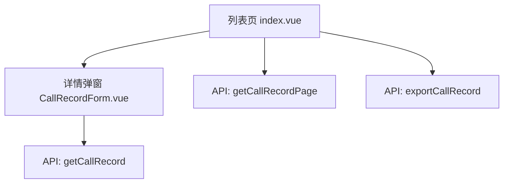
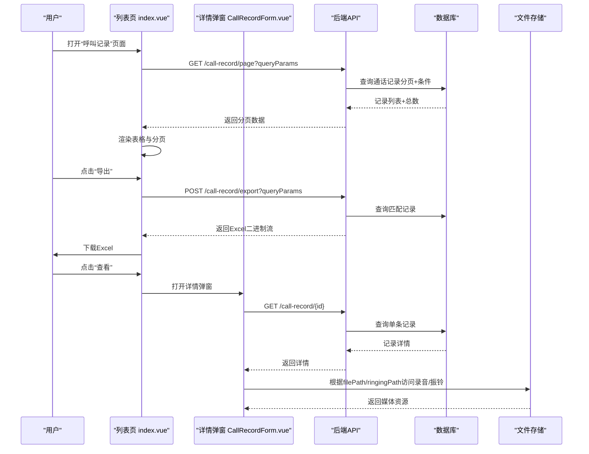
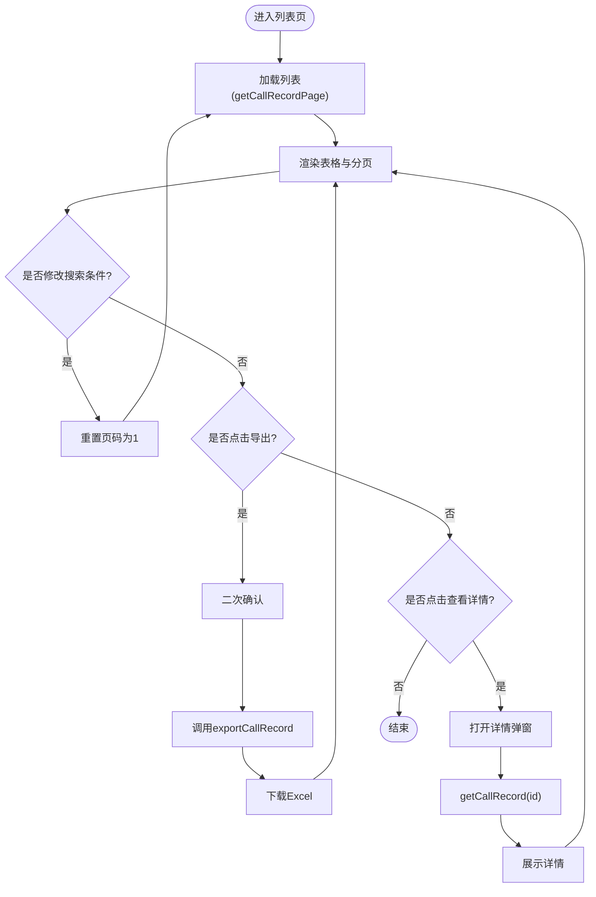
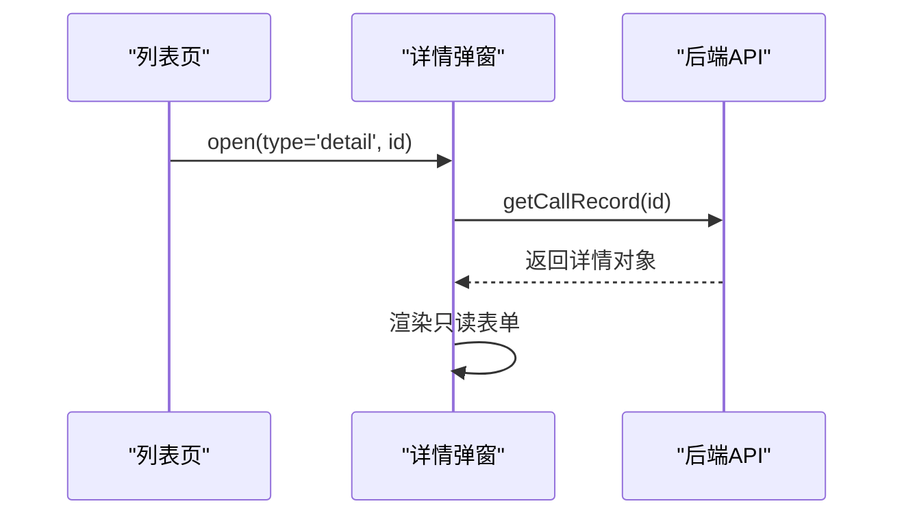

# 呼叫记录管理

<cite>
**本文引用的文件**
- [yudao-ui-admin-vue3/src/views/cc/callrecord/index.vue](file://yudao-ui-admin-vue3/src/views/cc/callrecord/index.vue)
- [yudao-ui-admin-vue3/src/views/cc/callrecord/CallRecordForm.vue](file://yudao-ui-admin-vue3/src/views/cc/callrecord/CallRecordForm.vue)
</cite>

## 目录
1. [简介](#简介)
2. [项目结构](#项目结构)
3. [核心组件](#核心组件)
4. [架构总览](#架构总览)
5. [详细组件分析](#详细组件分析)
6. [依赖分析](#依赖分析)
7. [性能考虑](#性能考虑)
8. [故障排查指南](#故障排查指南)
9. [结论](#结论)
10. [附录](#附录)

## 简介
本模块为呼叫中心系统的“呼叫记录管理”能力，提供通话记录的查询、详情查看与批量导出等前端功能。通过时间范围、主被叫号码、坐席、状态等多维条件筛选，支持分页浏览与Excel导出；详情页展示录音与振铃文件路径，便于后续下载或审计。该文档聚焦于现有前端实现，梳理数据流、接口调用与业务逻辑，并给出在大数据量场景下的优化建议与常见问题解决方案。

## 项目结构
呼叫记录相关的前端页面位于 cc 模块下：
- 列表页：负责搜索表单、分页表格、导出按钮与分页控件联动
- 详情弹窗：只读展示单条通话记录的完整字段（含录音与振铃文件地址）

图表来源
- [yudao-ui-admin-vue3/src/views/cc/callrecord/index.vue:1-268](file://yudao-ui-admin-vue3/src/views/cc/callrecord/index.vue#L1-L268)
- [yudao-ui-admin-vue3/src/views/cc/callrecord/CallRecordForm.vue:1-181](file://yudao-ui-admin-vue3/src/views/cc/callrecord/CallRecordForm.vue#L1-L181)

章节来源
- [yudao-ui-admin-vue3/src/views/cc/callrecord/index.vue:1-268](file://yudao-ui-admin-vue3/src/views/cc/callrecord/index.vue#L1-L268)
- [yudao-ui-admin-vue3/src/views/cc/callrecord/CallRecordForm.vue:1-181](file://yudao-ui-admin-vue3/src/views/cc/callrecord/CallRecordForm.vue#L1-L181)

## 核心组件
- 列表页（index.vue）
  - 搜索条件：呼叫唯一ID、主叫/被叫号码、号码归属地、坐席信息、呼叫状态、方向、应答标识、挂机原因、时间范围（开始/结束）、录音/振铃路径等
  - 分页：pageNo/pageSize 与后端分页参数对齐
  - 导出：触发二次确认后调用导出接口，下载 Excel
  - 权限：导出与查看具备权限控制标记
- 详情弹窗（CallRecordForm.vue）
  - 只读展示：包含通话关键时间点（开始/结束/接通/振铃）、状态与方向字典渲染、录音与振铃文件地址等

章节来源
- [yudao-ui-admin-vue3/src/views/cc/callrecord/index.vue:1-268](file://yudao-ui-admin-vue3/src/views/cc/callrecord/index.vue#L1-L268)
- [yudao-ui-admin-vue3/src/views/cc/callrecord/CallRecordForm.vue:1-181](file://yudao-ui-admin-vue3/src/views/cc/callrecord/CallRecordForm.vue#L1-L181)

## 架构总览
从用户操作到数据返回的端到端流程如下：

图表来源
- [yudao-ui-admin-vue3/src/views/cc/callrecord/index.vue:1-268](file://yudao-ui-admin-vue3/src/views/cc/callrecord/index.vue#L1-L268)
- [yudao-ui-admin-vue3/src/views/cc/callrecord/CallRecordForm.vue:1-181](file://yudao-ui-admin-vue3/src/views/cc/callrecord/CallRecordForm.vue#L1-L181)

## 详细组件分析

### 列表页（index.vue）
- 搜索与筛选
  - 支持按呼叫唯一ID、主叫/被叫号码、号码归属地、坐席ID/号码/名称、呼叫状态、方向、应答标识、挂机原因、时间范围等组合筛选
  - 时间范围使用日期区间选择器，提交时以数组形式传递
- 分页
  - 使用统一的分页组件，绑定 pageNo 与 pageSize，触发 getList 重新拉取数据
- 导出
  - 点击导出前进行二次确认，成功后调用导出接口并下载Excel
- 权限
  - 导出与查看按钮带有权限指令，确保仅授权用户可操作

图表来源
- [yudao-ui-admin-vue3/src/views/cc/callrecord/index.vue:1-268](file://yudao-ui-admin-vue3/src/views/cc/callrecord/index.vue#L1-L268)

章节来源
- [yudao-ui-admin-vue3/src/views/cc/callrecord/index.vue:1-268](file://yudao-ui-admin-vue3/src/views/cc/callrecord/index.vue#L1-L268)

### 详情弹窗（CallRecordForm.vue）
- 只读展示通话关键信息与媒体文件路径
- 通过 getCallRecord(id) 获取单条记录详情
- 使用字典标签渲染枚举字段（如状态、方向、应答标识等）

图表来源
- [yudao-ui-admin-vue3/src/views/cc/callrecord/CallRecordForm.vue:1-181](file://yudao-ui-admin-vue3/src/views/cc/callrecord/CallRecordForm.vue#L1-L181)

章节来源
- [yudao-ui-admin-vue3/src/views/cc/callrecord/CallRecordForm.vue:1-181](file://yudao-ui-admin-vue3/src/views/cc/callrecord/CallRecordForm.vue#L1-L181)

## 依赖分析
- 列表页依赖
  - 分页组件：用于分页控件与页码双向绑定
  - 字典系统：用于状态、方向、应答标识等枚举字段的显示
  - 下载工具：用于导出Excel后的文件下载
  - API模块：CallRecordApi 暴露分页、详情、导出等方法
- 详情弹窗依赖
  - 对话框组件：用于弹窗容器
  - 字典系统：用于枚举字段渲染
  - API模块：CallRecordApi.getCallRecord

章节来源
- [yudao-ui-admin-vue3/src/views/cc/callrecord/index.vue:1-268](file://yudao-ui-admin-vue3/src/views/cc/callrecord/index.vue#L1-L268)
- [yudao-ui-admin-vue3/src/views/cc/callrecord/CallRecordForm.vue:1-181](file://yudao-ui-admin-vue3/src/views/cc/callrecord/CallRecordForm.vue#L1-L181)

## 性能考虑
- 大数据量分页查询
  - 合理设置 pageSize，避免单次返回过多数据导致前端渲染卡顿
  - 对高频查询字段（如 callStartTime、callEndTime、callerNumber、calleeNumber、agentNumber）在后端建立索引，提升查询效率
- 导出性能
  - 导出时应限制最大导出条数或使用异步任务+通知下载的方式，避免阻塞请求
  - 对导出SQL增加必要索引与过滤条件，减少扫描行数
- 录音与振铃文件
  - filePath/ringingPath 建议使用对象存储直链或CDN加速，减少应用服务器压力
  - 大文件播放建议采用分片或流式传输，避免一次性加载
- 缓存策略
  - 对热点统计或常用筛选结果可引入短期缓存（如Redis），降低数据库压力
- 并发与限流
  - 对导出与批量查询接口增加限流与熔断保护，防止雪崩

[本节为通用性能建议，不直接分析具体文件]

## 故障排查指南
- 列表无数据或为空
  - 检查搜索条件是否过严（如时间范围、号码段）
  - 检查分页参数 pageNo/pageSize 是否正确
  - 核对后端接口是否返回空集合或错误码
- 导出失败或文件损坏
  - 检查导出接口返回是否为有效二进制流
  - 确认网络与浏览器下载行为是否正常
  - 检查后端是否有导出大小限制或超时配置
- 录音/振铃无法播放
  - 校验 filePath/ringingPath 是否可访问（权限、跨域、CDN配置）
  - 检查文件格式与编码是否受浏览器支持
- 权限问题
  - 确认当前用户是否拥有对应权限（导出、查看）
  - 检查路由与按钮级权限指令是否生效

章节来源
- [yudao-ui-admin-vue3/src/views/cc/callrecord/index.vue:1-268](file://yudao-ui-admin-vue3/src/views/cc/callrecord/index.vue#L1-L268)
- [yudao-ui-admin-vue3/src/views/cc/callrecord/CallRecordForm.vue:1-181](file://yudao-ui-admin-vue3/src/views/cc/callrecord/CallRecordForm.vue#L1-L181)

## 结论
当前呼叫记录管理在前端实现了完整的查询、详情查看与导出能力，覆盖通话记录的核心使用场景。结合合理的后端索引、导出策略与媒体文件托管方案，可在大数据量与高并发环境下保持稳定与高效。建议在后续迭代中补充更多统计分析维度（如坐席维度、号码段分析）与更灵活的筛选条件，以提升运营与质检效率。

[本节为总结性内容，不直接分析具体文件]

## 附录

### API 设计参考（基于前端调用）
- 分页查询
  - 方法：GET
  - 路径：/call-record/page
  - 参数：pageNo、pageSize、callId、callerNumber、calleeNumber、numberLocation、agentId、agentNumber、agentName、callState、direction、answerFlag、hangupDir、hangupCauseCode、callStartTime[]、callEndTime[]、answerTime[]、ringingTime[]、filePath、ringingPath
  - 返回：{ list, total }
- 详情查询
  - 方法：GET
  - 路径：/call-record/{id}
  - 返回：通话记录详情对象（含 filePath、ringingPath 等）
- 批量导出
  - 方法：POST
  - 路径：/call-record/export
  - 参数：同分页查询参数
  - 返回：Excel 二进制流

章节来源
- [yudao-ui-admin-vue3/src/views/cc/callrecord/index.vue:1-268](file://yudao-ui-admin-vue3/src/views/cc/callrecord/index.vue#L1-L268)
- [yudao-ui-admin-vue3/src/views/cc/callrecord/CallRecordForm.vue:1-181](file://yudao-ui-admin-vue3/src/views/cc/callrecord/CallRecordForm.vue#L1-L181)

### 使用示例
- 时间范围查询
  - 在“呼叫开始时间/呼叫结束时间”选择起止日期，点击“搜索”，系统将按所选时间范围过滤通话记录
- 坐席维度统计（前端展示）
  - 在列表中按“坐席号码/坐席名称”筛选，可快速定位某坐席的通话记录；如需聚合统计，可在后端扩展统计接口
- 号码段分析（前端展示）
  - 通过“主叫号码/被叫号码”输入前缀或精确值进行筛选，便于分析特定号段的使用情况

章节来源
- [yudao-ui-admin-vue3/src/views/cc/callrecord/index.vue:1-268](file://yudao-ui-admin-vue3/src/views/cc/callrecord/index.vue#L1-L268)