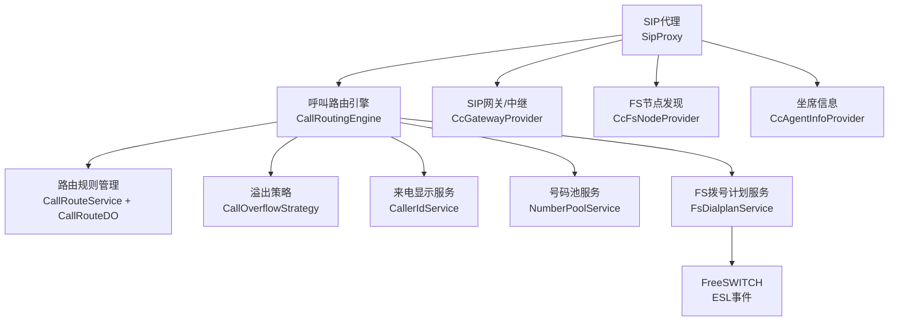
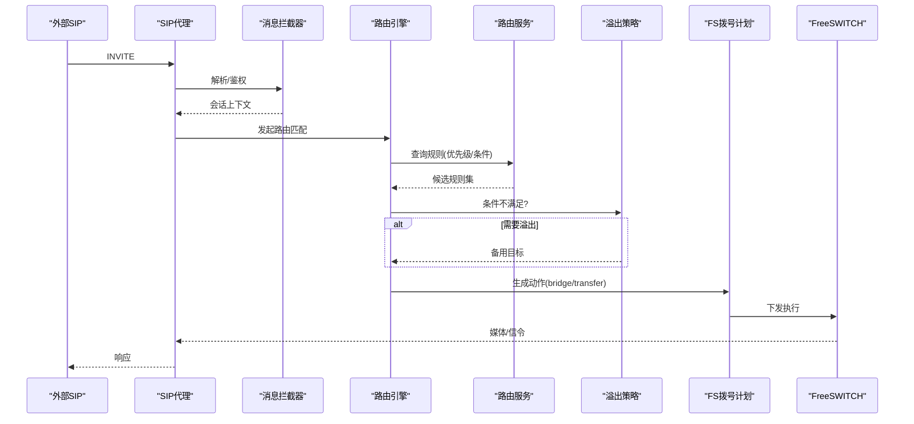
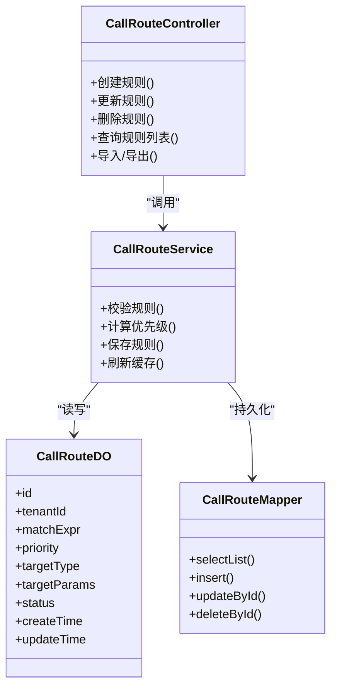
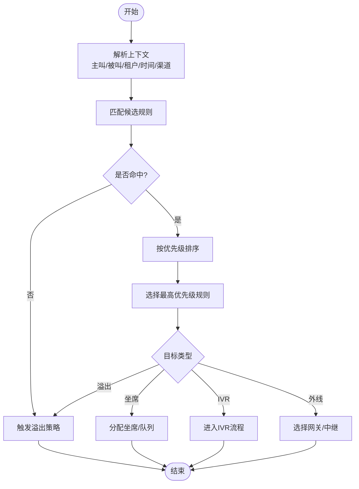
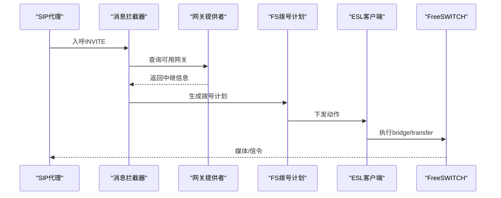
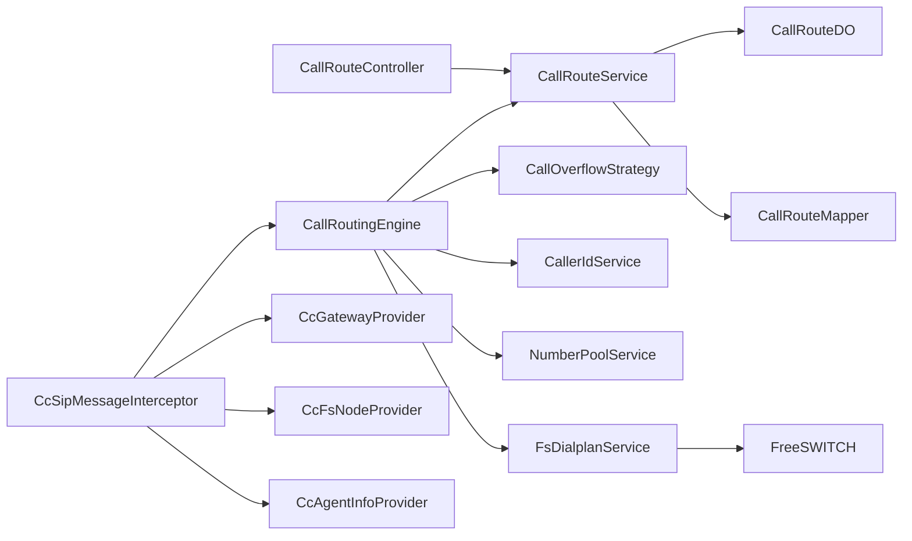

# 呼叫路由管理

<cite>
**本文引用的文件**
- [yudao-module-cc-server/src/main/java/cn/iocoder/yudao/module/cc/controller/admin/call/CallRouteController.java](file://yudao-cloud/yudao-module-cc/yudao-module-cc-server/src/main/java/cn/iocoder/yudao/module/cc/controller/admin/call/CallRouteController.java)
- [yudao-module-cc-server/src/main/java/cn/iocoder/yudao/module/cc/service/call/CallRouteService.java](file://yudao-cloud/yudao-module-cc/yudao-module-cc-server/src/main/java/cn/iocoder/yudao/module/cc/service/call/CallRouteService.java)
- [yudao-module-cc-server/src/main/java/cn/iocoder/yudao/module/cc/dal/dataobject/call/CallRouteDO.java](file://yudao-cloud/yudao-module-cc/yudao-module-cc-server/src/main/java/cn/iocoder/yudao/module/cc/dal/dataobject/call/CallRouteDO.java)
- [yudao-module-cc-server/src/main/java/cn/iocoder/yudao/module/cc/dal/mysql/call/CallRouteMapper.java](file://yudao-cloud/yudao-module-cc/yudao-module-cc-server/src/main/java/cn/iocoder/yudao/module/cc/dal/mysql/call/CallRouteMapper.java)
- [yudao-module-cc-server/src/main/java/cn/iocoder/yudao/module/cc/enums/CallRouteStatusEnum.java](file://yudao-cloud/yudao-module-cc/yudao-module-cc-api/src/main/java/cn/iocoder/yudao/module/cc/enums/CallRouteStatusEnum.java)
- [yudao-module-cc-server/src/main/java/cn/iocoder/yudao/module/cc/config/CcConfig.java](file://yudao-cloud/yudao-module-cc/yudao-module-cc-server/src/main/java/cn/iocoder/yudao/module/cc/config/CcConfig.java)
- [yudao-module-cc-server/src/main/java/cn/iocoder/yudao/module/cc/esl/handler/inbound/InboundCallHandler.java](file://yudao-cloud/yudao-module-cc/yudao-module-cc-server/src/main/java/cn/iocoder/yudao/module/cc/esl/handler/inbound/InboundCallHandler.java)
- [yudao-module-cc-server/src/main/java/cn/iocoder/yudao/module/cc/esl/handler/outbound/OutboundCallHandler.java](file://yudao-cloud/yudao-module-cc/yudao-module-cc-server/src/main/java/cn/iocoder/yudao/module/cc/esl/handler/outbound/OutboundCallHandler.java)
- [yudao-module-cc-server/src/main/java/cn/iocoder/yudao/module/cc/service/fs/FsDialplanService.java](file://yudao-cloud/yudao-module-cc/yudao-module-cc-server/src/main/java/cn/iocoder/yudao/module/cc/service/fs/FsDialplanService.java)
- [yudao-module-cc-server/src/main/java/cn/iocoder/yudao/module/cc/sipproxy/integration/CcSipMessageInterceptor.java](file://yudao-cloud/yudao-module-cc/yudao-module-cc-server/src/main/java/cn/iocoder/yudao/module/cc/sipproxy/integration/CcSipMessageInterceptor.java)
- [yudao-module-cc-server/src/main/java/cn/iocoder/yudao/module/cc/sipproxy/integration/CcGatewayProvider.java](file://yudao-cloud/yudao-module-cc/yudao-module-cc-server/src/main/java/cn/iocoder/yudao/module/cc/sipproxy/integration/CcGatewayProvider.java)
- [yudao-module-cc-server/src/main/java/cn/iocoder/yudao/module/cc/sipproxy/integration/CcFsNodeProvider.java](file://yudao-cloud/yudao-module-cc/yudao-module-cc-server/src/main/java/cn/iocoder/yudao/module/cc/sipproxy/integration/CcFsNodeProvider.java)
- [yudao-module-cc-server/src/main/java/cn/iocoder/yudao/module/cc/sipproxy/integration/CcAgentInfoProvider.java](file://yudao-cloud/yudao-module-cc/yudao-module-cc-server/src/main/java/cn/iocoder/yudao/module/cc/sipproxy/integration/CcAgentInfoProvider.java)
- [yudao-module-cc-server/src/main/java/cn/iocoder/yudao/module/cc/esl/client/FsClient.java](file://yudao-cloud/yudao-module-cc/yudao-module-cc-server/src/main/java/cn/iocoder/yudao/module/cc/esl/client/FsClient.java)
- [yudao-module-cc-server/src/main/java/cn/iocoder/yudao/module/cc/service/call/CallRoutingEngine.java](file://yudao-cloud/yudao-module-cc/yudao-module-cc-server/src/main/java/cn/iocoder/yudao/module/cc/service/call/CallRoutingEngine.java)
- [yudao-module-cc-server/src/main/java/cn/iocoder/yudao/module/cc/service/call/CallOverflowStrategy.java](file://yudao-cloud/yudao-module-cc/yudao-module-cc-server/src/main/java/cn/iocoder/yudao/module/cc/service/call/CallOverflowStrategy.java)
- [yudao-module-cc-server/src/main/java/cn/iocoder/yudao/module/cc/service/call/CallerIdService.java](file://yudao-cloud/yudao-module-cc/yudao-module-cc-server/src/main/java/cn/iocoder/yudao/module/cc/service/call/CallerIdService.java)
- [yudao-module-cc-server/src/main/java/cn/iocoder/yudao/module/cc/service/call/NumberPoolService.java](file://yudao-cloud/yudao-module-cc/yudao-module-cc-server/src/main/java/cn/iocoder/yudao/module/cc/service/call/NumberPoolService.java)
- [yudao-module-cc-server/src/main/java/cn/iocoder/yudao/module/cc/service/call/CallTestService.java](file://yudao-cloud/yudao-module-cc/yudao-module-cc-server/src/main/java/cn/iocoder/yudao/module/cc/service/call/CallTestService.java)
</cite>

## 目录
1. [简介](#简介)
2. [项目结构](#项目结构)
3. [核心组件](#核心组件)
4. [架构总览](#架构总览)
5. [详细组件分析](#详细组件分析)
6. [依赖关系分析](#依赖关系分析)
7. [性能考虑](#性能考虑)
8. [故障排查指南](#故障排查指南)
9. [结论](#结论)
10. [附录](#附录)

## 简介
本文件面向呼叫路由管理系统，聚焦号码路由规则配置、路由优先级设置、溢出策略、来电显示配置、号码池管理、路由匹配算法与跳转逻辑、CRUD接口、动态路由配置、实时路由测试等能力。同时说明与SIP代理（sipproxy）和FreeSWITCH拨号计划的集成方式，并给出复杂场景（工作时间、节假日、VIP优先）的配置示例与常见问题解决方案。

## 项目结构
呼叫中心模块位于 yudao-module-cc，包含：
- 业务服务层：call、fs、flow、sys 等服务
- ESL 事件处理：inbound/outbound 呼叫事件处理器
- SIP代理集成：网关、节点、坐席信息提供器与消息拦截器
- 数据访问层：MySQL 映射与Redis键常量
- 配置与枚举：系统配置、路由状态枚举等

图表来源
- [yudao-module-cc-server/src/main/java/cn/iocoder/yudao/module/cc/service/call/CallRoutingEngine.java](file://yudao-cloud/yudao-module-cc/yudao-module-cc-server/src/main/java/cn/iocoder/yudao/module/cc/service/call/CallRoutingEngine.java)
- [yudao-module-cc-server/src/main/java/cn/iocoder/yudao/module/cc/service/call/CallRouteService.java](file://yudao-cloud/yudao-module-cc/yudao-module-cc-server/src/main/java/cn/iocoder/yudao/module/cc/service/call/CallRouteService.java)
- [yudao-module-cc-server/src/main/java/cn/iocoder/yudao/module/cc/service/fs/FsDialplanService.java](file://yudao-cloud/yudao-module-cc/yudao-module-cc-server/src/main/java/cn/iocoder/yudao/module/cc/service/fs/FsDialplanService.java)
- [yudao-module-cc-server/src/main/java/cn/iocoder/yudao/module/cc/sipproxy/integration/CcGatewayProvider.java](file://yudao-cloud/yudao-module-cc/yudao-module-cc-server/src/main/java/cn/iocoder/yudao/module/cc/sipproxy/integration/CcGatewayProvider.java)
- [yudao-module-cc-server/src/main/java/cn/iocoder/yudao/module/cc/sipproxy/integration/CcFsNodeProvider.java](file://yudao-cloud/yudao-module-cc/yudao-module-cc-server/src/main/java/cn/iocoder/yudao/module/cc/sipproxy/integration/CcFsNodeProvider.java)
- [yudao-module-cc-server/src/main/java/cn/iocoder/yudao/module/cc/sipproxy/integration/CcAgentInfoProvider.java](file://yudao-cloud/yudao-module-cc/yudao-module-cc-server/src/main/java/cn/iocoder/yudao/module/cc/sipproxy/integration/CcAgentInfoProvider.java)

章节来源
- [yudao-module-cc-server/src/main/java/cn/iocoder/yudao/module/cc/controller/admin/call/CallRouteController.java](file://yudao-cloud/yudao-module-cc/yudao-module-cc-server/src/main/java/cn/iocoder/yudao/module/cc/controller/admin/call/CallRouteController.java)
- [yudao-module-cc-server/src/main/java/cn/iocoder/yudao/module/cc/service/call/CallRouteService.java](file://yudao-cloud/yudao-module-cc/yudao-module-cc-server/src/main/java/cn/iocoder/yudao/module/cc/service/call/CallRouteService.java)
- [yudao-module-cc-server/src/main/java/cn/iocoder/yudao/module/cc/dal/dataobject/call/CallRouteDO.java](file://yudao-cloud/yudao-module-cc/yudao-module-cc-server/src/main/java/cn/iocoder/yudao/module/cc/dal/dataobject/call/CallRouteDO.java)
- [yudao-module-cc-server/src/main/java/cn/iocoder/yudao/module/cc/dal/mysql/call/CallRouteMapper.java](file://yudao-cloud/yudao-module-cc/yudao-module-cc-server/src/main/java/cn/iocoder/yudao/module/cc/dal/mysql/call/CallRouteMapper.java)
- [yudao-module-cc-server/src/main/java/cn/iocoder/yudao/module/cc/enums/CallRouteStatusEnum.java](file://yudao-cloud/yudao-module-cc/yudao-module-cc-api/src/main/java/cn/iocoder/yudao/module/cc/enums/CallRouteStatusEnum.java)

## 核心组件
- 路由规则管理：通过控制器暴露CRUD接口，服务层负责规则校验、排序、持久化与缓存更新。
- 路由匹配与跳转：基于入呼事件触发匹配引擎，按优先级与条件选择目标（坐席、IVR、外线、溢出）。
- 溢出策略：在容量或条件不满足时，按策略切换到备用路由（如转语音信箱、排队、其他中继）。
- 来电显示：根据主叫、被叫、租户、时间窗口等生成或改写主叫ID。
- 号码池：维护可用作主叫/被叫的号码资源，支持分配、回收与配额控制。
- FS拨号计划：将最终路由决策转换为FS动作（bridge、transfer、hangup等），并通过ESL下发。
- SIP代理集成：通过网关提供者、节点提供者、坐席提供者与消息拦截器完成会话建立、鉴权与转发。

章节来源
- [yudao-module-cc-server/src/main/java/cn/iocoder/yudao/module/cc/controller/admin/call/CallRouteController.java](file://yudao-cloud/yudao-module-cc/yudao-module-cc-server/src/main/java/cn/iocoder/yudao/module/cc/controller/admin/call/CallRouteController.java)
- [yudao-module-cc-server/src/main/java/cn/iocoder/yudao/module/cc/service/call/CallRouteService.java](file://yudao-cloud/yudao-module-cc/yudao-module-cc-server/src/main/java/cn/iocoder/yudao/module/cc/service/call/CallRouteService.java)
- [yudao-module-cc-server/src/main/java/cn/iocoder/yudao/module/cc/service/call/CallRoutingEngine.java](file://yudao-cloud/yudao-module-cc/yudao-module-cc-server/src/main/java/cn/iocoder/yudao/module/cc/service/call/CallRoutingEngine.java)
- [yudao-module-cc-server/src/main/java/cn/iocoder/yudao/module/cc/service/call/CallOverflowStrategy.java](file://yudao-cloud/yudao-module-cc/yudao-module-cc-server/src/main/java/cn/iocoder/yudao/module/cc/service/call/CallOverflowStrategy.java)
- [yudao-module-cc-server/src/main/java/cn/iocoder/yudao/module/cc/service/call/CallerIdService.java](file://yudao-cloud/yudao-module-cc/yudao-module-cc-server/src/main/java/cn/iocoder/yudao/module/cc/service/call/CallerIdService.java)
- [yudao-module-cc-server/src/main/java/cn/iocoder/yudao/module/cc/service/call/NumberPoolService.java](file://yudao-cloud/yudao-module-cc/yudao-module-cc-server/src/main/java/cn/iocoder/yudao/module/cc/service/call/NumberPoolService.java)
- [yudao-module-cc-server/src/main/java/cn/iocoder/yudao/module/cc/service/fs/FsDialplanService.java](file://yudao-cloud/yudao-module-cc/yudao-module-cc-server/src/main/java/cn/iocoder/yudao/module/cc/service/fs/FsDialplanService.java)

## 架构总览
呼叫从SIP代理进入，经拦截器进行鉴权与会话上下文构建；随后由路由引擎依据规则匹配与优先级计算得出目标，必要时调用溢出策略；最终通过FS拨号计划执行桥接或转移，并在ESL事件中回写状态。

图表来源
- [yudao-module-cc-server/src/main/java/cn/iocoder/yudao/module/cc/sipproxy/integration/CcSipMessageInterceptor.java](file://yudao-cloud/yudao-module-cc/yudao-module-cc-server/src/main/java/cn/iocoder/yudao/module/cc/sipproxy/integration/CcSipMessageInterceptor.java)
- [yudao-module-cc-server/src/main/java/cn/iocoder/yudao/module/cc/service/call/CallRoutingEngine.java](file://yudao-cloud/yudao-module-cc/yudao-module-cc-server/src/main/java/cn/iocoder/yudao/module/cc/service/call/CallRoutingEngine.java)
- [yudao-module-cc-server/src/main/java/cn/iocoder/yudao/module/cc/service/call/CallRouteService.java](file://yudao-cloud/yudao-module-cc/yudao-module-cc-server/src/main/java/cn/iocoder/yudao/module/cc/service/call/CallRouteService.java)
- [yudao-module-cc-server/src/main/java/cn/iocoder/yudao/module/cc/service/call/CallOverflowStrategy.java](file://yudao-cloud/yudao-module-cc/yudao-module-cc-server/src/main/java/cn/iocoder/yudao/module/cc/service/call/CallOverflowStrategy.java)
- [yudao-module-cc-server/src/main/java/cn/iocoder/yudao/module/cc/service/fs/FsDialplanService.java](file://yudao-cloud/yudao-module-cc/yudao-module-cc-server/src/main/java/cn/iocoder/yudao/module/cc/service/fs/FsDialplanService.java)

## 详细组件分析

### 路由规则CRUD与数据模型
- 控制器提供路由规则的增删改查与批量操作，参数包含匹配条件、优先级、目标类型与参数、启用状态等。
- 服务层负责规则校验（冲突检测、优先级连续性）、排序、持久化与缓存刷新。
- 数据对象定义规则字段，映射器负责SQL查询与分页。

图表来源
- [yudao-module-cc-server/src/main/java/cn/iocoder/yudao/module/cc/controller/admin/call/CallRouteController.java](file://yudao-cloud/yudao-module-cc/yudao-module-cc-server/src/main/java/cn/iocoder/yudao/module/cc/controller/admin/call/CallRouteController.java)
- [yudao-module-cc-server/src/main/java/cn/iocoder/yudao/module/cc/service/call/CallRouteService.java](file://yudao-cloud/yudao-module-cc/yudao-module-cc-server/src/main/java/cn/iocoder/yudao/module/cc/service/call/CallRouteService.java)
- [yudao-module-cc-server/src/main/java/cn/iocoder/yudao/module/cc/dal/dataobject/call/CallRouteDO.java](file://yudao-cloud/yudao-module-cc/yudao-module-cc-server/src/main/java/cn/iocoder/yudao/module/cc/dal/dataobject/call/CallRouteDO.java)
- [yudao-module-cc-server/src/main/java/cn/iocoder/yudao/module/cc/dal/mysql/call/CallRouteMapper.java](file://yudao-cloud/yudao-module-cc/yudao-module-cc-server/src/main/java/cn/iocoder/yudao/module/cc/dal/mysql/call/CallRouteMapper.java)

章节来源
- [yudao-module-cc-server/src/main/java/cn/iocoder/yudao/module/cc/controller/admin/call/CallRouteController.java](file://yudao-cloud/yudao-module-cc/yudao-module-cc-server/src/main/java/cn/iocoder/yudao/module/cc/controller/admin/call/CallRouteController.java)
- [yudao-module-cc-server/src/main/java/cn/iocoder/yudao/module/cc/service/call/CallRouteService.java](file://yudao-cloud/yudao-module-cc/yudao-module-cc-server/src/main/java/cn/iocoder/yudao/module/cc/service/call/CallRouteService.java)
- [yudao-module-cc-server/src/main/java/cn/iocoder/yudao/module/cc/dal/dataobject/call/CallRouteDO.java](file://yudao-cloud/yudao-module-cc/yudao-module-cc-server/src/main/java/cn/iocoder/yudao/module/cc/dal/dataobject/call/CallRouteDO.java)
- [yudao-module-cc-server/src/main/java/cn/iocoder/yudao/module/cc/dal/mysql/call/CallRouteMapper.java](file://yudao-cloud/yudao-module-cc/yudao-module-cc-server/src/main/java/cn/iocoder/yudao/module/cc/dal/mysql/call/CallRouteMapper.java)
- [yudao-module-cc-server/src/main/java/cn/iocoder/yudao/module/cc/enums/CallRouteStatusEnum.java](file://yudao-cloud/yudao-module-cc/yudao-module-cc-api/src/main/java/cn/iocoder/yudao/module/cc/enums/CallRouteStatusEnum.java)

### 路由匹配算法与跳转逻辑
- 匹配阶段：提取主叫、被叫、时间、租户、渠道等上下文，按表达式匹配候选规则。
- 优先级阶段：同组内按优先级降序比较，确保高优先命中。
- 跳转阶段：根据目标类型决定后续动作（坐席、IVR、外线、溢出），必要时改写主叫或选择号码池号码。

图表来源
- [yudao-module-cc-server/src/main/java/cn/iocoder/yudao/module/cc/service/call/CallRoutingEngine.java](file://yudao-cloud/yudao-module-cc/yudao-module-cc-server/src/main/java/cn/iocoder/yudao/module/cc/service/call/CallRoutingEngine.java)
- [yudao-module-cc-server/src/main/java/cn/iocoder/yudao/module/cc/service/call/CallRouteService.java](file://yudao-cloud/yudao-module-cc/yudao-module-cc-server/src/main/java/cn/iocoder/yudao/module/cc/service/call/CallRouteService.java)
- [yudao-module-cc-server/src/main/java/cn/iocoder/yudao/module/cc/service/call/CallOverflowStrategy.java](file://yudao-cloud/yudao-module-cc/yudao-module-cc-server/src/main/java/cn/iocoder/yudao/module/cc/service/call/CallOverflowStrategy.java)

章节来源
- [yudao-module-cc-server/src/main/java/cn/iocoder/yudao/module/cc/service/call/CallRoutingEngine.java](file://yudao-cloud/yudao-module-cc/yudao-module-cc-server/src/main/java/cn/iocoder/yudao/module/cc/service/call/CallRoutingEngine.java)
- [yudao-module-cc-server/src/main/java/cn/iocoder/yudao/module/cc/service/call/CallRouteService.java](file://yudao-cloud/yudao-module-cc/yudao-module-cc-server/src/main/java/cn/iocoder/yudao/module/cc/service/call/CallRouteService.java)
- [yudao-module-cc-server/src/main/java/cn/iocoder/yudao/module/cc/service/call/CallOverflowStrategy.java](file://yudao-cloud/yudao-module-cc/yudao-module-cc-server/src/main/java/cn/iocoder/yudao/module/cc/service/call/CallOverflowStrategy.java)

### 溢出策略
- 触发条件：无可用坐席、规则不匹配、网关不可用、超时等。
- 策略类型：转语音信箱、排队等待、转其他中继、转IVR、挂断等。
- 实现要点：策略可插拔，支持按租户/渠道/时间段切换；记录审计日志以便回溯。

章节来源
- [yudao-module-cc-server/src/main/java/cn/iocoder/yudao/module/cc/service/call/CallOverflowStrategy.java](file://yudao-cloud/yudao-module-cc/yudao-module-cc-server/src/main/java/cn/iocoder/yudao/module/cc/service/call/CallOverflowStrategy.java)

### 来电显示配置
- 规则来源：主叫掩码、被叫前缀、租户策略、时间窗口、渠道标识。
- 改写时机：在路由匹配后、出站前进行主叫重写，确保合规与品牌一致性。
- 校验：避免非法格式、重复覆盖、跨租户泄露。

章节来源
- [yudao-module-cc-server/src/main/java/cn/iocoder/yudao/module/cc/service/call/CallerIdService.java](file://yudao-cloud/yudao-module-cc/yudao-module-cc-server/src/main/java/cn/iocoder/yudao/module/cc/service/call/CallerIdService.java)

### 号码池管理
- 功能：号码注册、分配、回收、配额限制、黑名单、健康检查。
- 使用场景：出站主叫选择、被叫替换、多租户隔离。
- 并发：采用原子操作与锁机制保证号码唯一性。

章节来源
- [yudao-module-cc-server/src/main/java/cn/iocoder/yudao/module/cc/service/call/NumberPoolService.java](file://yudao-cloud/yudao-module-cc/yudao-module-cc-server/src/main/java/cn/iocoder/yudao/module/cc/service/call/NumberPoolService.java)

### 与SIP代理和FreeSWITCH的集成
- SIP代理集成：通过网关提供者获取出站中继，节点提供者发现FS节点，坐席提供者提供在线坐席信息；消息拦截器完成鉴权与会话上下文注入。
- FreeSWITCH集成：通过FS拨号计划服务生成动作，经由ESL客户端下发；入呼/出呼事件由对应处理器消费，驱动状态同步与路由回调。

图表来源
- [yudao-module-cc-server/src/main/java/cn/iocoder/yudao/module/cc/sipproxy/integration/CcSipMessageInterceptor.java](file://yudao-cloud/yudao-module-cc/yudao-module-cc-server/src/main/java/cn/iocoder/yudao/module/cc/sipproxy/integration/CcSipMessageInterceptor.java)
- [yudao-module-cc-server/src/main/java/cn/iocoder/yudao/module/cc/sipproxy/integration/CcGatewayProvider.java](file://yudao-cloud/yudao-module-cc/yudao-module-cc-server/src/main/java/cn/iocoder/yudao/module/cc/sipproxy/integration/CcGatewayProvider.java)
- [yudao-module-cc-server/src/main/java/cn/iocoder/yudao/module/cc/sipproxy/integration/CcFsNodeProvider.java](file://yudao-cloud/yudao-module-cc/yudao-module-cc-server/src/main/java/cn/iocoder/yudao/module/cc/sipproxy/integration/CcFsNodeProvider.java)
- [yudao-module-cc-server/src/main/java/cn/iocoder/yudao/module/cc/service/fs/FsDialplanService.java](file://yudao-cloud/yudao-module-cc/yudao-module-cc-server/src/main/java/cn/iocoder/yudao/module/cc/service/fs/FsDialplanService.java)
- [yudao-module-cc-server/src/main/java/cn/iocoder/yudao/module/cc/esl/client/FsClient.java](file://yudao-cloud/yudao-module-cc/yudao-module-cc-server/src/main/java/cn/iocoder/yudao/module/cc/esl/client/FsClient.java)

章节来源
- [yudao-module-cc-server/src/main/java/cn/iocoder/yudao/module/cc/sipproxy/integration/CcSipMessageInterceptor.java](file://yudao-cloud/yudao-module-cc/yudao-module-cc-server/src/main/java/cn/iocoder/yudao/module/cc/sipproxy/integration/CcSipMessageInterceptor.java)
- [yudao-module-cc-server/src/main/java/cn/iocoder/yudao/module/cc/sipproxy/integration/CcGatewayProvider.java](file://yudao-cloud/yudao-module-cc/yudao-module-cc-server/src/main/java/cn/iocoder/yudao/module/cc/sipproxy/integration/CcGatewayProvider.java)
- [yudao-module-cc-server/src/main/java/cn/iocoder/yudao/module/cc/sipproxy/integration/CcFsNodeProvider.java](file://yudao-cloud/yudao-module-cc/yudao-module-cc-server/src/main/java/cn/iocoder/yudao/module/cc/sipproxy/integration/CcFsNodeProvider.java)
- [yudao-module-cc-server/src/main/java/cn/iocoder/yudao/module/cc/service/fs/FsDialplanService.java](file://yudao-cloud/yudao-module-cc/yudao-module-cc-server/src/main/java/cn/iocoder/yudao/module/cc/service/fs/FsDialplanService.java)
- [yudao-module-cc-server/src/main/java/cn/iocoder/yudao/module/cc/esl/client/FsClient.java](file://yudao-cloud/yudao-module-cc/yudao-module-cc-server/src/main/java/cn/iocoder/yudao/module/cc/esl/client/FsClient.java)

### 入呼/出呼事件处理
- 入呼处理器：接收FS事件，构造上下文，触发路由匹配与溢出策略，写入通话记录。
- 出呼处理器：发起出站呼叫，绑定路由结果，监听状态变化，处理失败重试与告警。

章节来源
- [yudao-module-cc-server/src/main/java/cn/iocoder/yudao/module/cc/esl/handler/inbound/InboundCallHandler.java](file://yudao-cloud/yudao-module-cc/yudao-module-cc-server/src/main/java/cn/iocoder/yudao/module/cc/esl/handler/inbound/InboundCallHandler.java)
- [yudao-module-cc-server/src/main/java/cn/iocoder/yudao/module/cc/esl/handler/outbound/OutboundCallHandler.java](file://yudao-cloud/yudao-module-cc/yudao-module-cc-server/src/main/java/cn/iocoder/yudao/module/cc/esl/handler/outbound/OutboundCallHandler.java)

### 动态路由配置与实时测试
- 动态配置：支持热更新路由规则与优先级，无需重启服务；变更事件广播至各节点。
- 实时测试：提供测试接口，输入主叫/被叫/时间等上下文，返回匹配路径、命中规则与下一步动作，便于验证与排障。

章节来源
- [yudao-module-cc-server/src/main/java/cn/iocoder/yudao/module/cc/service/call/CallTestService.java](file://yudao-cloud/yudao-module-cc/yudao-module-cc-server/src/main/java/cn/iocoder/yudao/module/cc/service/call/CallTestService.java)

### 复杂路由场景配置示例
- 工作时间路由：在工作时段内，优先匹配内部坐席或技能组；非工作时段转入IVR或语音信箱。
- 节假日路由：识别法定节假日与调休，将呼入转至值班表或外包团队。
- VIP客户优先：对特定主叫或标签进行快速通道，直连专属坐席或优先排队。

章节来源
- [yudao-module-cc-server/src/main/java/cn/iocoder/yudao/module/cc/service/call/CallRouteService.java](file://yudao-cloud/yudao-module-cc/yudao-module-cc-server/src/main/java/cn/iocoder/yudao/module/cc/service/call/CallRouteService.java)
- [yudao-module-cc-server/src/main/java/cn/iocoder/yudao/module/cc/config/CcConfig.java](file://yudao-cloud/yudao-module-cc/yudao-module-cc-server/src/main/java/cn/iocoder/yudao/module/cc/config/CcConfig.java)

## 依赖关系分析
- 控制器依赖服务层，服务层依赖数据访问与外部组件（FS、SIP代理）。
- 路由引擎聚合规则服务、溢出策略、来电显示与号码池服务。
- SIP代理集成通过提供者模式解耦网关、节点、坐席信息源。

图表来源
- [yudao-module-cc-server/src/main/java/cn/iocoder/yudao/module/cc/controller/admin/call/CallRouteController.java](file://yudao-cloud/yudao-module-cc/yudao-module-cc-server/src/main/java/cn/iocoder/yudao/module/cc/controller/admin/call/CallRouteController.java)
- [yudao-module-cc-server/src/main/java/cn/iocoder/yudao/module/cc/service/call/CallRouteService.java](file://yudao-cloud/yudao-module-cc/yudao-module-cc-server/src/main/java/cn/iocoder/yudao/module/cc/service/call/CallRouteService.java)
- [yudao-module-cc-server/src/main/java/cn/iocoder/yudao/module/cc/service/call/CallRoutingEngine.java](file://yudao-cloud/yudao-module-cc/yudao-module-cc-server/src/main/java/cn/iocoder/yudao/module/cc/service/call/CallRoutingEngine.java)
- [yudao-module-cc-server/src/main/java/cn/iocoder/yudao/module/cc/service/call/CallOverflowStrategy.java](file://yudao-cloud/yudao-module-cc/yudao-module-cc-server/src/main/java/cn/iocoder/yudao/module/cc/service/call/CallOverflowStrategy.java)
- [yudao-module-cc-server/src/main/java/cn/iocoder/yudao/module/cc/service/call/CallerIdService.java](file://yudao-cloud/yudao-module-cc/yudao-module-cc-server/src/main/java/cn/iocoder/yudao/module/cc/service/call/CallerIdService.java)
- [yudao-module-cc-server/src/main/java/cn/iocoder/yudao/module/cc/service/call/NumberPoolService.java](file://yudao-cloud/yudao-module-cc/yudao-module-cc-server/src/main/java/cn/iocoder/yudao/module/cc/service/call/NumberPoolService.java)
- [yudao-module-cc-server/src/main/java/cn/iocoder/yudao/module/cc/service/fs/FsDialplanService.java](file://yudao-cloud/yudao-module-cc/yudao-module-cc-server/src/main/java/cn/iocoder/yudao/module/cc/service/fs/FsDialplanService.java)
- [yudao-module-cc-server/src/main/java/cn/iocoder/yudao/module/cc/sipproxy/integration/CcSipMessageInterceptor.java](file://yudao-cloud/yudao-module-cc/yudao-module-cc-server/src/main/java/cn/iocoder/yudao/module/cc/sipproxy/integration/CcSipMessageInterceptor.java)
- [yudao-module-cc-server/src/main/java/cn/iocoder/yudao/module/cc/sipproxy/integration/CcGatewayProvider.java](file://yudao-cloud/yudao-module-cc/yudao-module-cc-server/src/main/java/cn/iocoder/yudao/module/cc/sipproxy/integration/CcGatewayProvider.java)
- [yudao-module-cc-server/src/main/java/cn/iocoder/yudao/module/cc/sipproxy/integration/CcFsNodeProvider.java](file://yudao-cloud/yudao-module-cc/yudao-module-cc-server/src/main/java/cn/iocoder/yudao/module/cc/sipproxy/integration/CcFsNodeProvider.java)
- [yudao-module-cc-server/src/main/java/cn/iocoder/yudao/module/cc/sipproxy/integration/CcAgentInfoProvider.java](file://yudao-cloud/yudao-module-cc/yudao-module-cc-server/src/main/java/cn/iocoder/yudao/module/cc/sipproxy/integration/CcAgentInfoProvider.java)

## 性能考虑
- 规则匹配优化：索引主叫/被叫前缀、租户、时间范围；热点规则缓存。
- 优先级计算：预排序与分组，减少每次请求的计算开销。
- 溢出策略：异步评估与降级，避免阻塞主路径。
- FS交互：批量下发与连接池复用，降低ESL延迟。
- 监控与限流：关键指标埋点，异常路径快速熔断。

[本节为通用指导，不直接分析具体文件]

## 故障排查指南
- 路由冲突：检查规则表达式重叠与优先级顺序，使用测试接口回放定位命中路径。
- 路由死循环：确保跳转目标不包含自身，加入最大跳转深度保护。
- 主叫显示异常：核对来电显示改写规则与号码池配额，检查出站网关允许的主叫格式。
- FS执行失败：查看ESL事件日志与FS错误码，确认桥接地址与媒体协商。
- 溢出未生效：确认溢出策略配置与触发条件，检查网关/坐席可用性。

章节来源
- [yudao-module-cc-server/src/main/java/cn/iocoder/yudao/module/cc/service/call/CallTestService.java](file://yudao-cloud/yudao-module-cc/yudao-module-cc-server/src/main/java/cn/iocoder/yudao/module/cc/service/call/CallTestService.java)
- [yudao-module-cc-server/src/main/java/cn/iocoder/yudao/module/cc/esl/handler/inbound/InboundCallHandler.java](file://yudao-cloud/yudao-module-cc/yudao-module-cc-server/src/main/java/cn/iocoder/yudao/module/cc/esl/handler/inbound/InboundCallHandler.java)
- [yudao-module-cc-server/src/main/java/cn/iocoder/yudao/module/cc/esl/handler/outbound/OutboundCallHandler.java](file://yudao-cloud/yudao-module-cc/yudao-module-cc-server/src/main/java/cn/iocoder/yudao/module/cc/esl/handler/outbound/OutboundCallHandler.java)
- [yudao-module-cc-server/src/main/java/cn/iocoder/yudao/module/cc/service/fs/FsDialplanService.java](file://yudao-cloud/yudao-module-cc/yudao-module-cc-server/src/main/java/cn/iocoder/yudao/module/cc/service/fs/FsDialplanService.java)

## 结论
本系统以“规则+优先级+溢出”为核心，结合来电显示与号码池管理，实现了灵活、可扩展的呼叫路由能力。通过SIP代理与FreeSWITCH的深度集成，保证了高吞吐与低延迟。建议在生产环境完善监控告警、压测与灰度发布流程，持续优化匹配与溢出策略。

[本节为总结，不直接分析具体文件]

## 附录
- 术语：路由规则、优先级、溢出策略、来电显示、号码池、SIP代理、FreeSWITCH、ESL、拨号计划。
- 参考：相关控制器、服务、数据对象与枚举的定义位置见“本文引用的文件”。

[本节为补充说明，不直接分析具体文件]