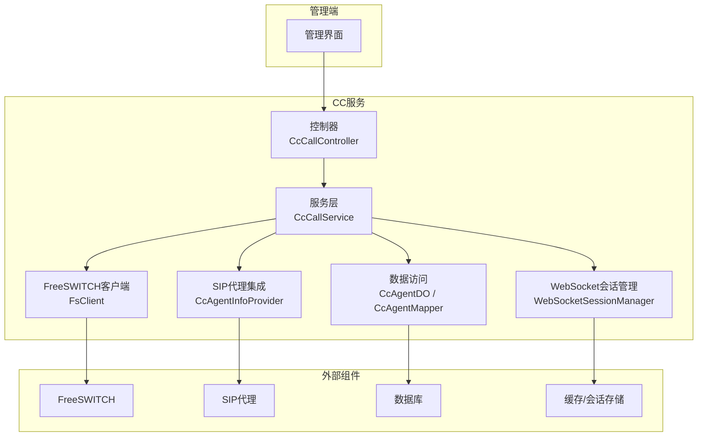
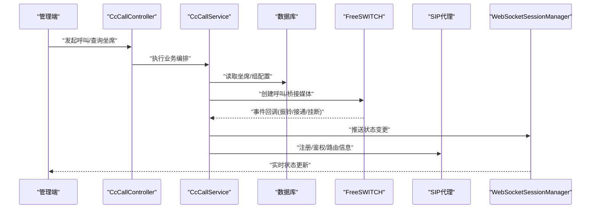
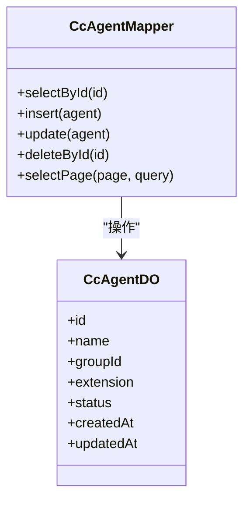
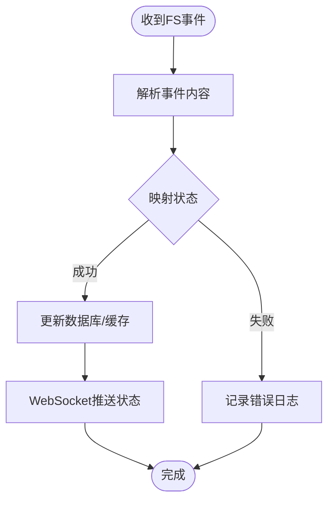
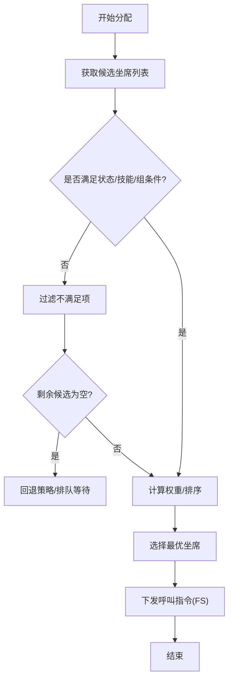
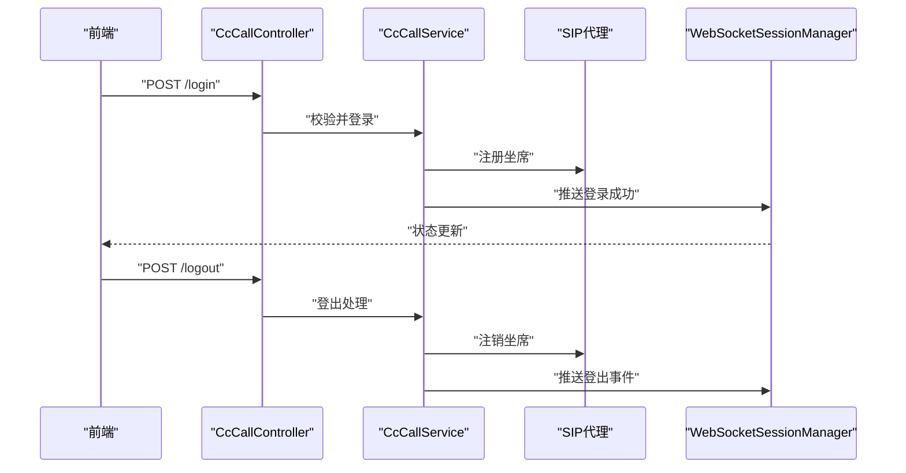
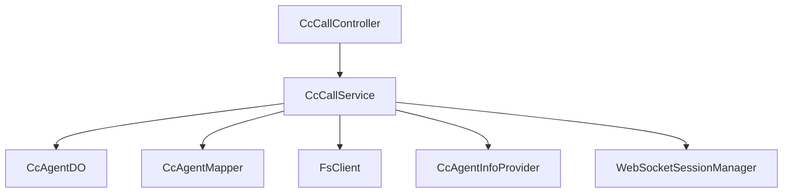

# 坐席管理系统

<cite>
**本文引用的文件**
- [yudao-module-cc-server/.../controller/admin/call/CcCallController.java](file://yudao-cloud/yudao-module-cc/yudao-module-cc-server/src/main/java/cn/iocoder/yudao/module/cc/controller/admin/call/CcCallController.java)
- [yudao-module-cc-server/.../service/call/CcCallService.java](file://yudao-cloud/yudao-module-cc/yudao-module-cc-server/src/main/java/cn/iocoder/yudao/module/cc/service/call/CcCallService.java)
- [yudao-module-cc-server/.../dal/dataobject/call/CcAgentDO.java](file://yudao-cloud/yudao-module-cc/yudao-module-cc-server/src/main/java/cn/iocoder/yudao/module/cc/dal/dataobject/call/CcAgentDO.java)
- [yudao-module-cc-server/.../dal/mysql/call/CcAgentMapper.java](file://yudao-cloud/yudao-module-cc/yudao-module-cc-server/src/main/java/cn/iocoder/yudao/module/cc/dal/mysql/call/CcAgentMapper.java)
- [yudao-module-cc-server/.../esl/enums/SipAgentStatusEnum.java](file://yudao-cloud/yudao-module-cc/yudao-module-cc-server/src/main/java/cn/iocoder/yudao/module/cc/esl/enums/SipAgentStatusEnum.java)
- [yudao-module-cc-server/.../esl/enums/AgentStateEnum.java](file://yudao-cloud/yudao-module-cc/yudao-module-cc-server/src/main/java/cn/iocoder/yudao/module/cc/esl/enums/AgentStateEnum.java)
- [yudao-module-cc-server/.../esl/handler/event/AgentStateEvent.java](file://yudao-cloud/yudao-module-cc/yudao-module-cc-server/src/main/java/cn/iocoder/yudao/module/cc/esl/handler/event/AgentStateEvent.java)
- [yudao-module-cc-server/.../esl/client/FsClient.java](file://yudao-cloud/yudao-module-cc/yudao-module-cc-server/src/main/java/cn/iocoder/yudao/module/cc/esl/client/FsClient.java)
- [yudao-module-cc-server/.../config/IpccSipProxyConfig.java](file://yudao-cloud/yudao-module-cc/yudao-module-cc-server/src/main/java/cn/iocoder/yudao/module/cc/config/IpccSipProxyConfig.java)
- [yudao-module-cc-server/.../sipproxy/integration/CcAgentInfoProvider.java](file://yudao-cloud/yudao-module-cc/yudao-module-cc-server/src/main/java/cn/iocoder/yudao/module/cc/sipproxy/integration/CcAgentInfoProvider.java)
- [yudao-module-cc-server/.../websocket/core/WebSocketSessionManager.java](file://yudao-cloud/yudao-module-cc/yudao-module-cc-server/src/main/java/cn/iocoder/yudao/module/cc/websocket/core/WebSocketSessionManager.java)
- [yudao-module-cc-api/.../enums/ErrorCodeConstants.java](file://yudao-cloud/yudao-module-cc/yudao-module-cc-api/src/main/java/cn/iocoder/yudao/module/cc/enums/ErrorCodeConstants.java)
- [yudao-module-cc-server/.../constant/RedisConstants.java](file://yudao-cloud/yudao-module-cc/yudao-module-cc-server/src/main/java/cn/iocoder/yudao/module/cc/constant/RedisConstants.java)
</cite>

## 目录
1. [简介](#简介)
2. [项目结构](#项目结构)
3. [核心组件](#核心组件)
4. [架构总览](#架构总览)
5. [详细组件分析](#详细组件分析)
6. [依赖关系分析](#依赖关系分析)
7. [性能考虑](#性能考虑)
8. [故障排查指南](#故障排查指南)
9. [结论](#结论)
10. [附录](#附录)

## 简介
本文件为坐席管理系统的技术文档，聚焦于以下能力：
- 坐席组管理与配置
- 坐席状态管理（在线、通话中、忙碌等）与监控
- 权限控制与数据隔离
- 坐席的增删改查（CRUD）与分组关联
- 登录/登出流程、呼叫分配策略、在线状态同步
- 与 FreeSWITCH、SIP 代理等组件的集成方式
- 常见问题的定位与解决

## 项目结构
坐席管理相关代码集中在 yudao-module-cc 模块下，采用分层组织：
- controller 层暴露管理端 API（如呼叫、FS、SIP Proxy、系统设置等）
- service 层封装业务逻辑（呼叫路由、坐席状态、队列、统计等）
- dal 层包含数据对象（DO）、Mapper 与 Redis Key 常量
- esl 层负责与 FreeSWITCH 交互（事件处理、通道信息、状态枚举等）
- sipproxy/integration 提供与 SIP 代理的集成点（鉴权、消息拦截、节点/网关信息等）
- websocket 层用于前端实时推送（如坐席状态变更）

图表来源
- [yudao-module-cc-server/.../controller/admin/call/CcCallController.java](file://yudao-cloud/yudao-module-cc/yudao-module-cc-server/src/main/java/cn/iocoder/yudao/module/cc/controller/admin/call/CcCallController.java)
- [yudao-module-cc-server/.../service/call/CcCallService.java](file://yudao-cloud/yudao-module-cc/yudao-module-cc-server/src/main/java/cn/iocoder/yudao/module/cc/service/call/CcCallService.java)
- [yudao-module-cc-server/.../dal/dataobject/call/CcAgentDO.java](file://yudao-cloud/yudao-module-cc/yudao-module-cc-server/src/main/java/cn/iocoder/yudao/module/cc/dal/dataobject/call/CcAgentDO.java)
- [yudao-module-cc-server/.../dal/mysql/call/CcAgentMapper.java](file://yudao-cloud/yudao-module-cc/yudao-module-cc-server/src/main/java/cn/iocoder/yudao/module/cc/dal/mysql/call/CcAgentMapper.java)
- [yudao-module-cc-server/.../esl/client/FsClient.java](file://yudao-cloud/yudao-module-cc/yudao-module-cc-server/src/main/java/cn/iocoder/yudao/module/cc/esl/client/FsClient.java)
- [yudao-module-cc-server/.../sipproxy/integration/CcAgentInfoProvider.java](file://yudao-cloud/yudao-module-cc/yudao-module-cc-server/src/main/java/cn/iocoder/yudao/module/cc/sipproxy/integration/CcAgentInfoProvider.java)
- [yudao-module-cc-server/.../websocket/core/WebSocketSessionManager.java](file://yudao-cloud/yudao-module-cc/yudao-module-cc-server/src/main/java/cn/iocoder/yudao/module/cc/websocket/core/WebSocketSessionManager.java)

章节来源
- [yudao-module-cc-server/.../controller/admin/call/CcCallController.java](file://yudao-cloud/yudao-module-cc/yudao-module-cc-server/src/main/java/cn/iocoder/yudao/module/cc/controller/admin/call/CcCallController.java)
- [yudao-module-cc-server/.../service/call/CcCallService.java](file://yudao-cloud/yudao-module-cc/yudao-module-cc-server/src/main/java/cn/iocoder/yudao/module/cc/service/call/CcCallService.java)

## 核心组件
- 坐席数据模型与持久化
  - 数据对象：CcAgentDO，定义坐席实体字段与关系（如所属组、分机号、状态等）
  - 数据访问：CcAgentMapper，提供 CRUD 与查询方法
- 坐席状态与事件
  - 状态枚举：SipAgentStatusEnum、AgentStateEnum，统一表示 SIP 坐席与内部状态
  - 事件处理：AgentStateEvent，接收并处理来自 FreeSWITCH 的状态事件
- 呼叫与路由
  - 控制器：CcCallController，暴露呼叫相关的管理接口（创建、挂断、转移、查询等）
  - 服务：CcCallService，编排呼叫生命周期、坐席选择、状态更新、结果返回
- 与 FreeSWITCH 集成
  - FsClient，封装 ESL 连接与命令发送，驱动呼叫建立、媒体桥接、状态上报
- 与 SIP 代理集成
  - IpccSipProxyConfig，SIP 代理配置
  - CcAgentInfoProvider，向 SIP 代理提供坐席注册、鉴权、路由信息
- 实时状态推送
  - WebSocketSessionManager，维护 WebSocket 会话，推送坐席状态变更到前端

章节来源
- [yudao-module-cc-server/.../dal/dataobject/call/CcAgentDO.java](file://yudao-cloud/yudao-module-cc/yudao-module-cc-server/src/main/java/cn/iocoder/yudao/module/cc/dal/dataobject/call/CcAgentDO.java)
- [yudao-module-cc-server/.../dal/mysql/call/CcAgentMapper.java](file://yudao-cloud/yudao-module-cc/yudao-module-cc-server/src/main/java/cn/iocoder/yudao/module/cc/dal/mysql/call/CcAgentMapper.java)
- [yudao-module-cc-server/.../esl/enums/SipAgentStatusEnum.java](file://yudao-cloud/yudao-module-cc/yudao-module-cc-server/src/main/java/cn/iocoder/yudao/module/cc/esl/enums/SipAgentStatusEnum.java)
- [yudao-module-cc-server/.../esl/enums/AgentStateEnum.java](file://yudao-cloud/yudao-module-cc/yudao-module-cc-server/src/main/java/cn/iocoder/yudao/module/cc/esl/enums/AgentStateEnum.java)
- [yudao-module-cc-server/.../esl/handler/event/AgentStateEvent.java](file://yudao-cloud/yudao-module-cc/yudao-module-cc-server/src/main/java/cn/iocoder/yudao/module/cc/esl/handler/event/AgentStateEvent.java)
- [yudao-module-cc-server/.../esl/client/FsClient.java](file://yudao-cloud/yudao-module-cc/yudao-module-cc-server/src/main/java/cn/iocoder/yudao/module/cc/esl/client/FsClient.java)
- [yudao-module-cc-server/.../config/IpccSipProxyConfig.java](file://yudao-cloud/yudao-module-cc/yudao-module-cc-server/src/main/java/cn/iocoder/yudao/module/cc/config/IpccSipProxyConfig.java)
- [yudao-module-cc-server/.../sipproxy/integration/CcAgentInfoProvider.java](file://yudao-cloud/yudao-module-cc/yudao-module-cc-server/src/main/java/cn/iocoder/yudao/module/cc/sipproxy/integration/CcAgentInfoProvider.java)
- [yudao-module-cc-server/.../websocket/core/WebSocketSessionManager.java](file://yudao-cloud/yudao-module-cc/yudao-module-cc-server/src/main/java/cn/iocoder/yudao/module/cc/websocket/core/WebSocketSessionManager.java)

## 架构总览
坐席管理通过“管理端 -> CC服务 -> 外部组件”的分层架构实现。管理端调用控制器接口，服务层协调数据访问、FreeSWITCH 与 SIP 代理，并通过 WebSocket 将状态实时推送到前端。

图表来源
- [yudao-module-cc-server/.../controller/admin/call/CcCallController.java](file://yudao-cloud/yudao-module-cc/yudao-module-cc-server/src/main/java/cn/iocoder/yudao/module/cc/controller/admin/call/CcCallController.java)
- [yudao-module-cc-server/.../service/call/CcCallService.java](file://yudao-cloud/yudao-module-cc/yudao-module-cc-server/src/main/java/cn/iocoder/yudao/module/cc/service/call/CcCallService.java)
- [yudao-module-cc-server/.../esl/client/FsClient.java](file://yudao-cloud/yudao-module-cc/yudao-module-cc-server/src/main/java/cn/iocoder/yudao/module/cc/esl/client/FsClient.java)
- [yudao-module-cc-server/.../sipproxy/integration/CcAgentInfoProvider.java](file://yudao-cloud/yudao-module-cc/yudao-module-cc-server/src/main/java/cn/iocoder/yudao/module/cc/sipproxy/integration/CcAgentInfoProvider.java)
- [yudao-module-cc-server/.../websocket/core/WebSocketSessionManager.java](file://yudao-cloud/yudao-module-cc/yudao-module-cc-server/src/main/java/cn/iocoder/yudao/module/cc/websocket/core/WebSocketSessionManager.java)

## 详细组件分析

### 坐席数据模型与持久化
- 数据对象 CcAgentDO
  - 职责：描述坐席实体属性（如编号、姓名、所属组、分机号、状态等）
  - 复杂度：O(1) 字段访问；批量查询时受索引影响
- 数据访问 CcAgentMapper
  - 职责：提供 CRUD、分页、条件查询等方法
  - 优化建议：对常用查询字段建立索引；避免 N+1 查询

图表来源
- [yudao-module-cc-server/.../dal/dataobject/call/CcAgentDO.java](file://yudao-cloud/yudao-module-cc/yudao-module-cc-server/src/main/java/cn/iocoder/yudao/module/cc/dal/dataobject/call/CcAgentDO.java)
- [yudao-module-cc-server/.../dal/mysql/call/CcAgentMapper.java](file://yudao-cloud/yudao-module-cc/yudao-module-cc-server/src/main/java/cn/iocoder/yudao/module/cc/dal/mysql/call/CcAgentMapper.java)

章节来源
- [yudao-module-cc-server/.../dal/dataobject/call/CcAgentDO.java](file://yudao-cloud/yudao-module-cc/yudao-module-cc-server/src/main/java/cn/iocoder/yudao/module/cc/dal/dataobject/call/CcAgentDO.java)
- [yudao-module-cc-server/.../dal/mysql/call/CcAgentMapper.java](file://yudao-cloud/yudao-module-cc/yudao-module-cc-server/src/main/java/cn/iocoder/yudao/module/cc/dal/mysql/call/CcAgentMapper.java)

### 坐席状态管理与监控
- 状态枚举
  - SipAgentStatusEnum：SIP 层坐席状态（如在线、离线、通话中等）
  - AgentStateEnum：内部业务状态映射
- 事件处理
  - AgentStateEvent：监听 FreeSWITCH 事件，更新坐席状态并广播
- 实时监控
  - WebSocketSessionManager：维护会话，推送状态变更到前端

图表来源
- [yudao-module-cc-server/.../esl/enums/SipAgentStatusEnum.java](file://yudao-cloud/yudao-module-cc/yudao-module-cc-server/src/main/java/cn/iocoder/yudao/module/cc/esl/enums/SipAgentStatusEnum.java)
- [yudao-module-cc-server/.../esl/enums/AgentStateEnum.java](file://yudao-cloud/yudao-module-cc/yudao-module-cc-server/src/main/java/cn/iocoder/yudao/module/cc/esl/enums/AgentStateEnum.java)
- [yudao-module-cc-server/.../esl/handler/event/AgentStateEvent.java](file://yudao-cloud/yudao-module-cc/yudao-module-cc-server/src/main/java/cn/iocoder/yudao/module/cc/esl/handler/event/AgentStateEvent.java)
- [yudao-module-cc-server/.../websocket/core/WebSocketSessionManager.java](file://yudao-cloud/yudao-module-cc/yudao-module-cc-server/src/main/java/cn/iocoder/yudao/module/cc/websocket/core/WebSocketSessionManager.java)

章节来源
- [yudao-module-cc-server/.../esl/enums/SipAgentStatusEnum.java](file://yudao-cloud/yudao-module-cc/yudao-module-cc-server/src/main/java/cn/iocoder/yudao/module/cc/esl/enums/SipAgentStatusEnum.java)
- [yudao-module-cc-server/.../esl/enums/AgentStateEnum.java](file://yudao-cloud/yudao-module-cc/yudao-module-cc-server/src/main/java/cn/iocoder/yudao/module/cc/esl/enums/AgentStateEnum.java)
- [yudao-module-cc-server/.../esl/handler/event/AgentStateEvent.java](file://yudao-cloud/yudao-module-cc/yudao-module-cc-server/src/main/java/cn/iocoder/yudao/module/cc/esl/handler/event/AgentStateEvent.java)
- [yudao-module-cc-server/.../websocket/core/WebSocketSessionManager.java](file://yudao-cloud/yudao-module-cc/yudao-module-cc-server/src/main/java/cn/iocoder/yudao/module/cc/websocket/core/WebSocketSessionManager.java)

### 呼叫分配策略
- 策略要点
  - 基于坐席状态过滤（仅在线且空闲）
  - 基于技能/组匹配（优先同组或具备相应技能）
  - 负载均衡（轮询、最少通话数、加权随机）
- 执行流程
  - 从数据库/缓存获取候选坐席
  - 应用策略排序
  - 选择最优坐席并下发呼叫指令

章节来源
- [yudao-module-cc-server/.../service/call/CcCallService.java](file://yudao-cloud/yudao-module-cc/yudao-module-cc-server/src/main/java/cn/iocoder/yudao/module/cc/service/call/CcCallService.java)
- [yudao-module-cc-server/.../dal/dataobject/call/CcAgentDO.java](file://yudao-cloud/yudao-module-cc/yudao-module-cc-server/src/main/java/cn/iocoder/yudao/module/cc/dal/dataobject/call/CcAgentDO.java)
- [yudao-module-cc-server/.../esl/client/FsClient.java](file://yudao-cloud/yudao-module-cc/yudao-module-cc-server/src/main/java/cn/iocoder/yudao/module/cc/esl/client/FsClient.java)

### 登录/登出流程
- 登录
  - 前端发起登录请求
  - 控制器校验身份与权限
  - 服务层更新坐席状态为在线，并通知 SIP 代理注册
  - WebSocket 推送登录成功与初始状态
- 登出
  - 前端发起登出请求
  - 服务层更新状态为离线，注销 SIP 注册
  - 关闭相关资源并推送登出事件

图表来源
- [yudao-module-cc-server/.../controller/admin/call/CcCallController.java](file://yudao-cloud/yudao-module-cc/yudao-module-cc-server/src/main/java/cn/iocoder/yudao/module/cc/controller/admin/call/CcCallController.java)
- [yudao-module-cc-server/.../service/call/CcCallService.java](file://yudao-cloud/yudao-module-cc/yudao-module-cc-server/src/main/java/cn/iocoder/yudao/module/cc/service/call/CcCallService.java)
- [yudao-module-cc-server/.../sipproxy/integration/CcAgentInfoProvider.java](file://yudao-cloud/yudao-module-cc/yudao-module-cc-server/src/main/java/cn/iocoder/yudao/module/cc/sipproxy/integration/CcAgentInfoProvider.java)
- [yudao-module-cc-server/.../websocket/core/WebSocketSessionManager.java](file://yudao-cloud/yudao-module-cc/yudao-module-cc-server/src/main/java/cn/iocoder/yudao/module/cc/websocket/core/WebSocketSessionManager.java)

章节来源
- [yudao-module-cc-server/.../controller/admin/call/CcCallController.java](file://yudao-cloud/yudao-module-cc/yudao-module-cc-server/src/main/java/cn/iocoder/yudao/module/cc/controller/admin/call/CcCallController.java)
- [yudao-module-cc-server/.../service/call/CcCallService.java](file://yudao-cloud/yudao-module-cc/yudao-module-cc-server/src/main/java/cn/iocoder/yudao/module/cc/service/call/CcCallService.java)
- [yudao-module-cc-server/.../sipproxy/integration/CcAgentInfoProvider.java](file://yudao-cloud/yudao-module-cc/yudao-module-cc-server/src/main/java/cn/iocoder/yudao/module/cc/sipproxy/integration/CcAgentInfoProvider.java)
- [yudao-module-cc-server/.../websocket/core/WebSocketSessionManager.java](file://yudao-cloud/yudao-module-cc/yudao-module-cc-server/src/main/java/cn/iocoder/yudao/module/cc/websocket/core/WebSocketSessionManager.java)

### 权限控制与数据隔离
- 权限校验
  - 控制器入口进行角色/权限检查
  - 数据访问层按租户/部门维度过滤
- 数据隔离
  - 通过 Mapper 的条件构造器限定查询范围
  - 敏感操作需二次确认与审计日志

章节来源
- [yudao-module-cc-server/.../controller/admin/call/CcCallController.java](file://yudao-cloud/yudao-module-cc/yudao-module-cc-server/src/main/java/cn/iocoder/yudao/module/cc/controller/admin/call/CcCallController.java)
- [yudao-module-cc-server/.../dal/mysql/call/CcAgentMapper.java](file://yudao-cloud/yudao-module-cc/yudao-module-cc-server/src/main/java/cn/iocoder/yudao/module/cc/dal/mysql/call/CcAgentMapper.java)

### 与 FreeSWITCH、SIP 代理的集成
- FreeSWITCH
  - FsClient：封装 ESL 连接、事件订阅、命令发送
  - 事件处理：AgentStateEvent 将 FS 事件转换为内部状态
- SIP 代理
  - IpccSipProxyConfig：配置 SIP 代理地址、端口、传输协议等
  - CcAgentInfoProvider：提供坐席注册、鉴权、路由信息给 SIP 代理

图表来源
- [yudao-module-cc-server/.../esl/client/FsClient.java](file://yudao-cloud/yudao-module-cc/yudao-module-cc-server/src/main/java/cn/iocoder/yudao/module/cc/esl/client/FsClient.java)
- [yudao-module-cc-server/.../config/IpccSipProxyConfig.java](file://yudao-cloud/yudao-module-cc/yudao-module-cc-server/src/main/java/cn/iocoder/yudao/module/cc/config/IpccSipProxyConfig.java)
- [yudao-module-cc-server/.../sipproxy/integration/CcAgentInfoProvider.java](file://yudao-cloud/yudao-module-cc/yudao-module-cc-server/src/main/java/cn/iocoder/yudao/module/cc/sipproxy/integration/CcAgentInfoProvider.java)

章节来源
- [yudao-module-cc-server/.../esl/client/FsClient.java](file://yudao-cloud/yudao-module-cc/yudao-module-cc-server/src/main/java/cn/iocoder/yudao/module/cc/esl/client/FsClient.java)
- [yudao-module-cc-server/.../config/IpccSipProxyConfig.java](file://yudao-cloud/yudao-module-cc/yudao-module-cc-server/src/main/java/cn/iocoder/yudao/module/cc/config/IpccSipProxyConfig.java)
- [yudao-module-cc-server/.../sipproxy/integration/CcAgentInfoProvider.java](file://yudao-cloud/yudao-module-cc/yudao-module-cc-server/src/main/java/cn/iocoder/yudao/module/cc/sipproxy/integration/CcAgentInfoProvider.java)

## 依赖关系分析
- 组件耦合
  - 控制器依赖服务层，服务层依赖数据访问与外部组件（FS、SIP）
  - 事件处理器与服务层解耦，通过事件总线或回调机制通信
- 外部依赖
  - FreeSWITCH：通过 ESL 协议交互
  - SIP 代理：通过 REST/WebSocket 提供注册与路由能力
  - 数据库与缓存：持久化与实时状态存储

图表来源
- [yudao-module-cc-server/.../controller/admin/call/CcCallController.java](file://yudao-cloud/yudao-module-cc/yudao-module-cc-server/src/main/java/cn/iocoder/yudao/module/cc/controller/admin/call/CcCallController.java)
- [yudao-module-cc-server/.../service/call/CcCallService.java](file://yudao-cloud/yudao-module-cc/yudao-module-cc-server/src/main/java/cn/iocoder/yudao/module/cc/service/call/CcCallService.java)
- [yudao-module-cc-server/.../dal/dataobject/call/CcAgentDO.java](file://yudao-cloud/yudao-module-cc/yudao-module-cc-server/src/main/java/cn/iocoder/yudao/module/cc/dal/dataobject/call/CcAgentDO.java)
- [yudao-module-cc-server/.../dal/mysql/call/CcAgentMapper.java](file://yudao-cloud/yudao-module-cc/yudao-module-cc-server/src/main/java/cn/iocoder/yudao/module/cc/dal/mysql/call/CcAgentMapper.java)
- [yudao-module-cc-server/.../esl/client/FsClient.java](file://yudao-cloud/yudao-module-cc/yudao-module-cc-server/src/main/java/cn/iocoder/yudao/module/cc/esl/client/FsClient.java)
- [yudao-module-cc-server/.../sipproxy/integration/CcAgentInfoProvider.java](file://yudao-cloud/yudao-module-cc/yudao-module-cc-server/src/main/java/cn/iocoder/yudao/module/cc/sipproxy/integration/CcAgentInfoProvider.java)
- [yudao-module-cc-server/.../websocket/core/WebSocketSessionManager.java](file://yudao-cloud/yudao-module-cc/yudao-module-cc-server/src/main/java/cn/iocoder/yudao/module/cc/websocket/core/WebSocketSessionManager.java)

章节来源
- [yudao-module-cc-server/.../service/call/CcCallService.java](file://yudao-cloud/yudao-module-cc/yudao-module-cc-server/src/main/java/cn/iocoder/yudao/module/cc/service/call/CcCallService.java)

## 性能考虑
- 数据库层面
  - 对高频查询字段建立索引（如 groupId、status、extension）
  - 使用分页与只读副本降低主库压力
- 缓存与会话
  - 使用 Redis 缓存热点坐席信息与在线状态
  - WebSocket 会话管理需限制并发与心跳超时
- 外部组件
  - FreeSWITCH 事件处理异步化，避免阻塞主线程
  - SIP 代理调用增加重试与熔断保护

[本节为通用指导，不直接分析具体文件]

## 故障排查指南
- 常见问题
  - 坐席状态不同步：检查 FreeSWITCH 事件是否到达、事件映射是否正确、WebSocket 推送是否成功
  - 呼叫分配失败：检查候选坐席过滤逻辑、技能/组匹配、FS 命令执行结果
  - SIP 注册失败：核对 SIP 代理配置、鉴权参数、网络连通性
- 定位步骤
  - 查看事件日志与错误码（ErrorCodeConstants）
  - 检查 Redis 键值（RedisConstants）中的状态缓存
  - 验证 FS 连接与命令响应
  - 复现最小场景并逐步缩小范围

章节来源
- [yudao-module-cc-api/.../enums/ErrorCodeConstants.java](file://yudao-cloud/yudao-module-cc/yudao-module-cc-api/src/main/java/cn/iocoder/yudao/module/cc/enums/ErrorCodeConstants.java)
- [yudao-module-cc-server/.../constant/RedisConstants.java](file://yudao-cloud/yudao-module-cc/yudao-module-cc-server/src/main/java/cn/iocoder/yudao/module/cc/constant/RedisConstants.java)
- [yudao-module-cc-server/.../esl/handler/event/AgentStateEvent.java](file://yudao-cloud/yudao-module-cc/yudao-module-cc-server/src/main/java/cn/iocoder/yudao/module/cc/esl/handler/event/AgentStateEvent.java)
- [yudao-module-cc-server/.../esl/client/FsClient.java](file://yudao-cloud/yudao-module-cc/yudao-module-cc-server/src/main/java/cn/iocoder/yudao/module/cc/esl/client/FsClient.java)

## 结论
本系统以清晰的分层架构实现了坐席组管理、状态监控、权限控制与呼叫分配等核心能力，并通过 FreeSWITCH 与 SIP 代理完成语音与控制面集成。建议在上线前完善索引与缓存策略，强化事件处理的容错与可观测性，确保高可用与可扩展性。

## 附录
- API 参考（示例）
  - 登录
    - 路径：POST /api/cc/login
    - 请求体：{ "agentId": "string", "password": "string" }
    - 响应：{ "code": "number", "data": "{ token, agentInfo }", "msg": "string" }
    - 错误：未授权、参数缺失、SIP 注册失败
  - 登出
    - 路径：POST /api/cc/logout
    - 响应：{ "code": "number", "data": null, "msg": "string" }
  - 呼叫
    - 路径：POST /api/cc/call
    - 请求体：{ "from": "string", "to": "string", "strategy": "round-robin|least-calls|weighted-random" }
    - 响应：{ "code": "number", "data": "{ callId, agentId }", "msg": "string" }
  - 查询坐席
    - 路径：GET /api/cc/agents?page=1&size=20&groupId=1&status=online
    - 响应：{ "code": "number", "data": "{ list, total }", "msg": "string" }
- 错误码
  - 参考 ErrorCodeConstants 中的定义
- 缓存键
  - 参考 RedisConstants 中的键命名规范

[本节为概念性说明，不直接分析具体文件]