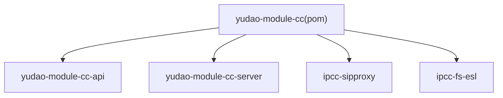
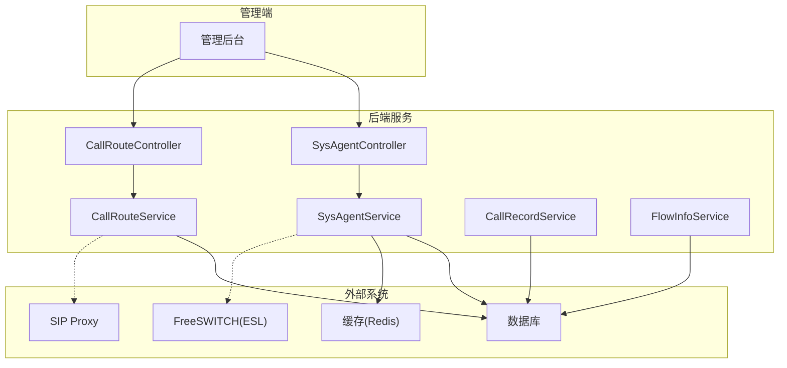
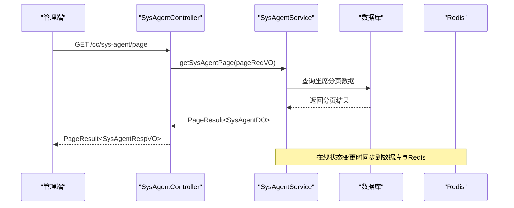
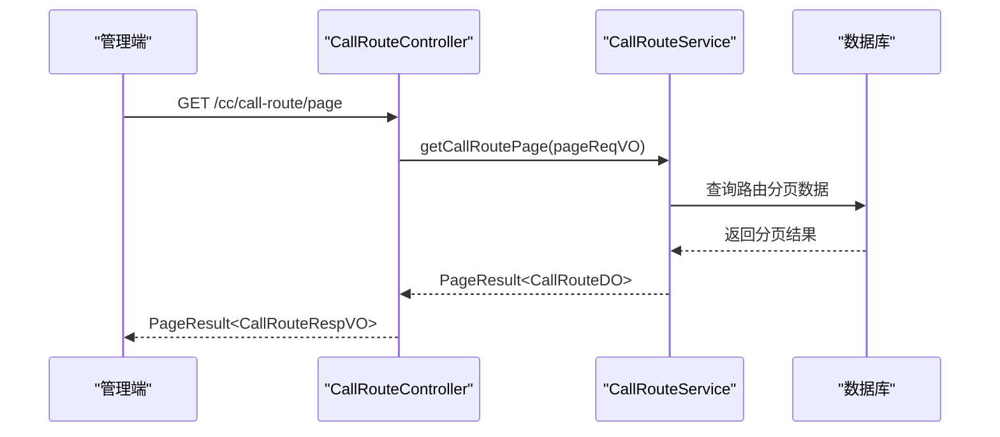
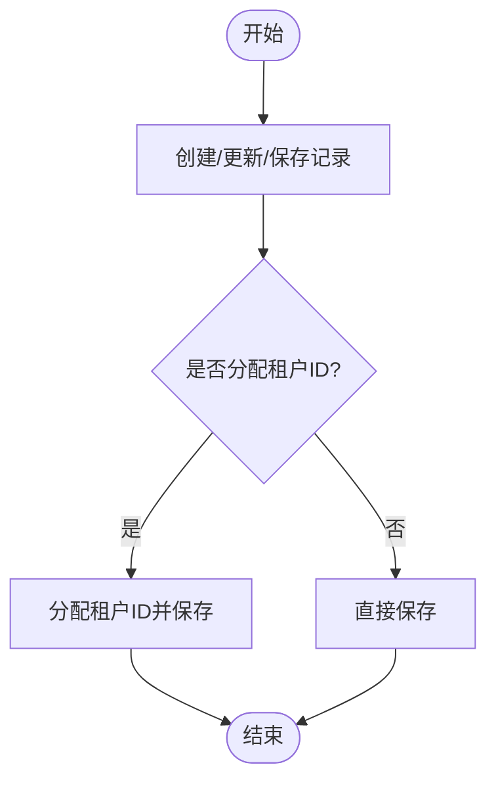
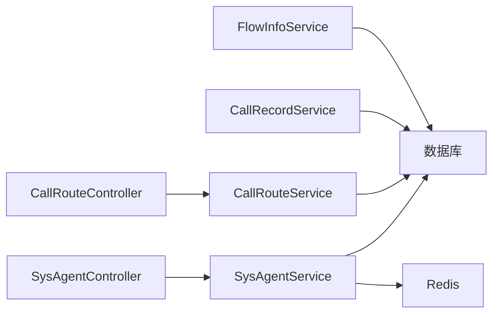

# 核心模块

<cite>
**本文引用的文件**
- [pom.xml](file://yudao-cloud/yudao-module-cc/pom.xml)
- [SysAgentService.java](file://yudao-cloud/yudao-module-cc/yudao-module-cc-server/src/main/java/cn/iocoder/yudao/module/cc/service/sys/SysAgentService.java)
- [CallRouteService.java](file://yudao-cloud/yudao-module-cc/yudao-module-cc-server/src/main/java/cn/iocoder/yudao/module/cc/service/call/CallRouteService.java)
- [CallRecordService.java](file://yudao-cloud/yudao-module-cc/yudao-module-cc-server/src/main/java/cn/iocoder/yudao/module/cc/service/call/CallRecordService.java)
- [FlowInfoService.java](file://yudao-cloud/yudao-module-cc/yudao-module-cc-server/src/main/java/cn/iocoder/yudao/module/cc/service/flow/FlowInfoService.java)
- [SysAgentController.java](file://yudao-cloud/yudao-module-cc/yudao-module-cc-server/src/main/java/cn/iocoder/yudao/module/cc/controller/admin/sys/SysAgentController.java)
- [CallRouteController.java](file://yudao-cloud/yudao-module-cc/yudao-module-cc-server/src/main/java/cn/iocoder/yudao/module/cc/controller/admin/call/CallRouteController.java)
</cite>

## 目录
1. [简介](#简介)
2. [项目结构](#项目结构)
3. [核心组件](#核心组件)
4. [架构总览](#架构总览)
5. [详细组件分析](#详细组件分析)
6. [依赖关系分析](#依赖关系分析)
7. [性能考量](#性能考量)
8. [故障排查指南](#故障排查指南)
9. [结论](#结论)
10. [附录](#附录)

## 简介
本章节面向IPCC呼叫中心系统的核心模块，聚焦坐席管理、呼叫路由、呼叫记录与IVR流程四大能力。文档从系统架构、组件职责、数据流与调用关系入手，结合代码级接口定义与控制器入口，给出配置项、参数与返回值的说明，并补充常见问题与排障建议。内容兼顾初学者友好与资深开发者的技术深度。

## 项目结构
呼叫中心模块采用多模块Maven工程组织：
- yudao-module-cc-api：对外暴露的API常量与枚举等共享契约
- yudao-module-cc-server：业务实现（控制器、服务、数据对象、ESL集成、SIP代理集成等）
- ipcc-sipproxy：SIP信令代理组件
- ipcc-fs-esl：FreeSWITCH ESL客户端组件

顶层聚合POM定义了模块组成，便于统一构建与发布。

图表来源
- [pom.xml:10-15](file://yudao-cloud/yudao-module-cc/pom.xml#L10-L15)

章节来源
- [pom.xml:1-26](file://yudao-cloud/yudao-module-cc/pom.xml#L1-L26)

## 核心组件
- 坐席管理：提供坐席CRUD、分页查询、按号码/用户ID检索、在线状态同步（数据库+Redis）等能力
- 呼叫路由：提供路由规则CRUD、分页查询、按号码与类型检索等能力
- 呼叫记录：提供记录创建、更新、删除、分页查询、保存（含租户分配）等能力
- IVR流程：提供流程信息CRUD、分页查询、非租户模式查询等能力

章节来源
- [SysAgentService.java:11-60](file://yudao-cloud/yudao-module-cc/yudao-module-cc-server/src/main/java/cn/iocoder/yudao/module/cc/service/sys/SysAgentService.java#L11-L60)
- [CallRouteService.java:16-80](file://yudao-cloud/yudao-module-cc/yudao-module-cc-server/src/main/java/cn/iocoder/yudao/module/cc/service/call/CallRouteService.java#L16-L80)
- [CallRecordService.java:16-76](file://yudao-cloud/yudao-module-cc/yudao-module-cc-server/src/main/java/cn/iocoder/yudao/module/cc/service/call/CallRecordService.java#L16-L76)
- [FlowInfoService.java:16-70](file://yudao-cloud/yudao-module-cc/yudao-module-cc-server/src/main/java/cn/iocoder/yudao/module/cc/service/flow/FlowInfoService.java#L16-L70)

## 架构总览
整体采用“控制器-服务-数据访问”分层架构，配合ESL事件处理与SIP代理集成，形成“接入-路由-执行-记录”的闭环。

图表来源
- [SysAgentController.java:47-193](file://yudao-cloud/yudao-module-cc/yudao-module-cc-server/src/main/java/cn/iocoder/yudao/module/cc/controller/admin/sys/SysAgentController.java#L47-L193)
- [CallRouteController.java:30-111](file://yudao-cloud/yudao-module-cc/yudao-module-cc-server/src/main/java/cn/iocoder/yudao/module/cc/controller/admin/call/CallRouteController.java#L30-L111)
- [SysAgentService.java:11-60](file://yudao-cloud/yudao-module-cc/yudao-module-cc-server/src/main/java/cn/iocoder/yudao/module/cc/service/sys/SysAgentService.java#L11-L60)
- [CallRouteService.java:16-80](file://yudao-cloud/yudao-module-cc/yudao-module-cc-server/src/main/java/cn/iocoder/yudao/module/cc/service/call/CallRouteService.java#L16-L80)
- [CallRecordService.java:16-76](file://yudao-cloud/yudao-module-cc/yudao-module-cc-server/src/main/java/cn/iocoder/yudao/module/cc/service/call/CallRecordService.java#L16-L76)
- [FlowInfoService.java:16-70](file://yudao-cloud/yudao-module-cc/yudao-module-cc-server/src/main/java/cn/iocoder/yudao/module/cc/service/flow/FlowInfoService.java#L16-L70)

## 详细组件分析

### 坐席管理
- 职责
  - 坐席基础信息的增删改查与分页
  - 按坐席号码或系统用户ID获取坐席
  - 在线状态同步至数据库与Redis，支持WebSocket断开时置离线
- 关键接口
  - 创建/更新/删除/分页/按号码查询/按用户ID查询
  - updateAgentOnlineStatus：同时更新数据库与Redis中的坐席状态
  - setAgentOfflineByUserId：通过userId将坐席置为离线
- 典型调用链（以分页查询为例）
  - 管理端发起请求 -> SysAgentController -> SysAgentService -> 数据层
- 配置与权限
  - 接口受权限控制注解保护，需具备对应操作权限
  - 导出Excel功能带有访问日志标注

图表来源
- [SysAgentController.java:115-125](file://yudao-cloud/yudao-module-cc/yudao-module-cc-server/src/main/java/cn/iocoder/yudao/module/cc/controller/admin/sys/SysAgentController.java#L115-L125)
- [SysAgentService.java:23-49](file://yudao-cloud/yudao-module-cc/yudao-module-cc-server/src/main/java/cn/iocoder/yudao/module/cc/service/sys/SysAgentService.java#L23-L49)

章节来源
- [SysAgentController.java:47-193](file://yudao-cloud/yudao-module-cc/yudao-module-cc-server/src/main/java/cn/iocoder/yudao/module/cc/controller/admin/sys/SysAgentController.java#L47-L193)
- [SysAgentService.java:11-60](file://yudao-cloud/yudao-module-cc/yudao-module-cc-server/src/main/java/cn/iocoder/yudao/module/cc/service/sys/SysAgentService.java#L11-L60)

### 呼叫路由
- 职责
  - 号码路由规则的增删改查与分页
  - 根据路由号码与类型获取匹配的路由集合（支持非租户模式）
- 关键接口
  - create/update/delete/get/getPage/list/getListByRouteNumberAndType
- 典型调用链（以分页查询为例）
  - 管理端发起请求 -> CallRouteController -> CallRouteService -> 数据层

图表来源
- [CallRouteController.java:81-87](file://yudao-cloud/yudao-module-cc/yudao-module-cc-server/src/main/java/cn/iocoder/yudao/module/cc/controller/admin/call/CallRouteController.java#L81-L87)
- [CallRouteService.java:55-80](file://yudao-cloud/yudao-module-cc/yudao-module-cc-server/src/main/java/cn/iocoder/yudao/module/cc/service/call/CallRouteService.java#L55-L80)

章节来源
- [CallRouteController.java:30-111](file://yudao-cloud/yudao-module-cc/yudao-module-cc-server/src/main/java/cn/iocoder/yudao/module/cc/controller/admin/call/CallRouteController.java#L30-L111)
- [CallRouteService.java:16-80](file://yudao-cloud/yudao-module-cc/yudao-module-cc-server/src/main/java/cn/iocoder/yudao/module/cc/service/call/CallRouteService.java#L16-L80)

### 呼叫记录
- 职责
  - 呼叫记录的创建、更新、删除、分页查询
  - 保存记录（含自动分配租户ID）
- 关键接口
  - create/update/delete/get/getPage/save/saveAssignTenantId
- 使用场景
  - 通话结束后落库，用于审计与统计
  - 支持批量删除与分页导出（结合控制器）

图表来源
- [CallRecordService.java:63-76](file://yudao-cloud/yudao-module-cc/yudao-module-cc-server/src/main/java/cn/iocoder/yudao/module/cc/service/call/CallRecordService.java#L63-L76)

章节来源
- [CallRecordService.java:16-76](file://yudao-cloud/yudao-module-cc/yudao-module-cc-server/src/main/java/cn/iocoder/yudao/module/cc/service/call/CallRecordService.java#L16-L76)

### IVR流程
- 职责
  - IVR流程信息的增删改查与分页
  - 支持非租户模式查询，便于跨租户复用流程
- 关键接口
  - create/update/delete/get/getPage/getFlowInfoNoTenant
- 使用场景
  - 在路由或ESL事件中加载流程节点，驱动语音交互与转接逻辑

章节来源
- [FlowInfoService.java:16-70](file://yudao-cloud/yudao-module-cc/yudao-module-cc-server/src/main/java/cn/iocoder/yudao/module/cc/service/flow/FlowInfoService.java#L16-L70)

## 依赖关系分析
- 模块内依赖
  - 控制器依赖服务接口；服务接口定义清晰，便于实现替换
  - 服务层依赖数据对象与枚举常量，保证领域模型一致性
- 外部依赖
  - FreeSWITCH ESL：用于事件监听与控制媒体通道
  - SIP Proxy：用于SIP信令转发与网关管理
  - 数据库与Redis：持久化与缓存

图表来源
- [SysAgentController.java:47-193](file://yudao-cloud/yudao-module-cc/yudao-module-cc-server/src/main/java/cn/iocoder/yudao/module/cc/controller/admin/sys/SysAgentController.java#L47-L193)
- [CallRouteController.java:30-111](file://yudao-cloud/yudao-module-cc/yudao-module-cc-server/src/main/java/cn/iocoder/yudao/module/cc/controller/admin/call/CallRouteController.java#L30-L111)
- [SysAgentService.java:11-60](file://yudao-cloud/yudao-module-cc/yudao-module-cc-server/src/main/java/cn/iocoder/yudao/module/cc/service/sys/SysAgentService.java#L11-L60)
- [CallRouteService.java:16-80](file://yudao-cloud/yudao-module-cc/yudao-module-cc-server/src/main/java/cn/iocoder/yudao/module/cc/service/call/CallRouteService.java#L16-L80)
- [CallRecordService.java:16-76](file://yudao-cloud/yudao-module-cc/yudao-module-cc-server/src/main/java/cn/iocoder/yudao/module/cc/service/call/CallRecordService.java#L16-L76)
- [FlowInfoService.java:16-70](file://yudao-cloud/yudao-module-cc/yudao-module-cc-server/src/main/java/cn/iocoder/yudao/module/cc/service/flow/FlowInfoService.java#L16-L70)

章节来源
- [pom.xml:10-15](file://yudao-cloud/yudao-module-cc/pom.xml#L10-L15)

## 性能考量
- 分页查询：控制器与服务层均提供分页接口，避免一次性加载大量数据
- 缓存策略：坐席在线状态同步至Redis，降低高频状态查询对数据库的压力
- 异步与并发：ESL事件处理与媒体通道控制应结合线程池与队列进行削峰填谷（参考esl子模块设计）
- 连接池与超时：数据库与Redis连接池参数需按生产环境调优，避免连接耗尽
- 导出优化：大表导出建议使用分批读取与流式写入，减少内存占用

[本节为通用指导，不直接分析具体文件]

## 故障排查指南
- 坐席状态不同步
  - 现象：数据库与Redis中坐席状态不一致
  - 排查：检查updateAgentOnlineStatus调用路径与事务边界；确认Redis键空间与序列化一致
  - 参考：[SysAgentService.java:39-49](file://yudao-cloud/yudao-module-cc/yudao-module-cc-server/src/main/java/cn/iocoder/yudao/module/cc/service/sys/SysAgentService.java#L39-L49)
- WebSocket断开未置离线
  - 现象：用户下线后仍显示在线
  - 排查：确认setAgentOfflineByUserId在断连回调中被调用；校验userId到agentId映射
  - 参考：[SysAgentService.java:51-59](file://yudao-cloud/yudao-module-cc/yudao-module-cc-server/src/main/java/cn/iocoder/yudao/module/cc/service/sys/SysAgentService.java#L51-L59)
- 路由匹配失败
  - 现象：来电无法匹配到预期路由
  - 排查：核对routeNum与type；检查getListByRouteNumberAndType与无租户版本差异
  - 参考：[CallRouteService.java:63-80](file://yudao-cloud/yudao-module-cc/yudao-module-cc-server/src/main/java/cn/iocoder/yudao/module/cc/service/call/CallRouteService.java#L63-L80)
- 呼叫记录缺失
  - 现象：通话结束后无记录
  - 排查：确认save/saveAssignTenantId调用时机；检查租户分配逻辑与异常捕获
  - 参考：[CallRecordService.java:63-76](file://yudao-cloud/yudao-module-cc/yudao-module-cc-server/src/main/java/cn/iocoder/yudao/module/cc/service/call/CallRecordService.java#L63-L76)

章节来源
- [SysAgentService.java:39-59](file://yudao-cloud/yudao-module-cc/yudao-module-cc-server/src/main/java/cn/iocoder/yudao/module/cc/service/sys/SysAgentService.java#L39-L59)
- [CallRouteService.java:63-80](file://yudao-cloud/yudao-module-cc/yudao-module-cc-server/src/main/java/cn/iocoder/yudao/module/cc/service/call/CallRouteService.java#L63-L80)
- [CallRecordService.java:63-76](file://yudao-cloud/yudao-module-cc/yudao-module-cc-server/src/main/java/cn/iocoder/yudao/module/cc/service/call/CallRecordService.java#L63-L76)

## 结论
本模块围绕坐席、路由、记录与IVR流程构建了呼叫中心的核心能力。通过清晰的接口设计与分层架构，实现了可维护性与扩展性。结合ESL与SIP代理，形成了完整的接入-路由-执行-记录闭环。建议在部署与运维阶段重点关注缓存一致性、分页与导出性能、以及事件处理的可靠性。

[本节为总结性内容，不直接分析具体文件]

## 附录
- 常用接口速览
  - 坐席管理
    - 创建：POST /cc/sys-agent/create
    - 更新：PUT /cc/sys-agent/update
    - 删除：DELETE /cc/sys-agent/delete
    - 分页：GET /cc/sys-agent/page
    - 列表：GET /cc/sys-agent/list
    - 按用户ID获取：GET /cc/sys-agent/get-by-user-id
  - 呼叫路由
    - 创建：POST /cc/call-route/create
    - 更新：PUT /cc/call-route/update
    - 删除：DELETE /cc/call-route/delete
    - 分页：GET /cc/call-route/page
    - 列表：GET /cc/call-route/list

章节来源
- [SysAgentController.java:65-164](file://yudao-cloud/yudao-module-cc/yudao-module-cc-server/src/main/java/cn/iocoder/yudao/module/cc/controller/admin/sys/SysAgentController.java#L65-L164)
- [CallRouteController.java:39-96](file://yudao-cloud/yudao-module-cc/yudao-module-cc-server/src/main/java/cn/iocoder/yudao/module/cc/controller/admin/call/CallRouteController.java#L39-L96)