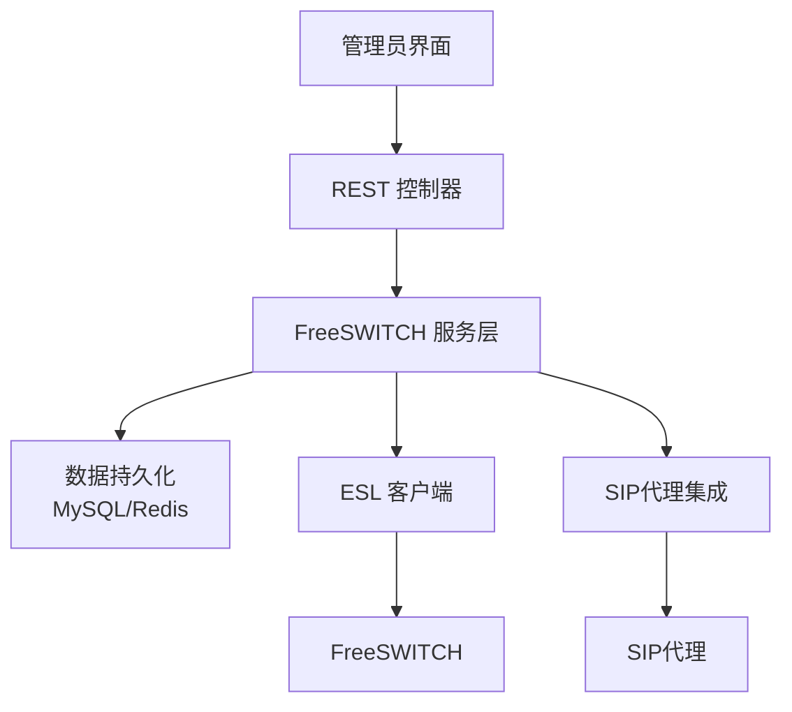
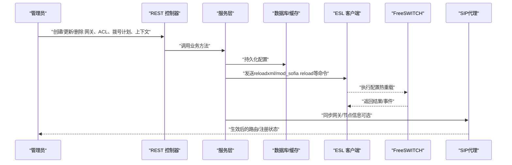
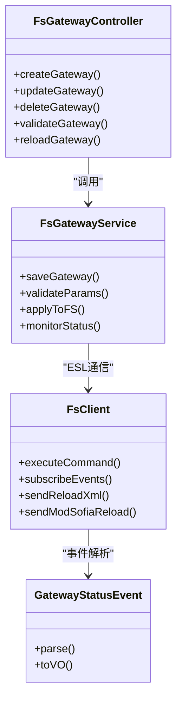
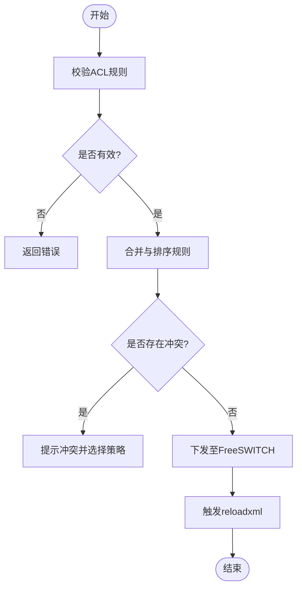
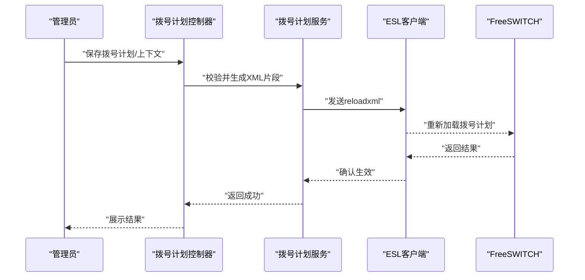
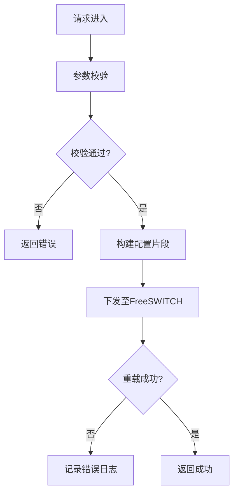
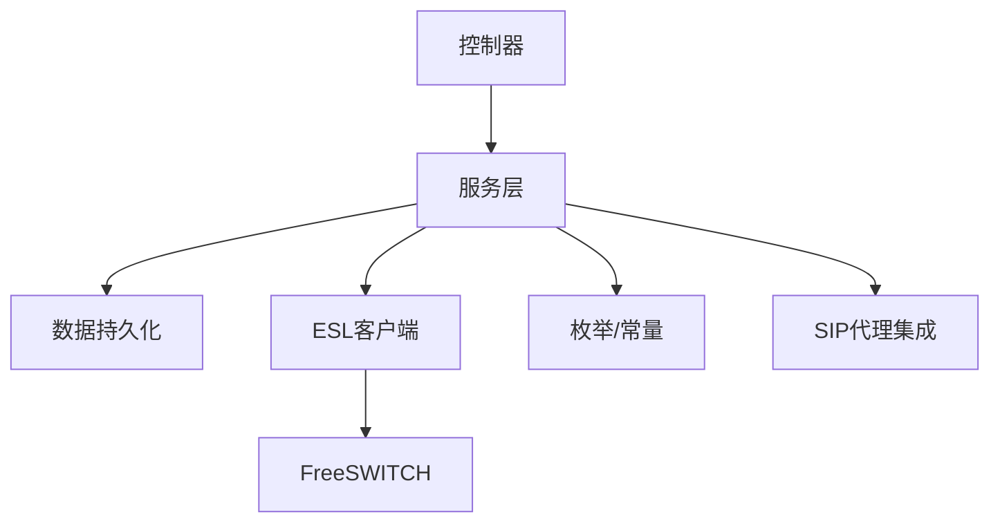
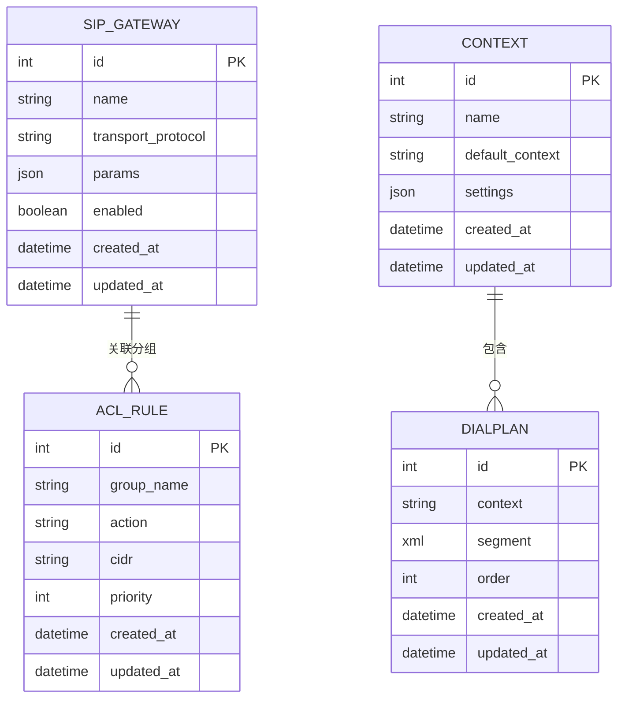

# 系统配置管理

<cite>
**本文引用的文件**
- [yudao-module-cc-server/src/main/java/cn/iocoder/yudao/module/cc/config/CcConfig.java](file://yudao-cloud/yudao-module-cc/yudao-module-cc-server/src/main/java/cn/iocoder/yudao/module/cc/config/CcConfig.java)
- [yudao-module-cc-server/src/main/java/cn/iocoder/yudao/module/cc/config/IpccSipProxyConfig.java](file://yudao-cloud/yudao-module-cc/yudao-module-cc-server/src/main/java/cn/iocoder/yudao/module/cc/config/IpccSipProxyConfig.java)
- [yudao-module-cc-server/src/main/java/cn/iocoder/yudao/module/cc/controller/admin/fs/FsGatewayController.java](file://yudao-cloud/yudao-module-cc/yudao-module-cc-server/src/main/java/cn/iocoder/yudao/module/cc/controller/admin/fs/FsGatewayController.java)
- [yudao-module-cc-server/src/main/java/cn/iocoder/yudao/module/cc/controller/admin/fs/FsAclController.java](file://yudao-cloud/yudao-module-cc/yudao-module-cc-server/src/main/java/cn/iocoder/yudao/module/cc/controller/admin/fs/FsAclController.java)
- [yudao-module-cc-server/src/main/java/cn/iocoder/yudao/module/cc/controller/admin/fs/FsDialplanController.java](file://yudao-cloud/yudao-module-cc/yudao-module-cc-server/src/main/java/cn/iocoder/yudao/module/cc/controller/admin/fs/FsDialplanController.java)
- [yudao-module-cc-server/src/main/java/cn/iocoder/yudao/module/cc/controller/admin/fs/FsContextController.java](file://yudao-cloud/yudao-module-cc/yudao-module-cc-server/src/main/java/cn/iocoder/yudao/module/cc/controller/admin/fs/FsContextController.java)
- [yudao-module-cc-server/src/main/java/cn/iocoder/yudao/module/cc/service/fs/FsGatewayService.java](file://yudao-cloud/yudao-module-cc/yudao-module-cc-server/src/main/java/cn/iocoder/yudao/module/cc/service/fs/FsGatewayService.java)
- [yudao-module-cc-server/src/main/java/cn/iocoder/yudao/module/cc/service/fs/FsAclService.java](file://yudao-cloud/yudao-module-cc/yudao-module-cc-server/src/main/java/cn/iocoder/yudao/module/cc/service/fs/FsAclService.java)
- [yudao-module-cc-server/src/main/java/cn/iocoder/yudao/module/cc/service/fs/FsDialplanService.java](file://yudao-cloud/yudao-module-cc/yudao-module-cc-server/src/main/java/cn/iocoder/yudao/module/cc/service/fs/FsDialplanService.java)
- [yudao-module-cc-server/src/main/java/cn/iocoder/yudao/module/cc/service/fs/FsContextService.java](file://yudao-cloud/yudao-module-cc/yudao-module-cc-server/src/main/java/cn/iocoder/yudao/module/cc/service/fs/FsContextService.java)
- [yudao-module-cc-server/src/main/java/cn/iocoder/yudao/module/cc/esl/client/FsClient.java](file://yudao-cloud/yudao-module-cc/yudao-module-cc-server/src/main/java/cn/iocoder/yudao/module/cc/esl/client/FsClient.java)
- [yudao-module-cc-server/src/main/java/cn/iocoder/yudao/module/cc/esl/handler/event/GatewayStatusEvent.java](file://yudao-cloud/yudao-module-cc/yudao-module-cc-server/src/main/java/cn/iocoder/yudao/module/cc/esl/handler/event/GatewayStatusEvent.java)
- [yudao-module-cc-server/src/main/java/cn/iocoder/yudao/module/cc/enums/SipTransportProtocolEnum.java](file://yudao-cloud/yudao-module-cc/yudao-module-cc-server/src/main/java/cn/iocoder/yudao/module/cc/enums/SipTransportProtocolEnum.java)
- [yudao-module-cc-server/src/main/java/cn/iocoder/yudao/module/cc/enums/SipGatewayParamEnum.java](file://yudao-cloud/yudao-module-cc/yudao-module-cc-server/src/main/java/cn/iocoder/yudao/module/cc/enums/SipGatewayParamEnum.java)
- [yudao-module-cc-server/src/main/java/cn/iocoder/yudao/module/cc/enums/SipGatewaySettingParamEnum.java](file://yudao-cloud/yudao-module-cc/yudao-module-cc-server/src/main/java/cn/iocoder/yudao/module/cc/enums/SipGatewaySettingParamEnum.java)
- [yudao-module-cc-server/src/main/java/cn/iocoder/yudao/module/cc/dal/dataobject/fs/SipGatewayDO.java](file://yudao-cloud/yudao-module-cc/yudao-module-cc-server/src/main/java/cn/iocoder/yudao/module/cc/dal/dataobject/fs/SipGatewayDO.java)
- [yudao-module-cc-server/src/main/java/cn/iocoder/yudao/module/cc/dal/dataobject/fs/AclRuleDO.java](file://yudao-cloud/yudao-module-cc/yudao-module-cc-server/src/main/java/cn/iocoder/yudao/module/cc/dal/dataobject/fs/AclRuleDO.java)
- [yudao-module-cc-server/src/main/java/cn/iocoder/yudao/module/cc/dal/dataobject/fs/DialplanDO.java](file://yudao-cloud/yudao-module-cc/yudao-module-cc-server/src/main/java/cn/iocoder/yudao/module/cc/dal/dataobject/fs/DialplanDO.java)
- [yudao-module-cc-server/src/main/java/cn/iocoder/yudao/module/cc/dal/dataobject/fs/ContextDO.java](file://yudao-cloud/yudao-module-cc/yudao-module-cc-server/src/main/java/cn/iocoder/yudao/module/cc/dal/dataobject/fs/ContextDO.java)
- [yudao-module-cc-server/src/main/java/cn/iocoder/yudao/module/cc/sipproxy/integration/CcGatewayProvider.java](file://yudao-cloud/yudao-module-cc/yudao-module-cc-server/src/main/java/cn/iocoder/yudao/module/cc/sipproxy/integration/CcGatewayProvider.java)
- [yudao-module-cc-server/src/main/java/cn/iocoder/yudao/module/cc/sipproxy/integration/CcFsNodeProvider.java](file://yudao-cloud/yudao-module-cc/yudao-module-cc-server/src/main/java/cn/iocoder/yudao/module/cc/sipproxy/integration/CcFsNodeProvider.java)
- [yudao-module-cc-server/src/main/java/cn/iocoder/yudao/module/cc/esl/constant/EslConstant.java](file://yudao-cloud/yudao-module-cc/yudao-module-cc-server/src/main/java/cn/iocoder/yudao/module/cc/esl/constant/EslConstant.java)
- [yudao-module-cc-server/src/main/java/cn/iocoder/yudao/module/cc/esl/constant/SectionNames.java](file://yudao-cloud/yudao-module-cc/yudao-module-cc-server/src/main/java/cn/iocoder/yudao/module/cc/esl/constant/SectionNames.java)
</cite>

## 目录
1. [简介](#简介)
2. [项目结构](#项目结构)
3. [核心组件](#核心组件)
4. [架构总览](#架构总览)
5. [详细组件分析](#详细组件分析)
6. [依赖关系分析](#依赖关系分析)
7. [性能考量](#性能考量)
8. [故障排查指南](#故障排查指南)
9. [结论](#结论)
10. [附录](#附录)

## 简介
本文件面向呼叫中心系统的“系统配置管理”能力，聚焦FreeSWITCH配置管理、ACL访问控制、SIP网关配置与状态监控、拨号计划与上下文管理、以及热重载机制。文档从架构到实现细节逐层展开，覆盖CRUD接口、配置校验、热重载流程，并提供单服务器、集群、多租户隔离等部署场景的配置示例与安全加固建议。

## 项目结构
本项目在yudao-module-cc模块中实现了与FreeSWITCH和SIP代理的集成：
- 控制器层：提供对FreeSWITCH网关、ACL、拨号计划、上下文的REST接口
- 服务层：封装业务逻辑、数据持久化、与FreeSWITCH的交互
- ESL客户端：通过ESL协议与FreeSWITCH通信，执行命令、订阅事件
- SIP代理集成：将网关、节点信息暴露给sipproxy，支撑SIP路由与注册
- 枚举与常量：统一参数、传输协议、事件名称、XML段名等

**图示来源**
- [FsGatewayController.java](file://yudao-cloud/yudao-module-cc/yudao-module-cc-server/src/main/java/cn/iocoder/yudao/module/cc/controller/admin/fs/FsGatewayController.java)
- [FsAclController.java](file://yudao-cloud/yudao-module-cc/yudao-module-cc-server/src/main/java/cn/iocoder/yudao/module/cc/controller/admin/fs/FsAclController.java)
- [FsDialplanController.java](file://yudao-cloud/yudao-module-cc/yudao-module-cc-server/src/main/java/cn/iocoder/yudao/module/cc/controller/admin/fs/FsDialplanController.java)
- [FsContextController.java](file://yudao-cloud/yudao-module-cc/yudao-module-cc-server/src/main/java/cn/iocoder/yudao/module/cc/controller/admin/fs/FsContextController.java)
- [FsGatewayService.java](file://yudao-cloud/yudao-module-cc/yudao-module-cc-server/src/main/java/cn/iocoder/yudao/module/cc/service/fs/FsGatewayService.java)
- [FsAclService.java](file://yudao-cloud/yudao-module-cc/yudao-module-cc-server/src/main/java/cn/iocoder/yudao/module/cc/service/fs/FsAclService.java)
- [FsDialplanService.java](file://yudao-cloud/yudao-module-cc/yudao-module-cc-server/src/main/java/cn/iocoder/yudao/module/cc/service/fs/FsDialplanService.java)
- [FsContextService.java](file://yudao-cloud/yudao-module-cc/yudao-module-cc-server/src/main/java/cn/iocoder/yudao/module/cc/service/fs/FsContextService.java)
- [FsClient.java](file://yudao-cloud/yudao-module-cc/yudao-module-cc-server/src/main/java/cn/iocoder/yudao/module/cc/esl/client/FsClient.java)
- [CcGatewayProvider.java](file://yudao-cloud/yudao-module-cc/yudao-module-cc-server/src/main/java/cn/iocoder/yudao/module/cc/sipproxy/integration/CcGatewayProvider.java)
- [CcFsNodeProvider.java](file://yudao-cloud/yudao-module-cc/yudao-module-cc-server/src/main/java/cn/iocoder/yudao/module/cc/sipproxy/integration/CcFsNodeProvider.java)

**章节来源**
- [FsGatewayController.java](file://yudao-cloud/yudao-module-cc/yudao-module-cc-server/src/main/java/cn/iocoder/yudao/module/cc/controller/admin/fs/FsGatewayController.java)
- [FsAclController.java](file://yudao-cloud/yudao-module-cc/yudao-module-cc-server/src/main/java/cn/iocoder/yudao/module/cc/controller/admin/fs/FsAclController.java)
- [FsDialplanController.java](file://yudao-cloud/yudao-module-cc/yudao-module-cc-server/src/main/java/cn/iocoder/yudao/module/cc/controller/admin/fs/FsDialplanController.java)
- [FsContextController.java](file://yudao-cloud/yudao-module-cc/yudao-module-cc-server/src/main/java/cn/iocoder/yudao/module/cc/controller/admin/fs/FsContextController.java)
- [FsGatewayService.java](file://yudao-cloud/yudao-module-cc/yudao-module-cc-server/src/main/java/cn/iocoder/yudao/module/cc/service/fs/FsGatewayService.java)
- [FsAclService.java](file://yudao-cloud/yudao-module-cc/yudao-module-cc-server/src/main/java/cn/iocoder/yudao/module/cc/service/fs/FsAclService.java)
- [FsDialplanService.java](file://yudao-cloud/yudao-module-cc/yudao-module-cc-server/src/main/java/cn/iocoder/yudao/module/cc/service/fs/FsDialplanService.java)
- [FsContextService.java](file://yudao-cloud/yudao-module-cc/yudao-module-cc-server/src/main/java/cn/iocoder/yudao/module/cc/service/fs/FsContextService.java)
- [FsClient.java](file://yudao-cloud/yudao-module-cc/yudao-module-cc-server/src/main/java/cn/iocoder/yudao/module/cc/esl/client/FsClient.java)
- [CcGatewayProvider.java](file://yudao-cloud/yudao-module-cc/yudao-module-cc-server/src/main/java/cn/iocoder/yudao/module/cc/sipproxy/integration/CcGatewayProvider.java)
- [CcFsNodeProvider.java](file://yudao-cloud/yudao-module-cc/yudao-module-cc-server/src/main/java/cn/iocoder/yudao/module/cc/sipproxy/integration/CcFsNodeProvider.java)

## 核心组件
- FreeSWITCH网关管理：定义SIP网关参数、传输协议、认证方式、主备策略、健康检查等；提供CRUD与校验、热重载
- ACL规则管理：支持白名单/黑名单、网段匹配、优先级、分组；提供CRUD与批量应用
- 拨号计划与上下文：以XML片段或结构化配置描述路由规则；支持上下文切换、条件分支、变量注入
- ESL通信：通过ESL连接FreeSWITCH，执行reloadxml、mod_sofia reload等命令，并订阅网关状态事件
- SIP代理集成：将网关与节点信息暴露给sipproxy，用于SIP注册与路由决策

**章节来源**
- [SipGatewayParamEnum.java](file://yudao-cloud/yudao-module-cc/yudao-module-cc-server/src/main/java/cn/iocoder/yudao/module/cc/enums/SipGatewayParamEnum.java)
- [SipGatewaySettingParamEnum.java](file://yudao-cloud/yudao-module-cc/yudao-module-cc-server/src/main/java/cn/iocoder/yudao/module/cc/enums/SipGatewaySettingParamEnum.java)
- [SipTransportProtocolEnum.java](file://yudao-cloud/yudao-module-cc/yudao-module-cc-server/src/main/java/cn/iocoder/yudao/module/cc/enums/SipTransportProtocolEnum.java)
- [EslConstant.java](file://yudao-cloud/yudao-module-cc/yudao-module-cc-server/src/main/java/cn/iocoder/yudao/module/cc/esl/constant/EslConstant.java)
- [SectionNames.java](file://yudao-cloud/yudao-module-cc/yudao-module-cc-server/src/main/java/cn/iocoder/yudao/module/cc/esl/constant/SectionNames.java)

## 架构总览
下图展示了从管理端到FreeSWITCH与SIP代理的整体调用链：

**图示来源**
- [FsGatewayController.java](file://yudao-cloud/yudao-module-cc/yudao-module-cc-server/src/main/java/cn/iocoder/yudao/module/cc/controller/admin/fs/FsGatewayController.java)
- [FsAclController.java](file://yudao-cloud/yudao-module-cc/yudao-module-cc-server/src/main/java/cn/iocoder/yudao/module/cc/controller/admin/fs/FsAclController.java)
- [FsDialplanController.java](file://yudao-cloud/yudao-module-cc/yudao-module-cc-server/src/main/java/cn/iocoder/yudao/module/cc/controller/admin/fs/FsDialplanController.java)
- [FsContextController.java](file://yudao-cloud/yudao-module-cc/yudao-module-cc/server/src/main/java/cn/iocoder/yudao/module/cc/controller/admin/fs/FsContextController.java)
- [FsGatewayService.java](file://yudao-cloud/yudao-module-cc/yudao-module-cc-server/src/main/java/cn/iocoder/yudao/module/cc/service/fs/FsGatewayService.java)
- [FsAclService.java](file://yudao-cloud/yudao-module-cc/yudao-module-cc-server/src/main/java/cn/iocoder/yudao/module/cc/service/fs/FsAclService.java)
- [FsDialplanService.java](file://yudao-cloud/yudao-module-cc/yudao-module-cc-server/src/main/java/cn/iocoder/yudao/module/cc/service/fs/FsDialplanService.java)
- [FsContextService.java](file://yudao-cloud/yudao-module-cc/yudao-module-cc-server/src/main/java/cn/iocoder/yudao/module/cc/service/fs/FsContextService.java)
- [FsClient.java](file://yudao-cloud/yudao-module-cc/yudao-module-cc-server/src/main/java/cn/iocoder/yudao/module/cc/esl/client/FsClient.java)
- [CcGatewayProvider.java](file://yudao-cloud/yudao-module-cc/yudao-module-cc-server/src/main/java/cn/iocoder/yudao/module/cc/sipproxy/integration/CcGatewayProvider.java)
- [CcFsNodeProvider.java](file://yudao-cloud/yudao-module-cc/yudao-module-cc-server/src/main/java/cn/iocoder/yudao/module/cc/sipproxy/integration/CcFsNodeProvider.java)

## 详细组件分析

### FreeSWITCH网关配置管理
- 功能要点
  - 网关参数：传输协议、认证、主备、超时、重试、SIP头处理等
  - 配置校验：必填项、格式校验、冲突检测（如端口重复）
  - 热重载：通过ESL触发FreeSWITCH重新加载SIP网关配置
  - 状态监控：订阅网关状态事件，维护在线/离线状态
- 关键类与方法
  - 控制器：网关CRUD、校验、重载入口
  - 服务层：参数组装、校验、持久化、ESL命令编排
  - ESL客户端：执行reloadxml、mod_sofia reload、查询状态
  - 事件处理器：解析网关上线/下线事件，更新缓存/数据库

**图示来源**
- [FsGatewayController.java](file://yudao-cloud/yudao-module-cc/yudao-module-cc-server/src/main/java/cn/iocoder/yudao/module/cc/controller/admin/fs/FsGatewayController.java)
- [FsGatewayService.java](file://yudao-cloud/yudao-module-cc/yudao-module-cc-server/src/main/java/cn/iocoder/yudao/module/cc/service/fs/FsGatewayService.java)
- [FsClient.java](file://yudao-cloud/yudao-module-cc/yudao-module-cc-server/src/main/java/cn/iocoder/yudao/module/cc/esl/client/FsClient.java)
- [GatewayStatusEvent.java](file://yudao-cloud/yudao-module-cc/yudao-module-cc-server/src/main/java/cn/iocoder/yudao/module/cc/esl/handler/event/GatewayStatusEvent.java)

**章节来源**
- [FsGatewayController.java](file://yudao-cloud/yudao-module-cc/yudao-module-cc-server/src/main/java/cn/iocoder/yudao/module/cc/controller/admin/fs/FsGatewayController.java)
- [FsGatewayService.java](file://yudao-cloud/yudao-module-cc/yudao-module-cc-server/src/main/java/cn/iocoder/yudao/module/cc/service/fs/FsGatewayService.java)
- [FsClient.java](file://yudao-cloud/yudao-module-cc/yudao-module-cc-server/src/main/java/cn/iocoder/yudao/module/cc/esl/client/FsClient.java)
- [GatewayStatusEvent.java](file://yudao-cloud/yudao-module-cc/yudao-module-cc-server/src/main/java/cn/iocoder/yudao/module/cc/esl/handler/event/GatewayStatusEvent.java)
- [SipGatewayParamEnum.java](file://yudao-cloud/yudao-module-cc/yudao-module-cc-server/src/main/java/cn/iocoder/yudao/module/cc/enums/SipGatewayParamEnum.java)
- [SipGatewaySettingParamEnum.java](file://yudao-cloud/yudao-module-cc/yudao-module-cc-server/src/main/java/cn/iocoder/yudao/module/cc/enums/SipGatewaySettingParamEnum.java)
- [SipTransportProtocolEnum.java](file://yudao-cloud/yudao-module-cc/yudao-module-cc-server/src/main/java/cn/iocoder/yudao/module/cc/enums/SipTransportProtocolEnum.java)

### ACL访问控制管理
- 功能要点
  - 规则类型：允许/拒绝、网段匹配、优先级、分组
  - 批量应用：按上下文或网关批量下发规则
  - 冲突检测：同组内规则优先级与匹配顺序
- 关键类与方法
  - 控制器：ACL CRUD、批量应用、校验
  - 服务层：规则合并、排序、冲突检测、下发至FreeSWITCH
  - ESL客户端：reloadxml或对应模块重载

**图示来源**
- [FsAclController.java](file://yudao-cloud/yudao-module-cc/yudao-module-cc-server/src/main/java/cn/iocoder/yudao/module/cc/controller/admin/fs/FsAclController.java)
- [FsAclService.java](file://yudao-cloud/yudao-module-cc/yudao-module-cc-server/src/main/java/cn/iocoder/yudao/module/cc/service/fs/FsAclService.java)
- [FsClient.java](file://yudao-cloud/yudao-module-cc/yudao-module-cc-server/src/main/java/cn/iocoder/yudao/module/cc/esl/client/FsClient.java)

**章节来源**
- [FsAclController.java](file://yudao-cloud/yudao-module-cc/yudao-module-cc-server/src/main/java/cn/iocoder/yudao/module/cc/controller/admin/fs/FsAclController.java)
- [FsAclService.java](file://yudao-cloud/yudao-module-cc/yudao-module-cc-server/src/main/java/cn/iocoder/yudao/module/cc/service/fs/FsAclService.java)
- [FsClient.java](file://yudao-cloud/yudao-module-cc/yudao-module-cc-server/src/main/java/cn/iocoder/yudao/module/cc/esl/client/FsClient.java)

### 拨号计划与上下文管理
- 功能要点
  - 拨号计划：以XML片段或结构化对象描述路由规则、IVR流程、变量设置
  - 上下文：定义路由边界、默认行为、继承关系
  - 热重载：修改后触发reloadxml使新规则生效
- 关键类与方法
  - 控制器：拨号计划与上下文的CRUD、校验、重载
  - 服务层：生成XML片段、校验语法、组织上下文树、下发重载
  - ESL客户端：执行reloadxml

**图示来源**
- [FsDialplanController.java](file://yudao-cloud/yudao-module-cc/yudao-module-cc-server/src/main/java/cn/iocoder/yudao/module/cc/controller/admin/fs/FsDialplanController.java)
- [FsDialplanService.java](file://yudao-cloud/yudao-module-cc/yudao-module-cc-server/src/main/java/cn/iocoder/yudao/module/cc/service/fs/FsDialplanService.java)
- [FsContextController.java](file://yudao-cloud/yudao-module-cc/yudao-module-cc-server/src/main/java/cn/iocoder/yudao/module/cc/controller/admin/fs/FsContextController.java)
- [FsContextService.java](file://yudao-cloud/yudao-module-cc/yudao-module-cc-server/src/main/java/cn/iocoder/yudao/module/cc/service/fs/FsContextService.java)
- [FsClient.java](file://yudao-cloud/yudao-module-cc/yudao-module-cc-server/src/main/java/cn/iocoder/yudao/module/cc/esl/client/FsClient.java)

**章节来源**
- [FsDialplanController.java](file://yudao-cloud/yudao-module-cc/yudao-module-cc-server/src/main/java/cn/iocoder/yudao/module/cc/controller/admin/fs/FsDialplanController.java)
- [FsDialplanService.java](file://yudao-cloud/yudao-module-cc/yudao-module-cc-server/src/main/java/cn/iocoder/yudao/module/cc/service/fs/FsDialplanService.java)
- [FsContextController.java](file://yudao-cloud/yudao-module-cc/yudao-module-cc-server/src/main/java/cn/iocoder/yudao/module/cc/controller/admin/fs/FsContextController.java)
- [FsContextService.java](file://yudao-cloud/yudao-module-cc/yudao-module-cc-server/src/main/java/cn/iocoder/yudao/module/cc/service/fs/FsContextService.java)
- [FsClient.java](file://yudao-cloud/yudao-module-cc/yudao-module-cc-server/src/main/java/cn/iocoder/yudao/module/cc/esl/client/FsClient.java)

### 配置校验与热重载接口
- 配置校验接口
  - 输入：网关/ACL/拨号计划/上下文配置对象
  - 输出：校验结果（通过/失败及原因）
  - 职责：字段校验、格式校验、冲突检测、依赖检查
- 热重载接口
  - 输入：目标配置ID或范围
  - 输出：重载结果（成功/失败及日志）
  - 职责：生成配置片段、下发至FreeSWITCH、记录审计日志

**图示来源**
- [FsGatewayController.java](file://yudao-cloud/yudao-module-cc/yudao-module-cc-server/src/main/java/cn/iocoder/yudao/module/cc/controller/admin/fs/FsGatewayController.java)
- [FsAclController.java](file://yudao-cloud/yudao-module-cc/yudao-module-cc-server/src/main/java/cn/iocoder/yudao/module/cc/controller/admin/fs/FsAclController.java)
- [FsDialplanController.java](file://yudao-cloud/yudao-module-cc/yudao-module-cc-server/src/main/java/cn/iocoder/yudao/module/cc/controller/admin/fs/FsDialplanController.java)
- [FsContextController.java](file://yudao-cloud/yudao-module-cc/yudao-module-cc-server/src/main/java/cn/iocoder/yudao/module/cc/controller/admin/fs/FsContextController.java)
- [FsClient.java](file://yudao-cloud/yudao-module-cc/yudao-module-cc-server/src/main/java/cn/iocoder/yudao/module/cc/esl/client/FsClient.java)

**章节来源**
- [FsGatewayController.java](file://yudao-cloud/yudao-module-cc/yudao-module-cc-server/src/main/java/cn/iocoder/yudao/module/cc/controller/admin/fs/FsGatewayController.java)
- [FsAclController.java](file://yudao-cloud/yudao-module-cc/yudao-module-cc-server/src/main/java/cn/iocoder/yudao/module/cc/controller/admin/fs/FsAclController.java)
- [FsDialplanController.java](file://yudao-cloud/yudao-module-cc/yudao-module-cc-server/src/main/java/cn/iocoder/yudao/module/cc/controller/admin/fs/FsDialplanController.java)
- [FsContextController.java](file://yudao-cloud/yudao-module-cc/yudao-module-cc-server/src/main/java/cn/iocoder/yudao/module/cc/controller/admin/fs/FsContextController.java)
- [FsClient.java](file://yudao-cloud/yudao-module-cc/yudao-module-cc-server/src/main/java/cn/iocoder/yudao/module/cc/esl/client/FsClient.java)

### 与SIP代理的集成
- 网关与节点提供者：将网关与FS节点信息暴露给sipproxy，用于SIP注册与路由
- 拦截器与鉴权：可定制SIP消息拦截与WebSocket握手鉴权
- 作用：统一管理SIP接入点，避免分散配置导致不一致

**图示来源**
- [CcGatewayProvider.java](file://yudao-cloud/yudao-module-cc/yudao-module-cc-server/src/main/java/cn/iocoder/yudao/module/cc/sipproxy/integration/CcGatewayProvider.java)
- [CcFsNodeProvider.java](file://yudao-cloud/yudao-module-cc/yudao-module-cc-server/src/main/java/cn/iocoder/yudao/module/cc/sipproxy/integration/CcFsNodeProvider.java)

**章节来源**
- [CcGatewayProvider.java](file://yudao-cloud/yudao-module-cc/yudao-module-cc-server/src/main/java/cn/iocoder/yudao/module/cc/sipproxy/integration/CcGatewayProvider.java)
- [CcFsNodeProvider.java](file://yudao-cloud/yudao-module-cc/yudao-module-cc-server/src/main/java/cn/iocoder/yudao/module/cc/sipproxy/integration/CcFsNodeProvider.java)

## 依赖关系分析
- 控制器依赖服务层，服务层依赖数据持久化与ESL客户端
- ESL客户端依赖FreeSWITCH事件与命令接口
- SIP代理集成依赖网关与节点提供者
- 枚举与常量贯穿各层，保证一致性

**图示来源**
- [FsGatewayController.java](file://yudao-cloud/yudao-module-cc/yudao-module-cc-server/src/main/java/cn/iocoder/yudao/module/cc/controller/admin/fs/FsGatewayController.java)
- [FsAclController.java](file://yudao-cloud/yudao-module-cc/yudao-module-cc-server/src/main/java/cn/iocoder/yudao/module/cc/controller/admin/fs/FsAclController.java)
- [FsDialplanController.java](file://yudao-cloud/yudao-module-cc/yudao-module-cc-server/src/main/java/cn/iocoder/yudao/module/cc/controller/admin/fs/FsDialplanController.java)
- [FsContextController.java](file://yudao-cloud/yudao-module-cc/yudao-module-cc-server/src/main/java/cn/iocoder/yudao/module/cc/controller/admin/fs/FsContextController.java)
- [FsGatewayService.java](file://yudao-cloud/yudao-module-cc/yudao-module-cc-server/src/main/java/cn/iocoder/yudao/module/cc/service/fs/FsGatewayService.java)
- [FsAclService.java](file://yudao-cloud/yudao-module-cc/yudao-module-cc-server/src/main/java/cn/iocoder/yudao/module/cc/service/fs/FsAclService.java)
- [FsDialplanService.java](file://yudao-cloud/yudao-module-cc/yudao-module-cc-server/src/main/java/cn/iocoder/yudao/module/cc/service/fs/FsDialplanService.java)
- [FsContextService.java](file://yudao-cloud/yudao-module-cc/yudao-module-cc-server/src/main/java/cn/iocoder/yudao/module/cc/service/fs/FsContextService.java)
- [FsClient.java](file://yudao-cloud/yudao-module-cc/yudao-module-cc-server/src/main/java/cn/iocoder/yudao/module/cc/esl/client/FsClient.java)
- [SipTransportProtocolEnum.java](file://yudao-cloud/yudao-module-cc/yudao-module-cc-server/src/main/java/cn/iocoder/yudao/module/cc/enums/SipTransportProtocolEnum.java)
- [SipGatewayParamEnum.java](file://yudao-cloud/yudao-module-cc/yudao-module-cc-server/src/main/java/cn/iocoder/yudao/module/cc/enums/SipGatewayParamEnum.java)
- [SipGatewaySettingParamEnum.java](file://yudao-cloud/yudao-module-cc/yudao-module-cc-server/src/main/java/cn/iocoder/yudao/module/cc/enums/SipGatewaySettingParamEnum.java)

**章节来源**
- [FsGatewayService.java](file://yudao-cloud/yudao-module-cc/yudao-module-cc-server/src/main/java/cn/iocoder/yudao/module/cc/service/fs/FsGatewayService.java)
- [FsAclService.java](file://yudao-cloud/yudao-module-cc/yudao-module-cc-server/src/main/java/cn/iocoder/yudao/module/cc/service/fs/FsAclService.java)
- [FsDialplanService.java](file://yudao-cloud/yudao-module-cc/yudao-module-cc-server/src/main/java/cn/iocoder/yudao/module/cc/service/fs/FsDialplanService.java)
- [FsContextService.java](file://yudao-cloud/yudao-module-cc/yudao-module-cc-server/src/main/java/cn/iocoder/yudao/module/cc/service/fs/FsContextService.java)
- [FsClient.java](file://yudao-cloud/yudao-module-cc/yudao-module-cc-server/src/main/java/cn/iocoder/yudao/module/cc/esl/client/FsClient.java)
- [SipTransportProtocolEnum.java](file://yudao-cloud/yudao-module-cc/yudao-module-cc-server/src/main/java/cn/iocoder/yudao/module/cc/enums/SipTransportProtocolEnum.java)
- [SipGatewayParamEnum.java](file://yudao-cloud/yudao-module-cc/yudao-module-cc-server/src/main/java/cn/iocoder/yudao/module/cc/enums/SipGatewayParamEnum.java)
- [SipGatewaySettingParamEnum.java](file://yudao-cloud/yudao-module-cc/yudao-module-cc-server/src/main/java/cn/iocoder/yudao/module/cc/enums/SipGatewaySettingParamEnum.java)

## 性能考量
- 热重载频率控制：批量变更时合并重载，避免频繁reloadxml影响性能
- ESL连接池与超时：合理设置连接数、超时与重试策略，避免阻塞
- 事件处理异步化：网关状态事件异步处理，减少主线程压力
- 配置缓存：热点配置（如ACL、拨号计划片段）可缓存以提升读取性能
- 并发安全：对共享资源加锁，防止并发写导致的配置不一致

[本节为通用指导，不直接分析具体文件]

## 故障排查指南
- 配置冲突
  - 现象：重载失败或路由异常
  - 排查：检查ACL优先级、拨号计划匹配顺序、网关端口冲突
  - 解决：调整优先级、修正冲突项、回滚到上一版本
- 服务重启
  - 现象：配置未生效或会话中断
  - 排查：确认reloadxml是否成功、FreeSWITCH日志是否有错误
  - 解决：分批次重载、先灰度再全量
- 安全加固
  - 建议：限制ESL访问源、启用SIP认证、最小权限原则、审计日志
  - 工具：结合防火墙与WAF，限制SIP端口暴露面
- 常见问题定位
  - 网关状态：查看网关状态事件，确认注册与心跳
  - 拨号计划：核对XML片段语法与上下文继承关系
  - ACL规则：检查网段匹配与优先级

**章节来源**
- [GatewayStatusEvent.java](file://yudao-cloud/yudao-module-cc/yudao-module-cc-server/src/main/java/cn/iocoder/yudao/module/cc/esl/handler/event/GatewayStatusEvent.java)
- [FsClient.java](file://yudao-cloud/yudao-module-cc/yudao-module-cc-server/src/main/java/cn/iocoder/yudao/module/cc/esl/client/FsClient.java)
- [EslConstant.java](file://yudao-cloud/yudao-module-cc/yudao-module-cc-server/src/main/java/cn/iocoder/yudao/module/cc/esl/constant/EslConstant.java)
- [SectionNames.java](file://yudao-cloud/yudao-module-cc/yudao-module-cc-server/src/main/java/cn/iocoder/yudao/module/cc/esl/constant/SectionNames.java)

## 结论
本系统通过控制器-服务-ESL的分层架构，实现了对FreeSWITCH网关、ACL、拨号计划与上下文的集中化管理与热重载。配合SIP代理集成，提供了统一的SIP接入与路由能力。通过严格的配置校验、事件驱动的状态监控与合理的性能优化策略，保障了生产环境的稳定性与安全性。

[本节为总结性内容，不直接分析具体文件]

## 附录

### 部署场景配置示例
- 单服务器部署
  - 特点：单一FreeSWITCH实例，所有配置集中管理
  - 建议：开启最小权限ESL访问、启用SIP认证、定期备份配置
- 集群部署
  - 特点：多FreeSWITCH实例，需保证配置一致性与负载均衡
  - 建议：使用配置中心或GitOps同步配置，分批重载，灰度发布
- 多租户隔离
  - 特点：不同租户独立上下文与ACL规则
  - 建议：按租户划分上下文、ACL分组、网关命名空间，严格权限控制

[本节为概念性内容，不直接分析具体文件]

### 数据模型概览

**图示来源**
- [SipGatewayDO.java](file://yudao-cloud/yudao-module-cc/yudao-module-cc-server/src/main/java/cn/iocoder/yudao/module/cc/dal/dataobject/fs/SipGatewayDO.java)
- [AclRuleDO.java](file://yudao-cloud/yudao-module-cc/yudao-module-cc-server/src/main/java/cn/iocoder/yudao/module/cc/dal/dataobject/fs/AclRuleDO.java)
- [DialplanDO.java](file://yudao-cloud/yudao-module-cc/yudao-module-cc-server/src/main/java/cn/iocoder/yudao/module/cc/dal/dataobject/fs/DialplanDO.java)
- [ContextDO.java](file://yudao-cloud/yudao-module-cc/yudao-module-cc-server/src/main/java/cn/iocoder/yudao/module/cc/dal/dataobject/fs/ContextDO.java)