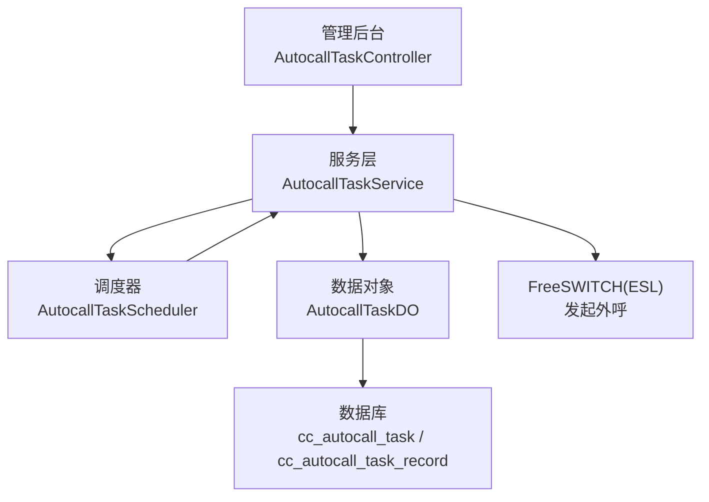
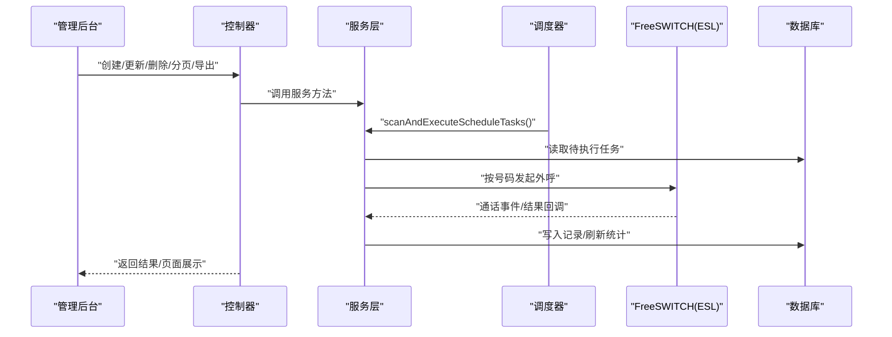
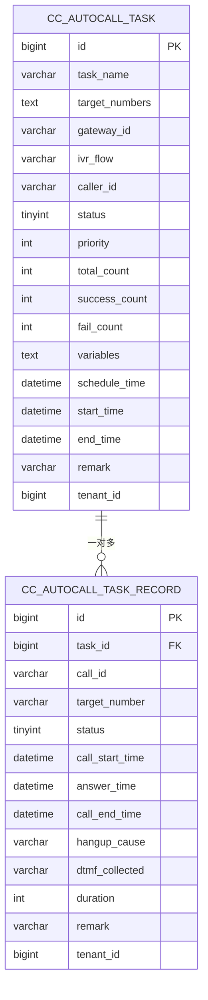
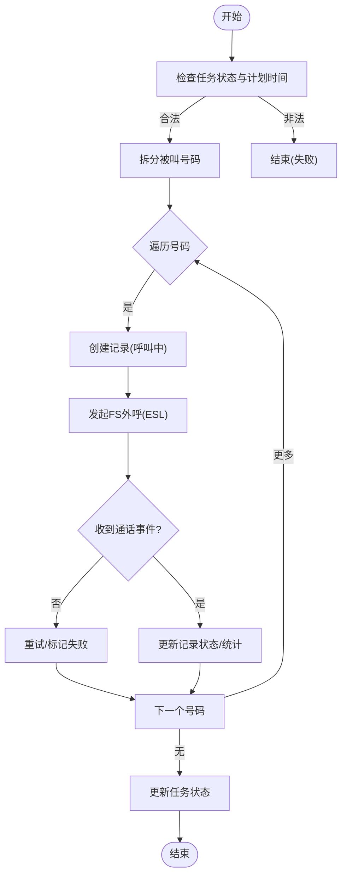
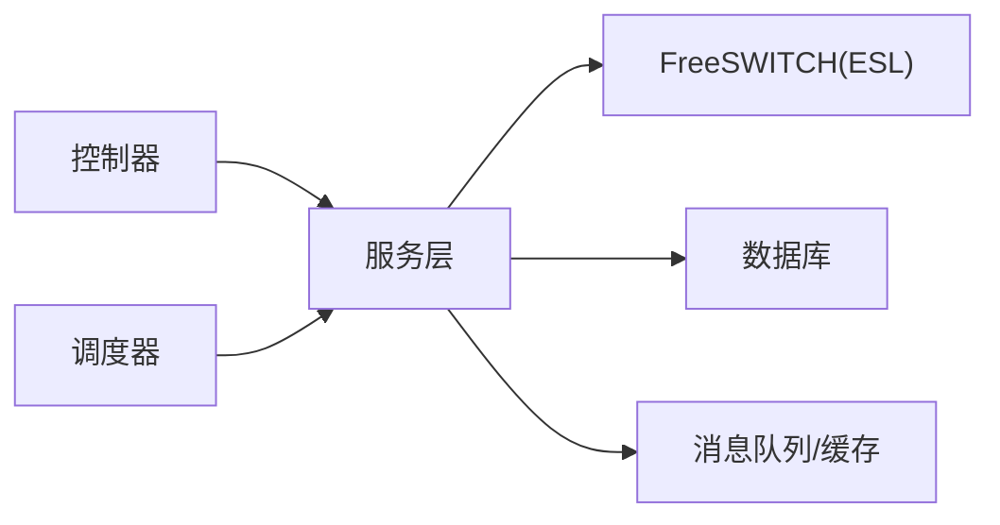

# 自动外呼系统

<cite>
**本文引用的文件**
- [AutocallTaskController.java](file://yudao-cloud/yudao-module-cc/yudao-module-cc-server/src/main/java/cn/iocoder/yudao/module/cc/controller/admin/autocall/AutocallTaskController.java)
- [AutocallTaskService.java](file://yudao-cloud/yudao-module-cc/yudao-module-cc-server/src/main/java/cn/iocoder/yudao/module/cc/service/autocall/AutocallTaskService.java)
- [AutocallTaskScheduler.java](file://yudao-cloud/yudao-module-cc/yudao-module-cc-server/src/main/java/cn/iocoder/yudao/module/cc/service/autocall/AutocallTaskScheduler.java)
- [AutocallTaskDO.java](file://yudao-cloud/yudao-module-cc/yudao-module-cc-server/src/main/java/cn/iocoder/yudao/module/cc/dal/dataobject/autocall/AutocallTaskDO.java)
- [autocall_task.sql](file://yudao-cloud/yudao-module-cc/doc/sql/autocall_task.sql)
- [README.md](file://yudao-cloud/README.md)
</cite>

## 目录
1. [简介](#简介)
2. [项目结构](#项目结构)
3. [核心组件](#核心组件)
4. [架构总览](#架构总览)
5. [详细组件分析](#详细组件分析)
6. [依赖关系分析](#依赖关系分析)
7. [性能与高并发](#性能与高并发)
8. [故障排查指南](#故障排查指南)
9. [结论](#结论)
10. [附录：API 设计](#附录api-设计)

## 简介
本系统提供“自动外呼”能力，支持通过管理后台创建、配置并执行外呼任务；具备定时调度、号码批量导入（以逗号分隔）、任务状态监控与统计刷新等能力。系统基于 Spring Cloud 微服务架构，结合 FreeSWITCH（通过 ESL）完成实际拨号，使用数据库持久化任务与记录，并通过消息队列/缓存等基础设施支撑高并发与可观测性。

## 项目结构
围绕“自动外呼”的核心代码位于呼叫中心模块中，主要包含控制器、服务层、数据对象与 SQL 脚本：
- 控制器：对外暴露外呼任务的 CRUD、执行、暂停、取消、刷新统计等接口
- 服务层：封装任务生命周期管理、调度扫描入口、执行流程编排
- 数据对象：映射外呼任务表字段
- SQL：定义外呼任务表与记录表结构，以及菜单权限初始化

图表来源
- [AutocallTaskController.java:30-143](file://yudao-cloud/yudao-module-cc/yudao-module-cc-server/src/main/java/cn/iocoder/yudao/module/cc/controller/admin/autocall/AutocallTaskController.java#L30-L143)
- [AutocallTaskService.java:11-103](file://yudao-cloud/yudao-module-cc/yudao-module-cc-server/src/main/java/cn/iocoder/yudao/module/cc/service/autocall/AutocallTaskService.java#L11-L103)
- [AutocallTaskScheduler.java:8-40](file://yudao-cloud/yudao-module-cc/yudao-module-cc-server/src/main/java/cn/iocoder/yudao/module/cc/service/autocall/AutocallTaskScheduler.java#L8-L40)
- [AutocallTaskDO.java:11-92](file://yudao-cloud/yudao-module-cc/yudao-module-cc-server/src/main/java/cn/iocoder/yudao/module/cc/dal/dataobject/autocall/AutocallTaskDO.java#L11-L92)
- [autocall_task.sql:7-66](file://yudao-cloud/yudao-module-cc/doc/sql/autocall_task.sql#L7-L66)

章节来源
- [README.md:39-64](file://yudao-cloud/README.md#L39-L64)

## 核心组件
- 控制器 AutocallTaskController：提供外呼任务的创建、更新、删除、分页查询、导出、立即执行、暂停、取消、刷新统计等 REST 接口
- 服务 AutocallTaskService：定义任务生命周期与执行编排的抽象，包括创建、更新、删除、分页、执行、暂停、取消、刷新统计、调度扫描入口
- 调度器 AutocallTaskScheduler：基于 @Scheduled 定时扫描到期且待执行的任务，调用服务层执行
- 数据模型 AutocallTaskDO：映射外呼任务表，包含任务名称、被叫号码列表、网关ID、IVR流程、主叫号码、状态、优先级、统计计数、业务变量、计划/实际时间等

章节来源
- [AutocallTaskController.java:30-143](file://yudao-cloud/yudao-module-cc/yudao-module-cc-server/src/main/java/cn/iocoder/yudao/module/cc/controller/admin/autocall/AutocallTaskController.java#L30-L143)
- [AutocallTaskService.java:11-103](file://yudao-cloud/yudao-module-cc/yudao-module-cc-server/src/main/java/cn/iocoder/yudao/module/cc/service/autocall/AutocallTaskService.java#L11-L103)
- [AutocallTaskScheduler.java:8-40](file://yudao-cloud/yudao-module-cc/yudao-module-cc-server/src/main/java/cn/iocoder/yudao/module/cc/service/autocall/AutocallTaskScheduler.java#L8-L40)
- [AutocallTaskDO.java:11-92](file://yudao-cloud/yudao-module-cc/yudao-module-cc-server/src/main/java/cn/iocoder/yudao/module/cc/dal/dataobject/autocall/AutocallTaskDO.java#L11-L92)

## 架构总览
自动外呼的整体流程如下：
- 管理后台通过控制器创建/更新/删除任务，或分页查询与导出
- 调度器每 30 秒扫描一次，将“待执行”且已到期的任务交由服务层执行
- 服务层根据任务配置拆分号码，生成任务记录，逐条发起 FreeSWITCH 外呼（通过 ESL）
- 通话结果回写至任务记录表，并刷新任务统计

图表来源
- [AutocallTaskController.java:30-143](file://yudao-cloud/yudao-module-cc/yudao-module-cc-server/src/main/java/cn/iocoder/yudao/module/cc/controller/admin/autocall/AutocallTaskController.java#L30-L143)
- [AutocallTaskService.java:11-103](file://yudao-cloud/yudao-module-cc/yudao-module-cc-server/src/main/java/cn/iocoder/yudao/module/cc/service/autocall/AutocallTaskService.java#L11-L103)
- [AutocallTaskScheduler.java:8-40](file://yudao-cloud/yudao-module-cc/yudao-module-cc-server/src/main/java/cn/iocoder/yudao/module/cc/service/autocall/AutocallTaskScheduler.java#L8-L40)
- [autocall_task.sql:7-66](file://yudao-cloud/yudao-module-cc/doc/sql/autocall_task.sql#L7-L66)

## 详细组件分析

### 控制器：外呼任务管理 API
- 功能要点
  - 创建/更新/删除/批量删除：受权限控制，参数校验后委托服务层处理
  - 详情/分页：返回 VO，内部转换 DO
  - 导出 Excel：按查询条件导出全量数据
  - 立即执行/暂停/取消：触发任务状态流转
  - 刷新统计：根据记录重新计算成功/失败/总数
- 安全与日志
  - 使用权限注解进行访问控制
  - 导出操作记录访问日志

章节来源
- [AutocallTaskController.java:30-143](file://yudao-cloud/yudao-module-cc/yudao-module-cc-server/src/main/java/cn/iocoder/yudao/module/cc/controller/admin/autocall/AutocallTaskController.java#L30-L143)

### 服务层：任务生命周期与执行编排
- 能力边界
  - 创建/更新/删除：维护任务配置与状态
  - 分页查询：支持多条件筛选
  - 执行：拆分号码、生成记录、发起外呼
  - 暂停/取消：状态机控制
  - 刷新统计：从记录聚合指标
  - 调度扫描入口：供调度器调用
- 关键约定
  - 执行时任务状态变更为“执行中”，记录状态为“呼叫中”，随后由 FreeSWITCH 回调更新最终状态

章节来源
- [AutocallTaskService.java:11-103](file://yudao-cloud/yudao-module-cc/yudao-module-cc-server/src/main/java/cn/iocoder/yudao/module/cc/service/autocall/AutocallTaskService.java#L11-L103)

### 调度器：定时扫描与执行
- 机制
  - 使用 @Scheduled(fixedDelay = 30000, initialDelay = 30000) 每 30 秒执行一次
  - 捕获异常仅记录日志，不影响下一次调度
- 职责
  - 调用服务层的扫描入口，实现“到期即执行”的策略

章节来源
- [AutocallTaskScheduler.java:8-40](file://yudao-cloud/yudao-module-cc/yudao-module-cc-server/src/main/java/cn/iocoder/yudao/module/cc/service/autocall/AutocallTaskScheduler.java#L8-L40)

### 数据模型与存储
- 外呼任务表
  - 关键字段：任务名称、被叫号码列表（逗号分隔）、出局网关ID、IVR流程ID、主叫号码、状态、优先级、统计计数、业务变量 JSON、计划/实际时间、备注
  - 索引：按状态、租户编号建立索引，便于分页与过滤
- 外呼任务记录表
  - 关键字段：关联任务ID、通话记录ID、被叫号码、呼叫状态、开始/接通/结束时间、挂断原因、DTMF收集、时长、备注
  - 索引：按任务ID、状态、租户编号建立索引
- 菜单与权限
  - 自动插入“外呼任务”菜单及按钮权限，便于前端路由与权限控制

图表来源
- [autocall_task.sql:7-66](file://yudao-cloud/yudao-module-cc/doc/sql/autocall_task.sql#L7-L66)
- [AutocallTaskDO.java:11-92](file://yudao-cloud/yudao-module-cc/yudao-module-cc-server/src/main/java/cn/iocoder/yudao/module/cc/dal/dataobject/autocall/AutocallTaskDO.java#L11-L92)

章节来源
- [autocall_task.sql:7-101](file://yudao-cloud/yudao-module-cc/doc/sql/autocall_task.sql#L7-L101)
- [AutocallTaskDO.java:11-92](file://yudao-cloud/yudao-module-cc/yudao-module-cc-server/src/main/java/cn/iocoder/yudao/module/cc/dal/dataobject/autocall/AutocallTaskDO.java#L11-L92)

### 外呼执行流程（算法与状态机）
- 输入：任务ID（或调度器扫描到的到期任务）
- 步骤
  - 校验任务状态与计划时间
  - 拆分被叫号码列表，生成任务记录（初始状态“呼叫中”）
  - 逐条发起 FreeSWITCH 外呼（ESL originate）
  - 接收通话事件，更新记录状态（已接通/未接通/失败），累计统计
  - 任务完成后更新任务状态（已完成/已取消/已暂停）
- 异常处理
  - 单条失败不中断整体任务，记录失败原因并继续后续号码
  - 调度异常仅记录日志，不影响下次扫描

图表来源
- [AutocallTaskService.java:63-101](file://yudao-cloud/yudao-module-cc/yudao-module-cc-server/src/main/java/cn/iocoder/yudao/module/cc/service/autocall/AutocallTaskService.java#L63-L101)
- [AutocallTaskScheduler.java:25-38](file://yudao-cloud/yudao-module-cc/yudao-module-cc-server/src/main/java/cn/iocoder/yudao/module/cc/service/autocall/AutocallTaskScheduler.java#L25-L38)

## 依赖关系分析
- 外部依赖
  - FreeSWITCH：通过 ESL 发起外呼与接收通话事件
  - 数据库：MySQL/其他兼容数据库，存储任务与记录
  - 消息队列/缓存：用于异步解耦与高并发场景（如事件分发、限流、重试）
- 内部依赖
  - 控制器依赖服务层
  - 调度器依赖服务层
  - 数据对象依赖 MyBatis Plus 与租户基类

图表来源
- [AutocallTaskController.java:30-143](file://yudao-cloud/yudao-module-cc/yudao-module-cc-server/src/main/java/cn/iocoder/yudao/module/cc/controller/admin/autocall/AutocallTaskController.java#L30-L143)
- [AutocallTaskService.java:11-103](file://yudao-cloud/yudao-module-cc/yudao-module-cc-server/src/main/java/cn/iocoder/yudao/module/cc/service/autocall/AutocallTaskService.java#L11-L103)
- [AutocallTaskScheduler.java:8-40](file://yudao-cloud/yudao-module-cc/yudao-module-cc-server/src/main/java/cn/iocoder/yudao/module/cc/service/autocall/AutocallTaskScheduler.java#L8-L40)

章节来源
- [README.md:52-64](file://yudao-cloud/README.md#L52-L64)

## 性能与高并发
- 调度频率
  - 默认每 30 秒扫描一次，可根据业务调整
- 并发策略建议
  - 使用线程池对“拆分号码→发起外呼”进行并行化处理，避免串行阻塞
  - 引入分布式锁/令牌桶限流，防止瞬时峰值压垮 FreeSWITCH 或运营商网关
  - 使用消息队列缓冲外呼请求，削峰填谷，提升吞吐与稳定性
- 资源竞争
  - 对任务状态更新采用乐观锁或版本号控制，避免重复执行
  - 对 FreeSWITCH 连接池进行容量限制与超时控制
- 失败重试
  - 对网络抖动或临时不可用进行指数退避重试
  - 记录失败原因与重试次数，便于分析与告警

[本节为通用指导，不直接分析具体文件]

## 故障排查指南
- 常见问题
  - 任务未执行：检查调度器是否启用、任务状态是否为“待执行”、计划时间是否已到
  - 外呼失败：查看 FreeSWITCH 事件与挂断原因，核对网关配置与号码路由
  - 统计不准确：调用刷新统计接口，确认记录表状态是否正确
- 定位手段
  - 查看调度日志与服务日志
  - 检查数据库任务与记录表的状态字段
  - 通过 FreeSWITCH 事件追踪通话链路

章节来源
- [AutocallTaskScheduler.java:25-38](file://yudao-cloud/yudao-module-cc/yudao-module-cc-server/src/main/java/cn/iocoder/yudao/module/cc/service/autocall/AutocallTaskScheduler.java#L25-L38)
- [autocall_task.sql:7-66](file://yudao-cloud/yudao-module-cc/doc/sql/autocall_task.sql#L7-L66)

## 结论
本自动外呼系统以“任务+记录”为核心模型，结合定时调度与 FreeSWITCH 外呼能力，实现了从任务创建、号码批量导入、拨号执行到状态监控与统计的完整闭环。通过合理的并发与重试策略，可在高并发场景下稳定运行。建议在生产环境完善监控告警、限流保护与审计日志，确保系统可观测性与可维护性。

[本节为总结性内容，不直接分析具体文件]

## 附录：API 设计
以下列出与自动外呼相关的核心接口（路径与方法）及其职责说明：
- POST /cc/autocall-task/create：创建外呼任务
- PUT /cc/autocall-task/update：更新外呼任务
- DELETE /cc/autocall-task/delete：删除外呼任务
- DELETE /cc/autocall-task/delete-list：批量删除外呼任务
- GET /cc/autocall-task/get：获取外呼任务详情
- GET /cc/autocall-task/page：分页查询外呼任务
- GET /cc/autocall-task/export-excel：导出外呼任务 Excel
- PUT /cc/autocall-task/execute：立即执行外呼任务
- PUT /cc/autocall-task/pause：暂停外呼任务
- PUT /cc/autocall-task/cancel：取消外呼任务
- PUT /cc/autocall-task/refresh-stats：刷新任务统计

章节来源
- [AutocallTaskController.java:30-143](file://yudao-cloud/yudao-module-cc/yudao-module-cc-server/src/main/java/cn/iocoder/yudao/module/cc/controller/admin/autocall/AutocallTaskController.java#L30-L143)