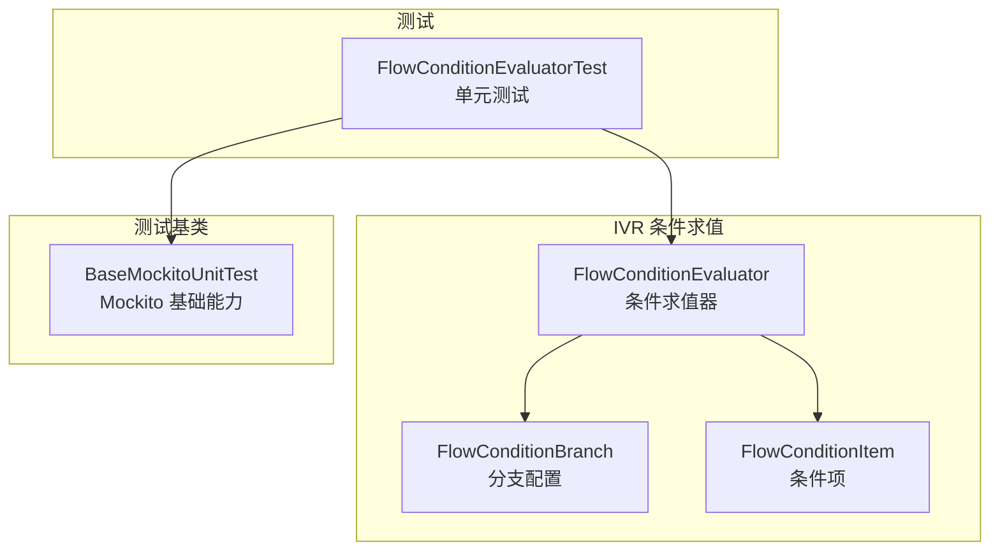
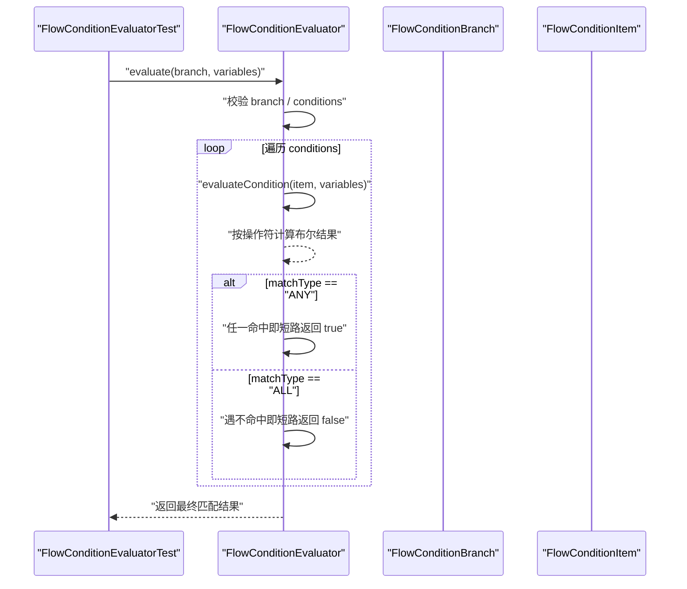
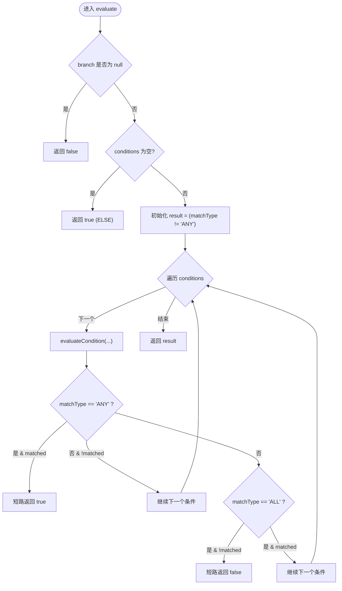
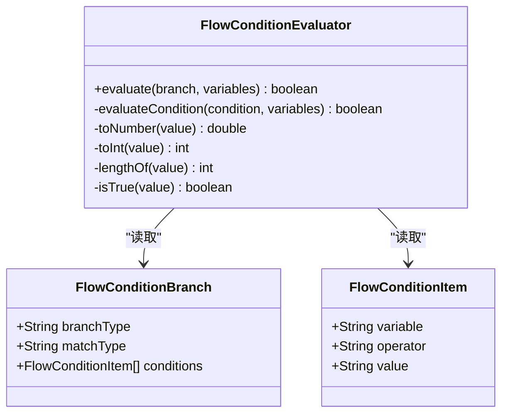

# 单元测试

<cite>
**本文引用的文件**
- [FlowConditionEvaluator.java](file://yudao-cloud/yudao-module-cc/yudao-module-cc-server/src/main/java/cn/iocoder/yudao/module/cc/ivr/handler/node/FlowConditionEvaluator.java)
- [FlowConditionBranch.java](file://yudao-cloud/yudao-module-cc/yudao-module-cc-server/src/main/java/cn/iocoder/yudao/module/cc/ivr/properties/FlowConditionBranch.java)
- [FlowConditionItem.java](file://yudao-cloud/yudao-module-cc/yudao-module-cc-server/src/main/java/cn/iocoder/yudao/module/cc/ivr/properties/FlowConditionItem.java)
- [FlowConditionEvaluatorTest.java](file://yudao-cloud/yudao-module-cc/yudao-module-cc-server/src/test/java/cn/iocoder/yudao/module/cc/ivr/handler/node/FlowConditionEvaluatorTest.java)
- [BaseMockitoUnitTest.java](file://yudao-cloud/yudao-framework/yudao-spring-boot-starter-test/src/main/java/cn/iocoder/yudao/framework/test/core/ut/BaseMockitoUnitTest.java)
</cite>

## 目录
1. [简介](#简介)
2. [项目结构](#项目结构)
3. [核心组件](#核心组件)
4. [架构总览](#架构总览)
5. [详细组件分析](#详细组件分析)
6. [依赖分析](#依赖分析)
7. [性能考虑](#性能考虑)
8. [故障排查指南](#故障排查指南)
9. [结论](#结论)
10. [附录](#附录)

## 简介
本指南面向使用 JUnit 与 Spring Boot 测试框架编写业务逻辑单元测试的工程师，聚焦 IVR 流程条件评估器的测试方法。内容涵盖：
- 测试用例设计（操作符、匹配模式、边界与异常）
- Mock 对象创建与测试数据准备
- 复杂分支与边界条件的覆盖策略
- 覆盖率要求与最佳实践
- 具体测试示例路径与调试技巧

## 项目结构
IVR 条件求值器位于 cc 模块的 ivr 子包中，包含求值器实现与属性模型；对应的单测位于同包的 test 目录下。测试框架基础能力由 yudao-framework 的 starter-test 提供。

图表来源
- [FlowConditionEvaluator.java:1-186](file://yudao-cloud/yudao-module-cc/yudao-module-cc-server/src/main/java/cn/iocoder/yudao/module/cc/ivr/handler/node/FlowConditionEvaluator.java#L1-L186)
- [FlowConditionBranch.java:1-33](file://yudao-cloud/yudao-module-cc/yudao-module-cc-server/src/main/java/cn/iocoder/yudao/module/cc/ivr/properties/FlowConditionBranch.java#L1-L33)
- [FlowConditionItem.java:1-31](file://yudao-cloud/yudao-module-cc/yudao-module-cc-server/src/main/java/cn/iocoder/yudao/module/cc/ivr/properties/FlowConditionItem.java#L1-L31)
- [FlowConditionEvaluatorTest.java:1-580](file://yudao-cloud/yudao-module-cc/yudao-module-cc-server/src/test/java/cn/iocoder/yudao/module/cc/ivr/handler/node/FlowConditionEvaluatorTest.java#L1-L580)
- [BaseMockitoUnitTest.java](file://yudao-cloud/yudao-framework/yudao-spring-boot-starter-test/src/main/java/cn/iocoder/yudao/framework/test/core/ut/BaseMockitoUnitTest.java)

章节来源
- [FlowConditionEvaluator.java:1-186](file://yudao-cloud/yudao-module-cc/yudao-module-cc-server/src/main/java/cn/iocoder/yudao/module/cc/ivr/handler/node/FlowConditionEvaluator.java#L1-L186)
- [FlowConditionBranch.java:1-33](file://yudao-cloud/yudao-module-cc/yudao-module-cc-server/src/main/java/cn/iocoder/yudao/module/cc/ivr/properties/FlowConditionBranch.java#L1-L33)
- [FlowConditionItem.java:1-31](file://yudao-cloud/yudao-module-cc/yudao-module-cc-server/src/main/java/cn/iocoder/yudao/module/cc/ivr/properties/FlowConditionItem.java#L1-L31)
- [FlowConditionEvaluatorTest.java:1-580](file://yudao-cloud/yudao-module-cc/yudao-module-cc-server/src/test/java/cn/iocoder/yudao/module/cc/ivr/handler/node/FlowConditionEvaluatorTest.java#L1-L580)
- [BaseMockitoUnitTest.java](file://yudao-cloud/yudao-framework/yudao-spring-boot-starter-test/src/main/java/cn/iocoder/yudao/framework/test/core/ut/BaseMockitoUnitTest.java)

## 核心组件
- FlowConditionEvaluator：根据分支配置与变量映射计算是否匹配，支持 ANY/ALL 短路逻辑、ELSE 默认匹配、多种操作符与容错降级。
- FlowConditionBranch：描述分支类型、匹配模式与条件集合。
- FlowConditionItem：描述单个条件（变量、操作符、期望值）。
- FlowConditionEvaluatorTest：覆盖全部操作符、匹配模式、边界与异常场景的单元测试。

章节来源
- [FlowConditionEvaluator.java:23-62](file://yudao-cloud/yudao-module-cc/yudao-module-cc-server/src/main/java/cn/iocoder/yudao/module/cc/ivr/handler/node/FlowConditionEvaluator.java#L23-L62)
- [FlowConditionBranch.java:15-32](file://yudao-cloud/yudao-module-cc/yudao-module-cc-server/src/main/java/cn/iocoder/yudao/module/cc/ivr/properties/FlowConditionBranch.java#L15-L32)
- [FlowConditionItem.java:13-30](file://yudao-cloud/yudao-module-cc/yudao-module-cc-server/src/main/java/cn/iocoder/yudao/module/cc/ivr/properties/FlowConditionItem.java#L13-L30)
- [FlowConditionEvaluatorTest.java:26-580](file://yudao-cloud/yudao-module-cc/yudao-module-cc-server/src/test/java/cn/iocoder/yudao/module/cc/ivr/handler/node/FlowConditionEvaluatorTest.java#L26-L580)

## 架构总览
下图展示条件求值的核心调用链：测试构造分支与条件，调用求值器 evaluate，内部对每个条件执行 evaluateCondition，并根据 matchType 进行短路判断。

图表来源
- [FlowConditionEvaluator.java:37-62](file://yudao-cloud/yudao-module-cc/yudao-module-cc-server/src/main/java/cn/iocoder/yudao/module/cc/ivr/handler/node/FlowConditionEvaluator.java#L37-L62)
- [FlowConditionEvaluator.java:74-129](file://yudao-cloud/yudao-module-cc/yudao-module-cc-server/src/main/java/cn/iocoder/yudao/module/cc/ivr/handler/node/FlowConditionEvaluator.java#L74-L129)
- [FlowConditionBranch.java:15-32](file://yudao-cloud/yudao-module-cc/yudao-module-cc-server/src/main/java/cn/iocoder/yudao/module/cc/ivr/properties/FlowConditionBranch.java#L15-L32)
- [FlowConditionItem.java:13-30](file://yudao-cloud/yudao-module-cc/yudao-module-cc-server/src/main/java/cn/iocoder/yudao/module/cc/ivr/properties/FlowConditionItem.java#L13-L30)

## 详细组件分析

### 条件求值器（FlowConditionEvaluator）
- 入口 evaluate：处理 null 分支、空条件（ELSE）、ANY/ALL 短路逻辑。
- 条件求值 evaluateCondition：统一解析变量值与期望值，按操作符分支计算。
- 辅助方法：toNumber/toInt/lengthOf/isTrue 提供容错与长度/布尔判断。

图表来源
- [FlowConditionEvaluator.java:37-62](file://yudao-cloud/yudao-module-cc/yudao-module-cc-server/src/main/java/cn/iocoder/yudao/module/cc/ivr/handler/node/FlowConditionEvaluator.java#L37-L62)
- [FlowConditionEvaluator.java:74-129](file://yudao-cloud/yudao-module-cc/yudao-module-cc-server/src/main/java/cn/iocoder/yudao/module/cc/ivr/handler/node/FlowConditionEvaluator.java#L74-L129)

章节来源
- [FlowConditionEvaluator.java:23-186](file://yudao-cloud/yudao-module-cc/yudao-module-cc-server/src/main/java/cn/iocoder/yudao/module/cc/ivr/handler/node/FlowConditionEvaluator.java#L23-L186)

### 测试用例设计与覆盖要点
- 操作符覆盖：IS_EMPTY、IS_NOT_EMPTY、CONTAINS、NOT_CONTAINS、EQ、NE、GT/GTE/LT/LTE、LENGTH_*、IS_TRUE、IS_NOT_TRUE。
- 匹配模式：ALL（短路与）、ANY（短路或）。
- ELSE 分支：conditions 为空或为 null 时默认匹配。
- 边界与异常：变量缺失、null 分支、null 变量映射、未知操作符、数值/长度转换失败降级。
- 断言方式：基于 assertTrue/assertFalse 的纯函数式断言，无需 Spring 容器与 Mockito。

章节来源
- [FlowConditionEvaluatorTest.java:44-533](file://yudao-cloud/yudao-module-cc/yudao-module-cc-server/src/test/java/cn/iocoder/yudao/module/cc/ivr/handler/node/FlowConditionEvaluatorTest.java#L44-L533)

### 测试数据准备与 Mock 策略
- 测试数据：通过 Map<String,String> 模拟变量值，key 采用“组件ID.输出值key”格式。
- 分支与条件：使用 FlowConditionBranch 与 FlowConditionItem 构建测试用例，便于组合多条件与不同 matchType。
- Mock 需求：该求值器为纯逻辑工具类，无外部依赖，无需 Mockito；如需扩展含外部依赖的节点处理器，可继承 BaseMockitoUnitTest 并使用 @Mock/@InjectMocks。

章节来源
- [FlowConditionEvaluatorTest.java:29-42](file://yudao-cloud/yudao-module-cc/yudao-module-cc-server/src/test/java/cn/iocoder/yudao/module/cc/ivr/handler/node/FlowConditionEvaluatorTest.java#L29-L42)
- [FlowConditionEvaluatorTest.java:535-578](file://yudao-cloud/yudao-module-cc/yudao-module-cc-server/src/test/java/cn/iocoder/yudao/module/cc/ivr/handler/node/FlowConditionEvaluatorTest.java#L535-L578)
- [BaseMockitoUnitTest.java](file://yudao-cloud/yudao-framework/yudao-spring-boot-starter-test/src/main/java/cn/iocoder/yudao/framework/test/core/ut/BaseMockitoUnitTest.java)

### 复杂分支与边界条件测试建议
- 多条件组合：构造多个条件项，分别验证 ALL 与 ANY 的短路行为。
- 空值与缺失：变量不存在、值为空串、期望值为 null 的情况。
- 数值与长度：非数字字符串、负数、零、超长字符串等边界。
- 布尔语义："true"/"TRUE"/"1" 视为真，其余视为假。
- 未知操作符：应返回 false，避免误匹配。

章节来源
- [FlowConditionEvaluatorTest.java:444-533](file://yudao-cloud/yudao-module-cc/yudao-module-cc-server/src/test/java/cn/iocoder/yudao/module/cc/ivr/handler/node/FlowConditionEvaluatorTest.java#L444-L533)

## 依赖分析
- 组件内聚性：FlowConditionEvaluator 仅依赖两个数据模型，职责单一，易于测试。
- 外部依赖：无运行时外部依赖；测试无需启动 Spring 容器。
- 耦合点：变量 key 约定“组件ID.输出值key”，需与上游节点保持一致。

图表来源
- [FlowConditionEvaluator.java:23-186](file://yudao-cloud/yudao-module-cc/yudao-module-cc-server/src/main/java/cn/iocoder/yudao/module/cc/ivr/handler/node/FlowConditionEvaluator.java#L23-L186)
- [FlowConditionBranch.java:15-32](file://yudao-cloud/yudao-module-cc/yudao-module-cc-server/src/main/java/cn/iocoder/yudao/module/cc/ivr/properties/FlowConditionBranch.java#L15-L32)
- [FlowConditionItem.java:13-30](file://yudao-cloud/yudao-module-cc/yudao-module-cc-server/src/main/java/cn/iocoder/yudao/module/cc/ivr/properties/FlowConditionItem.java#L13-L30)

章节来源
- [FlowConditionEvaluator.java:23-186](file://yudao-cloud/yudao-module-cc/yudao-module-cc-server/src/main/java/cn/iocoder/yudao/module/cc/ivr/handler/node/FlowConditionEvaluator.java#L23-L186)
- [FlowConditionBranch.java:15-32](file://yudao-cloud/yudao-module-cc/yudao-module-cc-server/src/main/java/cn/iocoder/yudao/module/cc/ivr/properties/FlowConditionBranch.java#L15-L32)
- [FlowConditionItem.java:13-30](file://yudao-cloud/yudao-module-cc/yudao-module-cc-server/src/main/java/cn/iocoder/yudao/module/cc/ivr/properties/FlowConditionItem.java#L13-L30)

## 性能考虑
- 短路优化：ANY 遇到第一个命中立即返回；ALL 遇到第一个不命中立即返回，减少不必要的条件计算。
- 容错降级：数值/整数解析失败回退为 0，保证流程不断裂，但可能影响精度，建议在输入层做校验。
- 复杂度：时间复杂度 O(n)，n 为条件数量；空间复杂度 O(1)。

章节来源
- [FlowConditionEvaluator.java:45-62](file://yudao-cloud/yudao-module-cc/yudao-module-cc-server/src/main/java/cn/iocoder/yudao/module/cc/ivr/handler/node/FlowConditionEvaluator.java#L45-L62)
- [FlowConditionEvaluator.java:137-163](file://yudao-cloud/yudao-module-cc/yudao-module-cc-server/src/main/java/cn/iocoder/yudao/module/cc/ivr/handler/node/FlowConditionEvaluator.java#L137-L163)

## 故障排查指南
- 变量未命中：检查变量 key 是否与上游节点输出一致（“组件ID.输出值key”）。
- 数值比较异常：确认传入值为可解析的数字字符串，否则会被降级为 0。
- 布尔判断不符合预期：注意大小写与“1”的特殊语义。
- 未知操作符：若新增操作符，需在 evaluateCondition 中补充分支并补充对应测试。
- 调试技巧：在 evaluateCondition 的关键分支处添加日志或断点，观察 actualValue、expectedValue 与中间结果。

章节来源
- [FlowConditionEvaluator.java:74-129](file://yudao-cloud/yudao-module-cc/yudao-module-cc-server/src/main/java/cn/iocoder/yudao/module/cc/ivr/handler/node/FlowConditionEvaluator.java#L74-L129)
- [FlowConditionEvaluatorTest.java:434-441](file://yudao-cloud/yudao-module-cc/yudao-module-cc-server/src/test/java/cn/iocoder/yudao/module/cc/ivr/handler/node/FlowConditionEvaluatorTest.java#L434-L441)

## 结论
IVR 条件求值器以纯函数形式实现，具备清晰的短路逻辑与容错机制，适合用 JUnit 进行细粒度单元测试。现有测试覆盖了主要操作符、匹配模式与边界情况。建议在后续迭代中：
- 持续完善新增操作符的测试覆盖
- 引入覆盖率统计，确保关键分支与异常路径被充分验证
- 对于涉及外部依赖的节点处理器，结合 BaseMockitoUnitTest 进行隔离测试

## 附录

### 覆盖率要求与最佳实践
- 行覆盖率：建议 ≥ 80%（核心逻辑建议 ≥ 90%）
- 分支覆盖率：建议 ≥ 80%（关键分支如 ANY/ALL 短路、ELSE 默认匹配必须覆盖）
- 命名规范：测试类与方法名清晰表达意图（如 contains_whenSubstringExists_returnTrue）
- 数据准备：集中化构造分支与条件，复用 buildBranch/buildCondition 等辅助方法
- 断言最小化：每个用例只断言一个关注点，便于定位失败原因
- 隔离外部依赖：对含 I/O 或网络调用的组件使用 Mock，保持测试稳定快速

章节来源
- [FlowConditionEvaluatorTest.java:535-578](file://yudao-cloud/yudao-module-cc/yudao-module-cc-server/src/test/java/cn/iocoder/yudao/module/cc/ivr/handler/node/FlowConditionEvaluatorTest.java#L535-L578)
- [BaseMockitoUnitTest.java](file://yudao-cloud/yudao-framework/yudao-spring-boot-starter-test/src/main/java/cn/iocoder/yudao/framework/test/core/ut/BaseMockitoUnitTest.java)

### 运行与调试
- 运行命令：在项目根目录执行 mvn test 或在 IDE 中直接运行测试类
- 过滤测试：使用 @DisplayName 或测试类名过滤执行
- 调试步骤：在 evaluateCondition 的 switch 分支设置断点，逐步验证 each 操作符分支
- 日志输出：必要时在 evaluateCondition 中添加日志，记录 actualValue、expectedValue、operator 与结果

章节来源
- [FlowConditionEvaluator.java:74-129](file://yudao-cloud/yudao-module-cc/yudao-module-cc-server/src/main/java/cn/iocoder/yudao/module/cc/ivr/handler/node/FlowConditionEvaluator.java#L74-L129)
- [FlowConditionEvaluatorTest.java:26-580](file://yudao-cloud/yudao-module-cc/yudao-module-cc-server/src/test/java/cn/iocoder/yudao/module/cc/ivr/handler/node/FlowConditionEvaluatorTest.java#L26-L580)