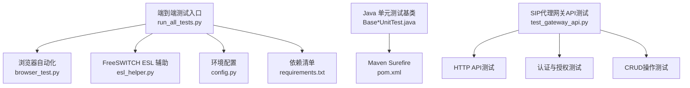
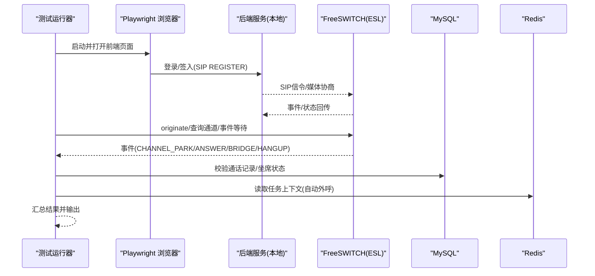
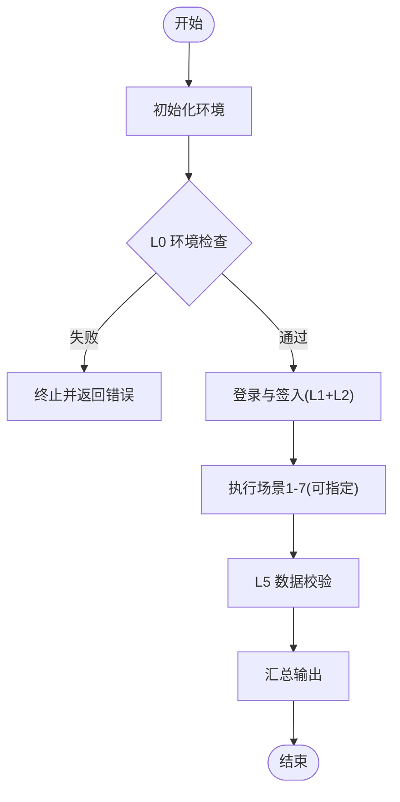
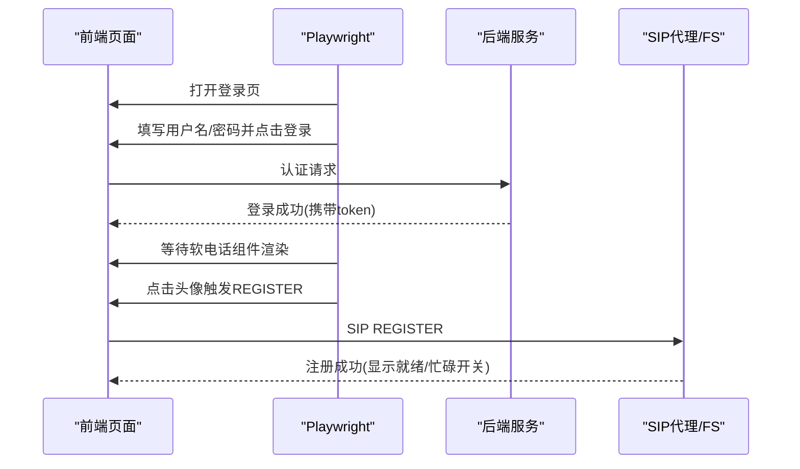
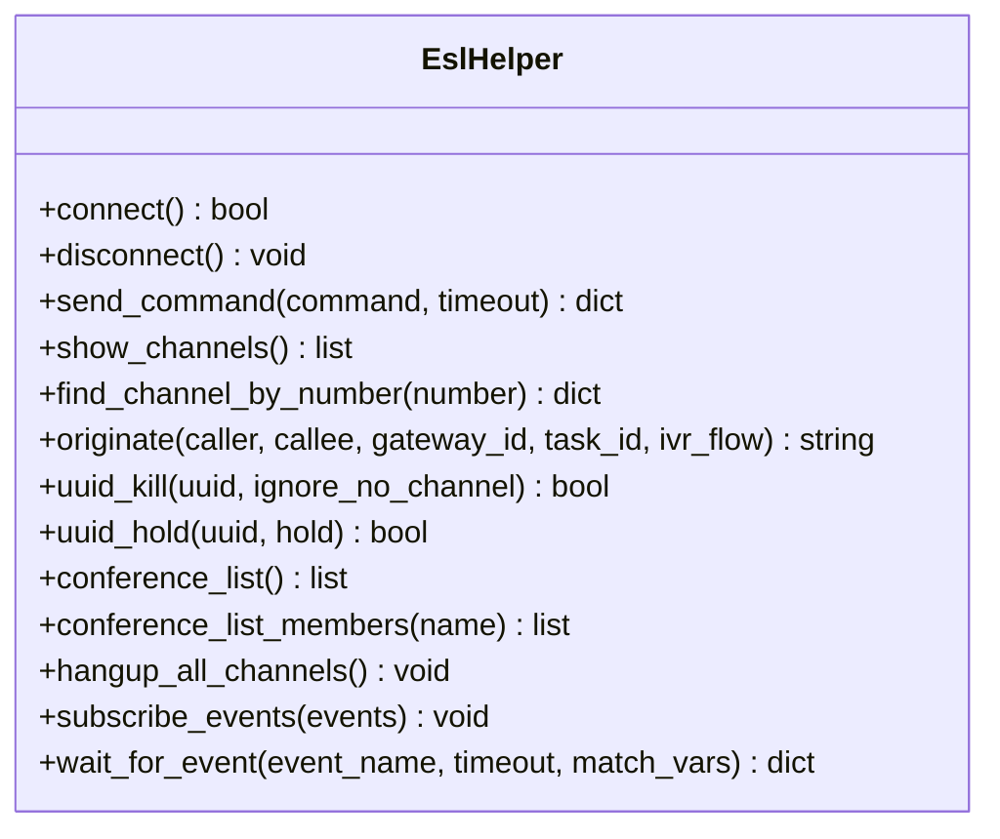
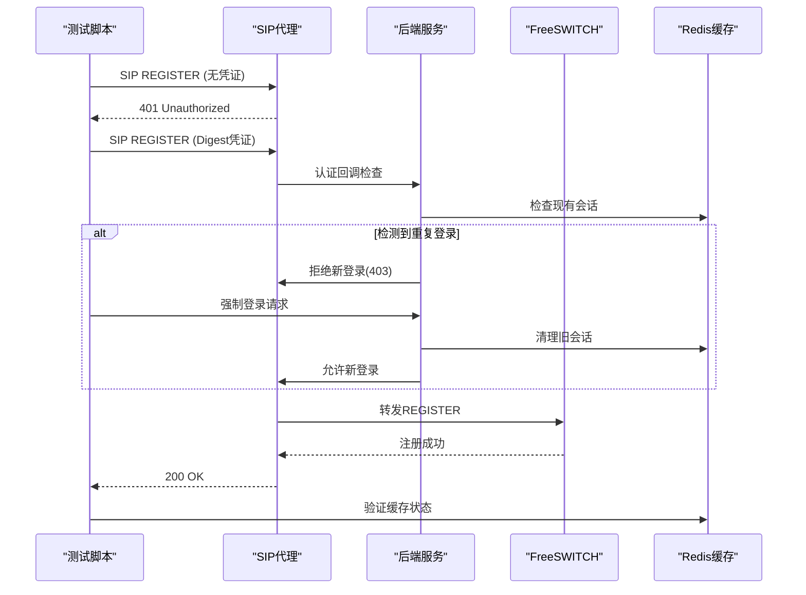
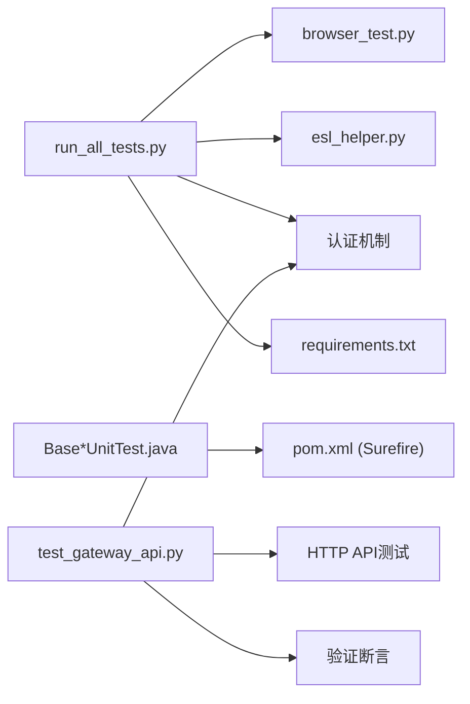

# 测试与调试

<cite>
**本文引用的文件**
- [requirements.txt](file://yudao-cloud/yudao-module-cc/doc/test-all/requirements.txt)
- [config.py](file://yudao-cloud/yudao-module-cc/doc/test-all/config.py)
- [run_all_tests.py](file://yudao-cloud/yudao-module-cc/doc/test-all/run_all_tests.py)
- [browser_test.py](file://yudao-cloud/yudao-module-cc/doc/test-all/browser_test.py)
- [esl_helper.py](file://yudao-cloud/yudao-module-cc/doc/test-all/esl_helper.py)
- [test_gateway_api.py](file://yudao-cloud/yudao-module-cc/doc/test-all/全场景测试/test_gateway_api.py)
- [pom.xml](file://yudao-cloud/pom.xml)
- [BaseDbAndRedisUnitTest.java](file://yudao-cloud/yudao-framework/yudao-spring-boot-starter-test/src/main/java/cn/iocoder/yudao/framework/test/core/ut/BaseDbAndRedisUnitTest.java)
- [BaseDbUnitTest.java](file://yudao-cloud/yudao-framework/yudao-spring-boot-starter-test/src/main/java/cn/iocoder/yudao/framework/test/core/ut/BaseDbUnitTest.java)
- [BaseMockitoUnitTest.java](file://yudao-cloud/yudao-framework/yudao-spring-boot-starter-test/src/main/java/cn/iocoder/yudao/framework/test/core/ut/BaseMockitoUnitTest.java)
- [BaseRedisUnitTest.java](file://yudao-cloud/yudao-framework/yudao-spring-boot-starter-test/src/main/java/cn/iocoder/yudao/framework/test/core/ut/BaseRedisUnitTest.java)
- [CcAuthenticationCallback.java](file://yudao-cloud/yudao-module-cc/yudao-module-cc-server/src/main/java/cn/iocoder/yudao/module/cc/sipproxy/integration/CcAuthenticationCallback.java)
</cite>

## 更新摘要

**变更内容**

- 新增sipproxy网关注册坐席验证测试脚本章节，包含完整的SIP REGISTER流程测试、唯一登录逻辑验证和Redis缓存状态检查
- 更新认证回调机制说明，反映新增的CcAuthenticationCallback类实现
- 增强WebSocket消息处理章节，补充强制下线逻辑的测试方法
- 完善集成测试部分，增加SIP代理网关API测试用例

## 目录
1. [简介](#简介)
2. [项目结构](#项目结构)
3. [核心组件](#核心组件)
4. [架构总览](#架构总览)
5. [详细组件分析](#详细组件分析)
6. [依赖关系分析](#依赖关系分析)
7. [性能考虑](#性能考虑)
8. [故障排查指南](#故障排查指南)
9. [结论](#结论)
10. [附录](#附录)

## 简介
本指南面向呼叫中心系统的测试与调试，覆盖单元测试、接口测试、集成测试（含 SIP 协议与 FreeSWITCH 集成）、测试工具使用、测试数据与环境准备、调试技巧、日志与性能分析方法、常见问题诊断以及自动化测试配置与执行流程。目标是帮助开发者快速搭建稳定可靠的端到端测试体系，并高效定位问题。

**更新** 新增了sipproxy网关注册坐席验证测试脚本，支持完整的SIP REGISTER流程测试、唯一登录逻辑验证和Redis缓存状态检查等测试用例。

## 项目结构
本项目在 yudao-cloud 下包含多个业务模块，其中呼叫中心相关能力集中在 yudao-module-cc。针对测试与调试，仓库提供了：
- Python 端到端测试套件：位于 yudao-module-cc/doc/test-all，基于 Playwright 驱动前端、ESL 连接 FreeSWITCH、MySQL/Redis 校验数据。
- Java 单元测试基类：位于 yudao-framework/yudao-spring-boot-starter-test，提供数据库、Redis、Mock 等基础测试能力。
- Maven 构建与 Surefire 插件：用于运行 JUnit 5 单元测试。
- **新增** SIP代理网关API测试：位于 yudao-module-cc/doc/test-all/全场景测试，提供完整的网关CRUD操作测试。

**图表来源**
- [run_all_tests.py:1-317](file://yudao-cloud/yudao-module-cc/doc/test-all/run_all_tests.py#L1-L317)
- [browser_test.py:1-800](file://yudao-cloud/yudao-module-cc/doc/test-all/browser_test.py#L1-L800)
- [esl_helper.py:1-791](file://yudao-cloud/yudao-module-cc/doc/test-all/esl_helper.py#L1-L791)
- [config.py:1-143](file://yudao-cloud/yudao-module-cc/doc/test-all/config.py#L1-L143)
- [requirements.txt:1-7](file://yudao-cloud/yudao-module-cc/doc/test-all/requirements.txt#L1-L7)
- [test_gateway_api.py:1-295](file://yudao-cloud/yudao-module-cc/doc/test-all/全场景测试/test_gateway_api.py#L1-L295)
- [pom.xml:67-116](file://yudao-cloud/pom.xml#L67-L116)

章节来源
- [run_all_tests.py:1-317](file://yudao-cloud/yudao-module-cc/doc/test-all/run_all_tests.py#L1-L317)
- [config.py:1-143](file://yudao-cloud/yudao-module-cc/doc/test-all/config.py#L1-L143)
- [requirements.txt:1-7](file://yudao-cloud/yudao-module-cc/doc/test-all/requirements.txt#L1-L7)
- [test_gateway_api.py:1-295](file://yudao-cloud/yudao-module-cc/doc/test-all/全场景测试/test_gateway_api.py#L1-L295)
- [pom.xml:67-116](file://yudao-cloud/pom.xml#L67-L116)

## 核心组件
- 端到端测试运行器：统一编排 L0 环境检查、L1/L2 登录签入、L4 通话场景（内部呼叫、出局呼叫、IVR、第三方网关呼入、保持恢复、咨询转接、自动外呼）和 L5 数据校验。支持单场景重跑、无头模式、轮次编号。
- 浏览器自动化：基于 Playwright 的 Chromium，授予摄像头/麦克风权限，模拟坐席登录、SIP 签入/签出、拨号、接听、挂断、保持/恢复、静音、DTMF、多会话切换等。
- ESL 辅助：纯 Python 实现 ESL 协议，封装 connect/auth、send_command、事件订阅与等待、通道查询、originate、uuid_kill、会议管理等，解决阻塞命令期间事件先到达导致的丢事件问题。
- 环境配置：集中管理本地后端/前端地址、FreeSWITCH ESL 参数、MySQL/Redis 连接、SIP 服务器与代理公网地址、第三方 FS 网关、测试坐席账号、IVR 流程 ID、超时与截图报告路径等。
- Java 单元测试基类：提供 BaseDbUnitTest、BaseRedisUnitTest、BaseMockitoUnitTest、BaseDbAndRedisUnitTest 等，配合 Maven Surefire 运行 JUnit 5 测试。
- **新增** SIP代理网关API测试：提供完整的网关CRUD操作、参数校验、删除重建等测试用例。

章节来源
- [run_all_tests.py:81-257](file://yudao-cloud/yudao-module-cc/doc/test-all/run_all_tests.py#L81-L257)
- [browser_test.py:26-800](file://yudao-cloud/yudao-module-cc/doc/test-all/browser_test.py#L26-L800)
- [esl_helper.py:35-756](file://yudao-cloud/yudao-module-cc/doc/test-all/esl_helper.py#L35-L756)
- [config.py:12-143](file://yudao-cloud/yudao-module-cc/doc/test-all/config.py#L12-L143)
- [BaseDbUnitTest.java](file://yudao-cloud/yudao-framework/yudao-spring-boot-starter-test/src/main/java/cn/iocoder/yudao/framework/test/core/ut/BaseDbUnitTest.java)
- [BaseRedisUnitTest.java](file://yudao-cloud/yudao-framework/yudao-spring-boot-starter-test/src/main/java/cn/iocoder/yudao/framework/test/core/ut/BaseRedisUnitTest.java)
- [BaseMockitoUnitTest.java](file://yudao-cloud/yudao-framework/yudao-spring-boot-starter-test/src/main/java/cn/iocoder/yudao/framework/test/core/ut/BaseMockitoUnitTest.java)
- [BaseDbAndRedisUnitTest.java](file://yudao-cloud/yudao-framework/yudao-spring-boot-starter-test/src/main/java/cn/iocoder/yudao/framework/test/core/ut/BaseDbAndRedisUnitTest.java)
- [test_gateway_api.py:26-295](file://yudao-cloud/yudao-module-cc/doc/test-all/全场景测试/test_gateway_api.py#L26-L295)

## 架构总览
端到端测试由运行器协调浏览器自动化与 ESL 控制，结合数据库与缓存进行状态与结果校验；Java 单元测试通过框架提供的基类与 Maven Surefire 执行。

**图表来源**
- [run_all_tests.py:259-312](file://yudao-cloud/yudao-module-cc/doc/test-all/run_all_tests.py#L259-L312)
- [browser_test.py:148-303](file://yudao-cloud/yudao-module-cc/doc/test-all/browser_test.py#L148-L303)
- [esl_helper.py:184-258](file://yudao-cloud/yudao-module-cc/doc/test-all/esl_helper.py#L184-L258)
- [config.py:12-143](file://yudao-cloud/yudao-module-cc/doc/test-all/config.py#L12-L143)

## 详细组件分析

### 端到端测试运行器
- 功能：解析命令行参数、初始化环境、顺序执行 L0/L1+L2/L4/L5、收集结果、打印汇总、退出码控制。
- 关键点：
  - 场景间清理：每个场景前挂断两个 FS 实例的所有通道，避免残留影响。
  - 超时与重试：调用方根据 config 中的 CALL_TIMEOUT、SIGNIN_TIMEOUT 等控制。
  - 数据校验：统计自测试开始时间起的通话记录数量，并检查坐席在线状态。

**图表来源**
- [run_all_tests.py:47-78](file://yudao-cloud/yudao-module-cc/doc/test-all/run_all_tests.py#L47-L78)
- [run_all_tests.py:131-218](file://yudao-cloud/yudao-module-cc/doc/test-all/run_all_tests.py#L131-L218)
- [run_all_tests.py:259-312](file://yudao-cloud/yudao-module-cc/doc/test-all/run_all_tests.py#L259-L312)

章节来源
- [run_all_tests.py:81-257](file://yudao-cloud/yudao-module-cc/doc/test-all/run_all_tests.py#L81-L257)

### 浏览器自动化（Playwright）
- 功能：启动 Chromium、授予媒体权限、导航到前端、登录、SIP 签入/签出、发起/接听/挂断/拒接、保持/恢复、静音、DTMF、获取通话信息、多会话计数。
- 关键点：
    - 权限与 WebRTC：必须授予 camera/microphone 权限，并使用 fake device 以在无头模式下建立媒体通道。
  - 登录健壮性：优先检测元素而非 URL，避免 Vue Router 初始跳转延迟导致误判。
  - 状态切换：就绪/忙碌切换带重试，处理 SIP 注册异步完成的影响。
  - 控制台消息捕获：在保持/恢复操作中监听 console 消息，便于排查 re-INVITE 未发送等问题。

**图表来源**
- [browser_test.py:48-89](file://yudao-cloud/yudao-module-cc/doc/test-all/browser_test.py#L48-L89)
- [browser_test.py:148-303](file://yudao-cloud/yudao-module-cc/doc/test-all/browser_test.py#L148-L303)
- [browser_test.py:326-468](file://yudao-cloud/yudao-module-cc/doc/test-all/browser_test.py#L326-L468)

章节来源
- [browser_test.py:26-800](file://yudao-cloud/yudao-module-cc/doc/test-all/browser_test.py#L26-L800)

### ESL 辅助（FreeSWITCH 集成）
- 功能：TCP 连接与 auth、发送 api/command 命令、事件订阅与等待、通道查询与会话控制、会议管理、批量挂断。
- 关键点：
  - 事件缓存队列：send_command 期间收到的事件会先于命令响应到达，需缓存到 _event_queue，供 wait_for_event 查找，避免丢事件导致超时。
  - 兼容事件格式：同时支持 key=value 与 key: value 两种分隔符。
  - 阻塞命令处理：originate 等命令在执行期间可能产生 CHANNEL_PARK/ANSWER 等事件，需确保这些事件被正确缓存与消费。
  - 清理策略：优先 hupall 批量挂断，失败时 fallback 到逐个 uuid_kill。

**图表来源**
- [esl_helper.py:35-756](file://yudao-cloud/yudao-module-cc/doc/test-all/esl_helper.py#L35-L756)

章节来源
- [esl_helper.py:184-756](file://yudao-cloud/yudao-module-cc/doc/test-all/esl_helper.py#L184-L756)

### 环境配置与依赖
- 依赖：playwright、pymysql、colorama、requests、ESL、redis。
- 配置项：本地后端/前端地址、FreeSWITCH ESL 主机端口密码、MySQL/Redis 连接、SIP 服务器与代理公网 IP、第三方 FS 网关、测试坐席账号、IVR 流程 ID、超时、截图/报告/日志目录、浏览器无头模式与慢动作等。

章节来源
- [requirements.txt:1-7](file://yudao-cloud/yudao-module-cc/doc/test-all/requirements.txt#L1-L7)
- [config.py:12-143](file://yudao-cloud/yudao-module-cc/doc/test-all/config.py#L12-L143)

### Java 单元测试与集成测试
- 单元测试基类：
  - BaseDbUnitTest：数据库测试基础。
  - BaseRedisUnitTest：Redis 测试基础。
  - BaseMockitoUnitTest：Mock 测试基础。
  - BaseDbAndRedisUnitTest：数据库与 Redis 组合测试基础。
- 执行方式：通过 Maven Surefire 插件运行 JUnit 5 测试。

章节来源
- [BaseDbUnitTest.java](file://yudao-cloud/yudao-framework/yudao-spring-boot-starter-test/src/main/java/cn/iocoder/yudao/framework/test/core/ut/BaseDbUnitTest.java)
- [BaseRedisUnitTest.java](file://yudao-cloud/yudao-framework/yudao-spring-boot-starter-test/src/main/java/cn/iocoder/yudao/framework/test/core/ut/BaseRedisUnitTest.java)
- [BaseMockitoUnitTest.java](file://yudao-cloud/yudao-framework/yudao-spring-boot-starter-test/src/main/java/cn/iocoder/yudao/framework/test/core/ut/BaseMockitoUnitTest.java)
- [BaseDbAndRedisUnitTest.java](file://yudao-cloud/yudao-framework/yudao-spring-boot-starter-test/src/main/java/cn/iocoder/yudao/framework/test/core/ut/BaseDbAndRedisUnitTest.java)
- [pom.xml:67-116](file://yudao-cloud/pom.xml#L67-L116)

### SIP代理网关注册测试

**新增** SIP代理网关注册测试脚本提供完整的SIP REGISTER流程测试、唯一登录逻辑验证和Redis缓存状态检查。

- **认证回调机制**：通过 `CcAuthenticationCallback` 实现重复登录检测和强制下线逻辑
- **测试覆盖范围**：
    - SIP REGISTER 401挑战 → Digest凭证认证 → 200 OK注册成功
    - 唯一登录逻辑：同一坐席重复注册时旧会话被强制下线
    - Redis缓存状态验证：sessionId与username:domain双向映射
    - 第三方SIP服务通过sipproxy向已注册坐席发起INVITE

**图表来源**

- [CcAuthenticationCallback.java:74-80](file://yudao-cloud/yudao-module-cc/yudao-module-cc-server/src/main/java/cn/iocoder/yudao/module/cc/sipproxy/integration/CcAuthenticationCallback.java#L74-L80)
- [test_gateway_api.py:12-24](file://yudao-cloud/yudao-module-cc/doc/test-all/全场景测试/test_gateway_api.py#L12-L24)

章节来源

- [CcAuthenticationCallback.java:1-101](file://yudao-cloud/yudao-module-cc/yudao-module-cc-server/src/main/java/cn/iocoder/yudao/module/cc/sipproxy/integration/CcAuthenticationCallback.java#L1-L101)
- [test_gateway_api.py:26-295](file://yudao-cloud/yudao-module-cc/doc/test-all/全场景测试/test_gateway_api.py#L26-L295)

### WebSocket消息处理

**更新** 增强了WebSocket消息处理机制，支持强制下线功能的测试验证。

- **消息类型扩展**：新增FORCE_LOGOUT_REQUEST和FORCE_LOGOUT_RESPONSE消息类型
- **处理流程**：
    - 服务端检测到重复登录时发送FORCE_LOGOUT_REQUEST
    - 前端弹出确认对话框让用户选择是否强制登录
    - 用户确认后清理旧会话并回复FORCE_LOGOUT_RESPONSE
    - 服务端接收响应后允许新会话注册

章节来源

- [CcAuthenticationCallback.java:83-100](file://yudao-cloud/yudao-module-cc/yudao-module-cc-server/src/main/java/cn/iocoder/yudao/module/cc/sipproxy/integration/CcAuthenticationCallback.java#L83-L100)

## 依赖关系分析
- 端到端测试依赖：
  - 浏览器自动化依赖 Playwright 与前端页面元素选择器。
  - ESL 辅助依赖 FreeSWITCH ESL 端口与密码。
  - 数据校验依赖 MySQL 与 Redis。
- Java 测试依赖：
  - 单元测试基类依赖 Spring Boot Test、JUnit 5、数据库与 Redis 驱动。
  - 通过 Maven Surefire 统一执行。
- **新增** SIP代理网关API测试依赖：
    - HTTP客户端库用于调用网关CRUD接口
    - 认证令牌管理机制
    - 测试结果断言库

**图表来源**
- [run_all_tests.py:1-317](file://yudao-cloud/yudao-module-cc/doc/test-all/run_all_tests.py#L1-L317)
- [browser_test.py:1-800](file://yudao-cloud/yudao-module-cc/doc/test-all/browser_test.py#L1-L800)
- [esl_helper.py:1-791](file://yudao-cloud/yudao-module-cc/doc/test-all/esl_helper.py#L1-L791)
- [config.py:1-143](file://yudao-cloud/yudao-module-cc/doc/test-all/config.py#L1-L143)
- [requirements.txt:1-7](file://yudao-cloud/yudao-module-cc/doc/test-all/requirements.txt#L1-L7)
- [test_gateway_api.py:1-295](file://yudao-cloud/yudao-module-cc/doc/test-all/全场景测试/test_gateway_api.py#L1-L295)
- [pom.xml:67-116](file://yudao-cloud/pom.xml#L67-L116)

章节来源
- [run_all_tests.py:1-317](file://yudao-cloud/yudao-module-cc/doc/test-all/run_all_tests.py#L1-L317)
- [test_gateway_api.py:1-295](file://yudao-cloud/yudao-module-cc/doc/test-all/全场景测试/test_gateway_api.py#L1-L295)
- [pom.xml:67-116](file://yudao-cloud/pom.xml#L67-L116)

## 性能考虑
- 端到端测试：
  - 场景间清理：使用 hupall 批量挂断减少 RTT 与耗时。
  - 事件缓存：避免阻塞命令期间的事件丢失，降低超时重试成本。
  - 浏览器操作：合理设置 slow_mo 与超时，平衡观察性与执行速度。
- Java 测试：
  - 使用 Mock 隔离外部依赖，缩短测试执行时间。
  - 合理使用事务与数据隔离，避免全量数据污染。
- **新增** SIP代理测试优化：
    - 复用HTTP连接减少认证开销
    - 批量操作减少网络往返
    - 合理的超时配置避免长时间阻塞

[本节为通用指导，不直接分析具体文件]

## 故障排查指南
- ESL 事件丢失或超时：
  - 检查 send_command 是否缓存事件到 _event_queue，并确保 wait_for_event 优先从队列查找。
  - 确认 subscribe_events 已正确取消旧订阅并清空缓冲区。
- 浏览器无法建立 WebRTC：
  - 确认已授予 camera/microphone 权限，并在无头模式下启用 fake device。
  - 检查前端软电话组件是否渲染完成后再执行后续操作。
- 登录/签入不稳定：
  - 增加等待时间，优先检测 .soft-phone-bar 元素而非仅依赖 URL。
  - 就绪/忙碌切换带重试，避免 SIP 注册未完成导致的状态重置。
- 数据校验失败：
  - 核对 MySQL/Redis 连接配置与数据库表结构。
  - 检查测试开始时间戳是否正确传递至 L5 校验逻辑。
- **新增** SIP代理认证问题：
    - 检查CcAuthenticationCallback是否正确处理重复登录场景
    - 验证Redis中会话映射关系的正确性
    - 确认WebSocket消息传输的可靠性

章节来源
- [esl_helper.py:184-258](file://yudao-cloud/yudao-module-cc/doc/test-all/esl_helper.py#L184-L258)
- [esl_helper.py:586-756](file://yudao-cloud/yudao-module-cc/doc/test-all/esl_helper.py#L586-L756)
- [browser_test.py:48-89](file://yudao-cloud/yudao-module-cc/doc/test-all/browser_test.py#L48-L89)
- [browser_test.py:148-303](file://yudao-cloud/yudao-module-cc/doc/test-all/browser_test.py#L148-L303)
- [config.py:35-63](file://yudao-cloud/yudao-module-cc/doc/test-all/config.py#L35-L63)
- [CcAuthenticationCallback.java:74-100](file://yudao-cloud/yudao-module-cc/yudao-module-cc-server/src/main/java/cn/iocoder/yudao/module/cc/sipproxy/integration/CcAuthenticationCallback.java#L74-L100)

## 结论

通过端到端测试运行器、浏览器自动化与 ESL 辅助的组合，项目实现了覆盖 SIP 协议与 FreeSWITCH 集成的完整测试闭环；结合 Java
单元测试基类与 Maven Surefire，形成了从单元到集成的分层测试体系。 **新增的SIP代理网关注册测试脚本**
进一步完善了SIP协议的测试覆盖，特别是重复登录检测和强制下线逻辑的验证。遵循本指南的环境准备、用例编写、调试与性能优化建议，可有效提升回归效率与问题定位能力。

[本节为总结，不直接分析具体文件]

## 附录
- 自动化测试执行流程：
  - 安装依赖：pip install -r requirements.txt。
  - 配置环境：修改 config.py 中的后端/FS/DB/Redis/SIP 等参数。
  - 执行测试：python run_all_tests.py [--headless] [--scenarios 1,3,5] [--skip-l0] [--round N]。
  - 查看结果：控制台输出与 screenshots/reports/logs 目录。
- Java 单元测试执行：
  - 使用 Maven 运行：mvn test（基于 Surefire 插件）。
  - 继承相应基类：BaseDbUnitTest、BaseRedisUnitTest、BaseMockitoUnitTest、BaseDbAndRedisUnitTest。
- **新增** SIP代理网关API测试执行：
    - 配置BASE_URL为正确的后端地址
    - 设置管理员账号密码
    - 执行测试：python test_gateway_api.py
    - 验证所有CRUD操作和参数校验

章节来源
- [requirements.txt:1-7](file://yudao-cloud/yudao-module-cc/doc/test-all/requirements.txt#L1-L7)
- [config.py:12-143](file://yudao-cloud/yudao-module-cc/doc/test-all/config.py#L12-L143)
- [run_all_tests.py:47-78](file://yudao-cloud/yudao-module-cc/doc/test-all/run_all_tests.py#L47-L78)
- [test_gateway_api.py:270-295](file://yudao-cloud/yudao-module-cc/doc/test-all/全场景测试/test_gateway_api.py#L270-L295)
- [pom.xml:67-116](file://yudao-cloud/pom.xml#L67-L116)