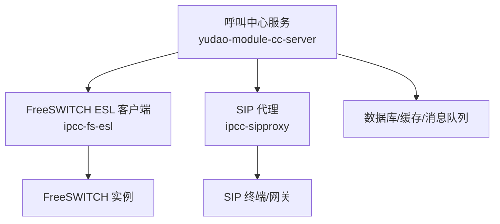
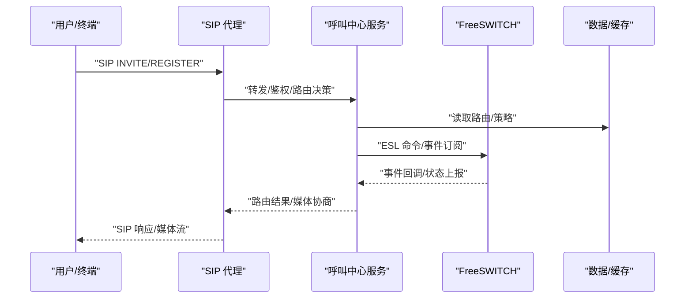
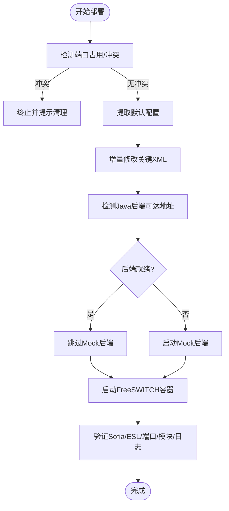
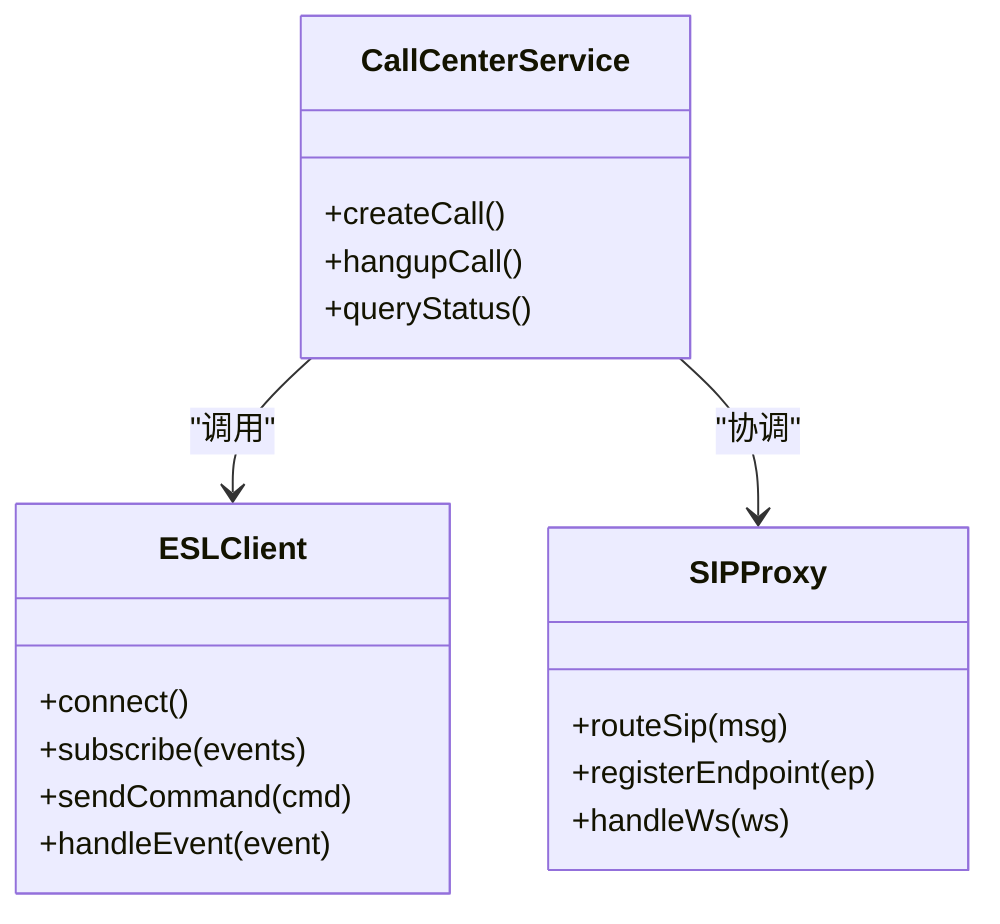
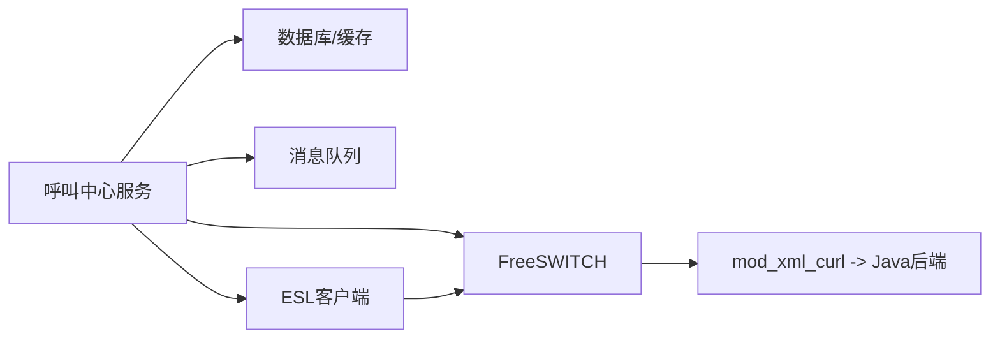

# 调试工具与技巧

<cite>
**本文引用的文件**
- [README.md](file://README.md)
- [freeswitch部署脚本1.py](file://yudao-cloud/yudao-module-cc/doc/freeswitch服务/freeswitch部署脚本1.py)
- [全场景测试/monitor_esl_events.py](file://yudao-cloud/yudao-module-cc/doc/test-all/全场景测试/monitor_esl_events.py)
- [全场景测试/monitor_fs.py](file://yudao-cloud/yudao-module-cc/doc/test-all/全场景测试/monitor_fs.py)
- [全场景测试/esl_helper.py](file://yudao-cloud/yudao-module-cc/doc/test-all/全场景测试/esl_helper.py)
- [全场景测试/capture_sdp.py](file://yudao-cloud/yudao-module-cc/doc/test-all/全场景测试/capture_sdp.py)
- [fs-esl-client组件架构设计.md](file://yudao-cloud/yudao-module-cc/ipcc-fs-esl/fs-esl-client组件架构设计.md)
- [sipproxy组件架构设计.md](file://yudao-cloud/yudao-module-cc/ipcc-sipproxy/sipproxy组件架构设计.md)
</cite>

## 目录
1. [简介](#简介)
2. [项目结构](#项目结构)
3. [核心组件](#核心组件)
4. [架构总览](#架构总览)
5. [详细组件分析](#详细组件分析)
6. [依赖关系分析](#依赖关系分析)
7. [性能考虑](#性能考虑)
8. [故障排查指南](#故障排查指南)
9. [结论](#结论)
10. [附录](#附录)

## 简介
本指南面向呼叫中心系统的开发与运维人员，聚焦于调试工具与技巧的实战落地。内容涵盖：
- IDE 调试配置（断点、变量查看）
- 日志分析方法与工具（应用日志、系统日志）
- SIP 协议调试（Wireshark 抓包与分析）
- FreeSWITCH 事件监控与调试（ESL、Sofia、Dialplan）
- 常见问题诊断步骤与解决方案
- 性能分析与内存泄漏检测

本项目基于 yudao-cloud 构建呼叫中心能力，包含 FreeSWITCH 集成（ESL）、SIP Proxy 等关键模块，并提供自动化部署与测试脚本，便于快速定位问题。

## 项目结构
仓库采用多模块组织，呼叫中心相关代码集中在 yudao-module-cc 下，包括：
- ipcc-fs-esl：FreeSWITCH ESL 客户端组件
- ipcc-sipproxy：SIP 代理组件
- yudao-module-cc-server：呼叫中心业务服务
- doc：部署脚本、测试套件与文档

图表来源
- [fs-esl-client组件架构设计.md](file://yudao-cloud/yudao-module-cc/ipcc-fs-esl/fs-esl-client组件架构设计.md)
- [sipproxy组件架构设计.md](file://yudao-cloud/yudao-module-cc/ipcc-sipproxy/sipproxy组件架构设计.md)

章节来源
- [README.md:1-29](file://README.md#L1-L29)

## 核心组件
- FreeSWITCH ESL 客户端：通过 Event Socket 与 FreeSWITCH 交互，订阅事件、发送命令、控制通话流程。
- SIP 代理：处理 SIP 信令转发、路由策略、集群与 WebSocket 扩展。
- 呼叫中心服务：编排呼叫流程、对接媒体与信令、提供管理 API。
- 部署与测试脚本：一键部署 FreeSWITCH、模拟后端、端到端测试与事件监控。

章节来源
- [fs-esl-client组件架构设计.md](file://yudao-cloud/yudao-module-cc/ipcc-fs-esl/fs-esl-client组件架构设计.md)
- [sipproxy组件架构设计.md](file://yudao-cloud/yudao-module-cc/ipcc-sipproxy/sipproxy组件架构设计.md)

## 架构总览
下图展示了从前端到后端再到 FreeSWITCH/SIP 的整体链路，以及调试切入点。

图表来源
- [sipproxy组件架构设计.md](file://yudao-cloud/yudao-module-cc/ipcc-sipproxy/sipproxy组件架构设计.md)
- [fs-esl-client组件架构设计.md](file://yudao-cloud/yudao-module-cc/ipcc-fs-esl/fs-esl-client组件架构设计.md)

## 详细组件分析

### FreeSWITCH 部署与调试（ESL、Sofia、Dialplan）
- 部署要点
  - 通过 Python 脚本在远程服务器拉取镜像、提取默认配置、增量修改关键 XML（modules.conf.xml、xml_curl.conf.xml、event_socket.conf.xml、acl.conf.xml、vars.xml）。
  - 自动检测端口冲突、主机端口占用，避免误覆盖生产环境。
  - 启动期间临时 Mock Java 后端，解决 mod_xml_curl 同步阻塞导致的启动缓慢问题；验证通过后切换至真实后端。
  - 自动检测 Java 后端可达地址（公网/内网），规避 NAT 回环问题。
- 调试建议
  - 使用 ESL 事件监控脚本实时观察 FreeSWITCH 事件（如 channel 创建/销毁、SIP 注册、Dialplan 执行）。
  - 结合 Sofia 日志与 Dialplan 日志定位信令与路由问题。
  - 通过 SSH 远程检查容器状态、端口监听、模块加载情况。

图表来源
- [freeswitch部署脚本1.py:304-395](file://yudao-cloud/yudao-module-cc/doc/freeswitch服务/freeswitch部署脚本1.py#L304-L395)
- [freeswitch部署脚本1.py:474-583](file://yudao-cloud/yudao-module-cc/doc/freeswitch服务/freeswitch部署脚本1.py#L474-L583)
- [freeswitch部署脚本1.py:585-683](file://yudao-cloud/yudao-module-cc/doc/freeswitch服务/freeswitch部署脚本1.py#L585-L683)
- [freeswitch部署脚本1.py:685-765](file://yudao-cloud/yudao-module-cc/doc/freeswitch服务/freeswitch部署脚本1.py#L685-L765)

章节来源
- [freeswitch部署脚本1.py:1-117](file://yudao-cloud/yudao-module-cc/doc/freeswitch服务/freeswitch部署脚本1.py#L1-L117)
- [freeswitch部署脚本1.py:304-395](file://yudao-cloud/yudao-module-cc/doc/freeswitch服务/freeswitch部署脚本1.py#L304-L395)
- [freeswitch部署脚本1.py:474-583](file://yudao-cloud/yudao-module-cc/doc/freeswitch服务/freeswitch部署脚本1.py#L474-L583)
- [freeswitch部署脚本1.py:585-683](file://yudao-cloud/yudao-module-cc/doc/freeswitch服务/freeswitch部署脚本1.py#L585-L683)
- [freeswitch部署脚本1.py:685-765](file://yudao-cloud/yudao-module-cc/doc/freeswitch服务/freeswitch部署脚本1.py#L685-L765)

### FreeSWITCH 事件监控与调试
- 事件监控脚本
  - monitor_esl_events.py：通过 ESL 连接 FreeSWITCH，订阅并打印关键事件（channel、sofia、dialplan 等），用于快速定位呼叫建立失败、路由异常等问题。
  - monitor_fs.py：辅助监控 FreeSWITCH 运行状态与关键指标。
- 使用建议
  - 在问题复现时同时开启 ESL 事件监控与 Wireshark 抓包，交叉比对信令与事件。
  - 关注 channel 生命周期事件（CHANNEL_CREATE、CHANNEL_ANSWER、CHANNEL_HANGUP）以判断媒体与信令是否匹配。
  - 对 SIP 注册失败，重点查看 sofia 事件与 ACL/认证错误。

章节来源
- [全场景测试/monitor_esl_events.py](file://yudao-cloud/yudao-module-cc/doc/test-all/全场景测试/monitor_esl_events.py)
- [全场景测试/monitor_fs.py](file://yudao-cloud/yudao-module-cc/doc/test-all/全场景测试/monitor_fs.py)

### SIP 协议调试（Wireshark 抓包）
- 抓包要点
  - 在 SIP 代理或 FreeSWITCH 所在网络接口启用捕获，过滤 sip/tls 端口。
  - 关注 INVITE/200 OK/ACK 三要素，核对 SDP 中的媒体地址与端口。
  - 若存在 NAT 或防火墙，注意检查 Contact/Record-Route/R-Path 头字段及 STUN/TURN 行为。
- 常见问题
  - 单通/无声：检查 SDP 媒体地址是否可达、RTP 端口是否放行、NAT 映射是否正确。
  - 注册失败：检查认证、ACL、域名解析、TLS 证书。
  - 路由错误：核对 Dialplan 规则与 SIP 代理路由策略。

章节来源
- [sipproxy组件架构设计.md](file://yudao-cloud/yudao-module-cc/ipcc-sipproxy/sipproxy组件架构设计.md)

### 端到端测试与辅助工具
- capture_sdp.py：抓取并记录 SDP 信息，便于对比媒体协商差异。
- esl_helper.py：封装 ESL 常用操作，简化事件订阅与命令发送。
- 全场景测试：提供多种呼叫场景的自动化用例，便于回归与问题定位。

章节来源
- [全场景测试/capture_sdp.py](file://yudao-cloud/yudao-module-cc/doc/test-all/全场景测试/capture_sdp.py)
- [全场景测试/esl_helper.py](file://yudao-cloud/yudao-module-cc/doc/test-all/全场景测试/esl_helper.py)

### 组件架构与依赖
- FreeSWITCH ESL 客户端：负责事件订阅、命令下发、会话控制。
- SIP 代理：负责 SIP 信令路由、集群、WebSocket 扩展。
- 呼叫中心服务：编排业务流程、对接外部系统与存储。

图表来源
- [fs-esl-client组件架构设计.md](file://yudao-cloud/yudao-module-cc/ipcc-fs-esl/fs-esl-client组件架构设计.md)
- [sipproxy组件架构设计.md](file://yudao-cloud/yudao-module-cc/ipcc-sipproxy/sipproxy组件架构设计.md)

## 依赖关系分析
- 运行时依赖
  - FreeSWITCH：信令与媒体处理核心。
  - Java 后端：提供动态配置（mod_xml_curl）、业务逻辑与管理 API。
  - 数据库/缓存/消息队列：持久化与异步任务支撑。
- 开发期依赖
  - Docker：容器化部署 FreeSWITCH。
  - Python 脚本：部署、监控与测试。
  - Wireshark：SIP/SDP 抓包分析。

图表来源
- [freeswitch部署脚本1.py:717-765](file://yudao-cloud/yudao-module-cc/doc/freeswitch服务/freeswitch部署脚本1.py#L717-L765)
- [fs-esl-client组件架构设计.md](file://yudao-cloud/yudao-module-cc/ipcc-fs-esl/fs-esl-client组件架构设计.md)

## 性能考虑
- FreeSWITCH 启动优化
  - 使用 Mock 后端避免 mod_xml_curl 同步阻塞，显著缩短启动时间。
  - 合理设置超时与重试参数，避免偶发网络抖动导致长时间等待。
- 资源与并发
  - 监控 CPU/内存/线程池/连接池，识别热点路径。
  - 对高频事件（如 channel 事件）进行批处理与去重，降低处理开销。
- 网络与媒体
  - 确保 RTP 端口范围足够且未被占用，避免媒体丢包或单通。
  - 在 NAT/防火墙环境下，正确配置 STUN/TURN 与端口映射。

[本节为通用指导，不直接分析具体文件]

## 故障排查指南
- 启动阶段
  - 端口冲突：检查目标端口（SIP/TLS/ESL）是否被占用，参考脚本中的端口检测逻辑。
  - 配置加载失败：确认 modules.conf.xml 中 mod_xml_curl 已启用，xml_curl.conf.xml 的 gateway-url 指向可用后端。
  - 后端不可达：根据脚本逻辑自动切换公网/内网地址，必要时调整网络策略。
- 运行阶段
  - 信令异常：通过 Wireshark 抓包核对 SIP/SDP，结合 ESL 事件定位。
  - 媒体问题：检查 RTP 端口连通性、NAT 映射、防火墙策略。
  - 注册失败：检查 ACL、认证、域名解析与 TLS 证书。
- 日志与监控
  - 应用日志：关注呼叫中心服务与 SIP 代理的关键日志。
  - 系统日志：检查内核/网络栈/容器日志，定位底层问题。
  - FreeSWITCH 日志：启用 Sofia/Dialplan/ESL 日志，结合事件监控脚本。

章节来源
- [freeswitch部署脚本1.py:304-395](file://yudao-cloud/yudao-module-cc/doc/freeswitch服务/freeswitch部署脚本1.py#L304-L395)
- [freeswitch部署脚本1.py:474-583](file://yudao-cloud/yudao-module-cc/doc/freeswitch服务/freeswitch部署脚本1.py#L474-L583)
- [全场景测试/monitor_esl_events.py](file://yudao-cloud/yudao-module-cc/doc/test-all/全场景测试/monitor_esl_events.py)

## 结论
本指南围绕呼叫中心系统的调试实践，提供了从 IDE 调试、日志分析、SIP 抓包到 FreeSWITCH 事件监控的全链路方法。借助自动化部署与测试脚本，可快速定位并解决常见问题。建议在问题复现时结合 ESL 事件与 Wireshark 抓包，形成“信令-事件-日志”的闭环分析，提升排障效率。

## 附录

### IDE 调试配置（断点与变量查看）
- 后端（Java）
  - 使用 IDEA 远程调试：配置 JVM 参数启用 JDWP，IDE 以 Debug 模式连接。
  - 在关键入口（API 控制器、路由处理器、ESL 事件回调）设置断点，观察请求上下文与变量变化。
  - 使用条件断点与日志断点减少干扰，结合线程视图定位并发问题。
- 前端（Vue3）
  - 浏览器开发者工具设置断点（Sources 面板），观察网络请求与状态变化。
  - 使用 Network 面板查看 API 响应与错误码，结合控制台日志定位 UI 层问题。

[本节为通用指导，不直接分析具体文件]

### 日志分析方法与工具
- 应用日志
  - 统一日志格式与级别，按模块/租户隔离输出。
  - 关键路径埋点：入参、出参、耗时、异常堆栈。
- 系统日志
  - 容器日志：docker logs 或日志收集平台。
  - 系统级：journalctl/syslog，关注网络、磁盘、权限等。
- FreeSWITCH 日志
  - 启用 Sofia/Dialplan/ESL 日志，结合事件监控脚本定位问题。

[本节为通用指导，不直接分析具体文件]

### SIP 协议调试（Wireshark）
- 抓包位置：SIP 代理或 FreeSWITCH 所在网卡。
- 过滤器：sip、tls、rtp。
- 关注点：INVITE/200 OK/ACK、SDP 媒体地址与端口、Contact/Record-Route、认证头、错误码。

[本节为通用指导，不直接分析具体文件]

### FreeSWITCH 事件监控与调试技巧
- 事件订阅：通过 ESL 订阅 channel、sofia、dialplan 等事件。
- 关键事件：CHANNEL_CREATE/ANSWER/HANGUP、SOFA REGISTER/LOGOUT、DIALPLAN EXECUTE。
- 结合抓包与日志，交叉验证信令与事件一致性。

章节来源
- [全场景测试/monitor_esl_events.py](file://yudao-cloud/yudao-module-cc/doc/test-all/全场景测试/monitor_esl_events.py)

### 性能分析与内存泄漏检测
- 性能分析
  - CPU/内存采样：使用 jstack/jmap、Arthas、VisualVM 等工具。
  - 热点方法：定位慢查询、锁竞争、GC 频繁。
- 内存泄漏
  - 生成堆转储，分析大对象与引用链。
  - 检查事件监听器、连接池、缓存未释放问题。
- 网络与媒体
  - 监控 RTP 丢包率与延迟，检查 NAT/防火墙策略。
  - 调整 FreeSWITCH 媒体参数与缓冲区大小。

[本节为通用指导，不直接分析具体文件]