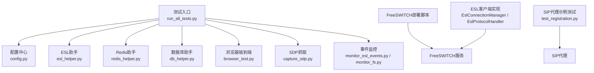
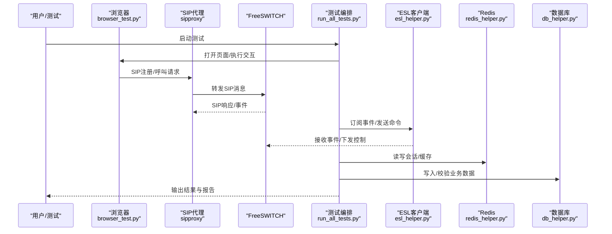
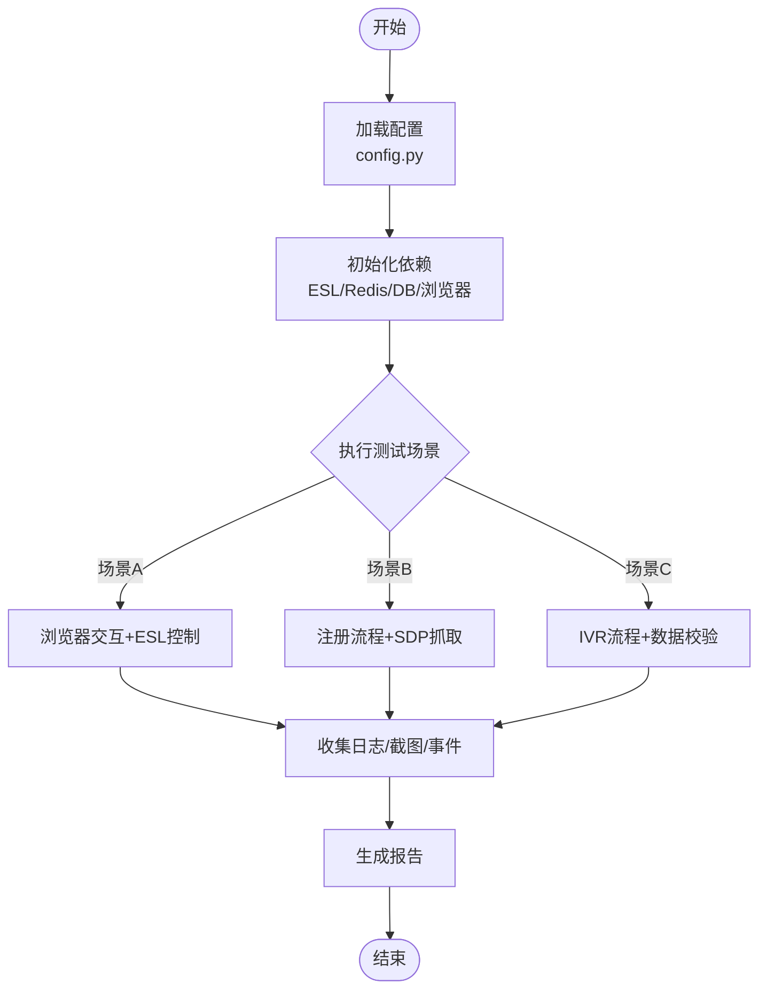
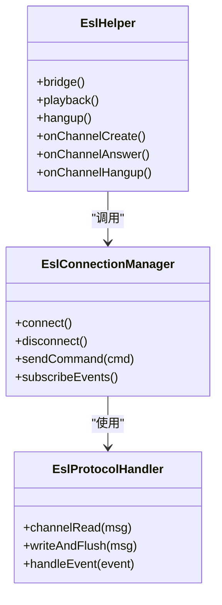
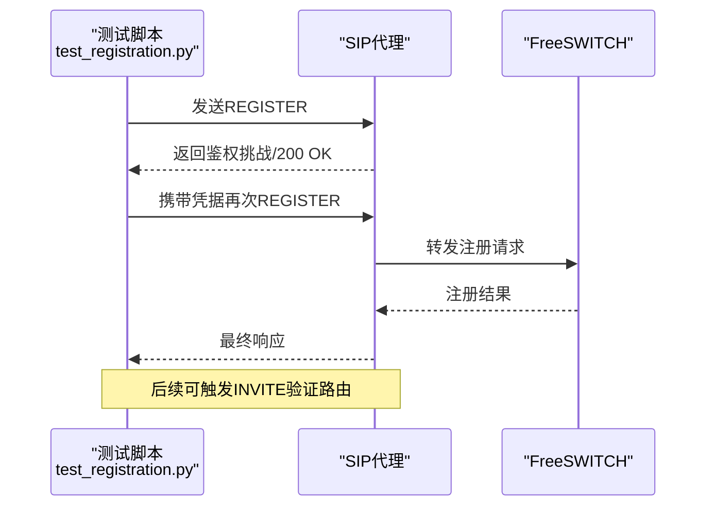
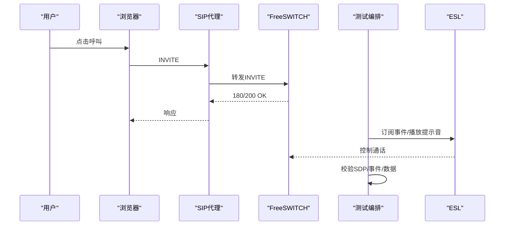
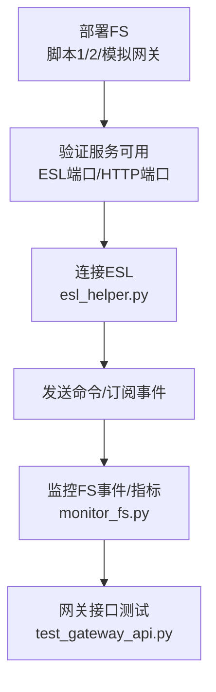
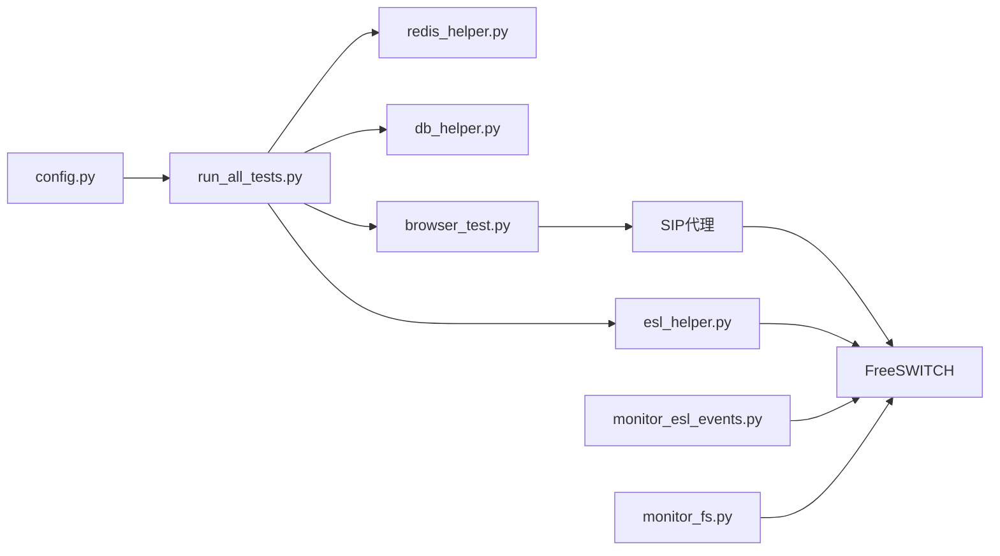

# 集成测试

<cite>
**本文引用的文件**
- [yudao-module-cc/doc/test-all/全场景测试/run_all_tests.py](file://yudao-cloud/yudao-module-cc/doc/test-all/全场景测试/run_all_tests.py)
- [yudao-module-cc/doc/test-all/全场景测试/config.py](file://yudao-cloud/yudao-module-cc/doc/test-all/全场景测试/config.py)
- [yudao-module-cc/doc/test-all/全场景测试/esl_helper.py](file://yudao-cloud/yudao-module-cc/doc/test-all/全场景测试/esl_helper.py)
- [yudao-module-cc/doc/test-all/全场景测试/redis_helper.py](file://yudao-cloud/yudao-module-cc/doc/test-all/全场景测试/redis_helper.py)
- [yudao-module-cc/doc/test-all/全场景测试/db_helper.py](file://yudao-cloud/yudao-module-cc/doc/test-all/全场景测试/db_helper.py)
- [yudao-module-cc/doc/test-all/全场景测试/browser_test.py](file://yudao-cloud/yudao-module-cc/doc/test-all/全场景测试/browser_test.py)
- [yudao-module-cc/doc/test-all/全场景测试/capture_sdp.py](file://yudao-cloud/yudao-module-cc/doc/test-all/全场景测试/capture_sdp.py)
- [yudao-module-cc/doc/test-all/全场景测试/monitor_esl_events.py](file://yudao-cloud/yudao-module-cc/doc/test-all/全场景测试/monitor_esl_events.py)
- [yudao-module-cc/doc/test-all/全场景测试/monitor_fs.py](file://yudao-cloud/yudao-module-cc/doc/test-all/全场景测试/monitor_fs.py)
- [yudao-module-cc/doc/test-all/全场景测试/test_gateway_api.py](file://yudao-cloud/yudao-module-cc/doc/test-all/全场景测试/test_gateway_api.py)
- [yudao-module-cc/doc/test-all/全场景测试/requirements.txt](file://yudao-cloud/yudao-module-cc/doc/test-all/全场景测试/requirements.txt)
- [yudao-module-cc/doc/freeswitch服务/freeswitch部署脚本1.py](file://yudao-cloud/yudao-module-cc/doc/freeswitch服务/freeswitch部署脚本1.py)
- [yudao-module-cc/doc/freeswitch服务/freeswitch部署脚本2-用于集群部署-修改了主要端口.py](file://yudao-cloud/yudao-module-cc/doc/freeswitch服务/freeswitch部署脚本2-用于集群部署-修改了主要端口.py)
- [yudao-module-cc/doc/freeswitch服务/freeswitch模拟第三方网关-运营商的fs部署脚本.py](file://yudao-cloud/yudao-module-cc/doc/freeswitch服务/freeswitch模拟第三方网关-运营商的fs部署脚本.py)
- [yudao-module-cc/ipcc-sipproxy/example/test/test_registration.py](file://yudao-cloud/yudao-module-cc/ipcc-sipproxy/example/test/test_registration.py)
- [yudao-module-cc/ipcc-sipproxy/src/main/resources/schema.sql](file://yudao-cloud/yudao-module-cc/ipcc-sipproxy/src/main/resources/schema.sql)
- [yudao-module-cc/ipcc-sipproxy/src/main/resources/data.sql](file://yudao-cloud/yudao-module-cc/ipcc-sipproxy/src/main/resources/data.sql)
- [yudao-module-cc/ipcc-fs-esl/src/main/java/cn/ipcc/fs/esl/EslConnectionManager.java](file://yudao-cloud/yudao-module-cc/ipcc-fs-esl/src/main/java/cn/ipcc/fs/esl/EslConnectionManager.java)
- [yudao-module-cc/ipcc-fs-esl/src/main/java/cn/ipcc/fs/esl/netty/EslProtocolHandler.java](file://yudao-cloud/yudao-module-cc/ipcc-fs-esl/src/main/java/cn/ipcc/fs/esl/netty/EslProtocolHandler.java)
- [yudao-module-cc/ipcc-sipproxy/sipproxy组件架构设计.md](file://yudao-cloud/yudao-module-cc/ipcc-sipproxy/sipproxy组件架构设计.md)
</cite>

## 目录
1. [简介](#简介)
2. [项目结构](#项目结构)
3. [核心组件](#核心组件)
4. [架构总览](#架构总览)
5. [详细组件分析](#详细组件分析)
6. [依赖关系分析](#依赖关系分析)
7. [性能与压力测试](#性能与压力测试)
8. [故障排查指南](#故障排查指南)
9. [结论](#结论)
10. [附录](#附录)

## 简介
本文件面向集成测试，聚焦SIP协议测试的实施方法、FreeSWITCH集成测试配置与执行流程、端到端呼叫与IVR流程验证、测试环境搭建（数据库、Redis、FreeSWITCH）、测试脚本使用与自动化执行，以及性能与压力测试指导。文档基于仓库中“全场景测试”脚本、FreeSWITCH部署脚本、SIP代理示例测试及ESL客户端实现进行系统化说明，帮助读者快速搭建并运行端到端测试。

## 项目结构
与集成测试相关的核心位置：
- 全场景测试套件：位于 yudao-module-cc/doc/test-all/全场景测试，提供统一入口、配置、ESL/Redis/DB辅助、浏览器端到端测试、SDP抓取、事件监控等。
- FreeSWITCH部署脚本：位于 yudao-module-cc/doc/freeswitch服务，提供单机与集群部署、模拟第三方网关等能力。
- SIP代理示例测试：位于 yudao-module-cc/ipcc-sipproxy/example/test，包含注册流程测试用例。
- ESL客户端实现：位于 yudao-module-cc/ipcc-fs-esl，提供与FreeSWITCH的ESL通信能力，便于在测试中监听与控制通话。

图表来源
- [yudao-module-cc/doc/test-all/全场景测试/run_all_tests.py](file://yudao-cloud/yudao-module-cc/doc/test-all/全场景测试/run_all_tests.py)
- [yudao-module-cc/doc/test-all/全场景测试/config.py](file://yudao-cloud/yudao-module-cc/doc/test-all/全场景测试/config.py)
- [yudao-module-cc/doc/test-all/全场景测试/esl_helper.py](file://yudao-cloud/yudao-module-cc/doc/test-all/全场景测试/esl_helper.py)
- [yudao-module-cc/doc/test-all/全场景测试/redis_helper.py](file://yudao-cloud/yudao-module-cc/doc/test-all/全场景测试/redis_helper.py)
- [yudao-module-cc/doc/test-all/全场景测试/db_helper.py](file://yudao-cloud/yudao-module-cc/doc/test-all/全场景测试/db_helper.py)
- [yudao-module-cc/doc/test-all/全场景测试/browser_test.py](file://yudao-cloud/yudao-module-cc/doc/test-all/全场景测试/browser_test.py)
- [yudao-module-cc/doc/test-all/全场景测试/capture_sdp.py](file://yudao-cloud/yudao-module-cc/doc/test-all/全场景测试/capture_sdp.py)
- [yudao-module-cc/doc/test-all/全场景测试/monitor_esl_events.py](file://yudao-cloud/yudao-module-cc/doc/test-all/全场景测试/monitor_esl_events.py)
- [yudao-module-cc/doc/test-all/全场景测试/monitor_fs.py](file://yudao-cloud/yudao-module-cc/doc/test-all/全场景测试/monitor_fs.py)
- [yudao-module-cc/doc/freeswitch服务/freeswitch部署脚本1.py](file://yudao-cloud/yudao-module-cc/doc/freeswitch服务/freeswitch部署脚本1.py)
- [yudao-module-cc/ipcc-sipproxy/example/test/test_registration.py](file://yudao-cloud/yudao-module-cc/ipcc-sipproxy/example/test/test_registration.py)
- [yudao-module-cc/ipcc-fs-esl/src/main/java/cn/ipcc/fs/esl/EslConnectionManager.java](file://yudao-cloud/yudao-module-cc/ipcc-fs-esl/src/main/java/cn/ipcc/fs/esl/EslConnectionManager.java)
- [yudao-module-cc/ipcc-fs-esl/src/main/java/cn/ipcc/fs/esl/netty/EslProtocolHandler.java](file://yudao-cloud/yudao-module-cc/ipcc-fs-esl/src/main/java/cn/ipcc/fs/esl/netty/EslProtocolHandler.java)

章节来源
- [yudao-module-cc/doc/test-all/全场景测试/run_all_tests.py](file://yudao-cloud/yudao-module-cc/doc/test-all/全场景测试/run_all_tests.py)
- [yudao-module-cc/doc/test-all/全场景测试/config.py](file://yudao-cloud/yudao-module-cc/doc/test-all/全场景测试/config.py)

## 核心组件
- 测试入口与编排：run_all_tests.py 负责加载配置、初始化依赖、按场景顺序执行端到端测试，并输出结果与日志。
- 配置管理：config.py 集中管理SIP/ESL/Redis/DB/浏览器等连接参数与环境变量，支持多环境切换。
- ESL通信：esl_helper.py 封装FreeSWITCH ESL命令发送与事件订阅，用于控制通话、监听状态变化。
- Redis与数据库：redis_helper.py 与 db_helper.py 分别提供缓存与持久化数据访问能力，支撑会话状态与业务数据校验。
- 浏览器端到端：browser_test.py 驱动真实或无头浏览器完成Web侧交互，验证UI与业务流程闭环。
- SDP抓取：capture_sdp.py 捕获媒体协商信息，辅助定位音视频问题。
- 事件监控：monitor_esl_events.py 与 monitor_fs.py 持续采集FS事件与系统指标，便于定位异常。
- FreeSWITCH部署：freeswitch部署脚本提供一键部署与集群化配置，支持模拟第三方网关以构造完整外线/内线场景。
- SIP代理示例测试：test_registration.py 验证SIP注册流程，确保代理层正确转发与鉴权。
- ESL客户端实现：EslConnectionManager 与 EslProtocolHandler 提供Netty驱动的ESL协议处理，支撑高并发事件收发。

章节来源
- [yudao-module-cc/doc/test-all/全场景测试/esl_helper.py](file://yudao-cloud/yudao-module-cc/doc/test-all/全场景测试/esl_helper.py)
- [yudao-module-cc/doc/test-all/全场景测试/redis_helper.py](file://yudao-cloud/yudao-module-cc/doc/test-all/全场景测试/redis_helper.py)
- [yudao-module-cc/doc/test-all/全场景测试/db_helper.py](file://yudao-cloud/yudao-module-cc/doc/test-all/全场景测试/db_helper.py)
- [yudao-module-cc/doc/test-all/全场景测试/browser_test.py](file://yudao-cloud/yudao-module-cc/doc/test-all/全场景测试/browser_test.py)
- [yudao-module-cc/doc/test-all/全场景测试/capture_sdp.py](file://yudao-cloud/yudao-module-cc/doc/test-all/全场景测试/capture_sdp.py)
- [yudao-module-cc/doc/test-all/全场景测试/monitor_esl_events.py](file://yudao-cloud/yudao-module-cc/doc/test-all/全场景测试/monitor_esl_events.py)
- [yudao-module-cc/doc/test-all/全场景测试/monitor_fs.py](file://yudao-cloud/yudao-module-cc/doc/test-all/全场景测试/monitor_fs.py)
- [yudao-module-cc/doc/freeswitch服务/freeswitch部署脚本1.py](file://yudao-cloud/yudao-module-cc/doc/freeswitch服务/freeswitch部署脚本1.py)
- [yudao-module-cc/ipcc-sipproxy/example/test/test_registration.py](file://yudao-cloud/yudao-module-cc/ipcc-sipproxy/example/test/test_registration.py)
- [yudao-module-cc/ipcc-fs-esl/src/main/java/cn/ipcc/fs/esl/EslConnectionManager.java](file://yudao-cloud/yudao-module-cc/ipcc-fs-esl/src/main/java/cn/ipcc/fs/esl/EslConnectionManager.java)
- [yudao-module-cc/ipcc-fs-esl/src/main/java/cn/ipcc/fs/esl/netty/EslProtocolHandler.java](file://yudao-cloud/yudao-module-cc/ipcc-fs-esl/src/main/java/cn/ipcc/fs/esl/netty/EslProtocolHandler.java)

## 架构总览
集成测试覆盖从浏览器到SIP代理、FreeSWITCH、外线/内线的完整链路，并通过ESL对通话进行控制与观测。

图表来源
- [yudao-module-cc/doc/test-all/全场景测试/run_all_tests.py](file://yudao-cloud/yudao-module-cc/doc/test-all/全场景测试/run_all_tests.py)
- [yudao-module-cc/doc/test-all/全场景测试/browser_test.py](file://yudao-cloud/yudao-module-cc/doc/test-all/全场景测试/browser_test.py)
- [yudao-module-cc/doc/test-all/全场景测试/esl_helper.py](file://yudao-cloud/yudao-module-cc/doc/test-all/全场景测试/esl_helper.py)
- [yudao-module-cc/doc/test-all/全场景测试/redis_helper.py](file://yudao-cloud/yudao-module-cc/doc/test-all/全场景测试/redis_helper.py)
- [yudao-module-cc/doc/test-all/全场景测试/db_helper.py](file://yudao-cloud/yudao-module-cc/doc/test-all/全场景测试/db_helper.py)
- [yudao-module-cc/ipcc-sipproxy/example/test/test_registration.py](file://yudao-cloud/yudao-module-cc/ipcc-sipproxy/example/test/test_registration.py)

## 详细组件分析

### 全场景测试编排器（run_all_tests.py）
- 职责：统一加载配置、初始化依赖、按场景顺序执行端到端测试、汇总结果与日志。
- 关键点：
  - 通过 config.py 读取SIP/ESL/Redis/DB/浏览器等参数。
  - 调用 browser_test.py 驱动前端交互，结合 esl_helper.py 控制通话。
  - 借助 capture_sdp.py 抓取媒体协商信息，辅助音视频问题定位。
  - 通过 redis_helper.py 与 db_helper.py 校验会话与业务数据一致性。
  - 启动 monitor_esl_events.py / monitor_fs.py 进行事件与系统指标采集。

图表来源
- [yudao-module-cc/doc/test-all/全场景测试/run_all_tests.py](file://yudao-cloud/yudao-module-cc/doc/test-all/全场景测试/run_all_tests.py)
- [yudao-module-cc/doc/test-all/全场景测试/config.py](file://yudao-cloud/yudao-module-cc/doc/test-all/全场景测试/config.py)

章节来源
- [yudao-module-cc/doc/test-all/全场景测试/run_all_tests.py](file://yudao-cloud/yudao-module-cc/doc/test-all/全场景测试/run_all_tests.py)
- [yudao-module-cc/doc/test-all/全场景测试/config.py](file://yudao-cloud/yudao-module-cc/doc/test-all/全场景测试/config.py)

### ESL通信与事件监听（esl_helper.py + EslConnectionManager / EslProtocolHandler）
- 职责：通过ESL协议与FreeSWITCH通信，发送命令（如桥接、播放、挂断）并订阅事件（如通道创建、接听、挂断）。
- 关键点：
  - EslConnectionManager 管理连接生命周期与重连策略。
  - EslProtocolHandler 基于Netty解析/编码ESL帧，保证高效传输。
  - esl_helper.py 封装常用命令与事件回调，简化测试逻辑。

图表来源
- [yudao-module-cc/ipcc-fs-esl/src/main/java/cn/ipcc/fs/esl/EslConnectionManager.java](file://yudao-cloud/yudao-module-cc/ipcc-fs-esl/src/main/java/cn/ipcc/fs/esl/EslConnectionManager.java)
- [yudao-module-cc/ipcc-fs-esl/src/main/java/cn/ipcc/fs/esl/netty/EslProtocolHandler.java](file://yudao-cloud/yudao-module-cc/ipcc-fs-esl/src/main/java/cn/ipcc/fs/esl/netty/EslProtocolHandler.java)
- [yudao-module-cc/doc/test-all/全场景测试/esl_helper.py](file://yudao-cloud/yudao-module-cc/doc/test-all/全场景测试/esl_helper.py)

章节来源
- [yudao-module-cc/doc/test-all/全场景测试/esl_helper.py](file://yudao-cloud/yudao-module-cc/doc/test-all/全场景测试/esl_helper.py)
- [yudao-module-cc/ipcc-fs-esl/src/main/java/cn/ipcc/fs/esl/EslConnectionManager.java](file://yudao-cloud/yudao-module-cc/ipcc-fs-esl/src/main/java/cn/ipcc/fs/esl/EslConnectionManager.java)
- [yudao-module-cc/ipcc-fs-esl/src/main/java/cn/ipcc/fs/esl/netty/EslProtocolHandler.java](file://yudao-cloud/yudao-module-cc/ipcc-fs-esl/src/main/java/cn/ipcc/fs/esl/netty/EslProtocolHandler.java)

### SIP代理注册流程测试（test_registration.py）
- 职责：验证SIP代理的注册流程，包括鉴权、会话建立与转发。
- 关键点：
  - 构造SIP REGISTER请求，检查200 OK响应。
  - 验证后续INVITE/ACK是否正确路由至FreeSWITCH。
  - 结合事件监控确认注册状态与会话生命周期。

图表来源
- [yudao-module-cc/ipcc-sipproxy/example/test/test_registration.py](file://yudao-cloud/yudao-module-cc/ipcc-sipproxy/example/test/test_registration.py)

章节来源
- [yudao-module-cc/ipcc-sipproxy/example/test/test_registration.py](file://yudao-cloud/yudao-module-cc/ipcc-sipproxy/example/test/test_registration.py)

### 端到端呼叫与IVR流程
- 端到端呼叫：
  - 通过 browser_test.py 发起呼叫，SIP代理转发至FreeSWITCH。
  - 使用 esl_helper.py 控制通话（播放提示音、DTMF识别、桥接）。
  - 通过 capture_sdp.py 抓取SDP，验证媒体协商。
  - 使用 redis_helper.py 与 db_helper.py 校验会话与业务数据。
- IVR流程：
  - 在FreeSWITCH中配置IVR菜单，测试按键选择分支。
  - 通过ESL监听通道事件，验证IVR跳转与转接逻辑。
  - 结合事件监控与日志，确认各节点状态。

图表来源
- [yudao-module-cc/doc/test-all/全场景测试/browser_test.py](file://yudao-cloud/yudao-module-cc/doc/test-all/全场景测试/browser_test.py)
- [yudao-module-cc/doc/test-all/全场景测试/esl_helper.py](file://yudao-cloud/yudao-module-cc/doc/test-all/全场景测试/esl_helper.py)
- [yudao-module-cc/doc/test-all/全场景测试/capture_sdp.py](file://yudao-cloud/yudao-module-cc/doc/test-all/全场景测试/capture_sdp.py)

章节来源
- [yudao-module-cc/doc/test-all/全场景测试/browser_test.py](file://yudao-cloud/yudao-module-cc/doc/test-all/全场景测试/browser_test.py)
- [yudao-module-cc/doc/test-all/全场景测试/esl_helper.py](file://yudao-cloud/yudao-module-cc/doc/test-all/全场景测试/esl_helper.py)
- [yudao-module-cc/doc/test-all/全场景测试/capture_sdp.py](file://yudao-cloud/yudao-module-cc/doc/test-all/全场景测试/capture_sdp.py)

### FreeSWITCH集成测试配置与执行
- 部署：
  - 使用 freeswitch部署脚本1.py 进行单机部署。
  - 使用 freeswitch部署脚本2-用于集群部署-修改了主要端口.py 进行集群化部署。
  - 使用 freeswitch模拟第三方网关-运营商的fs部署脚本.py 模拟外线/运营商网关。
- 执行：
  - 启动后，通过 esl_helper.py 连接ESL端口，发送命令与订阅事件。
  - 结合 monitor_fs.py 观察系统指标与关键事件。
  - 通过 test_gateway_api.py 验证网关接口连通性与行为。

图表来源
- [yudao-module-cc/doc/freeswitch服务/freeswitch部署脚本1.py](file://yudao-cloud/yudao-module-cc/doc/freeswitch服务/freeswitch部署脚本1.py)
- [yudao-module-cc/doc/freeswitch服务/freeswitch部署脚本2-用于集群部署-修改了主要端口.py](file://yudao-cloud/yudao-module-cc/doc/freeswitch服务/freeswitch部署脚本2-用于集群部署-修改了主要端口.py)
- [yudao-module-cc/doc/freeswitch服务/freeswitch模拟第三方网关-运营商的fs部署脚本.py](file://yudao-cloud/yudao-module-cc/doc/freeswitch服务/freeswitch模拟第三方网关-运营商的fs部署脚本.py)
- [yudao-module-cc/doc/test-all/全场景测试/esl_helper.py](file://yudao-cloud/yudao-module-cc/doc/test-all/全场景测试/esl_helper.py)
- [yudao-module-cc/doc/test-all/全场景测试/monitor_fs.py](file://yudao-cloud/yudao-module-cc/doc/test-all/全场景测试/monitor_fs.py)
- [yudao-module-cc/doc/test-all/全场景测试/test_gateway_api.py](file://yudao-cloud/yudao-module-cc/doc/test-all/全场景测试/test_gateway_api.py)

章节来源
- [yudao-module-cc/doc/freeswitch服务/freeswitch部署脚本1.py](file://yudao-cloud/yudao-module-cc/doc/freeswitch服务/freeswitch部署脚本1.py)
- [yudao-module-cc/doc/freeswitch服务/freeswitch部署脚本2-用于集群部署-修改了主要端口.py](file://yudao-cloud/yudao-module-cc/doc/freeswitch服务/freeswitch部署脚本2-用于集群部署-修改了主要端口.py)
- [yudao-module-cc/doc/freeswitch服务/freeswitch模拟第三方网关-运营商的fs部署脚本.py](file://yudao-cloud/yudao-module-cc/doc/freeswitch服务/freeswitch模拟第三方网关-运营商的fs部署脚本.py)
- [yudao-module-cc/doc/test-all/全场景测试/test_gateway_api.py](file://yudao-cloud/yudao-module-cc/doc/test-all/全场景测试/test_gateway_api.py)

### 测试环境搭建要求
- 数据库：
  - 准备MySQL/PostgreSQL等数据库实例，执行 schema.sql 与 data.sql 初始化表结构与基础数据。
  - 使用 db_helper.py 进行连接与数据校验。
- Redis：
  - 启动Redis服务，配置连接参数。
  - 使用 redis_helper.py 进行会话缓存与状态存储。
- FreeSWITCH：
  - 使用部署脚本启动FS，配置外线/内线、IVR、网关等。
  - 确保ESL端口开放，允许测试进程连接。
- SIP代理：
  - 启动SIP代理，配置鉴权、路由、WebSocket等。
  - 通过 test_registration.py 验证注册流程。

章节来源
- [yudao-module-cc/ipcc-sipproxy/src/main/resources/schema.sql](file://yudao-cloud/yudao-module-cc/ipcc-sipproxy/src/main/resources/schema.sql)
- [yudao-module-cc/ipcc-sipproxy/src/main/resources/data.sql](file://yudao-cloud/yudao-module-cc/ipcc-sipproxy/src/main/resources/data.sql)
- [yudao-module-cc/doc/test-all/全场景测试/db_helper.py](file://yudao-cloud/yudao-module-cc/doc/test-all/全场景测试/db_helper.py)
- [yudao-module-cc/doc/test-all/全场景测试/redis_helper.py](file://yudao-cloud/yudao-module-cc/doc/test-all/全场景测试/redis_helper.py)
- [yudao-module-cc/ipcc-sipproxy/example/test/test_registration.py](file://yudao-cloud/yudao-module-cc/ipcc-sipproxy/example/test/test_registration.py)

### 测试脚本使用方法与自动化执行
- 安装依赖：
  - 进入全场景测试目录，安装 requirements.txt 中的依赖。
- 配置环境：
  - 编辑 config.py，设置SIP/ESL/Redis/DB/浏览器等连接参数。
- 执行测试：
  - 运行 run_all_tests.py 启动全部场景；也可单独运行特定场景脚本。
  - 查看 logs 与 screenshots 目录获取日志与截图。
- 自动化：
  - 将 run_all_tests.py 接入CI/CD流水线，定时或触发式执行。
  - 结合 monitor_esl_events.py 与 monitor_fs.py 输出事件与指标，便于回归分析。

章节来源
- [yudao-module-cc/doc/test-all/全场景测试/requirements.txt](file://yudao-cloud/yudao-module-cc/doc/test-all/全场景测试/requirements.txt)
- [yudao-module-cc/doc/test-all/全场景测试/config.py](file://yudao-cloud/yudao-module-cc/doc/test-all/全场景测试/config.py)
- [yudao-module-cc/doc/test-all/全场景测试/run_all_tests.py](file://yudao-cloud/yudao-module-cc/doc/test-all/全场景测试/run_all_tests.py)

## 依赖关系分析
- 测试编排依赖：
  - 配置中心（config.py）为所有组件提供统一参数。
  - ESL助手（esl_helper.py）依赖FreeSWITCH的ESL服务。
  - Redis与数据库助手依赖对应中间件。
  - 浏览器端到端依赖前端应用与SIP代理。
- FreeSWITCH与SIP代理：
  - SIP代理转发SIP消息至FreeSWITCH，ESL客户端用于控制与观测。
- 事件监控：
  - monitor_esl_events.py 与 monitor_fs.py 提供运行时观测能力。

图表来源
- [yudao-module-cc/doc/test-all/全场景测试/config.py](file://yudao-cloud/yudao-module-cc/doc/test-all/全场景测试/config.py)
- [yudao-module-cc/doc/test-all/全场景测试/run_all_tests.py](file://yudao-cloud/yudao-module-cc/doc/test-all/全场景测试/run_all_tests.py)
- [yudao-module-cc/doc/test-all/全场景测试/esl_helper.py](file://yudao-cloud/yudao-module-cc/doc/test-all/全场景测试/esl_helper.py)
- [yudao-module-cc/doc/test-all/全场景测试/redis_helper.py](file://yudao-cloud/yudao-module-cc/doc/test-all/全场景测试/redis_helper.py)
- [yudao-module-cc/doc/test-all/全场景测试/db_helper.py](file://yudao-cloud/yudao-module-cc/doc/test-all/全场景测试/db_helper.py)
- [yudao-module-cc/doc/test-all/全场景测试/browser_test.py](file://yudao-cloud/yudao-module-cc/doc/test-all/全场景测试/browser_test.py)
- [yudao-module-cc/doc/test-all/全场景测试/monitor_esl_events.py](file://yudao-cloud/yudao-module-cc/doc/test-all/全场景测试/monitor_esl_events.py)
- [yudao-module-cc/doc/test-all/全场景测试/monitor_fs.py](file://yudao-cloud/yudao-module-cc/doc/test-all/全场景测试/monitor_fs.py)

章节来源
- [yudao-module-cc/doc/test-all/全场景测试/config.py](file://yudao-cloud/yudao-module-cc/doc/test-all/全场景测试/config.py)
- [yudao-module-cc/doc/test-all/全场景测试/run_all_tests.py](file://yudao-cloud/yudao-module-cc/doc/test-all/全场景测试/run_all_tests.py)

## 性能与压力测试
- 目标：评估在高并发呼叫、大量IVR交互下的系统稳定性与资源占用。
- 方法：
  - 增加并发呼叫数，使用 esl_helper.py 批量发起通话与IVR操作。
  - 通过 capture_sdp.py 抓取媒体协商信息，验证带宽与延迟。
  - 使用 monitor_fs.py 观察CPU、内存、线程与事件吞吐。
  - 调整FreeSWITCH与SIP代理参数（如最大会话数、超时时间），对比不同配置下的表现。
- 指标：
  - 呼叫建立成功率、平均建立时延、媒体首包时延。
  - IVR按键识别准确率、响应时延。
  - 资源利用率（CPU、内存、网络I/O）、错误率。
- 建议：
  - 分阶段加压，逐步提升并发，记录拐点。
  - 结合日志与事件监控，定位瓶颈（如ESL连接池、Redis热点、数据库锁）。
  - 对关键路径进行优化（如异步处理、连接复用、缓存命中）。

[本节为通用指导，不直接分析具体文件]

## 故障排查指南
- 常见问题：
  - ESL连接失败：检查FreeSWITCH ESL端口与权限，确认EslConnectionManager连接参数。
  - SIP注册失败：核对SIP代理鉴权配置与FreeSWITCH用户配置，参考 test_registration.py。
  - 媒体协商失败：使用 capture_sdp.py 抓取SDP，检查NAT/防火墙与STUN/TURN配置。
  - IVR无响应：通过 monitor_esl_events.py 与 monitor_fs.py 观察事件流，定位卡点。
- 工具与日志：
  - 使用 monitor_esl_events.py 与 monitor_fs.py 实时采集事件与指标。
  - 查看 logs 与 screenshots 目录，结合浏览器控制台与网络面板定位问题。
  - 通过 db_helper.py 与 redis_helper.py 校验数据一致性与缓存状态。

章节来源
- [yudao-module-cc/doc/test-all/全场景测试/monitor_esl_events.py](file://yudao-cloud/yudao-module-cc/doc/test-all/全场景测试/monitor_esl_events.py)
- [yudao-module-cc/doc/test-all/全场景测试/monitor_fs.py](file://yudao-cloud/yudao-module-cc/doc/test-all/全场景测试/monitor_fs.py)
- [yudao-module-cc/doc/test-all/全场景测试/capture_sdp.py](file://yudao-cloud/yudao-module-cc/doc/test-all/全场景测试/capture_sdp.py)
- [yudao-module-cc/doc/test-all/全场景测试/db_helper.py](file://yudao-cloud/yudao-module-cc/doc/test-all/全场景测试/db_helper.py)
- [yudao-module-cc/doc/test-all/全场景测试/redis_helper.py](file://yudao-cloud/yudao-module-cc/doc/test-all/全场景测试/redis_helper.py)

## 结论
本集成测试方案通过统一的编排入口、完善的辅助工具与监控能力，覆盖了SIP注册、端到端呼叫与IVR流程，并结合FreeSWITCH部署脚本与SIP代理示例测试，形成完整的测试闭环。借助ESL客户端的高性能事件处理能力，可在复杂场景下准确控制与观测通话。配合性能与压力测试指导，可有效评估系统在负载下的稳定性与可扩展性。

[本节为总结，不直接分析具体文件]

## 附录
- 参考文档：
  - SIP代理组件架构设计：了解SIP代理内部模块与扩展点，便于定制测试场景。
- 相关脚本：
  - 全场景测试：run_all_tests.py、config.py、esl_helper.py、redis_helper.py、db_helper.py、browser_test.py、capture_sdp.py、monitor_esl_events.py、monitor_fs.py、test_gateway_api.py、requirements.txt。
  - FreeSWITCH部署：freeswitch部署脚本1.py、freeswitch部署脚本2-用于集群部署-修改了主要端口.py、freeswitch模拟第三方网关-运营商的fs部署脚本.py。
  - SIP代理示例测试：test_registration.py。
  - 数据库初始化：schema.sql、data.sql。

章节来源
- [yudao-module-cc/ipcc-sipproxy/sipproxy组件架构设计.md](file://yudao-cloud/yudao-module-cc/ipcc-sipproxy/sipproxy组件架构设计.md)
- [yudao-module-cc/doc/test-all/全场景测试/requirements.txt](file://yudao-cloud/yudao-module-cc/doc/test-all/全场景测试/requirements.txt)
- [yudao-module-cc/ipcc-sipproxy/src/main/resources/schema.sql](file://yudao-cloud/yudao-module-cc/ipcc-sipproxy/src/main/resources/schema.sql)
- [yudao-module-cc/ipcc-sipproxy/src/main/resources/data.sql](file://yudao-cloud/yudao-module-cc/ipcc-sipproxy/src/main/resources/data.sql)