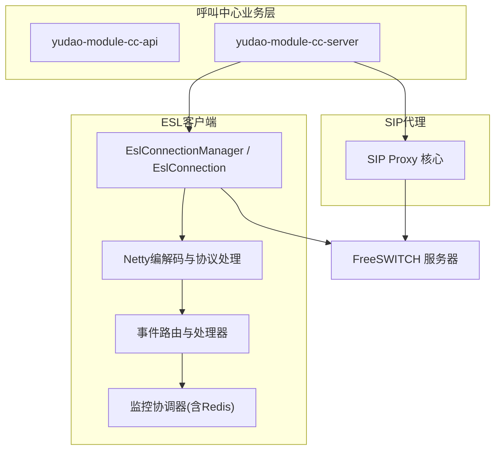
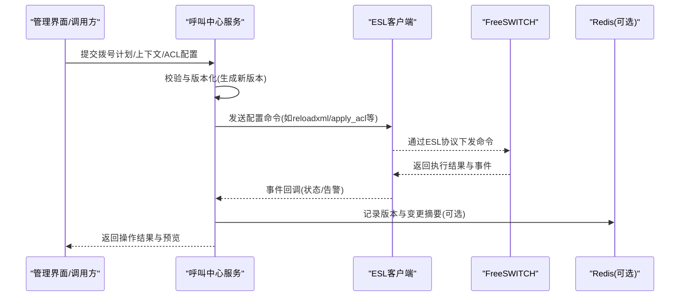
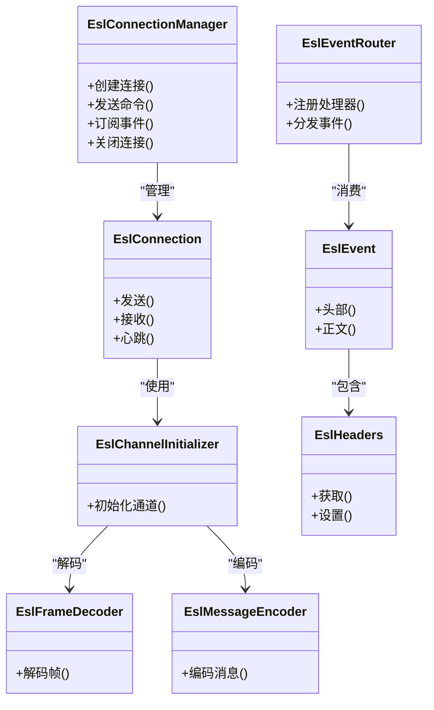
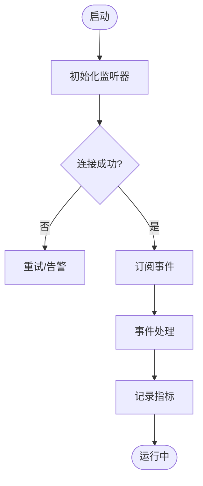
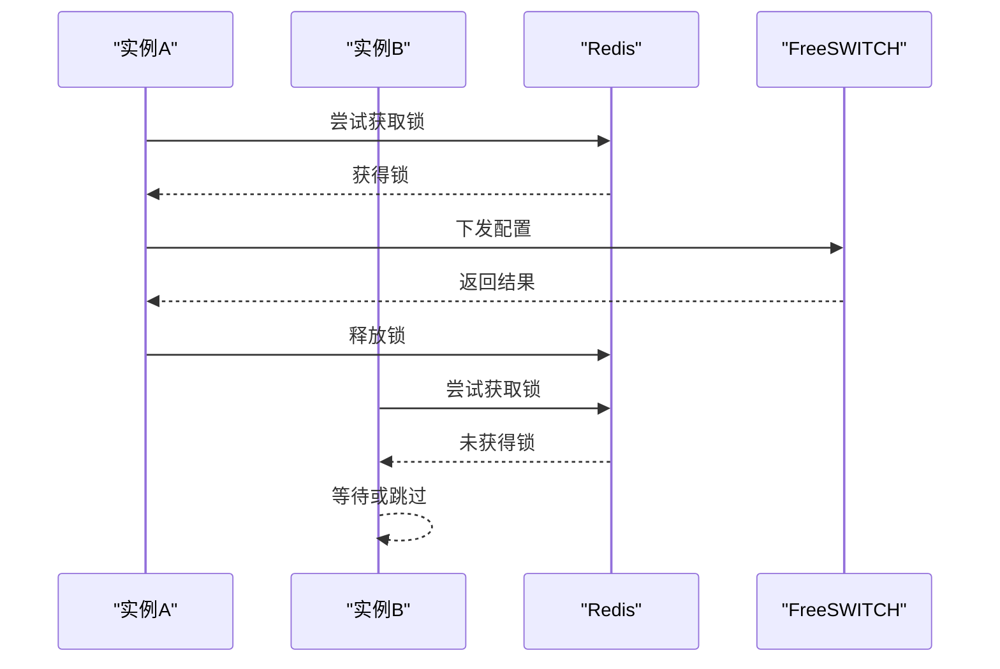
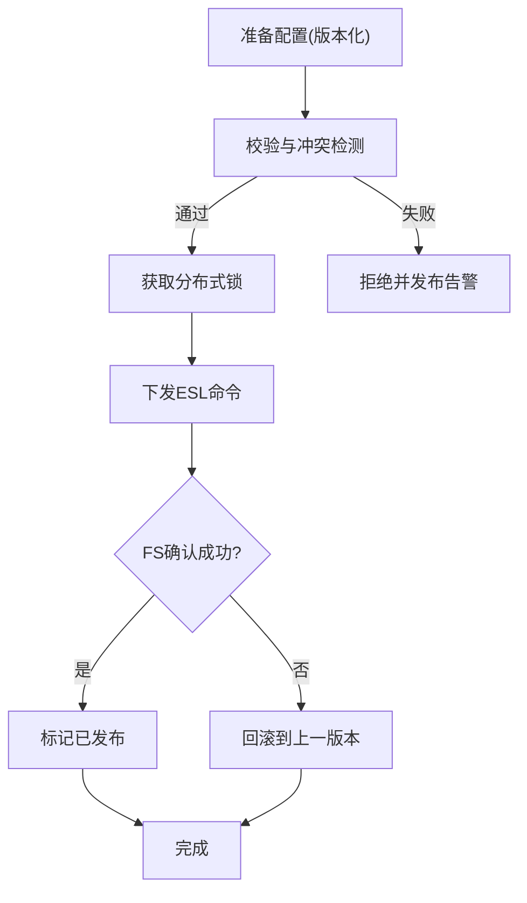
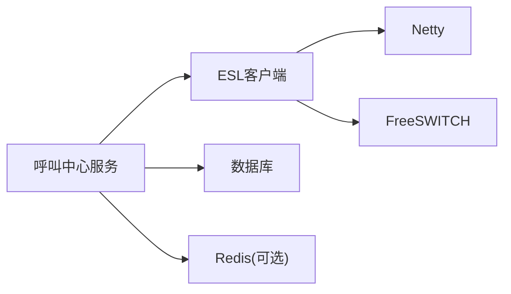

# FreeSWITCH配置管理

<cite>
**本文引用的文件**
- [yudao-module-cc-server/pom.xml](file://yudao-cloud/yudao-module-cc/yudao-module-cc-server/pom.xml)
- [yudao-module-cc-api/pom.xml](file://yudao-cloud/yudao-module-cc/yudao-module-cc-api/pom.xml)
- [ipcc-fs-esl/README.md](file://yudao-cloud/yudao-module-cc/ipcc-fs-esl/README.md)
- [ipcc-fs-esl/fs-esl-client组件架构设计.md](file://yudao-cloud/yudao-module-cc/ipcc-fs-esl/fs-esl-client组件架构设计.md)
- [ipcc-sipproxy/README.md](file://yudao-cloud/yudao-module-cc/ipcc-sipproxy/README.md)
- [sipproxy组件架构设计.md](file://yudao-cloud/yudao-module-cc/ipcc-sipproxy/sipproxy组件架构设计.md)
- [freeswitch部署脚本1.py](file://yudao-cloud/yudao-module-cc/doc/freeswitch服务/freeswitch部署脚本1.py)
- [freeswitch部署脚本2-用于集群部署-修改了主要端口.py](file://yudao-cloud/yudao-module-cc/doc/freeswitch服务/freeswitch部署脚本2-用于集群部署-修改了主要端口.py)
- [freeswitch模拟第三方网关-运营商的fs部署脚本.py](file://yudao-cloud/yudao-module-cc/doc/freeswitch服务/freeswitch模拟第三方网关-运营商的fs部署脚本.py)
- [系统数据初始化.sql](file://yudao-cloud/yudao-module-cc/doc/sql/系统数据初始化.sql)
- [autocall_task.sql](file://yudao-cloud/yudao-module-cc/doc/sql/autocall_task.sql)
- [EslConnectionManager.java](file://yudao-cloud/yudao-module-cc/ipcc-fs-esl/src/main/java/cn/ipcc/fs/esl/EslConnectionManager.java)
- [EslConnection.java](file://yudao-cloud/yudao-module-cc/ipcc-fs-esl/src/main/java/cn/ipcc/fs/esl/EslConnection.java)
- [EslClientConfig.java](file://yudao-cloud/yudao-module-cc/ipcc-fs-esl/src/main/java/cn/ipcc/fs/esl/EslClientConfig.java)
- [EslAutoConfiguration.java](file://yudao-cloud/yudao-module-cc/ipcc-fs-esl/src/main/java/cn/ipcc/fs/esl/spring/EslAutoConfiguration.java)
- [EslEventRouterListener.java](file://yudao-cloud/yudao-module-cc/ipcc-fs-esl/src/main/java/cn/ipcc/fs/esl/spring/EslEventRouterListener.java)
- [EslEventRouter.java](file://yudao-cloud/yudao-module-cc/ipcc-fs-esl/src/main/java/cn/ipcc/fs/esl/router/EslEventRouter.java)
- [EslEventHandler.java](file://yudao-cloud/yudao-module-cc/ipcc-fs-esl/src/main/java/cn/ipcc/fs/esl/router/EslEventHandler.java)
- [EslChannelInitializer.java](file://yudao-cloud/yudao-module-cc/ipcc-fs-esl/src/main/java/cn/ipcc/fs/esl/netty/EslChannelInitializer.java)
- [EslFrameDecoder.java](file://yudao-cloud/yudao-module-cc/ipcc-fs-esl/src/main/java/cn/ipcc/fs/esl/netty/EslFrameDecoder.java)
- [EslMessageEncoder.java](file://yudao-cloud/yudao-module-cc/ipcc-fs-esl/src/main/java/cn/ipcc/fs/esl/netty/EslMessageEncoder.java)
- [EslProtocolHandler.java](file://yudao-cloud/yudao-module-cc/ipcc-fs-esl/src/main/java/cn/ipcc/fs/esl/netty/EslProtocolHandler.java)
- [EslEvent.java](file://yudao-cloud/yudao-module-cc/ipcc-fs-esl/src/main/java/cn/ipcc/fs/esl/transport/EslEvent.java)
- [EslHeaders.java](file://yudao-cloud/yudao-module-cc/ipcc-fs-esl/src/main/java/cn/ipcc/fs/esl/transport/EslHeaders.java)
- [HeaderParser.java](file://yudao-cloud/yudao-module-cc/ipcc-fs-esl/src/main/java/cn/ipcc/fs/esl/transport/HeaderParser.java)
- [SendMsg.java](file://yudao-cloud/yudao-module-cc/ipcc-fs-esl/src/main/java/cn/ipcc/fs/esl/transport/SendMsg.java)
- [CommandResponse.java](file://yudao-cloud/yudao-module-cc/ipcc-fs-esl/src/main/java/cn/ipcc/fs/esl/transport/CommandResponse.java)
- [RedisEslMonitorCoordinator.java](file://yudao-cloud/yudao-module-cc/ipcc-fs-esl/src/main/java/cn/ipcc/fs/esl/coordinator/redis/RedisEslMonitorCoordinator.java)
- [EslMonitorCoordinator.java](file://yudao-cloud/yudao-module-cc/ipcc-fs-esl/src/main/java/cn/ipcc/fs/esl/coordinator/EslMonitorCoordinator.java)
- [EslConnectionListener.java](file://yudao-cloud/yudao-module-cc/ipcc-fs-esl/src/main/java/cn/ipcc/fs/esl/listener/EslConnectionListener.java)
- [EslEventListener.java](file://yudao-cloud/yudao-module-cc/ipcc-fs-esl/src/main/java/cn/ipcc/fs/esl/listener/EslEventListener.java)
- [EslMetrics.java](file://yudao-cloud/yudao-module-cc/ipcc-fs-esl/src/main/java/cn/ipcc/fs/esl/metrics/EslMetrics.java)
- [DefaultEslMetrics.java](file://yudao-cloud/yudao-module-cc/ipcc-fs-esl/src/main/java/cn/ipcc/fs/esl/metrics/DefaultEslMetrics.java)
- [CallRouteStatusEnum.java](file://yudao-cloud/yudao-module-cc/yudao-module-cc-api/src/main/java/cn/iocoder/yudao/module/cc/enums/CallRouteStatusEnum.java)
- [ErrorCodeConstants.java](file://yudao-cloud/yudao-module-cc/yudao-module-cc-api/src/main/java/cn/iocoder/yudao/module/cc/enums/ErrorCodeConstants.java)
</cite>

## 目录
1. [简介](#简介)
2. [项目结构](#项目结构)
3. [核心组件](#核心组件)
4. [架构总览](#架构总览)
5. [详细组件分析](#详细组件分析)
6. [依赖关系分析](#依赖关系分析)
7. [性能考量](#性能考量)
8. [故障排除指南](#故障排除指南)
9. [结论](#结论)
10. [附录](#附录)

## 简介
本文件面向FreeSWITCH配置管理能力，围绕拨号计划管理、上下文配置与ACL规则管理的实现进行系统化说明。文档基于仓库中的ESL客户端、SIP代理以及呼叫中心模块代码，梳理配置的存储结构、校验规则、动态更新机制、版本控制与备份恢复思路、冲突检测策略，以及与FreeSWITCH服务器的同步与生效流程。同时提供最佳实践与常见问题排查方法，帮助读者快速掌握并稳定运维该能力。

## 项目结构
本项目中与FreeSWITCH配置管理直接相关的代码集中在以下位置：
- ESL客户端库：负责与FreeSWITCH通过ESL协议通信，发送命令、订阅事件、解析响应与事件头。
- SIP代理：提供SIP信令路由与转发能力，可与FreeSWITCH协同工作。
- 呼叫中心业务模块：承载拨号计划、上下文、ACL等配置的业务建模、持久化与发布流程。
- 部署脚本与SQL：提供FreeSWITCH部署参考与系统数据初始化。

图表来源
- [EslConnectionManager.java](file://yudao-cloud/yudao-module-cc/ipcc-fs-esl/src/main/java/cn/ipcc/fs/esl/EslConnectionManager.java)
- [EslConnection.java](file://yudao-cloud/yudao-module-cc/ipcc-fs-esl/src/main/java/cn/ipcc/fs/esl/EslConnection.java)
- [EslChannelInitializer.java](file://yudao-cloud/yudao-module-cc/ipcc-fs-esl/src/main/java/cn/ipcc/fs/esl/netty/EslChannelInitializer.java)
- [EslEventRouter.java](file://yudao-cloud/yudao-module-cc/ipcc-fs-esl/src/main/java/cn/ipcc/fs/esl/router/EslEventRouter.java)
- [RedisEslMonitorCoordinator.java](file://yudao-cloud/yudao-module-cc/ipcc-fs-esl/src/main/java/cn/ipcc/fs/esl/coordinator/redis/RedisEslMonitorCoordinator.java)
- [sipproxy组件架构设计.md](file://yudao-cloud/yudao-module-cc/ipcc-sipproxy/sipproxy组件架构设计.md)

章节来源
- [yudao-module-cc-server/pom.xml](file://yudao-cloud/yudao-module-cc/yudao-module-cc-server/pom.xml)
- [yudao-module-cc-api/pom.xml](file://yudao-cloud/yudao-module-cc/yudao-module-cc-api/pom.xml)
- [ipcc-fs-esl/README.md](file://yudao-cloud/yudao-module-cc/ipcc-fs-esl/README.md)
- [ipcc-sipproxy/README.md](file://yudao-cloud/yudao-module-cc/ipcc-sipproxy/README.md)

## 核心组件
- ESL连接管理器：维护与FreeSWITCH的连接池、心跳、重连与命令并发控制。
- Netty协议栈：完成ESL帧的编码/解码、消息封装与协议处理。
- 事件路由：将FreeSWITCH事件分发到具体处理器，支撑状态同步与审计。
- 监控协调器：在分布式环境下协调多实例对FS的访问与监控（含Redis实现）。
- SIP代理：提供SIP信令路由能力，与FS协同完成呼叫建立与媒体协商。
- 业务API与枚举：定义错误码、路由状态等通用常量，供上层调用。

章节来源
- [EslConnectionManager.java](file://yudao-cloud/yudao-module-cc/ipcc-fs-esl/src/main/java/cn/ipcc/fs/esl/EslConnectionManager.java)
- [EslConnection.java](file://yudao-cloud/yudao-module-cc/ipcc-fs-esl/src/main/java/cn/ipcc/fs/esl/EslConnection.java)
- [EslChannelInitializer.java](file://yudao-cloud/yudao-module-cc/ipcc-fs-esl/src/main/java/cn/ipcc/fs/esl/netty/EslChannelInitializer.java)
- [EslEventRouter.java](file://yudao-cloud/yudao-module-cc/ipcc-fs-esl/src/main/java/cn/ipcc/fs/esl/router/EslEventRouter.java)
- [RedisEslMonitorCoordinator.java](file://yudao-cloud/yudao-module-cc/ipcc-fs-esl/src/main/java/cn/ipcc/fs/esl/coordinator/redis/RedisEslMonitorCoordinator.java)
- [CallRouteStatusEnum.java](file://yudao-cloud/yudao-module-cc/yudao-module-cc-api/src/main/java/cn/iocoder/yudao/module/cc/enums/CallRouteStatusEnum.java)
- [ErrorCodeConstants.java](file://yudao-cloud/yudao-module-cc/yudao-module-cc-api/src/main/java/cn/iocoder/yudao/module/cc/enums/ErrorCodeConstants.java)

## 架构总览
下图展示了从业务侧发起配置变更到FreeSWITCH生效的整体流程，包括ESL命令下发、事件回传、状态同步与一致性保障。

图表来源
- [EslConnectionManager.java](file://yudao-cloud/yudao-module-cc/ipcc-fs-esl/src/main/java/cn/ipcc/fs/esl/EslConnectionManager.java)
- [EslConnection.java](file://yudao-cloud/yudao-module-cc/ipcc-fs-esl/src/main/java/cn/ipcc/fs/esl/EslConnection.java)
- [EslEventRouter.java](file://yudao-cloud/yudao-module-cc/ipcc-fs-esl/src/main/java/cn/ipcc/fs/esl/router/EslEventRouter.java)
- [RedisEslMonitorCoordinator.java](file://yudao-cloud/yudao-module-cc/ipcc-fs-esl/src/main/java/cn/ipcc/fs/esl/coordinator/redis/RedisEslMonitorCoordinator.java)

## 详细组件分析

### ESL客户端与协议栈
- 连接管理：集中管理连接生命周期、心跳、超时与重试；支持多连接与负载均衡。
- 编解码：基于Netty实现ESL帧的解码与编码，保证高吞吐与低延迟。
- 事件路由：按事件名路由到处理器，便于扩展与解耦。
- 传输对象：统一的事件与头部模型，简化上层使用。

图表来源
- [EslConnectionManager.java](file://yudao-cloud/yudao-module-cc/ipcc-fs-esl/src/main/java/cn/ipcc/fs/esl/EslConnectionManager.java)
- [EslConnection.java](file://yudao-cloud/yudao-module-cc/ipcc-fs-esl/src/main/java/cn/ipcc/fs/esl/EslConnection.java)
- [EslChannelInitializer.java](file://yudao-cloud/yudao-module-cc/ipcc-fs-esl/src/main/java/cn/ipcc/fs/esl/netty/EslChannelInitializer.java)
- [EslFrameDecoder.java](file://yudao-cloud/yudao-module-cc/ipcc-fs-esl/src/main/java/cn/ipcc/fs/esl/netty/EslFrameDecoder.java)
- [EslMessageEncoder.java](file://yudao-cloud/yudao-module-cc/ipcc-fs-esl/src/main/java/cn/ipcc/fs/esl/netty/EslMessageEncoder.java)
- [EslEventRouter.java](file://yudao-cloud/yudao-module-cc/ipcc-fs-esl/src/main/java/cn/ipcc/fs/esl/router/EslEventRouter.java)
- [EslEvent.java](file://yudao-cloud/yudao-module-cc/ipcc-fs-esl/src/main/java/cn/ipcc/fs/esl/transport/EslEvent.java)
- [EslHeaders.java](file://yudao-cloud/yudao-module-cc/ipcc-fs-esl/src/main/java/cn/ipcc/fs/esl/transport/EslHeaders.java)

章节来源
- [fs-esl-client组件架构设计.md](file://yudao-cloud/yudao-module-cc/ipcc-fs-esl/fs-esl-client组件架构设计.md)
- [EslAutoConfiguration.java](file://yudao-cloud/yudao-module-cc/ipcc-fs-esl/src/main/java/cn/ipcc/fs/esl/spring/EslAutoConfiguration.java)
- [EslEventRouterListener.java](file://yudao-cloud/yudao-module-cc/ipcc-fs-esl/src/main/java/cn/ipcc/fs/esl/spring/EslEventRouterListener.java)

### 事件监听与指标
- 连接监听：捕获连接建立、断开与异常，触发重连或告警。
- 事件监听：订阅FS事件，用于状态同步、审计与可视化。
- 指标采集：统计连接数、命令耗时、事件吞吐等关键指标。

图表来源
- [EslConnectionListener.java](file://yudao-cloud/yudao-module-cc/ipcc-fs-esl/src/main/java/cn/ipcc/fs/esl/listener/EslConnectionListener.java)
- [EslEventListener.java](file://yudao-cloud/yudao-module-cc/ipcc-fs-esl/src/main/java/cn/ipcc/fs/esl/listener/EslEventListener.java)
- [EslMetrics.java](file://yudao-cloud/yudao-module-cc/ipcc-fs-esl/src/main/java/cn/ipcc/fs/esl/metrics/EslMetrics.java)
- [DefaultEslMetrics.java](file://yudao-cloud/yudao-module-cc/ipcc-fs-esl/src/main/java/cn/ipcc/fs/esl/metrics/DefaultEslMetrics.java)

章节来源
- [EslConnectionListener.java](file://yudao-cloud/yudao-module-cc/ipcc-fs-esl/src/main/java/cn/ipcc/fs/esl/listener/EslConnectionListener.java)
- [EslEventListener.java](file://yudao-cloud/yudao-module-cc/ipcc-fs-esl/src/main/java/cn/ipcc/fs/esl/listener/EslEventListener.java)
- [EslMetrics.java](file://yudao-cloud/yudao-module-cc/ipcc-fs-esl/src/main/java/cn/ipcc/fs/esl/metrics/EslMetrics.java)
- [DefaultEslMetrics.java](file://yudao-cloud/yudao-module-cc/ipcc-fs-esl/src/main/java/cn/ipcc/fs/esl/metrics/DefaultEslMetrics.java)

### 监控协调器（分布式）
- 目标：在多实例场景下避免重复下发配置与冲突。
- 方案：基于Redis实现分布式锁/协调，确保单一节点执行写操作，其他节点只读或等待。

图表来源
- [RedisEslMonitorCoordinator.java](file://yudao-cloud/yudao-module-cc/ipcc-fs-esl/src/main/java/cn/ipcc/fs/esl/coordinator/redis/RedisEslMonitorCoordinator.java)
- [EslMonitorCoordinator.java](file://yudao-cloud/yudao-module-cc/ipcc-fs-esl/src/main/java/cn/ipcc/fs/esl/coordinator/EslMonitorCoordinator.java)

章节来源
- [RedisEslMonitorCoordinator.java](file://yudao-cloud/yudao-module-cc/ipcc-fs-esl/src/main/java/cn/ipcc/fs/esl/coordinator/redis/RedisEslMonitorCoordinator.java)
- [EslMonitorCoordinator.java](file://yudao-cloud/yudao-module-cc/ipcc-fs-esl/src/main/java/cn/ipcc/fs/esl/coordinator/EslMonitorCoordinator.java)

### 与SIP代理的协作
- SIP代理负责SIP信令路由与转发，可与FreeSWITCH配合完成呼叫建立、媒体协商与路由策略。
- 通过配置中心或数据库驱动，将路由规则同步至SIP代理与FS，保持一致性。

章节来源
- [ipcc-sipproxy/README.md](file://yudao-cloud/yudao-module-cc/ipcc-sipproxy/README.md)
- [sipproxy组件架构设计.md](file://yudao-cloud/yudao-module-cc/ipcc-sipproxy/sipproxy组件架构设计.md)

### 配置项存储结构与校验
- 存储结构：建议以“拨号计划/上下文/ACL”为维度进行分层存储，结合版本号与生效时间戳。
- 校验规则：
  - 语法校验：模板/DSL合法性检查。
  - 语义校验：上下文引用、ACL规则冲突检测。
  - 权限校验：操作者角色与资源范围。
- 动态更新：通过ESL命令触发FS重载或增量应用，结合事件确认与回滚机制。

章节来源
- [系统数据初始化.sql](file://yudao-cloud/yudao-module-cc/doc/sql/系统数据初始化.sql)
- [autocall_task.sql](file://yudao-cloud/yudao-module-cc/doc/sql/autocall_task.sql)
- [CallRouteStatusEnum.java](file://yudao-cloud/yudao-module-cc/yudao-module-cc-api/src/main/java/cn/iocoder/yudao/module/cc/enums/CallRouteStatusEnum.java)
- [ErrorCodeConstants.java](file://yudao-cloud/yudao-module-cc/yudao-module-cc-api/src/main/java/cn/iocoder/yudao/module/cc/enums/ErrorCodeConstants.java)

### 版本控制、备份恢复与冲突检测
- 版本控制：每次变更生成新版本，保留历史快照，支持对比与回滚。
- 备份恢复：定期导出配置快照，支持一键恢复与灰度切换。
- 冲突检测：在合并前进行规则冲突扫描（如ACL覆盖、上下文循环引用），失败则阻断发布。

章节来源
- [RedisEslMonitorCoordinator.java](file://yudao-cloud/yudao-module-cc/ipcc-fs-esl/src/main/java/cn/ipcc/fs/esl/coordinator/redis/RedisEslMonitorCoordinator.java)
- [EslConnectionManager.java](file://yudao-cloud/yudao-module-cc/ipcc-fs-esl/src/main/java/cn/ipcc/fs/esl/EslConnectionManager.java)

### 与FreeSWITCH的同步机制与生效流程
- 同步方式：通过ESL发送reloadxml、apply_acl等命令，或使用模块化重载接口。
- 生效流程：
  1) 预检：本地校验与冲突检测。
  2) 发布：单实例锁定后下发命令。
  3) 确认：订阅FS事件确认加载成功。
  4) 回滚：若失败或健康检查不通过，自动回滚到上一版本。

图表来源
- [EslConnectionManager.java](file://yudao-cloud/yudao-module-cc/ipcc-fs-esl/src/main/java/cn/ipcc/fs/esl/EslConnectionManager.java)
- [EslConnection.java](file://yudao-cloud/yudao-module-cc/ipcc-fs-esl/src/main/java/cn/ipcc/fs/esl/EslConnection.java)
- [EslEventRouter.java](file://yudao-cloud/yudao-module-cc/ipcc-fs-esl/src/main/java/cn/ipcc/fs/esl/router/EslEventRouter.java)
- [RedisEslMonitorCoordinator.java](file://yudao-cloud/yudao-module-cc/ipcc-fs-esl/src/main/java/cn/ipcc/fs/esl/coordinator/redis/RedisEslMonitorCoordinator.java)

## 依赖关系分析
- 模块内依赖：
  - 呼叫中心服务依赖ESL客户端进行FS交互。
  - ESL客户端依赖Netty进行网络IO与协议编解码。
  - 事件路由依赖监听器与指标组件。
- 外部依赖：
  - FreeSWITCH：通过ESL协议暴露配置与事件接口。
  - Redis：用于分布式协调与缓存。
  - 数据库：持久化配置与版本信息。

图表来源
- [EslConnectionManager.java](file://yudao-cloud/yudao-module-cc/ipcc-fs-esl/src/main/java/cn/ipcc/fs/esl/EslConnectionManager.java)
- [EslChannelInitializer.java](file://yudao-cloud/yudao-module-cc/ipcc-fs-esl/src/main/java/cn/ipcc/fs/esl/netty/EslChannelInitializer.java)
- [RedisEslMonitorCoordinator.java](file://yudao-cloud/yudao-module-cc/ipcc-fs-esl/src/main/java/cn/ipcc/fs/esl/coordinator/redis/RedisEslMonitorCoordinator.java)

章节来源
- [yudao-module-cc-server/pom.xml](file://yudao-cloud/yudao-module-cc/yudao-module-cc-server/pom.xml)
- [yudao-module-cc-api/pom.xml](file://yudao-cloud/yudao-module-cc/yudao-module-cc-api/pom.xml)

## 性能考量
- 连接复用与池化：减少频繁建连开销，提升命令吞吐。
- 异步事件处理：避免阻塞主线程，提高事件处理能力。
- 批量下发与增量更新：降低FS重载频率与CPU占用。
- 指标与限流：监控关键指标，必要时限流保护FS。

[本节为通用指导，无需特定文件来源]

## 故障排除指南
- 连接问题：检查ESL地址、端口、认证与防火墙；查看连接监听日志与指标。
- 命令超时：调整超时参数，关注FS负载与队列堆积。
- 事件丢失：确认事件订阅是否成功，检查事件路由注册。
- 配置未生效：核对版本与发布状态，查看FS事件确认与回滚记录。
- 冲突与回滚：查看冲突检测结果与回滚原因，定位问题配置。

章节来源
- [EslConnectionListener.java](file://yudao-cloud/yudao-module-cc/ipcc-fs-esl/src/main/java/cn/ipcc/fs/esl/listener/EslConnectionListener.java)
- [EslEventListener.java](file://yudao-cloud/yudao-module-cc/ipcc-fs-esl/src/main/java/cn/ipcc/fs/esl/listener/EslEventListener.java)
- [EslMetrics.java](file://yudao-cloud/yudao-module-cc/ipcc-fs-esl/src/main/java/cn/ipcc/fs/esl/metrics/EslMetrics.java)
- [DefaultEslMetrics.java](file://yudao-cloud/yudao-module-cc/ipcc-fs-esl/src/main/java/cn/ipcc/fs/esl/metrics/DefaultEslMetrics.java)
- [ErrorCodeConstants.java](file://yudao-cloud/yudao-module-cc/yudao-module-cc-api/src/main/java/cn/iocoder/yudao/module/cc/enums/ErrorCodeConstants.java)

## 结论
本方案通过ESL客户端与SIP代理，结合版本化、分布式协调与事件确认机制，实现了FreeSWITCH拨号计划、上下文与ACL的安全、可控与可观测的动态配置管理。建议在生产环境启用版本控制、灰度发布与回滚策略，并持续完善指标与告警体系，确保稳定性与可维护性。

[本节为总结性内容，无需特定文件来源]

## 附录

### 配置示例与管理界面操作指南
- 拨号计划：
  - 新建/编辑拨号计划条目，设置匹配规则与跳转上下文。
  - 预览与校验通过后发布，观察FS事件确认。
- 上下文配置：
  - 管理上下文与扩展映射，避免循环引用。
  - 支持导入/导出与版本对比。
- ACL规则：
  - 定义允许/拒绝列表，支持CIDR与域名匹配。
  - 发布前进行冲突检测，避免覆盖误配。

[本节为概念性说明，无需特定文件来源]

### 部署脚本参考
- 单机部署脚本：适用于测试与开发环境。
- 集群部署脚本：调整端口与集群参数，适合生产环境。
- 模拟第三方网关脚本：用于联调与压测。

章节来源
- [freeswitch部署脚本1.py](file://yudao-cloud/yudao-module-cc/doc/freeswitch服务/freeswitch部署脚本1.py)
- [freeswitch部署脚本2-用于集群部署-修改了主要端口.py](file://yudao-cloud/yudao-module-cc/doc/freeswitch服务/freeswitch部署脚本2-用于集群部署-修改了主要端口.py)
- [freeswitch模拟第三方网关-运营商的fs部署脚本.py](file://yudao-cloud/yudao-module-cc/doc/freeswitch服务/freeswitch模拟第三方网关-运营商的fs部署脚本.py)

### 数据初始化参考
- 系统数据初始化：提供基础字典、角色与默认配置。
- 外呼任务表结构：用于自动化外呼场景的数据支撑。

章节来源
- [系统数据初始化.sql](file://yudao-cloud/yudao-module-cc/doc/sql/系统数据初始化.sql)
- [autocall_task.sql](file://yudao-cloud/yudao-module-cc/doc/sql/autocall_task.sql)