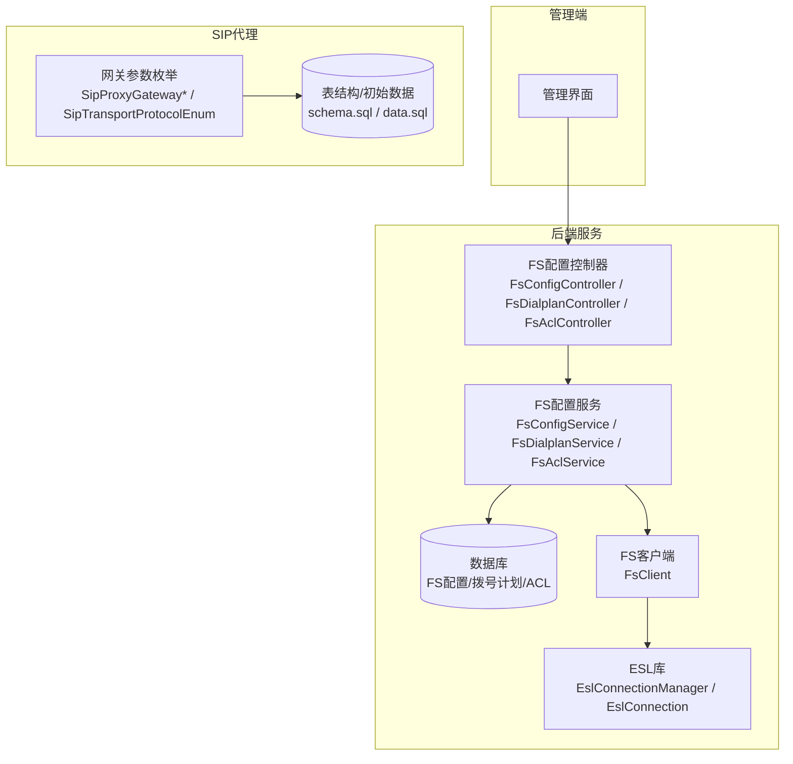
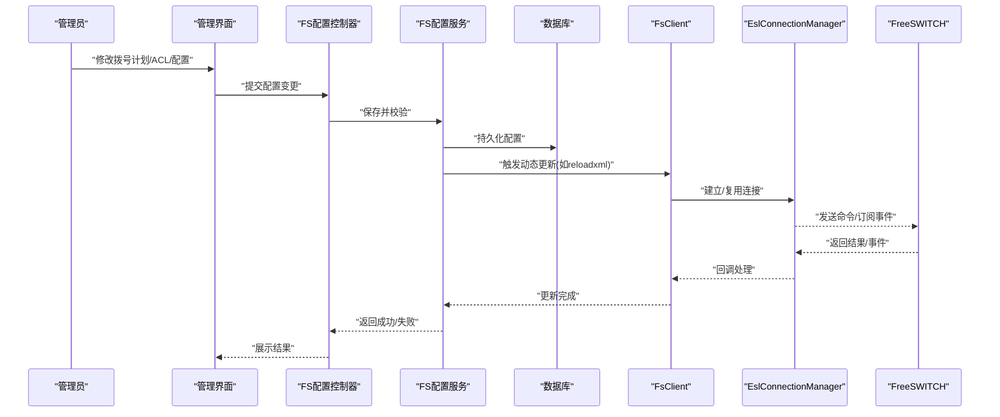
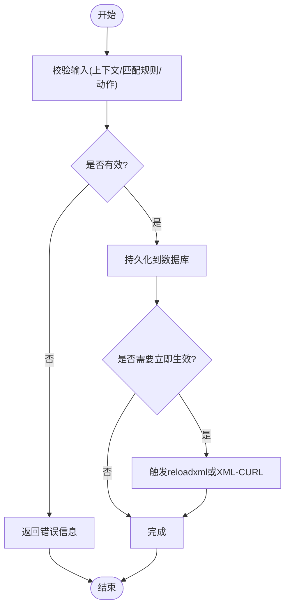
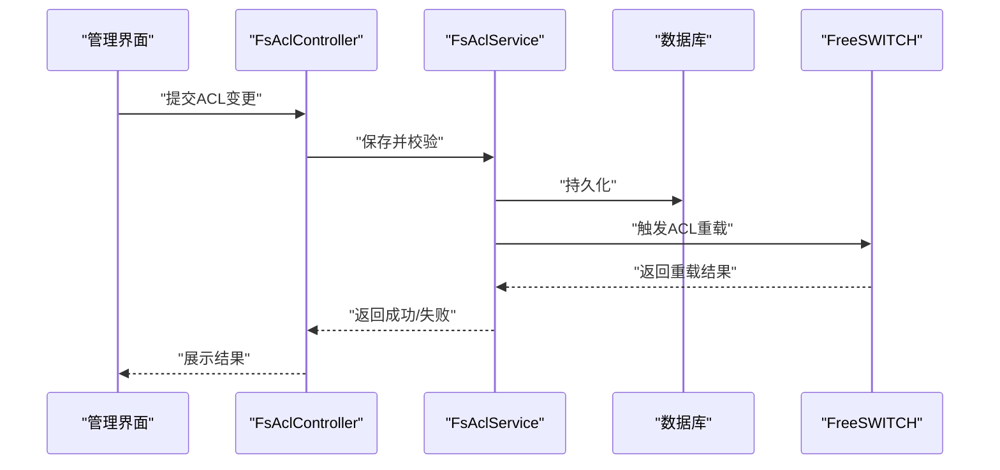
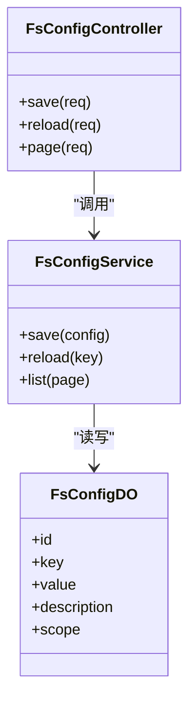
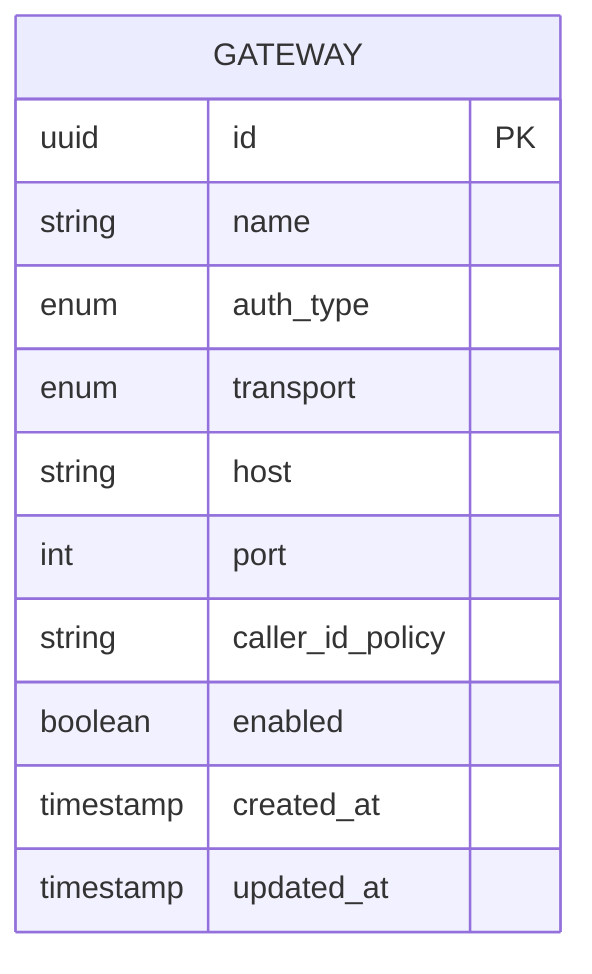
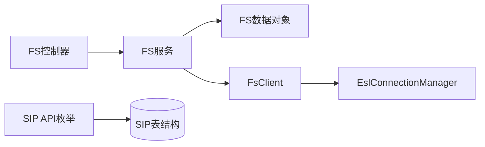

# 系统配置管理

<cite>
**本文引用的文件**
- [FsConfigController.java](file://yudao-cloud/yudao-module-cc/yudao-module-cc-server/src/main/java/cn/iocoder/yudao/module/cc/controller/admin/fs/FsConfigController.java)
- [FsDialplanController.java](file://yudao-cloud/yudao-module-cc/yudao-module-cc-server/src/main/java/cn/iocoder/yudao/module/cc/controller/admin/fs/FsDialplanController.java)
- [FsAclController.java](file://yudao-cloud/yudao-module-cc/yudao-module-cc-server/src/main/java/cn/iocoder/yudao/module/cc/controller/admin/fs/FsAclController.java)
- [FsXmlCurlController.java](file://yudao-cloud/yudao-module-cc/yudao-module-cc-server/src/main/java/cn/iocoder/yudao/module/cc/controller/admin/fs/FsXmlCurlController.java)
- [FsConfigService.java](file://yudao-cloud/yudao-module-cc/yudao-module-cc-server/src/main/java/cn/iocoder/yudao/module/cc/service/fs/FsConfigService.java)
- [FsConfigServiceImpl.java](file://yudao-cloud/yudao-module-cc/yudao-module-cc-server/src/main/java/cn/iocoder/yudao/module/cc/service/fs/FsConfigServiceImpl.java)
- [FsDialplanService.java](file://yudao-cloud/yudao-module-cc/yudao-module-cc-server/src/main/java/cn/iocoder/yudao/module/cc/service/fs/FsDialplanService.java)
- [FsDialplanServiceImpl.java](file://yudao-cloud/yudao-module-cc/yudao-module-cc-server/src/main/java/cn/iocoder/yudao/module/cc/service/fs/FsDialplanServiceImpl.java)
- [FsAclService.java](file://yudao-cloud/yudao-module-cc/yudao-module-cc-server/src/main/java/cn/iocoder/yudao/module/cc/service/fs/FsAclService.java)
- [FsAclServiceImpl.java](file://yudao-cloud/yudao-module-cc/yudao-module-cc-server/src/main/java/cn/iocoder/yudao/module/cc/service/fs/FsAclServiceImpl.java)
- [FsXmlCurlService.java](file://yudao-cloud/yudao-module-cc/yudao-module-cc-server/src/main/java/cn/iocoder/yudao/module/cc/service/fs/FsXmlCurlService.java)
- [FsXmlCurlServiceImpl.java](file://yudao-cloud/yudao-module-cc/yudao-module-cc-server/src/main/java/cn/iocoder/yudao/module/cc/service/fs/FsXmlCurlServiceImpl.java)
- [FsConfigDO.java](file://yudao-cloud/yudao-module-cc/yudao-module-cc-server/src/main/java/cn/iocoder/yudao/module/cc/dal/dataobject/fs/FsConfigDO.java)
- [FsDialplanDO.java](file://yudao-cloud/yudao-module-cc/yudao-module-cc-server/src/main/java/cn/iocoder/yudao/module/cc/dal/dataobject/fs/FsDialplanDO.java)
- [FsAclDO.java](file://yudao-cloud/yudao-module-cc/yudao-module-cc-server/src/main/java/cn/iocoder/yudao/module/cc/dal/dataobject/fs/FsAclDO.java)
- [FsModulesDO.java](file://yudao-cloud/yudao-module-cc/yudao-module-cc-server/src/main/java/cn/iocoder/yudao/module/cc/dal/dataobject/fs/FsModulesDO.java)
- [FsClient.java](file://yudao-cloud/yudao-module-cc/yudao-module-cc-server/src/main/java/cn/iocoder/yudao/module/cc/esl/client/FsClient.java)
- [EslConnectionManager.java](file://yudao-cloud/yudao-module-cc/ipcc-fs-esl/src/main/java/cn/ipcc/fs/esl/EslConnectionManager.java)
- [EslConnection.java](file://yudao-cloud/yudao-module-cc/ipcc-fs-esl/src/main/java/cn/ipcc/fs/esl/EslConnection.java)
- [CcConfig.java](file://yudao-cloud/yudao-module-cc/yudao-module-cc-server/src/main/java/cn/iocoder/yudao/module/cc/config/CcConfig.java)
- [SipProxyGatewayAuthTypeEnum.java](file://yudao-cloud/yudao-module-cc/yudao-module-cc-api/src/main/java/cn/iocoder/yudao/module/cc/enums/SipProxyGatewayAuthTypeEnum.java)
- [SipTransportProtocolEnum.java](file://yudao-cloud/yudao-module-cc/yudao-module-cc-api/src/main/java/cn/iocoder/yudao/module/cc/enums/SipTransportProtocolEnum.java)
- [SipProxyGatewayCallerIdEnum.java](file://yudao-cloud/yudao-module-cc/yudao-module-cc-api/src/main/java/cn/iocoder/yudao/module/cc/enums/SipProxyGatewayCallerIdEnum.java)
- [SipGatewayParamEnum.java](file://yudao-cloud/yudao-module-cc/yudao-module-cc-api/src/main/java/cn/iocoder/yudao/module/cc/enums/SipGatewayParamEnum.java)
- [SipGatewaySettingParamEnum.java](file://yudao-cloud/yudao-module-cc/yudao-module-cc-api/src/main/java/cn/iocoder/yudao/module/cc/enums/SipGatewaySettingParamEnum.java)
- [data.sql](file://yudao-cloud/yudao-module-cc/ipcc-sipproxy/src/main/resources/data.sql)
- [schema.sql](file://yudao-cloud/yudao-module-cc/ipcc-sipproxy/src/main/resources/schema.sql)
- [Freeswitch部署脚本1.py](file://yudao-cloud/yudao-module-cc/doc/freeswitch服务/freeswitch部署脚本1.py)
- [freeswitch模拟第三方网关-运营商的fs部署脚本.py](file://yudao-cloud/yudao-module-cc/doc/freeswitch服务/freeswitch模拟第三方网关-运营商的fs部署脚本.py)
</cite>

## 目录
1. [简介](#简介)
2. [项目结构](#项目结构)
3. [核心组件](#核心组件)
4. [架构总览](#架构总览)
5. [详细组件分析](#详细组件分析)
6. [依赖关系分析](#依赖关系分析)
7. [性能考虑](#性能考虑)
8. [故障排除指南](#故障排除指南)
9. [结论](#结论)
10. [附录](#附录)

## 简介
本模块提供面向FreeSWITCH的系统配置管理能力，覆盖拨号计划、上下文与ACL规则管理；同时提供SIP网关（通过SIP Proxy）的配置、状态监控与故障转移能力。系统以“配置即数据”的方式将FreeSWITCH相关配置持久化到数据库，并通过ESL（Event Socket Library）动态下发至运行中的FreeSWITCH实例，实现热更新与可观测性。

## 项目结构
该功能主要位于呼叫中心模块中，围绕FreeSWITCH与SIP Proxy两大子系统展开：
- FreeSWITCH配置管理：控制器/服务/数据对象分别位于controller/admin/fs、service/fs、dal/dataobject/fs。
- SIP Proxy网关管理：枚举定义在yudao-module-cc-api，实体与表结构在ipcc-sipproxy模块的资源文件中。
- ESL通信：通过ipcc-fs-esl提供的连接管理与客户端封装，统一与FreeSWITCH交互。

图表来源
- [FsConfigController.java](file://yudao-cloud/yudao-module-cc/yudao-module-cc-server/src/main/java/cn/iocoder/yudao/module/cc/controller/admin/fs/FsConfigController.java)
- [FsDialplanController.java](file://yudao-cloud/yudao-module-cc/yudao-module-cc-server/src/main/java/cn/iocoder/yudao/module/cc/controller/admin/fs/FsDialplanController.java)
- [FsAclController.java](file://yudao-cloud/yudao-module-cc/yudao-module-cc-server/src/main/java/cn/iocoder/yudao/module/cc/controller/admin/fs/FsAclController.java)
- [FsConfigService.java](file://yudao-cloud/yudao-module-cc/yudao-module-cc-server/src/main/java/cn/iocoder/yudao/module/cc/service/fs/FsConfigService.java)
- [FsDialplanService.java](file://yudao-cloud/yudao-module-cc/yudao-module-cc-server/src/main/java/cn/iocoder/yudao/module/cc/service/fs/FsDialplanService.java)
- [FsAclService.java](file://yudao-cloud/yudao-module-cc/yudao-module-cc-server/src/main/java/cn/iocoder/yudao/module/cc/service/fs/FsAclService.java)
- [EslConnectionManager.java](file://yudao-cloud/yudao-module-cc/ipcc-fs-esl/src/main/java/cn/ipcc/fs/esl/EslConnectionManager.java)
- [EslConnection.java](file://yudao-cloud/yudao-module-cc/ipcc-fs-esl/src/main/java/cn/ipcc/fs/esl/EslConnection.java)
- [SipProxyGatewayAuthTypeEnum.java](file://yudao-cloud/yudao-module-cc/yudao-module-cc-api/src/main/java/cn/iocoder/yudao/module/cc/enums/SipProxyGatewayAuthTypeEnum.java)
- [SipTransportProtocolEnum.java](file://yudao-cloud/yudao-module-cc/yudao-module-cc-api/src/main/java/cn/iocoder/yudao/module/cc/enums/SipTransportProtocolEnum.java)
- [schema.sql](file://yudao-cloud/yudao-module-cc/ipcc-sipproxy/src/main/resources/schema.sql)
- [data.sql](file://yudao-cloud/yudao-module-cc/ipcc-sipproxy/src/main/resources/data.sql)

章节来源
- [FsConfigController.java](file://yudao-cloud/yudao-module-cc/yudao-module-cc-server/src/main/java/cn/iocoder/yudao/module/cc/controller/admin/fs/FsConfigController.java)
- [FsDialplanController.java](file://yudao-cloud/yudao-module-cc/yudao-module-cc-server/src/main/java/cn/iocoder/yudao/module/cc/controller/admin/fs/FsDialplanController.java)
- [FsAclController.java](file://yudao-cloud/yudao-module-cc/yudao-module-cc-server/src/main/java/cn/iocoder/yudao/module/cc/controller/admin/fs/FsAclController.java)
- [FsConfigService.java](file://yudao-cloud/yudao-module-cc/yudao-module-cc-server/src/main/java/cn/iocoder/yudao/module/cc/service/fs/FsConfigService.java)
- [FsDialplanService.java](file://yudao-cloud/yudao-module-cc/yudao-module-cc-server/src/main/java/cn/iocoder/yudao/module/cc/service/fs/FsDialplanService.java)
- [FsAclService.java](file://yudao-cloud/yudao-module-cc/yudao-module-cc-server/src/main/java/cn/iocoder/yudao/module/cc/service/fs/FsAclService.java)
- [EslConnectionManager.java](file://yudao-cloud/yudao-module-cc/ipcc-fs-esl/src/main/java/cn/ipcc/fs/esl/EslConnectionManager.java)
- [EslConnection.java](file://yudao-cloud/yudao-module-cc/ipcc-fs-esl/src/main/java/cn/ipcc/fs/esl/EslConnection.java)
- [SipProxyGatewayAuthTypeEnum.java](file://yudao-cloud/yudao-module-cc/yudao-module-cc-api/src/main/java/cn/iocoder/yudao/module/cc/enums/SipProxyGatewayAuthTypeEnum.java)
- [SipTransportProtocolEnum.java](file://yudao-cloud/yudao-module-cc/yudao-module-cc-api/src/main/java/cn/iocoder/yudao/module/cc/enums/SipTransportProtocolEnum.java)
- [schema.sql](file://yudao-cloud/yudao-module-cc/ipcc-sipproxy/src/main/resources/schema.sql)
- [data.sql](file://yudao-cloud/yudao-module-cc/ipcc-sipproxy/src/main/resources/data.sql)

## 核心组件
- FreeSWITCH配置管理
  - 拨号计划：增删改查、按上下文组织、支持XML模板与动态生成。
  - 上下文：作为拨号计划的逻辑分组，便于路由策略隔离。
  - ACL规则：基于IP/网段的访问控制列表，支持白名单/黑名单模式。
- SIP网关管理（SIP Proxy）
  - 网关参数：认证方式、传输协议、主叫号码策略等由枚举集中管理。
  - 状态监控：通过SIP Proxy与FS事件聚合，展示在线/离线、注册状态。
  - 故障转移：多网关/多节点时，依据健康检查与优先级进行自动切换。
- ESL通信层
  - 连接池与心跳：EslConnectionManager负责连接生命周期与重连。
  - 命令执行：FsClient封装常用FS命令（如reloadxml、acl reload）。
- 配置存储与版本
  - 配置项以数据对象形式持久化，便于审计与回滚。
  - 结合变更日志与快照机制，支持版本对比与恢复。

章节来源
- [FsDialplanDO.java](file://yudao-cloud/yudao-module-cc/yudao-module-cc-server/src/main/java/cn/iocoder/yudao/module/cc/dal/dataobject/fs/FsDialplanDO.java)
- [FsAclDO.java](file://yudao-cloud/yudao-module-cc/yudao-module-cc-server/src/main/java/cn/iocoder/yudao/module/cc/dal/dataobject/fs/FsAclDO.java)
- [FsConfigDO.java](file://yudao-cloud/yudao-module-cc/yudao-module-cc-server/src/main/java/cn/iocoder/yudao/module/cc/dal/dataobject/fs/FsConfigDO.java)
- [FsModulesDO.java](file://yudao-cloud/yudao-module-cc/yudao-module-cc-server/src/main/java/cn/iocoder/yudao/module/cc/dal/dataobject/fs/FsModulesDO.java)
- [FsClient.java](file://yudao-cloud/yudao-module-cc/yudao-module-cc-server/src/main/java/cn/iocoder/yudao/module/cc/esl/client/FsClient.java)
- [EslConnectionManager.java](file://yudao-cloud/yudao-module-cc/ipcc-fs-esl/src/main/java/cn/ipcc/fs/esl/EslConnectionManager.java)
- [EslConnection.java](file://yudao-cloud/yudao-module-cc/ipcc-fs-esl/src/main/java/cn/ipcc/fs/esl/EslConnection.java)

## 架构总览
下图展示了从管理界面到FreeSWITCH的完整链路，以及SIP Proxy网关管理的参与点。

图表来源
- [FsConfigController.java](file://yudao-cloud/yudao-module-cc/yudao-module-cc-server/src/main/java/cn/iocoder/yudao/module/cc/controller/admin/fs/FsConfigController.java)
- [FsDialplanController.java](file://yudao-cloud/yudao-module-cc/yudao-module-cc-server/src/main/java/cn/iocoder/yudao/module/cc/controller/admin/fs/FsDialplanController.java)
- [FsAclController.java](file://yudao-cloud/yudao-module-cc/yudao-module-cc-server/src/main/java/cn/iocoder/yudao/module/cc/controller/admin/fs/FsAclController.java)
- [FsConfigService.java](file://yudao-cloud/yudao-module-cc/yudao-module-cc-server/src/main/java/cn/iocoder/yudao/module/cc/service/fs/FsConfigService.java)
- [FsDialplanService.java](file://yudao-cloud/yudao-module-cc/yudao-module-cc-server/src/main/java/cn/iocoder/yudao/module/cc/service/fs/FsDialplanService.java)
- [FsAclService.java](file://yudao-cloud/yudao-module-cc/yudao-module-cc-server/src/main/java/cn/iocoder/yudao/module/cc/service/fs/FsAclService.java)
- [FsClient.java](file://yudao-cloud/yudao-module-cc/yudao-module-cc-server/src/main/java/cn/iocoder/yudao/module/cc/esl/client/FsClient.java)
- [EslConnectionManager.java](file://yudao-cloud/yudao-module-cc/ipcc-fs-esl/src/main/java/cn/ipcc/fs/esl/EslConnectionManager.java)
- [EslConnection.java](file://yudao-cloud/yudao-module-cc/ipcc-fs-esl/src/main/java/cn/ipcc/fs/esl/EslConnection.java)

## 详细组件分析

### FreeSWITCH拨号计划管理
- 职责
  - 维护拨号计划条目，支持按上下文组织。
  - 提供创建、更新、删除、分页查询与批量操作。
  - 支持将配置转换为FreeSWITCH可读的XML片段或调用外部XML-CURL。
- 关键流程
  - 前端提交拨号计划表单 -> 控制器校验 -> 服务层持久化 -> 可选触发reloadxml或XML-CURL刷新。
- 数据结构
  - 拨号计划数据对象包含上下文、匹配规则、动作序列等字段。
- 优化建议
  - 对高频匹配的上下文使用更具体的匹配前缀，减少正则开销。
  - 将通用逻辑下沉到公共上下文，避免重复定义。

图表来源
- [FsDialplanController.java](file://yudao-cloud/yudao-module-cc/yudao-module-cc-server/src/main/java/cn/iocoder/yudao/module/cc/controller/admin/fs/FsDialplanController.java)
- [FsDialplanService.java](file://yudao-cloud/yudao-module-cc/yudao-module-cc-server/src/main/java/cn/iocoder/yudao/module/cc/service/fs/FsDialplanService.java)
- [FsDialplanServiceImpl.java](file://yudao-cloud/yudao-module-cc/yudao-module-cc-server/src/main/java/cn/iocoder/yudao/module/cc/service/fs/FsDialplanServiceImpl.java)
- [FsDialplanDO.java](file://yudao-cloud/yudao-module-cc/yudao-module-cc-server/src/main/java/cn/iocoder/yudao/module/cc/dal/dataobject/fs/FsDialplanDO.java)

章节来源
- [FsDialplanController.java](file://yudao-cloud/yudao-module-cc/yudao-module-cc-server/src/main/java/cn/iocoder/yudao/module/cc/controller/admin/fs/FsDialplanController.java)
- [FsDialplanService.java](file://yudao-cloud/yudao-module-cc/yudao-module-cc-server/src/main/java/cn/iocoder/yudao/module/cc/service/fs/FsDialplanService.java)
- [FsDialplanServiceImpl.java](file://yudao-cloud/yudao-module-cc/yudao-module-cc-server/src/main/java/cn/iocoder/yudao/module/cc/service/fs/FsDialplanServiceImpl.java)
- [FsDialplanDO.java](file://yudao-cloud/yudao-module-cc/yudao-module-cc-server/src/main/java/cn/iocoder/yudao/module/cc/dal/dataobject/fs/FsDialplanDO.java)

### FreeSWITCH ACL规则管理
- 职责
  - 管理ACL条目（IP/网段、类型、优先级），支持导入导出与批量更新。
  - 通过ESL触发ACL重载，使规则即时生效。
- 关键流程
  - 新增/编辑ACL -> 校验格式与冲突 -> 写入数据库 -> 触发ACL重载。
- 数据结构
  - ACL数据对象包含名称、类型（allow/deny）、地址、掩码、注释等。
- 注意事项
  - 避免重复或冲突规则，确保顺序正确。
  - 大规模ACL建议分批加载，降低FS压力。

图表来源
- [FsAclController.java](file://yudao-cloud/yudao-module-cc/yudao-module-cc-server/src/main/java/cn/iocoder/yudao/module/cc/controller/admin/fs/FsAclController.java)
- [FsAclService.java](file://yudao-cloud/yudao-module-cc/yudao-module-cc-server/src/main/java/cn/iocoder/yudao/module/cc/service/fs/FsAclService.java)
- [FsAclServiceImpl.java](file://yudao-cloud/yudao-module-cc/yudao-module-cc-server/src/main/java/cn/iocoder/yudao/module/cc/service/fs/FsAclServiceImpl.java)
- [FsAclDO.java](file://yudao-cloud/yudao-module-cc/yudao-module-cc-server/src/main/java/cn/iocoder/yudao/module/cc/dal/dataobject/fs/FsAclDO.java)

章节来源
- [FsAclController.java](file://yudao-cloud/yudao-module-cc/yudao-module-cc-server/src/main/java/cn/iocoder/yudao/module/cc/controller/admin/fs/FsAclController.java)
- [FsAclService.java](file://yudao-cloud/yudao-module-cc/yudao-module-cc-server/src/main/java/cn/iocoder/yudao/module/cc/service/fs/FsAclService.java)
- [FsAclServiceImpl.java](file://yudao-cloud/yudao-module-cc/yudao-module-cc-server/src/main/java/cn/iocoder/yudao/module/cc/service/fs/FsAclServiceImpl.java)
- [FsAclDO.java](file://yudao-cloud/yudao-module-cc/yudao-module-cc-server/src/main/java/cn/iocoder/yudao/module/cc/dal/dataobject/fs/FsAclDO.java)

### FreeSWITCH系统配置管理
- 职责
  - 管理FS全局配置项（如模块开关、超时、日志级别等），支持按环境区分。
  - 提供配置项的分页查询、保存与一键重载。
- 关键流程
  - 编辑配置项 -> 校验值域 -> 持久化 -> 按需触发相应重载。
- 数据结构
  - 配置数据对象包含键、值、描述、生效范围等。
- 动态更新
  - 通过FsClient调用FS命令（如setvar、mod param）或reloadxml，使配置即时生效。

图表来源
- [FsConfigController.java](file://yudao-cloud/yudao-module-cc/yudao-module-cc-server/src/main/java/cn/iocoder/yudao/module/cc/controller/admin/fs/FsConfigController.java)
- [FsConfigService.java](file://yudao-cloud/yudao-module-cc/yudao-module-cc-server/src/main/java/cn/iocoder/yudao/module/cc/service/fs/FsConfigService.java)
- [FsConfigServiceImpl.java](file://yudao-cloud/yudao-module-cc/yudao-module-cc-server/src/main/java/cn/iocoder/yudao/module/cc/service/fs/FsConfigServiceImpl.java)
- [FsConfigDO.java](file://yudao-cloud/yudao-module-cc/yudao-module-cc-server/src/main/java/cn/iocoder/yudao/module/cc/dal/dataobject/fs/FsConfigDO.java)

章节来源
- [FsConfigController.java](file://yudao-cloud/yudao-module-cc/yudao-module-cc-server/src/main/java/cn/iocoder/yudao/module/cc/controller/admin/fs/FsConfigController.java)
- [FsConfigService.java](file://yudao-cloud/yudao-module-cc/yudao-module-cc-server/src/main/java/cn/iocoder/yudao/module/cc/service/fs/FsConfigService.java)
- [FsConfigServiceImpl.java](file://yudao-cloud/yudao-module-cc/yudao-module-cc-server/src/main/java/cn/iocoder/yudao/module/cc/service/fs/FsConfigServiceImpl.java)
- [FsConfigDO.java](file://yudao-cloud/yudao-module-cc/yudao-module-cc-server/src/main/java/cn/iocoder/yudao/module/cc/dal/dataobject/fs/FsConfigDO.java)

### XML-CURL集成
- 职责
  - 当拨号计划或ACL需要动态计算时，通过XML-CURL回调业务接口，实时生成配置片段。
- 关键点
  - 事件路由与处理器映射，确保高并发下的稳定性。
  - 超时与重试策略，避免阻塞FS事件线程。

章节来源
- [FsXmlCurlController.java](file://yudao-cloud/yudao-module-cc/yudao-module-cc-server/src/main/java/cn/iocoder/yudao/module/cc/controller/admin/fs/FsXmlCurlController.java)
- [FsXmlCurlService.java](file://yudao-cloud/yudao-module-cc/yudao-module-cc-server/src/main/java/cn/iocoder/yudao/module/cc/service/fs/FsXmlCurlService.java)
- [FsXmlCurlServiceImpl.java](file://yudao-cloud/yudao-module-cc/yudao-module-cc-server/src/main/java/cn/iocoder/yudao/module/cc/service/fs/FsXmlCurlServiceImpl.java)

### SIP网关管理（SIP Proxy）
- 配置项说明
  - 认证方式：支持多种认证策略（如digest、none等）。
  - 传输协议：UDP/TCP/TLS等。
  - 主叫号码策略：透传、改写、默认值等。
- 状态监控
  - 通过SIP Proxy与FS事件聚合，展示网关在线/离线、注册状态、呼叫数等。
- 故障转移
  - 多网关/多节点场景下，根据健康检查与优先级进行自动切换，保障通话连续性。
- 数据模型
  - 表结构与初始数据由schema.sql与data.sql定义，枚举由API模块提供。

图表来源
- [SipProxyGatewayAuthTypeEnum.java](file://yudao-cloud/yudao-module-cc/yudao-module-cc-api/src/main/java/cn/iocoder/yudao/module/cc/enums/SipProxyGatewayAuthTypeEnum.java)
- [SipTransportProtocolEnum.java](file://yudao-cloud/yudao-module-cc/yudao-module-cc-api/src/main/java/cn/iocoder/yudao/module/cc/enums/SipTransportProtocolEnum.java)
- [SipProxyGatewayCallerIdEnum.java](file://yudao-cloud/yudao-module-cc/yudao-module-cc-api/src/main/java/cn/iocoder/yudao/module/cc/enums/SipProxyGatewayCallerIdEnum.java)
- [SipGatewayParamEnum.java](file://yudao-cloud/yudao-module-cc/yudao-module-cc-api/src/main/java/cn/iocoder/yudao/module/cc/enums/SipGatewayParamEnum.java)
- [SipGatewaySettingParamEnum.java](file://yudao-cloud/yudao-module-cc/yudao-module-cc-api/src/main/java/cn/iocoder/yudao/module/cc/enums/SipGatewaySettingParamEnum.java)
- [schema.sql](file://yudao-cloud/yudao-module-cc/ipcc-sipproxy/src/main/resources/schema.sql)
- [data.sql](file://yudao-cloud/yudao-module-cc/ipcc-sipproxy/src/main/resources/data.sql)

章节来源
- [SipProxyGatewayAuthTypeEnum.java](file://yudao-cloud/yudao-module-cc/yudao-module-cc-api/src/main/java/cn/iocoder/yudao/module/cc/enums/SipProxyGatewayAuthTypeEnum.java)
- [SipTransportProtocolEnum.java](file://yudao-cloud/yudao-module-cc/yudao-module-cc-api/src/main/java/cn/iocoder/yudao/module/cc/enums/SipTransportProtocolEnum.java)
- [SipProxyGatewayCallerIdEnum.java](file://yudao-cloud/yudao-module-cc/yudao-module-cc-api/src/main/java/cn/iocoder/yudao/module/cc/enums/SipProxyGatewayCallerIdEnum.java)
- [SipGatewayParamEnum.java](file://yudao-cloud/yudao-module-cc/yudao-module-cc-api/src/main/java/cn/iocoder/yudao/module/cc/enums/SipGatewayParamEnum.java)
- [SipGatewaySettingParamEnum.java](file://yudao-cloud/yudao-module-cc/yudao-module-cc-api/src/main/java/cn/iocoder/yudao/module/cc/enums/SipGatewaySettingParamEnum.java)
- [schema.sql](file://yudao-cloud/yudao-module-cc/ipcc-sipproxy/src/main/resources/schema.sql)
- [data.sql](file://yudao-cloud/yudao-module-cc/ipcc-sipproxy/src/main/resources/data.sql)

## 依赖关系分析
- 控制器依赖服务，服务依赖数据对象与FS客户端。
- FS客户端依赖ESL库进行连接管理与事件处理。
- SIP Proxy网关管理依赖枚举与数据库表结构。

图表来源
- [FsConfigController.java](file://yudao-cloud/yudao-module-cc/yudao-module-cc-server/src/main/java/cn/iocoder/yudao/module/cc/controller/admin/fs/FsConfigController.java)
- [FsDialplanController.java](file://yudao-cloud/yudao-module-cc/yudao-module-cc-server/src/main/java/cn/iocoder/yudao/module/cc/controller/admin/fs/FsDialplanController.java)
- [FsAclController.java](file://yudao-cloud/yudao-module-cc/yudao-module-cc-server/src/main/java/cn/iocoder/yudao/module/cc/controller/admin/fs/FsAclController.java)
- [FsConfigService.java](file://yudao-cloud/yudao-module-cc/yudao-module-cc-server/src/main/java/cn/iocoder/yudao/module/cc/service/fs/FsConfigService.java)
- [FsDialplanService.java](file://yudao-cloud/yudao-module-cc/yudao-module-cc-server/src/main/java/cn/iocoder/yudao/module/cc/service/fs/FsDialplanService.java)
- [FsAclService.java](file://yudao-cloud/yudao-module-cc/yudao-module-cc-server/src/main/java/cn/iocoder/yudao/module/cc/service/fs/FsAclService.java)
- [FsClient.java](file://yudao-cloud/yudao-module-cc/yudao-module-cc-server/src/main/java/cn/iocoder/yudao/module/cc/esl/client/FsClient.java)
- [EslConnectionManager.java](file://yudao-cloud/yudao-module-cc/ipcc-fs-esl/src/main/java/cn/ipcc/fs/esl/EslConnectionManager.java)
- [SipProxyGatewayAuthTypeEnum.java](file://yudao-cloud/yudao-module-cc/yudao-module-cc-api/src/main/java/cn/iocoder/yudao/module/cc/enums/SipProxyGatewayAuthTypeEnum.java)
- [schema.sql](file://yudao-cloud/yudao-module-cc/ipcc-sipproxy/src/main/resources/schema.sql)

章节来源
- [FsConfigController.java](file://yudao-cloud/yudao-module-cc/yudao-module-cc-server/src/main/java/cn/iocoder/yudao/module/cc/controller/admin/fs/FsConfigController.java)
- [FsDialplanController.java](file://yudao-cloud/yudao-module-cc/yudao-module-cc-server/src/main/java/cn/iocoder/yudao/module/cc/controller/admin/fs/FsDialplanController.java)
- [FsAclController.java](file://yudao-cloud/yudao-module-cc/yudao-module-cc-server/src/main/java/cn/iocoder/yudao/module/cc/controller/admin/fs/FsAclController.java)
- [FsConfigService.java](file://yudao-cloud/yudao-module-cc/yudao-module-cc-server/src/main/java/cn/iocoder/yudao/module/cc/service/fs/FsConfigService.java)
- [FsDialplanService.java](file://yudao-cloud/yudao-module-cc/yudao-module-cc-server/src/main/java/cn/iocoder/yudao/module/cc/service/fs/FsDialplanService.java)
- [FsAclService.java](file://yudao-cloud/yudao-module-cc/yudao-module-cc-server/src/main/java/cn/iocoder/yudao/module/cc/service/fs/FsAclService.java)
- [FsClient.java](file://yudao-cloud/yudao-module-cc/yudao-module-cc-server/src/main/java/cn/iocoder/yudao/module/cc/esl/client/FsClient.java)
- [EslConnectionManager.java](file://yudao-cloud/yudao-module-cc/ipcc-fs-esl/src/main/java/cn/ipcc/fs/esl/EslConnectionManager.java)
- [SipProxyGatewayAuthTypeEnum.java](file://yudao-cloud/yudao-module-cc/yudao-module-cc-api/src/main/java/cn/iocoder/yudao/module/cc/enums/SipProxyGatewayAuthTypeEnum.java)
- [schema.sql](file://yudao-cloud/yudao-module-cc/ipcc-sipproxy/src/main/resources/schema.sql)

## 性能考虑
- 拨号计划
  - 使用精确匹配减少正则回溯；将通用逻辑下沉到公共上下文。
  - 对热点上下文启用缓存或预编译匹配规则。
- ACL
  - 大批量ACL分批次重载，避免单次重载耗时过长。
  - 合理设置优先级，减少规则扫描次数。
- ESL连接
  - 复用连接池，避免频繁建连；配置合理的超时与重试。
  - 事件处理异步化，避免阻塞FS事件线程。
- SIP Proxy
  - 多节点部署时，合理设置健康检查间隔与阈值。
  - 对高并发场景启用连接池与限流。

## 故障排除指南
- 无法连接FreeSWITCH
  - 检查ESL端口、网络连通性与防火墙策略。
  - 查看EslConnectionManager的重连日志与异常堆栈。
- 配置未生效
  - 确认是否触发了相应的重载命令（如reloadxml、acl reload）。
  - 检查FS日志中是否有语法错误或权限问题。
- SIP网关离线
  - 核对网关地址、端口、认证信息与传输协议。
  - 查看SIP Proxy与健康检查日志，确认注册状态。
- 拨号计划不匹配
  - 使用FS CLI工具验证匹配顺序与上下文是否正确。
  - 逐步缩小匹配范围定位问题。

章节来源
- [EslConnectionManager.java](file://yudao-cloud/yudao-module-cc/ipcc-fs-esl/src/main/java/cn/ipcc/fs/esl/EslConnectionManager.java)
- [EslConnection.java](file://yudao-cloud/yudao-module-cc/ipcc-fs-esl/src/main/java/cn/ipcc/fs/esl/EslConnection.java)
- [FsClient.java](file://yudao-cloud/yudao-module-cc/yudao-module-cc-server/src/main/java/cn/iocoder/yudao/module/cc/esl/client/FsClient.java)

## 结论
本模块通过“配置即数据+ESL动态下发”的方式，实现了FreeSWITCH拨号计划、上下文与ACL的可观可控与热更新；同时结合SIP Proxy提供了完善的网关配置、监控与故障转移能力。建议在复杂场景中采用分层上下文、批量化重载与异步事件处理，以获得更好的性能与稳定性。

## 附录

### 配置示例与管理界面操作指南
- 拨号计划
  - 新建拨号计划：选择上下文、填写匹配规则与动作序列，保存后点击“立即生效”。
  - 批量导入：通过CSV/Excel导入拨号计划，系统自动校验并提示冲突。
- ACL规则
  - 新增ACL条目：指定类型（允许/拒绝）、地址与掩码，保存后触发重载。
  - 导入导出：支持批量导入与导出，便于跨环境迁移。
- 系统配置
  - 修改全局配置项：选择键值对，保存后按需重载对应模块。
- SIP网关
  - 新增网关：选择认证方式、传输协议、填写主机与端口，启用后观察注册状态。
  - 故障转移：配置多网关与优先级，系统自动切换。

### 配置验证、备份恢复与版本管理
- 配置验证
  - 保存前进行格式与值域校验；对拨号计划进行语法检查。
- 备份恢复
  - 定期导出配置快照（拨号计划、ACL、系统配置）；支持一键恢复。
- 版本管理
  - 记录每次变更的提交人、时间与差异；支持回滚到历史版本。

### 部署与初始化参考
- FreeSWITCH部署脚本
  - 提供单机与集群两种部署脚本，便于快速搭建测试与生产环境。
- SIP Proxy初始化
  - 通过schema.sql与data.sql初始化表结构与基础数据。

章节来源
- [Freeswitch部署脚本1.py](file://yudao-cloud/yudao-module-cc/doc/freeswitch服务/freeswitch部署脚本1.py)
- [freeswitch模拟第三方网关-运营商的fs部署脚本.py](file://yudao-cloud/yudao-module-cc/doc/freeswitch服务/freeswitch模拟第三方网关-运营商的fs部署脚本.py)
- [schema.sql](file://yudao-cloud/yudao-module-cc/ipcc-sipproxy/src/main/resources/schema.sql)
- [data.sql](file://yudao-cloud/yudao-module-cc/ipcc-sipproxy/src/main/resources/data.sql)