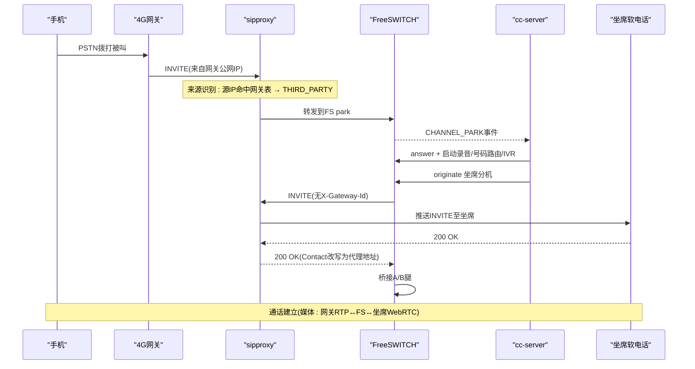
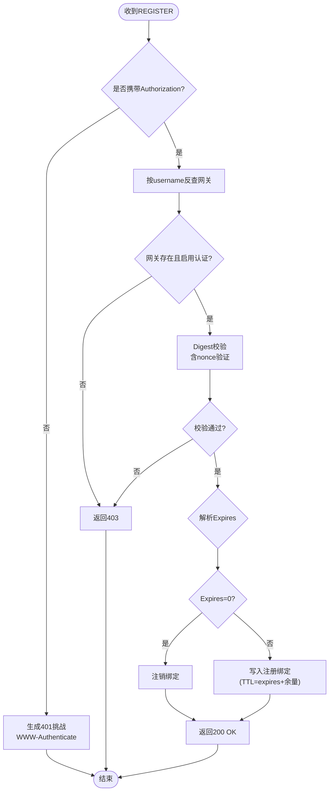
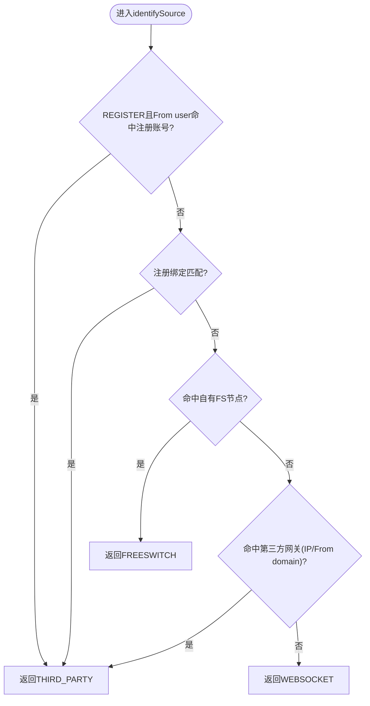
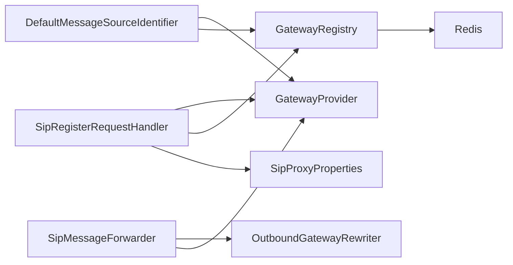

# 4G语音网关集成指南

<cite>
**本文引用的文件**
- [4g-voice-gateway-integration.md](file://docs/4g-voice-gateway-integration.md)
- [4g-gateway-register-plan.md](file://docs/4g-gateway-register-plan.md)
- [GatewayRegisterInfo.java](file://yudao-cloud/yudao-module-cc/ipcc-sipproxy/src/main/java/cn/ipcc/sipproxy/support/model/GatewayRegisterInfo.java)
- [SipRegisterRequestHandler.java](file://yudao-cloud/yudao-module-cc/ipcc-sipproxy/src/main/java/cn/ipcc/sipproxy/core/handler/request/sip/SipRegisterRequestHandler.java)
- [DefaultMessageSourceIdentifier.java](file://yudao-cloud/yudao-module-cc/ipcc-sipproxy/src/main/java/cn/ipcc/sipproxy/defaults/gateway/DefaultMessageSourceIdentifier.java)
- [ResponseForwardingStrategy.java](file://yudao-cloud/yudao-module-cc/ipcc-sipproxy/src/main/java/cn/ipcc/sipproxy/core/handler/response/ResponseForwardingStrategy.java)
- [SipMessageForwarder.java](file://yudao-cloud/yudao-module-cc/ipcc-sipproxy/src/main/java/cn/ipcc/sipproxy/core/forwarder/SipMessageForwarder.java)
- [GatewayRegistry.java](file://yudao-cloud/yudao-module-cc/ipcc-sipproxy/src/main/java/cn/ipcc/sipproxy/core/register/GatewayRegistry.java)
- [系统数据初始化.sql](file://yudao-cloud/yudao-module-cc/doc/sql/系统数据初始化.sql)
</cite>

## 更新摘要

**变更内容**

- 新增完整的REGISTER注册模式实现说明
- 更新两种集成模式的详细配置指南
- 增强故障排查指南涵盖注册模式问题
- 补充注册绑定管理和过期清理机制

## 目录

1. [简介](#简介)
2. [项目结构](#项目结构)
3. [核心组件](#核心组件)
4. [架构总览](#架构总览)
5. [详细组件分析](#详细组件分析)
6. [依赖关系分析](#依赖关系分析)
7. [性能与可靠性](#性能与可靠性)
8. [故障排查指南](#故障排查指南)
9. [结论](#结论)
10. [附录：配置清单与验证步骤](#附录配置清单与验证步骤)

## 简介

本指南面向需要在系统中接入"4G语音网关"的工程师，提供两种完整的集成方案：

- **静态直连模式（推荐）**：网关以固定IP直连sipproxy，不注册；呼入按来源IP识别，呼出通过管理后台配置的网关信息直接转发。
- **REGISTER注册模式（可选扩展）**：若设备强制要求REGISTER，则启用sipproxy对第三方网关注册的支持，实现"注册绑定→动态路由"。

文档基于现有代码与方案文档，给出端到端流程、关键数据结构、配置要点与排错建议。

## 项目结构

与4G语音网关集成相关的核心模块与文件分布如下：

- 方案与说明文档：docs/4g-voice-gateway-integration.md、docs/4g-gateway-register-plan.md
- SIP代理（sipproxy）：
    - 请求处理：SipInviteRequestHandler、SipRegisterRequestHandler、Ws*处理器
    - 来源识别：DefaultMessageSourceIdentifier
    - 响应转发策略：ResponseForwardingStrategy
    - 消息转发：SipMessageForwarder
    - 注册绑定模型：GatewayRegisterInfo
    - 注册管理：GatewayRegistry
- 数据库迁移：doc/sql/系统数据初始化.sql（为注册模式新增字段）

```mermaid
graph TB
A["4G语音网关"] --> B["sipproxy(UDP/TCP:5561)"]
B --> C["FreeSWITCH(park)"]
C --> D["cc-server(ESL/号码路由/IVR)"]
D --> E["坐席软电话(WebSocket)"]
B -.->|注册型(可选)| F["Redis(注册绑定)"]
F -.-> G["GatewayRegistry"]
```

**图表来源**

- [SipRegisterRequestHandler.java:97-158](file://yudao-cloud/yudao-module-cc/ipcc-sipproxy/src/main/java/cn/ipcc/sipproxy/core/handler/request/sip/SipRegisterRequestHandler.java#L97-L158)
- [DefaultMessageSourceIdentifier.java:139-158](file://yudao-cloud/yudao-module-cc/ipcc-sipproxy/src/main/java/cn/ipcc/sipproxy/defaults/gateway/DefaultMessageSourceIdentifier.java#L139-L158)
- [ResponseForwardingStrategy.java:42-55](file://yudao-cloud/yudao-module-cc/ipcc-sipproxy/src/main/java/cn/ipcc/sipproxy/core/handler/response/ResponseForwardingStrategy.java#L42-L55)
- [SipMessageForwarder.java:121-137](file://yudao-cloud/yudao-module-cc/ipcc-sipproxy/src/main/java/cn/ipcc/sipproxy/core/forwarder/SipMessageForwarder.java#L121-L137)
- [GatewayRegistry.java:57-81](file://yudao-cloud/yudao-module-cc/ipcc-sipproxy/src/main/java/cn/ipcc/sipproxy/core/register/GatewayRegistry.java#L57-L81)

**章节来源**

- [4g-voice-gateway-integration.md:21-65](file://docs/4g-voice-gateway-integration.md#L21-L65)
- [4g-gateway-register-plan.md:30-123](file://docs/4g-gateway-register-plan.md#L30-L123)

## 核心组件

- **sipproxy**：B2BUA信令代理，负责SIP/WS接入、来源识别、会话建立、与FreeSWITCH交互、出局网关改写与转发。
- **FreeSWITCH**：媒体桥接与呼叫控制，park上下文承载呼叫进入cc-server进行号码路由与IVR。
- **cc-server**：业务编排（号码路由、IVR、坐席路由），通过ESL与FS交互。
- **Redis**：在注册模式下缓存网关注册绑定（Contact、过期时间等）。
- **GatewayRegistry**：网关注册绑定管理器，处理REGISTER绑定的增删改查和过期清理。

**章节来源**

- [4g-voice-gateway-integration.md:23-65](file://docs/4g-voice-gateway-integration.md#L23-L65)
- [GatewayRegisterInfo.java:14-40](file://yudao-cloud/yudao-module-cc/ipcc-sipproxy/src/main/java/cn/ipcc/sipproxy/support/model/GatewayRegisterInfo.java#L14-L40)
- [GatewayRegistry.java:15-33](file://yudao-cloud/yudao-module-cc/ipcc-sipproxy/src/main/java/cn/ipcc/sipproxy/core/register/GatewayRegistry.java#L15-L33)

## 架构总览

下图展示"静态直连模式"下的典型呼叫路径与角色分工。



**图表来源**

- [4g-voice-gateway-integration.md:68-153](file://docs/4g-voice-gateway-integration.md#L68-L153)
- [ResponseForwardingStrategy.java:42-55](file://yudao-cloud/yudao-module-cc/ipcc-sipproxy/src/main/java/cn/ipcc/sipproxy/core/handler/response/ResponseForwardingStrategy.java#L42-L55)

**章节来源**

- [4g-voice-gateway-integration.md:68-153](file://docs/4g-voice-gateway-integration.md#L68-L153)

## 详细组件分析

### 组件A：SIP注册处理器（SipRegisterRequestHandler）

- **职责**：处理第三方网关注册（REGISTER），完成Digest认证、有效期控制、注册绑定写入。
- **关键点**：
    - 无Authorization时返回401挑战，realm按回退链解析（register_realm > from_domain > sip.public-ip）。
    - 校验通过后解析Expires并写入注册绑定（GatewayRegistry），支持注销（Expires=0）。
    - 响应经服务端事务发送，兼容JAIN-SIP栈。
    - 支持nonce票据防重放机制，确保安全性。



**图表来源**

- [SipRegisterRequestHandler.java:97-158](file://yudao-cloud/yudao-module-cc/ipcc-sipproxy/src/main/java/cn/ipcc/sipproxy/core/handler/request/sip/SipRegisterRequestHandler.java#L97-L158)

**章节来源**

- [SipRegisterRequestHandler.java:97-158](file://yudao-cloud/yudao-module-cc/ipcc-sipproxy/src/main/java/cn/ipcc/sipproxy/core/handler/request/sip/SipRegisterRequestHandler.java#L97-L158)

### 组件B：来源识别（DefaultMessageSourceIdentifier）

- **职责**：根据消息来源决定后续处理分支（WEBSOCKET/FREESWITCH/THIRD_PARTY）。
- **关键逻辑**：
    - 第0.5层特判：REGISTER请求中From user命中注册账号索引 → 直接判定为THIRD_PARTY，避免与自有FS同出口IP冲突。
    - 第2.5层特判：注册绑定匹配（From user/From domain/源IP命中Contact IP）→ THIRD_PARTY。
    - 第3层：匹配自有FS节点（忽略端口）。
    - 第4层：匹配已启用第三方网关（仅比较IP，忽略端口差异；或From domain命中）。
    - Response场景由ResponseForwardingStrategy校正方向。



**图表来源**

- [DefaultMessageSourceIdentifier.java:139-158](file://yudao-cloud/yudao-module-cc/ipcc-sipproxy/src/main/java/cn/ipcc/sipproxy/defaults/gateway/DefaultMessageSourceIdentifier.java#L139-L158)
- [ResponseForwardingStrategy.java:42-55](file://yudao-cloud/yudao-module-cc/ipcc-sipproxy/core/handler/response/ResponseForwardingStrategy.java#L42-L55)

**章节来源**

- [DefaultMessageSourceIdentifier.java:139-158](file://yudao-cloud/yudao-module-cc/ipcc-sipproxy/src/main/java/cn/ipcc/sipproxy/defaults/gateway/DefaultMessageSourceIdentifier.java#L139-L158)

### 组件C：消息转发（SipMessageForwarder）

- **职责**：将SIP消息转发到FreeSWITCH或出局网关，包含头域改写、故障转移、CSeq还原等。
- **关键点**：
    - 入局：修改Via/Contact/Request-URI后转发到FS park。
    - 呼出：检测X-Gateway-Id，豁免出局，查询网关配置并改写目标（DefaultOutboundGatewayRewriter）。
    - 响应：还原FS原始顶层Via与CSeq，确保事务关联正确。
    - 支持TCP连接复用和事务兜底发送。

**章节来源**

- [4g-voice-gateway-integration.md:141-253](file://docs/4g-voice-gateway-integration.md#L141-L253)
- [SipMessageForwarder.java:121-137](file://yudao-cloud/yudao-module-cc/ipcc-sipproxy/src/main/java/cn/ipcc/sipproxy/core/forwarder/SipMessageForwarder.java#L121-L137)

### 组件D：注册绑定模型（GatewayRegisterInfo）

- **字段含义**：
    - gatewayId：对应网关记录ID
    - username：注册账号
    - contactIp/contactPort：学习到的可达地址
    - transport：传输协议
    - expiresAt：过期时间戳
    - sourceIp：REGISTER来源IP
    - userAgent：UA信息（日志/识别辅助）

**章节来源**

- [GatewayRegisterInfo.java:14-40](file://yudao-cloud/yudao-module-cc/ipcc-sipproxy/src/main/java/cn/ipcc/sipproxy/support/model/GatewayRegisterInfo.java#L14-L40)

### 组件E：注册绑定管理器（GatewayRegistry）

- **职责**：管理网关注册绑定的生命周期，包括绑定、查询、注销和过期清理。
- **关键特性**：
    - TTL=expires+60秒宽限期，容忍续订抖动空窗。
    - 惰性清理：查询时检查过期并自动清除。
    - 账号索引：支持按username快速查找gatewayId。
    - 序列化存储：使用JSON格式存储绑定信息。

**章节来源**

- [GatewayRegistry.java:15-33](file://yudao-cloud/yudao-module-cc/ipcc-sipproxy/src/main/java/cn/ipcc/sipproxy/core/register/GatewayRegistry.java#L15-L33)
- [GatewayRegistry.java:57-81](file://yudao-cloud/yudao-module-cc/ipcc-sipproxy/src/main/java/cn/ipcc/sipproxy/core/register/GatewayRegistry.java#L57-L81)

## 依赖关系分析

- **组件耦合**：
    - SipRegisterRequestHandler依赖GatewayProvider（按username查网关）、GatewayRegistry（读写绑定）、SipProxyProperties（公共IP）。
    - DefaultMessageSourceIdentifier依赖GatewayProvider与GatewayRegistry，用于注册特判与绑定匹配。
    - SipMessageForwarder依赖OutboundGatewayRewriter与网关提供者，完成出局改写与发送。
    - GatewayRegistry依赖StringRedisTemplate和ObjectMapper进行Redis操作。
- **外部依赖**：
    - Redis：存储注册绑定（TTL自动续期/惰性清理）。
    - FreeSWITCH：park上下文与ESL事件驱动。
    - WebSocket：坐席通道（与SIP通道解耦）。



**图表来源**

- [SipRegisterRequestHandler.java:97-158](file://yudao-cloud/yudao-module-cc/ipcc-sipproxy/src/main/java/cn/ipcc/sipproxy/core/handler/request/sip/SipRegisterRequestHandler.java#L97-L158)
- [DefaultMessageSourceIdentifier.java:139-158](file://yudao-cloud/yudao-module-cc/ipcc-sipproxy/src/main/java/cn/ipcc/sipproxy/defaults/gateway/DefaultMessageSourceIdentifier.java#L139-L158)
- [SipMessageForwarder.java:121-137](file://yudao-cloud/yudao-module-cc/ipcc-sipproxy/core/forwarder/SipMessageForwarder.java#L121-L137)
- [GatewayRegistry.java:57-81](file://yudao-cloud/yudao-module-cc/ipcc-sipproxy/core/register/GatewayRegistry.java#L57-L81)

**章节来源**

- [4g-gateway-register-plan.md:30-123](file://docs/4g-gateway-register-plan.md#L30-L123)

## 性能与可靠性

- **来源识别优化**：
    - REGISTER特判与注册绑定匹配前置，避免与自有FS同出口IP导致的误判。
    - 网关匹配忽略端口，提升兼容性（不同profile端口差异）。
- **注册绑定管理**：
    - TTL=expires+60秒宽限期，惰性清理与定时任务互补，降低Redis压力。
    - 支持宽限期内仍视为在线，容忍续订抖动空窗。
- **响应转发策略**：
    - 基于callType与来源的策略表，保证响应正确回送，避免环路。
    - 支持TCP连接复用和事务兜底发送。
- **故障转移**：
    - 转发到FS时具备多节点尝试能力，提高可用性。
    - 支持in-dialog请求的Via还原和CSeq恢复。

**章节来源**

- [DefaultMessageSourceIdentifier.java:139-158](file://yudao-cloud/yudao-module-cc/ipcc-sipproxy/src/main/java/cn/ipcc/sipproxy/defaults/gateway/DefaultMessageSourceIdentifier.java#L139-L158)
- [ResponseForwardingStrategy.java:42-55](file://yudao-cloud/yudao-module-cc/ipcc-sipproxy/core/handler/response/ResponseForwardingStrategy.java#L42-L55)
- [SipMessageForwarder.java:121-137](file://yudao-cloud/yudao-module-cc/ipcc-sipproxy/core/forwarder/SipMessageForwarder.java#L121-L137)
- [GatewayRegistry.java:83-129](file://yudao-cloud/yudao-module-cc/ipcc-sipproxy/core/register/GatewayRegistry.java#L83-L129)

## 故障排查指南

- **常见问题定位**：
    - **来源识别失败**：检查网关address/port配置、源IP/From domain是否一致；确认REGISTER特判与绑定匹配生效。
    - **注册失败**：核对realm、username/password一致性；确认GatewayProvider能按username查到启用且开启认证的网关。
    - **呼出失败**：检查X-Gateway-Id透传链路（前端→sipproxy→FS→sipproxy），确认出局豁免触发；如网关返回407，核查GatewayAuthManager鉴权重试次数。
    - **媒体不通**：确认FS RTP端口范围放行，以及网关侧RTP可达性。
    - **注册绑定过期**：检查Redis中绑定键是否存在，确认GatewayRegistry的宽限机制正常工作。
- **日志关键字**：
    - "检测到FS c-leg携带X-Gateway-Id,直接出局"
    - "已改写Request-URI"
    - "网关注册成功/失败"
    - "命中网关注册绑定"
    - "注册绑定超出宽限期仍未续订,判定离线"
    - "按客户端realm校验"

**章节来源**

- [4g-voice-gateway-integration.md:311-330](file://docs/4g-voice-gateway-integration.md#L311-L330)

## 结论

- **首选"静态直连模式"**：无需网关注册，配置简单、稳定可靠；呼入按来源IP识别，呼出通过管理后台网关配置直接转发。
- **REGISTER注册模式**：当设备强制要求REGISTER时启用，通过SipRegisterRequestHandler与GatewayRegistry实现认证与绑定，并在来源识别与呼出解析中优先使用注册Contact。
- **安全机制**：REGISTER模式包含完整的Digest认证、nonce票据防重放、宽限期内容错等安全特性。
- **无论哪种模式**，均需确保网络可达性、号码路由与IVR流程配置正确，并通过测试用例验证端到端通话。

## 附录：配置清单与验证步骤

### 静态直连模式（推荐）

- **管理后台配置**：
    - 新增"SIP代理网关"，填写网关公网IP与端口、传输协议、外线号码（DID）、CallerId显示策略等。
    - 将网关加入坐席组可用网关列表，以便软电话外呼下拉选择。
    - 配置号码路由：呼入（type=1）与被叫正则匹配；呼出（type=2）匹配主叫号段。
- **4G网关设备侧**：
    - SIP服务器指向sipproxy公网IP:5561；关闭REGISTER（或选择"不注册/IP直连"模式）。
    - 传输协议与编码与系统一致（UDP优先，PCMA/PCMU）。
- **自检要点**：
    - 呼入日志出现"source=THIRD_PARTY"、"CHANNEL_PARK inbound"、号码路由命中flowId。
    - 呼出日志出现"X-Gateway-Id"、"检测到FS c-leg携带X-Gateway-Id,直接出局"。

**章节来源**

- [4g-voice-gateway-integration.md:256-308](file://docs/4g-voice-gateway-integration.md#L256-L308)

### REGISTER注册模式（可选）

- **数据准备**：
    - 执行数据库迁移脚本，为cc_sipproxy_gateway增加register_enabled、register_realm、register_max_expires字段，并允许address为空。
    - 配置字典项：cc_sipproxy_gateway_register_mode（IP直连/注册模式）、cc_sipproxy_gateway_register_status（离线/在线）。
- **sipproxy侧**：
    - 启用SipRegisterRequestHandler，完成401挑战、Digest校验、注册绑定写入。
    - 来源识别增加REGISTER特判与注册绑定匹配；呼出解析优先使用注册Contact。
    - 配置GatewayRegistry进行绑定管理，支持宽限期内容错。
- **4G网关设备侧**：
    - 配置REGISTER目标为sipproxy公网IP:5561；设置username/password/realm与系统一致；按需设置Expires。
- **自检要点**：
    - 注册成功后Redis中出现绑定键；呼入来源识别命中注册绑定；呼出目标解析优先使用Contact。
    - 观察"网关注册成功"日志，确认Digest认证通过。
    - 验证宽限期内容错机制，确认续订抖动不会导致绑定失效。

**章节来源**

- [系统数据初始化.sql:266-277](file://yudao-cloud/yudao-module-cc/doc/sql/系统数据初始化.sql#L266-L277)
- [4g-gateway-register-plan.md:30-123](file://docs/4g-gateway-register-plan.md#L30-L123)
- [SipRegisterRequestHandler.java:97-158](file://yudao-cloud/yudao-module-cc/ipcc-sipproxy/src/main/java/cn/ipcc/sipproxy/core/handler/request/sip/SipRegisterRequestHandler.java#L97-L158)
- [GatewayRegistry.java:83-129](file://yudao-cloud/yudao-module-cc/ipcc-sipproxy/core/register/GatewayRegistry.java#L83-L129)