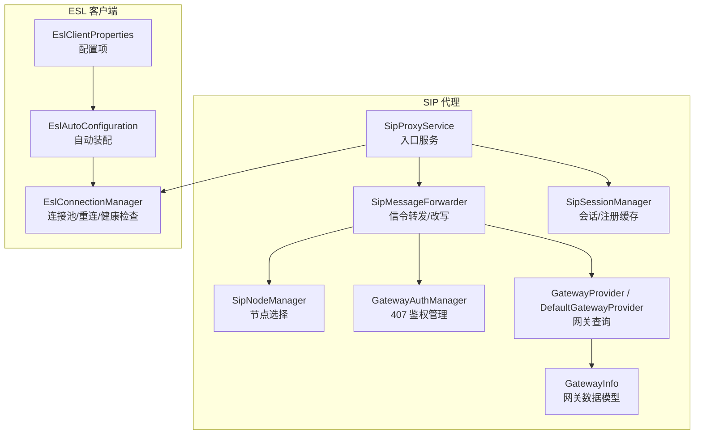
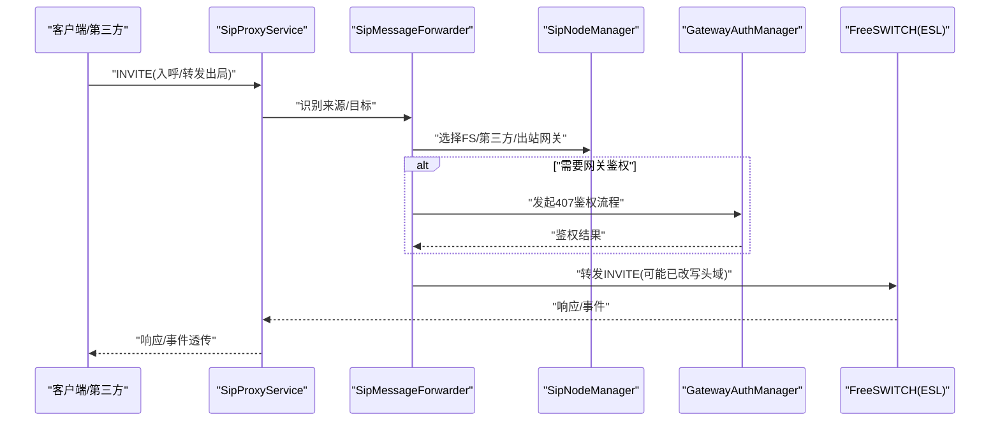
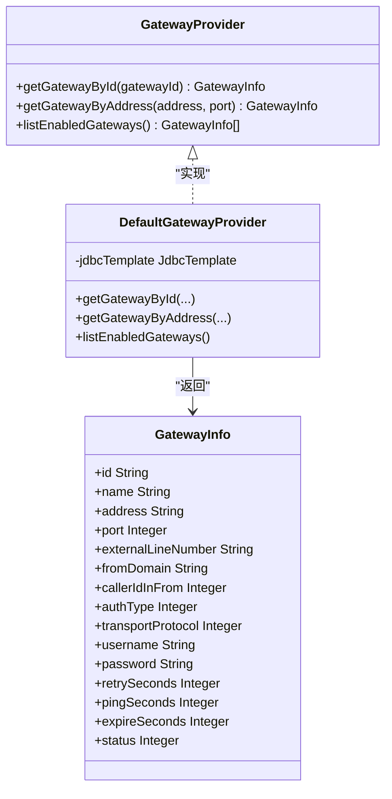
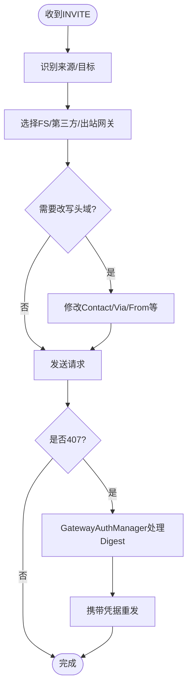
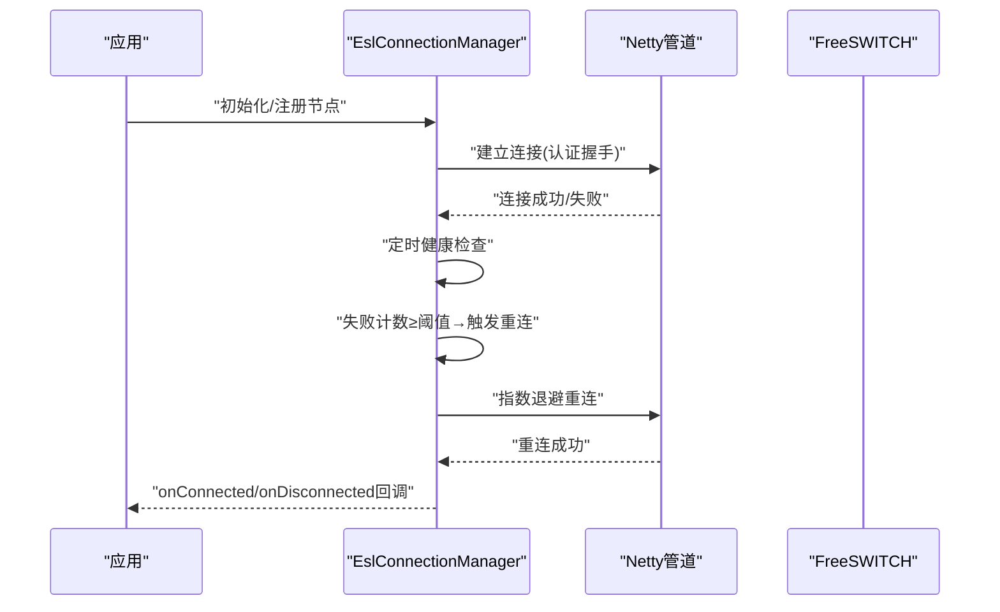
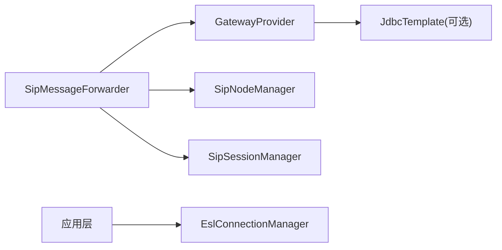
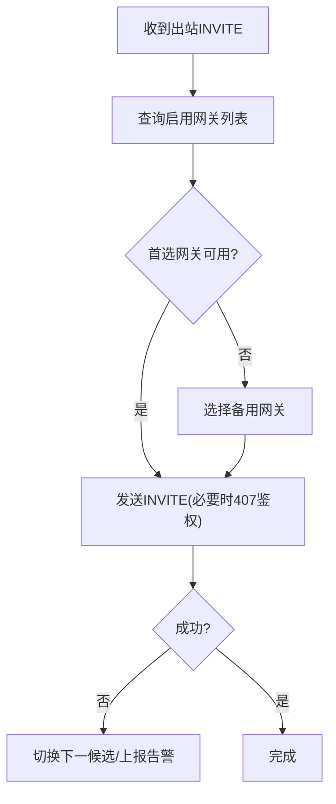

# 网关管理

<cite>
**本文引用的文件**
- [ipcc-sipproxy/README.md](file://yudao-cloud/yudao-module-cc/ipcc-sipproxy/README.md)
- [GatewayProvider.java](file://yudao-cloud/yudao-module-cc/ipcc-sipproxy/src/main/java/cn/ipcc/sipproxy/api/gateway/GatewayProvider.java)
- [DefaultGatewayProvider.java](file://yudao-cloud/yudao-module-cc/ipcc-sipproxy/src/main/java/cn/ipcc/sipproxy/defaults/gateway/DefaultGatewayProvider.java)
- [GatewayInfo.java](file://yudao-cloud/yudao-module-cc/ipcc-sipproxy/src/main/java/cn/ipcc/sipproxy/support/model/GatewayInfo.java)
- [SipProxyService.java](file://yudao-cloud/yudao-module-cc/ipcc-sipproxy/src/main/java/cn/ipcc/sipproxy/core/SipProxyService.java)
- [SipMessageForwarder.java](file://yudao-cloud/yudao-module-cc/ipcc-sipproxy/src/main/java/cn/ipcc/sipproxy/core/forwarder/SipMessageForwarder.java)
- [SipNodeManager.java](file://yudao-cloud/yudao-module-cc/ipcc-sipproxy/src/main/java/cn/ipcc/sipproxy/core/node/SipNodeManager.java)
- [SipSessionManager.java](file://yudao-cloud/yudao-module-cc/ipcc-sipproxy/src/main/java/cn/ipcc/sipproxy/core/session/SipSessionManager.java)
- [GatewayAuthManager.java](file://yudao-cloud/yudao-module-cc/ipcc-sipproxy/src/main/java/cn/ipcc/sipproxy/core/auth/GatewayAuthManager.java)
- [EslConnectionManager.java](file://yudao-cloud/yudao-module-cc/ipcc-fs-esl/src/main/java/cn/ipcc/fs/esl/EslConnectionManager.java)
- [EslClientProperties.java](file://yudao-cloud/yudao-module-cc/ipcc-fs-esl/src/main/java/cn/ipcc/fs/esl/spring/EslClientProperties.java)
- [EslAutoConfiguration.java](file://yudao-cloud/yudao-module-cc/ipcc-fs-esl/src/main/java/cn/ipcc/fs/esl/spring/EslAutoConfiguration.java)
- [fs-esl/README.md](file://yudao-cloud/yudao-module-cc/ipcc-fs-esl/README.md)
</cite>

## 目录

1. [简介](#简介)
2. [项目结构](#项目结构)
3. [核心组件](#核心组件)
4. [架构总览](#架构总览)
5. [详细组件分析](#详细组件分析)
6. [依赖关系分析](#依赖关系分析)
7. [性能与监控](#性能与监控)
8. [故障处理与告警](#故障处理与告警)
9. [配置最佳实践与调优](#配置最佳实践与调优)
10. [多网关路由与故障切换](#多网关路由与故障切换)
11. [API 接口文档与使用示例](#api-接口文档与使用示例)
12. [结论](#结论)

## 简介

本章节面向“网关管理”能力，聚焦 SIP 网关的配置管理、状态监控、故障转移、连接池与负载均衡、健康检查、注册/注销/重连逻辑、性能指标、错误处理与告警机制，以及多网关环境下的路由策略与切换流程。该能力由
SIP 代理模块（B2BUA）与 FreeSWITCH ESL 客户端库协同实现：前者负责信令转发、会话与网关信息装配、出局头域改写与鉴权；后者负责与
FreeSWITCH 的 ESL 连接管理、事件路由与分布式协调。

## 项目结构

- SIP 代理模块提供网关查询扩展点与默认实现，并通过转发器完成出局 INVITE 的信令改写与路由选择。
- ESL 客户端模块提供连接管理、自动重连、健康检查与事件路由，支撑上层业务对 FreeSWITCH 的可靠控制。

图表来源

- [SipProxyService.java](file://yudao-cloud/yudao-module-cc/ipcc-sipproxy/src/main/java/cn/ipcc/sipproxy/core/SipProxyService.java)
- [SipMessageForwarder.java](file://yudao-cloud/yudao-module-cc/ipcc-sipproxy/src/main/java/cn/ipcc/sipproxy/core/forwarder/SipMessageForwarder.java)
- [SipNodeManager.java](file://yudao-cloud/yudao-module-cc/ipcc-sipproxy/src/main/java/cn/ipcc/sipproxy/core/node/SipNodeManager.java)
- [SipSessionManager.java](file://yudao-cloud/yudao-module-cc/ipcc-sipproxy/src/main/java/cn/ipcc/sipproxy/core/session/SipSessionManager.java)
- [GatewayAuthManager.java](file://yudao-cloud/yudao-module-cc/ipcc-sipproxy/src/main/java/cn/ipcc/sipproxy/core/auth/GatewayAuthManager.java)
- [GatewayProvider.java](file://yudao-cloud/yudao-module-cc/ipcc-sipproxy/src/main/java/cn/ipcc/sipproxy/api/gateway/GatewayProvider.java)
- [DefaultGatewayProvider.java](file://yudao-cloud/yudao-module-cc/ipcc-sipproxy/src/main/java/cn/ipcc/sipproxy/defaults/gateway/DefaultGatewayProvider.java)
- [GatewayInfo.java](file://yudao-cloud/yudao-module-cc/ipcc-sipproxy/src/main/java/cn/ipcc/sipproxy/support/model/GatewayInfo.java)
- [EslConnectionManager.java](file://yudao-cloud/yudao-module-cc/ipcc-fs-esl/src/main/java/cn/ipcc/fs/esl/EslConnectionManager.java)
- [EslAutoConfiguration.java](file://yudao-cloud/yudao-module-cc/ipcc-fs-esl/src/main/java/cn/ipcc/fs/esl/spring/EslAutoConfiguration.java)
- [EslClientProperties.java](file://yudao-cloud/yudao-module-cc/ipcc-fs-esl/src/main/java/cn/ipcc/fs/esl/spring/EslClientProperties.java)

章节来源

- [ipcc-sipproxy/README.md:72-127](file://yudao-cloud/yudao-module-cc/ipcc-sipproxy/README.md#L72-L127)
- [fs-esl/README.md:50-98](file://yudao-cloud/yudao-module-cc/ipcc-fs-esl/README.md#L50-L98)

## 核心组件

- 网关查询扩展点与默认实现：通过 GatewayProvider 暴露按 ID、地址端口查询与启用列表能力；DefaultGatewayProvider 在存在数据源时从内置表
  sip_gateway 读取并映射为 GatewayInfo。
- 信令转发与改写：SipMessageForwarder 负责将 INVITE 等请求转发至 FS、第三方或出站网关，并在需要时进行头域改写与 407 鉴权处理。
- 节点与会话管理：SipNodeManager 负责 FS/第三方节点选择；SipSessionManager 维护会话与注册信息缓存（TTL）。
- 网关鉴权：GatewayAuthManager 统一处理 407 Proxy Authentication Required 流程。
- ESL 连接管理：EslConnectionManager 提供连接池、自动重连、健康检查与生命周期回调；EslAutoConfiguration 与
  EslClientProperties 完成自动装配与参数绑定。

章节来源

- [GatewayProvider.java:1-42](file://yudao-cloud/yudao-module-cc/ipcc-sipproxy/src/main/java/cn/ipcc/sipproxy/api/gateway/GatewayProvider.java#L1-L42)
- [DefaultGatewayProvider.java:14-148](file://yudao-cloud/yudao-module-cc/ipcc-sipproxy/src/main/java/cn/ipcc/sipproxy/defaults/gateway/DefaultGatewayProvider.java#L14-L148)
- [GatewayInfo.java:1-81](file://yudao-cloud/yudao-module-cc/ipcc-sipproxy/src/main/java/cn/ipcc/sipproxy/support/model/GatewayInfo.java#L1-L81)
- [SipMessageForwarder.java](file://yudao-cloud/yudao-module-cc/ipcc-sipproxy/src/main/java/cn/ipcc/sipproxy/core/forwarder/SipMessageForwarder.java)
- [SipNodeManager.java](file://yudao-cloud/yudao-module-cc/ipcc-sipproxy/src/main/java/cn/ipcc/sipproxy/core/node/SipNodeManager.java)
- [SipSessionManager.java](file://yudao-cloud/yudao-module-cc/ipcc-sipproxy/src/main/java/cn/ipcc/sipproxy/core/session/SipSessionManager.java)
- [GatewayAuthManager.java](file://yudao-cloud/yudao-module-cc/ipcc-sipproxy/src/main/java/cn/ipcc/sipproxy/core/auth/GatewayAuthManager.java)
- [EslConnectionManager.java](file://yudao-cloud/yudao-module-cc/ipcc-fs-esl/src/main/java/cn/ipcc/fs/esl/EslConnectionManager.java)
- [EslAutoConfiguration.java](file://yudao-cloud/yudao-module-cc/ipcc-fs-esl/src/main/java/cn/ipcc/fs/esl/spring/EslAutoConfiguration.java)
- [EslClientProperties.java](file://yudao-cloud/yudao-module-cc/ipcc-fs-esl/src/main/java/cn/ipcc/fs/esl/spring/EslClientProperties.java)

## 架构总览

SIP 代理作为 B2BUA，承担两段独立对话的桥接职责：一端对接坐席/第三方，另一端对接 FreeSWITCH 或外部网关。出局 INVITE
经转发器根据网关配置改写 From/Contact/Via 等头域，必要时触发 407 Digest 鉴权。FreeSWITCH 侧通过 ESL 客户端建立连接，执行呼叫控制与事件订阅。

图表来源

- [SipProxyService.java](file://yudao-cloud/yudao-module-cc/ipcc-sipproxy/src/main/java/cn/ipcc/sipproxy/core/SipProxyService.java)
- [SipMessageForwarder.java](file://yudao-cloud/yudao-module-cc/ipcc-sipproxy/src/main/java/cn/ipcc/sipproxy/core/forwarder/SipMessageForwarder.java)
- [SipNodeManager.java](file://yudao-cloud/yudao-module-cc/ipcc-sipproxy/src/main/java/cn/ipcc/sipproxy/core/node/SipNodeManager.java)
- [GatewayAuthManager.java](file://yudao-cloud/yudao-module-cc/ipcc-sipproxy/src/main/java/cn/ipcc/sipproxy/core/auth/GatewayAuthManager.java)

## 详细组件分析

### 网关查询与数据模型

- GatewayProvider 定义网关查询契约：按 ID、地址+端口查询，以及列出启用的网关。
- DefaultGatewayProvider 在无父程序实现时，基于 JdbcTemplate 查询内置 sip_gateway 表，并将 BIGINT id 转换为字符串以匹配
  GatewayInfo。
- GatewayInfo 承载网关地址、端口、认证类型、传输协议、重试/心跳/超时、状态等关键属性，供转发与鉴权使用。

图表来源

- [GatewayProvider.java:1-42](file://yudao-cloud/yudao-module-cc/ipcc-sipproxy/src/main/java/cn/ipcc/sipproxy/api/gateway/GatewayProvider.java#L1-L42)
- [DefaultGatewayProvider.java:14-148](file://yudao-cloud/yudao-module-cc/ipcc-sipproxy/src/main/java/cn/ipcc/sipproxy/defaults/gateway/DefaultGatewayProvider.java#L14-L148)
- [GatewayInfo.java:1-81](file://yudao-cloud/yudao-module-cc/ipcc-sipproxy/src/main/java/cn/ipcc/sipproxy/support/model/GatewayInfo.java#L1-L81)

章节来源

- [GatewayProvider.java:1-42](file://yudao-cloud/yudao-module-cc/ipcc-sipproxy/src/main/java/cn/ipcc/sipproxy/api/gateway/GatewayProvider.java#L1-L42)
- [DefaultGatewayProvider.java:14-148](file://yudao-cloud/yudao-module-cc/ipcc-sipproxy/src/main/java/cn/ipcc/sipproxy/defaults/gateway/DefaultGatewayProvider.java#L14-L148)
- [GatewayInfo.java:1-81](file://yudao-cloud/yudao-module-cc/ipcc-sipproxy/src/main/java/cn/ipcc/sipproxy/support/model/GatewayInfo.java#L1-L81)

### 出站网关转发与头域改写

- SipMessageForwarder 负责识别消息来源、选择目标节点/网关、执行标准头域改写，并在需要时委托 GatewayAuthManager 处理 407 鉴权。
- 改写范围包括 Contact/Via/From 等，确保 B2BUA 居中转发语义正确。

图表来源

- [SipMessageForwarder.java](file://yudao-cloud/yudao-module-cc/ipcc-sipproxy/src/main/java/cn/ipcc/sipproxy/core/forwarder/SipMessageForwarder.java)
- [GatewayAuthManager.java](file://yudao-cloud/yudao-module-cc/ipcc-sipproxy/src/main/java/cn/ipcc/sipproxy/core/auth/GatewayAuthManager.java)

章节来源

- [ipcc-sipproxy/README.md:106-114](file://yudao-cloud/yudao-module-cc/ipcc-sipproxy/README.md#L106-L114)

### 节点与会话管理

- SipNodeManager 负责 FS/第三方节点的选择与匹配（如 ViaPort 匹配），为转发器提供可用节点。
- SipSessionManager 维护 Call-ID → SessionInfo 映射，记录 FS 节点、第三方节点、callType、网关 ID 等，并提供注册信息缓存与 TTL
  刷新。

章节来源

- [SipNodeManager.java](file://yudao-cloud/yudao-module-cc/ipcc-sipproxy/src/main/java/cn/ipcc/sipproxy/core/node/SipNodeManager.java)
- [SipSessionManager.java](file://yudao-cloud/yudao-module-cc/ipcc-sipproxy/src/main/java/cn/ipcc/sipproxy/core/session/SipSessionManager.java)
- [ipcc-sipproxy/README.md:34-43](file://yudao-cloud/yudao-module-cc/ipcc-sipproxy/README.md#L34-L43)

### ESL 连接池、健康检查与重连

- EslConnectionManager 提供单连接与多节点管理、自动重连（指数退避）、健康检查、完整状态机与生命周期回调。
- EslAutoConfiguration 自动装配连接管理器、事件路由器与协调器；EslClientProperties 绑定连接超时、命令超时、最大帧大小、重连策略、健康检查间隔与阈值等配置。

图表来源

- [EslConnectionManager.java](file://yudao-cloud/yudao-module-cc/ipcc-fs-esl/src/main/java/cn/ipcc/fs/esl/EslConnectionManager.java)
- [EslAutoConfiguration.java](file://yudao-cloud/yudao-module-cc/ipcc-fs-esl/src/main/java/cn/ipcc/fs/esl/spring/EslAutoConfiguration.java)
- [EslClientProperties.java](file://yudao-cloud/yudao-module-cc/ipcc-fs-esl/src/main/java/cn/ipcc/fs/esl/spring/EslClientProperties.java)
- [fs-esl/README.md:39-48](file://yudao-cloud/yudao-module-cc/ipcc-fs-esl/README.md#L39-L48)

章节来源

- [fs-esl/README.md:22-48](file://yudao-cloud/yudao-module-cc/ipcc-fs-esl/README.md#L22-L48)
- [fs-esl/README.md:153-179](file://yudao-cloud/yudao-module-cc/ipcc-fs-esl/README.md#L153-L179)

## 依赖关系分析

- SIP 代理对网关查询解耦：通过 GatewayProvider 抽象，默认实现仅在存在 JdbcTemplate 时生效，避免强耦合。
- 转发器依赖节点管理与会话管理，保证转发路径与状态一致性。
- ESL 客户端与 SIP 代理松耦合：SIP 代理不直接持有 ESL 细节，仅通过高层能力（如节点选择、会话）协作。

图表来源

- [GatewayProvider.java:1-42](file://yudao-cloud/yudao-module-cc/ipcc-sipproxy/src/main/java/cn/ipcc/sipproxy/api/gateway/GatewayProvider.java#L1-L42)
- [DefaultGatewayProvider.java:14-148](file://yudao-cloud/yudao-module-cc/ipcc-sipproxy/src/main/java/cn/ipcc/sipproxy/defaults/gateway/DefaultGatewayProvider.java#L14-L148)
- [SipMessageForwarder.java](file://yudao-cloud/yudao-module-cc/ipcc-sipproxy/src/main/java/cn/ipcc/sipproxy/core/forwarder/SipMessageForwarder.java)
- [SipNodeManager.java](file://yudao-cloud/yudao-module-cc/ipcc-sipproxy/src/main/java/cn/ipcc/sipproxy/core/node/SipNodeManager.java)
- [SipSessionManager.java](file://yudao-cloud/yudao-module-cc/ipcc-sipproxy/src/main/java/cn/ipcc/sipproxy/core/session/SipSessionManager.java)
- [EslConnectionManager.java](file://yudao-cloud/yudao-module-cc/ipcc-fs-esl/src/main/java/cn/ipcc/fs/esl/EslConnectionManager.java)

## 性能与监控

- 事件与连接可观测性：ESL 客户端提供连接、命令、事件、线程池四类监控指标，支持覆盖默认实现对接监控系统。
- 会话与注册 TTL：SIP 代理会话 TTL=120s，注册信息 TTL=3600s，会话内方法到达时刷新 TTL，降低内存占用并保持状态新鲜度。
- WebSocket 健壮性：分片重组（1MB 缓冲上限）、僵尸会话清理、握手 token 认证，保障高并发接入稳定性。

章节来源

- [fs-esl/README.md:45-48](file://yudao-cloud/yudao-module-cc/ipcc-fs-esl/README.md#L45-L48)
- [ipcc-sipproxy/README.md:59-60](file://yudao-cloud/yudao-module-cc/ipcc-sipproxy/README.md#L59-L60)
- [ipcc-sipproxy/README.md:54-55](file://yudao-cloud/yudao-module-cc/ipcc-sipproxy/README.md#L54-L55)

## 故障处理与告警

- 407 鉴权失败：GatewayAuthManager 统一处理 407 挑战与凭据重发，失败时回退到上游错误响应。
- ESL 连接异常：健康检查连续失败达到阈值后触发重连；连接断开/恢复通过监听器回调通知上层。
- 降级策略：DefaultGatewayProvider 在数据库不可用或表不存在时返回 null/空列表，避免阻断出局信令链路。

章节来源

- [GatewayAuthManager.java](file://yudao-cloud/yudao-module-cc/ipcc-sipproxy/src/main/java/cn/ipcc/sipproxy/core/auth/GatewayAuthManager.java)
- [DefaultGatewayProvider.java:67-71](file://yudao-cloud/yudao-module-cc/ipcc-sipproxy/src/main/java/cn/ipcc/sipproxy/defaults/gateway/DefaultGatewayProvider.java#L67-L71)
- [fs-esl/README.md:22-36](file://yudao-cloud/yudao-module-cc/ipcc-fs-esl/README.md#L22-L36)

## 配置最佳实践与调优

- SIP 代理
    - 合理设置 session-ttl 与 register-ttl，平衡状态保持与资源消耗。
    - 开启 WebSocket 心跳与僵尸会话清理，避免空闲连接堆积。
    - 集群广播根据部署环境选择合适 sender-type（local/redis/kafka/rabbitmq/rocketmq）。
- ESL 客户端
    - 调整 connect-timeout-seconds、command-timeout-seconds 以适应网络与 FS 负载。
    - 设置 max-frame-size、max-header-lines 防止 OOM 与放大攻击。
    - 配置 health-check-interval-seconds 与 failure-threshold，及时感知假死连接。
    - 根据事件吞吐调整 event-thread-pool-size 与 event-queue-capacity，选择合适的 event-executor-mode。
    - 分布式协调场景下，合理设置 monitor-compete-interval-seconds 与 monitor-lock-expire-seconds。

章节来源

- [ipcc-sipproxy/README.md:183-199](file://yudao-cloud/yudao-module-cc/ipcc-sipproxy/README.md#L183-L199)
- [fs-esl/README.md:153-179](file://yudao-cloud/yudao-module-cc/ipcc-fs-esl/README.md#L153-L179)

## 多网关路由与故障切换

- 路由策略
    - 出站 INVITE 优先选择启用且可用的网关；若需认证则走 407 Digest 流程。
    - 入呼来源识别通过 address:port 反查网关，结合会话上下文确定来源。
- 故障切换
    - 当首选网关不可达或鉴权失败，可切换到备用网关（由父程序实现 GatewayProvider 的策略决定）。
    - ESL 侧连接异常时，自动重连并尝试其他节点，保证呼叫控制连续性。

图表来源

- [GatewayProvider.java:1-42](file://yudao-cloud/yudao-module-cc/ipcc-sipproxy/src/main/java/cn/ipcc/sipproxy/api/gateway/GatewayProvider.java#L1-L42)
- [DefaultGatewayProvider.java:95-110](file://yudao-cloud/yudao-module-cc/ipcc-sipproxy/src/main/java/cn/ipcc/sipproxy/defaults/gateway/DefaultGatewayProvider.java#L95-L110)
- [GatewayInfo.java:45-54](file://yudao-cloud/yudao-module-cc/ipcc-sipproxy/src/main/java/cn/ipcc/sipproxy/support/model/GatewayInfo.java#L45-L54)

## API 接口文档与使用示例

- 网关查询接口（扩展点）
    - getGatewayById (gatewayId): 按网关 ID 查询，用于出局信令改写与路由。
    - getGatewayByAddress (address, port): 按地址与端口查询，用于入呼来源识别。
    - listEnabledGateways (): 获取所有启用网关，用于路由选择与故障切换。
- 使用示例
    - 父工程实现 GatewayProvider 并注册为 Bean，即可覆盖默认实现，提供自定义数据源与策略。
    - 未实现时，DefaultGatewayProvider 基于 JdbcTemplate 查询 sip_gateway 表，使模块在无父程序扩展时仍可工作。

章节来源

- [GatewayProvider.java:1-42](file://yudao-cloud/yudao-module-cc/ipcc-sipproxy/src/main/java/cn/ipcc/sipproxy/api/gateway/GatewayProvider.java#L1-L42)
- [DefaultGatewayProvider.java:14-148](file://yudao-cloud/yudao-module-cc/ipcc-sipproxy/src/main/java/cn/ipcc/sipproxy/defaults/gateway/DefaultGatewayProvider.java#L14-L148)

## 结论

本方案通过 SIP 代理与 ESL
客户端的协同，实现了完整的网关管理能力：配置化网关查询与头域改写、可靠的连接池与健康检查、灵活的负载均衡与故障切换、完善的性能监控与错误处理。建议在生产环境中结合业务规模合理调优超时、队列与线程参数，并通过自定义
GatewayProvider 实现企业级路由与鉴权策略。