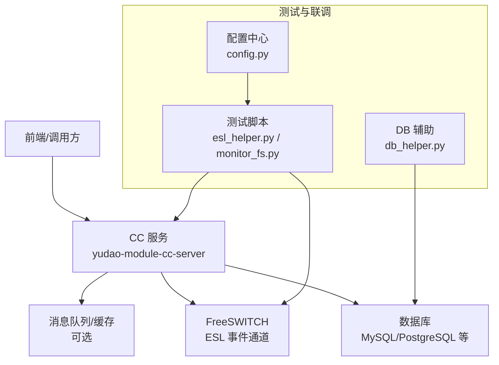
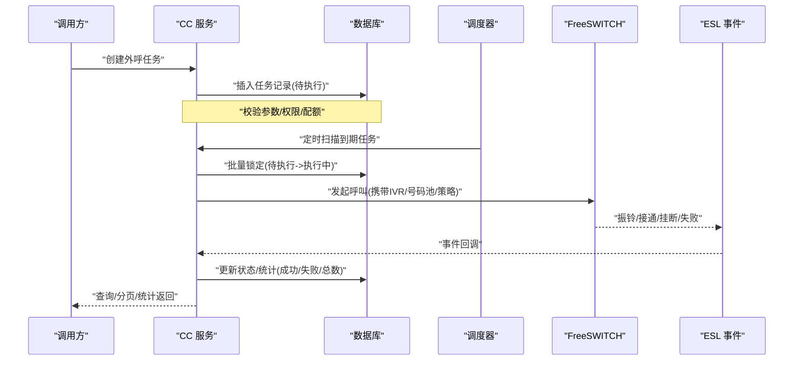
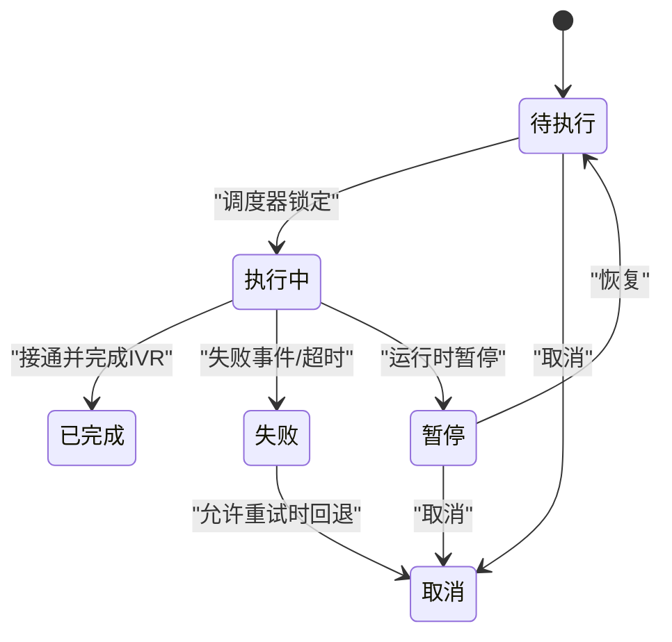
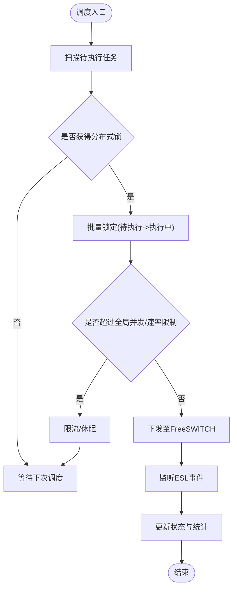
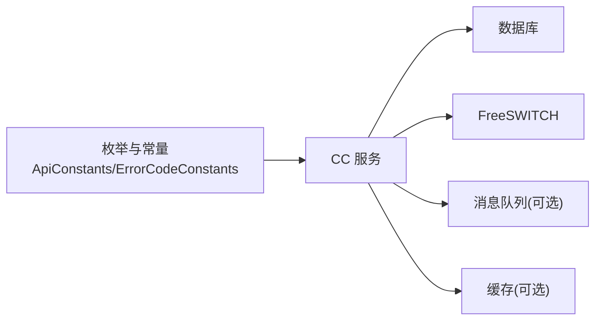

# 外呼任务管理

<cite>
**本文引用的文件**
- [autocall_task.sql](file://yudao-cloud/yudao-module-cc/doc/sql/autocall_task.sql)
- [ApiConstants.java](file://yudao-cloud/yudao-module-cc/yudao-module-cc-api/src/main/java/cn/iocoder/yudao/module/cc/enums/ApiConstants.java)
- [ErrorCodeConstants.java](file://yudao-cloud/yudao-module-cc/yudao-module-cc-api/src/main/java/cn/iocoder/yudao/module/cc/enums/ErrorCodeConstants.java)
- [CallRouteStatusEnum.java](file://yudao-cloud/yudao-module-cc/yudao-module-cc-api/src/main/java/cn/iocoder/yudao/module/cc/enums/CallRouteStatusEnum.java)
- [SysVoiceTypeEnum.java](file://yudao-cloud/yudao-module-cc/yudao-module-cc-api/src/main/java/cn/iocoder/yudao/module/cc/enums/SysVoiceTypeEnum.java)
- [SysVoiceTtsTypeEnum.java](file://yudao-cloud/yudao-module-cc/yudao-module-cc-api/src/main/java/cn/iocoder/yudao/module/cc/enums/SysVoiceTtsTypeEnum.java)
- [Freeswitch部署脚本1.py](file://yudao-cloud/yudao-module-cc/doc/freeswitch服务/freeswitch部署脚本1.py)
- [freeswitch部署脚本2-用于集群部署-修改了主要端口.py](file://yudao-cloud/yudao-module-cc/doc/freeswitch服务/freeswitch部署脚本2-用于集群部署-修改了主要端口.py)
- [AGENTS.md](file://yudao-cloud/yudao-module-cc/doc/test-all/AGENTS.md)
- [run_all_tests.py](file://yudao-cloud/yudao-module-cc/doc/test-all/run_all_tests.py)
- [esl_helper.py](file://yudao-cloud/yudao-module-cc/doc/test-all/esl_helper.py)
- [monitor_fs.py](file://yudao-cloud/yudao-module-cc/doc/test-all/monitor_fs.py)
- [config.py](file://yudao-cloud/yudao-module-cc/doc/test-all/config.py)
- [db_helper.py](file://yudao-cloud/yudao-module-cc/doc/test-all/db_helper.py)
</cite>

## 目录
1. [简介](#简介)
2. [项目结构](#项目结构)
3. [核心组件](#核心组件)
4. [架构总览](#架构总览)
5. [详细组件分析](#详细组件分析)
6. [依赖关系分析](#依赖关系分析)
7. [性能与并发](#性能与并发)
8. [故障排查指南](#故障排查指南)
9. [结论](#结论)
10. [附录：API 接口文档与使用示例](#附录api-接口文档与使用示例)

## 简介
本章节面向“外呼任务管理”功能，围绕任务的完整生命周期（创建、更新、删除、查询与分页）、状态机（待执行、执行中、暂停、取消、已完成）、任务配置（拨号策略、IVR流程选择、号码池配置、执行时间设置）、调度与并发控制、以及统计指标（成功数、失败数、总数）进行系统化说明。同时提供对外 API 的接口定义与使用示例，帮助开发者快速集成与运维。

## 项目结构
本项目采用多模块微服务架构，外呼任务相关能力集中在呼叫中心模块 yudao-module-cc 中，包含：
- 数据模型与初始化脚本：位于 doc/sql/autocall_task.sql，定义外呼任务表结构与基础数据。
- 枚举与常量：位于 yudao-module-cc-api，统一拨号路由、语音类型、TTS 类型等枚举，便于前后端一致约定。
- 运行与测试工具：doc/test-all 下提供 FreeSWITCH ESL 连接、监控、数据库辅助等脚本，支撑联调与验证。
- 部署脚本：doc/freeswitch服务 下的 Python 脚本用于本地或集群环境部署 FreeSWITCH，为外呼提供底层媒体通道。

图表来源
- [autocall_task.sql:1-200](file://yudao-cloud/yudao-module-cc/doc/sql/autocall_task.sql#L1-L200)
- [ApiConstants.java:1-200](file://yudao-cloud/yudao-module-cc/yudao-module-cc-api/src/main/java/cn/iocoder/yudao/module/cc/enums/ApiConstants.java#L1-L200)
- [esl_helper.py:1-200](file://yudao-cloud/yudao-module-cc/doc/test-all/esl_helper.py#L1-L200)
- [monitor_fs.py:1-200](file://yudao-cloud/yudao-module-cc/doc/test-all/monitor_fs.py#L1-L200)
- [config.py:1-200](file://yudao-cloud/yudao-module-cc/doc/test-all/config.py#L1-L200)

章节来源
- [autocall_task.sql:1-200](file://yudao-cloud/yudao-module-cc/doc/sql/autocall_task.sql#L1-L200)
- [ApiConstants.java:1-200](file://yudao-cloud/yudao-module-cc/yudao-module-cc-api/src/main/java/cn/iocoder/yudao/module/cc/enums/ApiConstants.java#L1-L200)

## 核心组件
- 任务数据模型与持久化
  - 通过 SQL 脚本定义外呼任务主表及关联表，包含任务标识、状态、拨号策略、IVR 流程、号码池、计划执行时间、统计计数等字段。
  - 建议索引：按状态、租户、计划执行时间、创建时间建立复合索引，提升分页与查询性能。
- 枚举与常量
  - 拨号路由状态、语音类型、TTS 类型等枚举集中管理，保证跨模块一致性。
- 调度与执行
  - 基于定时任务或消息驱动将“待执行”任务拉取并转为“执行中”，调用 FreeSWITCH 发起呼叫。
  - 通过 ESL 事件回调更新任务结果与统计。
- 统计与报表
  - 在任务表或独立统计表维护成功数、失败数、总数，支持按任务维度或聚合维度查询。

章节来源
- [autocall_task.sql:1-200](file://yudao-cloud/yudao-module-cc/doc/sql/autocall_task.sql#L1-L200)
- [CallRouteStatusEnum.java:1-200](file://yudao-cloud/yudao-module-cc/yudao-module-cc-api/src/main/java/cn/iocoder/yudao/module/cc/enums/CallRouteStatusEnum.java#L1-L200)
- [SysVoiceTypeEnum.java:1-200](file://yudao-cloud/yudao-module-cc/yudao-module-cc-api/src/main/java/cn/iocoder/yudao/module/cc/enums/SysVoiceTypeEnum.java#L1-L200)
- [SysVoiceTtsTypeEnum.java:1-200](file://yudao-cloud/yudao-module-cc/yudao-module-cc-api/src/main/java/cn/iocoder/yudao/module/cc/enums/SysVoiceTtsTypeEnum.java#L1-L200)

## 架构总览
外呼任务从创建到完成的关键路径如下：
- 任务创建：前端或上游系统提交任务参数（拨号策略、IVR、号码池、执行时间），后端校验并落库，初始状态为“待执行”。
- 调度触发：定时任务扫描即将到期的“待执行”任务，批量获取并置为“执行中”，下发至 FreeSWITCH。
- 执行过程：FreeSWITCH 通过 ESL 上报通话事件（振铃、接通、挂断、失败原因），服务据此更新任务状态与统计。
- 结束与归档：任务完成后写入统计，状态流转为“已完成”；异常或超时则进入“失败/取消”分支。

图表来源
- [autocall_task.sql:1-200](file://yudao-cloud/yudao-module-cc/doc/sql/autocall_task.sql#L1-L200)
- [esl_helper.py:1-200](file://yudao-cloud/yudao-module-cc/doc/test-all/esl_helper.py#L1-L200)
- [monitor_fs.py:1-200](file://yudao-cloud/yudao-module-cc/doc/test-all/monitor_fs.py#L1-L200)

## 详细组件分析

### 任务状态机与转换逻辑
- 状态集合
  - 待执行：任务已创建且未开始执行。
  - 执行中：任务已被调度器选中并开始外呼。
  - 暂停：任务被人工或规则暂停，后续不再调度。
  - 取消：任务被主动取消，不再执行。
  - 已完成：任务正常结束（接通并完成 IVR）。
  - 失败：任务执行失败（如号码无效、网关错误、超时）。
- 转换规则
  - 待执行 -> 执行中：调度器扫描到期任务并加锁。
  - 执行中 -> 已完成：收到 FreeSWITCH 接通并完成 IVR 的事件。
  - 执行中 -> 失败：收到失败事件或超时未响应。
  - 执行中 -> 暂停：运行时暂停（如限流、黑名单命中）。
  - 待执行/暂停 -> 取消：管理员或规则取消。
  - 暂停 -> 待执行：恢复后重新进入调度队列。

图表来源
- [CallRouteStatusEnum.java:1-200](file://yudao-cloud/yudao-module-cc/yudao-module-cc-api/src/main/java/cn/iocoder/yudao/module/cc/enums/CallRouteStatusEnum.java#L1-L200)

章节来源
- [CallRouteStatusEnum.java:1-200](file://yudao-cloud/yudao-module-cc/yudao-module-cc-api/src/main/java/cn/iocoder/yudao/module/cc/enums/CallRouteStatusEnum.java#L1-L200)

### 任务配置选项
- 拨号策略
  - 并发度：单任务最大并发外呼数。
  - 速率限制：每秒/每分钟最大外呼次数。
  - 重试策略：失败重试次数与间隔。
  - 路由选择：根据号码段、运营商、地区选择不同路由。
- IVR 流程选择
  - IVR 模板 ID 或名称，决定呼叫接通后的导航流程。
  - 可动态注入变量（如客户姓名、订单号）。
- 号码池配置
  - 号码池来源（外部导入/CRM 同步）。
  - 去重与黑名单过滤。
  - 号码格式标准化与区号匹配。
- 执行时间设置
  - 计划执行时间（单次或周期）。
  - 时间段限制（仅在工作时段执行）。
  - 时区与节假日处理。

章节来源
- [autocall_task.sql:1-200](file://yudao-cloud/yudao-module-cc/doc/sql/autocall_task.sql#L1-L200)
- [SysVoiceTypeEnum.java:1-200](file://yudao-cloud/yudao-module-cc/yudao-module-cc-api/src/main/java/cn/iocoder/yudao/module/cc/enums/SysVoiceTypeEnum.java#L1-L200)
- [SysVoiceTtsTypeEnum.java:1-200](file://yudao-cloud/yudao-module-cc/yudao-module-cc-api/src/main/java/cn/iocoder/yudao/module/cc/enums/SysVoiceTtsTypeEnum.java#L1-L200)

### 调度机制与并发控制
- 调度器
  - 定时扫描“待执行”任务，按执行时间窗口分批拉取。
  - 分布式锁避免重复调度（如 Redis 分布式锁）。
- 并发控制
  - 任务级并发：每个任务的最大并发外呼数。
  - 全局并发：系统级外呼上限，防止压垮 FreeSWITCH。
  - 限流：令牌桶或漏桶算法控制速率。
- 幂等与重试
  - 任务 ID 唯一性约束，确保重复提交不产生重复外呼。
  - 失败重试策略与退避。

图表来源
- [esl_helper.py:1-200](file://yudao-cloud/yudao-module-cc/doc/test-all/esl_helper.py#L1-L200)
- [monitor_fs.py:1-200](file://yudao-cloud/yudao-module-cc/doc/test-all/monitor_fs.py#L1-L200)
- [config.py:1-200](file://yudao-cloud/yudao-module-cc/doc/test-all/config.py#L1-L200)

章节来源
- [esl_helper.py:1-200](file://yudao-cloud/yudao-module-cc/doc/test-all/esl_helper.py#L1-L200)
- [monitor_fs.py:1-200](file://yudao-cloud/yudao-module-cc/doc/test-all/monitor_fs.py#L1-L200)
- [config.py:1-200](file://yudao-cloud/yudao-module-cc/doc/test-all/config.py#L1-L200)

### 统计功能实现
- 指标定义
  - 总数：任务创建数量。
  - 成功数：接通并完成 IVR 的任务数。
  - 失败数：失败事件或超时的任务数。
- 存储与计算
  - 在任务表或独立统计表维护计数器，事件回调时原子递增。
  - 支持按任务、号码池、IVR、时间段聚合查询。
- 展示与导出
  - 提供列表与汇总接口，支持分页与筛选。
  - 支持导出 CSV/Excel 报表。

章节来源
- [autocall_task.sql:1-200](file://yudao-cloud/yudao-module-cc/doc/sql/autocall_task.sql#L1-L200)

### API 接口与使用示例
- 任务管理
  - 创建任务：POST /api/cc/autocall-task/create
    - 请求体包含：拨号策略、IVR 流程、号码池、执行时间、并发度等。
    - 返回：任务 ID、状态（待执行）。
  - 更新任务：PUT /api/cc/autocall-task/update
    - 支持修改执行时间、IVR、并发度等。
  - 删除任务：DELETE /api/cc/autocall-task/delete/{id}
    - 仅允许删除“待执行”或“取消”的任务。
  - 查询任务：GET /api/cc/autocall-task/detail/{id}
  - 分页查询：GET /api/cc/autocall-task/page
    - 参数：页码、每页大小、状态、时间范围、号码池、IVR。
- 任务控制
  - 启动任务：POST /api/cc/autocall-task/start/{id}
  - 暂停任务：POST /api/cc/autocall-task/pause/{id}
  - 恢复任务：POST /api/cc/autocall-task/resume/{id}
  - 取消任务：POST /api/cc/autocall-task/cancel/{id}
- 统计接口
  - 任务统计：GET /api/cc/autocall-task/statistics
    - 返回：总数、成功数、失败数、成功率。
    - 支持按时间、号码池、IVR 维度聚合。
- 使用示例
  - 创建任务：
    - 请求体示例字段：ivrId、poolId、executeTime、strategy、maxConcurrency。
    - 成功后返回任务 ID，可通过分页查询确认状态。
  - 分页查询：
    - 参数示例：page=1, size=20, status=待执行, startTime, endTime。
  - 统计查询：
    - 参数示例：dateRange、poolId、ivrId。

注意：以上接口路径与参数为通用约定，具体以实际服务实现为准。错误码与业务常量参考 ApiConstants 与 ErrorCodeConstants。

章节来源
- [ApiConstants.java:1-200](file://yudao-cloud/yudao-module-cc/yudao-module-cc-api/src/main/java/cn/iocoder/yudao/module/cc/enums/ApiConstants.java#L1-L200)
- [ErrorCodeConstants.java:1-200](file://yudao-cloud/yudao-module-cc/yudao-module-cc-api/src/main/java/cn/iocoder/yudao/module/cc/enums/ErrorCodeConstants.java#L1-L200)

## 依赖关系分析
- 内部依赖
  - CC 服务依赖枚举与常量模块，统一拨号路由、语音类型等。
  - 任务持久化依赖数据库，需保证事务一致性与索引优化。
- 外部依赖
  - FreeSWITCH：通过 ESL 事件通道进行呼叫控制与状态上报。
  - 可选：消息队列（解耦调度与执行）、缓存（分布式锁与限流）。
- 耦合与内聚
  - 任务调度与执行逻辑内聚于 CC 服务，降低跨服务耦合。
  - 通过枚举与常量提高内聚性，减少硬编码。

图表来源
- [ApiConstants.java:1-200](file://yudao-cloud/yudao-module-cc/yudao-module-cc-api/src/main/java/cn/iocoder/yudao/module/cc/enums/ApiConstants.java#L1-L200)
- [ErrorCodeConstants.java:1-200](file://yudao-cloud/yudao-module-cc/yudao-module-cc-api/src/main/java/cn/iocoder/yudao/module/cc/enums/ErrorCodeConstants.java#L1-L200)

章节来源
- [ApiConstants.java:1-200](file://yudao-cloud/yudao-module-cc/yudao-module-cc-api/src/main/java/cn/iocoder/yudao/module/cc/enums/ApiConstants.java#L1-L200)
- [ErrorCodeConstants.java:1-200](file://yudao-cloud/yudao-module-cc/yudao-module-cc-api/src/main/java/cn/iocoder/yudao/module/cc/enums/ErrorCodeConstants.java#L1-L200)

## 性能与并发
- 数据库层面
  - 为状态、执行时间、创建时间建立复合索引，提升分页与扫描效率。
  - 批量更新统计时使用原子操作，避免竞争。
- 调度与并发
  - 分布式锁避免重复调度。
  - 全局并发与任务级并发双重限制，保护下游 FreeSWITCH。
  - 限流算法平滑突发流量。
- 事件处理
  - ESL 事件异步处理，避免阻塞主流程。
  - 事件去重与乱序处理，确保状态一致性。
- 资源监控
  - 监控 FreeSWITCH 连接数、并发会话数、失败率。
  - 告警阈值：高失败率、低接通率、长时间无事件。

[本节为通用指导，无需特定文件引用]

## 故障排查指南
- 常见问题
  - FreeSWITCH 无法连接：检查 ESL 端口、网络连通性、认证信息。
  - 任务不执行：检查调度器是否运行、任务状态是否为“待执行”、执行时间是否已到。
  - 状态不一致：检查 ESL 事件是否到达、事件解析是否正确。
  - 并发过高导致失败：调整全局并发与限流策略。
- 排查步骤
  - 查看 FreeSWITCH 日志与 ESL 事件。
  - 核对任务表状态与统计计数。
  - 使用测试脚本验证链路：esl_helper.py、monitor_fs.py。
  - 检查配置：config.py 中的 FreeSWITCH 地址、端口、IVR 模板等。
- 工具与脚本
  - ESL 连接与事件订阅：esl_helper.py
  - FreeSWITCH 监控：monitor_fs.py
  - 数据库辅助：db_helper.py
  - 测试编排：run_all_tests.py、AGENTS.md

章节来源
- [esl_helper.py:1-200](file://yudao-cloud/yudao-module-cc/doc/test-all/esl_helper.py#L1-L200)
- [monitor_fs.py:1-200](file://yudao-cloud/yudao-module-cc/doc/test-all/monitor_fs.py#L1-L200)
- [db_helper.py:1-200](file://yudao-cloud/yudao-module-cc/doc/test-all/db_helper.py#L1-L200)
- [run_all_tests.py:1-200](file://yudao-cloud/yudao-module-cc/doc/test-all/run_all_tests.py#L1-L200)
- [AGENTS.md:1-200](file://yudao-cloud/yudao-module-cc/doc/test-all/AGENTS.md#L1-L200)

## 结论
外呼任务管理通过清晰的状态机、灵活的配置项、可靠的调度与并发控制，以及完善的统计与监控，实现了从任务创建到完成的全生命周期管理。结合 FreeSWITCH 的 ESL 事件机制，系统具备高扩展性与稳定性，适用于大规模外呼场景。建议在生产环境中加强限流与监控，确保系统在高负载下的稳定运行。

[本节为总结性内容，无需特定文件引用]

## 附录：API 接口文档与使用示例
- 接口清单
  - 任务 CRUD：create、update、delete、detail、page
  - 任务控制：start、pause、resume、cancel
  - 统计：statistics（总数、成功数、失败数、成功率）
- 请求与响应
  - 请求头：鉴权 Token、Content-Type: application/json
  - 响应体：标准分页结构、统计数据对象
- 错误码
  - 参考 ErrorCodeConstants 与 ApiConstants，统一错误码与提示信息。
- 使用示例
  - 创建任务：提交 ivrId、poolId、executeTime、strategy、maxConcurrency。
  - 分页查询：传入 page、size、status、startTime、endTime。
  - 统计查询：传入 dateRange、poolId、ivrId。

章节来源
- [ApiConstants.java:1-200](file://yudao-cloud/yudao-module-cc/yudao-module-cc-api/src/main/java/cn/iocoder/yudao/module/cc/enums/ApiConstants.java#L1-L200)
- [ErrorCodeConstants.java:1-200](file://yudao-cloud/yudao-module-cc/yudao-module-cc-api/src/main/java/cn/iocoder/yudao/module/cc/enums/ErrorCodeConstants.java#L1-L200)