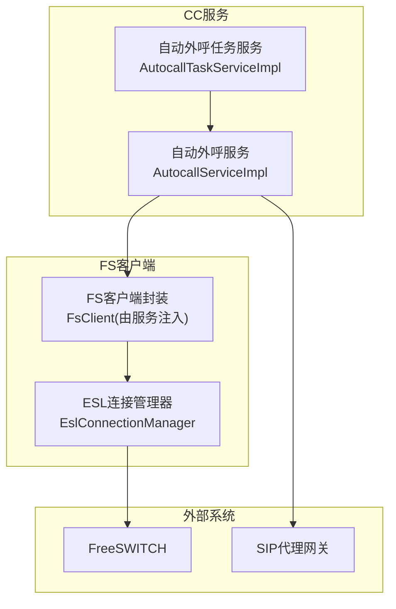
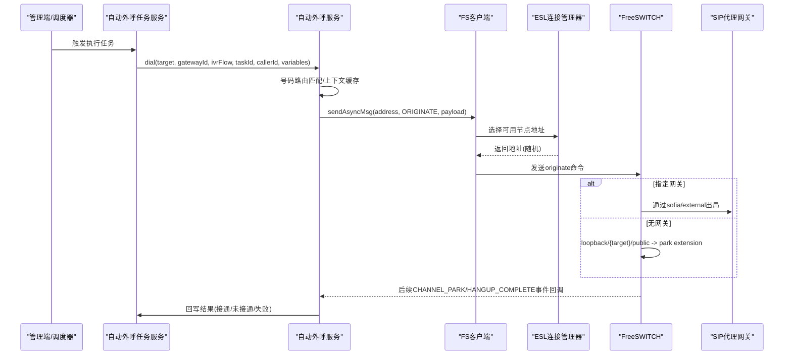
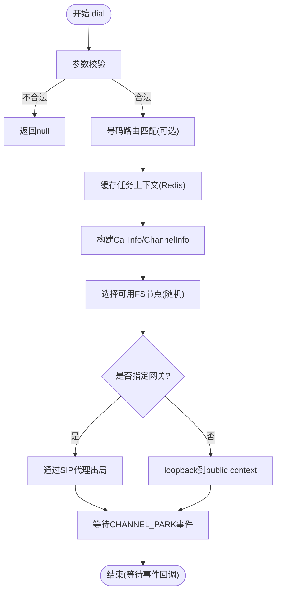
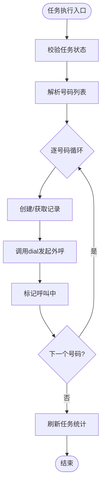
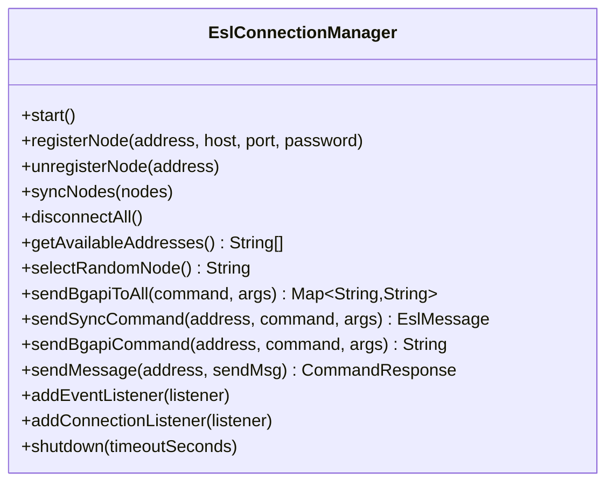
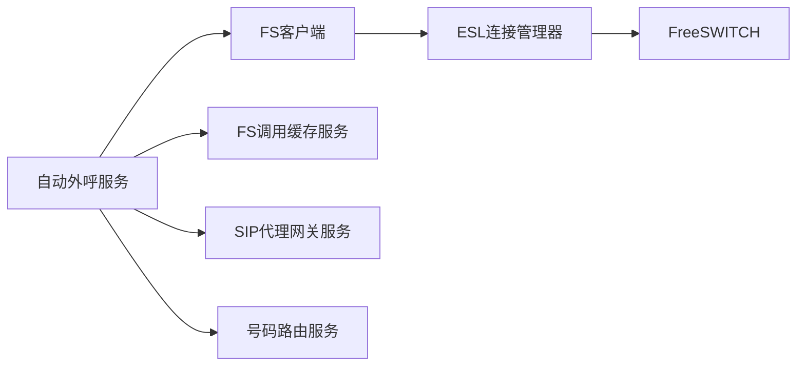

# 拨号策略

<cite>
**本文引用的文件**
- [EslConnectionManager.java](file://yudao-cloud/yudao-module-cc/ipcc-fs-esl/src/main/java/cn/ipcc/fs/esl/EslConnectionManager.java)
- [AutocallServiceImpl.java](file://yudao-cloud/yudao-module-cc/yudao-module-cc-server/src/main/java/cn/iocoder/yudao/module/cc/service/call/AutocallServiceImpl.java)
- [AutocallTaskServiceImpl.java](file://yudao-cloud/yudao-module-cc/yudao-module-cc-server/src/main/java/cn/iocoder/yudao/module/cc/service/autocall/AutocallTaskServiceImpl.java)
</cite>

## 目录
1. [简介](#简介)
2. [项目结构](#项目结构)
3. [核心组件](#核心组件)
4. [架构总览](#架构总览)
5. [详细组件分析](#详细组件分析)
6. [依赖关系分析](#依赖关系分析)
7. [性能考虑](#性能考虑)
8. [故障排查指南](#故障排查指南)
9. [结论](#结论)
10. [附录](#附录)

## 简介
本文件面向拨号策略系统，系统性阐述拨号算法、重试与退避、失败处理、与FreeSWITCH的集成及ESL事件处理、并发与资源控制、以及配置与调优建议。文档基于仓库中已实现的自动外呼服务与ESL连接管理代码进行归纳与提炼，确保与实际实现一致并可追溯。

## 项目结构
围绕拨号策略的关键代码分布在两个模块：
- ipcc-fs-esl：提供FreeSWITCH ESL多节点连接管理与负载均衡选择能力
- yudao-module-cc-server：提供自动外呼任务编排、号码路由匹配、通道变量透传、与SIP代理网关集成等拨号业务逻辑

图表来源
- [AutocallServiceImpl.java:103-328](file://yudao-cloud/yudao-module-cc/yudao-module-cc-server/src/main/java/cn/iocoder/yudao/module/cc/service/call/AutocallServiceImpl.java#L103-L328)
- [AutocallTaskServiceImpl.java:183-243](file://yudao-cloud/yudao-module-cc/yudao-module-cc-server/src/main/java/cn/iocoder/yudao/module/cc/service/autocall/AutocallTaskServiceImpl.java#L183-L243)
- [EslConnectionManager.java:132-139](file://yudao-cloud/yudao-module-cc/ipcc-fs-esl/src/main/java/cn/ipcc/fs/esl/EslConnectionManager.java#L132-L139)

章节来源
- [AutocallServiceImpl.java:103-328](file://yudao-cloud/yudao-module-cc/yudao-module-cc-server/src/main/java/cn/iocoder/yudao/module/cc/service/call/AutocallServiceImpl.java#L103-L328)
- [AutocallTaskServiceImpl.java:183-243](file://yudao-cloud/yudao-module-cc/yudao-module-cc-server/src/main/java/cn/iocoder/yudao/module/cc/service/autocall/AutocallTaskServiceImpl.java#L183-L243)
- [EslConnectionManager.java:132-139](file://yudao-cloud/yudao-module-cc/ipcc-fs-esl/src/main/java/cn/ipcc/fs/esl/EslConnectionManager.java#L132-L139)

## 核心组件
- 自动外呼服务（AutocallServiceImpl）
  - 负责参数校验、号码路由匹配、任务上下文缓存、构建CallInfo/ChannelInfo、发起ESL originate命令，并支持通过SIP代理或loopback兜底出局
- 自动外呼任务服务（AutocallTaskServiceImpl）
  - 负责任务创建、执行、暂停、取消、统计刷新与定时扫描执行；将任务拆分为逐号码记录并调用自动外呼服务发起呼叫
- ESL连接管理器（EslConnectionManager）
  - 维护多个FS节点的ESL连接，提供随机选择可用节点、批量bgapi发送、节点同步与优雅关闭等能力

章节来源
- [AutocallServiceImpl.java:103-328](file://yudao-cloud/yudao-module-cc/yudao-module-cc-server/src/main/java/cn/iocoder/yudao/module/cc/service/call/AutocallServiceImpl.java#L103-L328)
- [AutocallTaskServiceImpl.java:89-243](file://yudao-cloud/yudao-module-cc/yudao-module-cc-server/src/main/java/cn/iocoder/yudao/module/cc/service/autocall/AutocallTaskServiceImpl.java#L89-L243)
- [EslConnectionManager.java:31-139](file://yudao-cloud/yudao-module-cc/ipcc-fs-esl/src/main/java/cn/ipcc/fs/esl/EslConnectionManager.java#L31-L139)

## 架构总览
拨号流程从任务调度到最终接通/挂断的整体时序如下：

图表来源
- [AutocallTaskServiceImpl.java:183-243](file://yudao-cloud/yudao-module-cc/yudao-module-cc-server/src/main/java/cn/iocoder/yudao/module/cc/service/autocall/AutocallTaskServiceImpl.java#L183-L243)
- [AutocallServiceImpl.java:103-328](file://yudao-cloud/yudao-module-cc/yudao-module-cc-server/src/main/java/cn/iocoder/yudao/module/cc/service/call/AutocallServiceImpl.java#L103-L328)
- [EslConnectionManager.java:132-139](file://yudao-cloud/yudao-module-cc/ipcc-fs-esl/src/main/java/cn/ipcc/fs/esl/EslConnectionManager.java#L132-L139)

## 详细组件分析

### 自动外呼服务（AutocallServiceImpl）
- 拨号入口与参数校验
  - 必填项：被叫号码、任务ID；可选：网关ID、IVR流程ID、主叫号码、业务变量
- 号码路由匹配
  - 当未显式指定IVR流程时，按被叫号码匹配呼出类型路由表，取level最高的路由作为IVR流程
- 任务上下文缓存
  - 使用Redis缓存任务上下文（包含taskId、ivrFlow、variables、状态、开始时间、租户ID），TTL为24小时，供后续事件线程恢复租户上下文
- 通道信息构建与持久化
  - 生成callId与uniqueId，构建CallInfo与ChannelInfo，保存至FS调用缓存，用于后续事件关联与CDR隔离
- 发起originate命令
  - 通过FS客户端异步发送originate，携带通道变量（如task_id、ivr_flow、ASR开关、编解码等）
  - 路由策略：
    - 指定网关：通过SIP代理出局（sofia/external/{target}@{sipProxyAddr}），附加X-Gateway-Id头
    - 未指定网关：loopback/{target}/public进入public context的park extension，触发CHANNEL_PARK事件以驱动IVR
- 结果回写
  - 后续挂断事件回调通过callId定位记录并更新状态（接通/未接通/失败）

图表来源
- [AutocallServiceImpl.java:103-328](file://yudao-cloud/yudao-module-cc/yudao-module-cc-server/src/main/java/cn/iocoder/yudao/module/cc/service/call/AutocallServiceImpl.java#L103-L328)

章节来源
- [AutocallServiceImpl.java:103-328](file://yudao-cloud/yudao-module-cc/yudao-module-cc-server/src/main/java/cn/iocoder/yudao/module/cc/service/call/AutocallServiceImpl.java#L103-L328)

### 自动外呼任务服务（AutocallTaskServiceImpl）
- 任务生命周期
  - 创建：解析号码列表、去重、初始化默认优先级与计数
  - 执行：校验状态、更新为执行中、拆分号码、逐条创建记录并调用dial发起外呼，标记“呼叫中”
  - 暂停/取消：限制状态转换，仅停止后续号码发起，不影响已发起呼叫
  - 统计刷新：根据记录状态汇总成功/失败/总数，并在全部完结后标记任务完成
- 调度执行
  - 定时扫描到期任务，按租户上下文逐个执行，异常不影响其他租户与任务
- 结果回写
  - 挂断事件回调通过callId更新记录状态，并刷新任务统计

图表来源
- [AutocallTaskServiceImpl.java:183-243](file://yudao-cloud/yudao-module-cc/yudao-module-cc-server/src/main/java/cn/iocoder/yudao/module/cc/service/autocall/AutocallTaskServiceImpl.java#L183-L243)

章节来源
- [AutocallTaskServiceImpl.java:89-243](file://yudao-cloud/yudao-module-cc/yudao-module-cc-server/src/main/java/cn/iocoder/yudao/module/cc/service/autocall/AutocallTaskServiceImpl.java#L89-L243)

### ESL连接管理器（EslConnectionManager）
- 多节点管理
  - 注册/移除节点、批量同步节点列表、断开所有连接
- 节点选择策略
  - 提供随机选择可用节点的能力，用于负载均衡
- 命令发送
  - 支持向所有节点发送bgapi命令、向指定节点发送同步/异步命令
- 事件与连接监听
  - 统一添加事件监听器与连接生命周期监听器，对新注册节点自动生效
- 优雅关闭
  - 提供带超时控制的关闭流程

图表来源
- [EslConnectionManager.java:31-254](file://yudao-cloud/yudao-module-cc/ipcc-fs-esl/src/main/java/cn/ipcc/fs/esl/EslConnectionManager.java#L31-L254)

章节来源
- [EslConnectionManager.java:31-254](file://yudao-cloud/yudao-module-cc/ipcc-fs-esl/src/main/java/cn/ipcc/fs/esl/EslConnectionManager.java#L31-L254)

## 依赖关系分析
- 自动外呼服务依赖：
  - FS客户端（FsClient）：用于发送originate等命令
  - FS调用缓存服务（FsCallCacheService）：用于保存/查询通话上下文
  - SIP代理网关服务（SipProxyGatewayService）：校验网关可用性
  - 号码路由服务（CallRouteService）：按被叫号码匹配呼出路由
- ESL连接管理器依赖：
  - 多EslConnection实例：代表各FS节点的ESL连接
  - Netty传输层（在EslConnection内部）：负责底层通信

图表来源
- [AutocallServiceImpl.java:103-328](file://yudao-cloud/yudao-module-cc/yudao-module-cc-server/src/main/java/cn/iocoder/yudao/module/cc/service/call/AutocallServiceImpl.java#L103-L328)
- [EslConnectionManager.java:132-139](file://yudao-cloud/yudao-module-cc/ipcc-fs-esl/src/main/java/cn/ipcc/fs/esl/EslConnectionManager.java#L132-L139)

章节来源
- [AutocallServiceImpl.java:103-328](file://yudao-cloud/yudao-module-cc/yudao-module-cc-server/src/main/java/cn/iocoder/yudao/module/cc/service/call/AutocallServiceImpl.java#L103-L328)
- [EslConnectionManager.java:132-139](file://yudao-cloud/yudao-module-cc/ipcc-fs-esl/src/main/java/cn/ipcc/fs/esl/EslConnectionManager.java#L132-L139)

## 性能考虑
- 并发控制
  - 自动外呼任务执行采用逐号码串行发起，避免瞬时高并发对FS造成压力；可通过任务调度频率与批次大小控制整体并发度
- 连接池与节点选择
  - ESL连接管理器维护多节点连接，并通过随机选择策略进行负载均衡，有助于分散单点压力
- 资源限制
  - 建议使用合理的originate通道变量（如编解码、ASR开关）减少不必要的资源占用
  - 合理设置FS侧的并发限制与队列长度，避免过载
- 异步处理
  - 通过bgapi/异步消息方式发起长耗时操作，避免阻塞调用线程

[本节为通用性能建议，不直接引用具体文件]

## 故障排查指南
- 常见错误场景与处理
  - 参数不完整：当被叫号码或任务ID为空时，直接返回失败，避免无效请求
  - 网关不存在或禁用：校验网关状态，若异常则终止本次拨号
  - 无可用FS连接：当无法选择到可用节点时，记录错误并终止
  - 号码路由未匹配且未指定IVR流程：返回失败，需检查路由配置
- 事件与结果回写
  - CHANNEL_PARK事件用于触发IVR流程；HANGUP_COMPLETE事件用于更新通话结果
  - 任务上下文缓存包含租户ID，确保事件线程能正确恢复租户上下文，避免CDR保存失败
- 日志定位
  - 关注自动外呼服务与任务服务的日志输出，包括路由匹配、网关校验、节点选择、originate发送等关键步骤

章节来源
- [AutocallServiceImpl.java:103-328](file://yudao-cloud/yudao-module-cc/yudao-module-cc-server/src/main/java/cn/iocoder/yudao/module/cc/service/call/AutocallServiceImpl.java#L103-L328)
- [AutocallTaskServiceImpl.java:183-243](file://yudao-cloud/yudao-module-cc/yudao-module-cc-server/src/main/java/cn/iocoder/yudao/module/cc/service/autocall/AutocallTaskServiceImpl.java#L183-L243)

## 结论
本拨号策略系统以自动外呼服务为核心，结合号码路由匹配、SIP代理网关与loopback兜底机制，实现了灵活可控的拨号路径。ESL连接管理器提供多节点管理与随机负载均衡，保障系统稳定性与扩展性。通过任务级拆分与异步处理，系统在并发与资源利用方面具备良好基础。实际部署中可结合FS侧并发限制与队列配置进一步优化性能。

[本节为总结性内容，不直接引用具体文件]

## 附录
- 拨号算法策略说明
  - 顺序拨号：当前实现为逐号码串行发起，属于顺序模式；如需并行，可在任务调度层引入批处理与并发控制
  - 随机拨号：ESL连接管理器提供随机选择可用节点，用于负载均衡
  - 负载均衡策略：基于可用节点集合的随机选择，简单有效；可扩展为加权轮询或基于负载指标的策略
- 重试机制与退避策略
  - 当前实现未在拨号入口内置重试逻辑；建议在任务调度层或网关层实现重试与指数退避，以提升成功率
- 失败处理逻辑
  - 网络超时、被叫忙、无应答等场景：通过FS事件回调区分不同挂断原因，并在记录中更新状态；建议在任务统计中细化失败分类以便分析
- 与FreeSWITCH集成与ESL事件
  - 通过ESL发送originate命令，使用通道变量传递任务上下文；FS侧通过park extension触发CHANNEL_PARK事件，挂断后触发HANGUP_COMPLETE事件
- 配置选项与调优指南
  - 号码路由：确保呼出类型路由配置完整，level优先级合理
  - 网关配置：启用/禁用状态与公网地址端口配置正确
  - FS并发与队列：根据硬件资源调整并发上限与队列长度
  - 通道变量：合理设置编解码、ASR开关等以减少资源消耗

[本节为通用配置与调优建议，不直接引用具体文件]